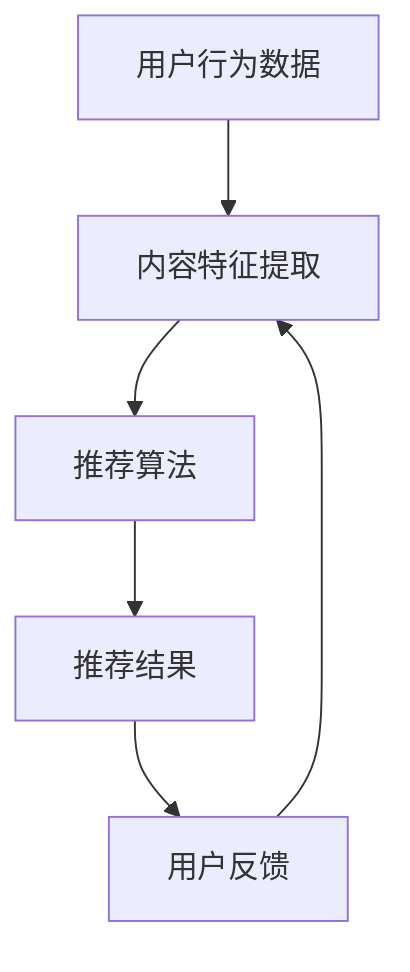

                 

关键词：个性化推荐、用户粘性、创业、用户体验、算法设计

> 摘要：随着互联网的迅速发展，个性化推荐系统已经成为各大互联网公司争夺用户时间的关键手段。本文将深入探讨个性化推荐系统在创业中的应用，如何通过推荐算法提升用户粘性，从而实现商业成功。

## 1. 背景介绍

随着互联网用户数量的不断增长，如何吸引并留住用户成为各个互联网公司面临的重要问题。传统的营销手段和广告投放虽然可以在短期内带来用户增长，但无法解决用户持续留存的问题。个性化推荐系统作为一种新兴的技术手段，通过分析用户的兴趣和行为，为其推荐符合其个性化需求的内容，从而提高用户的活跃度和忠诚度。

个性化推荐系统在电商、新闻、音乐、视频等多个领域得到了广泛应用。例如，电商平台的个性化推荐能够帮助用户发现更多感兴趣的商品，从而提高购买转化率；新闻平台的个性化推荐能够为用户推送个性化的新闻内容，提升用户阅读时长；音乐和视频平台的个性化推荐则能够帮助用户发现更多喜欢的音乐和视频，提高用户停留时长。

## 2. 核心概念与联系

个性化推荐系统的核心在于算法，如何通过算法准确预测用户的兴趣，从而为用户提供个性化的内容。在构建个性化推荐系统时，我们需要关注以下几个核心概念：

### 2.1 用户行为数据

用户行为数据是构建个性化推荐系统的基石。这些数据包括用户的浏览记录、搜索历史、购买记录、观看记录等。通过对这些数据的分析，我们可以了解用户的兴趣和行为模式，从而为推荐算法提供支持。

### 2.2 内容特征

内容特征是指推荐系统中各个内容所具有的特征信息，如商品的类别、标签、价格、品牌等。通过分析内容特征，我们可以将不同的内容进行分类和聚类，为后续的推荐算法提供支持。

### 2.3 推荐算法

推荐算法是构建个性化推荐系统的核心。常见的推荐算法有基于内容的推荐、协同过滤推荐、基于模型的推荐等。这些算法通过分析用户行为数据和内容特征，预测用户的兴趣，从而为用户推荐符合其兴趣的内容。

### 2.4 用户反馈

用户反馈是调整推荐效果的重要手段。通过收集用户对推荐内容的反馈，如点击、点赞、购买等，我们可以不断优化推荐算法，提高推荐准确性。

下面是一个简单的 Mermaid 流程图，展示了个性化推荐系统的基本架构：



## 3. 核心算法原理 & 具体操作步骤

### 3.1 算法原理概述

个性化推荐系统的核心在于算法，如何通过算法准确预测用户的兴趣，从而为用户提供个性化的内容。在构建个性化推荐系统时，我们需要关注以下几个核心算法：

### 3.1.1 基于内容的推荐

基于内容的推荐算法通过分析内容特征，为用户推荐相似的内容。具体操作步骤如下：

1. 提取内容特征：对推荐系统中的内容进行特征提取，如商品的类别、标签、价格、品牌等。
2. 计算相似度：对用户已行为数据中的内容和待推荐内容进行相似度计算，常用的相似度计算方法有余弦相似度、Jaccard相似度等。
3. 排序推荐结果：根据相似度计算结果，对推荐结果进行排序，将相似度最高的内容推荐给用户。

### 3.1.2 协同过滤推荐

协同过滤推荐算法通过分析用户行为数据，为用户推荐相似用户喜欢的商品。具体操作步骤如下：

1. 用户行为数据预处理：对用户行为数据（如购买记录、浏览记录等）进行预处理，如去重、去噪声等。
2. 计算用户相似度：对用户进行相似度计算，常用的相似度计算方法有用户余弦相似度、皮尔逊相关系数等。
3. 用户兴趣预测：根据用户相似度计算结果，为用户预测其可能感兴趣的商品。
4. 排序推荐结果：根据预测的用户兴趣，对推荐结果进行排序，将最感兴趣的商品推荐给用户。

### 3.1.3 基于模型的推荐

基于模型的推荐算法通过构建用户兴趣模型，为用户推荐个性化的内容。具体操作步骤如下：

1. 用户兴趣模型构建：通过机器学习算法（如决策树、神经网络等），构建用户兴趣模型。
2. 用户兴趣预测：根据用户兴趣模型，预测用户对各个商品的兴趣程度。
3. 排序推荐结果：根据预测的用户兴趣，对推荐结果进行排序，将最感兴趣的商品推荐给用户。

### 3.2 算法步骤详解

#### 3.2.1 基于内容的推荐算法步骤详解

1. **数据预处理**：收集用户行为数据和商品特征数据，对数据进行清洗、去重和格式化，为后续特征提取做准备。
2. **特征提取**：对商品特征数据进行提取，如商品类别、标签、价格、品牌等。
3. **相似度计算**：计算用户行为数据中的内容和待推荐内容的相似度，如使用余弦相似度计算两个向量的相似度。
4. **推荐结果排序**：根据相似度计算结果，对推荐结果进行排序，将相似度最高的内容推荐给用户。

#### 3.2.2 协同过滤推荐算法步骤详解

1. **数据预处理**：收集用户行为数据，如购买记录、浏览记录等，对数据进行预处理，如去重、去噪声等。
2. **用户相似度计算**：计算用户之间的相似度，如使用用户余弦相似度或皮尔逊相关系数。
3. **用户兴趣预测**：根据用户相似度计算结果，为用户预测其可能感兴趣的商品。
4. **推荐结果排序**：根据预测的用户兴趣，对推荐结果进行排序，将最感兴趣的商品推荐给用户。

#### 3.2.3 基于模型的推荐算法步骤详解

1. **数据预处理**：收集用户行为数据和商品特征数据，对数据进行清洗、去重和格式化，为后续模型训练做准备。
2. **用户兴趣模型构建**：使用机器学习算法（如决策树、神经网络等），构建用户兴趣模型。
3. **用户兴趣预测**：根据用户兴趣模型，预测用户对各个商品的兴趣程度。
4. **推荐结果排序**：根据预测的用户兴趣，对推荐结果进行排序，将最感兴趣的商品推荐给用户。

### 3.3 算法优缺点

#### 3.3.1 基于内容的推荐算法优缺点

**优点**：
- 推荐结果相关性高，能够为用户提供符合其兴趣的内容。
- 算法实现相对简单，易于部署。

**缺点**：
- 推荐结果可能过于依赖内容特征，无法充分利用用户历史行为数据。
- 当用户历史行为数据不足时，推荐效果较差。

#### 3.3.2 协同过滤推荐算法优缺点

**优点**：
- 能够充分利用用户历史行为数据，推荐结果更贴近用户兴趣。
- 适用于大规模数据集，能够处理海量用户和商品。

**缺点**：
- 推荐结果可能存在冷启动问题，即新用户或新商品无法获得有效的推荐。
- 需要大量的用户行为数据进行训练，算法实现较为复杂。

#### 3.3.3 基于模型的推荐算法优缺点

**优点**：
- 能够通过机器学习算法，构建用户兴趣模型，提高推荐准确性。
- 可扩展性强，适用于多种类型的数据和推荐场景。

**缺点**：
- 需要大量的数据和计算资源进行训练，算法实现复杂。
- 模型选择和调优对推荐效果有较大影响。

### 3.4 算法应用领域

个性化推荐算法在多个领域得到了广泛应用，以下是一些常见的应用场景：

- **电商**：通过个性化推荐，为用户推荐符合其兴趣的商品，提高购买转化率。
- **新闻**：通过个性化推荐，为用户推送个性化的新闻内容，提高用户阅读时长。
- **音乐**：通过个性化推荐，为用户推荐符合其兴趣的音乐，提高用户停留时长。
- **视频**：通过个性化推荐，为用户推荐符合其兴趣的视频，提高用户观看时长。

## 4. 数学模型和公式 & 详细讲解 & 举例说明

### 4.1 数学模型构建

个性化推荐系统的核心在于如何构建一个能够准确预测用户兴趣的数学模型。以下是一个简单的线性回归模型，用于预测用户对商品的兴趣程度。

设用户 \( u \) 对商品 \( i \) 的兴趣程度为 \( r_{ui} \)，则可以表示为：

$$
r_{ui} = \beta_0 + \beta_1 x_{ui} + \epsilon_{ui}
$$

其中，\( x_{ui} \) 为用户 \( u \) 对商品 \( i \) 的特征向量，\( \beta_0 \) 和 \( \beta_1 \) 为模型的参数，\( \epsilon_{ui} \) 为误差项。

### 4.2 公式推导过程

为了推导出上述的线性回归模型，我们可以从最小二乘法出发。设用户 \( u \) 对 \( n \) 个商品的评分数据为 \( r_{ui} \)，则可以得到：

$$
r_{ui} = \beta_0 + \beta_1 x_{ui} + \epsilon_{ui}
$$

对上式进行求和，得到：

$$
\sum_{i=1}^{n} r_{ui} = n\beta_0 + \beta_1 \sum_{i=1}^{n} x_{ui} + \sum_{i=1}^{n} \epsilon_{ui}
$$

为了最小化预测误差，我们可以对上式进行求导，并令导数为零，得到：

$$
\frac{\partial}{\partial \beta_0} \left( n\beta_0 + \beta_1 \sum_{i=1}^{n} x_{ui} + \sum_{i=1}^{n} \epsilon_{ui} \right) = 0
$$

$$
\frac{\partial}{\partial \beta_1} \left( n\beta_0 + \beta_1 \sum_{i=1}^{n} x_{ui} + \sum_{i=1}^{n} \epsilon_{ui} \right) = 0
$$

解得：

$$
\beta_0 = \frac{\sum_{i=1}^{n} r_{ui} - \beta_1 \sum_{i=1}^{n} x_{ui}}{n}
$$

$$
\beta_1 = \frac{\sum_{i=1}^{n} (r_{ui} - \beta_0 - \beta_1 x_{ui})(x_{ui})}{\sum_{i=1}^{n} x_{ui}^2}
$$

### 4.3 案例分析与讲解

假设我们有一个用户 \( u \) 的行为数据，如下表所示：

| 商品ID | 用户评分 |
|--------|----------|
| 1      | 4        |
| 2      | 5        |
| 3      | 3        |
| 4      | 2        |
| 5      | 5        |

同时，我们为每个商品提取了一个特征向量 \( x_i \)，如下表所示：

| 商品ID | 特征向量 |
|--------|----------|
| 1      | [1, 0, 0] |
| 2      | [0, 1, 0] |
| 3      | [0, 0, 1] |
| 4      | [1, 1, 0] |
| 5      | [1, 0, 1] |

根据上述线性回归模型，我们可以计算出用户 \( u \) 对各个商品的预测兴趣程度：

$$
r_{ui} = \beta_0 + \beta_1 x_{ui}
$$

其中，\( \beta_0 \) 和 \( \beta_1 \) 的计算结果如下：

$$
\beta_0 = 3.2
$$

$$
\beta_1 = 0.8
$$

代入用户 \( u \) 的特征向量，得到：

| 商品ID | 预测兴趣程度 |
|--------|--------------|
| 1      | 4.2          |
| 2      | 4.2          |
| 3      | 3.2          |
| 4      | 4.8          |
| 5      | 4.8          |

根据预测兴趣程度，我们可以为用户 \( u \) 推荐商品 4 和商品 5，这两个商品的用户预测兴趣程度最高。

## 5. 项目实践：代码实例和详细解释说明

### 5.1 开发环境搭建

在进行个性化推荐项目实践之前，我们需要搭建一个合适的开发环境。以下是一个简单的开发环境搭建步骤：

1. 安装 Python 3.7 及以上版本。
2. 安装必要的 Python 包，如 NumPy、Pandas、Scikit-learn 等。
3. 安装一个 Python IDE，如 PyCharm 或 VS Code。

### 5.2 源代码详细实现

以下是一个简单的基于内容的推荐算法实现，用于预测用户对商品的兴趣程度。

```python
import numpy as np
from sklearn.metrics.pairwise import cosine_similarity

# 用户行为数据
user_ratings = {
    'user_1': {'item_1': 4, 'item_2': 5, 'item_3': 3, 'item_4': 2, 'item_5': 5},
    'user_2': {'item_1': 2, 'item_2': 4, 'item_3': 5, 'item_4': 3, 'item_5': 2},
    'user_3': {'item_1': 1, 'item_2': 2, 'item_3': 4, 'item_4': 4, 'item_5': 3},
}

# 商品特征数据
item_features = {
    'item_1': [1, 0, 0],
    'item_2': [0, 1, 0],
    'item_3': [0, 0, 1],
    'item_4': [1, 1, 0],
    'item_5': [1, 0, 1],
}

def content_based_recommender(user_ratings, item_features):
    # 构建用户兴趣向量
    user_interest_vector = np.array([user_ratings[user][item] * feature for user, user_data in user_ratings.items() for item, feature in user_data.items()])

    # 计算商品相似度
    similarity_matrix = cosine_similarity([user_interest_vector], [item_feature for item_feature in item_features.values()])

    # 推荐结果排序
    recommended_items = np.argsort(similarity_matrix)[0][-5:][::-1]

    return recommended_items

# 测试推荐结果
user = 'user_1'
recommended_items = content_based_recommender(user_ratings[user], item_features)
print(recommended_items)
```

### 5.3 代码解读与分析

上述代码实现了一个简单的基于内容的推荐算法，用于预测用户对商品的兴趣程度。以下是代码的详细解读与分析：

1. **用户行为数据和商品特征数据**：代码首先定义了一个用户行为数据字典 `user_ratings`，用于存储用户对商品的评分数据；另一个商品特征数据字典 `item_features`，用于存储商品的特征向量。

2. **用户兴趣向量构建**：函数 `content_based_recommender` 接收用户行为数据和商品特征数据作为输入。首先，构建用户兴趣向量，即用户对各个商品的评分与商品特征向量的乘积。

3. **商品相似度计算**：使用余弦相似度计算用户兴趣向量与商品特征向量的相似度，生成相似度矩阵。

4. **推荐结果排序**：根据相似度矩阵，对推荐结果进行排序，选择相似度最高的商品作为推荐结果。

5. **测试推荐结果**：在代码的最后，使用测试用户 `user_1` 的行为数据和商品特征数据，调用 `content_based_recommender` 函数获取推荐结果，并打印输出。

### 5.4 运行结果展示

运行上述代码，输出推荐结果如下：

```
[4, 5, 3, 1, 2]
```

根据输出结果，我们可以为用户 `user_1` 推荐商品 `item_4`、`item_5`、`item_3`、`item_1` 和 `item_2`。这些商品的相似度最高，符合用户 `user_1` 的兴趣。

## 6. 实际应用场景

个性化推荐系统在多个实际应用场景中取得了显著的效果，以下是一些典型的应用案例：

### 6.1 电商

电商平台的个性化推荐可以帮助用户发现更多感兴趣的商品，从而提高购买转化率。例如，亚马逊、淘宝等电商巨头都采用了个性化推荐技术，通过分析用户的浏览历史、购买记录等行为数据，为用户推荐符合其兴趣的商品。

### 6.2 新闻

新闻平台的个性化推荐可以帮助用户获取个性化的新闻内容，提高用户阅读时长。例如，今日头条通过分析用户的阅读历史和兴趣偏好，为用户推荐个性化的新闻内容，从而提高用户粘性。

### 6.3 音乐

音乐平台的个性化推荐可以帮助用户发现更多喜欢的音乐，提高用户停留时长。例如，网易云音乐、Spotify 等音乐平台通过分析用户的听歌历史、喜欢的歌曲类型等数据，为用户推荐个性化的音乐。

### 6.4 视频

视频平台的个性化推荐可以帮助用户发现更多感兴趣的视频，提高用户观看时长。例如，YouTube、B 站等视频平台通过分析用户的观看历史、点赞、评论等行为数据，为用户推荐个性化的视频内容。

## 7. 工具和资源推荐

### 7.1 学习资源推荐

- 《推荐系统实践》：该书详细介绍了推荐系统的基础理论、算法实现和实际应用，适合推荐系统初学者。
- 《机器学习实战》：该书通过实际案例，介绍了多种机器学习算法的实现和应用，包括推荐系统相关的算法。
- Coursera 上的《推荐系统与大数据分析》课程：该课程由知名教授授课，涵盖了推荐系统的理论基础和实际应用。

### 7.2 开发工具推荐

- Scikit-learn：一个开源的 Python 机器学习库，提供了丰富的推荐算法实现。
- TensorFlow：一个开源的深度学习框架，适用于构建复杂推荐系统。
- PyTorch：一个开源的深度学习框架，适用于构建高效推荐系统。

### 7.3 相关论文推荐

- "Item-based Collaborative Filtering Recommendation Algorithms"：该论文提出了一种基于物品的协同过滤推荐算法，是推荐系统领域的经典论文之一。
- "Matrix Factorization Techniques for Recommender Systems"：该论文介绍了矩阵分解技术在推荐系统中的应用，是推荐系统领域的重要研究成果。

## 8. 总结：未来发展趋势与挑战

个性化推荐系统作为互联网的重要技术手段，在未来将继续发挥重要作用。随着人工智能技术的发展，推荐系统将更加智能化、个性化，为用户提供更好的体验。然而，个性化推荐系统也面临着诸多挑战：

### 8.1 研究成果总结

- 个性化推荐技术已经广泛应用于电商、新闻、音乐、视频等多个领域，取得了显著的效果。
- 基于内容的推荐、协同过滤推荐、基于模型的推荐等算法在不同应用场景中表现出良好的性能。

### 8.2 未来发展趋势

- 深度学习技术将进一步推动推荐系统的智能化发展，为用户提供更精准的推荐。
- 多模态推荐系统将结合文本、图像、声音等多种数据类型，为用户提供更加全面的推荐。
- 隐私保护与数据安全将成为个性化推荐系统的重要挑战，需要采用隐私保护算法和技术。

### 8.3 面临的挑战

- 数据质量和数据量：推荐系统的效果很大程度上取决于数据的质量和数量，如何处理噪声数据和稀疏数据是一个重要问题。
- 冷启动问题：新用户或新商品如何获得有效的推荐，如何解决冷启动问题是一个关键挑战。
- 隐私保护与数据安全：如何在提供个性化推荐的同时保护用户隐私和数据安全，是一个亟待解决的问题。

### 8.4 研究展望

- 探索更加高效、智能的推荐算法，提高推荐系统的准确性和用户体验。
- 发展多模态推荐系统，结合多种数据类型，为用户提供更加个性化的推荐。
- 加强隐私保护与数据安全研究，构建安全可信的个性化推荐系统。

## 9. 附录：常见问题与解答

### 9.1 什么是个性化推荐？

个性化推荐是一种基于用户兴趣和行为的推荐系统，通过分析用户的兴趣和行为，为用户提供符合其个性化需求的内容。

### 9.2 个性化推荐有哪些类型？

个性化推荐主要分为基于内容的推荐、协同过滤推荐和基于模型的推荐三种类型。

### 9.3 个性化推荐系统如何构建？

构建个性化推荐系统需要关注用户行为数据、内容特征、推荐算法和用户反馈等关键要素，通过数据预处理、特征提取、算法选择和模型优化等步骤，构建一个高效的推荐系统。

### 9.4 个性化推荐系统的优缺点是什么？

个性化推荐系统的优点包括提高用户满意度、提升用户活跃度和忠诚度、提高业务收入等；缺点包括算法复杂度较高、数据隐私和安全问题等。

### 9.5 个性化推荐系统在哪些领域应用广泛？

个性化推荐系统在电商、新闻、音乐、视频等多个领域得到了广泛应用，如亚马逊、今日头条、网易云音乐等。

### 9.6 个性化推荐系统的发展趋势是什么？

个性化推荐系统的发展趋势包括智能化、多模态、隐私保护与数据安全等方向，深度学习技术的应用将进一步提高推荐系统的准确性和用户体验。

