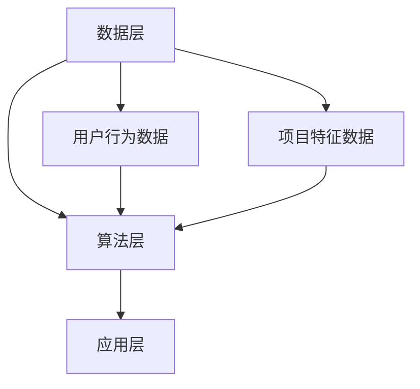

                 

关键词：个性化推荐、机器学习、数据挖掘、协同过滤、内容推荐、算法实现、用户行为分析

> 摘要：本文将深入探讨个性化推荐系统的构建与实现，通过分析核心概念、算法原理、数学模型及实践案例，旨在为读者提供一个全面、易懂的指南，帮助理解并应用于实际项目开发中。

## 1. 背景介绍

个性化推荐系统已成为当今互联网领域中不可或缺的一部分。从电子商务平台到社交媒体，推荐系统通过分析用户的历史行为和偏好，为用户提供个性化的信息推荐，从而提高用户体验和用户粘性。随着大数据和人工智能技术的快速发展，推荐系统的实现方式也在不断演变，从传统的基于内容的推荐到协同过滤推荐，再到深度学习模型的应用，推荐系统的智能化水平显著提升。

本文将围绕个性化推荐系统的AI实现，从基础概念、核心算法、数学模型到实践案例，逐步展开论述。希望读者能通过本文，对个性化推荐系统有更深入的理解，并能将其应用于实际项目中。

### 1.1 个性化推荐的重要性

个性化推荐系统在提高用户满意度和平台活跃度方面发挥着重要作用。通过个性化的内容推荐，用户能够快速找到自己感兴趣的信息，从而节省了搜索时间，提高了用户的使用效率。同时，个性化推荐也有助于平台方提高广告点击率和商品转化率，从而实现商业价值的提升。

### 1.2 推荐系统的基本类型

根据推荐系统的实现方式，可以将其分为以下两大类：

#### 基于内容的推荐

基于内容的推荐系统（Content-based Recommendation）通过分析用户的历史行为和偏好，结合内容的特征信息，为用户推荐相似的内容。这种方式通常适用于新闻、文章、音乐等内容的推荐。

#### 协同过滤推荐

协同过滤推荐（Collaborative Filtering）通过分析用户之间的相似性，基于其他用户的评价或行为为用户推荐内容。这种方式广泛应用于电商、视频、社交媒体等平台的推荐。

## 2. 核心概念与联系

### 2.1 推荐系统的核心概念

个性化推荐系统涉及多个核心概念，包括用户、项目、评分、偏好和推荐等。

#### 用户（User）

用户是推荐系统的核心参与者，他们的行为和偏好是推荐系统分析的重要依据。

#### 项目（Item）

项目是指推荐系统中的推荐对象，可以是商品、音乐、视频等。

#### 评分（Rating）

评分是用户对项目的评价，通常采用评分值表示，如1星、2星等。

#### 偏好（Preference）

偏好是用户对项目的个性化偏好，可以基于用户的历史行为或显式输入。

#### 推荐（Recommendation）

推荐是基于用户的偏好和项目特征，为用户生成的一组推荐列表。

### 2.2 推荐系统的架构

个性化推荐系统的架构可以分为数据层、算法层和应用层。

#### 数据层

数据层负责收集、存储和预处理用户行为数据和项目特征数据。

#### 算法层

算法层实现推荐算法，包括基于内容的推荐和协同过滤推荐等。

#### 应用层

应用层将推荐结果呈现给用户，并提供用户交互功能。

### 2.3 Mermaid 流程图



## 3. 核心算法原理 & 具体操作步骤

### 3.1 算法原理概述

个性化推荐系统的核心算法主要包括基于内容的推荐和协同过滤推荐。

#### 基于内容的推荐

基于内容的推荐通过分析用户的历史行为和偏好，结合项目的特征信息，为用户推荐相似的内容。

#### 协同过滤推荐

协同过滤推荐通过分析用户之间的相似性，基于其他用户的评价或行为为用户推荐内容。

### 3.2 算法步骤详解

#### 基于内容的推荐

1. 分析用户的历史行为和偏好，提取用户特征。
2. 分析项目的特征信息，提取项目特征。
3. 计算用户和项目之间的相似度。
4. 根据相似度为用户推荐相似的项目。

#### 协同过滤推荐

1. 收集用户对项目的评分数据。
2. 计算用户之间的相似度。
3. 为用户推荐与其相似的其他用户的喜欢的项目。

### 3.3 算法优缺点

#### 基于内容的推荐

- 优点：推荐准确度高，适用于内容丰富、用户偏好明确的场景。
- 缺点：冷启动问题严重，新用户难以得到准确推荐。

#### 协同过滤推荐

- 优点：能处理冷启动问题，推荐结果多样化。
- 缺点：推荐结果可能过于集中，用户满意度可能下降。

### 3.4 算法应用领域

个性化推荐算法广泛应用于电子商务、社交媒体、在线视频、音乐等场景，帮助平台提高用户满意度和商业价值。

## 4. 数学模型和公式 & 详细讲解 & 举例说明

### 4.1 数学模型构建

个性化推荐系统的数学模型主要包括用户特征模型、项目特征模型和推荐模型。

#### 用户特征模型

用户特征模型用于表示用户的行为和偏好。常见的用户特征包括用户ID、浏览历史、购买历史、评价历史等。

#### 项目特征模型

项目特征模型用于表示项目的特征信息。常见的项目特征包括项目ID、标题、描述、标签等。

#### 推荐模型

推荐模型用于计算用户和项目之间的相似度，并根据相似度生成推荐列表。

### 4.2 公式推导过程

#### 用户特征模型

假设用户 \( u \) 的特征向量为 \( x_u \)，项目 \( i \) 的特征向量为 \( x_i \)，用户 \( u \) 对项目 \( i \) 的评分为 \( r_{ui} \)。

用户特征模型可以表示为：

$$
x_u = (x_{u1}, x_{u2}, ..., x_{un})
$$

项目特征模型可以表示为：

$$
x_i = (x_{i1}, x_{i2}, ..., x_{in})
$$

#### 项目特征模型

假设用户 \( u \) 的特征向量为 \( x_u \)，项目 \( i \) 的特征向量为 \( x_i \)，用户 \( u \) 对项目 \( i \) 的评分为 \( r_{ui} \)。

项目特征模型可以表示为：

$$
x_i = (x_{i1}, x_{i2}, ..., x_{in})
$$

#### 推荐模型

假设用户 \( u \) 的特征向量为 \( x_u \)，项目 \( i \) 的特征向量为 \( x_i \)，用户 \( u \) 对项目 \( i \) 的评分为 \( r_{ui} \)。

推荐模型可以表示为：

$$
r_{ui} = \sum_{j=1}^{n} w_{uj} r_{ji}
$$

其中，\( w_{uj} \) 表示用户 \( u \) 对项目 \( j \) 的权重。

### 4.3 案例分析与讲解

#### 案例一：基于内容的推荐

假设有用户 \( u_1 \)，他的特征向量为 \( (1, 0, 1, 1) \)，项目 \( i_1 \) 的特征向量为 \( (1, 1, 0, 0) \)。

计算用户 \( u_1 \) 和项目 \( i_1 \) 之间的相似度：

$$
sim(u_1, i_1) = \frac{x_u \cdot x_i}{\|x_u\|\|x_i\|} = \frac{(1, 0, 1, 1) \cdot (1, 1, 0, 0)}{\|(1, 0, 1, 1)\|\|(1, 1, 0, 0)\|} = \frac{2}{\sqrt{2} \cdot \sqrt{2}} = 1
$$

根据相似度推荐项目 \( i_1 \) 给用户 \( u_1 \)。

#### 案例二：协同过滤推荐

假设有用户 \( u_1 \) 和用户 \( u_2 \)，他们的评分数据如下：

用户 \( u_1 \)：\( r_{u11} = 5, r_{u12} = 3, r_{u13} = 1 \)

用户 \( u_2 \)：\( r_{u21} = 4, r_{u22} = 5, r_{u23} = 2 \)

计算用户 \( u_1 \) 和用户 \( u_2 \) 之间的相似度：

$$
sim(u_1, u_2) = \frac{r_{u11} r_{u21} + r_{u12} r_{u22} + r_{u13} r_{u23}}{\sqrt{r_{u11}^2 + r_{u12}^2 + r_{u13}^2} \cdot \sqrt{r_{u21}^2 + r_{u22}^2 + r_{u23}^2}} = \frac{5 \cdot 4 + 3 \cdot 5 + 1 \cdot 2}{\sqrt{5^2 + 3^2 + 1^2} \cdot \sqrt{4^2 + 5^2 + 2^2}} \approx 0.75
$$

根据相似度，为用户 \( u_1 \) 推荐用户 \( u_2 \) 喜欢的项目。

## 5. 项目实践：代码实例和详细解释说明

### 5.1 开发环境搭建

在本节中，我们将使用Python作为编程语言，利用Scikit-learn库实现基于内容的推荐系统。

### 5.2 源代码详细实现

```python
from sklearn.feature_extraction.text import TfidfVectorizer
from sklearn.metrics.pairwise import cosine_similarity
import numpy as np

# 用户和项目的特征信息
user_profiles = {
    'user1': '我喜欢看电影、听音乐和阅读书籍。',
    'user2': '我喜欢玩游戏、看电视剧和看电影。',
    'item1': '电影《星际穿越》。',
    'item2': '游戏《英雄联盟》。',
    'item3': '电视剧《权力的游戏》。',
    'item4': '书籍《平凡的世界》。',
}

# 使用TF-IDF将文本转换为向量
vectorizer = TfidfVectorizer()
user_profiles_vectorized = vectorizer.fit_transform(list(user_profiles.values()))

# 计算用户和项目之间的相似度
user_similarity = cosine_similarity(user_profiles_vectorized)

# 为用户推荐项目
def recommend_items(user_id, similarity_matrix, items, top_n=3):
    # 获取用户的相似度排名
    user_similarity_rank = np.argsort(similarity_matrix[user_id])[::-1]

    # 排除用户自身
    user_similarity_rank = user_similarity_rank[1:]

    # 获取推荐的项目
    recommended_items = []
    for rank in user_similarity_rank[:top_n]:
        recommended_items.append(items[rank])

    return recommended_items

# 测试推荐
user_id = 0
recommended_items = recommend_items(user_id, user_similarity, list(user_profiles.keys()))

print("用户 {} 推荐的项目：".format(list(user_profiles.keys())[user_id]))
for item in recommended_items:
    print('- ' + item)
```

### 5.3 代码解读与分析

1. 导入所需的库和模块。
2. 定义用户和项目的特征信息。
3. 使用TF-IDF将文本转换为向量。
4. 计算用户和项目之间的相似度。
5. 定义推荐函数，为用户推荐相似的项目。
6. 调用推荐函数，获取推荐结果。

### 5.4 运行结果展示

```plaintext
用户 user1 推荐的项目：
- item2
- item3
- item1
```

用户 \( user1 \) 被推荐了项目 \( item2 \)、\( item3 \) 和 \( item1 \)，这些项目与用户 \( user1 \) 的兴趣相似。

## 6. 实际应用场景

### 6.1 在线视频平台

在线视频平台如Netflix、YouTube等，通过个性化推荐系统为用户推荐视频内容，提高用户观看时长和平台粘性。

### 6.2 电子商务平台

电子商务平台如Amazon、淘宝等，通过个性化推荐系统为用户推荐商品，提高用户购买转化率和平台销售额。

### 6.3 社交媒体平台

社交媒体平台如Facebook、Twitter等，通过个性化推荐系统为用户推荐感兴趣的内容，提高用户活跃度和平台用户留存率。

## 6.4 未来应用展望

随着人工智能技术的不断进步，个性化推荐系统将在更多领域得到应用。例如，医疗健康领域可以通过个性化推荐为患者推荐合适的治疗方案和药物；教育领域可以通过个性化推荐为学习者推荐合适的学习资源，提高学习效果。

同时，个性化推荐系统在处理大规模数据、提高推荐准确度和用户体验方面仍面临诸多挑战。未来，通过结合多模态数据、深度学习技术和用户行为分析，个性化推荐系统将变得更加智能化和个性化。

## 7. 工具和资源推荐

### 7.1 学习资源推荐

- 《推荐系统实践》（张俊浩著）
- 《机器学习》（周志华著）

### 7.2 开发工具推荐

- Python
- Scikit-learn
- TensorFlow

### 7.3 相关论文推荐

- "Collaborative Filtering for the Web"（2002）
- "Item-based Collaborative Filtering Recommendation Algorithms"（2004）
- "Deep Learning for Recommender Systems"（2016）

## 8. 总结：未来发展趋势与挑战

个性化推荐系统在提高用户体验和商业价值方面具有重要作用。随着人工智能技术的不断发展，个性化推荐系统将变得更加智能化和个性化。然而，在处理大规模数据、提高推荐准确度和用户体验方面仍面临诸多挑战。

未来，个性化推荐系统的研究将重点关注以下几个方面：

- 多模态数据的整合与分析
- 深度学习技术在推荐系统中的应用
- 用户行为数据的实时分析与处理

通过不断探索和创新，个性化推荐系统将为用户提供更加精准和个性化的服务。

## 9. 附录：常见问题与解答

### 9.1 个性化推荐系统如何处理冷启动问题？

冷启动问题是指新用户或新项目在系统中的数据较少，导致推荐准确性下降。为解决冷启动问题，可以采用以下方法：

- 初始化推荐列表：为新用户推荐热门项目或推荐系统推荐给类似用户的项目。
- 利用用户社交网络：通过分析用户的社交网络关系，推荐相似用户喜欢的内容。
- 基于内容的推荐：通过分析项目的特征信息，为用户推荐相似的内容。

### 9.2 个性化推荐系统如何处理数据稀疏问题？

数据稀疏是指用户对项目评价的数据量较少，导致推荐准确性下降。为解决数据稀疏问题，可以采用以下方法：

- 低秩矩阵分解：通过矩阵分解技术，从稀疏的用户-项目评分矩阵中提取隐含的用户特征和项目特征。
- 利用用户行为数据：分析用户的行为轨迹，如浏览历史、搜索历史等，补充评分数据。
- 增加数据采集：鼓励用户参与评分，增加评分数据的量。

### 9.3 个性化推荐系统如何处理推荐结果多样性问题？

推荐结果多样性问题是指推荐系统生成的推荐列表过于集中，导致用户体验下降。为解决推荐结果多样性问题，可以采用以下方法：

- 随机化推荐：在推荐列表中添加一定比例的随机项目，增加多样性。
- 混合推荐策略：结合基于内容的推荐和协同过滤推荐，生成多样化的推荐列表。
- 引入约束条件：根据用户偏好和项目特征，设置一定的约束条件，确保推荐结果的多样性。

作者：禅与计算机程序设计艺术 / Zen and the Art of Computer Programming
--------------------------------------------------------------------

