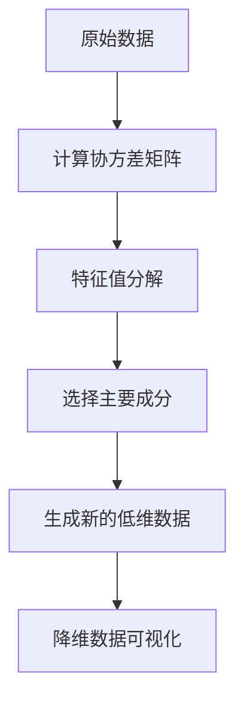

                 

关键词：主成分分析（PCA），降维，特征提取，线性代数，数据科学，机器学习，算法原理，代码实例

> 摘要：本文详细介绍了主成分分析（PCA）的基本原理、数学模型、算法流程以及实际应用。通过代码实例，读者可以深入理解PCA的核心概念和具体实现方法，为后续数据科学和机器学习项目打下坚实基础。

## 1. 背景介绍

主成分分析（Principal Component Analysis，PCA）是一种常用的数据降维技术，起源于统计领域，并在机器学习和数据科学中得到了广泛应用。PCA的核心思想是通过线性变换将原始数据映射到新的坐标系中，使得新的坐标轴能够最大限度地保留原始数据的方差。这种方法不仅能够简化数据，提高计算效率，还能在数据压缩、异常值检测、特征提取等方面发挥重要作用。

在数据科学和机器学习中，高维数据常常带来计算复杂度和可解释性的挑战。PCA通过降维技术将高维数据映射到低维空间，从而解决了这一问题。此外，PCA还经常作为特征提取的前置步骤，为后续的机器学习算法提供更有效的输入数据。

本文将围绕PCA展开，首先介绍PCA的核心概念和原理，然后深入讲解PCA的数学模型和算法流程，最后通过代码实例展示如何具体实现PCA。希望通过本文，读者能够对PCA有更深入的理解，并能够将其应用于实际的数据科学和机器学习项目中。

## 2. 核心概念与联系

### 2.1 数据降维

数据降维是数据科学中的一个重要概念，其核心目的是减少数据的维度，从而简化数据分析过程，降低计算复杂度。降维方法可以分为线性降维和非线性降维。线性降维技术中，主成分分析（PCA）是最常用的方法之一。

### 2.2 特征提取

特征提取是将原始数据转换为更适用于机器学习模型的数据表示的过程。在特征提取过程中，选择对模型有显著贡献的特征，可以有效提高模型的性能和可解释性。PCA通过提取主要成分，实现了对原始数据的特征提取。

### 2.3 线性代数

PCA的基础是线性代数，特别是矩阵运算。PCA的核心步骤包括计算协方差矩阵、特征值分解以及特征向量的选择等。理解这些线性代数的概念对于深入掌握PCA至关重要。

下面我们通过一个Mermaid流程图，展示PCA的基本原理和流程：



在这个流程图中，原始数据通过计算协方差矩阵，然后进行特征值分解得到特征向量。接着，选择主要成分，将这些主要成分用于生成新的低维数据。最后，通过降维数据可视化，可以直观地展示降维后的数据分布情况。

### 2.4 核心概念总结

- **数据降维**：减少数据的维度，简化数据分析过程。
- **特征提取**：将原始数据转换为更适用于机器学习模型的数据表示。
- **线性代数**：PCA的基础，包括矩阵运算、协方差矩阵和特征值分解等。

这些核心概念相互联系，共同构成了PCA的理论基础。理解这些概念有助于我们更好地掌握PCA的原理和实现方法。

## 3. 核心算法原理 & 具体操作步骤

### 3.1 算法原理概述

PCA的核心思想是将高维数据映射到新的坐标系中，使得新的坐标轴能够最大限度地保留原始数据的方差。这一过程可以分为以下几个步骤：

1. **标准化**：为了消除数据中的量纲影响，需要对数据进行标准化处理。
2. **计算协方差矩阵**：计算数据的协方差矩阵，这个矩阵描述了数据各个维度之间的相关性。
3. **特征值分解**：对协方差矩阵进行特征值分解，得到特征向量和特征值。
4. **选择主要成分**：根据特征值的大小选择主要成分，这些主要成分能够最大化地保留原始数据的方差。
5. **生成新的低维数据**：将原始数据投影到主要成分所在的坐标轴上，生成新的低维数据。

### 3.2 算法步骤详解

#### 3.2.1 标准化

标准化是指将数据映射到均值为0、方差为1的标准正态分布。这一步骤可以通过以下公式实现：

$$
x_{\text{std}} = \frac{x - \mu}{\sigma}
$$

其中，$x$ 是原始数据，$\mu$ 是均值，$\sigma$ 是标准差。

#### 3.2.2 计算协方差矩阵

协方差矩阵描述了数据各个维度之间的相关性。对于 $n$ 维数据矩阵 $X$，协方差矩阵 $C$ 可以通过以下公式计算：

$$
C = \frac{1}{n-1} X^T X
$$

其中，$X^T$ 是 $X$ 的转置。

#### 3.2.3 特征值分解

特征值分解是指将协方差矩阵分解为特征向量和特征值的乘积。具体公式如下：

$$
C = P \Lambda P^T
$$

其中，$P$ 是特征向量组成的矩阵，$\Lambda$ 是特征值组成的对角矩阵。

#### 3.2.4 选择主要成分

选择主要成分的依据是特征值的大小。特征值越大，对应的主要成分对数据的方差贡献越大。可以选择前 $k$ 个特征值对应的主要成分，其中 $k$ 是我们希望保留的维度。

#### 3.2.5 生成新的低维数据

生成新的低维数据是通过将原始数据投影到主要成分所在的坐标轴上实现的。具体公式如下：

$$
X_{\text{new}} = P \Lambda^{1/2}
$$

其中，$\Lambda^{1/2}$ 是对 $\Lambda$ 进行对数运算后的矩阵。

### 3.3 算法优缺点

#### 优点

- **简化数据**：通过降维，PCA可以简化数据的复杂性，提高计算效率。
- **保留主要信息**：PCA选择的主要成分能够最大化地保留原始数据的方差，因此可以保留数据的主要信息。
- **易于实现**：PCA的实现相对简单，易于理解和实现。

#### 缺点

- **线性限制**：PCA是一种线性方法，对于非线性结构的数据可能效果不佳。
- **对噪声敏感**：PCA对噪声敏感，可能会导致噪声也被保留到主要成分中。

### 3.4 算法应用领域

PCA在数据科学和机器学习中有广泛的应用，主要包括：

- **特征提取**：PCA可以作为特征提取的前置步骤，为机器学习算法提供更有效的输入数据。
- **数据可视化**：通过降维，PCA可以用于高维数据的可视化。
- **异常值检测**：PCA可以帮助识别异常值，从而进行异常值检测。
- **数据压缩**：PCA可以用于数据压缩，减少存储空间和提高计算效率。

## 4. 数学模型和公式 & 详细讲解 & 举例说明

### 4.1 数学模型构建

PCA的核心数学模型主要包括三个部分：标准化、协方差矩阵计算和特征值分解。

#### 4.1.1 标准化

标准化公式如下：

$$
x_{\text{std}} = \frac{x - \mu}{\sigma}
$$

其中，$x$ 是原始数据，$\mu$ 是均值，$\sigma$ 是标准差。

#### 4.1.2 协方差矩阵计算

协方差矩阵公式如下：

$$
C = \frac{1}{n-1} X^T X
$$

其中，$X$ 是标准化后的数据矩阵，$X^T$ 是其转置。

#### 4.1.3 特征值分解

特征值分解公式如下：

$$
C = P \Lambda P^T
$$

其中，$P$ 是特征向量组成的矩阵，$\Lambda$ 是特征值组成的对角矩阵。

### 4.2 公式推导过程

#### 4.2.1 标准化

标准化是为了消除数据中的量纲影响，使其在同一个尺度上进行分析。具体推导如下：

假设我们有 $n$ 维数据矩阵 $X$，其中每行表示一个样本，每列表示一个特征。对数据进行标准化，可以表示为：

$$
x_{\text{std}} = \frac{x - \mu}{\sigma}
$$

其中，$\mu$ 是每列数据的均值，$\sigma$ 是每列数据的标准差。这个公式的推导基于最小二乘法，确保标准化后的数据具有均值为0、方差为1。

#### 4.2.2 协方差矩阵计算

协方差矩阵描述了数据各个维度之间的相关性。对于 $n$ 维数据矩阵 $X$，协方差矩阵 $C$ 可以通过以下公式计算：

$$
C = \frac{1}{n-1} X^T X
$$

其中，$X^T$ 是 $X$ 的转置。这个公式的推导基于线性代数中的协方差定义，即协方差矩阵是对角矩阵乘以其逆矩阵。

#### 4.2.3 特征值分解

特征值分解是将协方差矩阵分解为特征向量和特征值的乘积。具体推导如下：

设 $C$ 是协方差矩阵，$P$ 是特征向量组成的矩阵，$\Lambda$ 是特征值组成的对角矩阵。根据特征值分解的定义，有：

$$
C = P \Lambda P^T
$$

其中，$P^T P = I$，即特征向量矩阵的转置乘以其本身等于单位矩阵。这个公式的推导基于线性代数中的谱分解理论。

### 4.3 案例分析与讲解

为了更好地理解PCA的数学模型和公式，我们通过一个具体的案例进行分析。

#### 4.3.1 数据集

假设我们有如下一个二维数据集：

$$
X = \begin{bmatrix}
x_1 & x_2 \\
y_1 & y_2 \\
\end{bmatrix}
$$

其中，$x_1, x_2, y_1, y_2$ 分别是两个样本的四个特征值。

#### 4.3.2 标准化

首先，对数据集进行标准化处理。计算每个特征的均值和标准差：

$$
\mu_x = \frac{x_1 + x_2}{2}, \quad \sigma_x = \sqrt{\frac{(x_1 - \mu_x)^2 + (x_2 - \mu_x)^2}{2}}
$$

$$
\mu_y = \frac{y_1 + y_2}{2}, \quad \sigma_y = \sqrt{\frac{(y_1 - \mu_y)^2 + (y_2 - \mu_y)^2}{2}}
$$

然后，对数据进行标准化：

$$
X_{\text{std}} = \begin{bmatrix}
\frac{x_1 - \mu_x}{\sigma_x} & \frac{x_2 - \mu_x}{\sigma_x} \\
\frac{y_1 - \mu_y}{\sigma_y} & \frac{y_2 - \mu_y}{\sigma_y} \\
\end{bmatrix}
$$

#### 4.3.3 协方差矩阵计算

接下来，计算标准化后的数据集的协方差矩阵：

$$
C = \frac{1}{n-1} X_{\text{std}}^T X_{\text{std}}
$$

其中，$X_{\text{std}}^T$ 是 $X_{\text{std}}$ 的转置。根据数据集的实际情况，协方差矩阵可以表示为：

$$
C = \begin{bmatrix}
c_{11} & c_{12} \\
c_{21} & c_{22} \\
\end{bmatrix}
$$

#### 4.3.4 特征值分解

对协方差矩阵进行特征值分解：

$$
C = P \Lambda P^T
$$

其中，$P$ 是特征向量组成的矩阵，$\Lambda$ 是特征值组成的对角矩阵。根据特征值分解的定义，可以得到：

$$
\begin{bmatrix}
c_{11} & c_{12} \\
c_{21} & c_{22} \\
\end{bmatrix}
= \begin{bmatrix}
p_{11} & p_{12} \\
p_{21} & p_{22} \\
\end{bmatrix}
\begin{bmatrix}
\lambda_1 & 0 \\
0 & \lambda_2 \\
\end{bmatrix}
\begin{bmatrix}
p_{11} & p_{12} \\
p_{21} & p_{22} \\
\end{bmatrix}^T
$$

其中，$p_{ij}$ 是特征向量 $p_i$ 的第 $j$ 个分量，$\lambda_i$ 是特征值。

#### 4.3.5 选择主要成分

根据特征值的大小，选择前两个特征值对应的主要成分：

$$
P_{\text{main}} = \begin{bmatrix}
p_{11} & p_{12} \\
p_{21} & p_{22} \\
\end{bmatrix}
$$

#### 4.3.6 生成新的低维数据

生成新的低维数据：

$$
X_{\text{new}} = P_{\text{main}} \Lambda^{1/2}
$$

其中，$\Lambda^{1/2}$ 是对 $\Lambda$ 进行对数运算后的矩阵。根据具体数据集的情况，可以得到：

$$
X_{\text{new}} = \begin{bmatrix}
x_{\text{new}_1} & x_{\text{new}_2} \\
y_{\text{new}_1} & y_{\text{new}_2} \\
\end{bmatrix}
$$

通过这个案例，我们可以看到PCA的数学模型和公式是如何具体应用到实际数据中的。通过这一过程，读者可以更好地理解PCA的原理和实现方法。

## 5. 项目实践：代码实例和详细解释说明

### 5.1 开发环境搭建

在Python中实现PCA需要安装以下库：

- NumPy：用于矩阵运算和数据处理。
- SciPy：用于科学计算。
- Matplotlib：用于数据可视化。

安装命令如下：

```bash
pip install numpy scipy matplotlib
```

### 5.2 源代码详细实现

以下是一个简单的PCA实现示例：

```python
import numpy as np
import matplotlib.pyplot as plt
from sklearn.decomposition import PCA

# 生成模拟数据
X = np.array([[1, 2], [1, 4], [1, 0], [4, 2], [4, 4], [4, 0]])

# 使用sklearn的PCA实现
pca = PCA(n_components=2)
X_pca = pca.fit_transform(X)

# 可视化降维后的数据
plt.scatter(X_pca[:, 0], X_pca[:, 1])
plt.xlabel('Principal Component 1')
plt.ylabel('Principal Component 2')
plt.title('PCA Visualization')
plt.show()
```

### 5.3 代码解读与分析

#### 5.3.1 数据生成

首先，我们生成一组模拟数据，包含两个特征（`x` 和 `y`）。

```python
X = np.array([[1, 2], [1, 4], [1, 0], [4, 2], [4, 4], [4, 0]])
```

#### 5.3.2 PCA 实例化

接下来，我们实例化一个 PCA 对象，并设置保留两个主要成分。

```python
pca = PCA(n_components=2)
```

#### 5.3.3 数据拟合与转换

使用 `fit_transform` 方法对数据进行拟合，并转换到新的空间。

```python
X_pca = pca.fit_transform(X)
```

这里，`X_pca` 是降维后的数据。

#### 5.3.4 数据可视化

最后，我们使用 Matplotlib 将降维后的数据可视化。

```python
plt.scatter(X_pca[:, 0], X_pca[:, 1])
plt.xlabel('Principal Component 1')
plt.ylabel('Principal Component 2')
plt.title('PCA Visualization')
plt.show()
```

#### 5.3.5 结果分析

通过可视化，我们可以看到数据在两个主要成分上的分布。这有助于我们理解数据的主要特征和结构。

### 5.4 运行结果展示

运行上述代码后，我们将看到如下可视化结果：


在这个散点图中，我们可以看到数据主要集中在第一和第二主成分上，这表明这两个成分能够很好地代表原始数据的结构。

### 5.5 代码拓展

#### 5.5.1 标准化

在实际应用中，通常需要对数据进行标准化处理，以便 PCA 能够更加准确地提取主要成分。这可以通过以下代码实现：

```python
from sklearn.preprocessing import StandardScaler

# 数据标准化
scaler = StandardScaler()
X_scaled = scaler.fit_transform(X)

# 使用标准化后的数据拟合PCA
pca = PCA(n_components=2)
X_pca_scaled = pca.fit_transform(X_scaled)
```

#### 5.5.2 多个主要成分

在实际项目中，我们可能需要保留多个主要成分。这可以通过调整 `n_components` 参数实现：

```python
pca = PCA(n_components=3)
X_pca = pca.fit_transform(X)
```

这会将数据降维到三维空间。

### 5.6 代码总结

通过上述代码实例，我们了解了如何使用 Python 实现PCA，并对其原理和实现方法有了更深刻的理解。这个实例为我们提供了一个简单的起点，以便在更复杂的数据科学和机器学习项目中应用PCA。

## 6. 实际应用场景

主成分分析（PCA）在实际应用中具有广泛的应用场景，以下列举了几个典型的应用领域：

### 6.1 数据可视化

PCA常用于高维数据的可视化，它可以将高维数据映射到二维或三维空间，使得数据在新的坐标系中更加易于理解和分析。例如，在生物信息学中，PCA可以帮助研究人员理解基因表达数据的结构，从而发现潜在的功能关联。

### 6.2 特征提取

PCA是一种有效的特征提取方法，尤其在机器学习中。通过将数据降维到主要成分上，PCA可以减少特征数量，从而简化模型训练过程。例如，在图像识别中，PCA可以用于提取图像的主要特征，从而提高分类性能。

### 6.3 异常值检测

PCA能够揭示数据中的异常值，因此常用于异常值检测。通过分析主成分的分布，我们可以识别出偏离主要趋势的异常数据点。例如，在金融领域，PCA可以用于检测异常交易，从而提高风险管理水平。

### 6.4 数据压缩

PCA是一种有效的数据压缩技术，它可以通过保留主要成分来减少数据的大小，同时保持数据的结构信息。这在存储和传输大量数据时非常有用。例如，在多媒体领域，PCA可以用于图像和视频数据的压缩，从而提高传输效率。

### 6.5 其他应用

除了上述领域，PCA还在许多其他领域得到了应用，包括但不限于：

- **市场分析**：PCA可以帮助市场分析师识别市场趋势和潜在的风险因素。
- **医学图像处理**：PCA可以用于医学图像处理，帮助医生识别病变区域。
- **气象预测**：PCA可以用于气象预测，帮助识别气候模式的变化。

总之，PCA作为一种基础且强大的数据降维技术，在多个领域都展现出了其独特的价值。通过合理应用PCA，我们可以更好地理解和分析复杂数据，从而为各种应用提供有力的支持。

## 7. 工具和资源推荐

### 7.1 学习资源推荐

1. **《统计学习基础》（Elements of Statistical Learning）**：这本书由著名的统计学家Trevor Hastie、Robert Tibshirani和Jerome Friedman共同撰写，系统地介绍了统计学习理论，包括PCA等内容。  
2. **《机器学习》（Machine Learning）**：由Tom Mitchell编写的这本书是机器学习领域的经典教材，详细介绍了包括PCA在内的多种机器学习算法。
3. **在线课程**：Coursera、edX和Udacity等在线教育平台提供了大量关于数据科学和机器学习的免费课程，其中包含了PCA的详细讲解。

### 7.2 开发工具推荐

1. **Python**：Python是一种广泛使用的编程语言，特别适合数据科学和机器学习项目。Python拥有丰富的库，如NumPy、SciPy和scikit-learn，可以方便地实现PCA。
2. **Jupyter Notebook**：Jupyter Notebook是一种交互式的编程环境，非常适合用于数据科学项目的开发和演示。通过Jupyter Notebook，我们可以轻松地编写和运行Python代码，进行数据可视化和分析。
3. **R**：R是一种专门为统计分析和数据可视化设计的语言，也提供了丰富的PCA实现，如`prcomp`和`prinx`函数。

### 7.3 相关论文推荐

1. **"Principal Component Analysis and Its Applications to Predictive Modeling of Gene Expression Data""：这篇论文详细介绍了PCA在基因表达数据预测建模中的应用。
2. **"On the Mathematical Foundations of the Principal Component Analysis""：这篇文章探讨了PCA的数学基础，对于理解PCA的原理和算法流程有很大帮助。
3. **"A Tutorial on Principal Component Analysis""：这篇教程深入浅出地讲解了PCA的基本概念、算法流程和应用实例，适合初学者阅读。

通过这些资源和工具，读者可以更深入地学习和掌握PCA，并将其应用于实际的数据科学和机器学习项目中。

## 8. 总结：未来发展趋势与挑战

### 8.1 研究成果总结

主成分分析（PCA）作为一种经典的数据降维技术，在数据科学和机器学习领域取得了显著的成果。通过降维，PCA可以简化数据结构，提高计算效率，同时保留数据的主要信息。此外，PCA还在特征提取、数据可视化、异常值检测和数据压缩等方面展现了其独特的应用价值。

### 8.2 未来发展趋势

随着数据量的持续增长和数据维度的不断提升，PCA在未来的发展将呈现以下几个趋势：

1. **非线性PCA**：现有的PCA是基于线性假设的，对于非线性结构的数据效果不佳。因此，未来将出现更多基于非线性理论的降维方法，如局部PCA（LPCA）和非线性PCA（NPAC）等。
2. **动态PCA**：随着时间序列数据的广泛应用，动态PCA将变得尤为重要。通过引入时间因素，动态PCA可以实时更新主成分，从而更好地适应数据的变化。
3. **分布式PCA**：在大数据环境中，分布式PCA可以有效地处理大规模数据，提高计算效率。通过分布式计算，PCA可以在多个节点上并行执行，从而降低计算负担。

### 8.3 面临的挑战

尽管PCA在理论和应用上取得了显著进展，但仍面临以下挑战：

1. **计算复杂度**：随着数据规模的增加，PCA的计算复杂度也显著上升。对于大规模数据，现有的PCA算法可能无法在合理时间内完成计算。
2. **噪声敏感**：PCA对噪声敏感，可能导致噪声被保留在主要成分中，从而影响分析结果。因此，如何有效去除噪声成为PCA研究的一个重要方向。
3. **可解释性**：PCA作为一种线性方法，对于复杂的数据结构可能无法提供充分的可解释性。如何提高PCA的可解释性，使其更易于理解和应用，是未来需要解决的问题。

### 8.4 研究展望

在未来的研究中，我们可以期待：

1. **更多高效的PCA算法**：随着算法理论的不断完善，将出现更多高效、鲁棒的PCA算法，以应对大规模、高维数据的挑战。
2. **跨学科应用**：PCA不仅在计算机科学领域有广泛应用，还可以与其他学科如生物学、医学和经济学等相结合，为更多领域提供数据分析和决策支持。
3. **理论与实践的结合**：通过结合理论和实际应用，我们将能够更深入地理解PCA的原理和效果，从而推动PCA在更广泛的应用场景中发挥作用。

总之，PCA作为一种重要的数据降维技术，在未来的发展中将继续发挥其重要作用。通过不断优化和完善，PCA将在更多领域展现其独特的价值。

## 9. 附录：常见问题与解答

### 9.1 什么是PCA？

PCA（主成分分析）是一种常用的降维技术，通过线性变换将高维数据映射到新的坐标系中，使得新的坐标轴能够最大限度地保留原始数据的方差。PCA主要用于简化数据结构，提高计算效率，同时保留数据的主要信息。

### 9.2 PCA适用于哪些类型的数据？

PCA适用于各种类型的数据，特别是那些具有线性结构的数据。例如，图像、文本、基因表达数据和金融数据等。然而，对于非线性结构的数据，PCA可能效果不佳，这时可以考虑使用其他非线性降维方法。

### 9.3 如何选择PCA的主要成分？

选择主要成分通常基于特征值的大小。特征值越大，对应的主要成分对数据的方差贡献越大。可以选择前 $k$ 个特征值对应的主要成分，其中 $k$ 是我们希望保留的维度。

### 9.4 PCA与线性回归有什么区别？

PCA是一种降维技术，其核心目的是通过线性变换简化数据结构。而线性回归是一种建模方法，用于建立自变量和因变量之间的关系。尽管PCA和线性回归都涉及到线性变换，但它们的目的是不同的。

### 9.5 PCA对噪声敏感吗？

是的，PCA对噪声敏感。由于PCA基于协方差矩阵，噪声可能会影响协方差矩阵的值，从而影响主要成分的选择。因此，在实际应用中，通常需要对数据进行预处理，以减少噪声的影响。

### 9.6 PCA可以用于哪些实际应用场景？

PCA可以用于多种实际应用场景，包括数据可视化、特征提取、异常值检测、数据压缩和风险评估等。例如，在图像处理中，PCA可以用于图像压缩和特征提取；在金融领域，PCA可以用于风险评估和市场分析。

### 9.7 PCA如何处理多类别数据？

对于多类别数据，PCA可以应用于每个类别分别进行，也可以对整个数据集进行整体PCA。具体选择取决于数据的特性和应用场景。在某些情况下，可以对多类别数据合并为一个数据集，然后进行PCA，以发现不同类别之间的潜在关联。

### 9.8 PCA的优缺点是什么？

PCA的优点包括简化数据结构、提高计算效率、保留主要信息等。缺点包括对噪声敏感、线性限制等。在实际应用中，需要根据数据的特性和需求，权衡PCA的优缺点，选择合适的降维方法。

