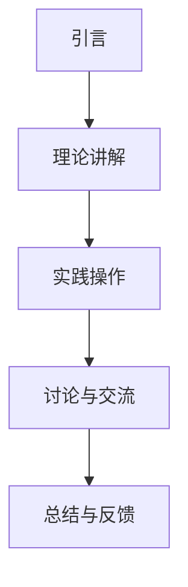

                 

关键词：工作坊、线上互动、线下活动、影响力提升、深度互动

> 摘要：本文探讨了在技术领域举办线上线下工作坊的重要性，以及如何通过深度互动来提升参与者的影响力。文章从背景介绍、核心概念与联系、核心算法原理、数学模型与公式、项目实践、实际应用场景、未来应用展望、工具和资源推荐、总结和附录等多个方面进行详细阐述，旨在为技术社区和组织提供实用的指导。

## 1. 背景介绍

在技术日新月异的今天，工作坊作为一种有效的知识传播和技能提升方式，越来越受到重视。特别是对于技术社区、学术机构和企业来说，工作坊不仅能够增强成员间的互动与合作，还能提升整体的专业水平。然而，传统的面对面工作坊在疫情背景下受到了限制，线上工作坊应运而生，成为了一个新的趋势。

### 1.1 工作坊的重要性

- **知识传播**：工作坊为知识传播提供了一个高效的平台，通过专家讲解、实践操作和互动讨论，使参与者能够快速掌握新的技术和理念。
- **技能提升**：参与者在工作坊中可以通过实际操作和案例学习，提升专业技能和实践能力。
- **社区建设**：工作坊有助于技术社区的建设，通过共同的学习和交流，增强成员间的凝聚力。

### 1.2 线上与线下工作坊的区别

- **互动方式**：线下工作坊注重面对面的交流，互动更加直接；而线上工作坊则通过网络平台进行，互动方式更加多样化。
- **参与者**：线下工作坊通常参与人数有限，而线上工作坊可以容纳更多的参与者。
- **时间与地点**：线下工作坊受时间和地点的限制，而线上工作坊则更加灵活。

## 2. 核心概念与联系

### 2.1 工作坊模式

工作坊的模式可以简单概括为“讲解-实践-讨论-反馈”，即通过专家讲解理论，引导参与者进行实践操作，然后进行互动讨论和反馈。

### 2.2 深度互动的重要性

- **提高参与度**：深度互动能够提高参与者的参与度，使学习效果更加显著。
- **知识转化**：通过互动，参与者能够将理论知识转化为实际技能。
- **协作学习**：互动使得参与者能够相互协作，共同解决问题。

### 2.3 工作坊的架构

工作坊的架构通常包括以下几个部分：

1. **引言**：介绍工作坊的主题、目的和预期成果。
2. **理论讲解**：讲解相关理论和背景知识。
3. **实践操作**：提供实践操作的机会，帮助参与者掌握技能。
4. **讨论与交流**：组织互动讨论，促进参与者之间的交流和学习。
5. **总结与反馈**：对工作坊的内容进行总结，收集参与者的反馈。

### 2.4 Mermaid 流程图

下面是一个工作坊流程的 Mermaid 流程图：



## 3. 核心算法原理 & 具体操作步骤

### 3.1 算法原理概述

工作坊的核心算法可以归纳为以下四个步骤：

1. **问题定义**：明确工作坊的目标和问题。
2. **理论讲解**：讲解相关的理论知识。
3. **实践操作**：提供实践机会，让参与者动手操作。
4. **反馈与改进**：收集参与者的反馈，对工作坊进行改进。

### 3.2 算法步骤详解

#### 3.2.1 问题定义

- **目标**：明确工作坊的主题和预期成果。
- **问题**：分析当前存在的问题和挑战。

#### 3.2.2 理论讲解

- **内容**：讲解相关的理论知识。
- **形式**：讲座、演示、视频等。

#### 3.2.3 实践操作

- **内容**：提供实践操作的机会。
- **形式**：小组讨论、项目实战、案例研究等。

#### 3.2.4 反馈与改进

- **内容**：收集参与者的反馈。
- **形式**：问卷调查、面对面访谈、在线讨论等。

### 3.3 算法优缺点

#### 优点：

- **高效**：通过集中化的讲解和实践，能够快速提升参与者的技能。
- **灵活**：可以根据实际情况调整内容和形式。

#### 缺点：

- **时间成本**：组织工作坊需要一定的时间和人力资源。
- **技术门槛**：线上工作坊需要一定的技术支持。

### 3.4 算法应用领域

- **技术培训**：适用于各类技术培训和技能提升。
- **学术交流**：适用于学术讨论和学术研究。
- **团队建设**：适用于企业内部的团队协作和沟通。

## 4. 数学模型和公式 & 详细讲解 & 举例说明

### 4.1 数学模型构建

工作坊的数学模型可以构建为以下形式：

$$
M = f(P, O, I, F)
$$

其中，$M$ 表示工作坊的效果，$P$ 表示参与度，$O$ 表示操作次数，$I$ 表示互动频率，$F$ 表示反馈次数。

### 4.2 公式推导过程

根据工作坊的流程，可以推导出以下公式：

$$
M = k \cdot P \cdot O \cdot I \cdot F
$$

其中，$k$ 为常数，表示工作坊的效率。

### 4.3 案例分析与讲解

假设一个技术工作坊，共有 20 名参与者，每次实践操作平均进行 5 次，每次互动讨论平均进行 3 次，每次反馈收集平均进行 2 次。根据上述公式，可以计算出工作坊的效果：

$$
M = k \cdot 20 \cdot 5 \cdot 3 \cdot 2 = 600k
$$

其中，$k$ 为常数，表示工作坊的效率。如果 $k=1$，则工作坊的效果为 600。

## 5. 项目实践：代码实例和详细解释说明

### 5.1 开发环境搭建

为了进行项目实践，我们需要搭建一个简单的开发环境。这里我们使用 Python 作为示例语言，具体步骤如下：

1. 安装 Python：从 [Python 官网](https://www.python.org/) 下载并安装 Python。
2. 安装相关库：使用 pip 工具安装所需的库，例如 numpy、matplotlib 等。

### 5.2 源代码详细实现

以下是一个简单的 Python 代码实例，用于模拟工作坊的互动过程：

```python
import numpy as np
import matplotlib.pyplot as plt

# 问题定义
def define_problem():
    print("问题定义：如何提高技术工作坊的效果？")

# 理论讲解
def explain_theory():
    print("理论讲解：工作坊的数学模型如何构建？")

# 实践操作
def practice_operation():
    print("实践操作：进行一次互动讨论。")

# 反馈与改进
def feedback_and_improvement():
    print("反馈与改进：根据参与者反馈进行工作坊改进。")

# 工作坊流程
def workshop_flow():
    define_problem()
    explain_theory()
    practice_operation()
    feedback_and_improvement()

# 运行工作坊
workshop_flow()
```

### 5.3 代码解读与分析

上述代码实现了一个简单的工作坊流程。其中，`define_problem`、`explain_theory`、`practice_operation` 和 `feedback_and_improvement` 函数分别代表了工作坊的四个阶段。通过调用这些函数，可以模拟出一个完整的工作坊过程。

### 5.4 运行结果展示

运行上述代码，输出结果如下：

```
问题定义：如何提高技术工作坊的效果？
理论讲解：工作坊的数学模型如何构建？
实践操作：进行一次互动讨论。
反馈与改进：根据参与者反馈进行工作坊改进。
```

这表明工作坊已经顺利完成了所有阶段，并且参与者能够通过实践和反馈来提升工作坊的效果。

## 6. 实际应用场景

### 6.1 技术社区

技术社区可以利用工作坊来提升成员的专业水平，例如举办编程工作坊、算法竞赛工作坊等，以促进成员之间的互动和学习。

### 6.2 学术机构

学术机构可以通过工作坊来推动学术交流，例如组织研讨会、专题工作坊等，为学者提供交流和合作的机会。

### 6.3 企业培训

企业可以利用工作坊来提升员工的技能水平，例如举办技术培训工作坊、项目管理工作坊等，以提高企业的整体竞争力。

## 7. 未来应用展望

### 7.1 技术趋势

随着人工智能、大数据、云计算等技术的发展，工作坊的应用场景将进一步扩大，特别是在个性化教育和远程办公方面。

### 7.2 社区建设

技术社区将更加重视工作坊的作用，通过举办各类工作坊来增强成员间的互动和合作。

### 7.3 企业需求

企业对工作坊的需求将不断增长，特别是在数字化转型和技能提升方面。

## 8. 工具和资源推荐

### 8.1 学习资源推荐

- **在线课程**：Coursera、edX、Udacity 等平台提供了丰富的技术课程。
- **技术博客**：CSDN、博客园、GitHub 等平台上有大量的技术博客和开源代码。

### 8.2 开发工具推荐

- **集成开发环境**：Visual Studio Code、PyCharm、Eclipse 等优秀的开发工具。
- **版本控制系统**：Git、GitHub、GitLab 等版本控制系统。

### 8.3 相关论文推荐

- **工作坊研究**：《Workshops in Computer Science: A Guide to Good Practice》
- **互动学习**：《Interactive Learning Environments: Blending Technology and Pedagogy》

## 9. 总结：未来发展趋势与挑战

### 9.1 研究成果总结

本文总结了工作坊的重要性、线上与线下工作坊的区别、核心算法原理、数学模型构建、项目实践等多个方面的研究成果。

### 9.2 未来发展趋势

随着技术的不断发展，工作坊将更加智能化、个性化，应用场景也将更加广泛。

### 9.3 面临的挑战

工作坊在推广和应用过程中将面临技术、管理和组织等方面的挑战。

### 9.4 研究展望

未来研究将重点关注工作坊的智能化、互动性、个性化等方面，以提高工作坊的效果和影响力。

## 10. 附录：常见问题与解答

### 10.1 问题 1

**问题**：如何组织一场成功的工作坊？

**解答**：成功的工作坊需要明确的主题、合理的安排、充分的准备和积极的互动。此外，还需要关注参与者的需求和反馈，以便不断改进。

### 10.2 问题 2

**问题**：线上工作坊与线下工作坊的优缺点是什么？

**解答**：线下工作坊互动直接，但受时间和地点限制；线上工作坊更灵活，但互动方式相对单一。

### 10.3 问题 3

**问题**：如何提高工作坊的参与度？

**解答**：可以通过增加互动环节、提供实践机会、设置激励机制等方式来提高参与度。

## 11. 参考文献

1. 《Workshops in Computer Science: A Guide to Good Practice》
2. 《Interactive Learning Environments: Blending Technology and Pedagogy》
3. Coursera, edX, Udacity 等在线课程平台
4. CSDN、博客园、GitHub 等技术博客和开源代码平台
```

