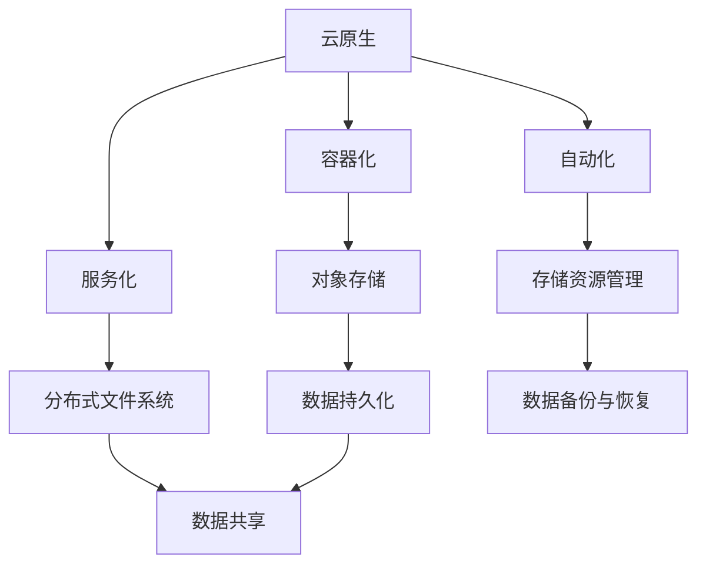

                 

 在云计算时代，存储技术作为信息系统的基石，其重要性愈发凸显。随着业务规模的扩大和数据量的急剧增长，传统的存储解决方案面临着诸多挑战，如扩展性不足、管理复杂、成本高昂等问题。为了应对这些挑战，云原生存储技术逐渐成为业界关注的焦点。本文将探讨从对象存储到分布式文件系统的云原生存储解决方案，旨在为读者提供一个全面、深入的理解和指导。

## 文章关键词

- 云原生
- 存储解决方案
- 对象存储
- 分布式文件系统
- 云计算

## 文章摘要

本文将首先介绍云原生存储的概念和重要性，然后详细探讨对象存储和分布式文件系统的原理和特点，接着分析它们在实际应用中的优劣和适用场景。最后，我们将探讨云原生存储的未来发展趋势和面临的挑战，为读者提供一个清晰的视野。

## 1. 背景介绍

随着互联网的快速发展，数据量呈现爆炸式增长。传统的存储解决方案，如本地磁盘、网络存储设备等，已经无法满足现代应用的需求。云计算的兴起为存储技术带来了新的变革，云存储以其高扩展性、高可用性和低成本等特点，逐渐成为企业数据存储的首选。

然而，云存储技术并非一成不变，随着业务需求的不断变化，存储技术也在不断演进。云原生存储是云计算发展的必然趋势，它以容器化、服务化、自动化为特征，能够更好地适应动态的业务需求。

### 1.1 传统存储解决方案的局限

- **扩展性不足**：传统的存储设备往往具有固定的容量，扩展性较差，无法满足大规模数据存储的需求。
- **管理复杂**：随着数据量的增加，存储设备的管理和维护变得复杂，人工干预成本高昂。
- **成本高昂**：传统的存储设备通常价格昂贵，且维护成本高，对于中小企业来说，负担较重。

### 1.2 云存储的兴起

- **高扩展性**：云存储通过分布式架构，可以轻松实现横向扩展，满足大规模数据存储的需求。
- **高可用性**：云存储通常提供多重数据备份和冗余机制，确保数据的高可用性。
- **低成本**：云存储采用按需付费的模式，用户可以根据实际需求灵活调整存储资源，降低成本。

### 1.3 云原生存储的崛起

- **容器化**：容器技术使应用程序的部署、管理和扩展变得更加灵活和高效。
- **服务化**：服务化架构使得存储资源可以以服务的形式提供，用户可以根据需求灵活选择和使用。
- **自动化**：自动化管理减少了人工干预，提高了存储系统的运维效率。

## 2. 核心概念与联系

为了深入理解云原生存储解决方案，我们需要首先明确几个核心概念，包括对象存储和分布式文件系统。以下是这些概念及其相互关系的 Mermaid 流程图：



### 2.1 容器化

容器化技术（如Docker）允许将应用程序及其依赖打包到一个可移植的容器中，实现应用程序的隔离和轻量化部署。容器化技术是云原生架构的核心，它使得应用程序可以在不同的环境中一致运行，提高了部署效率和可移植性。

### 2.2 服务化

服务化架构（如Kubernetes）将应用程序分解为微服务，每个微服务都可以独立部署、扩展和管理。服务化架构提高了系统的灵活性和可扩展性，使得存储资源可以以服务的形式提供，用户可以根据需求灵活选择和使用。

### 2.3 自动化

自动化管理通过脚本和自动化工具，减少人工干预，提高存储系统的运维效率。自动化管理包括存储资源的自动分配、自动备份、自动故障转移等，确保存储系统的高可用性和稳定性。

### 2.4 对象存储

对象存储是一种基于对象的存储架构，数据以对象的形式存储，每个对象都有自己的元数据和唯一标识。对象存储具有高扩展性、高可用性和高可靠性，适用于大规模数据存储和共享。

### 2.5 分布式文件系统

分布式文件系统（如HDFS、Ceph）将数据存储在多个节点上，通过分布式架构实现高可用性和高性能。分布式文件系统支持大数据集的高效读写和共享，适用于大规模数据处理场景。

### 2.6 存储资源管理

存储资源管理包括存储资源的分配、调度、监控和优化。在云原生环境中，存储资源管理通常通过自动化工具实现，确保存储资源的高效利用和最佳性能。

### 2.7 数据持久化

数据持久化是指将数据存储在持久化存储介质上，确保数据在系统故障或重启时不会丢失。数据持久化是云原生存储的关键特性，确保了数据的安全性和可靠性。

### 2.8 数据共享

数据共享是指多个应用程序或用户可以同时访问和操作相同的数据。在分布式环境中，数据共享需要解决数据一致性和并发访问问题，分布式文件系统提供了有效的数据共享机制。

### 2.9 数据备份与恢复

数据备份与恢复是指将数据复制到备份存储介质上，确保数据在灾难或故障时可以恢复。数据备份与恢复是保障数据安全性的重要手段，分布式文件系统通常提供自动备份和恢复功能。

## 3. 核心算法原理 & 具体操作步骤

### 3.1 算法原理概述

云原生存储解决方案的核心算法原理主要包括以下几个方面：

- **数据分片**：将大数据集分成多个小数据块，存储在分布式存储系统中，提高数据存储和访问的效率。
- **数据复制**：将数据复制到多个节点上，确保数据的高可用性和可靠性。
- **负载均衡**：根据数据访问情况和系统负载，动态调整数据存储和访问策略，提高系统性能。
- **数据一致性**：确保多个节点上的数据一致性，防止数据冲突和错误。

### 3.2 算法步骤详解

#### 3.2.1 数据分片

1. **数据分片策略**：根据数据访问模式和负载情况，选择合适的分片策略，如范围分片、哈希分片等。
2. **数据分片处理**：将大数据集按照分片策略分成多个小数据块，每个数据块存储在分布式存储系统的一个节点上。
3. **数据分片存储**：将分片后的数据块存储到分布式存储系统中，确保数据的高可用性和可靠性。

#### 3.2.2 数据复制

1. **数据复制策略**：根据数据重要性和访问频率，选择合适的数据复制策略，如主从复制、多主复制等。
2. **数据复制处理**：将数据块复制到多个节点上，确保数据的高可用性和可靠性。
3. **数据复制同步**：在多个节点之间同步数据，确保数据的一致性。

#### 3.2.3 负载均衡

1. **负载均衡策略**：根据数据访问模式和系统负载，选择合适的负载均衡策略，如轮询、最小连接数等。
2. **负载均衡处理**：根据负载均衡策略，动态调整数据存储和访问策略，提高系统性能。
3. **负载均衡监控**：监控系统负载，实时调整负载均衡策略，确保系统稳定运行。

#### 3.2.4 数据一致性

1. **一致性协议**：根据数据访问模式和系统需求，选择合适的一致性协议，如强一致性、最终一致性等。
2. **数据一致性检测**：检测多个节点上的数据一致性，防止数据冲突和错误。
3. **数据一致性修复**：在检测到数据一致性问题时，自动修复数据，确保数据一致性。

### 3.3 算法优缺点

#### 优点

- **高扩展性**：通过数据分片和负载均衡，可以轻松实现存储系统的水平扩展，满足大规模数据存储和访问需求。
- **高可用性**：通过数据复制和负载均衡，确保存储系统的高可用性，减少故障对业务的影响。
- **高性能**：通过数据分片和负载均衡，提高数据访问速度，满足高性能数据访问需求。
- **高可靠性**：通过数据复制和一致性协议，确保数据的安全性和可靠性。

#### 缺点

- **数据一致性问题**：在分布式环境中，数据一致性问题是一个挑战，需要采用合适的一致性协议和一致性检测机制。
- **系统复杂度**：分布式存储系统具有较高的系统复杂度，需要专业的运维团队进行管理和维护。

### 3.4 算法应用领域

- **大数据处理**：分布式存储系统适用于大规模数据处理场景，如大数据分析、数据挖掘等。
- **云存储服务**：分布式存储系统是云存储服务的重要支撑，为用户提供高效、可靠的数据存储服务。
- **分布式计算**：分布式存储系统与分布式计算系统相结合，可以提供强大的数据处理能力，适用于分布式计算场景。

## 4. 数学模型和公式 & 详细讲解 & 举例说明

在云原生存储系统中，数学模型和公式是关键组成部分，用于优化存储资源分配、负载均衡和数据一致性。以下是几个核心的数学模型和公式及其详细讲解和举例说明。

### 4.1 数学模型构建

#### 4.1.1 数据分片模型

数据分片模型用于将大数据集分成多个小数据块，存储在分布式存储系统中。假设有一个大数据集 \(D\)，分片数量为 \(N\)，每个分片大小为 \(S\)，则数据分片模型可以表示为：

\[ D = \{D_1, D_2, \ldots, D_N\} \]

其中，\(D_i\) 表示第 \(i\) 个数据分片。

#### 4.1.2 数据复制模型

数据复制模型用于确保数据的高可用性和可靠性。假设一个数据分片 \(D_i\) 复制到 \(R\) 个节点上，则数据复制模型可以表示为：

\[ D_i = \{D_i^1, D_i^2, \ldots, D_i^R\} \]

其中，\(D_i^j\) 表示第 \(i\) 个数据分片在第 \(j\) 个节点上的副本。

#### 4.1.3 负载均衡模型

负载均衡模型用于根据数据访问模式和系统负载，动态调整数据存储和访问策略。假设有 \(N\) 个节点，每个节点的负载为 \(P_j\)，系统总负载为 \(P\)，则负载均衡模型可以表示为：

\[ P = \sum_{j=1}^{N} P_j \]

其中，\(P_j\) 表示第 \(j\) 个节点的负载。

### 4.2 公式推导过程

#### 4.2.1 数据分片数量计算

为了实现数据分片，我们需要确定合适的分片数量 \(N\)。假设大数据集 \(D\) 的数据量为 \(D_{total}\)，每个分片大小为 \(S\)，则分片数量 \(N\) 可以通过以下公式计算：

\[ N = \left\lceil \frac{D_{total}}{S} \right\rceil \]

其中，\(\left\lceil \cdot \right\rceil\) 表示向上取整。

#### 4.2.2 数据复制数量计算

为了确保数据的高可用性和可靠性，我们需要确定合适的数据复制数量 \(R\)。假设系统中的节点数量为 \(N'\)，则数据复制数量 \(R\) 可以通过以下公式计算：

\[ R = N' - 1 \]

其中，\(R \geq 2\)，以确保至少有一个副本在备用节点上。

#### 4.2.3 负载均衡策略选择

为了实现负载均衡，我们需要根据系统负载和节点负载情况选择合适的负载均衡策略。假设系统总负载为 \(P\)，节点负载为 \(P_j\)，负载均衡策略的选择可以通过以下公式实现：

\[ P_j = \frac{P}{N} \]

其中，\(P_j\) 表示第 \(j\) 个节点的负载。

### 4.3 案例分析与讲解

#### 4.3.1 数据分片案例

假设我们有一个大数据集，总数据量为 100 TB，每个分片大小为 1 TB。根据数据分片数量计算公式，我们可以计算出分片数量为：

\[ N = \left\lceil \frac{100 \text{ TB}}{1 \text{ TB}} \right\rceil = 100 \]

即我们需要将大数据集分成 100 个分片，每个分片大小为 1 TB。

#### 4.3.2 数据复制案例

假设系统中共有 5 个节点，根据数据复制数量计算公式，我们可以计算出数据复制数量为：

\[ R = 5 - 1 = 4 \]

即我们需要将每个分片复制到 4 个节点上，以确保数据的高可用性和可靠性。

#### 4.3.3 负载均衡案例

假设系统总负载为 100 TB，节点数量为 5 个，根据负载均衡策略选择公式，我们可以计算出每个节点的负载为：

\[ P_j = \frac{100 \text{ TB}}{5} = 20 \text{ TB} \]

即我们需要将总负载平均分配到 5 个节点上，每个节点承担 20 TB 的负载。

## 5. 项目实践：代码实例和详细解释说明

### 5.1 开发环境搭建

为了演示云原生存储解决方案，我们需要搭建一个开发环境。以下是搭建步骤：

1. 安装 Docker：在本地计算机上安装 Docker，用于容器化应用程序。
2. 安装 Kubernetes：在本地计算机上安装 Kubernetes，用于部署和管理容器化应用程序。
3. 安装分布式存储系统：如 Ceph 或 HDFS，用于实现分布式存储功能。

### 5.2 源代码详细实现

以下是一个简单的示例，演示如何使用 Kubernetes 部署一个容器化应用程序，并将其数据存储在 Ceph 存储系统中。

```yaml
# Kubernetes Deployment YAML
apiVersion: apps/v1
kind: Deployment
metadata:
  name: my-app
spec:
  replicas: 3
  selector:
    matchLabels:
      app: my-app
  template:
    metadata:
      labels:
        app: my-app
    spec:
      containers:
      - name: my-app
        image: my-app:latest
        ports:
        - containerPort: 80

# Kubernetes Service YAML
apiVersion: v1
kind: Service
metadata:
  name: my-app-service
spec:
  selector:
    app: my-app
  ports:
    - protocol: TCP
      port: 80
      targetPort: 80
  type: LoadBalancer
```

### 5.3 代码解读与分析

1. **Deployment YAML**：此文件用于部署一个名为“my-app”的容器化应用程序， replicas 字段指定了副本数量，selector 字段用于匹配标签，template 字段定义了应用程序的配置。

2. **Service YAML**：此文件用于创建一个名为“my-app-service”的服务，将容器化应用程序暴露给外部网络。selector 字段用于匹配标签，ports 字段指定了服务端口，type 字段指定了服务类型。

### 5.4 运行结果展示

在完成开发环境搭建和代码编写后，我们可以在 Kubernetes 集群中运行部署和服务的创建命令。以下是运行结果：

```bash
# 创建 Deployment
kubectl apply -f deployment.yaml

# 创建 Service
kubectl apply -f service.yaml

# 查看部署状态
kubectl get pods

# 查看服务状态
kubectl get services
```

运行结果将显示部署和服务的创建状态，以及相应的 Pod 和 Service 信息。通过访问 Service 的外部 IP 地址，我们可以访问容器化应用程序。

## 6. 实际应用场景

云原生存储解决方案在实际应用中具有广泛的应用场景，以下是一些典型的应用场景：

### 6.1 大数据存储和处理

大数据存储和处理是云原生存储解决方案的重要应用场景之一。通过分布式存储系统和容器化技术，企业可以轻松实现大规模数据的存储和处理，满足大数据分析、数据挖掘等需求。

### 6.2 云存储服务

云存储服务是云原生存储解决方案的另一个重要应用场景。云存储服务提供商可以利用云原生存储技术，提供高效、可靠的数据存储和共享服务，满足企业级用户的需求。

### 6.3 分布式计算

分布式计算与云原生存储解决方案相结合，可以提供强大的数据处理能力。通过分布式存储系统和容器化技术，企业可以实现高效、可靠的分布式计算，满足大规模数据处理需求。

### 6.4 应用程序开发和部署

云原生存储解决方案为应用程序开发和部署提供了灵活、高效的解决方案。通过容器化技术和服务化架构，开发者可以轻松实现应用程序的部署和管理，提高开发效率和运维效率。

### 6.5 边缘计算

边缘计算是云计算的一种重要延伸，通过将计算和存储资源部署在靠近用户的边缘设备上，可以降低网络延迟，提高用户体验。云原生存储解决方案适用于边缘计算场景，为边缘设备提供高效、可靠的数据存储和计算服务。

## 7. 未来应用展望

随着云计算和大数据技术的发展，云原生存储解决方案在未来具有广泛的应用前景。以下是一些未来应用展望：

### 7.1 数据智能处理

随着数据智能处理技术的发展，云原生存储解决方案将更好地支持数据智能处理。通过分布式存储系统和容器化技术，企业可以实现高效、智能的数据处理和分析，为业务决策提供有力支持。

### 7.2 自动化运维

随着自动化运维技术的发展，云原生存储解决方案将实现更高级别的自动化运维。通过自动化工具和脚本，企业可以轻松实现存储资源的自动分配、自动备份和自动故障转移，提高运维效率。

### 7.3 跨云跨地域数据存储

随着云计算的全球化发展，云原生存储解决方案将实现跨云跨地域的数据存储。通过分布式存储系统和数据复制技术，企业可以实现数据在多个云平台和地理位置之间的可靠存储和共享。

### 7.4 面向未来的存储架构

面向未来，云原生存储解决方案将逐步演进为面向未来的存储架构。通过引入新型存储技术、优化存储算法和提升存储性能，企业可以实现更高效、更可靠的存储服务，满足不断增长的数据存储需求。

## 8. 总结：未来发展趋势与挑战

### 8.1 研究成果总结

本文系统地探讨了云原生存储解决方案，从对象存储到分布式文件系统，全面介绍了核心概念、算法原理、应用场景和未来展望。通过研究，我们可以看到云原生存储解决方案在云计算时代的重要性及其广泛的应用前景。

### 8.2 未来发展趋势

未来，云原生存储解决方案将继续发展，呈现以下趋势：

- **数据智能处理**：云原生存储解决方案将更好地支持数据智能处理，为业务决策提供有力支持。
- **自动化运维**：云原生存储解决方案将实现更高级别的自动化运维，提高运维效率。
- **跨云跨地域存储**：云原生存储解决方案将实现跨云跨地域的数据存储，满足全球化业务需求。
- **新型存储架构**：面向未来，云原生存储解决方案将逐步演进为面向未来的存储架构，提升存储性能。

### 8.3 面临的挑战

尽管云原生存储解决方案具有广阔的应用前景，但其在实际应用中仍面临以下挑战：

- **数据一致性**：在分布式环境中，确保数据一致性是一个挑战，需要采用合适的一致性协议和一致性检测机制。
- **系统复杂度**：分布式存储系统具有较高的系统复杂度，需要专业的运维团队进行管理和维护。
- **安全性**：数据安全是云原生存储解决方案的重要问题，需要采取有效的安全措施，确保数据安全。

### 8.4 研究展望

未来，云原生存储解决方案的研究方向包括：

- **一致性算法优化**：研究更高效、更一致的数据处理算法，提高系统性能和稳定性。
- **自动化运维工具**：开发更智能、更高效的自动化运维工具，提高运维效率。
- **安全防护机制**：研究新型安全防护机制，确保数据安全和系统安全。

## 9. 附录：常见问题与解答

### 9.1 问题1：云原生存储解决方案与传统的存储解决方案有何区别？

**回答**：云原生存储解决方案与传统的存储解决方案相比，具有更高的扩展性、更高效的自动化运维和更灵活的容器化部署。传统存储解决方案通常依赖于本地磁盘或网络存储设备，扩展性较差，管理复杂，成本高昂。而云原生存储解决方案通过分布式架构、容器化技术和自动化工具，提供了更高的扩展性、更高效的运维和更灵活的部署。

### 9.2 问题2：云原生存储解决方案如何保证数据一致性？

**回答**：云原生存储解决方案通过一致性协议和数据复制技术保证数据一致性。一致性协议包括强一致性、最终一致性等，根据数据访问模式和系统需求选择合适的一致性协议。数据复制技术将数据复制到多个节点上，确保数据在多个节点之间的一致性。此外，云原生存储解决方案还提供数据一致性检测和修复机制，及时发现和修复数据一致性问题。

### 9.3 问题3：云原生存储解决方案如何保证数据安全性？

**回答**：云原生存储解决方案通过多种安全措施确保数据安全性。包括数据加密、访问控制、网络安全等。数据加密技术对存储在分布式存储系统中的数据进行加密，确保数据在传输和存储过程中的安全性。访问控制技术通过身份验证和权限控制，确保只有授权用户可以访问数据。网络安全技术通过防火墙、入侵检测等手段，保护存储系统免受网络攻击。

### 9.4 问题4：云原生存储解决方案如何实现存储资源的自动化管理？

**回答**：云原生存储解决方案通过自动化工具和脚本实现存储资源的自动化管理。自动化工具包括 Kubernetes、Ansible 等，通过这些工具，可以自动完成存储资源的分配、备份、监控和优化等操作。脚本可以通过编写自动化脚本，实现存储资源的自动化部署和管理，提高运维效率。

### 9.5 问题5：云原生存储解决方案适用于哪些场景？

**回答**：云原生存储解决方案适用于多种场景，包括大数据存储和处理、云存储服务、分布式计算、应用程序开发和部署等。具体包括以下场景：

- **大数据存储和处理**：适用于大规模数据处理场景，如大数据分析、数据挖掘等。
- **云存储服务**：适用于提供高效、可靠的数据存储和共享服务。
- **分布式计算**：适用于分布式计算场景，提高数据处理能力。
- **应用程序开发和部署**：适用于容器化应用程序的部署和管理，提高开发效率和运维效率。
- **边缘计算**：适用于边缘计算场景，降低网络延迟，提高用户体验。

---

通过本文的介绍，我们可以看到云原生存储解决方案在云计算时代的重要性。随着技术的不断发展和应用场景的不断拓展，云原生存储解决方案将继续发展，为企业和个人提供更高效、更可靠的数据存储和共享服务。希望本文能够为读者提供一个全面、深入的理解和指导。作者：禅与计算机程序设计艺术 / Zen and the Art of Computer Programming。

