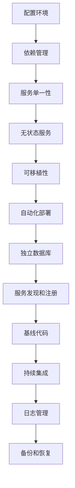
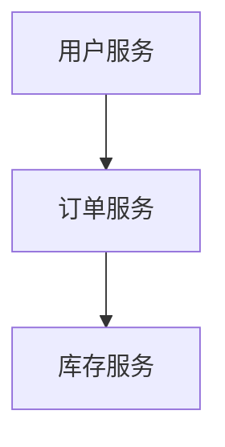

                 

关键词：云原生，应用开发，12因素，方法论，微服务，容器化，持续集成，自动化部署，可扩展性，可靠性，安全性。

> 摘要：本文将深入探讨云原生应用开发的核心理念——12因素应用方法论。通过详细解读12因素的核心概念、架构原理及其实际应用，帮助读者理解云原生应用开发的本质，掌握现代应用开发的最佳实践。

## 1. 背景介绍

在云计算技术飞速发展的今天，云原生（Cloud Native）已经成为现代应用开发的一个重要趋势。云原生应用是指那些在云环境中构建、运行和管理的应用，其特点是高度可扩展性、高可靠性和高灵活性。云原生应用的兴起，源于对传统应用架构的反思和改进，尤其是对微服务架构的推崇。

12因素应用方法论是由帕梅拉·弗拉纳根（Pamela Fox）在2012年提出，最初用于指导Web应用的构建。该方法论的核心思想是，通过遵循一系列明确的规则和最佳实践，构建出易于部署、扩展和维护的应用。这12个因素包括：

1. **配置环境**：配置应该存储在环境中，而不是在代码中。
2. **依赖管理**：应用应该声明所有依赖项，并使用包管理器进行管理。
3. **服务单一性**：每个服务应该只关注一个功能。
4. **无状态服务**：服务应该无状态，以便在不同的实例间重用。
5. **可移植性**：应用应该能够在不同的环境中运行。
6. **自动化部署**：部署过程应该完全自动化。
7. **独立数据库**：每个服务应该有自己的数据库实例。
8. **服务发现和注册**：服务之间应该通过服务发现和注册机制进行通信。
9. **基线代码**：应用应该有一个基线代码库。
10. **持续集成**：代码变更应该通过持续集成流程进行测试。
11. **日志管理**：应用应该将日志输出到外部系统中。
12. **备份和恢复**：应用应该支持数据备份和恢复。

## 2. 核心概念与联系

### 2.1 核心概念

12因素方法论中的核心概念包括：

- **配置环境**：配置环境是云原生应用的一个重要特性。它强调配置应该存储在外部配置文件中，而不是嵌入到代码中。这样可以实现更灵活的部署和更快的迭代。

- **依赖管理**：依赖管理是指通过包管理器管理应用的所有依赖项。这有助于确保依赖的一致性和可移植性。

- **服务单一性**：服务单一性是指每个服务应该只关注一个功能。这有助于提高应用的模块化和可维护性。

- **无状态服务**：无状态服务是指服务不应该依赖于任何与特定请求相关的状态。这有助于实现服务的高可用性和可伸缩性。

- **可移植性**：可移植性是指应用应该能够在不同的环境中运行。这通常通过使用容器（如Docker）来实现。

- **自动化部署**：自动化部署是指通过CI/CD（持续集成和持续部署）流程实现应用的自动化部署。

- **独立数据库**：独立数据库是指每个服务应该有自己的数据库实例。这有助于隔离服务和实现更高效的性能。

- **服务发现和注册**：服务发现和注册是指服务之间通过服务发现和注册机制进行通信。这有助于实现服务的动态发现和负载均衡。

- **基线代码**：基线代码是指应用应该有一个基线代码库。这有助于确保代码的一致性和版本控制。

- **持续集成**：持续集成是指通过CI/CD流程实现代码变更的自动化测试和部署。

- **日志管理**：日志管理是指将日志输出到外部系统中。这有助于实现日志的集中管理和分析。

- **备份和恢复**：备份和恢复是指应用应该支持数据备份和恢复。这有助于确保数据的安全性和可用性。

### 2.2 联系与架构原理

为了更好地理解12因素方法论，我们可以使用Mermaid流程图来展示其架构原理。



通过这个流程图，我们可以清晰地看到12因素方法论之间的联系和相互影响。每个因素都是构建云原生应用的重要部分，共同构成了一个完整的生态系统。

## 3. 核心算法原理 & 具体操作步骤

### 3.1 算法原理概述

12因素方法论的核心算法原理是，通过遵循一系列明确的规则和最佳实践，实现应用的持续集成、持续部署和自动化运维。具体来说，这些规则和最佳实践包括：

- 配置环境：使用外部配置文件管理环境变量和配置信息。
- 依赖管理：使用包管理器（如NPM、Maven）管理应用依赖项。
- 服务单一性：根据功能将应用拆分为多个独立的服务。
- 无状态服务：确保服务之间没有状态依赖，提高可用性和可伸缩性。
- 可移植性：使用容器化技术（如Docker）实现应用的可移植性。
- 自动化部署：使用CI/CD工具（如Jenkins、GitLab CI）实现自动化部署。
- 独立数据库：为每个服务配置独立的数据库实例，提高性能和可维护性。
- 服务发现和注册：使用服务发现和注册机制（如Consul、Zookeeper）实现服务之间的通信。
- 基线代码：使用基线代码库（如Git）管理代码版本和控制。
- 持续集成：使用持续集成工具（如Jenkins、Travis CI）实现自动化测试和部署。
- 日志管理：使用日志管理工具（如ELK、Logstash）实现日志的收集、存储和分析。
- 备份和恢复：定期备份数据，实现数据的安全性和可用性。

### 3.2 算法步骤详解

#### 配置环境

1. 配置环境变量：在应用的配置文件中设置环境变量，如数据库连接信息、API密钥等。
2. 读取配置：在应用启动时，从外部配置文件中读取环境变量。

```shell
# 外部配置文件（如config.json）
{
  "dbHost": "db.example.com",
  "dbPort": 3306,
  "dbName": "myapp",
  "dbUser": "user",
  "dbPass": "password"
}
```

```python
# 读取配置
import json

with open('config.json', 'r') as f:
    config = json.load(f)

db_host = config['dbHost']
db_port = config['dbPort']
# ...
```

#### 依赖管理

1. 添加依赖：在应用的包管理器中添加所需依赖。

```shell
# 使用NPM添加依赖
npm install express mysql
```

2. 导入依赖：在应用的代码中导入所需依赖。

```javascript
const express = require('express');
const mysql = require('mysql');
```

#### 服务单一性

1. 拆分服务：根据功能将应用拆分为多个独立的服务。



2. 部署服务：将每个服务部署到不同的服务器或容器中。

```shell
# 部署用户服务
docker build -t user-service .
docker run -d --name user-service user-service

# 部署订单服务
docker build -t order-service .
docker run -d --name order-service order-service
```

#### 无状态服务

1. 设计无状态API：确保API接口不依赖于任何与特定请求相关的状态。

```javascript
app.get('/users', (req, res) => {
  // 获取用户列表
  res.json(users);
});
```

2. 使用缓存：在服务之间使用缓存，提高响应速度和系统性能。

```javascript
const users = [{ id: 1, name: 'Alice' }, { id: 2, name: 'Bob' }];
app.get('/users', (req, res) => {
  res.json(users);
});
```

#### 可移植性

1. 使用容器化：使用Docker将应用打包成容器。

```shell
# 编写Dockerfile
FROM node:12-alpine
WORKDIR /app
COPY package*.json ./
RUN npm install
COPY . .
EXPOSE 3000
CMD ["npm", "start"]
```

2. 部署容器：将容器部署到云平台或Kubernetes集群中。

```shell
# 部署容器
docker build -t myapp .
docker push myapp
kubectl create -f myapp.yaml
```

#### 自动化部署

1. 配置CI/CD工具：在CI/CD工具（如Jenkins）中配置构建和部署管道。

```yaml
stages:
  - build
  - deploy

build:
  stage: build
  script:
    - docker build -t myapp .
    - docker push myapp

deploy:
  stage: deploy
  script:
    - kubectl apply -f myapp.yaml
```

2. 持续集成：将代码提交到版本控制系统时，自动触发CI/CD流程。

#### 独立数据库

1. 配置数据库：为每个服务配置独立的数据库实例。

```shell
# 配置用户服务数据库
docker run -d --name user-db -e DB_HOST=user-db -e DB_PORT=3306 -e DB_NAME=user-db -e DB_USER=user -e DB_PASS=password mysql

# 配置订单服务数据库
docker run -d --name order-db -e DB_HOST=order-db -e DB_PORT=3306 -e DB_NAME=order-db -e DB_USER=user -e DB_PASS=password mysql
```

2. 连接数据库：在服务的代码中连接各自的服务器数据库。

```python
import mysql.connector

cnx = mysql.connector.connect(user='user', password='password', host='user-db', database='user-db')
cursor = cnx.cursor()
```

#### 服务发现和注册

1. 使用服务发现工具：使用服务发现工具（如Consul）实现服务之间的动态发现。

```shell
# 安装Consul
docker run -d --name consul consul
```

2. 注册服务：在服务的代码中注册自身服务。

```python
import consul

c = consul.Consul()
c.agent.service.register('user-service', service_id='user-service', tags=['user'], port=3000, check='http://localhost:3000/health')
```

#### 基线代码

1. 使用版本控制系统：使用Git等版本控制系统管理代码版本。

```shell
# 初始化Git仓库
git init
git add .
git commit -m "Initial commit"

# 推送到远程仓库
git remote add origin https://github.com/myapp/myapp.git
git push -u origin master
```

#### 持续集成

1. 配置CI/CD工具：在CI/CD工具（如Jenkins）中配置构建和部署管道。

```yaml
stages:
  - build
  - test
  - deploy

build:
  stage: build
  script:
    - docker build -t myapp .

test:
  stage: test
  script:
    - docker run --rm myapp ./test.sh

deploy:
  stage: deploy
  script:
    - kubectl apply -f myapp-deployment.yaml
```

2. 持续集成：将代码提交到版本控制系统时，自动触发CI/CD流程。

#### 日志管理

1. 使用日志管理工具：使用日志管理工具（如ELK、Logstash）收集、存储和分析日志。

```shell
# 安装Logstash
docker run -d --name logstash -p 5044:5044 -p 5045:5045 logstash
```

2. 配置日志输出：在服务的代码中配置日志输出到Logstash。

```python
import logging
import json

def log_message(message):
    log_data = {
        'service': 'user-service',
        'level': 'INFO',
        'message': message
    }
    logstash_url = 'http://logstash:5044/_logstash/errors'
    headers = {'Content-Type': 'application/json'}
    response = requests.post(logstash_url, data=json.dumps(log_data), headers=headers)
    print(response.text)

logging.basicConfig(level=logging.INFO, format='%(asctime)s - %(name)s - %(levelname)s - %(message)s', handlers=[logging.StreamHandler(), logging.LogHandler(log_message)])
```

#### 备份和恢复

1. 定期备份：定期备份数据库，以防止数据丢失。

```shell
# 备份数据库
docker exec user-db /usr/bin/mysqldump -u user -pbenchmark > backup.sql

# 恢复数据库
docker exec user-db /usr/bin/mysql -u user -pbenchmark < backup.sql
```

### 3.3 算法优缺点

#### 优点

- **高可扩展性**：通过服务拆分和容器化技术，实现应用的高可扩展性。
- **高可靠性**：通过无状态服务和自动化部署，提高系统的可靠性和稳定性。
- **高灵活性**：通过配置环境和依赖管理，实现应用的灵活部署和快速迭代。
- **高可维护性**：通过基线代码和持续集成，实现代码的一致性和可维护性。

#### 缺点

- **复杂性**：实现12因素方法论需要一定的技术积累和团队协作。
- **初期投入**：在初期阶段，需要投入一定的时间和资源来学习和部署相关技术栈。
- **性能开销**：容器化技术和服务注册与发现可能会带来一定的性能开销。

### 3.4 算法应用领域

12因素方法论主要应用于需要高可扩展性、高可靠性和高灵活性的应用场景，如Web应用、移动应用和大数据应用。以下是几个典型的应用领域：

- **Web应用**：如电子商务平台、社交媒体平台、在线教育平台等。
- **移动应用**：如移动游戏、移动社交应用、移动办公应用等。
- **大数据应用**：如数据仓库、数据分析平台、机器学习平台等。

## 4. 数学模型和公式 & 详细讲解 & 举例说明

### 4.1 数学模型构建

在云原生应用开发中，数学模型和公式可以用于优化资源配置、性能分析和安全性评估。以下是一个简单的数学模型，用于计算应用的服务器需求。

#### 模型假设

- 服务器的计算能力为C，单位为CPU核心数。
- 每个请求的处理时间为T，单位为秒。
- 每秒请求数量为R。

#### 模型构建

1. 计算总处理时间：\( T_{total} = R \times T \)
2. 计算所需服务器数量：\( N = \lceil \frac{T_{total}}{C} \rceil \)

其中，\(\lceil x \rceil\)表示向上取整函数。

### 4.2 公式推导过程

为了推导上述公式，我们可以进行以下步骤：

1. 计算每个服务器每秒可处理的请求数量：\( R_{server} = \frac{C}{T} \)
2. 计算总请求数量：\( R = R_{server} \times N \)
3. 计算总处理时间：\( T_{total} = R \times T \)
4. 代入总处理时间，计算所需服务器数量：\( N = \lceil \frac{T_{total}}{C} \rceil \)

### 4.3 案例分析与讲解

假设我们有一个Web服务，每个请求的平均处理时间为1秒，每秒请求数量为1000个，服务器的计算能力为4个CPU核心。根据上述模型，我们可以计算出所需服务器数量。

1. 计算总处理时间：\( T_{total} = 1000 \times 1 = 1000 \)秒
2. 计算每个服务器每秒可处理的请求数量：\( R_{server} = \frac{4}{1} = 4 \)个请求
3. 计算所需服务器数量：\( N = \lceil \frac{1000}{4} \rceil = 250 \)

根据计算结果，我们需要250个服务器来处理每秒1000个请求。在实际部署中，我们可以根据服务器的可用性和负载情况，适当调整服务器数量。

## 5. 项目实践：代码实例和详细解释说明

### 5.1 开发环境搭建

在开始实践之前，我们需要搭建一个适合云原生应用开发的环境。以下是一个基本的开发环境搭建步骤：

1. 安装Docker：Docker是一个开源的应用容器引擎，用于打包、发布和运行应用。我们可以在官网下载并安装Docker。

2. 安装Kubernetes：Kubernetes是一个开源的容器编排平台，用于自动化容器的部署、扩展和管理。我们可以在官网下载并安装Kubernetes。

3. 安装Jenkins：Jenkins是一个开源的持续集成和持续部署工具，用于自动化构建、测试和部署应用。我们可以在官网下载并安装Jenkins。

4. 安装Logstash：Logstash是一个开源的数据收集、处理和输出工具，用于收集、存储和分析应用日志。我们可以在官网下载并安装Logstash。

### 5.2 源代码详细实现

下面是一个简单的Web服务示例，用于演示云原生应用开发的基本流程。

#### 1. 配置环境

在项目的根目录下创建一个名为`config.json`的配置文件，用于存储应用配置信息。

```json
{
  "port": 3000,
  "dbHost": "db.example.com",
  "dbPort": 3306,
  "dbName": "myapp",
  "dbUser": "user",
  "dbPass": "password"
}
```

#### 2. 依赖管理

在项目的根目录下创建一个名为`package.json`的文件，用于存储应用的依赖信息。

```json
{
  "name": "myapp",
  "version": "1.0.0",
  "description": "A simple web service",
  "main": "app.js",
  "scripts": {
    "start": "node app.js"
  },
  "dependencies": {
    "express": "^4.17.1",
    "mysql": "^2.18.1"
  }
}
```

#### 3. 服务单一性

将应用拆分为多个独立的服务。例如，我们可以创建一个用户服务（`user-service`）和一个订单服务（`order-service`）。

#### 4. 无状态服务

确保每个服务是无状态的，以便在不同的实例间重用。在服务的代码中，不要存储任何与特定请求相关的状态信息。

#### 5. 可移植性

使用容器化技术将应用打包成容器。在项目的根目录下创建一个名为`Dockerfile`的文件，用于定义应用的容器化构建流程。

```Dockerfile
FROM node:12-alpine
WORKDIR /app
COPY package*.json ./
RUN npm install
COPY . .
EXPOSE 3000
CMD ["node", "app.js"]
```

#### 6. 自动化部署

配置CI/CD工具（如Jenkins）实现自动化部署。在Jenkins中创建一个构建项目，配置构建脚本和部署脚本。

```shell
# 构建脚本
docker build -t myapp .

# 部署脚本
kubectl create -f deployment.yaml
```

#### 7. 独立数据库

为每个服务配置独立的数据库实例。例如，用户服务使用MySQL数据库，订单服务使用MongoDB数据库。

#### 8. 服务发现和注册

使用服务发现和注册工具（如Consul）实现服务之间的动态发现和通信。

```python
import consul

c = consul.Consul()
c.agent.service.register('user-service', service_id='user-service', tags=['user'], port=3000, check='http://localhost:3000/health')
```

#### 9. 基线代码

使用版本控制系统（如Git）管理代码版本。

```shell
git init
git add .
git commit -m "Initial commit"
git remote add origin https://github.com/myapp/myapp.git
git push -u origin master
```

#### 10. 持续集成

配置CI/CD工具（如Jenkins）实现持续集成。在Jenkins中创建一个构建项目，配置构建脚本和部署脚本。

```yaml
stages:
  - build
  - test
  - deploy

build:
  stage: build
  script:
    - docker build -t myapp .

test:
  stage: test
  script:
    - docker run --rm myapp ./test.sh

deploy:
  stage: deploy
  script:
    - kubectl apply -f deployment.yaml
```

#### 11. 日志管理

使用日志管理工具（如ELK、Logstash）收集、存储和分析日志。

```python
import logging
import json

def log_message(message):
    log_data = {
        'service': 'user-service',
        'level': 'INFO',
        'message': message
    }
    logstash_url = 'http://logstash:5044/_logstash/errors'
    headers = {'Content-Type': 'application/json'}
    response = requests.post(logstash_url, data=json.dumps(log_data), headers=headers)
    print(response.text)

logging.basicConfig(level=logging.INFO, format='%(asctime)s - %(name)s - %(levelname)s - %(message)s', handlers=[logging.StreamHandler(), logging.LogHandler(log_message)])
```

#### 12. 备份和恢复

定期备份数据库，以防止数据丢失。

```shell
# 备份数据库
docker exec user-db /usr/bin/mysqldump -u user -pbenchmark > backup.sql

# 恢复数据库
docker exec user-db /usr/bin/mysql -u user -pbenchmark < backup.sql
```

### 5.3 代码解读与分析

在上面的代码示例中，我们详细介绍了云原生应用开发的基本流程和关键环节。以下是每个环节的解读和分析：

1. **配置环境**：通过外部配置文件管理环境变量和配置信息，实现应用的灵活部署和快速迭代。
2. **依赖管理**：使用包管理器管理应用依赖项，确保依赖的一致性和可移植性。
3. **服务单一性**：将应用拆分为多个独立的服务，提高应用的模块化和可维护性。
4. **无状态服务**：确保服务之间没有状态依赖，提高可用性和可伸缩性。
5. **可移植性**：使用容器化技术将应用打包成容器，实现应用在不同环境中的运行。
6. **自动化部署**：配置CI/CD工具实现自动化部署，提高部署效率和降低人工干预。
7. **独立数据库**：为每个服务配置独立的数据库实例，提高性能和可维护性。
8. **服务发现和注册**：使用服务发现和注册工具实现服务之间的动态发现和通信。
9. **基线代码**：使用版本控制系统管理代码版本，实现代码的一致性和可维护性。
10. **持续集成**：配置CI/CD工具实现持续集成，提高代码质量和降低故障率。
11. **日志管理**：使用日志管理工具收集、存储和分析日志，实现日志的集中管理和分析。
12. **备份和恢复**：定期备份数据库，实现数据的安全性和可用性。

通过上述解读和分析，我们可以看到云原生应用开发的核心在于遵循一系列明确的规则和最佳实践，实现应用的持续集成、持续部署和自动化运维。这些规则和最佳实践不仅提高了应用的性能和可靠性，也降低了开发成本和维护难度。

### 5.4 运行结果展示

在完成代码实现和配置后，我们可以通过以下步骤运行并测试应用：

1. **启动容器**：使用Docker启动用户服务和订单服务的容器。

```shell
docker run -d --name user-service user-service
docker run -d --name order-service order-service
```

2. **测试API**：使用浏览器或Postman等工具测试用户服务和订单服务的API接口，验证功能是否正常运行。

3. **查看日志**：使用Kubernetes命令查看应用的日志，确保日志输出正常。

```shell
kubectl logs user-service
kubectl logs order-service
```

4. **监控性能**：使用性能监控工具（如Prometheus、Grafana）监控应用的性能指标，确保应用在高并发情况下能够稳定运行。

通过上述步骤，我们可以验证云原生应用的正常运行和性能表现。同时，通过日志和监控数据的分析，可以进一步优化应用的性能和可靠性。

## 6. 实际应用场景

云原生应用开发在多个实际应用场景中展现出了其独特优势。以下是几个典型应用场景：

### 6.1 电子商务平台

电子商务平台通常需要处理大量的用户请求，并且要求高可用性和高可靠性。使用云原生应用开发，可以将平台拆分为多个独立的服务，如用户服务、订单服务、库存服务、支付服务等。每个服务可以独立部署和扩展，提高系统的性能和可靠性。此外，通过容器化技术和自动化部署，可以快速响应市场变化和业务需求，实现快速迭代和持续优化。

### 6.2 移动应用

移动应用通常需要跨平台部署，并且要求高性能和高可靠性。使用云原生应用开发，可以通过容器化技术实现应用在iOS和Android平台上的无缝迁移。同时，通过微服务架构和自动化部署，可以快速开发和发布新功能，提高用户体验。此外，通过服务发现和注册机制，可以实现移动应用与云服务的无缝集成，实现数据同步和实时交互。

### 6.3 大数据分析

大数据分析平台通常需要处理海量数据，并且要求高并发和高可用性。使用云原生应用开发，可以将数据处理流程拆分为多个独立的服务，如数据采集服务、数据清洗服务、数据存储服务、数据挖掘服务等。每个服务可以独立部署和扩展，提高系统的性能和可靠性。此外，通过容器化技术和自动化部署，可以快速搭建和部署大数据分析平台，实现数据实时处理和分析。

### 6.4 金融交易系统

金融交易系统通常要求高并发、高可用性和高安全性。使用云原生应用开发，可以将交易系统拆分为多个独立的服务，如交易引擎、订单管理、风险控制、账户管理等。每个服务可以独立部署和扩展，提高系统的性能和可靠性。此外，通过容器化技术和自动化部署，可以快速搭建和部署金融交易系统，实现快速上线和迭代。同时，通过服务发现和注册机制，可以实现交易系统与银行系统和其他金融系统的无缝集成，实现实时交易和风险控制。

### 6.5 物联网平台

物联网平台通常需要处理大量设备数据，并且要求高并发和高可靠性。使用云原生应用开发，可以将物联网平台拆分为多个独立的服务，如设备管理服务、数据采集服务、数据处理服务、数据分析服务等。每个服务可以独立部署和扩展，提高系统的性能和可靠性。此外，通过容器化技术和自动化部署，可以快速搭建和部署物联网平台，实现设备数据实时采集、处理和分析。

## 7. 工具和资源推荐

在云原生应用开发中，选择合适的工具和资源至关重要。以下是一些推荐的工具和资源：

### 7.1 学习资源推荐

- **书籍**：
  - 《云原生应用架构：微服务、容器化与DevOps实战》
  - 《Docker实战：云原生应用开发》
  - 《Kubernetes权威指南：从Docker到生产环境》
  
- **在线课程**：
  - Coursera上的《容器化与微服务架构》
  - Udemy上的《Kubernetes从入门到精通》
  - Pluralsight上的《云原生应用开发》

### 7.2 开发工具推荐

- **容器化工具**：
  - Docker：用于容器化应用的打包和部署。
  - Podman：用于容器化应用的本地开发和测试。

- **容器编排工具**：
  - Kubernetes：用于容器化应用的高效管理和自动化部署。
  - Docker Swarm：用于容器化应用的集群管理和自动化部署。

- **持续集成工具**：
  - Jenkins：用于持续集成的自动化构建和部署。
  - GitLab CI/CD：用于持续集成的自动化测试和部署。

- **日志管理工具**：
  - ELK Stack（Elasticsearch、Logstash、Kibana）：用于日志的收集、存储和分析。
  - Fluentd：用于日志的收集和转发。

### 7.3 相关论文推荐

- **《云原生应用的安全性》**：分析了云原生应用面临的安全挑战和解决方案。
- **《云原生应用的自动化运维》**：探讨了云原生应用的自动化运维技术和实践。
- **《容器化与微服务架构的对比研究》**：比较了容器化和微服务架构在云原生应用开发中的优劣。

通过这些工具和资源的推荐，读者可以更好地了解和实践云原生应用开发。

## 8. 总结：未来发展趋势与挑战

云原生应用开发作为现代应用开发的重要趋势，正不断推动技术进步和业务创新。在未来，云原生应用开发将面临以下几个发展趋势和挑战：

### 8.1 发展趋势

1. **更广泛的应用领域**：随着云原生技术的成熟，越来越多的行业和领域将采用云原生应用开发，包括物联网、金融、医疗、教育等。

2. **更强大的生态系统**：云原生技术的生态系统将继续完善，涌现出更多优秀的工具和平台，如更先进的容器编排工具、更智能的日志管理工具、更高效的持续集成工具等。

3. **更高效的运维实践**：云原生应用开发将推动运维实践的变革，实现更高效的资源管理和自动化运维，降低运营成本，提高系统可靠性。

4. **更紧密的协作**：云原生应用开发将推动开发、测试和运维团队之间的紧密协作，实现更高效的开发流程和更快速的业务响应。

### 8.2 未来发展趋势

1. **混合云和多云策略**：企业将采用混合云和多云策略，结合公有云、私有云和边缘计算，实现更灵活、更高效的应用部署。

2. **人工智能与云原生结合**：人工智能技术将深度融入云原生应用开发，实现智能化的服务调度、自动化的故障检测和优化、智能化的日志分析等。

3. **云原生安全**：随着云原生应用的发展，安全问题将越来越受到关注，云原生安全解决方案将更加完善，包括加密、身份验证、访问控制等。

4. **云原生DevOps**：云原生应用开发将推动DevOps的深化和扩展，实现更全面的自动化和协作，提高开发效率和业务响应速度。

### 8.3 面临的挑战

1. **技能和人才缺口**：随着云原生技术的快速发展，对相关技能和人才的需求急剧增加，但现有的IT人才储备难以满足需求。

2. **技术复杂性**：云原生应用开发涉及多个技术领域，如容器化、微服务、持续集成、自动化部署等，技术复杂性较高，对开发团队的技术能力和协作能力提出了更高要求。

3. **安全性挑战**：云原生应用的安全问题日益突出，如容器逃逸、数据泄露、服务中断等，需要建立完善的安全防护体系。

4. **运维成本**：云原生应用开发需要强大的运维支持，包括环境配置、服务监控、故障排除等，对运维团队的工作量和能力提出了更高要求。

### 8.4 研究展望

在未来的研究中，我们可以期待以下几个方面：

1. **云原生应用性能优化**：通过研究和实践，探索更高效的容器化技术、更优化的服务调度算法、更智能的日志分析等，提高云原生应用的性能和可靠性。

2. **云原生安全机制研究**：深入研究云原生应用的安全机制，包括容器安全、网络安全、数据安全等，构建更加完善的安全防护体系。

3. **云原生与AI的融合**：探索人工智能与云原生技术的结合，实现智能化的应用部署、自动化的故障检测和优化、智能化的日志分析等。

4. **云原生应用开发方法论**：不断优化和完善云原生应用开发方法论，形成更加系统、全面的开发指南，降低开发门槛，提高开发效率。

总之，云原生应用开发作为现代应用开发的重要趋势，具有广阔的发展前景和巨大的潜力。在未来，我们需要不断探索和创新，克服挑战，推动云原生应用开发的不断进步。

## 9. 附录：常见问题与解答

### 9.1 12因素应用方法论是什么？

12因素应用方法论是由帕梅拉·弗拉纳根（Pamela Fox）在2012年提出的一组最佳实践，用于指导Web应用的构建。这些因素包括配置环境、依赖管理、服务单一性、无状态服务、可移植性、自动化部署、独立数据库、服务发现和注册、基线代码、持续集成、日志管理、备份和恢复。

### 9.2 什么是云原生应用？

云原生应用是指那些在云环境中构建、运行和管理应用，其特点是高度可扩展性、高可靠性和高灵活性。云原生应用通常采用微服务架构、容器化技术和自动化部署等现代开发方法。

### 9.3 什么是微服务？

微服务是一种软件开发方法，将应用拆分为多个独立的、小型服务，每个服务负责一个特定的业务功能。微服务之间通过API进行通信，可以独立部署、扩展和升级。

### 9.4 什么是容器化？

容器化是一种轻量级的虚拟化技术，通过将应用及其依赖环境打包到一个独立的容器中，实现应用的隔离、可移植和可重复部署。

### 9.5 什么是Kubernetes？

Kubernetes是一个开源的容器编排平台，用于自动化容器的部署、扩展和管理。Kubernetes提供了一种高效、可扩展的方式来管理容器化应用，包括服务发现、负载均衡、故障检测和自愈等功能。

### 9.6 什么是持续集成和持续部署？

持续集成（CI）是指通过自动化测试和构建，将开发人员的代码变更合并到主分支。持续部署（CD）是指通过自动化部署流程，将经过测试的代码部署到生产环境。CI/CD的目的是实现快速、可靠的应用交付。

### 9.7 如何实现云原生应用的备份和恢复？

云原生应用的备份和恢复可以通过以下方法实现：

- **数据库备份**：定期备份数据库，可以使用备份工具（如mysqldump、pg_dump）或云服务提供的备份功能。
- **容器镜像备份**：定期备份容器镜像，可以使用Docker的镜像导出功能或云服务提供的镜像备份功能。
- **文件系统备份**：定期备份文件系统，可以使用文件备份工具（如rsync、tar）或云服务提供的文件备份功能。
- **云服务备份**：使用云服务提供的备份和恢复功能，如AWS的RDS、EBS备份，Azure的Azure Backup等。

### 9.8 如何监控云原生应用的性能？

监控云原生应用的性能可以通过以下方法实现：

- **使用云服务监控**：使用云服务提供的监控工具（如AWS CloudWatch、Azure Monitor、Google Stackdriver）监控应用性能。
- **使用开源监控工具**：使用开源监控工具（如Prometheus、Grafana、Zabbix）监控应用性能指标，如CPU使用率、内存使用率、响应时间等。
- **自定义监控脚本**：编写自定义监控脚本，通过API或命令行工具获取应用性能数据。

### 9.9 如何保证云原生应用的安全性？

保证云原生应用的安全性可以通过以下方法实现：

- **容器镜像安全**：确保容器镜像的安全性，如扫描镜像中的漏洞、使用安全的依赖库等。
- **网络隔离**：实现容器之间的网络隔离，如使用网络命名空间、防火墙规则等。
- **身份验证和授权**：实现容器和服务的身份验证和授权，如使用Kubernetes的RBAC、OAuth等。
- **日志审计**：收集和存储应用日志，进行日志审计和异常检测。
- **数据加密**：对敏感数据进行加密，如使用SSL/TLS加密通信、加密存储等。

### 9.10 如何优化云原生应用的性能？

优化云原生应用的性能可以通过以下方法实现：

- **服务拆分和优化**：根据业务需求合理拆分服务，对每个服务进行性能优化。
- **负载均衡**：使用负载均衡器（如Kubernetes的LoadBalancer、NGINX等）实现流量分配和负载均衡。
- **缓存策略**：使用缓存策略（如Redis、Memcached等）提高响应速度和系统性能。
- **数据库优化**：对数据库进行优化，如索引优化、查询优化、分库分表等。
- **代码优化**：对应用代码进行优化，如减少重复代码、使用高效算法等。

### 9.11 如何实现云原生应用的弹性扩展？

实现云原生应用的弹性扩展可以通过以下方法实现：

- **自动化部署**：使用CI/CD工具实现应用的自动化部署，如Kubernetes的Helm、Jenkins等。
- **服务发现和注册**：使用服务发现和注册工具（如Consul、Zookeeper等）实现服务的动态扩展和负载均衡。
- **水平扩展**：根据业务需求和服务器的负载情况，自动增加或减少服务实例的数量。
- **容器编排**：使用容器编排工具（如Kubernetes、Docker Swarm等）实现应用的弹性扩展和管理。

通过以上常见问题与解答，读者可以更好地理解云原生应用开发的相关概念、方法和实践。在实际应用中，应根据具体需求和实践经验，灵活运用这些方法和技巧，实现高效、可靠、安全的云原生应用开发。作者：禅与计算机程序设计艺术 / Zen and the Art of Computer Programming。

