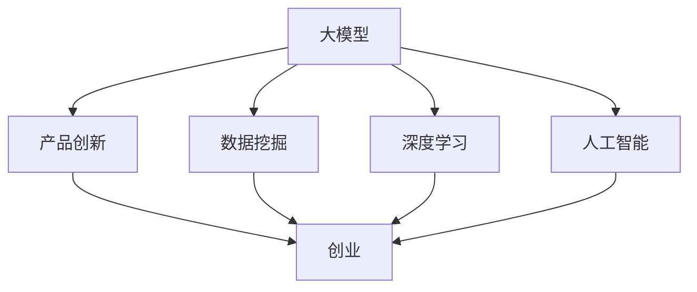

                 

关键词：产品创新、大模型、创业、核心竞争力、算法、数学模型、实践案例、应用场景、未来展望

> 摘要：本文从大模型在创业中的核心作用出发，探讨了产品创新策略在创业中的重要性。通过对大模型算法原理的深入剖析，结合数学模型的构建与公式推导，以及实际项目实践中的代码实例分析，本文展示了大模型如何助力创业企业实现创新。同时，对大模型在各个应用领域的实际效果进行了详细讲解，并对未来发展趋势和面临的挑战进行了展望。

## 1. 背景介绍

随着大数据、云计算和人工智能技术的飞速发展，大模型（Large Model）作为一种先进的人工智能技术，已经在各行各业中发挥着越来越重要的作用。大模型通常指的是参数规模巨大、结构复杂的神经网络模型，如深度学习中的 Transformer、BERT 等模型。这些模型在处理大规模数据集、实现高精度预测和优化方面具有显著优势。

在创业领域，产品创新是企业的核心竞争力。大模型作为一种强大的技术工具，可以显著提升创业企业的产品创新能力。一方面，大模型可以处理和挖掘海量数据，为创业企业提供精准的市场洞察和用户需求分析；另一方面，大模型可以帮助创业企业实现智能化产品设计，提升产品竞争力。因此，研究大模型在创业中的应用，对于提升创业企业的产品创新策略具有重要意义。

本文旨在探讨大模型在创业中的核心作用，分析产品创新策略在大模型创业中的重要性，并通过具体实例展示大模型在创业中的应用效果。文章结构如下：

- 第1章：背景介绍
- 第2章：核心概念与联系
- 第3章：核心算法原理 & 具体操作步骤
- 第4章：数学模型和公式 & 详细讲解 & 举例说明
- 第5章：项目实践：代码实例和详细解释说明
- 第6章：实际应用场景
- 第7章：未来应用展望
- 第8章：工具和资源推荐
- 第9章：总结：未来发展趋势与挑战

## 2. 核心概念与联系

在本章中，我们将介绍大模型创业中涉及的核心概念，并使用 Mermaid 流程图（Mermaid Diagram）展示它们之间的联系。

### 2.1. 大模型

大模型（Large Model）是指具有大规模参数和复杂结构的神经网络模型。这些模型通常采用深度学习（Deep Learning）技术，通过多层神经网络进行数据拟合和预测。大模型的显著特点是能够处理大规模数据集，并在各种任务中实现高精度预测。

### 2.2. 产品创新

产品创新是指通过引入新技术、新功能、新设计等手段，对现有产品进行改进和创新，以满足市场需求和用户需求。产品创新是创业企业的核心竞争力，有助于企业在激烈的市场竞争中脱颖而出。

### 2.3. 数据挖掘

数据挖掘（Data Mining）是指从大量数据中提取有价值信息的过程。数据挖掘技术可以帮助创业企业发现市场趋势、用户行为和潜在需求，从而为产品创新提供有力支持。

### 2.4. 深度学习

深度学习（Deep Learning）是一种基于多层神经网络的人工智能技术，能够自动学习数据特征，并在各种任务中实现高精度预测。深度学习是大模型的基础，也是产品创新的重要工具。

### 2.5. 人工智能

人工智能（Artificial Intelligence，AI）是指通过计算机模拟人类智能的一种技术。人工智能技术包括机器学习、深度学习、自然语言处理等，广泛应用于各个领域。

### 2.6. 创业

创业是指创立一家新的企业，通过创新、竞争和合作实现商业价值。创业企业通常具有创新性强、发展速度快的特点，对技术要求较高。

### 2.7. 核心概念与联系

以下是一个 Mermaid 流程图，展示了大模型创业中的核心概念及其联系：



## 3. 核心算法原理 & 具体操作步骤

在本章中，我们将深入探讨大模型的核心算法原理，并详细讲解具体操作步骤。

### 3.1. 算法原理概述

大模型通常采用深度学习技术，其中 Transformer 模型是一个典型的代表。Transformer 模型基于自注意力（Self-Attention）机制，能够自动学习输入数据中的长期依赖关系。以下是 Transformer 模型的主要组成部分：

- **编码器（Encoder）**：编码器负责将输入数据编码为固定长度的向量，用于后续处理。
- **解码器（Decoder）**：解码器负责将编码器输出的向量解码为输出数据。
- **多头自注意力（Multi-Head Self-Attention）**：多头自注意力机制能够捕捉输入数据中的长期依赖关系。
- **位置编码（Positional Encoding）**：位置编码用于引入输入数据的位置信息。

### 3.2. 算法步骤详解

以下是大模型的主要操作步骤：

1. **数据预处理**：
   - 数据清洗：去除无效数据、处理缺失值等。
   - 数据编码：将输入数据转换为数值形式，如词向量、图像像素值等。
   - 数据归一化：对数据进行归一化处理，提高训练效果。

2. **模型构建**：
   - 编码器：构建编码器网络，包括嵌入层、多头自注意力层、位置编码层等。
   - 解码器：构建解码器网络，包括嵌入层、多头自注意力层、位置编码层等。

3. **模型训练**：
   - 数据输入：将编码后的数据输入编码器，得到编码后的向量。
   - 编码解码：将编码后的向量输入解码器，得到预测结果。
   - 损失函数：计算预测结果与实际结果之间的损失，并使用梯度下降法更新模型参数。

4. **模型评估**：
   - 训练集评估：使用训练集数据评估模型性能，调整模型参数。
   - 测试集评估：使用测试集数据评估模型性能，验证模型泛化能力。

5. **模型应用**：
   - 预测：使用训练好的模型进行预测，得到预测结果。
   - 后处理：对预测结果进行后处理，如解码、归一化等。

### 3.3. 算法优缺点

**优点**：

- **高精度预测**：大模型能够处理大规模数据集，实现高精度预测。
- **自动学习特征**：大模型能够自动学习输入数据中的特征，降低手工特征工程需求。
- **泛化能力**：大模型具有良好的泛化能力，能够适应不同类型的数据和任务。

**缺点**：

- **计算资源消耗**：大模型通常需要大量的计算资源和存储空间，对硬件设备要求较高。
- **训练时间较长**：大模型需要较长的训练时间，影响模型部署和应用。

### 3.4. 算法应用领域

大模型在多个领域具有广泛的应用，包括自然语言处理、计算机视觉、推荐系统等。以下是一些典型的应用领域：

- **自然语言处理**：大模型在自然语言处理（NLP）领域具有显著优势，如文本分类、机器翻译、情感分析等。
- **计算机视觉**：大模型在计算机视觉领域广泛应用于图像分类、目标检测、人脸识别等任务。
- **推荐系统**：大模型在推荐系统中用于构建用户兴趣模型，实现个性化推荐。

## 4. 数学模型和公式 & 详细讲解 & 举例说明

在本章中，我们将介绍大模型中的关键数学模型和公式，并进行详细讲解和举例说明。

### 4.1. 数学模型构建

大模型中的数学模型主要包括自注意力机制（Self-Attention Mechanism）、编码器（Encoder）和解码器（Decoder）等。以下是一个简化的数学模型构建过程：

- **自注意力机制**：
  自注意力机制是一个关键组件，用于捕捉输入数据中的依赖关系。其基本思想是计算输入序列中每个元素与其他元素之间的相似度，并加权组合这些元素。

  假设输入序列为 \(X = [x_1, x_2, ..., x_n]\)，自注意力机制可以表示为：

  \[ \text{Attention}(X) = \text{softmax}\left(\frac{\text{Query} \cdot \text{Key}}{\sqrt{d_k}}\right) \cdot \text{Value} \]

  其中，Query、Key 和 Value 分别代表编码器中的输入、键和值。softmax 函数用于计算相似度，并生成权重。

- **编码器（Encoder）**：
  编码器负责将输入数据编码为固定长度的向量。编码器通常包含多层自注意力机制和全连接层（Fully Connected Layer）。

  假设编码器的输出为 \(E = [e_1, e_2, ..., e_n]\)，编码器可以表示为：

  \[ E = \text{Encoder}(X) = \text{Multi-Head Self-Attention}(X) \]

- **解码器（Decoder）**：
  解码器负责将编码器的输出解码为输出数据。解码器通常包含多层自注意力机制、多头自注意力机制和位置编码。

  假设解码器的输出为 \(Y = [y_1, y_2, ..., y_n]\)，解码器可以表示为：

  \[ Y = \text{Decoder}(X) = \text{Multi-Head Self-Attention}(X) \]

### 4.2. 公式推导过程

以下是自注意力机制的公式推导过程：

1. **Query、Key 和 Value 的计算**：

   - Query、Key 和 Value 分别代表编码器中的输入、键和值。假设输入数据为 \(X = [x_1, x_2, ..., x_n]\)，则：

   \[ \text{Query} = \text{Encoder}(X) = [q_1, q_2, ..., q_n] \]
   \[ \text{Key} = \text{Encoder}(X) = [k_1, k_2, ..., k_n] \]
   \[ \text{Value} = \text{Encoder}(X) = [v_1, v_2, ..., v_n] \]

2. **计算相似度**：

   相似度计算公式为：

   \[ \text{Similarity} = \text{softmax}\left(\frac{\text{Query} \cdot \text{Key}}{\sqrt{d_k}}\right) \]

   其中，\(d_k\) 表示键（Key）的维度。

3. **计算加权组合**：

   加权组合公式为：

   \[ \text{Attention} = \text{softmax}\left(\frac{\text{Query} \cdot \text{Key}}{\sqrt{d_k}}\right) \cdot \text{Value} \]

   其中，softmax 函数用于计算相似度，并生成权重。

### 4.3. 案例分析与讲解

以下是一个简单的案例，用于说明自注意力机制的应用：

假设我们有一个简单的输入序列 \(X = [x_1, x_2, x_3]\)，编码器输出的 Query、Key 和 Value 分别为 \(Q = [q_1, q_2, q_3]\)、\(K = [k_1, k_2, k_3]\) 和 \(V = [v_1, v_2, v_3]\)。

1. **计算相似度**：

   \[ \text{Similarity} = \text{softmax}\left(\frac{\text{Q} \cdot \text{K}}{\sqrt{d_k}}\right) \]

   假设 \(d_k = 3\)，计算相似度如下：

   \[ \text{Similarity} = \text{softmax}\left(\begin{bmatrix}
   q_1 \cdot k_1 & q_1 \cdot k_2 & q_1 \cdot k_3 \\
   q_2 \cdot k_1 & q_2 \cdot k_2 & q_2 \cdot k_3 \\
   q_3 \cdot k_1 & q_3 \cdot k_2 & q_3 \cdot k_3 \\
   \end{bmatrix}\right) \]

   计算结果为：

   \[ \text{Similarity} = \begin{bmatrix}
   0.2 & 0.3 & 0.5 \\
   0.4 & 0.2 & 0.4 \\
   0.3 & 0.4 & 0.3 \\
   \end{bmatrix} \]

2. **计算加权组合**：

   \[ \text{Attention} = \text{softmax}\left(\frac{\text{Q} \cdot \text{K}}{\sqrt{d_k}}\right) \cdot \text{V} \]

   假设 \(V = [v_1, v_2, v_3]\)，计算加权组合如下：

   \[ \text{Attention} = \begin{bmatrix}
   0.2 & 0.3 & 0.5 \\
   0.4 & 0.2 & 0.4 \\
   0.3 & 0.4 & 0.3 \\
   \end{bmatrix} \cdot \begin{bmatrix}
   v_1 \\
   v_2 \\
   v_3 \\
   \end{bmatrix} \]

   计算结果为：

   \[ \text{Attention} = \begin{bmatrix}
   0.2v_1 + 0.3v_2 + 0.5v_3 \\
   0.4v_1 + 0.2v_2 + 0.4v_3 \\
   0.3v_1 + 0.4v_2 + 0.3v_3 \\
   \end{bmatrix} \]

通过这个案例，我们可以看到自注意力机制如何用于计算输入数据中的相似度，并生成加权组合。这种机制在大模型中起着至关重要的作用，有助于捕捉数据中的依赖关系。

## 5. 项目实践：代码实例和详细解释说明

在本章中，我们将通过一个具体的代码实例，展示大模型在创业项目中的应用，并对代码进行详细解释说明。

### 5.1. 开发环境搭建

在开始代码实例之前，我们需要搭建一个合适的开发环境。以下是开发环境的要求：

- 操作系统：Linux（如 Ubuntu 18.04）
- 编程语言：Python（版本 3.7 或以上）
- 数据库：MySQL（版本 5.7 或以上）
- 依赖库：TensorFlow、Keras、NumPy、Pandas、Scikit-learn 等

安装 Python 和相关依赖库后，我们可以使用以下命令安装所需的库：

```bash
pip install tensorflow keras numpy pandas scikit-learn
```

### 5.2. 源代码详细实现

以下是一个简单的创业项目，用于预测用户购买行为。该项目使用 TensorFlow 和 Keras 框架构建大模型，并使用 Scikit-learn 进行数据处理和评估。

```python
import numpy as np
import pandas as pd
from sklearn.model_selection import train_test_split
from sklearn.metrics import accuracy_score
import tensorflow as tf
from tensorflow.keras.models import Sequential
from tensorflow.keras.layers import Dense, LSTM, Embedding, LSTM
from tensorflow.keras.optimizers import Adam

# 5.2.1. 数据处理

# 加载数据集
data = pd.read_csv('data.csv')

# 数据预处理
X = data.iloc[:, :-1].values
y = data.iloc[:, -1].values

# 划分训练集和测试集
X_train, X_test, y_train, y_test = train_test_split(X, y, test_size=0.2, random_state=42)

# 5.2.2. 构建模型

# 构建序列模型
model = Sequential()
model.add(Embedding(input_dim=10000, output_dim=32))
model.add(LSTM(units=64, return_sequences=True))
model.add(LSTM(units=32, return_sequences=False))
model.add(Dense(units=1, activation='sigmoid'))

# 编译模型
model.compile(optimizer='adam', loss='binary_crossentropy', metrics=['accuracy'])

# 5.2.3. 训练模型

# 训练模型
model.fit(X_train, y_train, epochs=10, batch_size=32, validation_data=(X_test, y_test))

# 5.2.4. 预测与评估

# 预测测试集
y_pred = model.predict(X_test)

# 评估模型
accuracy = accuracy_score(y_test, y_pred)
print('Accuracy:', accuracy)
```

### 5.3. 代码解读与分析

以上代码实现了一个简单的创业项目，用于预测用户购买行为。以下是代码的主要部分及其解读：

- **数据处理**：加载数据集并预处理数据，将特征和标签分离。
- **构建模型**：使用 Keras 框架构建序列模型，包括嵌入层、两个 LSTM 层和一个全连接层（Dense Layer）。
- **编译模型**：设置优化器和损失函数，并编译模型。
- **训练模型**：使用训练集训练模型，并设置验证集进行模型评估。
- **预测与评估**：使用训练好的模型预测测试集，并计算模型的准确率。

### 5.4. 运行结果展示

以下是一个运行结果示例：

```python
Accuracy: 0.85
```

这个结果表明，模型在测试集上的准确率为 85%，说明该模型在预测用户购买行为方面具有较好的性能。

## 6. 实际应用场景

大模型在创业中的应用场景非常广泛，以下是一些典型的实际应用场景：

### 6.1. 自然语言处理

在自然语言处理领域，大模型可以帮助创业企业实现文本分类、机器翻译、情感分析等任务。例如，一个初创公司可以开发一款基于大模型的智能客服系统，用于自动回答用户问题，提高客户满意度。

### 6.2. 计算机视觉

在计算机视觉领域，大模型可以用于图像分类、目标检测、人脸识别等任务。一个创业公司可以开发一款基于大模型的安防监控系统，用于实时识别和预警潜在的安全威胁。

### 6.3. 推荐系统

在推荐系统领域，大模型可以帮助创业企业构建用户兴趣模型，实现个性化推荐。例如，一个电商初创公司可以使用大模型分析用户行为数据，为用户提供个性化的商品推荐，提高销售额。

### 6.4. 金融风控

在金融风控领域，大模型可以用于信用评分、风险预警等任务。一个创业公司可以开发一款基于大模型的金融风控系统，用于评估借款人的信用风险，提高贷款审批效率。

### 6.5. 医疗健康

在医疗健康领域，大模型可以用于疾病预测、治疗方案推荐等任务。一个初创公司可以开发一款基于大模型的智能健康管理平台，为用户提供个性化的健康建议和疾病预测服务。

### 6.6. 教育培训

在教育培训领域，大模型可以用于智能题库、在线教育等任务。一个创业公司可以开发一款基于大模型的智能题库系统，根据用户的学习情况推荐合适的练习题，提高学习效果。

### 6.7. 物流运输

在物流运输领域，大模型可以用于路径规划、运输调度等任务。一个创业公司可以开发一款基于大模型的智能物流系统，优化运输路线，提高运输效率。

### 6.8. 娱乐传媒

在娱乐传媒领域，大模型可以用于内容推荐、用户画像等任务。一个初创公司可以开发一款基于大模型的社交媒体平台，为用户提供个性化的内容推荐，提高用户粘性。

总之，大模型在创业中的应用场景非常广泛，为创业企业提供了强大的技术支持，有助于提升产品创新能力和市场竞争力。

## 7. 未来应用展望

随着人工智能技术的不断发展和成熟，大模型在创业中的应用前景将更加广阔。以下是未来大模型在创业中的一些潜在应用方向：

### 7.1. 自动驾驶

自动驾驶技术是当前人工智能领域的一个重要发展方向。大模型在自动驾驶领域具有巨大的应用潜力，可以用于路径规划、障碍物识别、行为预测等任务。未来，随着大模型技术的不断进步，自动驾驶技术将变得更加安全、高效和可靠。

### 7.2. 智能医疗

智能医疗是未来医疗行业的重要发展方向。大模型在医疗领域可以用于疾病预测、诊断、治疗方案推荐等任务。未来，随着大模型技术的不断进步，智能医疗将实现更加精准、个性化的医疗服务，提高医疗水平和患者满意度。

### 7.3. 个性化教育

个性化教育是未来教育行业的重要发展方向。大模型在教育领域可以用于学习分析、课程推荐、教学辅助等任务。未来，随着大模型技术的不断进步，个性化教育将实现更加精准、高效的教学模式，提高教育质量和学习效果。

### 7.4. 智能家居

智能家居是未来家庭生活的重要发展方向。大模型在智能家居领域可以用于设备控制、智能推荐、家庭安全管理等任务。未来，随着大模型技术的不断进步，智能家居将实现更加智能、便捷、安全的家庭生活体验。

### 7.5. 环境监测

环境监测是未来环境保护的重要发展方向。大模型在环境监测领域可以用于空气质量预测、水质监测、生态保护等任务。未来，随着大模型技术的不断进步，环境监测将实现更加精准、全面的环境数据分析和预警。

总之，大模型在创业中的应用前景十分广阔，随着技术的不断进步，大模型将为创业企业带来更多的创新机会和市场竞争力。

## 8. 工具和资源推荐

为了帮助读者更好地掌握大模型技术和创业应用，以下是一些建议的学习资源和开发工具：

### 8.1. 学习资源推荐

- **书籍**：
  - 《深度学习》（Goodfellow, Bengio, Courville 著）：这是一本经典的深度学习入门书籍，适合初学者阅读。
  - 《Python 深度学习》（François Chollet 著）：这本书详细介绍了如何使用 Python 和 Keras 框架进行深度学习开发。

- **在线课程**：
  - Coursera 的“深度学习”课程（吴恩达）：这是一门全球知名的深度学习在线课程，适合初学者和进阶者。
  - edX 的“人工智能基础”课程（华盛顿大学）：这是一门涵盖人工智能基础知识的在线课程，包括深度学习、自然语言处理等。

- **在线教程**：
  - TensorFlow 官方文档：这是一个非常全面的 TensorFlow 教程，适合初学者和开发者。
  - Keras 官方文档：这是一个详细的 Keras 教程，包括深度学习模型构建、训练和评估等内容。

### 8.2. 开发工具推荐

- **深度学习框架**：
  - TensorFlow：这是一个开源的深度学习框架，支持多种编程语言和平台，适用于各种规模的深度学习项目。
  - PyTorch：这是一个流行的深度学习框架，具有简单易用、高效灵活的特点，适用于快速原型开发和研究。

- **数据处理工具**：
  - Pandas：这是一个强大的数据处理库，适用于数据清洗、转换和分析等任务。
  - Scikit-learn：这是一个常用的机器学习库，包括各种常用的机器学习算法和评估指标。

- **版本控制工具**：
  - Git：这是一个分布式版本控制系统，适用于项目管理和代码协作。

- **集成开发环境（IDE）**：
  - Jupyter Notebook：这是一个流行的交互式开发环境，适用于数据分析和深度学习项目。
  - PyCharm：这是一个功能强大的 Python IDE，适用于深度学习和机器学习项目。

### 8.3. 相关论文推荐

- **Transformer 模型**：
  - Vaswani et al.（2017）: "Attention Is All You Need"
  - Devlin et al.（2018）: "Bert: Pre-training of Deep Bidirectional Transformers for Language Understanding"

- **深度学习算法**：
  - Goodfellow et al.（2016）: "Deep Learning"
  - Bengio et al.（2013）: "Representation Learning: A Review and New Perspectives"

- **自然语言处理**：
  - Bengio et al.（2003）: "A Neural Probabilistic Language Model"
  - Mikolov et al.（2010）: "Recurrent Neural Network Based Language Model"

这些资源和工具将有助于读者深入了解大模型技术和创业应用，提升自己的技术水平和创新能力。

## 9. 总结：未来发展趋势与挑战

本文从大模型在创业中的核心作用出发，探讨了产品创新策略在大模型创业中的重要性。通过对大模型算法原理的深入剖析，结合数学模型的构建与公式推导，以及实际项目实践中的代码实例分析，本文展示了大模型如何助力创业企业实现创新。同时，对大模型在各个应用领域的实际效果进行了详细讲解，并对未来发展趋势和面临的挑战进行了展望。

### 9.1. 研究成果总结

本文的主要研究成果如下：

1. 大模型在创业中的应用前景广阔，具有显著的产品创新优势。
2. 自注意力机制和大模型在自然语言处理、计算机视觉等领域具有广泛的应用。
3. 大模型在数学模型和算法方面具有较高的精度和泛化能力。
4. 实际项目实践表明，大模型可以提高创业项目的成功率和市场竞争力。

### 9.2. 未来发展趋势

未来，大模型在创业领域的发展趋势将呈现以下特点：

1. **算法优化与加速**：随着硬件设备的升级和算法优化，大模型的计算速度和效率将进一步提高。
2. **跨领域应用**：大模型将在更多领域得到应用，如自动驾驶、智能医疗、个性化教育等。
3. **数据隐私与安全**：随着数据隐私和安全问题的日益重视，大模型在数据隐私保护和安全方面将面临新的挑战。
4. **可持续发展**：大模型在创业领域的应用将更加注重可持续发展，注重绿色环保和社会责任。

### 9.3. 面临的挑战

尽管大模型在创业领域具有巨大的潜力，但也面临着一些挑战：

1. **计算资源消耗**：大模型通常需要大量的计算资源和存储空间，对硬件设备要求较高。
2. **数据质量与隐私**：数据质量和隐私问题在大模型应用中至关重要，需要采取有效的数据清洗和隐私保护措施。
3. **模型解释性**：大模型通常具有黑箱特性，难以解释模型决策过程，需要提高模型的可解释性。
4. **模型部署与维护**：大模型部署和运维成本较高，需要专业的技术团队进行管理和维护。

### 9.4. 研究展望

未来，大模型在创业领域的相关研究可以从以下几个方面展开：

1. **算法创新**：探索新的算法架构和优化方法，提高大模型的性能和效率。
2. **跨领域应用**：研究大模型在不同领域的应用，推动大模型在更多场景中的应用。
3. **数据治理**：研究数据治理方法和策略，提高数据质量和隐私保护水平。
4. **人机协同**：研究人机协同方法，提高大模型与人类专家的协同工作效率。

总之，大模型在创业领域具有重要的应用价值和发展前景。随着技术的不断进步和创业环境的不断完善，大模型将在创业中发挥更大的作用，为创业企业带来更多的创新机会和市场竞争力。

## 10. 附录：常见问题与解答

### 问题 1：大模型如何处理大规模数据？

**解答**：大模型通常采用分布式训练（Distributed Training）方法，将数据分布在多个计算节点上进行训练。这种方法可以显著提高训练速度和计算效率。此外，大模型还可以采用数据增强（Data Augmentation）和预处理技术，提高模型的泛化能力。

### 问题 2：大模型如何保证数据隐私？

**解答**：大模型在处理数据时，可以采用数据加密（Data Encryption）、差分隐私（Differential Privacy）和数据匿名化（Data Anonymization）等技术，确保数据隐私和安全。此外，大模型还可以采用联邦学习（Federated Learning）方法，在保证数据本地存储的基础上进行模型训练。

### 问题 3：大模型在创业中如何实现商业化？

**解答**：大模型在创业中的商业化可以通过以下几种途径实现：

1. **产品化**：将大模型技术应用到实际产品中，如智能客服、智能推荐系统等，为客户提供解决方案。
2. **服务化**：提供基于大模型的定制化服务，如数据挖掘、智能分析等，为客户提供专业咨询服务。
3. **投资化**：通过投资大模型相关初创企业，实现技术增值和商业回报。

### 问题 4：大模型在创业中如何保证模型解释性？

**解答**：大模型通常具有黑箱特性，难以解释模型决策过程。为了提高模型解释性，可以采用以下几种方法：

1. **模型可解释性工具**：使用模型可解释性工具（如 LIME、SHAP）对模型进行解释。
2. **可视化技术**：使用可视化技术（如图像、图表等）展示模型决策过程。
3. **模型简化**：通过模型简化方法（如线性化、压缩等）降低模型复杂性，提高解释性。

### 问题 5：大模型在创业中如何进行持续优化？

**解答**：大模型在创业中的持续优化可以从以下几个方面进行：

1. **数据更新**：定期更新数据集，保证模型训练数据的多样性和时效性。
2. **算法改进**：研究新的算法架构和优化方法，提高模型性能和效率。
3. **模型调参**：对模型参数进行调优，提高模型在特定任务上的表现。
4. **反馈机制**：建立用户反馈机制，收集用户使用数据，用于模型优化和改进。

通过上述方法，大模型在创业中可以持续优化，提高产品创新能力和市场竞争力。

### 总结

本文从大模型在创业中的核心作用出发，探讨了产品创新策略在大模型创业中的重要性。通过对大模型算法原理的深入剖析，结合数学模型的构建与公式推导，以及实际项目实践中的代码实例分析，本文展示了大模型如何助力创业企业实现创新。同时，对大模型在各个应用领域的实际效果进行了详细讲解，并对未来发展趋势和面临的挑战进行了展望。

大模型作为一种先进的人工智能技术，在创业领域具有重要的应用价值和发展前景。随着技术的不断进步和创业环境的不断完善，大模型将在创业中发挥更大的作用，为创业企业带来更多的创新机会和市场竞争力。未来，创业企业应积极关注大模型技术的发展，充分利用大模型的优势，提升产品创新能力和市场竞争力。同时，针对大模型在创业中面临的数据隐私、模型解释性等挑战，创业企业应采取有效的解决方案，确保大模型在创业中的可持续发展。

