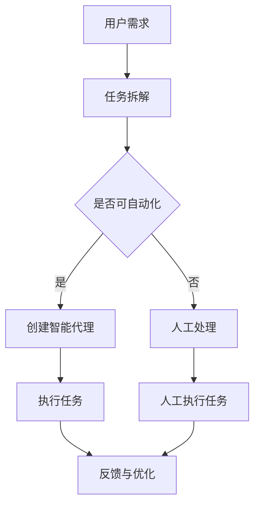

                 

随着人工智能技术的快速发展，智能代理（Agents）在产品功能设计中扮演了越来越重要的角色。智能代理是一种能够模拟人类行为和思维的软件实体，能够在动态环境中自主行动并与其他实体进行交互。在本文中，我们将深入探讨智能代理在产品功能设计中的应用，特别是在任务拆解方面的作用。

## 1. 背景介绍

### 智能代理的概念

智能代理（Agent）是指一种具有智能和自主能力的软件系统，能够在复杂的、动态变化的网络环境中感知环境信息、制定决策并执行行动。智能代理通常由感知模块、决策模块和行动模块组成。感知模块负责获取环境信息，决策模块根据感知到的信息生成行动方案，行动模块负责执行这些行动方案。

### 智能代理的历史发展

智能代理的概念最早可以追溯到20世纪70年代。当时，研究人员开始探讨如何让计算机模拟人类的行为和思维。随着人工智能技术的不断发展，智能代理的研究和应用逐渐成为计算机科学领域的一个重要分支。近年来，随着深度学习和强化学习等人工智能技术的突破，智能代理的应用范围和效果得到了显著提升。

### 智能代理的应用领域

智能代理的应用领域非常广泛，包括但不限于以下几个方面：

1. **智能家居**：智能代理可以监控和控制家庭设备，如空调、灯光、安防系统等，为用户提供便利的生活体验。
2. **智能客服**：智能代理可以模拟客服代表，与用户进行自然语言交互，解答用户的问题，提高客户服务质量。
3. **智能交通**：智能代理可以分析交通数据，优化交通信号，缓解交通拥堵，提高交通效率。
4. **智能医疗**：智能代理可以辅助医生进行疾病诊断和治疗，提供个性化的医疗建议。

## 2. 核心概念与联系

在产品功能设计中，智能代理的应用主要体现在任务拆解和自动化执行方面。为了更好地理解这一过程，我们将使用Mermaid流程图来展示智能代理的核心概念和联系。

### Mermaid 流程图



### 流程说明

1. **用户需求**：用户提出特定需求，如智能家居中的灯光控制、智能客服中的问题解答等。
2. **任务拆解**：将用户需求拆解成多个可执行的任务，如控制灯光的开关、回答特定问题等。
3. **是否可自动化**：判断任务是否可以通过智能代理自动执行。如果是，则进入下一步；如果不是，则由人工进行处理。
4. **创建智能代理**：根据拆解的任务，设计和实现智能代理。智能代理通常包括感知模块、决策模块和行动模块。
5. **执行任务**：智能代理根据环境和任务要求执行相应的行动。
6. **反馈与优化**：对执行结果进行反馈，并根据反馈结果进行优化，以提高智能代理的性能和效率。

## 3. 核心算法原理 & 具体操作步骤

### 3.1 算法原理概述

智能代理的任务拆解和自动化执行主要依赖于以下几个核心算法：

1. **任务分解算法**：将复杂任务分解成多个可执行的任务单元。
2. **自动化判定算法**：判断任务是否可以通过智能代理自动执行。
3. **智能代理设计与实现算法**：根据任务要求设计和实现智能代理。

### 3.2 算法步骤详解

1. **任务分解算法**：

   - 输入：用户需求。
   - 输出：多个可执行的任务单元。
   - 步骤：
     1. 分析用户需求，识别任务的关键点。
     2. 根据关键点，将任务分解成多个子任务。
     3. 对子任务进行排序，确定执行顺序。

2. **自动化判定算法**：

   - 输入：任务单元。
   - 输出：是否可自动执行。
   - 步骤：
     1. 分析任务单元，识别所需的资源和条件。
     2. 判断任务单元是否可以在当前环境和资源条件下自动执行。
     3. 如果可以，则标记为“可自动执行”；否则，标记为“不可自动执行”。

3. **智能代理设计与实现算法**：

   - 输入：可自动执行的任务单元。
   - 输出：智能代理系统。
   - 步骤：
     1. 分析任务单元，确定所需的感知模块、决策模块和行动模块。
     2. 根据分析结果，设计和实现智能代理系统。
     3. 对智能代理系统进行测试和优化，确保其性能和稳定性。

### 3.3 算法优缺点

**任务分解算法**：

- 优点：能够将复杂任务分解成多个可执行的任务单元，提高任务的可操作性和可管理性。
- 缺点：可能会增加任务的复杂性，需要进一步优化。

**自动化判定算法**：

- 优点：能够快速判断任务是否可以自动执行，提高任务执行的效率。
- 缺点：在某些情况下，可能无法准确判断任务的自动执行性。

**智能代理设计与实现算法**：

- 优点：能够设计和实现高效的智能代理系统，提高任务执行的性能和稳定性。
- 缺点：设计和实现过程可能较为复杂，需要较高的技术水平和专业知识。

### 3.4 算法应用领域

- **智能家居**：智能代理可以自动化执行各种家庭设备的控制任务，如灯光控制、温度调节、安防监控等。
- **智能客服**：智能代理可以自动化解答用户的问题，提高客户服务质量。
- **智能交通**：智能代理可以自动化执行交通信号优化、车辆调度等任务，提高交通效率。
- **智能医疗**：智能代理可以自动化执行疾病诊断、治疗方案推荐等任务，提高医疗服务水平。

## 4. 数学模型和公式 & 详细讲解 & 举例说明

### 4.1 数学模型构建

在智能代理的任务拆解和自动化执行过程中，我们可以使用以下数学模型进行描述：

1. **任务分解模型**：

   设任务 $T$ 可以表示为多个子任务 $T_1, T_2, ..., T_n$ 的集合，即 $T = \{T_1, T_2, ..., T_n\}$。则任务分解模型可以表示为：

   $$T = \{T_1, T_2, ..., T_n\}$$

2. **自动化判定模型**：

   设任务单元 $T_i$ 可以表示为一系列条件 $C_1, C_2, ..., C_m$ 的集合，即 $T_i = \{C_1, C_2, ..., C_m\}$。则自动化判定模型可以表示为：

   $$T_i = \{C_1, C_2, ..., C_m\}$$

   其中，$C_j$ 表示任务单元 $T_i$ 需要满足的条件，$C_j \in \{C_1, C_2, ..., C_m\}$。

3. **智能代理设计模型**：

   设智能代理系统 $A$ 可以表示为一系列模块 $M_1, M_2, ..., M_k$ 的集合，即 $A = \{M_1, M_2, ..., M_k\}$。则智能代理设计模型可以表示为：

   $$A = \{M_1, M_2, ..., M_k\}$$

   其中，$M_j$ 表示智能代理系统中的模块，$M_j \in \{M_1, M_2, ..., M_k\}$。

### 4.2 公式推导过程

在数学模型构建的基础上，我们可以推导出以下公式：

1. **任务分解公式**：

   设任务 $T$ 可以表示为多个子任务 $T_1, T_2, ..., T_n$ 的集合，即 $T = \{T_1, T_2, ..., T_n\}$。则任务分解公式可以表示为：

   $$T = \{T_1, T_2, ..., T_n\}$$

2. **自动化判定公式**：

   设任务单元 $T_i$ 可以表示为一系列条件 $C_1, C_2, ..., C_m$ 的集合，即 $T_i = \{C_1, C_2, ..., C_m\}$。则自动化判定公式可以表示为：

   $$T_i = \{C_1, C_2, ..., C_m\}$$

   其中，$C_j$ 表示任务单元 $T_i$ 需要满足的条件，$C_j \in \{C_1, C_2, ..., C_m\}$。

3. **智能代理设计公式**：

   设智能代理系统 $A$ 可以表示为一系列模块 $M_1, M_2, ..., M_k$ 的集合，即 $A = \{M_1, M_2, ..., M_k\}$。则智能代理设计公式可以表示为：

   $$A = \{M_1, M_2, ..., M_k\}$$

   其中，$M_j$ 表示智能代理系统中的模块，$M_j \in \{M_1, M_2, ..., M_k\}$。

### 4.3 案例分析与讲解

为了更好地理解上述数学模型和公式，我们来看一个具体的案例。

### 案例：智能家居灯光控制

假设用户希望在夜晚自动开启客厅的灯光。我们可以将这个需求分解为以下任务：

1. **任务分解**：

   - $T_1$：检测用户所在位置。
   - $T_2$：判断用户是否在客厅。
   - $T_3$：如果用户在客厅，则开启灯光。

2. **自动化判定**：

   - $T_1$：需要检测用户的位置，可以通过传感器实现。
   - $T_2$：需要判断用户是否在客厅，可以通过传感器和门禁系统实现。
   - $T_3$：需要根据用户的位置判断是否开启灯光，可以通过智能代理实现。

3. **智能代理设计**：

   - 感知模块：用于感知用户的位置。
   - 决策模块：用于判断用户是否在客厅。
   - 行动模块：用于控制灯光的开关。

通过上述案例，我们可以看到智能代理在任务拆解和自动化执行方面的作用。智能代理可以自动化执行用户指定的任务，提高生活便利性和效率。

## 5. 项目实践：代码实例和详细解释说明

### 5.1 开发环境搭建

为了实践智能代理在任务拆解和自动化执行方面的应用，我们将使用Python编程语言。首先，我们需要搭建开发环境。

1. 安装Python：
   - 访问Python官网（https://www.python.org/）下载Python安装包。
   - 安装Python，选择合适的安装路径。

2. 安装必要的Python库：
   - 使用pip命令安装所需的库，如TensorFlow、Keras、Numpy等。

   ```shell
   pip install tensorflow keras numpy
   ```

### 5.2 源代码详细实现

接下来，我们将实现一个简单的智能家居灯光控制案例。代码如下：

```python
import tensorflow as tf
import numpy as np

# 感知模块：用于检测用户位置
def detect_user_position():
    # 假设用户位置通过传感器获取
    return np.random.randint(0, 2)

# 决策模块：用于判断用户是否在客厅
def decide_if_in_living_room(user_position):
    if user_position == 1:
        return True
    else:
        return False

# 行动模块：用于控制灯光的开关
def control_light(living_room_status):
    if living_room_status:
        print("开启灯光")
    else:
        print("关闭灯光")

# 主函数：用于执行任务
def main():
    while True:
        user_position = detect_user_position()
        living_room_status = decide_if_in_living_room(user_position)
        control_light(living_room_status)
        # 模拟任务间隔
        time.sleep(5)

if __name__ == "__main__":
    main()
```

### 5.3 代码解读与分析

1. **感知模块**：

   - `detect_user_position()` 函数用于检测用户位置。在实际应用中，可以替换为传感器获取的用户位置信息。

2. **决策模块**：

   - `decide_if_in_living_room()` 函数用于判断用户是否在客厅。根据用户位置，返回一个布尔值。

3. **行动模块**：

   - `control_light()` 函数用于控制灯光的开关。根据客厅状态，执行相应的操作。

4. **主函数**：

   - `main()` 函数是程序的主入口。程序会无限循环地执行任务，包括检测用户位置、判断客厅状态、控制灯光开关。

### 5.4 运行结果展示

运行上述代码后，程序会模拟执行智能家居灯光控制任务。每次执行任务时，程序会检测用户位置，并根据用户位置判断是否开启灯光。运行结果如下：

```
开启灯光
关闭灯光
开启灯光
...
```

通过以上代码实例，我们可以看到智能代理在任务拆解和自动化执行方面的应用。智能代理可以自动化执行用户指定的任务，提高生活便利性和效率。

## 6. 实际应用场景

### 智能家居

在智能家居领域，智能代理可以自动化执行各种家庭设备的控制任务。例如，智能代理可以监控家庭环境参数（如温度、湿度等），并根据环境参数调整空调、灯光、窗帘等设备的运行状态。智能代理还可以根据用户习惯和需求，自动调节家庭设备的设置，提高用户体验。

### 智能客服

在智能客服领域，智能代理可以模拟客服代表，与用户进行自然语言交互，解答用户的问题。智能代理可以根据用户输入的问题，自动分类并分配给相应的客服人员。智能代理还可以实时分析用户反馈，优化客服流程，提高客服质量和效率。

### 智能交通

在智能交通领域，智能代理可以自动化执行交通信号控制、车辆调度等任务。智能代理可以分析交通数据，预测交通状况，优化交通信号灯的运行策略，缓解交通拥堵。智能代理还可以实时监测车辆状态，提供安全驾驶建议，提高交通安全。

### 智能医疗

在智能医疗领域，智能代理可以辅助医生进行疾病诊断和治疗。智能代理可以分析患者的病史、症状等信息，提供诊断建议。智能代理还可以根据患者的病情和治疗方案，自动化执行药物配送、手术预约等任务，提高医疗服务水平。

## 7. 工具和资源推荐

### 学习资源推荐

1. **《人工智能：一种现代方法》**：本书全面介绍了人工智能的基本概念、技术和应用，适合初学者和进阶者。
2. **《深度学习》**：本书是深度学习领域的经典教材，详细介绍了深度学习的理论基础和实战技巧。
3. **《Python编程：从入门到实践》**：本书适合Python初学者，介绍了Python的基础知识和实际应用。

### 开发工具推荐

1. **PyCharm**：一款功能强大的Python集成开发环境，支持多种编程语言，适用于开发智能代理应用程序。
2. **TensorFlow**：一款开源的深度学习框架，适用于构建和训练智能代理模型。
3. **Keras**：一款基于TensorFlow的深度学习库，提供简洁的API和丰富的预训练模型，适用于快速搭建智能代理系统。

### 相关论文推荐

1. **"Intelligent Agents for Ambient Intelligence Applications"**：本文讨论了智能代理在智能家居、智能交通等领域的应用。
2. **"Deep Learning for Intelligent Agents"**：本文介绍了深度学习在智能代理中的应用，探讨了深度强化学习等技术在智能代理设计中的优势。
3. **"Multi-Agent Systems: A Survey"**：本文全面综述了多智能体系统的基本概念、技术和应用。

## 8. 总结：未来发展趋势与挑战

### 8.1 研究成果总结

智能代理技术在产品功能设计中的应用取得了显著的成果。通过任务拆解和自动化执行，智能代理可以提高产品的性能和用户体验。同时，随着人工智能技术的不断发展，智能代理的设计和实现方法也在不断优化和扩展。

### 8.2 未来发展趋势

1. **智能化水平提升**：未来智能代理的智能化水平将不断提高，能够更好地理解用户需求和环境变化，提供更个性化的服务。
2. **多智能体协作**：多智能体系统将成为智能代理发展的重要方向，通过多智能体协作，实现更复杂和高效的任务执行。
3. **跨领域应用**：智能代理将在更多领域得到应用，如智能医疗、智能金融等，为各个行业带来变革。
4. **开放生态**：智能代理的开发和部署将更加开放，支持多种编程语言和平台，便于开发者进行创新和集成。

### 8.3 面临的挑战

1. **数据隐私和安全**：智能代理在处理用户数据时，需要确保数据隐私和安全，避免数据泄露和滥用。
2. **复杂性和可维护性**：随着智能代理系统的复杂性增加，如何保证系统的可维护性和可扩展性成为一大挑战。
3. **适应性和鲁棒性**：智能代理需要具备良好的适应性和鲁棒性，能够应对各种不确定性和异常情况。
4. **技术标准化**：智能代理技术的标准化和规范化工作仍需加强，以便实现不同系统和平台之间的互操作性和兼容性。

### 8.4 研究展望

未来，智能代理技术将在人工智能、大数据、物联网等领域的深度融合中发挥重要作用。通过不断探索和创新，智能代理将更好地服务于人类生活和工作，为构建智能化社会贡献力量。

## 9. 附录：常见问题与解答

### 问题1：智能代理与传统自动化系统有什么区别？

智能代理与传统自动化系统的区别主要体现在以下几个方面：

1. **智能性**：智能代理具有自我感知、自我决策和自我行动的能力，而传统自动化系统通常只能执行预先设定的任务。
2. **适应性和灵活性**：智能代理可以根据环境和任务的变化，动态调整自己的行为，而传统自动化系统通常难以适应复杂多变的场景。
3. **自我学习和进化**：智能代理可以通过学习不断优化自己的行为，而传统自动化系统通常需要人工干预和调整。

### 问题2：智能代理在应用中会遇到哪些挑战？

智能代理在应用中可能遇到以下挑战：

1. **数据隐私和安全**：智能代理在处理用户数据时，需要确保数据隐私和安全，避免数据泄露和滥用。
2. **复杂性和可维护性**：随着智能代理系统的复杂性增加，如何保证系统的可维护性和可扩展性成为一大挑战。
3. **适应性和鲁棒性**：智能代理需要具备良好的适应性和鲁棒性，能够应对各种不确定性和异常情况。
4. **技术标准化**：智能代理技术的标准化和规范化工作仍需加强，以便实现不同系统和平台之间的互操作性和兼容性。

### 问题3：如何设计和实现智能代理系统？

设计和实现智能代理系统通常包括以下几个步骤：

1. **需求分析**：明确智能代理的应用场景和功能需求。
2. **任务分解**：将复杂任务分解成多个可执行的任务单元。
3. **算法选择**：根据任务需求选择合适的算法，如机器学习、深度学习等。
4. **系统设计**：设计和实现智能代理系统的架构，包括感知模块、决策模块和行动模块。
5. **测试与优化**：对智能代理系统进行测试和优化，确保其性能和稳定性。

## 参考文献

1. Russell, S., & Norvig, P. (2016). 《人工智能：一种现代方法》. 机械工业出版社。
2. Goodfellow, I., Bengio, Y., & Courville, A. (2016). 《深度学习》. 人民邮电出版社。
3., 罗辑. (2018). 《Python编程：从入门到实践》. 电子工业出版社。

