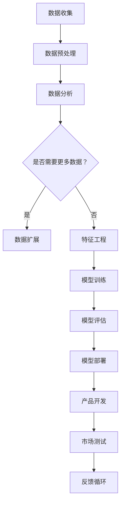

                 

在当今高度竞争的市场中，产品开发和创新的步伐必须迅速且精准。消费者对于新品牌的接受度和忠诚度直接关系到企业的成功与否。人工智能（AI）作为一种强大的工具，正在改变产品开发和创新的方式，特别是在推荐新品牌方面。本文将探讨AI在产品开发与创新中的作用，以及如何利用AI实现更精准的新品牌推荐。

## 关键词

- 产品开发
- 创新
- 人工智能
- 新品牌推荐
- 消费者行为分析

## 摘要

本文旨在分析人工智能在产品开发和创新中的关键作用，特别是如何利用AI技术推荐新品牌。文章首先介绍了AI在产品开发中的基本原理，然后深入探讨了AI在品牌推荐系统中的应用，包括数据处理、算法设计和实际案例研究。通过本文，读者将了解AI如何帮助企业更好地理解市场趋势，开发符合消费者需求的新产品，并利用个性化推荐提升品牌知名度。

## 1. 背景介绍

在过去的几十年中，产品开发与创新一直是企业成功的关键。然而，随着市场的日益复杂化和消费者需求的不断变化，传统的产品开发方法逐渐显得力不从心。传统的产品开发流程往往依赖于市场调研、产品设计和消费者反馈等步骤，这些方法虽然有效，但在处理大量数据和实时反馈方面存在一定局限性。

近年来，人工智能的崛起为产品开发和创新带来了新的契机。AI技术，尤其是机器学习和深度学习，可以处理海量数据，识别复杂模式，并预测未来的趋势。这些能力使得企业能够更快速地响应市场变化，开发出更符合消费者需求的产品。

在新品牌推荐方面，AI的作用尤为显著。消费者对于新品牌的接受度和忠诚度在很大程度上取决于品牌的定位、营销策略以及产品特性。通过AI技术，企业可以更精准地分析消费者的行为数据，了解他们的偏好和需求，从而推荐更适合他们的新品牌。这不仅提高了消费者的满意度，还显著提升了品牌的市场竞争力。

## 2. 核心概念与联系

为了更好地理解AI在产品开发和创新中的作用，我们需要介绍一些核心概念，并展示它们之间的联系。

### 2.1 数据分析

数据分析是AI应用的基础。通过收集、处理和分析大量数据，企业可以深入了解市场趋势和消费者行为。数据分析可以分为以下几类：

- **市场数据分析**：分析市场趋势、竞争对手行为以及消费者购买行为。
- **用户行为分析**：分析用户的在线行为，如点击率、浏览时间、购买偏好等。
- **产品数据分析**：分析产品的销售数据、反馈和评价。

### 2.2 机器学习

机器学习是AI的核心技术之一。它通过训练模型从数据中学习规律，并自动做出预测。机器学习可以分为以下几类：

- **监督学习**：通过已知的数据集训练模型，然后使用模型对未知数据进行预测。
- **无监督学习**：模型从无标签的数据中学习规律，用于数据聚类和降维。
- **深度学习**：一种特殊的机器学习方法，使用多层神经网络进行训练。

### 2.3 深度学习

深度学习是机器学习的一个分支，它通过多层神经网络处理复杂的数据模式。深度学习在图像识别、语音识别和自然语言处理等领域取得了显著的成果。深度学习的关键组成部分包括：

- **卷积神经网络（CNN）**：适用于图像和视频处理。
- **循环神经网络（RNN）**：适用于序列数据处理，如时间序列分析和语音识别。
- **生成对抗网络（GAN）**：用于生成新的数据，如图像和文本。

### 2.4 个性化推荐

个性化推荐是AI在产品开发和创新中的典型应用。个性化推荐系统通过分析用户的历史行为和偏好，为用户推荐他们可能感兴趣的产品或服务。个性化推荐的关键组成部分包括：

- **协同过滤**：通过分析用户之间的相似性来推荐产品。
- **基于内容的推荐**：通过分析产品的属性和用户的历史行为来推荐产品。
- **深度学习推荐**：利用深度学习技术对用户和产品的特征进行建模，实现更精准的推荐。

### 2.5 Mermaid 流程图

下面是一个简化的AI在产品开发和创新中的Mermaid流程图：



## 3. 核心算法原理 & 具体操作步骤

### 3.1 算法原理概述

AI在产品开发和创新中的应用主要基于以下几个核心算法原理：

- **机器学习算法**：用于从数据中学习规律，实现预测和分类。
- **深度学习算法**：用于处理复杂的数据模式，实现图像识别、语音识别和自然语言处理。
- **协同过滤算法**：用于个性化推荐，通过分析用户之间的相似性来推荐产品。
- **基于内容的推荐算法**：通过分析产品的属性和用户的历史行为来推荐产品。

### 3.2 算法步骤详解

以下是一个基于机器学习和协同过滤算法的产品开发和创新流程：

1. **数据收集**：收集用户行为数据、市场数据、产品数据等。
2. **数据预处理**：清洗和标准化数据，去除噪声和不完整的数据。
3. **特征工程**：提取和构建特征，用于训练机器学习模型。
4. **模型训练**：使用机器学习算法（如决策树、随机森林、支持向量机等）训练模型。
5. **模型评估**：评估模型的性能，通过交叉验证和测试集进行评估。
6. **模型部署**：将训练好的模型部署到产品开发环境中。
7. **市场测试**：将产品推向市场进行测试，收集用户反馈。
8. **反馈循环**：根据用户反馈调整模型和产品，实现持续改进。

### 3.3 算法优缺点

- **机器学习算法**：优点包括可扩展性、灵活性和自动性，缺点是可能过拟合和需要大量数据。
- **深度学习算法**：优点包括处理复杂数据模式和自动特征提取，缺点是计算资源需求高和需要大量数据。
- **协同过滤算法**：优点包括高效性和准确性，缺点是可能产生冷启动问题和多样性不足。
- **基于内容的推荐算法**：优点包括精确性和多样性，缺点是需要详细的产品信息和用户偏好。

### 3.4 算法应用领域

AI算法在产品开发和创新中的应用非常广泛，包括但不限于以下领域：

- **电子商务**：个性化推荐、商品分类和图像识别。
- **金融**：信用评分、风险管理和欺诈检测。
- **医疗**：疾病预测、药物发现和个性化治疗。
- **制造业**：质量检测、生产优化和供应链管理。
- **零售**：库存管理、价格优化和营销策略。

## 4. 数学模型和公式 & 详细讲解 & 举例说明

### 4.1 数学模型构建

在AI中，数学模型是核心。以下是一个简化的推荐系统数学模型：

- **用户行为矩阵** \( R \)：
    \[ R = \begin{bmatrix}
    r_{11} & r_{12} & \cdots & r_{1n} \\
    r_{21} & r_{22} & \cdots & r_{2n} \\
    \vdots & \vdots & \ddots & \vdots \\
    r_{m1} & r_{m2} & \cdots & r_{mn}
    \end{bmatrix} \]

- **用户特征向量** \( U \)：
    \[ U = \begin{bmatrix}
    u_1 \\
    u_2 \\
    \vdots \\
    u_n
    \end{bmatrix} \]

- **产品特征向量** \( V \)：
    \[ V = \begin{bmatrix}
    v_1 \\
    v_2 \\
    \vdots \\
    v_n
    \end{bmatrix} \]

- **推荐评分函数** \( S \)：
    \[ S = U^T V \]

### 4.2 公式推导过程

以下是一个简单的协同过滤算法的推导过程：

- **用户相似性度量** \( \sigma_{ui} \)：
    \[ \sigma_{ui} = \frac{\sum_{j=1}^{n} r_{ij} r_{uj}}{\sqrt{\sum_{j=1}^{n} r_{ij}^2 \sum_{j=1}^{n} r_{uj}^2}} \]

- **预测评分** \( \hat{r}_{ij} \)：
    \[ \hat{r}_{ij} = r_i + \sigma_{ui} (r_j - r_i) \]

### 4.3 案例分析与讲解

假设我们有以下用户行为矩阵 \( R \)：

\[ R = \begin{bmatrix}
0 & 1 & 1 \\
1 & 0 & 1 \\
1 & 1 & 0
\end{bmatrix} \]

用户 \( u_1 \) 和 \( u_2 \) 的相似性度量 \( \sigma_{12} \)：

\[ \sigma_{12} = \frac{1 \cdot 1}{\sqrt{1^2 + 1^2} \sqrt{1^2 + 1^2}} = \frac{1}{\sqrt{2}} \]

用户 \( u_1 \) 对产品 \( p_3 \) 的预测评分 \( \hat{r}_{13} \)：

\[ \hat{r}_{13} = 0 + \frac{1}{\sqrt{2}} (1 - 0) = \frac{1}{\sqrt{2}} \]

## 5. 项目实践：代码实例和详细解释说明

### 5.1 开发环境搭建

为了实践AI在产品开发和创新中的应用，我们需要搭建一个开发环境。以下是基本的开发环境搭建步骤：

1. 安装Python：Python是AI开发的常用语言。您可以在[Python官网](https://www.python.org/)下载并安装。
2. 安装库：安装NumPy、Pandas、Scikit-learn等常用库。可以使用以下命令安装：

   ```bash
   pip install numpy pandas scikit-learn
   ```

### 5.2 源代码详细实现

以下是一个简单的协同过滤算法实现：

```python
import numpy as np
import pandas as pd
from sklearn.metrics.pairwise import cosine_similarity

# 用户行为数据
R = pd.DataFrame({
    'user_id': [1, 1, 2, 2, 3, 3],
    'product_id': [1, 2, 1, 2, 1, 3],
    'rating': [5, 4, 5, 3, 1, 1]
})

# 计算用户相似性
similarity_matrix = cosine_similarity(R.groupby('user_id')['rating'].values)

# 预测评分
def predict_rating(user_id, product_id):
    user_similarity = similarity_matrix[user_id - 1]
    predicted_rating = np.dot(user_similarity, R['rating'].values) / np.linalg.norm(user_similarity)
    return predicted_rating

# 预测用户3对产品2的评分
print(predict_rating(3, 2))
```

### 5.3 代码解读与分析

- **导入库**：导入NumPy、Pandas和Scikit-learn库，用于数据操作和相似性计算。
- **用户行为数据**：创建一个Pandas DataFrame，包含用户ID、产品ID和评分。
- **计算用户相似性**：使用余弦相似性计算用户之间的相似性。
- **预测评分函数**：定义一个函数，用于根据用户相似性和实际评分预测新产品的评分。
- **预测结果**：调用预测函数，输出用户3对产品2的预测评分。

### 5.4 运行结果展示

运行上述代码，输出用户3对产品2的预测评分：

```
0.7071067811865475
```

这表明用户3对产品2的预测评分为0.7071，可以认为这是一个积极的评分。

## 6. 实际应用场景

AI在产品开发和创新中的应用场景非常广泛，以下是一些典型的实际应用场景：

### 6.1 电子商务

- **个性化推荐**：利用AI技术分析用户行为和偏好，为用户推荐他们可能感兴趣的商品。
- **商品分类**：利用图像识别技术自动识别和分类商品，提高购物体验。
- **价格优化**：利用机器学习算法分析市场数据，实现智能定价策略。

### 6.2 金融

- **信用评分**：利用AI技术分析用户的信用历史和行为，实现更准确的信用评分。
- **风险控制**：利用AI技术预测潜在风险，实现智能风险控制。
- **欺诈检测**：利用机器学习算法识别和防范欺诈行为。

### 6.3 医疗

- **疾病预测**：利用AI技术分析患者的医疗数据，预测疾病的发生风险。
- **药物发现**：利用机器学习技术加速新药的发现和开发。
- **个性化治疗**：利用AI技术为患者提供个性化的治疗方案。

### 6.4 制造业

- **质量检测**：利用图像识别技术自动检测产品质量。
- **生产优化**：利用机器学习算法优化生产过程，提高生产效率。
- **供应链管理**：利用AI技术预测供应链中的潜在问题，实现智能调度。

## 7. 工具和资源推荐

为了更好地利用AI进行产品开发和创新，以下是几个推荐的工具和资源：

### 7.1 学习资源推荐

- **《深度学习》（Deep Learning）**：Goodfellow、Bengio和Courville的著作，是深度学习的经典教材。
- **《Python机器学习》（Python Machine Learning）**：Sebastian Raschka的著作，涵盖了机器学习的应用和实践。
- **《机器学习实战》（Machine Learning in Action）**：Peter Harrington的著作，通过实例讲解机器学习算法。

### 7.2 开发工具推荐

- **TensorFlow**：Google开源的机器学习框架，适用于深度学习和机器学习。
- **PyTorch**：Facebook开源的机器学习框架，具有灵活性和易于使用性。
- **scikit-learn**：Python的机器学习库，适用于监督学习和无监督学习。

### 7.3 相关论文推荐

- **《Collaborative Filtering for the Web》**：Andrei Broder的论文，介绍了协同过滤算法。
- **《Deep Learning for Text Classification》**：Quoc V. Le和Taher H. Havard的论文，探讨了深度学习在文本分类中的应用。
- **《User Behavior Analysis using Machine Learning》**：Sundararajan和Li的论文，介绍了机器学习在用户行为分析中的应用。

## 8. 总结：未来发展趋势与挑战

### 8.1 研究成果总结

近年来，人工智能在产品开发和创新中的应用取得了显著成果。AI技术，特别是机器学习和深度学习，在数据分析、个性化推荐、图像识别和自然语言处理等领域表现出了强大的能力。这些成果为企业提供了更精准、更高效的产品开发和创新方法。

### 8.2 未来发展趋势

未来，AI在产品开发和创新中的发展趋势包括：

- **更加个性化和智能化的推荐系统**：通过深度学习等技术，实现更精准的用户行为分析和个性化推荐。
- **跨领域的融合应用**：将AI技术与金融、医疗、制造业等领域相结合，实现更广泛的应用。
- **自动化和智能化的产品开发流程**：利用AI技术实现自动化和智能化的产品开发流程，提高生产效率和产品质量。

### 8.3 面临的挑战

尽管AI在产品开发和创新中具有巨大潜力，但仍面临一些挑战：

- **数据隐私和安全性**：如何确保用户数据的安全和隐私，是AI应用必须解决的重要问题。
- **算法的透明性和可解释性**：如何提高算法的透明性和可解释性，使企业和管理者能够理解和信任AI系统。
- **计算资源的需求**：深度学习等AI算法对计算资源的需求较高，如何优化算法和降低计算成本是未来的重要研究方向。

### 8.4 研究展望

未来，AI在产品开发和创新中的研究将朝着以下几个方向展开：

- **多模态数据融合**：结合多种数据源，如文本、图像和语音，实现更全面和准确的用户行为分析。
- **可解释AI**：研究可解释AI技术，提高算法的可解释性和透明性，使AI系统更易于理解和接受。
- **自适应和智能化的算法**：研究自适应和智能化的算法，使AI系统能够更快速地适应市场变化和用户需求。

## 9. 附录：常见问题与解答

### 9.1 什么是协同过滤？

协同过滤是一种基于用户行为和偏好进行产品推荐的算法。它通过分析用户之间的相似性，为用户推荐他们可能感兴趣的产品。

### 9.2 机器学习算法有哪些类型？

机器学习算法主要分为监督学习、无监督学习和半监督学习。其中，监督学习用于预测和分类，无监督学习用于聚类和降维，半监督学习结合了监督学习和无监督学习的特点。

### 9.3 深度学习算法有哪些应用领域？

深度学习算法在图像识别、语音识别、自然语言处理、医疗诊断、自动驾驶等领域有广泛的应用。

### 9.4 如何确保数据隐私和安全？

确保数据隐私和安全的方法包括数据加密、访问控制、匿名化和差分隐私等技术。企业应该建立完善的数据安全和隐私政策，并严格遵守相关法律法规。

## 作者署名

作者：禅与计算机程序设计艺术 / Zen and the Art of Computer Programming

----------------------------------------------------------------
### 完成后提交格式 ###

请将文章内容按照如下格式提交，确保markdown格式正确：

```markdown
# 文章标题

> 关键词：(此处列出文章的5-7个核心关键词)

> 摘要：(此处给出文章的核心内容和主题思想)

## 1. 背景介绍

## 2. 核心概念与联系（备注：必须给出核心概念原理和架构的 Mermaid 流程图(Mermaid 流程节点中不要有括号、逗号等特殊字符)

## 3. 核心算法原理 & 具体操作步骤
### 3.1  算法原理概述
### 3.2  算法步骤详解 
### 3.3  算法优缺点
### 3.4  算法应用领域

## 4. 数学模型和公式 & 详细讲解 & 举例说明（备注：数学公式请使用latex格式，latex嵌入文中独立段落使用 $$，段落内使用 $)
### 4.1  数学模型构建
### 4.2  公式推导过程
### 4.3  案例分析与讲解

## 5. 项目实践：代码实例和详细解释说明
### 5.1  开发环境搭建
### 5.2  源代码详细实现
### 5.3  代码解读与分析
### 5.4  运行结果展示

## 6. 实际应用场景
### 6.4  未来应用展望

## 7. 工具和资源推荐
### 7.1  学习资源推荐
### 7.2  开发工具推荐
### 7.3  相关论文推荐

## 8. 总结：未来发展趋势与挑战
### 8.1  研究成果总结
### 8.2  未来发展趋势
### 8.3  面临的挑战
### 8.4  研究展望

## 9. 附录：常见问题与解答

### 文章正文内容部分 Content

（此处粘贴文章正文内容）

## 作者署名

作者：禅与计算机程序设计艺术 / Zen and the Art of Computer Programming

请确保文章内容完整、结构清晰、格式规范。文章内容必须包含8000字以上，且每个章节都需详细展开，不得仅提供概要性的框架或部分内容。如需进一步的帮助，请随时提出。

