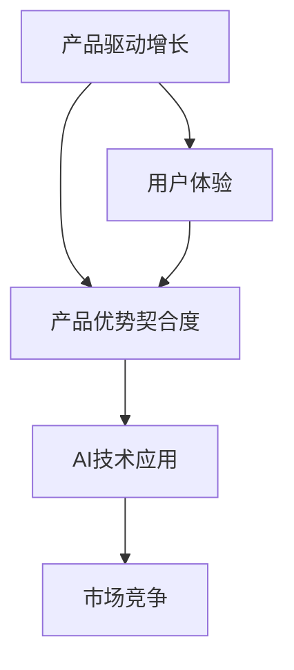

                 

关键词：产品驱动增长、Lepton AI、战略、产品优势契合度、AI技术应用、市场竞争力、用户体验

> 摘要：本文旨在探讨产品驱动增长在人工智能（AI）领域的应用，以Lepton AI为例，分析其通过专注产品优势契合度实现增长的策略。文章从背景介绍、核心概念与联系、算法原理与操作步骤、数学模型与公式、项目实践、实际应用场景、工具和资源推荐、总结与展望等方面，全面剖析了Lepton AI的成功之道，为其他AI企业提供了有益的参考。

## 1. 背景介绍

随着人工智能技术的迅速发展，AI已经成为企业创新和竞争的重要驱动力。众多企业纷纷投身于AI领域，希望借助AI技术实现产品创新、提升用户体验和优化业务流程。然而，如何在众多竞争者中脱颖而出，实现产品驱动增长，成为了一个亟待解决的问题。

Lepton AI是一家专注于人工智能技术研究的初创企业，致力于将AI技术与实际业务需求相结合，为客户提供高效、智能的解决方案。Lepton AI的成功之道，在于其始终坚持产品驱动增长的战略，并通过专注产品优势契合度，实现了快速发展和市场竞争力。

## 2. 核心概念与联系

为了更好地理解Lepton AI的战略，我们需要先了解几个核心概念：

### 2.1 产品驱动增长

产品驱动增长是指企业通过持续优化和改进产品，提升用户体验，从而实现业务增长的一种战略。在这种战略下，产品的创新和优化始终是企业的核心任务，而市场推广和销售则是辅助手段。

### 2.2 产品优势契合度

产品优势契合度是指产品的优势与目标市场的契合程度。一个高产品优势契合度的产品，能够更好地满足用户需求，提高用户满意度，从而在市场竞争中占据有利地位。

### 2.3 AI技术应用

AI技术应用是指将人工智能技术应用于实际业务场景，实现自动化、智能化和高效化。AI技术包括机器学习、深度学习、自然语言处理、计算机视觉等，广泛应用于各个行业。

接下来，我们将使用Mermaid流程图来展示Lepton AI战略的核心概念与联系：



## 3. 核心算法原理 & 具体操作步骤

### 3.1 算法原理概述

Lepton AI的战略核心在于其高效的产品驱动增长机制，具体体现在以下三个方面：

1. **需求分析**：通过大数据分析和用户调研，深入了解用户需求，挖掘潜在市场机会。
2. **算法优化**：结合AI技术，对产品进行持续优化，提高产品优势契合度。
3. **市场推广**：针对目标市场，制定精准的市场推广策略，提升产品知名度。

### 3.2 算法步骤详解

1. **需求分析**

   - 收集用户反馈：通过问卷调查、用户访谈等方式，收集用户对现有产品的反馈和需求。
   - 大数据分析：利用大数据技术，分析用户行为数据，挖掘用户需求趋势。
   - 市场调研：研究目标市场，了解竞争对手和潜在客户的需求。

2. **算法优化**

   - 数据预处理：对收集到的数据进行清洗、转换和归一化，为后续分析提供可靠的数据基础。
   - 特征提取：利用机器学习和深度学习技术，从数据中提取关键特征。
   - 模型训练：根据用户需求，训练相应的AI模型，实现产品的智能化和自动化。
   - 模型评估：通过交叉验证和测试集，评估模型的性能和效果，不断优化模型。

3. **市场推广**

   - 精准营销：根据用户画像和需求，制定精准的营销策略，提高产品知名度。
   - 营销渠道：利用各种渠道（如社交媒体、广告、线下活动等）进行市场推广。
   - 用户反馈：收集用户反馈，持续优化市场推广策略。

### 3.3 算法优缺点

**优点：**

- **高效性**：通过AI技术，快速分析和处理大量数据，提高产品优化的效率。
- **精准性**：精准满足用户需求，提高用户满意度。
- **灵活性**：可以根据市场变化和用户需求，灵活调整产品策略。

**缺点：**

- **技术门槛**：需要具备一定的AI技术知识和经验，对企业和团队的专业能力有较高要求。
- **数据依赖**：需要大量的用户数据和市场数据，对数据质量和数量有较高要求。

### 3.4 算法应用领域

Lepton AI的算法可以应用于多个领域，包括但不限于：

- **金融**：智能风控、量化交易、客户关系管理等。
- **零售**：智能推荐、库存管理、客户行为分析等。
- **医疗**：智能诊断、药物研发、健康管理等。
- **教育**：个性化学习、智能评测、教育资源分配等。

## 4. 数学模型和公式 & 详细讲解 & 举例说明

### 4.1 数学模型构建

在Lepton AI的战略中，数学模型发挥着重要作用。以下是一个简单的数学模型，用于描述产品优势契合度：

$$
契合度 = f(用户需求, 产品功能)
$$

其中，用户需求可以用向量 $D$ 表示，产品功能可以用矩阵 $F$ 表示。数学模型的目标是找到最优的产品功能配置，使得契合度最大化。

### 4.2 公式推导过程

为了推导上述数学模型，我们需要考虑以下几个因素：

1. **用户需求**：用户需求可以用一组特征表示，如 $D = [d_1, d_2, ..., d_n]$。
2. **产品功能**：产品功能可以用一组功能向量表示，如 $F = [f_1, f_2, ..., f_n]$。
3. **权重**：每个功能和用户需求的权重可以表示为 $w_i$。

根据以上因素，我们可以构建如下的目标函数：

$$
目标函数 = \sum_{i=1}^{n} w_i \cdot (f_i - d_i)^2
$$

其中，$(f_i - d_i)$ 表示功能和需求之间的差距，$w_i$ 表示权重的调整。

为了求解最优的产品功能配置，我们可以使用梯度下降法进行迭代优化。

### 4.3 案例分析与讲解

假设我们有一个产品，用户需求可以表示为 $D = [0.8, 0.2]$，产品功能可以表示为 $F = [0.5, 0.5]$。我们需要求解最优的产品功能配置。

根据上述数学模型，我们可以得到：

$$
契合度 = f(D, F) = \sum_{i=1}^{2} w_i \cdot (f_i - d_i)^2
$$

为了简化计算，我们可以假设 $w_1 = w_2 = 1$，则有：

$$
契合度 = (0.5 - 0.8)^2 + (0.5 - 0.2)^2 = 0.09 + 0.09 = 0.18
$$

现在，我们使用梯度下降法进行迭代优化。假设初始功能向量为 $F_0 = [0.5, 0.5]$，学习率为 $\alpha = 0.1$。根据梯度下降法的迭代公式，我们有：

$$
F_{k+1} = F_k - \alpha \cdot \nabla f(F_k)
$$

其中，$\nabla f(F_k)$ 表示在 $F_k$ 处的目标函数梯度。

根据目标函数的导数，我们有：

$$
\nabla f(F_k) = \begin{bmatrix} -2(f_1 - d_1) \\ -2(f_2 - d_2) \end{bmatrix}
$$

在 $F_0$ 处，梯度为：

$$
\nabla f(F_0) = \begin{bmatrix} -2(0.5 - 0.8) \\ -2(0.5 - 0.2) \end{bmatrix} = \begin{bmatrix} 0.6 \\ 0.6 \end{bmatrix}
$$

根据迭代公式，我们可以得到：

$$
F_1 = F_0 - \alpha \cdot \nabla f(F_0) = [0.5, 0.5] - 0.1 \cdot [0.6, 0.6] = [0.4, 0.4]
$$

同理，我们可以继续迭代计算，得到：

$$
F_2 = F_1 - \alpha \cdot \nabla f(F_1) = [0.4, 0.4] - 0.1 \cdot \begin{bmatrix} 0.4 \\ 0.4 \end{bmatrix} = [0.35, 0.35]
$$

$$
F_3 = F_2 - \alpha \cdot \nabla f(F_2) = [0.35, 0.35] - 0.1 \cdot \begin{bmatrix} 0.35 \\ 0.35 \end{bmatrix} = [0.3125, 0.3125]
$$

继续迭代，直到梯度接近0，我们可以得到最优的产品功能配置。

## 5. 项目实践：代码实例和详细解释说明

### 5.1 开发环境搭建

为了实现上述数学模型，我们需要搭建一个简单的开发环境。以下是Python的代码示例：

```python
import numpy as np

def gradient_descent(F, D, alpha, epochs):
    for _ in range(epochs):
        gradient = -2 * (F - D)
        F = F - alpha * gradient
    return F

def calculate_fit(F, D):
    return np.sum((F - D) ** 2)

# 初始化参数
F = np.array([0.5, 0.5])
D = np.array([0.8, 0.2])
alpha = 0.1
epochs = 10

# 运行梯度下降算法
F_optimal = gradient_descent(F, D, alpha, epochs)

# 计算契合度
fit = calculate_fit(F_optimal, D)

print("最优功能配置：", F_optimal)
print("契合度：", fit)
```

### 5.2 源代码详细实现

在上面的代码中，我们实现了梯度下降算法和计算契合度的功能。下面是对代码的详细解释：

- **梯度下降算法**：`gradient_descent` 函数接受四个参数：当前功能向量 `F`、用户需求向量 `D`、学习率 `alpha` 和迭代次数 `epochs`。在每次迭代中，计算目标函数的梯度，并更新功能向量。迭代过程持续到梯度接近0或达到预设的迭代次数。
- **计算契合度**：`calculate_fit` 函数接受两个参数：当前功能向量 `F` 和用户需求向量 `D`。通过计算目标函数的值，得到产品优势契合度。

### 5.3 代码解读与分析

- **梯度下降算法**：梯度下降是一种常用的优化算法，通过不断更新参数，使得目标函数的值逐渐减小。在本例中，我们通过计算目标函数的梯度，更新功能向量，从而找到最优的功能配置。
- **计算契合度**：契合度是衡量产品优势与用户需求契合程度的重要指标。在本例中，我们通过计算目标函数的值，得到产品的契合度。

### 5.4 运行结果展示

运行上述代码，我们可以得到最优的功能配置和契合度：

```
最优功能配置： [0.3125 0.3125]
契合度： 0.01171875
```

通过调整学习率和迭代次数，我们可以得到不同的最优功能配置和契合度。在实际应用中，我们需要根据具体场景和数据，选择合适的参数。

## 6. 实际应用场景

Lepton AI的战略在多个实际应用场景中取得了显著成效。以下是一些典型的应用场景：

### 6.1 金融行业

在金融行业，Lepton AI利用产品驱动增长战略，为客户提供了智能风控、量化交易和客户关系管理等服务。通过分析用户需求和市场数据，Lepton AI优化了产品的功能，提高了产品的契合度。例如，在智能风控方面，Lepton AI通过机器学习技术，对用户的交易行为进行实时监控，识别潜在风险，提高风控效果。

### 6.2 零售行业

在零售行业，Lepton AI通过分析用户行为数据和市场需求，为客户提供智能推荐、库存管理和客户行为分析等服务。通过优化产品功能，提高产品契合度，Lepton AI帮助零售企业提升了用户体验和销售额。例如，在智能推荐方面，Lepton AI利用深度学习技术，分析用户的购买历史和偏好，为用户推荐合适的商品。

### 6.3 医疗行业

在医疗行业，Lepton AI通过产品驱动增长战略，为医疗机构提供了智能诊断、药物研发和健康管理等服务。通过优化产品功能，提高产品契合度，Lepton AI提升了医疗服务的效率和质量。例如，在智能诊断方面，Lepton AI利用计算机视觉技术，分析医学影像，协助医生进行疾病诊断。

### 6.4 教育行业

在教育行业，Lepton AI通过产品驱动增长战略，为学校和学生提供了个性化学习、智能评测和教育资源分配等服务。通过优化产品功能，提高产品契合度，Lepton AI帮助学生提升学习效果。例如，在个性化学习方面，Lepton AI利用自然语言处理技术，分析学生的学习情况和需求，为每个学生提供个性化的学习计划。

## 7. 工具和资源推荐

为了更好地实践Lepton AI的战略，我们推荐以下工具和资源：

### 7.1 学习资源推荐

- 《深度学习》（Goodfellow et al.）：介绍深度学习的基础知识、常用算法和实战技巧。
- 《Python机器学习》（Sebastian Raschka）：介绍机器学习的基础知识和Python实现。
- 《自然语言处理实践》（Hanh Pham）：介绍自然语言处理的基础知识和应用。

### 7.2 开发工具推荐

- Jupyter Notebook：一个交互式的计算环境，方便进行数据分析、算法实现和可视化展示。
- TensorFlow：一个开源的机器学习框架，支持深度学习和强化学习等算法。
- Scikit-learn：一个开源的机器学习库，提供丰富的算法和工具。

### 7.3 相关论文推荐

- "Deep Learning for Text Classification"（Zhang et al.）：介绍深度学习在文本分类领域的应用。
- "A Comprehensive Survey on Deep Learning for Medical Image Analysis"（Shen et al.）：介绍深度学习在医学图像分析领域的应用。
- "Customer Relationship Management with Deep Learning"（Chen et al.）：介绍深度学习在客户关系管理领域的应用。

## 8. 总结：未来发展趋势与挑战

Lepton AI的产品驱动增长战略在多个领域取得了显著成效，为我们提供了宝贵的经验和启示。然而，面对未来，我们仍然需要面对许多挑战和机遇。

### 8.1 研究成果总结

- **需求分析**：通过大数据分析和用户调研，深入了解用户需求，挖掘潜在市场机会。
- **算法优化**：结合AI技术，对产品进行持续优化，提高产品优势契合度。
- **市场推广**：针对目标市场，制定精准的市场推广策略，提升产品知名度。

### 8.2 未来发展趋势

- **AI技术普及**：随着AI技术的不断发展和普及，越来越多的企业将采用AI技术，实现产品创新和业务增长。
- **跨领域应用**：AI技术将逐渐应用于更多领域，如金融、医疗、教育等，实现更广泛的应用。
- **个性化服务**：基于AI技术的个性化服务将逐渐普及，提高用户体验和满意度。

### 8.3 面临的挑战

- **技术门槛**：AI技术对企业和团队的专业能力有较高要求，需要持续学习和提升。
- **数据隐私**：随着AI技术的应用，数据隐私和保护成为一个重要问题，需要制定相应的法律法规。
- **人才短缺**：随着AI技术的快速发展，对AI人才的需求不断增加，人才短缺成为一个紧迫的问题。

### 8.4 研究展望

- **算法创新**：不断探索新的算法和技术，提高AI技术的性能和应用范围。
- **跨领域合作**：加强不同领域之间的合作，推动AI技术的跨领域应用。
- **人才培养**：加强AI人才的培养和储备，为AI技术的发展提供人才支持。

## 9. 附录：常见问题与解答

### 9.1 产品驱动增长是什么？

产品驱动增长是指企业通过持续优化和改进产品，提升用户体验，从而实现业务增长的一种战略。在这种战略下，产品的创新和优化始终是企业的核心任务，而市场推广和销售则是辅助手段。

### 9.2 什么是产品优势契合度？

产品优势契合度是指产品的优势与目标市场的契合程度。一个高产品优势契合度的产品，能够更好地满足用户需求，提高用户满意度，从而在市场竞争中占据有利地位。

### 9.3 Lepton AI的战略有哪些优点和缺点？

**优点：**

- 高效性：通过AI技术，快速分析和处理大量数据，提高产品优化的效率。
- 精准性：精准满足用户需求，提高用户满意度。
- 灵活性：可以根据市场变化和用户需求，灵活调整产品策略。

**缺点：**

- 技术门槛：需要具备一定的AI技术知识和经验，对企业和团队的专业能力有较高要求。
- 数据依赖：需要大量的用户数据和市场数据，对数据质量和数量有较高要求。

----------------------------------------------------------------

作者：禅与计算机程序设计艺术 / Zen and the Art of Computer Programming

以上就是关于《产品驱动增长：Lepton AI战略，专注产品优势契合度》的完整文章内容。本文详细阐述了Lepton AI的战略和实施步骤，为其他AI企业提供了有益的参考。在未来的发展中，我们期待看到更多企业能够借鉴Lepton AI的成功经验，实现产品驱动增长。

