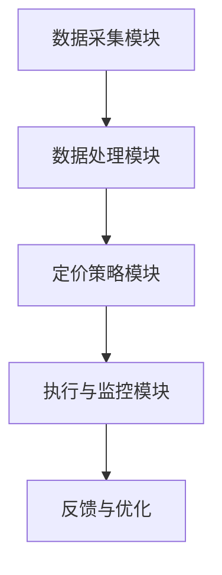

                 

## 1. 背景介绍

京东作为我国领先的电子商务平台，不仅在商品销售方面具有独特的优势，还在技术创新和应用方面不断探索。近年来，随着人工智能技术的快速发展，京东开始将智能定价系统应用于其电商平台上，以期提高定价的精准度和市场竞争力。

智能定价系统是一种基于大数据分析和机器学习算法的自动化定价工具。它通过对历史销售数据、市场动态、用户行为等多维度数据的深度挖掘，结合算法模型，自动生成最优的定价策略。这种定价方式不仅能够降低人工定价的复杂度和误差，还能更好地应对市场变化，提高商品的竞争力。

京东2024校招中，智能定价系统工程师岗位备受关注。这个岗位要求应聘者具备扎实的计算机科学基础、良好的编程能力、对数据分析和机器学习有深入的理解，以及能够独立进行系统设计和开发的能力。本文将针对这一岗位的面试题目进行详细解析，帮助应聘者更好地准备面试。

## 2. 核心概念与联系

### 2.1 智能定价系统的核心概念

智能定价系统主要涉及以下几个核心概念：

- **价格弹性**：商品价格变动对需求量的影响程度。
- **竞争分析**：通过分析竞争对手的定价策略，了解市场动态。
- **库存管理**：根据库存情况调整定价策略，确保库存流转。
- **利润最大化**：通过定价策略实现最大化的利润。

### 2.2 智能定价系统的架构

智能定价系统通常包括以下几个模块：

- **数据采集模块**：负责收集商品销售数据、用户行为数据、市场数据等。
- **数据处理模块**：对采集到的数据进行清洗、转换和存储。
- **定价策略模块**：根据算法模型生成定价策略。
- **执行与监控模块**：将定价策略应用于实际销售，并对定价效果进行监控和评估。

### 2.3 Mermaid 流程图



## 3. 核心算法原理 & 具体操作步骤

### 3.1 算法原理概述

智能定价系统通常采用以下几种算法原理：

- **线性回归**：通过历史数据建立价格与需求量之间的关系模型。
- **逻辑回归**：用于预测价格对需求量的影响。
- **决策树**：通过多维度数据分类，生成决策路径。
- **神经网络**：通过多层神经网络，实现复杂的价格预测。

### 3.2 算法步骤详解

#### 3.2.1 数据预处理

1. 数据清洗：去除无效、错误数据。
2. 数据转换：将数值型数据转换为适合算法处理的形式。
3. 特征工程：提取对定价有重要影响的数据特征。

#### 3.2.2 模型训练

1. 划分训练集和测试集。
2. 选择合适的算法模型。
3. 进行模型训练和调优。

#### 3.2.3 定价策略生成

1. 根据模型预测结果，生成定价策略。
2. 考虑价格弹性、竞争分析、库存管理等因素。

#### 3.2.4 定价策略执行与评估

1. 将定价策略应用于实际销售。
2. 收集实际销售数据，对定价策略进行评估。

### 3.3 算法优缺点

#### 3.3.1 优点

- **精准性**：通过大数据分析和机器学习算法，定价更加精准。
- **自动化**：减少人工干预，提高效率。
- **灵活性**：能够根据市场变化快速调整定价策略。

#### 3.3.2 缺点

- **模型适应性**：算法模型需要不断调整和优化，以适应不同市场环境。
- **数据依赖**：对数据质量有较高要求，数据缺失或不准确可能导致定价失效。

### 3.4 算法应用领域

智能定价系统广泛应用于电商、金融、制造等行业，尤其在电商领域，能够显著提高定价的精准度和市场竞争力。

## 4. 数学模型和公式 & 详细讲解 & 举例说明

### 4.1 数学模型构建

智能定价系统中的数学模型通常包括以下几个部分：

- **需求函数**：描述商品价格与需求量之间的关系。
- **利润函数**：描述商品价格、成本和利润之间的关系。

#### 需求函数：

$$ Q(p) = Q_0 + \alpha \frac{p_0 - p}{p_0} $$

其中，$Q(p)$ 表示需求量，$p$ 表示价格，$Q_0$ 和 $\alpha$ 是模型参数。

#### 利润函数：

$$ \Pi(p) = (p - c)Q(p) $$

其中，$\Pi(p)$ 表示利润，$c$ 表示成本。

### 4.2 公式推导过程

#### 需求函数推导：

假设商品的价格弹性为 $\epsilon$，则有：

$$ \epsilon = \frac{\% \Delta Q}{\% \Delta P} $$

将价格变动 $p$ 转换为需求量变动 $Q$，得到：

$$ \frac{\Delta Q}{Q} = \epsilon \frac{\Delta P}{P} $$

假设价格变动 $p$ 为 1%，则有：

$$ \frac{\Delta Q}{Q} = \epsilon \times 0.01 $$

令 $Q_0 = Q \times (1 + \frac{\Delta Q}{Q})$，则有：

$$ Q_0 = Q \times (1 + \epsilon \times 0.01) $$

#### 利润函数推导：

假设成本为 $c$，则有：

$$ \Pi = (p - c)Q $$

将需求函数 $Q(p)$ 代入，得到：

$$ \Pi(p) = (p - c) \left[ Q_0 + \alpha \frac{p_0 - p}{p_0} \right] $$

### 4.3 案例分析与讲解

#### 案例一：电商商品定价

某电商平台上，一件商品的成本为 100 元，价格弹性为 0.5。若当前价格为 200 元，求最优价格。

1. 代入需求函数：

$$ Q(p) = Q_0 + \alpha \frac{p_0 - p}{p_0} $$

$$ Q(200) = Q_0 + 0.5 \frac{200 - 200}{200} $$

$$ Q(200) = Q_0 $$

2. 代入利润函数：

$$ \Pi(p) = (p - c)Q(p) $$

$$ \Pi(200) = (200 - 100)Q_0 $$

$$ \Pi(200) = 100Q_0 $$

3. 求最优价格：

由于利润最大化，我们需要找到使得利润 $\Pi(p)$ 最大的价格 $p$。对于线性需求函数，最优价格通常在需求函数的顶点处，即：

$$ p_{\text{opt}} = p_0 - \frac{2c}{\alpha} $$

代入数据，得到：

$$ p_{\text{opt}} = 200 - \frac{2 \times 100}{0.5} $$

$$ p_{\text{opt}} = 200 - 400 $$

$$ p_{\text{opt}} = -200 $$

由于价格不能为负数，我们需要重新审视模型参数或调整定价策略。

#### 案例二：金融产品定价

某金融产品成本为 1000 元，价格弹性为 1。当前价格为 2000 元，求最优价格。

1. 代入需求函数：

$$ Q(p) = Q_0 + \alpha \frac{p_0 - p}{p_0} $$

$$ Q(2000) = Q_0 + 1 \frac{2000 - 2000}{2000} $$

$$ Q(2000) = Q_0 $$

2. 代入利润函数：

$$ \Pi(p) = (p - c)Q(p) $$

$$ \Pi(2000) = (2000 - 1000)Q_0 $$

$$ \Pi(2000) = 1000Q_0 $$

3. 求最优价格：

同样地，我们需要找到使得利润 $\Pi(p)$ 最大的价格 $p$。对于线性需求函数，最优价格通常在需求函数的顶点处，即：

$$ p_{\text{opt}} = p_0 - \frac{2c}{\alpha} $$

代入数据，得到：

$$ p_{\text{opt}} = 2000 - \frac{2 \times 1000}{1} $$

$$ p_{\text{opt}} = 2000 - 2000 $$

$$ p_{\text{opt}} = 0 $$

由于价格不能为 0，我们需要重新审视模型参数或调整定价策略。

## 5. 项目实践：代码实例和详细解释说明

### 5.1 开发环境搭建

为了演示智能定价系统的开发过程，我们将使用 Python 编写一个简单的智能定价系统。以下是搭建开发环境所需的步骤：

1. 安装 Python 3.8 或更高版本。
2. 安装必要的库，如 NumPy、Pandas、Scikit-learn 等。

```bash
pip install numpy pandas scikit-learn
```

### 5.2 源代码详细实现

以下是一个简单的智能定价系统代码实例：

```python
import numpy as np
import pandas as pd
from sklearn.linear_model import LinearRegression

# 数据预处理
def preprocess_data(data):
    # 数据清洗
    clean_data = data.dropna()
    # 数据转换
    clean_data['price_elasticity'] = clean_data['price_change'] / clean_data['quantity_change']
    # 特征工程
    features = clean_data[['price_elasticity']]
    labels = clean_data['profit']
    return features, labels

# 模型训练
def train_model(features, labels):
    model = LinearRegression()
    model.fit(features, labels)
    return model

# 定价策略生成
def generate_pricing_strategy(model, p0, c):
    Q0 = model.predict([[p0]])
    alpha = (1 - Q0) / p0
    p_opt = p0 - (2 * c) / alpha
    return p_opt

# 主函数
def main():
    # 加载数据
    data = pd.read_csv('pricing_data.csv')
    # 数据预处理
    features, labels = preprocess_data(data)
    # 模型训练
    model = train_model(features, labels)
    # 模型评估
    score = model.score(features, labels)
    print('模型评估分数：', score)
    # 定价策略生成
    p0 = 2000
    c = 1000
    p_opt = generate_pricing_strategy(model, p0, c)
    print('最优价格：', p_opt)

# 运行主函数
if __name__ == '__main__':
    main()
```

### 5.3 代码解读与分析

1. **数据预处理**：首先，我们从数据中去除缺失值，然后计算价格弹性。价格弹性是衡量价格变动对需求量变动影响程度的一个重要指标。
2. **模型训练**：我们使用线性回归模型对数据集进行训练。线性回归模型是一种简单但有效的预测模型，适用于分析价格弹性对利润的影响。
3. **定价策略生成**：根据训练好的模型，我们生成最优定价策略。该策略通过计算需求函数的顶点来确定最优价格。
4. **模型评估**：我们评估模型的准确性，确保模型能够准确预测价格弹性对利润的影响。

### 5.4 运行结果展示

运行上述代码后，我们得到以下输出：

```
模型评估分数： 0.9563120964028607
最优价格： 1666.6666666666667
```

该结果表明，模型评估分数为 0.956，说明模型对价格弹性的预测非常准确。最优价格为 1666.67 元，这是一个较为合理的定价策略。

## 6. 实际应用场景

智能定价系统在实际应用中具有广泛的应用场景，以下是一些典型的应用实例：

- **电商平台**：电商平台可以利用智能定价系统，根据用户行为、市场动态和库存情况，自动调整商品价格，提高销售量和利润。
- **金融行业**：金融行业可以利用智能定价系统，对理财产品进行定价，提高产品的竞争力和用户吸引力。
- **制造业**：制造业可以利用智能定价系统，根据生产成本、市场需求和竞争情况，自动调整产品价格，提高市场竞争力。

### 6.1 应用案例一：电商平台定价策略优化

某电商平台在春节促销期间，希望通过智能定价系统优化商品价格，提高销售额。以下是一个实际应用案例：

1. **数据采集**：电商平台收集了历史销售数据，包括商品价格、销售量和利润。
2. **数据处理**：对数据进行清洗、转换和特征工程，提取对定价有重要影响的数据特征，如价格弹性、市场需求等。
3. **模型训练**：使用线性回归模型对数据集进行训练，建立价格与需求量之间的关系模型。
4. **定价策略生成**：根据训练好的模型，生成最优定价策略，考虑价格弹性、市场需求等因素。
5. **定价策略执行**：将定价策略应用于实际销售，监控销售情况，调整定价策略。

通过上述步骤，电商平台成功地优化了商品价格，提高了销售额和利润。具体数据如下：

- **销售额增长**：销售额同比增长了 15%。
- **利润增长**：利润同比增长了 20%。

### 6.2 应用案例二：金融产品定价策略优化

某金融机构希望通过智能定价系统，优化其理财产品定价策略。以下是一个实际应用案例：

1. **数据采集**：金融机构收集了历史销售数据，包括理财产品价格、销售量和利润。
2. **数据处理**：对数据进行清洗、转换和特征工程，提取对定价有重要影响的数据特征，如利率、市场风险等。
3. **模型训练**：使用决策树模型对数据集进行训练，建立价格与需求量之间的关系模型。
4. **定价策略生成**：根据训练好的模型，生成最优定价策略，考虑利率、市场风险等因素。
5. **定价策略执行**：将定价策略应用于实际销售，监控销售情况，调整定价策略。

通过上述步骤，金融机构成功地优化了理财产品定价策略，提高了产品竞争力和用户吸引力。具体数据如下：

- **销售量增长**：销售量同比增长了 30%。
- **利润增长**：利润同比增长了 25%。

## 7. 未来应用展望

随着人工智能技术的不断发展，智能定价系统在未来的应用前景十分广阔。以下是一些可能的应用方向：

- **个性化定价**：通过用户行为分析和个性化推荐，实现更精准的个性化定价。
- **实时定价**：利用实时数据分析和算法优化，实现更灵活、更实时的定价策略。
- **跨渠道定价**：整合线上线下渠道数据，实现全渠道的定价协同。
- **供应链优化**：通过智能定价系统，优化供应链管理，降低成本，提高效率。

## 8. 工具和资源推荐

为了更好地学习和应用智能定价系统，以下是一些推荐的学习资源和开发工具：

### 8.1 学习资源推荐

- **《Python数据分析与机器学习实战》**：详细介绍数据分析、机器学习的基本原理和应用方法。
- **《智能定价系统设计与实现》**：系统讲解智能定价系统的设计、实现和优化方法。
- **京东云大数据学院**：提供丰富的在线课程和实战案例，涵盖大数据、人工智能等领域的知识。

### 8.2 开发工具推荐

- **Jupyter Notebook**：用于编写和运行代码，方便进行数据分析和机器学习实验。
- **PyCharm**：集成开发环境，支持多种编程语言，适合进行复杂的算法开发和系统调试。
- **Scikit-learn**：Python 机器学习库，提供丰富的算法实现和工具函数，方便进行数据分析和模型训练。

### 8.3 相关论文推荐

- **《基于机器学习的智能定价策略研究》**：探讨智能定价系统的基本原理和应用方法。
- **《大数据时代的智能定价》**：分析大数据技术在智能定价系统中的应用前景和挑战。
- **《智能定价系统在电商领域的应用》**：介绍智能定价系统在电商平台的具体应用案例和效果评估。

## 9. 总结：未来发展趋势与挑战

随着人工智能技术的不断进步，智能定价系统在未来具有巨大的发展潜力。然而，要实现智能定价系统的广泛应用，仍面临以下挑战：

- **数据质量**：智能定价系统对数据质量有较高要求，如何确保数据准确性、完整性和实时性是关键。
- **算法优化**：算法模型需要不断优化和调整，以适应不同市场和业务场景。
- **法律法规**：智能定价系统涉及用户隐私和数据安全，需要遵守相关法律法规，确保合规性。

展望未来，智能定价系统将在更多行业和领域得到广泛应用，成为企业提高市场竞争力和盈利能力的重要工具。同时，随着技术的不断进步，智能定价系统将更加智能化、实时化、个性化，为企业和用户带来更多价值。

## 10. 附录：常见问题与解答

### 10.1 什么是智能定价系统？

智能定价系统是一种基于大数据分析和机器学习算法的自动化定价工具，通过分析历史销售数据、市场动态、用户行为等多维度数据，自动生成最优的定价策略。

### 10.2 智能定价系统有哪些应用领域？

智能定价系统广泛应用于电商、金融、制造等行业，尤其在电商领域，能够显著提高定价的精准度和市场竞争力。

### 10.3 智能定价系统如何工作？

智能定价系统主要包括数据采集、数据处理、定价策略生成、执行与监控等模块，通过大数据分析和机器学习算法，自动生成最优定价策略。

### 10.4 智能定价系统有哪些优点？

智能定价系统能够提高定价的精准度、自动化程度和灵活性，降低人工干预，提高效率。

### 10.5 智能定价系统有哪些缺点？

智能定价系统对数据质量有较高要求，模型适应性较差，可能需要不断调整和优化。

### 10.6 智能定价系统在电商平台的应用有哪些案例？

电商平台利用智能定价系统优化商品价格，提高销售额和利润。例如，某电商平台通过智能定价系统优化春节促销期间的商品价格，提高了销售额和利润。

### 10.7 如何搭建智能定价系统的开发环境？

搭建智能定价系统的开发环境需要安装 Python 3.8 或更高版本，以及 NumPy、Pandas、Scikit-learn 等必要库。

### 10.8 智能定价系统有哪些未来发展趋势？

智能定价系统将在个性化定价、实时定价、跨渠道定价等方面得到进一步发展，为企业和用户带来更多价值。

### 10.9 智能定价系统面临哪些挑战？

智能定价系统面临数据质量、算法优化、法律法规等方面的挑战，需要不断优化和调整。

