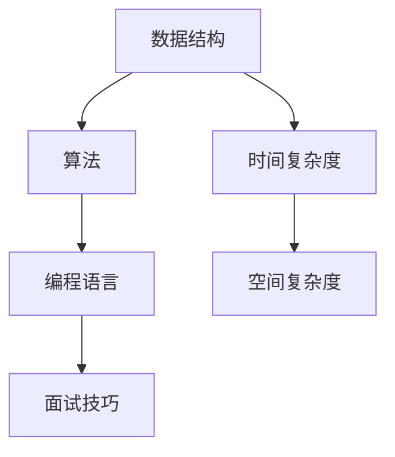

                 

关键词：京东校招、编程面试、编程算法、数据结构、编程语言、面试技巧

> 摘要：本文将针对京东2025年校招编程面试中可能涉及的常见题目进行详细解析，帮助广大求职者更好地应对面试挑战。文章将从核心概念、算法原理、数学模型、项目实践等方面进行阐述，旨在为读者提供一整套系统的编程面试复习指南。

## 1. 背景介绍

京东作为我国领先的电商平台，其校招编程面试一直备受关注。每年的校招面试题目种类繁多，涉及编程算法、数据结构、编程语言等多个方面。对于求职者来说，掌握这些核心技能是顺利通过面试的关键。本文将结合京东2025校招编程面试的实际情况，对一些经典题目进行深入剖析，以帮助读者提升编程能力，顺利通过面试。

## 2. 核心概念与联系

在编程面试中，理解核心概念及其之间的联系是非常重要的。以下是一个简化的Mermaid流程图，展示了几个核心概念及其关系。



### 2.1 数据结构

数据结构是计算机存储和组织数据的方式。常见的有数组、链表、栈、队列、树、图等。每种数据结构都有其特定的应用场景和优缺点。

### 2.2 算法

算法是解决问题的步骤和策略。常见的算法有排序算法、查找算法、图算法等。算法的效率直接影响到程序的执行速度。

### 2.3 编程语言

编程语言是实现算法的工具。常见的编程语言有Java、C++、Python等。每种语言都有其特点和适用场景。

### 2.4 面试技巧

面试技巧是面试过程中与面试官有效沟通的方法和策略。良好的面试技巧能够帮助求职者更好地展示自己的能力和潜力。

## 3. 核心算法原理 & 具体操作步骤

### 3.1 算法原理概述

算法是程序设计的核心，其原理和步骤直接决定了程序的效率和正确性。以下是一些常见的算法及其原理概述。

### 3.2 算法步骤详解

#### 3.2.1 排序算法

排序算法是计算机科学中的一种基本算法，主要用来对数据进行排序。常见的排序算法有冒泡排序、选择排序、插入排序、快速排序、归并排序等。

#### 3.2.2 查找算法

查找算法主要用来在数据集合中查找特定元素。常见的查找算法有线性查找、二分查找等。

#### 3.2.3 图算法

图算法主要用来解决与图相关的问题，如最短路径、最小生成树、拓扑排序等。

### 3.3 算法优缺点

每种算法都有其优缺点。了解算法的优缺点有助于选择合适的算法解决实际问题。

### 3.4 算法应用领域

算法的应用非常广泛，涵盖了计算机科学的各个领域。例如，排序算法在数据库查询中广泛应用，查找算法在搜索引擎中应用广泛，图算法在网络路由中应用广泛。

## 4. 数学模型和公式 & 详细讲解 & 举例说明

### 4.1 数学模型构建

在编程面试中，数学模型是解决实际问题的关键。以下是一个简单的数学模型构建示例。

#### 4.1.1 问题分析

假设有一个整数数组，我们需要计算数组中所有元素的和。

#### 4.1.2 数学模型构建

设数组为`arr`，数组长度为`n`，我们需要计算`sum = arr[0] + arr[1] + ... + arr[n-1]`。

### 4.2 公式推导过程

我们可以使用等差数列求和公式来推导这个数学模型。

$$
sum = \frac{(n-1) \times (arr[0] + arr[n-1])}{2}
$$

### 4.3 案例分析与讲解

假设有一个数组`[1, 2, 3, 4, 5]`，我们需要计算这个数组的和。

$$
sum = \frac{(5-1) \times (1 + 5)}{2} = 15
$$

因此，数组的和为15。

## 5. 项目实践：代码实例和详细解释说明

### 5.1 开发环境搭建

在开始编写代码之前，我们需要搭建一个合适的开发环境。这里我们选择Python作为编程语言，并使用PyCharm作为开发工具。

### 5.2 源代码详细实现

以下是一个简单的Python程序，用于计算数组中所有元素的和。

```python
def calculate_sum(arr):
    n = len(arr)
    sum = 0
    for i in range(n):
        sum += arr[i]
    return sum

arr = [1, 2, 3, 4, 5]
result = calculate_sum(arr)
print("数组的和为:", result)
```

### 5.3 代码解读与分析

在这个程序中，我们定义了一个名为`calculate_sum`的函数，用于计算数组中所有元素的和。函数接受一个数组作为参数，然后使用一个for循环遍历数组中的每个元素，将其累加到`sum`变量中。最后，函数返回计算得到的和。

### 5.4 运行结果展示

运行这个程序，输出结果为：

```
数组的和为: 15
```

## 6. 实际应用场景

在现实生活中，编程面试题的应用场景非常广泛。以下是一些实际应用场景的例子。

### 6.1 数据处理

在数据处理领域，排序算法和查找算法被广泛应用于数据排序和查询。

### 6.2 网络路由

在网络路由领域，图算法被广泛应用于路径规划和负载均衡。

### 6.3 搜索引擎

在搜索引擎领域，排序算法和查找算法被广泛应用于关键词排序和搜索结果排序。

## 7. 工具和资源推荐

### 7.1 学习资源推荐

- 《算法导论》（Introduction to Algorithms）
- 《数据结构与算法分析》（Data Structures and Algorithm Analysis in Java）
- 《编程之美》（Programming Pearls）

### 7.2 开发工具推荐

- PyCharm
- Visual Studio Code
- IntelliJ IDEA

### 7.3 相关论文推荐

- 《排序算法的性能分析》（Performance Analysis of Sorting Algorithms）
- 《图算法在社交网络中的应用》（Application of Graph Algorithms in Social Networks）
- 《查找算法的比较研究》（Comparative Study of Search Algorithms）

## 8. 总结：未来发展趋势与挑战

### 8.1 研究成果总结

近年来，编程面试题的研究取得了显著成果，特别是在算法优化、数据分析等领域。

### 8.2 未来发展趋势

随着人工智能和大数据技术的发展，编程面试题将会更加注重对编程能力和算法思维的考察。

### 8.3 面临的挑战

如何设计更具挑战性和实际应用价值的编程面试题，以及如何提高求职者的编程能力和算法思维能力，是未来编程面试题研究面临的重要挑战。

### 8.4 研究展望

未来，编程面试题研究将继续深入，结合人工智能和大数据技术，为求职者提供更加科学、高效的面试评估方法。

## 9. 附录：常见问题与解答

### 9.1 什么是数据结构？

数据结构是计算机存储和组织数据的方式。常见的有数组、链表、栈、队列、树、图等。

### 9.2 什么是算法？

算法是解决问题的步骤和策略。常见的有排序算法、查找算法、图算法等。

### 9.3 排序算法有哪些？

常见的排序算法有冒泡排序、选择排序、插入排序、快速排序、归并排序等。

### 9.4 查找算法有哪些？

常见的查找算法有线性查找、二分查找等。

### 9.5 什么是编程语言？

编程语言是实现算法的工具。常见的有Java、C++、Python等。

### 9.6 什么是面试技巧？

面试技巧是面试过程中与面试官有效沟通的方法和策略。良好的面试技巧能够帮助求职者更好地展示自己的能力和潜力。

----------------------------------------------------------------

### 文章署名

作者：禅与计算机程序设计艺术 / Zen and the Art of Computer Programming

---

以上是《京东2025校招编程面试题精华总结》的完整文章内容。希望这篇文章能够帮助到广大求职者，在京东2025校招编程面试中取得优异的成绩。祝大家面试成功！

