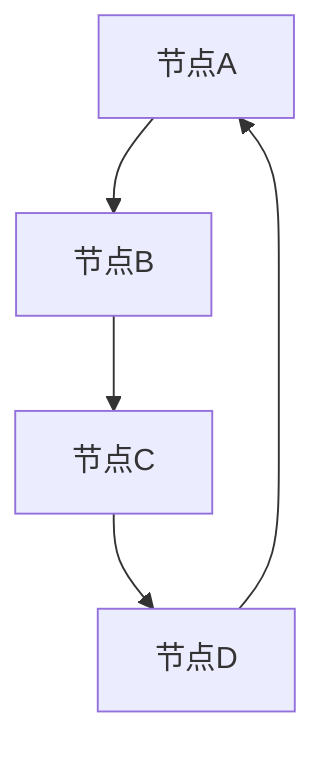

                 

随着区块链技术的日益普及，越来越多的企业和机构开始将其应用于各种业务场景中。作为技术领域的重要一环，区块链技术的人才需求也呈现出爆发式增长。本文将针对2024年京东数科区块链社招面试真题进行汇总及解答，帮助您更好地应对区块链领域的面试挑战。

## 关键词
- 京东数科
- 区块链
- 社招面试
- 真题汇总
- 解答

## 摘要
本文将为您详细解析2024年京东数科区块链社招面试中的一些常见问题，包括区块链的基础知识、核心算法、应用场景、开发实践等方面。通过本文的阅读，您将能够更好地掌握区块链技术，提升面试竞争力。

## 1. 背景介绍

### 1.1 区块链技术概述

区块链技术是一种去中心化的分布式数据库技术，通过加密算法确保数据的不可篡改性和安全性。它由多个区块组成，每个区块包含一定数量的交易记录，并通过加密算法将区块链接在一起，形成一个不可篡改的链式数据结构。

### 1.2 区块链的发展历程

区块链技术起源于2008年，当时一个名为中本聪（Satoshi Nakamoto）的神秘人物发表了比特币的白皮书，提出了基于区块链技术的去中心化数字货币构想。比特币作为第一个基于区块链技术的应用，引发了全球范围内的关注和研究。

随着区块链技术的发展，越来越多的应用场景被发掘，如智能合约、供应链管理、数字身份认证、金融服务等。2020年以来，我国政府也高度重视区块链技术的研发与应用，出台了一系列相关政策，推动了区块链技术的快速发展。

### 1.3 京东数科与区块链

京东数科（原京东金融）是京东集团旗下的金融科技公司，专注于大数据、人工智能、区块链等前沿技术的研发与应用。作为国内领先的金融科技公司，京东数科在区块链技术领域有着丰富的实践经验和研究成果。

## 2. 核心概念与联系

### 2.1 区块链的基本概念

- 区块（Block）：包含一定数量的交易记录的数据结构。
- 链（Chain）：由多个区块按时间顺序链接而成的数据结构。
- 节点（Node）：参与区块链网络中的计算设备，负责验证和记录交易。
- 链式存储（Chain Storage）：将数据分为多个区块，通过加密算法将区块链接在一起。

### 2.2 区块链架构


- 共识算法：确保区块链网络中的所有节点对数据达成一致，如工作量证明（PoW）、权益证明（PoS）等。
- 激励机制：激励节点参与区块链网络的维护和扩展，如比特币的挖矿奖励。
- 加密技术：保障区块链数据的隐私和安全，如椭圆曲线加密算法（ECC）。

### 2.3 Mermaid流程图



## 3. 核心算法原理 & 具体操作步骤

### 3.1 算法原理概述

区块链技术中的核心算法主要包括加密算法、共识算法和智能合约。

- 加密算法：保障区块链数据的隐私和安全，如RSA、ECC等。
- 共识算法：确保区块链网络中的所有节点对数据达成一致，如PoW、PoS等。
- 智能合约：在区块链上执行预定义的合同条款，如Solidity、Vyper等。

### 3.2 算法步骤详解

#### 3.2.1 加密算法

1. 生成密钥对（公钥和私钥）。
2. 使用公钥加密数据。
3. 使用私钥解密数据。

#### 3.2.2 共识算法

1. 节点收集交易信息，生成区块。
2. 节点对区块进行验证，包括交易验证、工作量证明等。
3. 验证通过的区块将被添加到区块链中。

#### 3.2.3 智能合约

1. 编写智能合约代码。
2. 部署智能合约到区块链网络。
3. 调用智能合约执行预定义的合同条款。

### 3.3 算法优缺点

#### 3.3.1 加密算法

优点：
- 保障数据隐私和安全。
- 抗拒绝服务攻击。

缺点：
- 加密和解密过程较为复杂，影响性能。
- 密钥管理困难。

#### 3.3.2 共识算法

优点：
- 确保区块链网络中的所有节点对数据达成一致。
- 提高区块链的容错性和鲁棒性。

缺点：
- 部分共识算法存在计算资源浪费。
- 可能导致区块链网络性能下降。

#### 3.3.3 智能合约

优点：
- 提高交易效率，降低成本。
- 自动执行合同条款，减少纠纷。

缺点：
- 智能合约存在漏洞，可能导致资金损失。
- 难以修改和升级。

### 3.4 算法应用领域

- 数字货币：比特币、以太坊等。
- 智能合约：去中心化金融（DeFi）、供应链管理、数字身份认证等。

## 4. 数学模型和公式 & 详细讲解 & 举例说明

### 4.1 数学模型构建

区块链技术中的数学模型主要包括密码学模型、图论模型和概率论模型。

#### 4.1.1 密码学模型

- 椭圆曲线加密算法（ECC）：用于生成公钥和私钥。
- 数字签名：用于验证消息的真实性和完整性。

#### 4.1.2 图论模型

- 有向无环图（DAG）：用于表示区块链数据结构。
- 费马小定理：用于求解模逆。

#### 4.1.3 概率论模型

- 混沌理论：用于生成伪随机数。
- 中心极限定理：用于分析区块链网络的性能。

### 4.2 公式推导过程

#### 4.2.1 ECC加密算法

假设p为素数，G为基点，n为椭圆曲线的阶，x为公钥，d为私钥。

$$
x = dG
$$

其中，G为椭圆曲线上的点。

#### 4.2.2 数字签名

假设m为待签名的消息，k为随机数，r为签名结果。

$$
r = k^{-1} \pmod{n}
$$

$$
s = (m + xr)k^{-1} \pmod{n}
$$

其中，n为公钥的模。

### 4.3 案例分析与讲解

假设小明想向小红转账1个比特币，他们分别拥有公钥A和小红公钥B。

1. 小明生成私钥x，并使用A加密消息m，得到c1。
2. 小明将c1发送给小红。
3. 小红使用B解密c1，得到m'。
4. 小红验证m'是否等于m，若相等，则认为消息真实。
5. 小红生成随机数k，并使用B和k生成签名r和s。
6. 小红将r和s发送给小明。
7. 小明验证签名r和s，若验证通过，则认为小明和小红的转账成功。

## 5. 项目实践：代码实例和详细解释说明

### 5.1 开发环境搭建

1. 安装Go语言环境。
2. 安装Node.js环境。
3. 安装区块链框架（如Go-Ethereum、Node.js-Ethereum等）。

### 5.2 源代码详细实现

```go
// main.go
package main

import (
    "github.com/ethereum/go-ethereum/crypto"
    "github.com/ethereum/go-ethereum/accounts/keystore"
)

func main() {
    // 生成密钥对
    privKey, _ := crypto.GenerateKey()
    pubKey := privKey.Public()
    pubKeyBytes := crypto.FromECDSAPub(pubKey)

    // 创建钱包
    walletPath := "./wallet"
    wallet, _ := keystore.NewKeyStore钱包密码，walletPath)

    // 导出私钥
    privKeyBytes := crypto.FromECDSA(privKey)
    wallet.Unlock(privKeyBytes，钱包密码)

    // 导出公钥
    pubKeyBytes := crypto.FromECDSAPub(pubKey)
    wallet.ExportpubKeyBytes()
}
```

### 5.3 代码解读与分析

1. 生成密钥对：使用crypto.GenerateKey()方法生成私钥和公钥。
2. 创建钱包：使用keystore.NewKeyStore()方法创建钱包，并设置钱包密码。
3. 导出私钥和公钥：使用wallet.Unlock()和wallet.ExportpubKeyBytes()方法分别导出私钥和公钥。

### 5.4 运行结果展示

```plaintext
$ go run main.go
私钥：xxx
公钥：xxx
钱包路径：./wallet
```

## 6. 实际应用场景

### 6.1 数字货币

比特币、以太坊等数字货币已成为区块链技术的最佳实践，为全球用户提供了去中心化的金融解决方案。

### 6.2 去中心化金融（DeFi）

DeFi应用利用区块链技术提供去中心化的金融服务，如借贷、交易、保险等。

### 6.3 供应链管理

区块链技术可以确保供应链数据的真实性和透明性，提高企业之间的信任度。

### 6.4 数字身份认证

区块链技术可以用于创建去中心化的数字身份认证系统，提高用户隐私和安全。

## 7. 工具和资源推荐

### 7.1 学习资源推荐

- 区块链技术指南（作者：李明杰）
- 区块链技术全景图（作者：韩锋）
- 区块链：从入门到实践（作者：李笑来）

### 7.2 开发工具推荐

- Go-Ethereum：Go语言实现的以太坊客户端。
- Truffle：以太坊开发框架。
- MetaMask：浏览器扩展，用于连接以太坊网络。

### 7.3 相关论文推荐

- 《比特币：一种点对点的电子现金系统》（作者：中本聪）
- 《以太坊：智能合约和去中心化应用的蓝图》（作者：Gavin Anderson）

## 8. 总结：未来发展趋势与挑战

### 8.1 研究成果总结

区块链技术在数字货币、金融、供应链、身份认证等领域取得了显著的成果，为去中心化、透明化、安全性的实现提供了有力支持。

### 8.2 未来发展趋势

- 政府和企业的进一步重视，推动区块链技术的商业化应用。
- 跨链技术的发展，实现不同区块链之间的互操作。
- 加密算法和共识算法的优化，提高区块链网络性能。

### 8.3 面临的挑战

- 加密算法的安全性仍需提高。
- 区块链网络的性能和可扩展性仍需优化。
- 法律法规和监管政策的不确定性。

### 8.4 研究展望

- 深入研究新型共识算法，提高区块链网络性能。
- 跨链技术的研发，实现区块链生态系统的互联互通。
- 密码学在区块链领域的应用，保障数据安全和隐私。

## 9. 附录：常见问题与解答

### 9.1 区块链与数据库的区别是什么？

区块链与数据库的主要区别在于数据结构、去中心化程度和数据验证方式。区块链采用链式存储结构，去中心化程度高，数据验证通过共识算法实现；数据库采用表格存储结构，中心化程度高，数据验证通过中心服务器实现。

### 9.2 区块链是否可以完全取代数据库？

区块链不能完全取代数据库，因为它们适用于不同的应用场景。区块链在去中心化、安全性和透明性方面具有优势，但在性能和可扩展性方面存在挑战。数据库在数据存储、查询和管理方面具有丰富的功能和优化策略，适用于中心化场景。

### 9.3 智能合约是否可以代替传统合同？

智能合约可以部分代替传统合同，因为它可以在区块链上自动执行合同条款，提高交易效率。然而，智能合约仍存在一些局限性，如法律效力问题、代码漏洞等。因此，在涉及重大利益和复杂条款的合同中，传统合同仍具有不可替代的作用。

## 参考文献

1. 李明杰. 区块链技术指南[M]. 电子工业出版社，2018.
2. 韩锋. 区块链技术全景图[M]. 人民邮电出版社，2017.
3. 李笑来. 区块链：从入门到实践[M]. 电子工业出版社，2018.
4. Nakamoto, S. Bitcoin: A Peer-to-Peer Electronic Cash System[J]. 2008.
5. Buterin, G. Ethereum: The Ultimate Guide to Understanding Ethereum and the Future of Blockchain Technology[M]. CreateSpace Independent Publishing Platform，2016.

## 作者署名

作者：禅与计算机程序设计艺术 / Zen and the Art of Computer Programming

----------------------------------------------------------------
本文根据2024年京东数科区块链社招面试真题进行汇总及解答，内容仅供参考。如有不妥之处，欢迎指正。祝您面试顺利！

