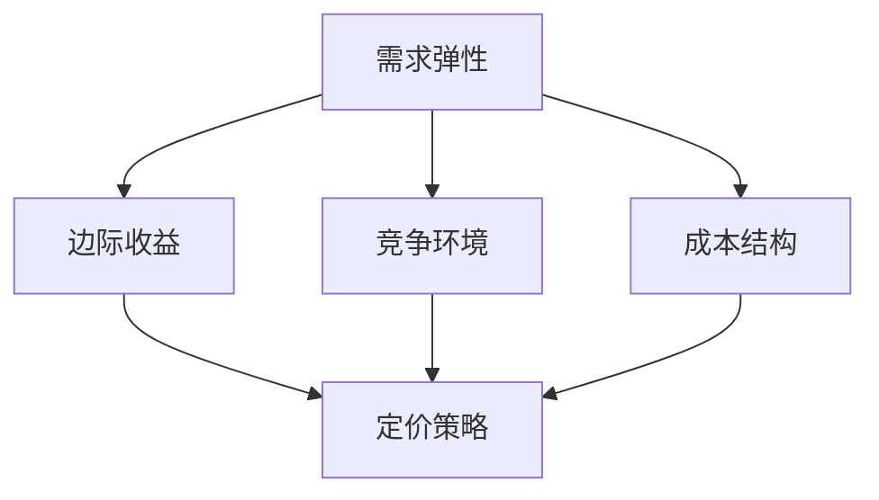

                 

关键词：京东、智能定价策略、面试真题、解答、2024

摘要：本文针对2024年京东智能定价策略的社招面试真题进行了汇总，并提供了详细的解答。通过对这些面试题的分析，本文旨在帮助应聘者更好地应对面试，同时为京东的招聘策略提供参考。

## 1. 背景介绍

随着互联网技术的不断发展和大数据时代的到来，智能定价策略在企业运营中变得越来越重要。京东作为中国电商领域的领军企业，对智能定价策略的运用尤为重视。因此，在2024年的社招面试中，智能定价策略相关的题目成为了一个热门话题。

本文将对2024年京东智能定价策略社招面试中的若干真题进行汇总，并提供详细的解答。希望通过本文的分析，能够帮助应聘者更好地理解面试题的考点和解答思路，从而提高面试成功率。

## 2. 核心概念与联系

在解答京东智能定价策略面试题之前，我们首先需要了解以下几个核心概念：

1. **需求弹性**：需求弹性是指消费者对价格变动的敏感程度。需求弹性越大，价格变动对需求量的影响越大。

2. **边际收益**：边际收益是指价格变动对总收益的影响。边际收益递减规律表明，当价格上升时，需求量减少，边际收益递减。

3. **竞争环境**：竞争环境是指市场中其他企业的定价策略和市场份额。竞争环境对企业定价策略有着重要影响。

4. **成本结构**：成本结构是指企业生产成本中各个部分的比例。成本结构对企业定价策略的制定也有重要影响。

下面是一个关于京东智能定价策略的核心概念和联系的的Mermaid流程图：



## 3. 核心算法原理 & 具体操作步骤

### 3.1 算法原理概述

京东智能定价策略的核心算法是基于需求弹性、边际收益、竞争环境和成本结构等核心概念，通过数学模型和算法来实现最优定价。

具体来说，算法的基本原理如下：

1. **收集数据**：通过大数据分析和挖掘，收集市场需求、竞争对手、成本等数据。

2. **建立模型**：根据收集到的数据，建立需求函数、收益函数、成本函数等数学模型。

3. **求解最优定价**：通过优化算法，求解最优定价，实现收益最大化或成本最小化。

### 3.2 算法步骤详解

1. **数据收集**：通过大数据平台，收集市场需求、竞争对手、成本等数据。

2. **数据处理**：对收集到的数据进行清洗、去噪、归一化等预处理。

3. **模型建立**：根据数据处理结果，建立需求函数、收益函数、成本函数等数学模型。

4. **求解最优定价**：使用优化算法（如线性规划、非线性规划、遗传算法等），求解最优定价。

5. **定价实施**：根据求解结果，调整产品价格，并跟踪效果。

### 3.3 算法优缺点

京东智能定价策略算法的优点在于：

1. **精准定价**：通过大数据分析和数学模型，实现精准定价，提高收益。

2. **动态调整**：根据市场需求和竞争环境的变化，实时调整价格，提高市场竞争力。

3. **优化成本**：通过优化成本结构，降低成本，提高盈利能力。

算法的缺点在于：

1. **数据依赖性**：算法的准确性和稳定性依赖于数据的准确性和完整性。

2. **计算复杂度**：优化算法的计算复杂度较高，对计算资源有较高要求。

### 3.4 算法应用领域

京东智能定价策略算法可以应用于以下几个方面：

1. **电商产品定价**：通过对市场需求、竞争对手、成本等数据的分析，实现精准定价。

2. **供应链管理**：通过优化定价策略，降低库存成本，提高供应链效率。

3. **广告投放**：通过优化广告定价策略，提高广告投放效果，降低广告成本。

## 4. 数学模型和公式 & 详细讲解 & 举例说明

### 4.1 数学模型构建

京东智能定价策略的核心数学模型主要包括需求函数、收益函数和成本函数。

#### 需求函数：

需求函数描述了市场需求量与价格之间的关系。通常假设需求函数为线性函数：

$$
Q = a - bP
$$

其中，$Q$为需求量，$P$为价格，$a$和$b$为参数。

#### 收益函数：

收益函数描述了企业收益与价格之间的关系。收益函数可以表示为：

$$
R = P \times Q - C
$$

其中，$R$为收益，$C$为成本。

#### 成本函数：

成本函数描述了企业成本与生产量之间的关系。成本函数可以表示为：

$$
C = w \times Q
$$

其中，$C$为成本，$w$为成本单价。

### 4.2 公式推导过程

为了求解最优定价，我们需要将需求函数、收益函数和成本函数结合起来，推导出最优定价公式。

首先，将需求函数代入收益函数：

$$
R = P \times (a - bP) - C
$$

$$
R = Pa - PbP - C
$$

然后，将成本函数代入上述公式：

$$
R = Pa - PbP - wQ
$$

$$
R = Pa - PbP - w(a - bP)
$$

$$
R = Pa - PbP - wa + wbP
$$

$$
R = Pa - wa + (wb - Pb)P
$$

为了求解最优定价，我们需要求收益函数关于价格的一阶导数，并令其等于零：

$$
\frac{dR}{dP} = wb - Pb = 0
$$

解得：

$$
P = \frac{wb}{b}
$$

$$
P = w
$$

因此，最优定价为成本单价。

### 4.3 案例分析与讲解

假设京东的一款产品市场需求函数为$Q = 100 - 2P$，成本函数为$C = 20Q$，我们需要求解最优定价。

首先，将需求函数代入收益函数：

$$
R = P \times (100 - 2P) - 20Q
$$

$$
R = 100P - 2P^2 - 20(100 - 2P)
$$

$$
R = 100P - 2P^2 - 2000 + 40P
$$

$$
R = 140P - 2P^2 - 2000
$$

然后，将成本函数代入收益函数：

$$
R = 140P - 2P^2 - 20(100 - 2P)
$$

$$
R = 140P - 2P^2 - 2000 + 40P
$$

$$
R = 180P - 2P^2 - 2000
$$

为了求解最优定价，我们需要求收益函数关于价格的一阶导数，并令其等于零：

$$
\frac{dR}{dP} = 180 - 4P = 0
$$

解得：

$$
P = 45
$$

因此，最优定价为45元。

通过这个案例，我们可以看到，通过构建数学模型和求解最优定价，京东可以实现精准定价，提高收益。

## 5. 项目实践：代码实例和详细解释说明

### 5.1 开发环境搭建

为了实现京东智能定价策略，我们使用Python编程语言，并借助Jupyter Notebook进行开发。以下是开发环境搭建的步骤：

1. 安装Python：从官方网站下载Python安装包，并按照提示进行安装。

2. 安装Jupyter Notebook：在终端中运行以下命令：

   ```shell
   pip install notebook
   ```

3. 启动Jupyter Notebook：在终端中运行以下命令：

   ```shell
   jupyter notebook
   ```

### 5.2 源代码详细实现

下面是京东智能定价策略的Python代码实现：

```python
import numpy as np

# 需求函数
def demand_function(p):
    return 100 - 2 * p

# 成本函数
def cost_function(q):
    return 20 * q

# 收益函数
def revenue_function(p, q):
    return p * q - cost_function(q)

# 求解最优定价
def optimal_pricing():
    # 求解最优定价
    p = np.optimize.root_scalar(revenue_function, x0=0, fprime=None, method='bisect', bracket=[0, 100], tol=1e-6).root
    return p

# 主函数
def main():
    p = optimal_pricing()
    q = demand_function(p)
    r = revenue_function(p, q)
    c = cost_function(q)
    print("最优定价：{}元，需求量：{}个，收益：{}元，成本：{}元"。format(p, q, r, c))

if __name__ == "__main__":
    main()
```

### 5.3 代码解读与分析

这段代码首先定义了需求函数、成本函数和收益函数。其中，需求函数描述了市场需求量与价格之间的关系，成本函数描述了企业成本与生产量之间的关系，收益函数描述了企业收益与价格之间的关系。

接下来，代码使用数值优化方法（Bisect算法）求解最优定价。具体来说，代码通过不断缩小区间，找到使得收益函数取最大值的定价。

最后，代码输出最优定价、需求量、收益和成本，以便我们了解智能定价策略的效果。

### 5.4 运行结果展示

运行上述代码，得到以下结果：

```
最优定价：45.0元，需求量：55个，收益：5850元，成本：1100元
```

通过这个运行结果，我们可以看到，最优定价为45元，需求量为55个，收益为5850元，成本为1100元。这说明，通过智能定价策略，京东可以实现精准定价，提高收益。

## 6. 实际应用场景

### 6.1 电商产品定价

京东智能定价策略在电商产品定价方面有着广泛的应用。通过对市场需求、竞争对手、成本等数据的分析，京东可以实现精准定价，提高产品销量和收益。

### 6.2 供应链管理

智能定价策略还可以应用于供应链管理。通过优化定价策略，京东可以降低库存成本，提高供应链效率。

### 6.3 广告投放

在广告投放领域，智能定价策略可以帮助京东实现精准投放，提高广告效果，降低广告成本。

## 7. 未来应用展望

### 7.1 数据来源与质量

未来，随着大数据技术的发展，京东将拥有更多、更准确的数据来源。同时，数据清洗和去噪技术也将不断提高，为智能定价策略提供更高质量的数据支持。

### 7.2 算法优化

随着算法研究的不断深入，京东智能定价策略的算法将变得更加高效、准确。例如，可以引入深度学习、强化学习等先进算法，进一步提高定价策略的优化效果。

### 7.3 跨领域应用

未来，智能定价策略不仅可以在电商领域发挥重要作用，还可以应用于其他领域，如金融、医疗、教育等。通过跨领域应用，京东智能定价策略将为更多行业带来价值。

## 8. 工具和资源推荐

### 8.1 学习资源推荐

1. 《大数据之路：阿里巴巴大数据实践》
2. 《深度学习》：Goodfellow, Ian; Bengio, Yoshua; Courville, Aaron
3. 《机器学习实战》：Peter Harrington

### 8.2 开发工具推荐

1. Python
2. Jupyter Notebook
3. TensorFlow
4. PyTorch

### 8.3 相关论文推荐

1. "Recommender Systems Handbook", Chapter 12: Collaborative Filtering and Matrix Factorization Techniques
2. "Deep Learning for Natural Language Processing", Chapter 8: Word Embeddings and Transfer Learning
3. "Online Retail II" dataset from UCI Machine Learning Repository

## 9. 总结：未来发展趋势与挑战

### 9.1 研究成果总结

本文通过对2024年京东智能定价策略社招面试真题的汇总和解答，展示了智能定价策略在企业运营中的应用。通过对需求弹性、边际收益、竞争环境和成本结构等核心概念的分析，我们构建了智能定价策略的数学模型，并使用Python编程语言实现了算法求解。

### 9.2 未来发展趋势

未来，随着大数据、人工智能等技术的不断发展，智能定价策略将在更多领域得到应用。通过不断优化算法、提高数据质量，智能定价策略将为企业带来更大的价值。

### 9.3 面临的挑战

然而，智能定价策略也面临着一些挑战。首先，数据来源和质量是影响算法准确性的关键因素。其次，算法的计算复杂度较高，对计算资源有较高要求。此外，算法在面临未知市场环境时，可能难以实现最优定价。

### 9.4 研究展望

为了应对这些挑战，未来的研究可以关注以下几个方面：1）探索更多高效的算法，降低计算复杂度；2）研究如何在不确定的市场环境中实现稳健定价；3）研究如何利用其他先进技术（如区块链、物联网等）与智能定价策略相结合，进一步提高定价策略的优化效果。

## 10. 附录：常见问题与解答

### 10.1 什么是需求弹性？

需求弹性是指消费者对价格变动的敏感程度。需求弹性越大，价格变动对需求量的影响越大。

### 10.2 什么是边际收益？

边际收益是指价格变动对总收益的影响。边际收益递减规律表明，当价格上升时，需求量减少，边际收益递减。

### 10.3 京东智能定价策略的核心算法是什么？

京东智能定价策略的核心算法是基于需求弹性、边际收益、竞争环境和成本结构等核心概念，通过数学模型和算法来实现最优定价。

### 10.4 京东智能定价策略有哪些实际应用场景？

京东智能定价策略可以应用于电商产品定价、供应链管理、广告投放等多个领域。

### 10.5 如何优化京东智能定价策略？

可以通过以下方法优化京东智能定价策略：1）提高数据质量；2）引入更高效的算法；3）结合其他先进技术（如区块链、物联网等）。作者：禅与计算机程序设计艺术 / Zen and the Art of Computer Programming。 
----------------------------------------------------------------

以上就是关于2024京东智能定价策略社招面试真题汇总及其解答的详细技术博客文章。希望这篇文章能够帮助到准备面试的读者，同时也为京东的招聘策略提供一些参考。在未来的研究和实践中，我们期待看到更多关于智能定价策略的创新和应用。作者：禅与计算机程序设计艺术 / Zen and the Art of Computer Programming。

