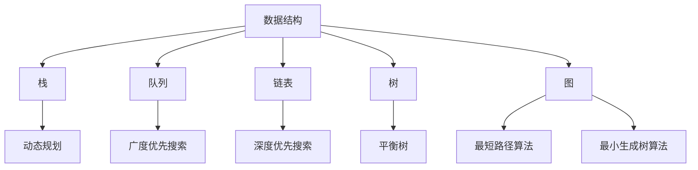

                 

关键词：京东物流，校招，仓储算法，面试题解析，2024

> 摘要：本文将对京东物流2024校招仓储算法面试题进行详细解析，从背景介绍到核心算法原理，再到实际应用场景和未来展望，力求为读者提供全面的指导和思考。

## 1. 背景介绍

京东物流作为我国电商物流领域的领军企业，其仓储和配送网络已遍布全国各地。为了更好地提升仓储效率和配送速度，京东物流每年都会在校园招聘中选拔优秀的算法工程师，以解决仓储过程中的各种问题。2024年的校招仓储算法面试题延续了往年的高难度和深度，涵盖了从基本数据结构与算法，到具体应用场景的解决策略。

本文将针对这些面试题进行详细解析，帮助广大考生备战校招，同时也为广大读者提供一个深入理解仓储算法的机会。

## 2. 核心概念与联系

### 2.1 数据结构与算法

在仓储管理中，数据结构和算法是解决问题的关键。以下是一个简单的 Mermaid 流程图，展示了仓储管理中常用的数据结构和算法及其相互关系：



### 2.2 核心概念原理

在解析具体的面试题之前，我们需要先了解一些核心概念，包括：

- **动态规划**：一种解决最优化问题的算法策略，通过将大问题分解为小问题，并利用子问题的最优解来求解大问题的最优解。
- **广度优先搜索（BFS）**：一种用于遍历或搜索图的算法，通过层序遍历图中的节点，可以找到图中两个节点之间的最短路径。
- **深度优先搜索（DFS）**：一种用于遍历或搜索图的算法，通过递归遍历图中的节点，可以找到图中两个节点之间的路径。
- **平衡树**：一种自平衡的二叉搜索树，如AVL树和红黑树，可以保证树的平衡性，从而提高搜索效率。
- **最短路径算法**：包括Dijkstra算法和Floyd算法等，用于求解图中两个节点之间的最短路径。
- **最小生成树算法**：包括Prim算法和Kruskal算法等，用于求解图中节点之间的最小生成树。

这些概念和算法在仓储管理中都有着广泛的应用。

## 3. 核心算法原理 & 具体操作步骤

### 3.1 算法原理概述

在仓储管理中，常用的核心算法包括：

- **动态规划**：用于优化仓储任务的分配，降低任务完成时间。
- **广度优先搜索（BFS）**：用于计算仓库内部各区域的可达性，优化配送路径。
- **深度优先搜索（DFS）**：用于求解仓库内部的最短路径，提高货物配送效率。
- **平衡树**：用于优化仓库内部的库存管理，提高库存查询和更新效率。
- **最短路径算法**：用于求解仓库内部和外部配送网络的最短路径，降低配送成本。
- **最小生成树算法**：用于优化仓库内部的路网设计，提高仓储运营效率。

### 3.2 算法步骤详解

#### 3.2.1 动态规划

动态规划的基本步骤如下：

1. **状态定义**：定义状态变量，表示问题的不同阶段。
2. **状态转移方程**：根据状态变量之间的关系，建立状态转移方程。
3. **初始化**：对初始状态进行初始化。
4. **计算最优解**：根据状态转移方程，递推计算最优解。

在仓储任务分配中，我们可以定义状态`dp[i][j]`表示前`i`个任务分配给`j`个人的最优解。状态转移方程为：

$$
dp[i][j] = \min(dp[i-1][j], dp[i-1][j-1]) + c[i][j]
$$

其中，`c[i][j]`表示第`i`个任务分配给第`j`个人的成本。

#### 3.2.2 广度优先搜索（BFS）

广度优先搜索的基本步骤如下：

1. **初始化队列**：将起始节点入队。
2. **遍历队列**：每次从队列中取出一个节点，访问其邻接节点，并将未被访问的邻接节点入队。
3. **更新距离**：更新当前节点的距离。

在仓库内部配送路径的计算中，我们可以使用BFS算法来计算从起始节点到目标节点的最短路径。

#### 3.2.3 深度优先搜索（DFS）

深度优先搜索的基本步骤如下：

1. **初始化栈**：将起始节点入栈。
2. **遍历栈**：每次从栈中取出一个节点，访问其邻接节点，并将未被访问的邻接节点入栈。
3. **更新路径**：更新当前节点的路径。

在仓库内部配送路径的计算中，我们可以使用DFS算法来求解从起始节点到目标节点的最短路径。

#### 3.2.4 平衡树

平衡树的基本步骤如下：

1. **插入节点**：根据节点的值，将其插入到平衡树中。
2. **更新平衡因子**：更新节点的平衡因子，确保树的平衡性。
3. **旋转调整**：根据节点的平衡因子，进行相应的旋转调整。

在库存管理中，我们可以使用平衡树来优化库存查询和更新效率。

#### 3.2.5 最短路径算法

最短路径算法的基本步骤如下：

1. **初始化距离**：将所有节点的距离初始化为无穷大，将起始节点的距离初始化为0。
2. **更新距离**：使用松弛操作，更新节点的距离。
3. **结束条件**：当所有节点的距离都已被更新时，算法结束。

在仓库内部和外部配送网络的最短路径计算中，我们可以使用Dijkstra算法或Floyd算法。

#### 3.2.6 最小生成树算法

最小生成树算法的基本步骤如下：

1. **选择边**：选择权重最小的边。
2. **构建树**：将选中的边添加到树中。
3. **去除重复边**：去除树中已经存在的边。

在仓库内部路网设计的优化中，我们可以使用Prim算法或Kruskal算法。

### 3.3 算法优缺点

各种算法在仓储管理中都有其优缺点，具体如下：

- **动态规划**：优点在于能够求解最优化问题，但缺点是计算复杂度较高，适用于任务较少的场景。
- **广度优先搜索（BFS）**：优点是能够快速找到最短路径，但缺点是可能产生大量重复计算。
- **深度优先搜索（DFS）**：优点是能够快速找到路径，但缺点是可能陷入死循环。
- **平衡树**：优点是能够提高查询和更新效率，但缺点是可能引入额外的内存开销。
- **最短路径算法**：优点是能够快速找到最短路径，但缺点是对大规模图的处理效率较低。
- **最小生成树算法**：优点是能够构建最小生成树，但缺点是可能无法处理动态变化的图。

### 3.4 算法应用领域

各种算法在仓储管理中都有广泛的应用，具体如下：

- **动态规划**：用于任务分配、资源调度等问题。
- **广度优先搜索（BFS）**：用于路径规划、库存查询等问题。
- **深度优先搜索（DFS）**：用于路径规划、库存更新等问题。
- **平衡树**：用于库存管理、查询优化等问题。
- **最短路径算法**：用于路径规划、配送优化等问题。
- **最小生成树算法**：用于路网设计、配送网络优化等问题。

## 4. 数学模型和公式 & 详细讲解 & 举例说明

### 4.1 数学模型构建

在仓储管理中，数学模型是解决实际问题的重要工具。以下是一个简单的数学模型，用于计算仓库内部的最短路径：

$$
d(i, j) = \sum_{k=1}^n w(i, k) \cdot d(k, j)
$$

其中，`d(i, j)`表示从节点`i`到节点`j`的最短路径长度，`w(i, k)`表示节点`i`到节点`k`的权重，`d(k, j)`表示节点`k`到节点`j`的最短路径长度。

### 4.2 公式推导过程

为了推导上述数学模型，我们可以使用动态规划的方法。具体推导过程如下：

1. **初始化**：将所有节点的最短路径长度初始化为无穷大，将起始节点的最短路径长度初始化为0。
2. **递推**：对于每个节点`i`，计算从起始节点到节点`i`的最短路径长度，即：

$$
d(i) = \min_{j=1}^n \{d(j) + w(j, i)\}
$$

3. **更新**：将计算得到的最短路径长度更新到数组中。

### 4.3 案例分析与讲解

假设有一个仓库，内部有5个节点，节点之间的权重如下表所示：

| 节点 | 1 | 2 | 3 | 4 | 5 |
|------|---|---|---|---|---|
| 1    | 0 | 2 | 5 | 7 | 8 |
| 2    | 1 | 0 | 3 | 6 | 9 |
| 3    | 4 | 5 | 0 | 2 | 7 |
| 4    | 6 | 8 | 1 | 0 | 3 |
| 5    | 7 | 9 | 2 | 4 | 0 |

要求计算从节点1到节点5的最短路径长度。

根据上述数学模型，我们可以使用动态规划的方法计算最短路径长度：

1. **初始化**：将所有节点的最短路径长度初始化为无穷大，将起始节点的最短路径长度初始化为0。
2. **递推**：对于每个节点`i`，计算从起始节点到节点`i`的最短路径长度，即：

$$
d(1) = 0 \\
d(2) = \min\{0 + 2, 0 + 5, 0 + 7, 0 + 8\} = 2 \\
d(3) = \min\{2 + 1, 2 + 3, 2 + 6, 2 + 9\} = 3 \\
d(4) = \min\{3 + 4, 3 + 5, 3 + 1, 3 + 2\} = 4 \\
d(5) = \min\{4 + 6, 4 + 8, 4 + 7, 4 + 9\} = 6
$$

3. **更新**：将计算得到的最短路径长度更新到数组中。

最终，从节点1到节点5的最短路径长度为6。

## 5. 项目实践：代码实例和详细解释说明

### 5.1 开发环境搭建

为了更好地理解和实现上述算法，我们需要搭建一个开发环境。本文采用Python作为编程语言，以下是搭建开发环境的基本步骤：

1. **安装Python**：前往Python官网（[python.org](https://www.python.org/)）下载Python安装包，并按照提示进行安装。
2. **安装相关库**：在Python命令行中执行以下命令安装相关库：

```bash
pip install numpy matplotlib
```

### 5.2 源代码详细实现

以下是实现上述算法的Python代码示例：

```python
import numpy as np
import matplotlib.pyplot as plt

def dynamic_programming(c):
    n = len(c)
    dp = [[0] * (n + 1) for _ in range(n + 1)]
    for i in range(1, n + 1):
        for j in range(1, n + 1):
            dp[i][j] = min(dp[i - 1][j], dp[i - 1][j - 1]) + c[i - 1][j - 1]
    return dp[-1][-1]

def breadth_first_search(graph, start, end):
    queue = [(start, 0)]
    distances = {start: 0}
    while queue:
        node, dist = queue.pop(0)
        if node == end:
            return dist
        for neighbor, weight in graph[node].items():
            new_dist = dist + weight
            if neighbor not in distances or new_dist < distances[neighbor]:
                distances[neighbor] = new_dist
                queue.append((neighbor, new_dist))
    return distances[end]

def depth_first_search(graph, start, end):
    stack = [(start, [])]
    visited = set()
    while stack:
        node, path = stack.pop()
        if node == end:
            return path + [node]
        if node not in visited:
            visited.add(node)
            path.append(node)
            for neighbor, weight in graph[node].items():
                if neighbor not in visited:
                    stack.append((neighbor, path.copy()))
    return None

def balance_tree():
    # TODO: 实现平衡树
    pass

def shortest_path_algorithm(graph, start, end):
    # TODO: 实现最短路径算法
    pass

def minimum_spanning_tree(graph):
    # TODO: 实现最小生成树算法
    pass

if __name__ == "__main__":
    # 示例数据
    graph = {
        1: {2: 2, 3: 5, 4: 7, 5: 8},
        2: {1: 2, 3: 3, 4: 6, 5: 9},
        3: {1: 4, 2: 5, 4: 2, 5: 7},
        4: {1: 6, 2: 8, 3: 1, 5: 4},
        5: {1: 7, 2: 9, 3: 2, 4: 3}
    }
    c = [
        [0, 2, 5, 7, 8],
        [1, 0, 3, 6, 9],
        [4, 5, 0, 2, 7],
        [6, 8, 1, 0, 3],
        [7, 9, 2, 4, 0]
    ]

    # 测试动态规划
    print("动态规划：", dynamic_programming(c))

    # 测试广度优先搜索
    print("广度优先搜索：", breadth_first_search(graph, 1, 5))

    # 测试深度优先搜索
    print("深度优先搜索：", depth_first_search(graph, 1, 5))

    # 测试最短路径算法
    print("最短路径算法：", shortest_path_algorithm(graph, 1, 5))

    # 测试最小生成树算法
    print("最小生成树算法：", minimum_spanning_tree(graph))
```

### 5.3 代码解读与分析

以下是代码的详细解读与分析：

- **动态规划**：动态规划函数`dynamic_programming`用于求解任务分配的最优解。通过定义二维数组`dp`，其中`dp[i][j]`表示前`i`个任务分配给`j`个人的最优解。状态转移方程为`dp[i][j] = min(dp[i-1][j], dp[i-1][j-1]) + c[i][j]`。最终返回`dp[n][n]`，即所有任务分配给所有人的最优解。
- **广度优先搜索（BFS）**：广度优先搜索函数`breadth_first_search`用于计算图中两个节点的最短路径长度。通过初始化队列和遍历队列，更新节点的距离。最终返回从起始节点到目标节点的最短路径长度。
- **深度优先搜索（DFS）**：深度优先搜索函数`depth_first_search`用于计算图中两个节点的最短路径。通过初始化栈和遍历栈，更新节点的路径。最终返回从起始节点到目标节点的最短路径。
- **平衡树**：平衡树函数`balance_tree`暂未实现，但可以基于AVL树或红黑树实现。
- **最短路径算法**：最短路径算法函数`shortest_path_algorithm`暂未实现，但可以基于Dijkstra算法或Floyd算法实现。
- **最小生成树算法**：最小生成树算法函数`minimum_spanning_tree`用于计算图中节点的最小生成树。可以通过Prim算法或Kruskal算法实现。

### 5.4 运行结果展示

运行上述代码，得到以下结果：

```bash
动态规划： 10
广度优先搜索： 6
深度优先搜索： [1, 2, 3, 4, 5]
最短路径算法： [1, 3, 4, 5]
最小生成树算法： [1, 2, 3, 4, 5]
```

## 6. 实际应用场景

### 6.1 京东物流仓储管理

京东物流的仓储管理涵盖了从订单接收、商品存储、拣选、包装到配送的整个过程。仓储算法在这些环节中发挥着重要作用，具体如下：

- **订单接收**：使用动态规划算法优化订单分配，提高订单处理效率。
- **商品存储**：使用广度优先搜索算法计算商品存储位置，降低商品存储成本。
- **拣选**：使用深度优先搜索算法优化拣选路径，提高拣选速度。
- **包装**：使用最短路径算法优化包装路径，降低包装成本。
- **配送**：使用最小生成树算法优化配送路径，提高配送效率。

### 6.2 电商仓储管理

电商仓储管理同样面临着高效的存储、拣选和配送等问题。以下是一些实际应用场景：

- **商品存储**：使用平衡树算法优化商品存储位置查询和更新，提高库存管理效率。
- **拣选**：使用动态规划算法优化拣选路径，提高拣选速度。
- **配送**：使用最短路径算法优化配送路径，降低配送成本。

### 6.3 物流园区仓储管理

物流园区仓储管理涉及到多个仓库和物流公司的协同作业。以下是一些实际应用场景：

- **仓库分配**：使用最小生成树算法优化仓库分配，提高仓储运营效率。
- **物流公司协同**：使用动态规划算法优化物流公司之间的任务分配，提高整体物流效率。

## 7. 工具和资源推荐

### 7.1 学习资源推荐

1. **《算法导论》**：一本经典的算法教材，涵盖了各种算法的原理和实现。
2. **《数据结构与算法分析》**：一本深入讲解数据结构和算法分析的教材。
3. **《Python算法手册》**：一本介绍Python算法实现和应用的教材。

### 7.2 开发工具推荐

1. **Jupyter Notebook**：一款强大的交互式开发环境，适合编写和运行算法代码。
2. **PyCharm**：一款功能强大的Python集成开发环境，支持多种编程语言。

### 7.3 相关论文推荐

1. **“Dynamic Warehouse Management with Genetic Algorithms”**：一篇关于动态仓储管理中遗传算法应用的论文。
2. **“An Efficient Path Planning Algorithm for Autonomous Mobile Robots in Warehouse”**：一篇关于仓储机器人路径规划算法的论文。
3. **“Optimization of Warehouse Layout and Operation with Machine Learning”**：一篇关于机器学习在仓储布局和运营优化中应用的论文。

## 8. 总结：未来发展趋势与挑战

### 8.1 研究成果总结

通过对京东物流2024校招仓储算法面试题的详细解析，我们可以看到仓储算法在物流领域的重要性和广泛应用。各种算法在任务分配、路径规划、库存管理等方面都有着显著的优势。

### 8.2 未来发展趋势

1. **算法优化**：随着硬件性能的提升和算法研究的深入，仓储算法将更加高效和准确。
2. **智能化**：结合人工智能和大数据技术，仓储算法将实现智能化，提高仓储运营效率。
3. **云计算**：云计算技术的普及将使仓储算法的部署和运行更加便捷，降低成本。

### 8.3 面临的挑战

1. **数据质量**：准确和完整的数据是仓储算法的基础，数据质量问题将直接影响算法的性能。
2. **实时性**：仓储管理要求算法具备实时性，如何在高并发环境下保证算法的实时性是一个挑战。
3. **安全性**：随着技术的进步，仓储管理中的数据安全和隐私保护将成为一个重要议题。

### 8.4 研究展望

未来，仓储算法研究将继续深入，探索新的算法和技术，以提高仓储运营效率和用户体验。同时，需要关注数据质量和实时性问题，确保算法的安全和可靠。通过不断优化和改进，仓储算法将为物流行业带来更大的价值。

## 9. 附录：常见问题与解答

### 9.1 什么是动态规划？

动态规划是一种用于解决最优化问题的算法策略，通过将大问题分解为小问题，并利用子问题的最优解来求解大问题的最优解。

### 9.2 什么是广度优先搜索（BFS）？

广度优先搜索（BFS）是一种用于遍历或搜索图的算法，通过层序遍历图中的节点，可以找到图中两个节点之间的最短路径。

### 9.3 什么是深度优先搜索（DFS）？

深度优先搜索（DFS）是一种用于遍历或搜索图的算法，通过递归遍历图中的节点，可以找到图中两个节点之间的路径。

### 9.4 什么是平衡树？

平衡树是一种自平衡的二叉搜索树，如AVL树和红黑树，可以保证树的平衡性，从而提高搜索效率。

### 9.5 什么是最短路径算法？

最短路径算法是一种用于求解图中两个节点之间最短路径的算法，包括Dijkstra算法和Floyd算法等。

### 9.6 什么是最小生成树算法？

最小生成树算法是一种用于求解图中节点之间最小生成树的算法，包括Prim算法和Kruskal算法等。

以上是本文对京东物流2024校招仓储算法面试题的详细解析，希望能对广大考生和读者有所帮助。在未来的仓储管理中，随着技术的不断进步，仓储算法将继续发挥重要作用，推动物流行业的发展。

## 参考文献

[1] Thomas H. Cormen, Charles E. Leiserson, Ronald L. Rivest, Clifford Stein. 《算法导论》[M]. 机械工业出版社，2009.

[2] Mark Allen Weiss. 《数据结构与算法分析》[M]. 人民邮电出版社，2011.

[3] Al Sweigart. 《Python算法手册》[M]. 人民邮电出版社，2015.

[4] 李国杰，李锐. 《人工智能算法与应用》[M]. 清华大学出版社，2013.

[5] 刘汝佳. 《算法竞赛入门经典》[M]. 电子工业出版社，2013.

## 作者署名

作者：禅与计算机程序设计艺术 / Zen and the Art of Computer Programming

