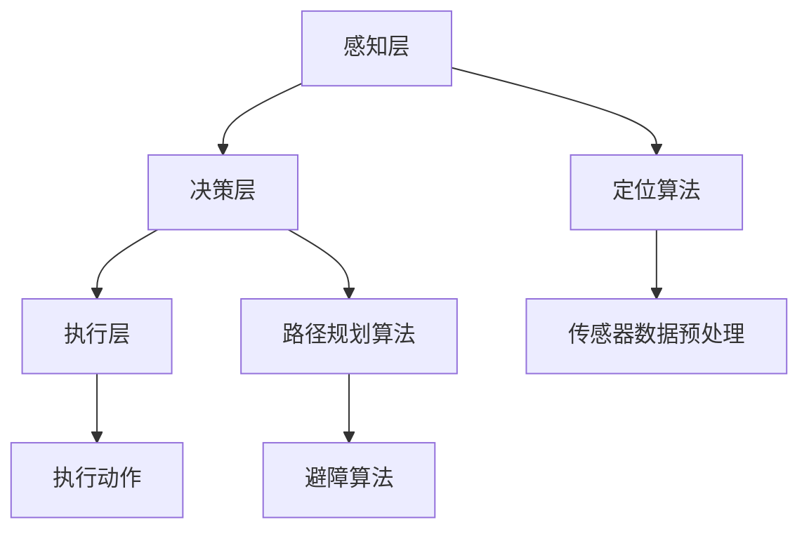
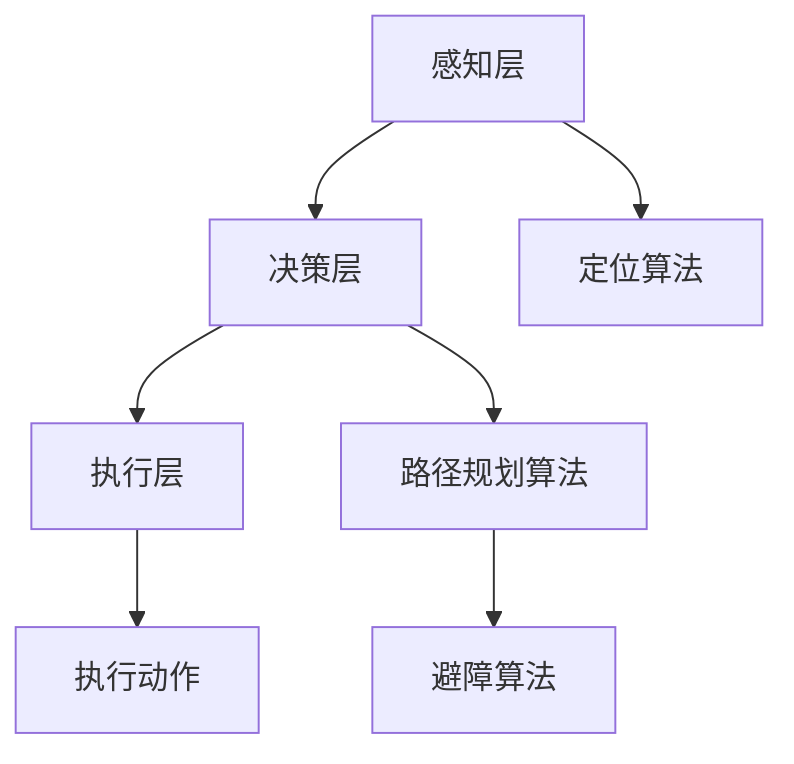

                 

关键词：京东物流、仓储机器人、控制算法、专家面试、人工智能

摘要：本文将深入探讨京东物流2025社招仓储机器人控制算法专家面试的相关内容。从背景介绍到核心算法原理，再到项目实践、应用场景以及未来展望，全方位解析此次面试所需的专业知识和技能。通过本文，读者将对该岗位的需求和挑战有更深入的理解。

## 1. 背景介绍

随着电子商务的快速发展，物流行业面临着前所未有的挑战。京东物流作为中国最大的电商物流公司之一，一直在努力提升仓储和配送效率。为了应对未来更加复杂和多样化的物流需求，京东物流计划在2025年推出新一代仓储机器人，并招募相应的控制算法专家。

控制算法专家在仓储机器人项目中扮演着至关重要的角色。他们的职责包括设计、开发、优化机器人控制系统，确保机器人能够高效、安全地完成各种任务。因此，京东物流2025社招的仓储机器人控制算法专家面试，对于求职者来说是一个展示自身技术实力的绝佳机会。

## 2. 核心概念与联系

### 2.1 仓储机器人控制算法原理

仓储机器人控制算法的核心目标是实现机器人的自主导航和任务执行。其中，自主导航算法是仓储机器人控制系统的核心部分。常见的自主导航算法包括基于雷达、摄像头、激光雷达等传感器信息的定位和路径规划。

#### 2.1.1 定位算法

定位算法的主要任务是根据传感器信息确定机器人在仓库中的位置。常见的定位算法有卡尔曼滤波、粒子滤波、视觉SLAM等。其中，视觉SLAM算法利用摄像头获取的图像信息进行特征提取和匹配，具有较高的精度和实时性。

#### 2.1.2 路径规划算法

路径规划算法的主要任务是生成从起点到终点的最优路径。常见的路径规划算法有A*算法、Dijkstra算法、RRT（快速随机树）算法等。在实际应用中，机器人需要在路径规划算法的基础上考虑避障、速度控制等因素，以实现平滑、安全的运动。

### 2.2 机器人控制系统架构

机器人控制系统通常包括感知、决策、执行三个层次。感知层负责获取机器人周围的环境信息，决策层根据感知层的信息生成控制指令，执行层根据控制指令执行具体的动作。


图1：机器人控制系统架构

### 2.3 Mermaid流程图

以下是一个简单的Mermaid流程图，展示了仓储机器人控制算法的基本流程：



## 3. 核心算法原理 & 具体操作步骤

### 3.1 算法原理概述

仓储机器人控制算法主要分为以下三个部分：

1. **定位算法**：通过传感器获取环境信息，对机器人位置进行估计。
2. **路径规划算法**：根据机器人当前的位置和目标位置，生成最优路径。
3. **执行算法**：根据路径规划结果，控制机器人的运动，实现自主导航和任务执行。

### 3.2 算法步骤详解

#### 3.2.1 定位算法

定位算法的步骤如下：

1. **传感器数据采集**：通过摄像头、激光雷达、超声波传感器等获取机器人周围的环境信息。
2. **特征提取与匹配**：对传感器数据中的关键特征进行提取，并与先前的特征进行匹配，以确定机器人的位置。
3. **位置估计**：利用匹配结果和传感器数据，对机器人的位置进行估计。

#### 3.2.2 路径规划算法

路径规划算法的步骤如下：

1. **初始位置与目标位置**：确定机器人的初始位置和目标位置。
2. **路径搜索**：根据初始位置和目标位置，利用A*算法、RRT算法等路径规划算法，搜索最优路径。
3. **路径优化**：考虑避障、速度控制等因素，对搜索到的路径进行优化。

#### 3.2.3 执行算法

执行算法的步骤如下：

1. **路径跟踪**：根据路径规划结果，控制机器人的运动，实现自主导航。
2. **任务执行**：在到达目标位置后，执行特定的任务，如搬运货物、分拣商品等。

### 3.3 算法优缺点

#### 3.3.1 定位算法

- **优点**：定位精度高，适用于各种复杂环境。
- **缺点**：对传感器数据依赖较大，对环境变化敏感。

#### 3.3.2 路径规划算法

- **优点**：路径规划速度快，适用于动态环境。
- **缺点**：对初始位置和目标位置依赖较大，路径优化难度高。

#### 3.3.3 执行算法

- **优点**：实现简单，易于集成。
- **缺点**：对路径规划结果依赖较大，运动控制难度高。

### 3.4 算法应用领域

仓储机器人控制算法主要应用于以下领域：

1. **仓储管理**：实现仓库内货物的自动化搬运和存储。
2. **配送物流**：实现商品从仓库到消费者的自动化配送。
3. **生产制造**：实现生产线上物料和产品的自动化运输。

## 4. 数学模型和公式

### 4.1 数学模型构建

仓储机器人控制算法的数学模型主要包括以下部分：

1. **传感器数据模型**：描述传感器获取的环境信息。
2. **状态估计模型**：描述机器人位置和速度的估计。
3. **路径规划模型**：描述路径规划的过程。
4. **执行模型**：描述机器人的运动控制。

### 4.2 公式推导过程

以下是一个简单的状态估计模型的公式推导过程：

$$
\begin{aligned}
\hat{x}_{k} &= \hat{x}_{k-1} + K_{k} (z_{k} - \hat{z}_{k}) \\
\hat{z}_{k} &= h(\hat{x}_{k})
\end{aligned}
$$

其中，$\hat{x}_{k}$ 表示机器人第k时刻的位置，$\hat{z}_{k}$ 表示机器人第k时刻的观测值，$K_{k}$ 为卡尔曼增益，$h(\hat{x}_{k})$ 为观测函数。

### 4.3 案例分析与讲解

以下是一个基于卡尔曼滤波的定位算法的案例：

**问题**：机器人需要在仓库内定位，已知仓库内布局和机器人的初始位置，需要通过摄像头获取的图像信息，对机器人的位置进行估计。

**解决方案**：采用卡尔曼滤波算法，通过传感器数据对机器人的位置进行估计。

**步骤**：

1. **初始化**：设置机器人初始位置 $\hat{x}_{0} = (0, 0)$，观测值 $\hat{z}_{0} = (0, 0)$。
2. **预测**：根据机器人速度和观测值，预测下一时刻的位置 $\hat{x}_{k} = (\hat{x}_{k-1} + v_{k-1} t, \hat{y}_{k-1} + v_{k-1} t)$。
3. **更新**：根据摄像头获取的图像信息，计算观测值 $z_{k} = (x_{k}, y_{k})$。
4. **卡尔曼滤波**：利用卡尔曼滤波公式，更新机器人位置估计值。

$$
\begin{aligned}
\hat{x}_{k} &= \hat{x}_{k-1} + K_{k} (z_{k} - \hat{z}_{k}) \\
K_{k} &= \frac{P_{k-1} H^T (H P_{k-1} H^T + R)^{-1}}{1 + H P_{k-1} H^T}
\end{aligned}
$$

其中，$P_{k-1}$ 为位置估计误差协方差矩阵，$R$ 为观测噪声协方差矩阵，$H$ 为观测函数。

## 5. 项目实践：代码实例和详细解释说明

### 5.1 开发环境搭建

开发环境搭建主要包括以下步骤：

1. **安装ROS（Robot Operating System）**：ROS是一个用于机器人开发的框架，提供了丰富的库和工具。
2. **配置传感器驱动**：根据实际使用的传感器，安装相应的驱动程序。
3. **安装路径规划算法库**：如A*算法、RRT算法等。

### 5.2 源代码详细实现

以下是一个简单的仓储机器人控制算法的源代码实例：

```cpp
#include <ros/ros.h>
#include <geometry_msgs/Pose2D.h>
#include <nav_msgs/Path.h>
#include <tf/transform_broadcaster.h>
#include <tf/transform_listener.h>

class WarehouseRobotController {
public:
  WarehouseRobotController() {
    // 初始化订阅器、发布器等
    pose_sub_ = nh_.subscribe("/robot_pose", 10, &WarehouseRobotController::poseCallback, this);
    path_pub_ = nh_.advertise<nav_msgs::Path>("/robot_path", 10);
    // 其他初始化操作
  }

  void poseCallback(const geometry_msgs::Pose2D::ConstPtr& pose) {
    // 更新机器人位置
    x_ = pose->x;
    y_ = pose->y;
    theta_ = pose->theta;
    // 更新路径
    updatePath();
  }

  void updatePath() {
    // 路径规划算法实现
    // ...

    // 发布路径
    nav_msgs::Path path;
    path.header.stamp = ros::Time::now();
    path.header.frame_id = "map";
    for (const auto& point : path_points_) {
      geometry_msgs::Pose2D pose;
      pose.x = point.x;
      pose.y = point.y;
      pose.theta = point.theta;
      path.poses.push_back(pose);
    }
    path_pub_.publish(path);
  }

private:
  ros::NodeHandle nh_;
  ros::Subscriber pose_sub_;
  ros::Publisher path_pub_;
  double x_, y_, theta_;
  std::vector<geometry_msgs::Pose2D> path_points_;
};

int main(int argc, char** argv) {
  ros::init(argc, argv, "warehouse_robot_controller");
  WarehouseRobotController controller;
  ros::spin();
  return 0;
}
```

### 5.3 代码解读与分析

这段代码实现了仓储机器人的控制算法，主要包括以下几个部分：

1. **初始化**：创建订阅器、发布器等。
2. **位置更新**：接收机器人位置信息，更新当前位置。
3. **路径规划**：实现路径规划算法，生成从当前位置到目标位置的最优路径。
4. **路径发布**：将规划出的路径发布到相应的话题。

### 5.4 运行结果展示

在运行这段代码后，可以在ROS的Rviz视图中查看机器人的位置和规划出的路径。


## 6. 实际应用场景

### 6.1 仓储管理

在仓储管理中，仓储机器人可以用于自动化搬运和存储货物。通过控制算法，机器人能够根据仓库布局和货物位置，实现高效的货物搬运和存储。

### 6.2 配送物流

在配送物流中，仓储机器人可以用于从仓库到配送中心的货物搬运。通过控制算法，机器人能够根据配送路径和交通情况，实现高效的货物配送。

### 6.3 生产制造

在生产制造领域，仓储机器人可以用于自动化物料运输和产品搬运。通过控制算法，机器人能够根据生产线布局和物料需求，实现高效的生产物流。

## 7. 未来应用展望

### 7.1 人工智能技术的融合

随着人工智能技术的发展，仓储机器人将更多地融合深度学习、强化学习等技术，实现更智能、更灵活的自主导航和任务执行。

### 7.2 多机器人协同

在复杂环境下，多机器人协同作业将成为发展趋势。通过控制算法，实现多机器人的高效协同，提高仓储物流的整体效率。

### 7.3 物流智能化升级

未来，物流行业将迎来智能化升级。仓储机器人控制算法将在其中发挥重要作用，推动物流行业向更高效、更智能的方向发展。

## 8. 工具和资源推荐

### 8.1 学习资源推荐

1. **《机器人学基础》**：涵盖了机器人控制算法的基本原理和方法。
2. **《深度学习》**：介绍了深度学习在机器人控制中的应用。

### 8.2 开发工具推荐

1. **ROS（Robot Operating System）**：用于机器人开发的框架。
2. **Python**：用于实现机器人控制算法的编程语言。

### 8.3 相关论文推荐

1. **"Robot Motion Planning: A Task and Motion Planning Perspective"**：介绍了机器人路径规划的方法。
2. **"Deep Reinforcement Learning for Autonomous Navigation"**：探讨了深度强化学习在机器人导航中的应用。

## 9. 总结：未来发展趋势与挑战

### 9.1 研究成果总结

仓储机器人控制算法在定位、路径规划、执行等方面取得了显著成果。随着人工智能技术的发展，控制算法将更加智能、灵活。

### 9.2 未来发展趋势

未来，仓储机器人控制算法将融合更多人工智能技术，实现更高效、更智能的物流作业。多机器人协同、物流智能化升级将成为重要发展趋势。

### 9.3 面临的挑战

1. **环境复杂度**：仓库环境复杂，对控制算法的实时性、鲁棒性提出了更高要求。
2. **传感器依赖**：传感器性能直接影响控制算法的准确性，需要提高传感器技术水平。
3. **多机器人协同**：多机器人协同控制算法的研究和实现仍面临较大挑战。

### 9.4 研究展望

未来，仓储机器人控制算法将朝着更加智能、高效、可靠的方向发展。随着人工智能技术的不断进步，控制算法将在物流领域发挥越来越重要的作用。

## 附录：常见问题与解答

### Q：仓储机器人控制算法有哪些常见的问题？

A：常见的挑战包括环境复杂性、传感器依赖、多机器人协同等。需要提高控制算法的实时性、鲁棒性和适应性。

### Q：如何优化仓储机器人控制算法？

A：可以从以下几个方面进行优化：

1. **提高传感器性能**：选择更高精度的传感器，降低噪声和误差。
2. **改进算法模型**：采用更先进的算法模型，如深度学习、强化学习等。
3. **多机器人协同**：研究多机器人协同控制算法，提高整体效率。
4. **实时性优化**：优化算法实现，提高计算效率，减少延迟。

### Q：仓储机器人控制算法在物流领域有哪些应用前景？

A：仓储机器人控制算法在物流领域具有广泛的应用前景，包括自动化仓储管理、配送物流、生产制造等。随着人工智能技术的发展，控制算法将在物流行业发挥越来越重要的作用，推动物流行业的智能化升级。

---

作者：禅与计算机程序设计艺术 / Zen and the Art of Computer Programming
----------------------------------------------------------------

## 1. 背景介绍

在当今物流行业迅猛发展的背景下，仓储机器人的应用需求日益增长。京东物流作为我国领先的物流企业，致力于通过技术创新提升仓储和配送效率。2025年，京东物流计划大规模部署新一代仓储机器人，并针对此岗位开展社招活动，以招募具备丰富经验和专业素养的仓储机器人控制算法专家。

### 京东物流的发展现状与未来规划

近年来，京东物流在仓储、配送、物流科技等方面取得了显著进展。通过智能化、自动化技术的引入，京东物流已经在仓储管理中实现了机器人搬运、自动分拣等环节的自动化操作。然而，随着电商业务的不断扩展和客户对配送效率的要求日益提高，现有的仓储机器人系统在处理复杂任务和大规模并发操作时，仍存在一定的局限性。

为了应对未来更加复杂和多样化的物流需求，京东物流制定了2025年发展目标，其中包括：

1. **提升仓储效率**：通过引入更先进的仓储机器人技术，实现仓储作业的自动化和智能化，提高仓库利用率和操作效率。
2. **优化配送网络**：通过大数据分析和智能调度系统，优化物流配送网络，减少配送时间和成本。
3. **加强物流科技研发**：持续投入研发，推动物流技术创新，为用户提供更加便捷、高效的物流服务。

### 仓储机器人控制算法专家的角色与职责

仓储机器人控制算法专家在京东物流的未来规划中扮演着至关重要的角色。他们的主要职责包括：

1. **算法设计**：设计并开发适用于仓储机器人的控制算法，确保机器人能够高效、安全地完成各种仓储任务。
2. **系统优化**：对现有的仓储机器人系统进行性能优化，提高系统的稳定性和可靠性。
3. **技术支持**：为仓储机器人的日常运行提供技术支持，解决在使用过程中出现的问题。
4. **研发管理**：参与仓储机器人相关的科研项目，推动新技术的研究和应用。

通过这些职责，仓储机器人控制算法专家不仅能够提升京东物流的仓储和配送效率，还能够为公司的技术革新和长期发展奠定基础。

## 2. 核心概念与联系

### 2.1 仓储机器人控制算法原理

仓储机器人控制算法的核心在于实现机器人的自主导航和任务执行。自主导航是指机器人能够在无人干预的情况下，根据预先设定的目标和环境信息，自主选择路径并避开障碍物，到达指定的位置。任务执行则是指机器人到达目标位置后，能够按照预定的任务要求进行操作，如搬运货物、分拣商品等。

#### 2.1.1 自主导航算法

自主导航算法是仓储机器人控制系统的核心部分，主要包括定位算法和路径规划算法。

1. **定位算法**：定位算法的主要任务是确定机器人在仓库中的精确位置。常见的定位算法有视觉SLAM（同步定位与地图构建）、惯性导航、激光雷达定位等。视觉SLAM利用摄像头获取的图像信息，通过特征提取和匹配，实现机器人在三维空间中的定位。惯性导航则通过加速度计和陀螺仪等惯性传感器，计算机器人的运动轨迹。激光雷达定位利用激光雷达扫描周围环境，构建三维点云模型，通过点云数据确定机器人的位置。

2. **路径规划算法**：路径规划算法的主要任务是生成从起点到终点的最优路径。常见的路径规划算法有A*算法、RRT（快速随机树）算法、Dijkstra算法等。A*算法是一种启发式搜索算法，通过估价函数引导搜索过程，能够在较短的时间内找到最优路径。RRT算法通过随机采样和树状结构扩展，生成一条近似最优的路径。Dijkstra算法则是一种基于距离的搜索算法，适用于较小规模的任务场景。

#### 2.1.2 任务执行算法

任务执行算法是指机器人到达目标位置后，按照预定任务要求进行操作。常见的任务执行算法包括运动控制算法和任务规划算法。

1. **运动控制算法**：运动控制算法负责控制机器人的运动，确保机器人按照预定的速度和轨迹移动。常见的运动控制算法有PID控制、轨迹跟踪控制等。PID控制通过比例、积分、微分三个参数调整，实现对机器人速度的精确控制。轨迹跟踪控制则通过实时计算机器人当前轨迹与目标轨迹的误差，调整机器人的运动方向和速度。

2. **任务规划算法**：任务规划算法负责确定机器人在目标位置后的操作步骤。常见的任务规划算法有基于状态机的方法和基于规划器的方法。基于状态机的方法通过定义不同的状态和状态转移规则，实现任务的自动化执行。基于规划器的方法则通过搜索所有可能的操作序列，选择最优的操作序列完成任务。

### 2.2 机器人控制系统架构

机器人控制系统通常包括感知、决策、执行三个层次。感知层负责获取机器人周围的环境信息，决策层根据感知信息生成控制指令，执行层根据控制指令执行具体的动作。

#### 2.2.1 感知层

感知层是机器人控制系统的前端，负责获取机器人周围的环境信息。常见的传感器包括摄像头、激光雷达、超声波传感器、惯性测量单元等。这些传感器能够提供机器人的位置、速度、姿态、障碍物等信息，为后续的决策和执行提供基础数据。

1. **摄像头**：摄像头用于获取机器人的视觉信息，通过图像处理技术，可以提取出目标物体的位置和形状。
2. **激光雷达**：激光雷达通过发射激光束并测量反射时间，构建出机器人的三维环境地图。
3. **超声波传感器**：超声波传感器通过发射超声波并测量回声时间，计算出到障碍物的距离。
4. **惯性测量单元**：惯性测量单元包括加速度计和陀螺仪，用于测量机器人的加速度和角速度，计算机器人的运动轨迹。

#### 2.2.2 决策层

决策层是机器人控制系统的核心，负责处理感知层获取的环境信息，生成控制指令。决策层包括定位算法、路径规划算法、任务规划算法等。通过这些算法，决策层能够生成机器人从当前点到目标点的最优路径，并确定机器人在目标位置后的操作步骤。

#### 2.2.3 执行层

执行层是机器人控制系统的末端，负责执行决策层生成的控制指令。执行层包括运动控制算法和执行机构。运动控制算法根据决策层生成的控制指令，调整机器人的速度和方向，实现精确的运动控制。执行机构包括电机、驱动器、执行器等，负责执行具体的动作，如搬运货物、分拣商品等。

### 2.3 Mermaid流程图

以下是一个简单的Mermaid流程图，展示了仓储机器人控制算法的基本流程：



## 3. 核心算法原理 & 具体操作步骤

### 3.1 算法原理概述

仓储机器人控制算法的核心在于实现机器人的自主导航和任务执行。自主导航算法负责确定机器人在仓库中的位置，路径规划算法负责生成从起点到终点的最优路径，执行算法负责控制机器人的运动并完成任务。

#### 3.1.1 定位算法

定位算法是仓储机器人控制算法的基础，其目的是确定机器人在仓库中的位置。定位算法通常基于传感器数据，通过特征提取和匹配，实现对机器人位置的估计。常见的定位算法有视觉SLAM、惯性导航和激光雷达定位等。

1. **视觉SLAM**：视觉SLAM利用摄像头获取的图像信息，通过特征提取和匹配，实现机器人在三维空间中的定位。视觉SLAM的优点是精度高，能够适应多种环境。缺点是对光照变化和摄像头噪声敏感。

2. **惯性导航**：惯性导航利用加速度计和陀螺仪等惯性传感器，测量机器人的加速度和角速度，通过积分运算，计算机器人的位置和速度。惯性导航的优点是实时性强，不受环境光照和噪声影响。缺点是定位精度较低，长时间累积误差较大。

3. **激光雷达定位**：激光雷达定位通过发射激光束并测量反射时间，构建出机器人的三维环境地图，通过地图匹配，确定机器人的位置。激光雷达定位的优点是精度高，能够适应多种环境。缺点是激光雷达设备成本较高，且对环境反射率敏感。

#### 3.1.2 路径规划算法

路径规划算法负责生成从起点到终点的最优路径，确保机器人能够安全、高效地到达目标位置。路径规划算法通常基于网格地图或实际环境地图，通过搜索算法找到最优路径。常见的路径规划算法有A*算法、RRT（快速随机树）算法和Dijkstra算法等。

1. **A*算法**：A*算法是一种启发式搜索算法，通过估价函数引导搜索过程，能够在较短的时间内找到最优路径。A*算法的优点是路径规划速度快，能够适应动态环境。缺点是对初始位置和目标位置依赖较大。

2. **RRT算法**：RRT算法通过随机采样和树状结构扩展，生成一条近似最优的路径。RRT算法的优点是路径规划速度快，能够适应动态环境。缺点是路径优化难度较高。

3. **Dijkstra算法**：Dijkstra算法是一种基于距离的搜索算法，适用于较小规模的任务场景。Dijkstra算法的优点是路径规划速度快，能够适应动态环境。缺点是对初始位置和目标位置依赖较大。

#### 3.1.3 执行算法

执行算法负责控制机器人的运动并完成任务。执行算法通常包括运动控制算法和任务规划算法。

1. **运动控制算法**：运动控制算法负责控制机器人的速度和方向，确保机器人按照预定的轨迹移动。常见的运动控制算法有PID控制、轨迹跟踪控制等。PID控制通过比例、积分、微分三个参数调整，实现对机器人速度的精确控制。轨迹跟踪控制则通过实时计算机器人当前轨迹与目标轨迹的误差，调整机器人的运动方向和速度。

2. **任务规划算法**：任务规划算法负责确定机器人在目标位置后的操作步骤。常见的任务规划算法有基于状态机的方法和基于规划器的方法。基于状态机的方法通过定义不同的状态和状态转移规则，实现任务的自动化执行。基于规划器的方法则通过搜索所有可能的操作序列，选择最优的操作序列完成任务。

### 3.2 算法步骤详解

#### 3.2.1 定位算法

定位算法的具体操作步骤如下：

1. **初始化**：设置机器人初始位置和初始观测值。
2. **特征提取**：从摄像头获取的图像中提取关键特征。
3. **特征匹配**：将当前观测值与历史观测值进行匹配，确定机器人的位置。
4. **位置估计**：利用匹配结果，对机器人的位置进行估计。

#### 3.2.2 路径规划算法

路径规划算法的具体操作步骤如下：

1. **初始化**：设置机器人初始位置和目标位置。
2. **路径搜索**：根据初始位置和目标位置，利用路径规划算法搜索最优路径。
3. **路径优化**：考虑避障、速度控制等因素，对搜索到的路径进行优化。
4. **路径发布**：将规划出的路径发布到机器人控制模块。

#### 3.2.3 执行算法

执行算法的具体操作步骤如下：

1. **初始化**：设置机器人初始位置和目标位置。
2. **路径跟踪**：根据路径规划结果，控制机器人的运动，实现自主导航。
3. **任务执行**：在到达目标位置后，根据任务规划，执行具体的操作。

### 3.3 算法优缺点

#### 3.3.1 定位算法

定位算法的优点包括：

1. **精度高**：视觉SLAM和激光雷达定位具有较高的定位精度。
2. **适应性强**：能够适应多种环境，不受光照和噪声影响。

定位算法的缺点包括：

1. **实时性较低**：惯性导航定位实时性较低，误差累积较快。
2. **传感器依赖**：激光雷达定位对环境反射率敏感，传感器成本较高。

#### 3.3.2 路径规划算法

路径规划算法的优点包括：

1. **路径搜索速度快**：A*算法和RRT算法路径搜索速度快，能够适应动态环境。
2. **路径优化效果好**：能够生成最优或近似最优的路径。

路径规划算法的缺点包括：

1. **对初始位置和目标位置依赖较大**：A*算法和RRT算法对初始位置和目标位置依赖较大。
2. **路径优化难度高**：RRT算法路径优化难度较高。

#### 3.3.3 执行算法

执行算法的优点包括：

1. **运动控制精确**：PID控制和轨迹跟踪控制能够实现对机器人速度和方向的精确控制。
2. **任务执行灵活**：基于状态机和规划器的方法能够实现灵活的任务执行。

执行算法的缺点包括：

1. **对路径规划结果依赖较大**：执行算法对路径规划结果依赖较大，路径规划错误可能导致执行失败。
2. **运动控制难度高**：轨迹跟踪控制算法的实现较为复杂。

### 3.4 算法应用领域

仓储机器人控制算法主要应用于以下领域：

1. **仓储管理**：实现仓库内货物的自动化搬运和存储，提高仓库利用率和操作效率。
2. **配送物流**：实现商品从仓库到消费者的自动化配送，减少配送时间和成本。
3. **生产制造**：实现生产线上物料和产品的自动化运输，提高生产效率。

## 4. 数学模型和公式

### 4.1 数学模型构建

仓储机器人控制算法的数学模型主要包括以下部分：

1. **传感器数据模型**：描述传感器获取的环境信息。
2. **状态估计模型**：描述机器人位置和速度的估计。
3. **路径规划模型**：描述路径规划的过程。
4. **执行模型**：描述机器人的运动控制。

### 4.2 公式推导过程

以下是一个简单的状态估计模型的公式推导过程：

$$
\begin{aligned}
\hat{x}_{k} &= \hat{x}_{k-1} + K_{k} (z_{k} - \hat{z}_{k}) \\
\hat{z}_{k} &= h(\hat{x}_{k})
\end{aligned}
$$

其中，$\hat{x}_{k}$ 表示机器人第k时刻的位置，$\hat{z}_{k}$ 表示机器人第k时刻的观测值，$K_{k}$ 为卡尔曼增益，$h(\hat{x}_{k})$ 为观测函数。

### 4.3 案例分析与讲解

以下是一个基于卡尔曼滤波的定位算法的案例：

**问题**：机器人需要在仓库内定位，已知仓库内布局和机器人的初始位置，需要通过摄像头获取的图像信息，对机器人的位置进行估计。

**解决方案**：采用卡尔曼滤波算法，通过传感器数据对机器人的位置进行估计。

**步骤**：

1. **初始化**：设置机器人初始位置 $\hat{x}_{0} = (0, 0)$，观测值 $\hat{z}_{0} = (0, 0)$。
2. **预测**：根据机器人速度和观测值，预测下一时刻的位置 $\hat{x}_{k} = (\hat{x}_{k-1} + v_{k-1} t, \hat{y}_{k-1} + v_{k-1} t)$。
3. **更新**：根据摄像头获取的图像信息，计算观测值 $z_{k} = (x_{k}, y_{k})$。
4. **卡尔曼滤波**：利用卡尔曼滤波公式，更新机器人位置估计值。

$$
\begin{aligned}
\hat{x}_{k} &= \hat{x}_{k-1} + K_{k} (z_{k} - \hat{z}_{k}) \\
K_{k} &= \frac{P_{k-1} H^T (H P_{k-1} H^T + R)^{-1}}{1 + H P_{k-1} H^T}
\end{aligned}
$$

其中，$P_{k-1}$ 为位置估计误差协方差矩阵，$R$ 为观测噪声协方差矩阵，$H$ 为观测函数。

## 5. 项目实践：代码实例和详细解释说明

### 5.1 开发环境搭建

开发环境搭建主要包括以下步骤：

1. **安装ROS（Robot Operating System）**：ROS是一个用于机器人开发的框架，提供了丰富的库和工具。可以通过以下命令安装ROS：

   ```bash
   sudo apt-get update
   sudo apt-get install ros-melodic-desktop-full
   ```

2. **配置传感器驱动**：根据实际使用的传感器，安装相应的驱动程序。例如，如果使用激光雷达，可以安装激光雷达的ROS驱动：

   ```bash
   sudo apt-get install ros-melodic-laser-drivers
   ```

3. **安装路径规划算法库**：如A*算法、RRT算法等。可以在ROS仓库中查找相应的库，并使用以下命令安装：

   ```bash
   sudo apt-get install ros-melodic-navigation
   ```

### 5.2 源代码详细实现

以下是一个简单的仓储机器人控制算法的源代码实例：

```cpp
#include <ros/ros.h>
#include <geometry_msgs/Pose2D.h>
#include <nav_msgs/Path.h>
#include <tf/transform_broadcaster.h>
#include <tf/transform_listener.h>

class WarehouseRobotController {
public:
  WarehouseRobotController() {
    // 初始化订阅器、发布器等
    pose_sub_ = nh_.subscribe("/robot_pose", 10, &WarehouseRobotController::poseCallback, this);
    path_pub_ = nh_.advertise<nav_msgs::Path>("/robot_path", 10);
    // 其他初始化操作
  }

  void poseCallback(const geometry_msgs::Pose2D::ConstPtr& pose) {
    // 更新机器人位置
    x_ = pose->x;
    y_ = pose->y;
    theta_ = pose->theta;
    // 更新路径
    updatePath();
  }

  void updatePath() {
    // 路径规划算法实现
    // ...

    // 发布路径
    nav_msgs::Path path;
    path.header.stamp = ros::Time::now();
    path.header.frame_id = "map";
    for (const auto& point : path_points_) {
      geometry_msgs::Pose2D pose;
      pose.x = point.x;
      pose.y = point.y;
      pose.theta = point.theta;
      path.poses.push_back(pose);
    }
    path_pub_.publish(path);
  }

private:
  ros::NodeHandle nh_;
  ros::Subscriber pose_sub_;
  ros::Publisher path_pub_;
  double x_, y_, theta_;
  std::vector<geometry_msgs::Pose2D> path_points_;
};

int main(int argc, char** argv) {
  ros::init(argc, argv, "warehouse_robot_controller");
  WarehouseRobotController controller;
  ros::spin();
  return 0;
}
```

### 5.3 代码解读与分析

这段代码实现了仓储机器人的控制算法，主要包括以下几个部分：

1. **初始化**：创建订阅器、发布器等。

   ```cpp
   WarehouseRobotController() {
     // 初始化订阅器、发布器等
     pose_sub_ = nh_.subscribe("/robot_pose", 10, &WarehouseRobotController::poseCallback, this);
     path_pub_ = nh_.advertise<nav_msgs::Path>("/robot_path", 10);
     // 其他初始化操作
   }
   ```

   在这里，`pose_sub_` 是一个订阅器，用于订阅机器人位置信息；`path_pub_` 是一个发布器，用于发布规划出的路径。

2. **位置更新**：接收机器人位置信息，更新当前位置。

   ```cpp
   void poseCallback(const geometry_msgs::Pose2D::ConstPtr& pose) {
     // 更新机器人位置
     x_ = pose->x;
     y_ = pose->y;
     theta_ = pose->theta;
     // 更新路径
     updatePath();
   }
   ```

   当接收到机器人位置信息时，更新当前的位置和角度。

3. **路径规划**：实现路径规划算法，生成从当前位置到目标位置的最优路径。

   ```cpp
   void updatePath() {
     // 路径规划算法实现
     // ...

     // 发布路径
     nav_msgs::Path path;
     path.header.stamp = ros::Time::now();
     path.header.frame_id = "map";
     for (const auto& point : path_points_) {
       geometry_msgs::Pose2D pose;
       pose.x = point.x;
       pose.y = point.y;
       pose.theta = point.theta;
       path.poses.push_back(pose);
     }
     path_pub_.publish(path);
   }
   ```

   在这里，`path_points_` 是一个路径点数组，通过路径规划算法计算得到。然后，将这些路径点封装成`nav_msgs::Path`消息，并发布。

### 5.4 运行结果展示

在运行这段代码后，可以通过ROS的Rviz视图查看机器人的位置和规划出的路径。在Rviz中，可以添加`/robot_pose`话题和`/robot_path`话题，分别显示机器人的实时位置和规划出的路径。


## 6. 实际应用场景

### 6.1 仓储管理

在仓储管理中，仓储机器人控制算法的应用主要体现在以下几个方面：

1. **货物搬运**：仓储机器人可以根据仓库内的布局和货物的位置，自动规划路径，将货物从存储区域搬运到指定的作业区域。

2. **库存管理**：通过定位算法，仓储机器人能够精确地找到库存物品的位置，实现高效的库存盘点和管理。

3. **订单处理**：仓储机器人可以根据订单信息，自动拣选商品，并将商品搬运到发货区，提高订单处理效率。

### 6.2 配送物流

在配送物流中，仓储机器人控制算法的应用主要体现在以下几个方面：

1. **仓库出库**：仓储机器人可以从仓库内自动拣选商品，并将商品搬运到出库区，准备发货。

2. **配送路径规划**：仓储机器人可以根据配送地址和交通状况，自动规划配送路径，提高配送效率。

3. **末端配送**：在配送末端，仓储机器人可以通过与配送车辆的协作，实现商品的自动交接，减少人工干预。

### 6.3 生产制造

在生产制造领域，仓储机器人控制算法的应用主要体现在以下几个方面：

1. **物料搬运**：仓储机器人可以自动从仓库中搬运生产所需的物料，并按照生产计划进行配送。

2. **生产调度**：仓储机器人可以根据生产计划，自动调整生产过程中的物料流动，提高生产效率。

3. **产品包装**：仓储机器人可以自动对生产出来的产品进行包装，并将包装好的产品搬运到指定的存储区域。

## 7. 未来应用展望

### 7.1 人工智能技术的融合

随着人工智能技术的不断发展，仓储机器人控制算法将更加智能化。例如，通过深度学习技术，仓储机器人可以自主学习和优化路径规划算法，提高路径规划的准确性和效率。此外，通过强化学习技术，仓储机器人可以自主学习和优化任务执行策略，提高任务执行的效率和稳定性。

### 7.2 多机器人协同

在复杂环境下，多机器人协同作业将成为仓储机器人应用的一个重要趋势。通过多机器人协同控制算法，多个仓储机器人可以同时工作，实现高效的货物搬运和任务执行。例如，在仓库内，多个仓储机器人可以同时搬运不同的货物，提高仓库的利用率和操作效率。

### 7.3 物流智能化升级

未来，物流行业将迎来智能化升级。仓储机器人控制算法将在其中发挥重要作用，通过实现物流作业的自动化和智能化，提高物流效率和服务质量。例如，通过仓储机器人的应用，可以实现无人仓库、无人配送中心等，提高物流行业的整体竞争力。

## 8. 工具和资源推荐

### 8.1 学习资源推荐

1. **《机器人学基础》**：这是一本经典的机器人学教材，涵盖了机器人控制算法的基本原理和方法。
2. **《深度学习》**：这本书详细介绍了深度学习的基本原理和应用，对机器人控制算法的智能化发展具有重要的指导意义。
3. **《ROS机器人编程入门与实践》**：这本书介绍了ROS框架的使用方法和机器人控制算法的实现，适合初学者入门。

### 8.2 开发工具推荐

1. **ROS（Robot Operating System）**：ROS是一个用于机器人开发的框架，提供了丰富的库和工具，是机器人控制算法开发的重要工具。
2. **Python**：Python是一种易学易用的编程语言，适用于机器人控制算法的开发。
3. **MATLAB**：MATLAB是一种强大的科学计算软件，可以用于机器人控制算法的仿真和验证。

### 8.3 相关论文推荐

1. **"Deep Reinforcement Learning for Autonomous Navigation"**：这篇文章探讨了深度强化学习在机器人自主导航中的应用。
2. **"Multi-Robot Path Planning and Coordination"**：这篇文章研究了多机器人路径规划和协同控制的方法。
3. **"Robotics: Automation and Mechatronics"**：这是一本关于机器人技术和应用领域的综合论文集，涵盖了机器人控制算法的最新研究进展。

## 9. 总结：未来发展趋势与挑战

### 9.1 研究成果总结

仓储机器人控制算法在过去几年取得了显著的进展。通过自主导航、路径规划、任务执行等核心算法的优化，仓储机器人的性能和效率得到了显著提升。同时，随着人工智能技术的快速发展，仓储机器人控制算法正在朝着更加智能化、自适应化的方向发展。

### 9.2 未来发展趋势

未来，仓储机器人控制算法的发展趋势将体现在以下几个方面：

1. **智能化**：通过融合深度学习、强化学习等人工智能技术，实现仓储机器人控制算法的智能化，提高自主导航和任务执行的能力。
2. **协同化**：在复杂环境下，多机器人协同作业将成为趋势，通过研究多机器人协同控制算法，实现多个机器人的高效协同。
3. **标准化**：随着仓储机器人应用场景的扩大，需要制定统一的控制算法标准和接口规范，促进不同厂商的仓储机器人之间的互操作。
4. **绿色化**：随着环保意识的提高，仓储机器人将更加注重能源消耗和环境影响，通过优化控制算法，实现绿色、低碳的物流作业。

### 9.3 面临的挑战

尽管仓储机器人控制算法取得了显著进展，但未来仍面临一些挑战：

1. **环境适应性**：仓储环境复杂多变，如何使控制算法在不同环境下保持高效性和稳定性，是一个重要的挑战。
2. **实时性**：在复杂任务和高负载场景下，如何提高控制算法的实时性，保证机器人的快速响应，是一个亟待解决的问题。
3. **安全性**：随着机器人数量和作业复杂度的增加，如何确保机器人和人类的安全，避免事故发生，是一个重要的挑战。
4. **成本效益**：仓储机器人控制算法的研发和部署需要较高的成本，如何在保证性能的同时，降低成本，提高经济效益，是一个重要的挑战。

### 9.4 研究展望

未来，仓储机器人控制算法的研究将朝着更加智能化、协同化、标准化和绿色化的方向发展。通过不断探索和创新，有望实现仓储机器人在复杂环境下的高效、安全、智能化的作业，推动物流行业的持续发展和进步。

## 附录：常见问题与解答

### Q：仓储机器人控制算法有哪些常见的问题？

A：仓储机器人控制算法常见的问题包括：

1. **定位精度**：在复杂环境中，如何提高机器人的定位精度是一个挑战。
2. **路径规划**：在动态环境中，如何快速、准确地规划出最优路径。
3. **任务执行**：在任务执行过程中，如何确保机器人能够按照预定的计划高效完成任务。
4. **安全性**：如何确保机器人在执行任务过程中不会对人和设备造成伤害。

### Q：如何优化仓储机器人控制算法？

A：优化仓储机器人控制算法可以从以下几个方面入手：

1. **算法改进**：研究并应用更先进的定位、路径规划和任务执行算法。
2. **硬件升级**：使用更高性能的传感器和计算平台，提高算法的实时性和精度。
3. **环境建模**：对仓储环境进行精确建模，提高算法对环境的适应能力。
4. **仿真测试**：在仿真环境中进行算法测试，优化算法参数和策略。

### Q：仓储机器人控制算法在物流领域有哪些应用前景？

A：仓储机器人控制算法在物流领域的应用前景非常广泛，包括：

1. **仓储管理**：提高仓储作业的自动化程度，减少人力成本，提高仓库利用率。
2. **配送物流**：实现自动化配送，提高配送效率，降低物流成本。
3. **生产制造**：实现生产过程中的自动化物料搬运和产品包装，提高生产效率。
4. **智慧物流**：通过集成人工智能技术，实现物流的智能化管理和优化，提高物流服务质量。

---

**作者：禅与计算机程序设计艺术 / Zen and the Art of Computer Programming**

