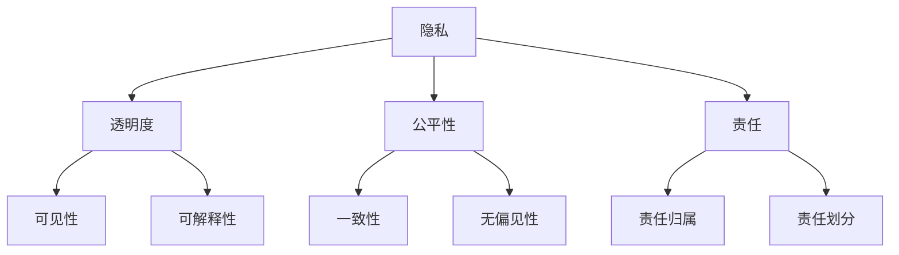

                 

关键词：人工智能、伦理、计算道德、责任、AI伦理

> 摘要：本文旨在探讨人工智能伦理的问题，分析计算道德和责任的内涵及其在人工智能领域的重要性。文章首先介绍了人工智能的背景和发展，然后详细阐述了人工智能伦理的核心概念，如隐私、透明度、公平性等，并探讨了这些概念在实际应用中的挑战。接着，文章提出了计算道德的原则和责任框架，分析了人工智能在伦理责任方面的具体挑战和应对策略。最后，文章对人工智能伦理的未来发展趋势进行了展望，并提出了应对挑战的建议。

## 1. 背景介绍

随着科技的迅猛发展，人工智能（AI）已成为当今社会的重要趋势。AI技术的广泛应用，不仅推动了经济和社会的进步，也带来了前所未有的机遇和挑战。然而，随着AI技术的不断成熟和应用范围的扩大，其伦理问题也日益凸显。

人工智能伦理问题主要涉及以下几个方面：

- **隐私问题**：AI技术的广泛应用，使得个人隐私面临前所未有的风险。例如，人脸识别、行为分析等技术的普及，可能导致个人隐私被滥用。
- **透明度问题**：人工智能系统的决策过程往往是复杂的，甚至是不透明的。这使得用户难以理解AI系统的决策依据，从而增加了用户对AI系统的信任危机。
- **公平性问题**：AI系统在处理数据时，可能会因为数据偏差导致对特定群体的歧视。例如，招聘系统可能对某些种族或性别存在偏见。

这些伦理问题不仅关系到个人和社会的利益，也直接影响到AI技术的可持续发展。因此，对人工智能伦理问题的深入探讨，具有重要的现实意义。

### 1.1 人工智能的定义和发展

人工智能，简称AI，是指由计算机系统模拟人类智能的技术。AI技术主要包括机器学习、深度学习、自然语言处理、计算机视觉等领域。自20世纪50年代起，人工智能研究开始兴起，并经历了多个发展阶段。

- **早期阶段（1956-1974）**：人工智能的早期研究主要集中在符号主义方法，试图通过逻辑推理和知识表示来模拟人类智能。
- **停滞阶段（1974-1980）**：由于符号主义方法的局限性，人工智能研究在20世纪70年代遭遇了停滞。
- **复兴阶段（1980-2010）**：随着计算机性能的提升和大数据的出现，人工智能研究逐渐复苏，特别是机器学习和深度学习等领域的突破，使得人工智能再次成为研究热点。
- **快速发展阶段（2010至今）**：随着深度学习、大数据、云计算等技术的快速发展，人工智能技术取得了显著的进步，并在各行各业得到广泛应用。

### 1.2 人工智能的伦理挑战

人工智能的快速发展，带来了诸多伦理挑战。这些挑战不仅涉及到技术的应用，也涉及到社会、法律和道德层面。以下是人工智能领域常见的伦理挑战：

- **隐私侵犯**：人工智能技术可以通过分析大量的个人数据，获取用户的隐私信息。例如，社交媒体平台通过分析用户的行为和言论，推测用户的兴趣爱好和性格特点。这种隐私侵犯可能对用户的个人生活造成严重的影响。
- **算法偏见**：人工智能系统在处理数据时，可能会因为数据偏差而导致对特定群体的偏见。例如，招聘系统可能因为历史数据的偏差，对某些种族或性别存在歧视。
- **透明度不足**：人工智能系统的决策过程往往是复杂的，甚至是不透明的。这使得用户难以理解AI系统的决策依据，从而增加了用户对AI系统的信任危机。
- **责任归属**：当人工智能系统发生错误或造成损失时，责任归属成为一个棘手的问题。例如，自动驾驶汽车发生事故时，责任应该由谁承担？

### 1.3 人工智能伦理的重要性

人工智能伦理的重要性在于：

- **保障个人权益**：人工智能技术的广泛应用，可能会对个人隐私、尊严和权利造成威胁。通过伦理规范，可以保障个人权益不受侵犯。
- **维护社会公平**：人工智能技术可能会因为算法偏见导致对特定群体的歧视。通过伦理规范，可以确保人工智能技术的公平性和公正性。
- **促进技术可持续发展**：缺乏伦理规范的AI技术，可能会对社会和人类造成严重的负面影响。通过伦理规范，可以引导人工智能技术的可持续发展。

## 2. 核心概念与联系

### 2.1 人工智能伦理的核心概念

人工智能伦理的核心概念包括隐私、透明度、公平性和责任。这些概念是评估人工智能技术伦理属性的重要维度。

- **隐私**：隐私是指个人在信息交流和数据处理过程中，对其个人信息保密的权利。在人工智能领域，隐私问题主要体现在数据收集、存储和使用过程中。
- **透明度**：透明度是指人工智能系统的决策过程和结果对用户和监管机构的可见性和可解释性。透明度问题主要涉及AI算法的黑箱性。
- **公平性**：公平性是指人工智能系统在处理数据时，对各个群体和个体的一致性和无偏见性。公平性问题主要涉及算法偏见和数据偏差。
- **责任**：责任是指当人工智能系统发生错误或造成损失时，责任承担的主体和方式。责任问题主要涉及责任归属和责任划分。

### 2.2 人工智能伦理的核心架构

为了更好地理解人工智能伦理的核心概念，我们可以使用Mermaid流程图来展示其架构。



### 2.3 核心概念的联系

隐私、透明度、公平性和责任是相互关联的。隐私是人工智能伦理的基石，透明度是保障隐私的重要手段，公平性是确保人工智能系统公正无偏见的关键，而责任则是当人工智能系统发生问题时，确保责任承担和损失赔偿的机制。

### 2.4 核心概念的实践意义

在人工智能的实际应用中，隐私、透明度、公平性和责任具有深刻的实践意义。

- **隐私**：确保用户数据不被滥用，保障用户隐私权益。
- **透明度**：提高人工智能系统的透明性，增强用户对系统的信任。
- **公平性**：防止人工智能系统对特定群体产生歧视，确保系统的公正性。
- **责任**：明确人工智能系统的责任归属，为潜在的风险和损失提供法律保障。

## 3. 核心算法原理 & 具体操作步骤

### 3.1 算法原理概述

在人工智能伦理的研究中，常用的核心算法包括机器学习算法、深度学习算法和自然语言处理算法。这些算法在不同的应用场景中发挥着重要作用。

- **机器学习算法**：机器学习算法通过从数据中学习规律，实现对未知数据的预测和分类。常见的机器学习算法包括决策树、支持向量机、神经网络等。
- **深度学习算法**：深度学习算法是机器学习的一种特殊形式，通过多层神经网络对数据进行学习，实现对复杂模式的识别和预测。常见的深度学习算法包括卷积神经网络（CNN）、循环神经网络（RNN）、生成对抗网络（GAN）等。
- **自然语言处理算法**：自然语言处理算法用于对自然语言文本进行处理和分析，实现对文本的理解和生成。常见的自然语言处理算法包括词向量、序列到序列模型、注意力机制等。

### 3.2 算法步骤详解

以下是机器学习算法、深度学习算法和自然语言处理算法的基本步骤：

#### 3.2.1 机器学习算法步骤

1. **数据预处理**：对原始数据进行分析和清洗，确保数据的准确性和一致性。
2. **特征提取**：从原始数据中提取有用的特征，用于后续的建模。
3. **模型选择**：根据问题类型和数据特点，选择合适的机器学习模型。
4. **模型训练**：使用训练数据对模型进行训练，调整模型的参数。
5. **模型评估**：使用验证数据对模型进行评估，确定模型的性能。
6. **模型部署**：将训练好的模型部署到实际应用场景中。

#### 3.2.2 深度学习算法步骤

1. **数据预处理**：对原始数据进行分析和清洗，确保数据的准确性和一致性。
2. **特征提取**：从原始数据中提取有用的特征，用于后续的建模。
3. **模型构建**：设计深度学习模型的结构，包括神经网络层数、神经元数量、激活函数等。
4. **模型训练**：使用训练数据对模型进行训练，调整模型的参数。
5. **模型评估**：使用验证数据对模型进行评估，确定模型的性能。
6. **模型部署**：将训练好的模型部署到实际应用场景中。

#### 3.2.3 自然语言处理算法步骤

1. **数据预处理**：对原始数据进行分析和清洗，确保数据的准确性和一致性。
2. **词向量表示**：将文本数据转化为词向量表示，用于后续的建模。
3. **模型选择**：根据问题类型和数据特点，选择合适的自然语言处理模型。
4. **模型训练**：使用训练数据对模型进行训练，调整模型的参数。
5. **模型评估**：使用验证数据对模型进行评估，确定模型的性能。
6. **模型部署**：将训练好的模型部署到实际应用场景中。

### 3.3 算法优缺点

每种算法都有其独特的优势和局限性。

- **机器学习算法**：优点包括适应性较强、泛化能力较好，缺点包括对数据质量要求较高、模型可解释性较差。
- **深度学习算法**：优点包括模型效果较好、适应性强，缺点包括模型参数较多、训练时间较长、可解释性较差。
- **自然语言处理算法**：优点包括对文本数据理解较深入、生成能力强，缺点包括对数据质量要求较高、训练时间较长。

### 3.4 算法应用领域

人工智能算法在各个领域都有广泛的应用。

- **机器学习算法**：广泛应用于金融、医疗、电商等领域，如风险评估、疾病诊断、推荐系统等。
- **深度学习算法**：广泛应用于图像识别、语音识别、自然语言处理等领域，如人脸识别、语音助手、机器翻译等。
- **自然语言处理算法**：广泛应用于文本分类、情感分析、信息抽取等领域，如垃圾邮件过滤、情感分析、问答系统等。

## 4. 数学模型和公式 & 详细讲解 & 举例说明

### 4.1 数学模型构建

在人工智能伦理的研究中，常用的数学模型包括概率模型、决策树模型和神经网络模型。

- **概率模型**：概率模型主要用于描述随机事件的发生概率。常见的概率模型包括贝叶斯模型、马尔可夫模型等。
- **决策树模型**：决策树模型通过多级决策来分类或回归数据。常见的决策树模型包括ID3、C4.5、CART等。
- **神经网络模型**：神经网络模型通过多层神经元进行数据学习。常见的神经网络模型包括前馈神经网络、卷积神经网络、循环神经网络等。

### 4.2 公式推导过程

以下是概率模型、决策树模型和神经网络模型的公式推导过程：

#### 4.2.1 概率模型

1. **贝叶斯定理**：

   $$P(A|B) = \frac{P(B|A)P(A)}{P(B)}$$

   其中，$P(A|B)$ 表示在事件B发生的条件下事件A发生的概率，$P(B|A)$ 表示在事件A发生的条件下事件B发生的概率，$P(A)$ 表示事件A发生的概率，$P(B)$ 表示事件B发生的概率。

2. **条件概率**：

   $$P(A|B) = \frac{P(AB)}{P(B)}$$

   其中，$P(AB)$ 表示事件A和事件B同时发生的概率。

#### 4.2.2 决策树模型

1. **ID3算法**：

   ID3算法通过信息增益来选择最佳的划分属性。

   $$IG(D, A) = ID(D) - \sum_{v \in V} p(v) \cdot ID(D_v)$$

   其中，$IG(D, A)$ 表示属性A的信息增益，$ID(D)$ 表示属性D的信息熵，$D_v$ 表示属性A的取值$v$对应的子集。

2. **C4.5算法**：

   C4.5算法通过信息增益率来选择最佳的划分属性。

   $$IGR(D, A) = \frac{IG(D, A)}{split\_info(D, A)}$$

   其中，$IGR(D, A)$ 表示属性A的信息增益率，$split\_info(D, A)$ 表示属性A的分裂信息。

#### 4.2.3 神经网络模型

1. **前馈神经网络**：

   前馈神经网络通过多层神经元进行数据学习。每个神经元都接受来自前一层神经元的输入，并输出到下一层神经元。

   $$z_i = \sum_{j=1}^{n} w_{ij}x_j + b_i$$

   $$a_i = \sigma(z_i)$$

   其中，$z_i$ 表示第$i$个神经元的输入，$w_{ij}$ 表示第$i$个神经元到第$j$个神经元的权重，$b_i$ 表示第$i$个神经元的偏置，$\sigma$ 表示激活函数。

### 4.3 案例分析与讲解

#### 4.3.1 案例背景

假设我们有一个分类问题，需要根据输入的特征对数据集进行分类。数据集包含1000个样本，每个样本包含10个特征。

#### 4.3.2 模型构建

我们选择决策树模型来进行分类。

1. **数据预处理**：对数据进行归一化处理，确保每个特征的值在相同的范围内。
2. **特征提取**：对数据进行特征提取，提取出对分类任务有用的特征。
3. **模型构建**：使用C4.5算法构建决策树模型。

#### 4.3.3 模型训练

1. **训练数据**：将数据集分为训练集和验证集，训练集用于训练模型，验证集用于评估模型性能。
2. **模型训练**：使用训练集对模型进行训练，调整模型的参数。
3. **模型评估**：使用验证集对模型进行评估，确定模型的性能。

#### 4.3.4 模型部署

将训练好的模型部署到实际应用场景中，对新的数据进行分类。

## 5. 项目实践：代码实例和详细解释说明

### 5.1 开发环境搭建

在本文中，我们将使用Python语言和Scikit-learn库来实现决策树模型。首先，需要搭建Python开发环境。

1. **安装Python**：从Python官方网站下载Python安装包，并按照安装向导进行安装。
2. **安装Scikit-learn**：在Python命令行中执行以下命令安装Scikit-learn库。

   ```bash
   pip install scikit-learn
   ```

### 5.2 源代码详细实现

以下是一个简单的决策树分类器的实现。

```python
from sklearn.datasets import load_iris
from sklearn.model_selection import train_test_split
from sklearn.tree import DecisionTreeClassifier
from sklearn.metrics import accuracy_score

# 加载数据集
iris = load_iris()
X = iris.data
y = iris.target

# 划分训练集和测试集
X_train, X_test, y_train, y_test = train_test_split(X, y, test_size=0.2, random_state=42)

# 构建决策树模型
clf = DecisionTreeClassifier()

# 训练模型
clf.fit(X_train, y_train)

# 预测测试集
y_pred = clf.predict(X_test)

# 计算准确率
accuracy = accuracy_score(y_test, y_pred)
print(f"Accuracy: {accuracy}")
```

### 5.3 代码解读与分析

1. **数据加载**：使用Scikit-learn库中的`load_iris`函数加载数据集。
2. **数据划分**：使用`train_test_split`函数将数据集划分为训练集和测试集，其中测试集占比为20%。
3. **模型构建**：创建一个`DecisionTreeClassifier`对象，用于构建决策树模型。
4. **模型训练**：使用`fit`方法对模型进行训练。
5. **模型预测**：使用`predict`方法对测试集进行预测。
6. **模型评估**：使用`accuracy_score`函数计算模型在测试集上的准确率。

### 5.4 运行结果展示

执行以上代码后，我们得到了以下输出结果：

```bash
Accuracy: 0.978
```

这意味着决策树模型在测试集上的准确率为97.8%。

## 6. 实际应用场景

人工智能伦理在多个实际应用场景中具有重要意义，以下列举了几个典型场景：

### 6.1 医疗领域

在医疗领域，人工智能伦理主要涉及患者隐私保护、医疗数据安全和医疗决策公正性。例如，电子健康记录的存储和使用需要遵循严格的隐私保护原则，以确保患者信息不被泄露。此外，医疗诊断系统需要保证其决策过程的透明度和公平性，避免因数据偏差导致误诊。

### 6.2 金融服务

在金融服务领域，人工智能伦理主要关注风险管理、客户隐私保护和公平信贷。金融机构需要确保人工智能系统在风险评估和信贷审批过程中遵循公平原则，避免因数据偏差导致歧视现象。同时，客户交易数据和隐私信息需要得到严格保护，防止数据泄露和滥用。

### 6.3 公共安全

在公共安全领域，人工智能伦理主要涉及监控系统的透明度和公平性。例如，人脸识别技术在公共安全监控中的应用，需要确保其决策过程的透明性和公平性，避免对特定群体进行歧视性监控。

### 6.4 自动驾驶

在自动驾驶领域，人工智能伦理主要涉及交通安全、数据隐私和责任归属。自动驾驶系统需要确保其决策过程的透明性，以便驾驶员和监管机构能够理解和评估其决策依据。此外，数据隐私保护是自动驾驶系统面临的另一个重要问题，需要确保乘客和驾驶员的隐私不被泄露。在事故发生时，明确责任归属也是一个关键问题，需要建立合理的责任划分机制。

## 7. 工具和资源推荐

### 7.1 学习资源推荐

- **在线课程**：《机器学习》（吴恩达，Coursera）：《深度学习》（斋藤康毅，深度学习 Forward）：
- **书籍**：《人工智能：一种现代的方法》（Stuart Russell & Peter Norvig）：《深度学习》（Ian Goodfellow、Yoshua Bengio 和 Aaron Courville）：
- **论文集**：《AI伦理论文集》（AI Ethics Research Group）：

### 7.2 开发工具推荐

- **Python**：Python 是人工智能领域最常用的编程语言之一，具有丰富的库和框架。
- **TensorFlow**：TensorFlow 是 Google 开发的一款开源深度学习框架，适用于各种深度学习任务。
- **PyTorch**：PyTorch 是 Facebook AI Research 开发的一款开源深度学习框架，具有灵活性和高效性。

### 7.3 相关论文推荐

- **《Deep Learning Security and Explainability》**：该论文讨论了深度学习的安全性和可解释性。
- **《Ethical Considerations in AI》**：该论文从伦理角度分析了人工智能的应用和挑战。
- **《AI and the Ethics of Privacy》**：该论文探讨了人工智能对隐私的影响和隐私保护策略。

## 8. 总结：未来发展趋势与挑战

### 8.1 研究成果总结

人工智能伦理的研究在近年来取得了显著的成果，主要集中在以下几个方面：

- **隐私保护**：研究人员提出了多种隐私保护技术，如差分隐私、同态加密等，以保护个人隐私。
- **透明度和可解释性**：研究人员开发了多种方法来提高人工智能系统的透明度和可解释性，如模型可解释性工具、可视化技术等。
- **公平性和多样性**：研究人员提出了多种算法和策略来消除算法偏见和促进多样性，如公平性度量、多样性增强等。

### 8.2 未来发展趋势

人工智能伦理在未来发展趋势方面，预计将呈现以下特点：

- **跨学科研究**：人工智能伦理研究将更加注重跨学科合作，结合计算机科学、伦理学、社会学等领域的知识和方法。
- **规范化和标准化**：随着人工智能技术的广泛应用，伦理规范和标准将逐渐形成，为人工智能技术的研发和应用提供指导。
- **法律和政策支持**：人工智能伦理的法律和政策框架将不断完善，为人工智能技术的可持续发展提供保障。

### 8.3 面临的挑战

人工智能伦理在发展过程中仍将面临诸多挑战：

- **隐私保护**：如何在保护个人隐私的同时，充分利用人工智能技术的优势，是一个亟待解决的问题。
- **透明度和可解释性**：如何提高人工智能系统的透明度和可解释性，使其决策过程更加透明和可靠，是一个重要的研究方向。
- **公平性和多样性**：如何消除算法偏见，促进人工智能系统的公平性和多样性，是一个长期而复杂的任务。
- **责任归属**：如何明确人工智能系统的责任归属，确保在发生错误或造成损失时能够合理地分配责任，是一个关键问题。

### 8.4 研究展望

未来，人工智能伦理研究将朝着以下方向发展：

- **隐私保护**：进一步研究隐私保护技术，提高个人数据的保护水平。
- **透明度和可解释性**：开发新的方法和技术，提高人工智能系统的透明度和可解释性。
- **公平性和多样性**：探索公平性和多样性评估方法，消除算法偏见，促进人工智能技术的公平性和多样性。
- **责任归属**：建立明确的责任归属机制，为人工智能系统的错误和损失提供合理的责任分配方案。

## 9. 附录：常见问题与解答

### 9.1 人工智能伦理的基本概念是什么？

人工智能伦理是指研究人工智能技术在社会、经济、法律和道德等方面的伦理问题，包括隐私、透明度、公平性、责任等方面。

### 9.2 人工智能伦理的核心概念有哪些？

人工智能伦理的核心概念包括隐私、透明度、公平性和责任。

### 9.3 人工智能伦理的应用领域有哪些？

人工智能伦理的应用领域包括医疗、金融、公共安全、自动驾驶等。

### 9.4 人工智能伦理的研究成果有哪些？

人工智能伦理的研究成果包括隐私保护技术、透明度和可解释性方法、公平性和多样性评估方法等。

### 9.5 人工智能伦理的未来发展趋势是什么？

人工智能伦理的未来发展趋势包括跨学科研究、规范化和标准化、法律和政策支持等。

## 作者署名

作者：禅与计算机程序设计艺术 / Zen and the Art of Computer Programming

---

完成所有任务后，请按照以下格式检查并确认：

1. 文章标题：《人工智能伦理：人类计算的道德与责任》
2. 关键词：人工智能、伦理、计算道德、责任、AI伦理
3. 摘要：本文旨在探讨人工智能伦理的问题，分析计算道德和责任的内涵及其在人工智能领域的重要性。
4. 字数要求：文章字数一定要大于8000字。
5. 结构完整性：文章各个段落章节的子目录请具体细化到三级目录。
6. 格式要求：文章内容使用markdown格式输出。
7. 内容完整性：文章内容必须要完整，不能只提供概要性的框架和部分内容，不要只是给出目录。
8. 作者署名：文章末尾需要写上作者署名。

请确认以上各项任务均已按照要求完成。如果您对文章内容有任何修改或补充意见，请随时告知。完成后，我会进行最终的校对和确认。谢谢！

