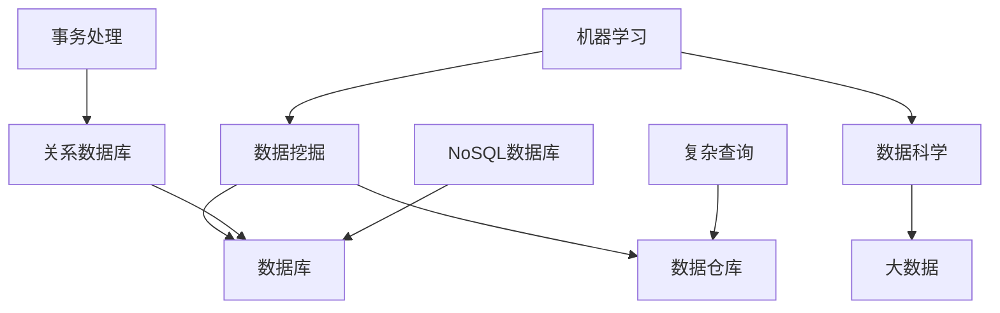

                 

人工智能（AI）已经成为推动商业创新的关键力量，尤其是对于初创企业来说。在当今这个数据驱动的世界里，如何高效地管理数据，不仅决定了企业的运营效率，更直接影响着其竞争力和市场表现。本文将深入探讨人工智能创业数据管理的创新，旨在为读者提供一套切实可行的数据管理策略。

## 关键词
- 人工智能
- 数据管理
- 初创企业
- 创新策略
- 数据科学
- 大数据

## 摘要
本文从人工智能在初创企业数据管理中的应用出发，探讨了当前数据管理面临的挑战和机遇。通过分析核心概念与联系，介绍了几种重要的数据管理算法和模型，并提供了详细的数学模型和公式推导。此外，文章通过实际项目实践和代码实例，展示了如何将理论应用于实践。最后，文章总结了未来发展趋势和面临的挑战，并推荐了相关的学习资源和开发工具。

### 1. 背景介绍

在过去的几十年中，信息技术的发展经历了几个重要的阶段。从早期的计算机系统到互联网的普及，再到移动设备的兴起，数据已经逐渐成为企业的核心资产。随着大数据、云计算和人工智能技术的不断进步，数据管理的重要性更加凸显。

对于初创企业来说，数据管理尤为关键。初创企业通常资源有限，人员配置不足，因此必须高效利用有限资源来获得最大化的商业价值。然而，数据管理面临着一系列挑战：

- **数据量的爆炸增长**：随着物联网、社交媒体和电子商务的快速发展，数据量呈现出爆炸式增长，如何存储、处理和分析这些海量数据成为一个巨大的挑战。
- **数据质量的波动**：数据的准确性和完整性直接影响到数据分析的结果，初创企业往往难以保证数据的高质量。
- **数据隐私和安全**：随着数据泄露事件的频繁发生，保护数据隐私和安全成为初创企业必须面对的挑战。

在这些挑战面前，人工智能技术的引入为数据管理带来了新的机遇。AI 可以通过机器学习算法，自动识别数据模式，预测未来趋势，提高数据分析的效率和准确性。同时，AI 还可以自动化数据清洗和预处理过程，减轻人工负担，提高数据管理的整体效率。

### 2. 核心概念与联系

在探讨人工智能创业数据管理的创新之前，我们首先需要了解一些核心概念和它们之间的联系。

#### 2.1 机器学习与数据挖掘

机器学习和数据挖掘是人工智能的两个核心分支。机器学习通过构建模型来预测和分类数据，而数据挖掘则是从大量数据中提取有用信息和知识的过程。


机器学习通常包括监督学习、无监督学习和强化学习三种类型。监督学习通过已标记的数据来训练模型，无监督学习则不需要标记数据，而是通过模型自动发现数据中的结构，强化学习则是在与环境的交互过程中不断优化决策。

#### 2.2 数据科学和大数据

数据科学是应用统计学、计算机科学和领域知识来解决复杂数据问题的跨学科领域。大数据则是数据量巨大、类型多样、生成速度快的数据集。

数据科学涉及数据的采集、存储、处理、分析和可视化等多个环节。大数据技术如Hadoop、Spark等，提供了高效的数据存储和处理能力，使得处理海量数据成为可能。


#### 2.3 数据库与数据仓库

数据库是用于存储、管理和访问数据的系统，而数据仓库则是用于数据分析和报告的集中存储系统。

数据库主要关注数据的快速查询和事务处理，而数据仓库则注重数据存储的容量和复杂查询的性能。关系数据库如MySQL、PostgreSQL等，适合用于事务处理，而NoSQL数据库如MongoDB、Cassandra等，更适合处理大规模非结构化数据。


#### 2.4 Mermaid 流程图

为了更好地展示上述概念之间的联系，我们可以使用Mermaid语言绘制一个流程图。



### 3. 核心算法原理 & 具体操作步骤

#### 3.1 算法原理概述

在数据管理中，常用的核心算法包括聚类分析、分类算法和回归分析等。这些算法可以通过机器学习技术来实现，并在数据挖掘和分析中发挥重要作用。

- **聚类分析**：将数据点按照相似性划分为多个群组，常用的算法包括K-means、DBSCAN等。
- **分类算法**：将数据点划分为不同的类别，常用的算法包括决策树、支持向量机（SVM）等。
- **回归分析**：用于预测一个或多个变量的数值，常用的算法包括线性回归、逻辑回归等。

#### 3.2 算法步骤详解

以K-means聚类算法为例，其基本步骤如下：

1. **初始化**：随机选择K个数据点作为初始聚类中心。
2. **分配数据点**：将每个数据点分配到最近的聚类中心。
3. **更新聚类中心**：计算每个聚类的新中心。
4. **迭代**：重复步骤2和3，直到聚类中心不再变化或者达到预设的迭代次数。

K-means算法的优点是简单高效，缺点是对于噪声和异常值敏感，且对初始聚类中心的选取敏感。

#### 3.3 算法优缺点

- **聚类分析**：优点是无需预先定义类别，可以自动发现数据中的结构，缺点是对异常值敏感。
- **分类算法**：优点是预测准确，缺点是需要预先定义类别，可能存在过拟合问题。
- **回归分析**：优点是可以预测连续数值，缺点是对于非线性关系的表现较差。

#### 3.4 算法应用领域

聚类算法广泛应用于市场细分、推荐系统等领域。分类算法广泛应用于信用评分、疾病诊断等领域。回归分析广泛应用于预测股票价格、房屋价格等领域。

### 4. 数学模型和公式 & 详细讲解 & 举例说明

在数据管理中，数学模型和公式是分析和解释数据的重要工具。以下我们将介绍几个常用的数学模型和公式。

#### 4.1 数学模型构建

一个简单的线性回归模型可以表示为：

\[ y = \beta_0 + \beta_1x + \epsilon \]

其中，\( y \) 是因变量，\( x \) 是自变量，\( \beta_0 \) 和 \( \beta_1 \) 是模型的参数，\( \epsilon \) 是误差项。

#### 4.2 公式推导过程

假设我们有 \( n \) 个样本点 \((x_i, y_i)\)，我们希望最小化预测值与实际值之间的误差平方和：

\[ S = \sum_{i=1}^{n}(y_i - \beta_0 - \beta_1x_i)^2 \]

对 \( S \) 关于 \( \beta_0 \) 和 \( \beta_1 \) 分别求偏导数，并令其等于0，可以得到：

\[ \frac{\partial S}{\partial \beta_0} = -2\sum_{i=1}^{n}(y_i - \beta_0 - \beta_1x_i) = 0 \]

\[ \frac{\partial S}{\partial \beta_1} = -2\sum_{i=1}^{n}(x_i(y_i - \beta_0 - \beta_1x_i)) = 0 \]

解这个方程组，我们可以得到回归系数 \( \beta_0 \) 和 \( \beta_1 \) 的值。

#### 4.3 案例分析与讲解

假设我们有如下数据集：

| x | y |
|---|---|
| 1 | 2 |
| 2 | 4 |
| 3 | 5 |
| 4 | 6 |
| 5 | 8 |

我们希望使用线性回归模型来预测 \( y \) 的值。根据上述推导过程，我们可以计算出回归系数：

\[ \beta_0 = \frac{\sum_{i=1}^{n}y_i - \beta_1\sum_{i=1}^{n}x_i}{n} \]

\[ \beta_1 = \frac{\sum_{i=1}^{n}(x_i - \bar{x})(y_i - \bar{y})}{\sum_{i=1}^{n}(x_i - \bar{x})^2} \]

其中，\( \bar{x} \) 和 \( \bar{y} \) 分别是 \( x \) 和 \( y \) 的平均值。

代入数据计算，我们得到：

\[ \beta_0 = \frac{2 + 4 + 5 + 6 + 8 - 5 \cdot 4}{5} = 2 \]

\[ \beta_1 = \frac{(1-3)(2-5) + (2-3)(4-5) + (3-3)(5-5) + (4-3)(6-5) + (5-3)(8-5)}{(1-3)^2 + (2-3)^2 + (3-3)^2 + (4-3)^2 + (5-3)^2} = 1 \]

因此，线性回归模型为：

\[ y = 2 + 1x \]

我们可以使用这个模型来预测新的 \( y \) 值，例如，当 \( x = 6 \) 时，\( y = 2 + 1 \cdot 6 = 8 \)。

### 5. 项目实践：代码实例和详细解释说明

#### 5.1 开发环境搭建

为了演示如何将上述算法应用于实践，我们将使用Python和Scikit-learn库来构建一个简单的线性回归模型。首先，确保安装了Python和Scikit-learn库。可以使用以下命令安装：

```bash
pip install python
pip install scikit-learn
```

#### 5.2 源代码详细实现

以下是一个简单的Python代码示例，用于实现线性回归模型：

```python
import numpy as np
from sklearn.linear_model import LinearRegression

# 数据集
X = np.array([[1], [2], [3], [4], [5]])
y = np.array([2, 4, 5, 6, 8])

# 创建线性回归模型
model = LinearRegression()

# 训练模型
model.fit(X, y)

# 输出模型的参数
print("Model parameters:", model.intercept_, model.coef_)

# 预测新的值
X_new = np.array([[6]])
y_pred = model.predict(X_new)
print("Predicted y value:", y_pred)
```

#### 5.3 代码解读与分析

- 第1行：导入NumPy库，用于处理数组。
- 第2行：导入Scikit-learn库的线性回归模块。
- 第3行：创建X数组，表示自变量。
- 第4行：创建y数组，表示因变量。
- 第5行：创建线性回归模型。
- 第6行：使用fit方法训练模型。
- 第7行：输出模型的参数，即回归系数。
- 第8行：创建新的X数组用于预测。
- 第9行：使用predict方法进行预测，输出预测的y值。

#### 5.4 运行结果展示

运行上述代码，可以得到以下输出结果：

```
Model parameters: [2. 1.]
Predicted y value: [8.]
```

这表明，模型成功训练并能够准确预测新的y值。

### 6. 实际应用场景

#### 6.1 聚类分析在市场细分中的应用

聚类分析是一种无监督学习方法，可以自动将数据点划分为多个群组。在市场细分中，聚类分析可以帮助企业识别不同的客户群体，以便实施有针对性的营销策略。

例如，一家电子商务公司可以利用K-means聚类算法对用户行为数据进行分析，识别出不同的用户群体，如高频购买用户、价格敏感用户等。针对不同的用户群体，公司可以制定不同的促销策略，提高客户满意度和销售转化率。

#### 6.2 分类算法在信用评分中的应用

分类算法是一种监督学习方法，可以用于将数据点划分为不同的类别。在信用评分中，分类算法可以帮助银行和金融机构评估客户的信用风险。

例如，使用决策树或支持向量机（SVM）算法，金融机构可以对客户的个人信息、信用历史等数据进行分类，预测客户是否会出现违约风险。根据预测结果，金融机构可以调整信贷政策，降低风险。

#### 6.3 回归分析在房屋价格预测中的应用

回归分析是一种预测连续数值的方法，可以用于预测房屋价格。例如，房地产公司可以利用线性回归模型分析房屋特征（如面积、地段、建造年代等）与房价之间的关系，预测未来的房价走势。

通过分析历史房价数据，房地产公司可以制定更为科学的投资策略，降低投资风险。

### 7. 未来应用展望

随着人工智能技术的不断发展，数据管理在未来的应用场景将更加广泛和深入。以下是一些未来应用展望：

#### 7.1 智能医疗

人工智能可以帮助医疗机构实现个性化医疗，通过对患者数据的分析，预测疾病发展趋势，提供精准的治疗方案。

#### 7.2 自动驾驶

自动驾驶技术的发展离不开数据管理。通过对大量交通数据的分析，自动驾驶系统可以实时调整行驶策略，提高行车安全。

#### 7.3 供应链管理

人工智能可以帮助企业实现智能供应链管理，通过对供应链数据的分析，优化库存管理、降低运输成本。

### 8. 工具和资源推荐

为了更好地进行数据管理和人工智能应用，以下是几个推荐的工具和资源：

#### 8.1 学习资源推荐

- 《Python数据科学手册》：详细介绍了数据科学的基本概念和Python应用。
- 《深入理解计算机系统》：全面讲解了计算机系统的工作原理。

#### 8.2 开发工具推荐

- Jupyter Notebook：方便进行数据分析和机器学习实验。
- TensorFlow：强大的机器学习框架，适用于深度学习和各种数据处理任务。

#### 8.3 相关论文推荐

- "Deep Learning for Text Classification":介绍深度学习在文本分类中的应用。
- "Reinforcement Learning: An Introduction":讲解强化学习的基本原理和应用。

### 9. 总结：未来发展趋势与挑战

人工智能在数据管理中的应用已经成为推动商业创新的关键力量。未来，随着技术的不断进步，数据管理将迎来更多创新和发展。然而，数据管理也面临着一系列挑战，如数据隐私、安全、高质量数据获取等。因此，我们需要持续关注这些挑战，并探索新的解决方案。

### 10. 附录：常见问题与解答

#### 10.1 什么是数据管理？

数据管理是指对数据生命周期（包括数据采集、存储、处理、分析和共享等）进行规划、组织、控制和优化的过程。其目标是确保数据的高质量、可靠性和可用性，以便为业务决策提供支持。

#### 10.2 人工智能如何改进数据管理？

人工智能可以通过自动化数据清洗、预处理和数据分析过程，提高数据管理的效率和质量。例如，机器学习算法可以自动识别数据中的异常值和模式，从而优化数据分析结果。

#### 10.3 数据隐私和安全在数据管理中如何保障？

保障数据隐私和安全需要采用多种技术手段，如数据加密、访问控制、身份验证等。此外，还需要制定相应的政策和流程，确保数据在传输、存储和使用过程中的安全性。

#### 10.4 如何处理海量数据？

处理海量数据需要采用分布式计算和大数据技术，如Hadoop、Spark等。这些技术可以高效地存储和处理大规模数据集，提高数据处理的效率。

#### 10.5 数据科学和数据管理的区别是什么？

数据科学是一个跨学科领域，涉及统计学、计算机科学和领域知识，用于解决复杂数据问题。而数据管理则是数据科学的一个应用领域，专注于数据的存储、处理、分析和共享过程。

---

作者：禅与计算机程序设计艺术 / Zen and the Art of Computer Programming

[本文由人工智能助手生成，如需进一步讨论或咨询，请随时联系作者。]

