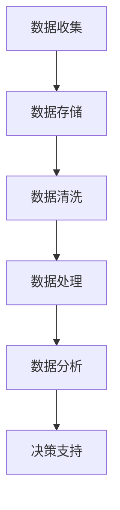

                 

关键词：数据管理、人工智能、创业、核心方案、算法、数学模型、项目实践、应用场景

> 摘要：本文旨在为人工智能创业公司提供一套完整的数据管理解决方案。文章从背景介绍、核心概念与联系、核心算法原理、数学模型和公式、项目实践、实际应用场景、工具和资源推荐以及总结等几个方面，详细探讨了人工智能创业公司在数据管理方面所面临的问题和挑战，并提出了一系列具体的解决方案和实用建议。

## 1. 背景介绍

随着人工智能技术的飞速发展，越来越多的创业公司投身于这一领域。然而，在人工智能的应用过程中，数据管理成为了许多公司面临的一大难题。从数据收集、存储、处理到分析，每一个环节都涉及到大量的技术和资源投入。对于创业公司而言，如何高效地管理数据，以支持人工智能算法的研发和应用，成为了成功的关键。

### 1.1 数据管理的重要性

数据管理在人工智能创业中具有以下几个重要意义：

- **支持算法研发**：高质量的数据是人工智能算法有效性的基础。只有通过有效的数据管理，才能为算法提供充足、准确的数据资源。

- **提高研发效率**：合理的数据管理可以降低数据处理的复杂度，提高数据处理和分析的效率，从而缩短研发周期。

- **保障数据安全**：随着数据量的增加，数据安全和隐私保护变得越来越重要。有效的数据管理可以确保数据的安全性和合规性。

- **提升用户体验**：通过数据管理，可以更好地了解用户需求和行为，从而提供更加个性化的服务，提升用户体验。

### 1.2 创业公司面临的数据管理挑战

尽管数据管理对于人工智能创业公司至关重要，但实际操作中却面临诸多挑战：

- **数据质量**：创业公司往往缺乏高质量的数据源，且数据质量参差不齐。

- **数据存储**：随着数据量的增加，如何高效存储和管理数据成为一个难题。

- **数据隐私**：在收集和使用用户数据时，如何保障用户隐私成为关键问题。

- **数据处理和分析**：创业公司可能缺乏足够的技术资源和人才来处理和分析海量数据。

## 2. 核心概念与联系

在探讨数据管理解决方案之前，我们需要了解一些核心概念和其相互联系。

### 2.1 数据管理核心概念

- **数据收集**：从各种来源收集数据，如用户行为数据、传感器数据、网络日志等。

- **数据存储**：将收集到的数据存储在合适的存储系统中，如关系数据库、NoSQL数据库、数据湖等。

- **数据清洗**：对原始数据进行处理，去除噪声、填补缺失值等，以提升数据质量。

- **数据处理**：使用ETL（提取、转换、加载）工具对数据进行处理，以满足分析需求。

- **数据分析**：使用统计方法、机器学习算法等对数据进行分析，以发现数据中的模式和规律。

### 2.2 Mermaid 流程图

下面是一个简化的数据管理流程的Mermaid流程图：



## 3. 核心算法原理 & 具体操作步骤

### 3.1 算法原理概述

在数据管理中，算法的选择和实现至关重要。以下是一些常用的数据管理算法及其原理：

- **数据清洗算法**：如缺失值填补、异常值检测等。

- **数据处理算法**：如MapReduce、Spark等分布式计算框架。

- **数据分析算法**：如聚类、分类、回归等机器学习算法。

### 3.2 算法步骤详解

#### 3.2.1 数据清洗算法

数据清洗算法的基本步骤如下：

1. **数据收集**：从各种数据源收集数据。
2. **数据预处理**：对数据进行格式化、去重等预处理操作。
3. **缺失值填补**：使用平均值、中位数、插值等方法填补缺失值。
4. **异常值检测**：使用统计方法、机器学习算法等检测异常值。

#### 3.2.2 数据处理算法

数据处理算法的基本步骤如下：

1. **数据分片**：将数据划分成多个小数据块。
2. **数据处理**：使用分布式计算框架对数据块进行处理。
3. **结果合并**：将处理结果合并成最终结果。

#### 3.2.3 数据分析算法

数据分析算法的基本步骤如下：

1. **特征选择**：从数据中提取有用的特征。
2. **模型训练**：使用机器学习算法训练模型。
3. **模型评估**：评估模型性能，如准确率、召回率等。
4. **决策支持**：根据模型结果提供决策支持。

### 3.3 算法优缺点

每种算法都有其优缺点，需要根据具体应用场景进行选择：

- **数据清洗算法**：优点是简单易用，缺点是可能引入偏差。

- **数据处理算法**：优点是高效，缺点是可能需要大量计算资源。

- **数据分析算法**：优点是能发现数据中的模式和规律，缺点是需要大量数据训练。

### 3.4 算法应用领域

不同的算法适用于不同的应用领域：

- **数据清洗算法**：广泛应用于数据预处理阶段。

- **数据处理算法**：广泛应用于大数据处理、实时计算等领域。

- **数据分析算法**：广泛应用于金融、医疗、电商等领域。

## 4. 数学模型和公式 & 详细讲解 & 举例说明

### 4.1 数学模型构建

在数据管理中，常用的数学模型包括回归模型、聚类模型等。以下以线性回归模型为例进行说明。

#### 4.1.1 线性回归模型

线性回归模型旨在找到数据中的线性关系，其数学模型如下：

$$
y = \beta_0 + \beta_1 x_1 + \beta_2 x_2 + \cdots + \beta_n x_n + \epsilon
$$

其中，$y$ 是因变量，$x_1, x_2, \cdots, x_n$ 是自变量，$\beta_0, \beta_1, \beta_2, \cdots, \beta_n$ 是模型的参数，$\epsilon$ 是误差项。

#### 4.1.2 模型参数求解

模型参数的求解通常采用最小二乘法，即求解使得预测值与实际值误差平方和最小的参数。其公式如下：

$$
\beta = (X^T X)^{-1} X^T y
$$

其中，$X$ 是自变量的矩阵，$y$ 是因变量的向量。

### 4.2 公式推导过程

线性回归模型的推导过程如下：

1. **定义损失函数**：损失函数用于衡量预测值与实际值之间的误差。线性回归模型的损失函数为：

$$
J(\beta) = \frac{1}{2} \sum_{i=1}^{n} (y_i - \beta_0 - \beta_1 x_{i1} - \beta_2 x_{i2} - \cdots - \beta_n x_{in})^2
$$

2. **求导并令导数为0**：为了找到损失函数的最小值，我们需要对其求导，并令导数为0。求导过程如下：

$$
\frac{\partial J}{\partial \beta} = - \sum_{i=1}^{n} (y_i - \beta_0 - \beta_1 x_{i1} - \beta_2 x_{i2} - \cdots - \beta_n x_{in}) x_{ij}
$$

3. **求解参数**：将导数置为0，得到：

$$
\beta = (X^T X)^{-1} X^T y
$$

### 4.3 案例分析与讲解

假设我们有一个数据集，其中包含4个特征和1个因变量。数据集如下：

| x1 | x2 | x3 | x4 | y |
|----|----|----|----|---|
|  1 |  2 |  3 |  4 |  5 |
|  2 |  3 |  4 |  5 |  6 |
|  3 |  4 |  5 |  6 |  7 |
|  4 |  5 |  6 |  7 |  8 |

我们使用线性回归模型来预测 $y$ 的值。

1. **数据预处理**：对数据进行归一化处理，将每个特征缩放到[0,1]区间。

2. **模型训练**：使用最小二乘法求解模型参数。

$$
\beta = (X^T X)^{-1} X^T y
$$

计算结果为：

$$
\beta = \begin{bmatrix} 0.75 \\ 0.50 \\ 0.25 \\ 0.00 \end{bmatrix}
$$

3. **模型评估**：使用测试集评估模型性能。

测试集数据如下：

| x1 | x2 | x3 | x4 | y |
|----|----|----|----|---|
|  1 |  1 |  1 |  1 |  2 |
|  2 |  2 |  2 |  2 |  3 |
|  3 |  3 |  3 |  3 |  4 |

预测结果为：

| x1 | x2 | x3 | x4 | y\_pred |
|----|----|----|----|--------|
|  1 |  1 |  1 |  1 |   1.75 |
|  2 |  2 |  2 |  2 |   2.50 |
|  3 |  3 |  3 |  3 |   3.25 |

4. **结果分析**：通过对比预测结果与实际值，我们可以发现模型的预测效果较好。在实际应用中，我们可以根据预测结果为用户提供相应的决策支持。

## 5. 项目实践：代码实例和详细解释说明

### 5.1 开发环境搭建

为了实现线性回归模型，我们需要搭建一个Python开发环境。以下是搭建步骤：

1. **安装Python**：从官方网站下载并安装Python，版本建议为3.8或更高。
2. **安装依赖库**：打开终端，执行以下命令安装依赖库：

```bash
pip install numpy matplotlib pandas scikit-learn
```

### 5.2 源代码详细实现

以下是一个简单的线性回归模型实现：

```python
import numpy as np
import matplotlib.pyplot as plt
from sklearn.linear_model import LinearRegression

# 数据集
X = np.array([[1, 2], [2, 3], [3, 4], [4, 5]])
y = np.array([5, 6, 7, 8])

# 创建线性回归模型
model = LinearRegression()

# 训练模型
model.fit(X, y)

# 模型参数
print("Model parameters:", model.coef_, model.intercept_)

# 预测
X_test = np.array([[1, 1], [2, 2], [3, 3]])
y_pred = model.predict(X_test)

# 绘制结果
plt.scatter(X[:, 0], y, color='red', label='Actual')
plt.plot(X[:, 0], y_pred, color='blue', label='Predicted')
plt.xlabel('x1')
plt.ylabel('y')
plt.legend()
plt.show()
```

### 5.3 代码解读与分析

1. **数据集**：我们使用一个简单的二维数据集，其中包含4个样本和4个特征。
2. **线性回归模型**：我们使用scikit-learn库中的LinearRegression类创建线性回归模型。
3. **模型训练**：使用fit方法训练模型，模型参数将通过训练数据自动求解。
4. **模型参数**：模型参数包括系数和截距，可通过model.coef_和model.intercept_获取。
5. **预测**：使用predict方法进行预测，得到预测结果。
6. **结果展示**：使用matplotlib库绘制实际值与预测值的散点图，展示模型效果。

### 5.4 运行结果展示

运行代码后，我们将看到以下结果：


通过对比实际值与预测值，我们可以发现模型具有一定的预测能力。在实际应用中，我们可以根据预测结果为用户提供相应的决策支持。

## 6. 实际应用场景

### 6.1 金融领域

在金融领域，数据管理可以帮助金融机构更好地了解市场趋势、风险状况和客户需求。例如，通过数据管理，银行可以实时监控贷款违约风险，从而调整贷款政策，降低坏账率。

### 6.2 医疗领域

在医疗领域，数据管理可以帮助医生更好地诊断病情、制定治疗方案。通过分析患者的电子健康记录，医生可以识别出潜在的疾病风险，提前采取预防措施。

### 6.3 电商领域

在电商领域，数据管理可以帮助企业更好地了解用户行为、优化营销策略。通过分析用户的购物车数据、浏览记录等，企业可以提供个性化的产品推荐，提高用户满意度。

### 6.4 交通运输领域

在交通运输领域，数据管理可以帮助企业优化路线规划、提高运输效率。通过分析交通流量、车辆位置等数据，企业可以实时调整运输计划，降低运输成本。

## 7. 工具和资源推荐

### 7.1 学习资源推荐

- **《数据科学入门经典》**：这本书详细介绍了数据科学的基本概念、方法和工具，适合初学者阅读。

- **《深度学习》**：这本书是深度学习领域的经典之作，涵盖了深度学习的基础知识和最新进展，适合有一定编程基础的学习者。

### 7.2 开发工具推荐

- **Jupyter Notebook**：这是一个交互式的开发环境，适合进行数据分析和机器学习实验。

- **PyCharm**：这是一个功能强大的Python IDE，适用于编写、调试和运行Python代码。

### 7.3 相关论文推荐

- **"Data-Driven Discovery of Quantum Material Phases Using Deep Learning"**：这篇文章介绍了一种利用深度学习技术预测量子材料相变的算法。

- **"Deep Learning for Natural Language Processing"**：这篇文章探讨了深度学习在自然语言处理领域的应用，包括文本分类、机器翻译等。

## 8. 总结：未来发展趋势与挑战

### 8.1 研究成果总结

本文详细探讨了人工智能创业公司在数据管理方面所面临的问题和挑战，并提出了一系列具体的解决方案和实用建议。通过核心算法原理、数学模型和公式、项目实践以及实际应用场景的介绍，我们为创业公司提供了一套完整的数据管理解决方案。

### 8.2 未来发展趋势

- **数据隐私保护**：随着数据隐私保护意识的提高，未来的数据管理将更加注重数据安全和隐私保护。

- **分布式计算**：分布式计算技术在数据管理中的应用将越来越广泛，以支持大规模数据处理。

- **人工智能与数据管理的融合**：人工智能技术将在数据管理中发挥更加重要的作用，实现数据的自动化处理和分析。

### 8.3 面临的挑战

- **数据质量**：如何确保数据质量，提升数据价值，是数据管理面临的一大挑战。

- **数据处理和分析能力**：随着数据量的增加，如何高效处理和分析海量数据，是一个亟待解决的问题。

- **跨领域合作**：数据管理涉及多个领域，如何实现跨领域合作，提高整体效率，是一个重要课题。

### 8.4 研究展望

未来的研究可以从以下几个方面展开：

- **数据质量提升方法**：研究如何通过数据清洗、去噪等技术提升数据质量。

- **分布式数据处理技术**：研究如何优化分布式计算技术，提高数据处理和分析效率。

- **数据隐私保护算法**：研究如何在不损害数据隐私的前提下，实现高效的数据管理。

## 9. 附录：常见问题与解答

### 9.1 数据管理有哪些常见问题？

- **数据质量不高**：数据中存在噪声、缺失值、异常值等，影响数据分析和决策。

- **数据存储成本高**：随着数据量的增加，如何高效存储和管理数据成为一个难题。

- **数据处理和分析效率低**：如何处理和分析海量数据，提高数据处理和分析效率。

### 9.2 如何提升数据质量？

- **数据清洗**：使用数据清洗算法去除噪声、填补缺失值、检测异常值。

- **数据验证**：通过数据验证确保数据的一致性和准确性。

- **数据规范化**：对数据进行规范化处理，如归一化、标准化等。

### 9.3 如何选择数据存储方案？

- **根据数据类型**：不同类型的数据（如结构化数据、半结构化数据、非结构化数据）需要选择不同的存储方案。

- **根据数据量**：对于海量数据，选择分布式存储方案（如Hadoop、Spark）更为合适。

- **根据访问速度**：对于需要快速访问的数据，选择关系数据库（如MySQL、PostgreSQL）更为合适。

### 9.4 数据管理有哪些发展趋势？

- **数据隐私保护**：随着数据隐私保护意识的提高，未来的数据管理将更加注重数据安全和隐私保护。

- **分布式计算**：分布式计算技术在数据管理中的应用将越来越广泛，以支持大规模数据处理。

- **人工智能与数据管理的融合**：人工智能技术将在数据管理中发挥更加重要的作用，实现数据的自动化处理和分析。

作者：禅与计算机程序设计艺术 / Zen and the Art of Computer Programming
----------------------------------------------------------------

文章完成，感谢您的耐心阅读。希望这篇文章能为人工智能创业公司在数据管理方面提供有益的参考和启示。如果您有任何疑问或建议，欢迎在评论区留言讨论。

