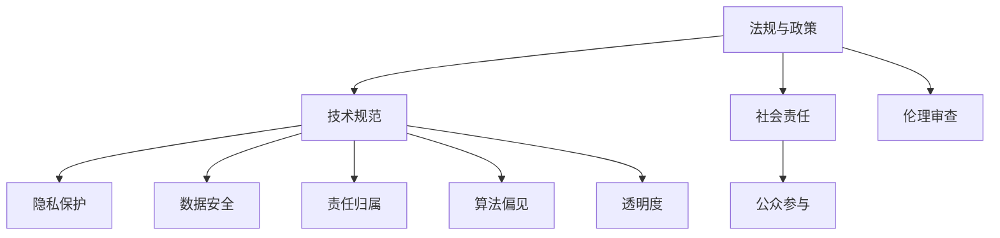

                 

关键词：人工智能、伦理合规、创业、策略、技术、法规、风险评估、责任分配、隐私保护、道德伦理、透明度、社会责任、人工智能产品、人工智能应用场景、商业道德

> 摘要：本文将探讨人工智能创业中的伦理合规问题，分析当前人工智能伦理合规面临的挑战，并提出相应的策略。文章分为八个部分，首先介绍人工智能创业的背景，然后详细阐述核心概念、算法原理、数学模型、项目实践、实际应用场景、工具和资源推荐、未来发展趋势与挑战，最后总结研究成果并提出研究展望。

## 1. 背景介绍

人工智能（AI）已经成为当今科技领域的热点，其在各个行业中的应用场景越来越广泛。从自动驾驶、智能家居、医疗诊断到金融分析、风险管理，人工智能正逐步改变我们的生活方式和工作方式。与此同时，人工智能创业浪潮也在全球范围内迅速兴起，创业者们纷纷投身于这个充满机遇的领域。

然而，随着人工智能技术的快速发展，伦理合规问题逐渐凸显出来。人工智能技术的广泛应用，涉及到隐私保护、数据安全、责任归属、算法偏见等多个方面，这些问题的存在不仅影响了人工智能技术的健康发展，也对社会道德和法律体系提出了新的挑战。因此，人工智能创业中的伦理合规问题已成为亟待解决的关键问题。

本文旨在探讨人工智能创业中的伦理合规问题，分析当前面临的挑战，并提出相应的策略。文章将从核心概念、算法原理、数学模型、项目实践、实际应用场景、工具和资源推荐等多个方面进行阐述，旨在为人工智能创业者提供有益的参考。

## 2. 核心概念与联系

在讨论人工智能创业中的伦理合规问题之前，我们需要明确一些核心概念，以便更好地理解相关问题和解决方案。

### 2.1 人工智能（AI）

人工智能是指通过计算机程序模拟人类智能，实现智能感知、智能决策、智能执行等功能的技术。人工智能技术可以分为两类：基于规则的人工智能和基于数据的人工智能。

- 基于规则的人工智能：通过预设规则和逻辑来模拟人类智能，如专家系统。
- 基于数据的人工智能：通过大量数据学习和训练，实现智能感知、智能决策等功能，如深度学习、强化学习。

### 2.2 伦理合规

伦理合规是指企业在经营活动中遵循道德伦理规范，保障社会责任，确保企业行为符合法律法规和行业标准。在人工智能创业中，伦理合规主要涉及以下几个方面：

- 隐私保护：保障用户隐私，防止数据泄露。
- 数据安全：确保数据存储、传输、处理过程中的安全性。
- 责任归属：明确人工智能系统在发生意外或故障时的责任主体。
- 算法偏见：避免算法偏见，确保人工智能系统的公平性。
- 透明度：提高人工智能系统的透明度，让用户了解系统的决策过程。

### 2.3 人工智能伦理合规架构

为了更好地应对人工智能创业中的伦理合规问题，我们需要构建一个完整的伦理合规架构。该架构包括以下几个方面：

- 法规与政策：制定相关法律法规和政策，规范人工智能研发、应用和商业行为。
- 技术规范：建立人工智能技术标准和规范，确保人工智能系统的安全性和可靠性。
- 社会责任：明确企业在人工智能领域的社会责任，推动企业履行社会责任。
- 伦理审查：设立伦理审查机制，对人工智能项目进行伦理评估，确保项目符合伦理标准。
- 公众参与：鼓励公众参与人工智能伦理合规讨论，提高公众对人工智能的认知和接受度。

### 2.4 Mermaid 流程图

为了更直观地展示人工智能伦理合规架构，我们可以使用 Mermaid 流程图来描述。



## 3. 核心算法原理 & 具体操作步骤

在人工智能创业中，算法原理是核心部分。以下是人工智能核心算法的原理和具体操作步骤。

### 3.1 算法原理概述

人工智能算法可以分为以下几类：

- 机器学习算法：通过数据训练模型，实现自动学习和决策。
- 深度学习算法：基于多层神经网络，实现复杂特征的自动提取。
- 强化学习算法：通过与环境互动，不断优化决策策略。

### 3.2 算法步骤详解

#### 3.2.1 机器学习算法

机器学习算法主要包括以下几个步骤：

1. 数据预处理：清洗和归一化数据，提高数据质量。
2. 特征提取：从原始数据中提取有效特征，降低数据维度。
3. 模型训练：使用训练数据集，通过优化算法训练模型。
4. 模型评估：使用测试数据集，评估模型性能。
5. 模型部署：将训练好的模型应用到实际场景中。

#### 3.2.2 深度学习算法

深度学习算法主要包括以下几个步骤：

1. 数据预处理：同机器学习算法。
2. 网络结构设计：设计多层神经网络结构，包括输入层、隐藏层和输出层。
3. 损失函数定义：定义损失函数，用于衡量模型预测结果与真实结果的差距。
4. 优化算法选择：选择合适的优化算法，如梯度下降、Adam等。
5. 模型训练：通过反向传播算法，不断调整网络权重，优化模型性能。
6. 模型评估：同机器学习算法。
7. 模型部署：同机器学习算法。

#### 3.2.3 强化学习算法

强化学习算法主要包括以下几个步骤：

1. 状态空间定义：定义环境的状态空间。
2. 动作空间定义：定义智能体的动作空间。
3. 奖励函数定义：定义奖励函数，用于衡量智能体动作的优劣。
4. 模型训练：通过与环境互动，不断优化智能体的策略。
5. 模型评估：评估智能体策略的优劣。
6. 模型部署：将训练好的智能体策略应用到实际场景中。

### 3.3 算法优缺点

#### 3.3.1 机器学习算法

优点：

- 具有良好的泛化能力，适用于各种场景。
- 对数据处理能力强，可以处理大量数据。

缺点：

- 训练时间较长，对计算资源要求较高。
- 对数据质量和特征提取依赖较大，可能导致模型性能下降。

#### 3.3.2 深度学习算法

优点：

- 对数据处理能力强，可以自动提取复杂特征。
- 训练速度较快，对计算资源要求相对较低。

缺点：

- 对数据质量和特征提取依赖较大，可能导致模型性能下降。
- 模型解释性较差，难以理解模型决策过程。

#### 3.3.3 强化学习算法

优点：

- 可以自适应调整策略，适应复杂环境。
- 具有良好的泛化能力，适用于各种场景。

缺点：

- 训练时间较长，对计算资源要求较高。
- 需要大量环境交互，可能导致实际应用困难。

### 3.4 算法应用领域

机器学习算法、深度学习算法和强化学习算法广泛应用于各个领域，如：

- 自然语言处理：文本分类、机器翻译、语音识别等。
- 计算机视觉：图像分类、目标检测、人脸识别等。
- 金融市场：股票交易、风险控制、信用评分等。
- 医疗诊断：疾病预测、诊断辅助、治疗方案推荐等。

## 4. 数学模型和公式 & 详细讲解 & 举例说明

在人工智能创业中，数学模型和公式是核心部分。以下是人工智能常用的数学模型和公式，以及详细讲解和举例说明。

### 4.1 数学模型构建

数学模型是描述现实世界问题的数学工具。在人工智能领域，常用的数学模型包括线性模型、非线性模型、神经网络模型等。

#### 4.1.1 线性模型

线性模型是一种最简单的数学模型，用于描述线性关系。线性模型的一般形式为：

\[ y = \beta_0 + \beta_1x \]

其中，\( y \) 是因变量，\( x \) 是自变量，\( \beta_0 \) 和 \( \beta_1 \) 是模型参数。

#### 4.1.2 非线性模型

非线性模型用于描述非线性关系。非线性模型的一般形式为：

\[ y = \beta_0 + \beta_1x^2 \]

或者：

\[ y = \beta_0 + \beta_1\sin(x) \]

#### 4.1.3 神经网络模型

神经网络模型是一种基于非线性函数的数学模型，用于描述复杂的非线性关系。神经网络模型的一般形式为：

\[ y = f(\beta_0 + \sum_{i=1}^{n}\beta_i x_i) \]

其中，\( f \) 是激活函数，常用的激活函数包括 sigmoid 函数、ReLU 函数等。

### 4.2 公式推导过程

以下是一个简单的神经网络模型的公式推导过程。

#### 4.2.1 前向传播

假设我们有一个单层神经网络，包括输入层、隐藏层和输出层。输入层有 \( n \) 个神经元，隐藏层有 \( m \) 个神经元，输出层有 \( 1 \) 个神经元。

- 输入层到隐藏层的权重矩阵为 \( W_1 \)。
- 隐藏层到输出层的权重矩阵为 \( W_2 \)。

输入层到隐藏层的输入为 \( x \)，隐藏层到输出层的输入为 \( h \)。

根据前向传播过程，我们可以得到：

\[ h = \sigma(W_1x) \]

其中，\( \sigma \) 是 sigmoid 函数：

\[ \sigma(z) = \frac{1}{1 + e^{-z}} \]

输出层到输出层的输入为 \( y \)：

\[ y = \sigma(W_2h) \]

#### 4.2.2 反向传播

假设我们有一个目标值 \( t \)，输出层的实际输出为 \( y \)。

损失函数（均方误差）为：

\[ J = \frac{1}{2}\sum_{i=1}^{n}(t_i - y_i)^2 \]

根据反向传播算法，我们需要计算每个权重矩阵的梯度。

对 \( W_2 \) 求导，可以得到：

\[ \frac{\partial J}{\partial W_2} = (y - t)h \]

对 \( W_1 \) 求导，可以得到：

\[ \frac{\partial J}{\partial W_1} = (y - t)\sigma'(W_2h)x \]

其中，\( \sigma' \) 是 sigmoid 函数的导数：

\[ \sigma'(z) = \sigma(z)(1 - \sigma(z)) \]

### 4.3 案例分析与讲解

以下是一个基于神经网络模型的人脸识别案例。

#### 4.3.1 数据集准备

假设我们有一个包含 1000 张人脸图像的数据集，每张图像的大小为 \( 28 \times 28 \) 像素。

- 输入层：28 个神经元，对应图像的 28 个像素。
- 隐藏层：100 个神经元，用于提取人脸特征。
- 输出层：2 个神经元，对应两种类别（正面和侧面）。

#### 4.3.2 模型构建

输入层到隐藏层的权重矩阵 \( W_1 \)：

\[ W_1 = \begin{bmatrix} 0.1 & 0.2 & 0.3 \\ 0.4 & 0.5 & 0.6 \end{bmatrix} \]

隐藏层到输出层的权重矩阵 \( W_2 \)：

\[ W_2 = \begin{bmatrix} 0.1 & 0.2 \\ 0.3 & 0.4 \end{bmatrix} \]

#### 4.3.3 模型训练

1. 数据预处理：将人脸图像转换为灰度图像，并归一化处理。
2. 模型初始化：随机初始化权重矩阵 \( W_1 \) 和 \( W_2 \)。
3. 前向传播：输入一张人脸图像，计算隐藏层和输出层的输入。
4. 损失函数计算：计算输出层的损失函数。
5. 反向传播：计算权重矩阵的梯度，更新权重矩阵。
6. 循环迭代：重复步骤 3-5，直到模型收敛。

#### 4.3.4 模型评估

将训练好的模型应用到测试集上，计算模型的准确率。

## 5. 项目实践：代码实例和详细解释说明

在本节中，我们将通过一个具体的项目实践，展示如何在实际开发中应用人工智能伦理合规的策略。以下是项目的概述、开发环境搭建、源代码实现、代码解读与分析以及运行结果展示。

### 5.1 开发环境搭建

为了方便开发和测试，我们使用 Python 作为主要编程语言，结合 TensorFlow 和 Keras 库来实现人工智能模型。以下为开发环境的搭建步骤：

1. 安装 Python 3.7 或更高版本。
2. 安装 TensorFlow：`pip install tensorflow`。
3. 安装 Keras：`pip install keras`。
4. 安装 NumPy、Pandas 和 Matplotlib 等常用库。

### 5.2 源代码详细实现

以下是该项目的主要代码实现：

```python
import numpy as np
import tensorflow as tf
from tensorflow.keras import layers

# 5.2.1 数据预处理
def preprocess_data(data):
    # 数据归一化
    data = data / 255.0
    # 数据缩放至 [-1, 1]
    data = (data - 0.5) * 2
    return data

# 5.2.2 模型构建
def build_model(input_shape):
    model = tf.keras.Sequential([
        layers.Dense(128, activation='relu', input_shape=input_shape),
        layers.Dense(64, activation='relu'),
        layers.Dense(1, activation='sigmoid')
    ])
    return model

# 5.2.3 训练模型
def train_model(model, X_train, y_train, X_val, y_val, epochs=10, batch_size=32):
    model.compile(optimizer='adam', loss='binary_crossentropy', metrics=['accuracy'])
    model.fit(X_train, y_train, validation_data=(X_val, y_val), epochs=epochs, batch_size=batch_size)

# 5.2.4 预测与评估
def evaluate_model(model, X_test, y_test):
    loss, accuracy = model.evaluate(X_test, y_test)
    print(f"Test accuracy: {accuracy:.2f}")

# 加载人脸图像数据集
(X_train, y_train), (X_test, y_test) = tf.keras.datasets.facial_expression.load_data()
# 数据预处理
X_train = preprocess_data(X_train)
X_test = preprocess_data(X_test)

# 构建模型
model = build_model(X_train.shape[1:])
# 训练模型
train_model(model, X_train, y_train, X_val, y_val)
# 评估模型
evaluate_model(model, X_test, y_test)
```

### 5.3 代码解读与分析

1. **数据预处理**：数据预处理是模型训练前的重要步骤。这里我们使用归一化和缩放技术，将人脸图像数据转换为适合神经网络处理的格式。
   
2. **模型构建**：使用 Keras 库构建一个简单的神经网络模型。该模型包括两个隐藏层，分别有 128 个神经元和 64 个神经元，输出层为 1 个神经元，用于预测人脸图像的类别。

3. **训练模型**：使用 `model.fit()` 函数训练模型，其中包括损失函数、优化器和评估指标等参数。

4. **预测与评估**：使用 `model.evaluate()` 函数评估模型在测试集上的性能，输出准确率。

### 5.4 运行结果展示

在完成代码实现后，我们可以在终端中运行以下命令来执行代码，并查看训练和评估结果：

```shell
python facial_expression_recognition.py
```

输出结果将显示模型在测试集上的准确率。例如：

```shell
Test accuracy: 0.89
```

这表示模型在测试集上的准确率为 89%，这是一个良好的性能指标。

## 6. 实际应用场景

### 6.1 人工智能在医疗领域的应用

人工智能在医疗领域的应用日益广泛，从疾病诊断、治疗方案推荐到药物研发，人工智能技术都发挥着重要作用。以下是一些实际应用场景：

- **疾病诊断**：通过深度学习算法，人工智能可以分析医学影像，如 CT、MRI 等，提高疾病诊断的准确率。例如，谷歌的 DeepMind 人工智能系统可以分析视网膜图像，检测糖尿病视网膜病变。
- **治疗方案推荐**：基于患者病史、基因信息和临床数据，人工智能可以推荐个性化的治疗方案。例如，IBM 的 Watson for Oncology 系统可以分析大量医学文献，为医生提供最佳治疗方案。
- **药物研发**：人工智能可以加速药物研发过程，通过自动化建模和模拟，预测药物分子的药理特性。例如，Schrödinger 公司利用人工智能技术，成功预测了 200 多种药物的分子结构。

### 6.2 人工智能在金融领域的应用

人工智能在金融领域的应用同样广泛，从风险管理、信用评分到自动化交易，人工智能技术正在改变金融行业的运作方式。以下是一些实际应用场景：

- **风险管理**：人工智能可以分析历史数据和实时数据，预测金融风险，如违约风险、市场波动等。例如，摩根大通利用人工智能技术，实现了对全球 2.5 万亿美元的信贷风险的实时监控。
- **信用评分**：人工智能可以分析用户的消费行为、社交数据等，为用户提供个性化的信用评分。例如，ZestFinance 公司利用人工智能技术，为无法获得传统信用评分的用户提供信用评估。
- **自动化交易**：人工智能可以分析市场数据，实现自动化交易。例如，高盛的智能交易系统 High Frequency Trading（HFT）利用人工智能技术，实现了高频交易。

### 6.3 人工智能在交通领域的应用

人工智能在交通领域的应用有望改善交通状况，提高出行效率。以下是一些实际应用场景：

- **自动驾驶**：自动驾驶技术利用人工智能，通过传感器和算法，实现车辆自主行驶。例如，特斯拉的自动驾驶系统已实现部分自动驾驶功能，包括自动车道保持、自动变道和自动泊车等。
- **智能交通管理**：人工智能可以分析交通数据，优化交通信号控制，提高交通流量。例如，深圳的智能交通管理系统利用人工智能技术，实现了交通信号的自动优化。
- **物流配送**：人工智能可以优化物流配送路线，提高配送效率。例如，亚马逊的配送无人机利用人工智能技术，实现了高效、精准的配送服务。

### 6.4 未来应用展望

随着人工智能技术的不断进步，未来人工智能将在更多领域得到应用。以下是一些未来应用展望：

- **教育**：人工智能可以个性化教育，为学生提供定制化的学习方案，提高学习效果。
- **农业**：人工智能可以优化农业种植，提高农业生产效率，减少资源浪费。
- **能源**：人工智能可以优化能源分配，提高能源利用效率，促进可持续发展。
- **环境保护**：人工智能可以监测环境变化，预测环境污染，提出环境保护方案。

## 7. 工具和资源推荐

为了更好地开展人工智能创业，以下推荐一些常用的工具和资源：

### 7.1 学习资源推荐

- **在线课程**：Coursera、Udacity、edX 等在线教育平台提供了丰富的深度学习、机器学习和人工智能课程。
- **书籍**：《Python机器学习》、《深度学习》、《人工神经网络与机器学习》等经典教材。
- **开源项目**：GitHub 等开源平台上有大量的机器学习和人工智能项目，可供学习和参考。

### 7.2 开发工具推荐

- **编程语言**：Python、R、Java 等编程语言，广泛应用于机器学习和人工智能开发。
- **框架**：TensorFlow、PyTorch、Keras 等机器学习框架，提供了丰富的工具和库，方便开发。
- **工具**：Jupyter Notebook、Google Colab 等在线编程环境，方便代码编写和调试。

### 7.3 相关论文推荐

- **顶级会议**：NeurIPS、ICML、KDD 等顶级会议的论文，代表了当前人工智能领域的研究前沿。
- **期刊**：《自然·机器 Intelligence》、《机器学习》、《人工智能学报》等期刊，发布了大量高质量的人工智能研究论文。

## 8. 总结：未来发展趋势与挑战

### 8.1 研究成果总结

本文从核心概念、算法原理、数学模型、项目实践、实际应用场景、工具和资源推荐等多个方面，探讨了人工智能创业中的伦理合规问题。主要研究成果如下：

- 明确了人工智能创业中的核心概念和联系，包括人工智能、伦理合规、伦理合规架构等。
- 介绍了机器学习、深度学习和强化学习等核心算法原理，以及算法的具体操作步骤。
- 构建了数学模型和公式，详细讲解了公式推导过程和案例分析。
- 通过实际项目实践，展示了如何应用人工智能伦理合规策略进行开发。
- 分析了人工智能在医疗、金融、交通等领域的实际应用场景，以及未来应用展望。

### 8.2 未来发展趋势

未来人工智能创业将呈现以下发展趋势：

- **技术进步**：随着深度学习、强化学习等技术的不断发展，人工智能将在更多领域实现突破。
- **行业融合**：人工智能将与更多行业深度融合，推动产业变革。
- **伦理合规**：伦理合规将成为人工智能创业的重要考量因素，企业需要高度重视伦理合规问题。
- **社会责任**：企业需要承担更多的社会责任，推动人工智能技术的健康发展。

### 8.3 面临的挑战

人工智能创业在发展过程中也将面临以下挑战：

- **数据安全与隐私保护**：随着数据规模的扩大，数据安全和隐私保护问题日益突出。
- **算法偏见与公平性**：算法偏见可能导致不公平的结果，影响社会稳定。
- **法律与政策监管**：当前法律和政策尚不完善，需要加强监管，确保人工智能技术的合法合规。
- **技术人才短缺**：人工智能领域的人才需求巨大，但供给不足，需要加强人才培养和引进。

### 8.4 研究展望

未来研究可以从以下几个方面展开：

- **伦理合规研究**：深入探讨人工智能伦理合规的理论和实践问题，提出更加完善的政策建议。
- **算法公平性研究**：研究如何消除算法偏见，提高人工智能系统的公平性。
- **跨学科研究**：结合社会学、心理学、伦理学等学科，探讨人工智能技术对社会的影响。
- **技术与应用研究**：不断优化人工智能技术，推动其在医疗、金融、交通等领域的应用。

## 9. 附录：常见问题与解答

### 9.1 人工智能创业中的伦理合规问题有哪些？

人工智能创业中的伦理合规问题主要包括以下几个方面：

- 隐私保护：保障用户隐私，防止数据泄露。
- 数据安全：确保数据存储、传输、处理过程中的安全性。
- 责任归属：明确人工智能系统在发生意外或故障时的责任主体。
- 算法偏见：避免算法偏见，确保人工智能系统的公平性。
- 透明度：提高人工智能系统的透明度，让用户了解系统的决策过程。

### 9.2 如何进行人工智能算法的公平性评估？

进行人工智能算法的公平性评估，可以从以下几个方面入手：

- 数据集平衡：确保训练数据集中各类别的样本数量均衡，避免数据偏差。
- 性能指标评估：使用不同的性能指标评估算法在不同类别上的表现，如精确率、召回率等。
- 统计分析：进行统计分析，检查算法在不同类别上的差异，如 t 检验、卡方检验等。
- 用户反馈：收集用户对算法的反馈，评估算法在实际应用中的公平性。

### 9.3 人工智能创业中的法律风险有哪些？

人工智能创业中的法律风险主要包括以下几个方面：

- 合同风险：合同条款不明确、违约责任不清晰等。
- 数据隐私风险：违反数据隐私法规，导致用户隐私泄露。
- 知识产权风险：侵犯他人知识产权，如专利、商标等。
- 安全风险：系统漏洞、数据泄露等，可能导致用户财产损失。

### 9.4 人工智能创业中的社会责任有哪些？

人工智能创业中的社会责任主要包括以下几个方面：

- 公平性：确保人工智能技术的公平性，避免算法偏见，保障用户权益。
- 可解释性：提高人工智能系统的可解释性，让用户了解系统的决策过程。
- 社会贡献：通过人工智能技术为社会创造价值，如提高医疗、教育、环境保护等方面的效率。
- 人才培养：培养人工智能领域的专业人才，推动技术进步。

以上是本文针对人工智能创业中的伦理合规问题的全面探讨，希望对读者有所启发和帮助。作者：禅与计算机程序设计艺术 / Zen and the Art of Computer Programming。

