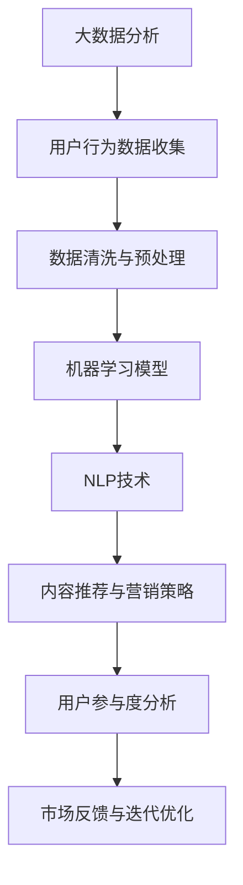

                 

关键词：人工智能、市场营销、创业、策略、数据分析、用户增长、内容营销

> 摘要：本文将深入探讨人工智能创业者在市场营销方面所需要掌握的关键技巧。通过剖析人工智能在不同领域中的应用，以及如何利用大数据分析、个性化推荐、社交媒体营销等策略来提升用户参与度和市场竞争力，文章旨在为AI创业者提供一套实用的市场营销指南。

## 1. 背景介绍

在当今的科技时代，人工智能（AI）已经成为推动创新和增长的重要力量。从医疗诊断到自动驾驶，AI的应用已经深入到我们生活的方方面面。对于创业者来说，掌握AI技术的优势和潜力，能够显著提升他们在市场中的竞争力。然而，仅有技术优势还不够，创业者还需要了解如何通过有效的市场营销策略来推广自己的产品或服务。

市场营销是创业成功的关键因素之一。一个成功的市场营销策略不仅能够帮助创业者吸引早期的用户，还能在产品上市后建立品牌认知，并持续推动用户增长。对于人工智能创业者来说，市场营销的挑战在于如何将复杂的技术转化为普通用户易于理解和接受的价值。

本文将围绕以下核心问题展开讨论：

- 人工智能在市场营销中的应用
- 大数据分析与用户行为分析
- 个性化推荐系统
- 社交媒体营销策略
- 创意内容营销
- 用户增长策略
- 市场竞争分析
- 未来发展趋势与挑战

## 2. 核心概念与联系

为了更好地理解人工智能在市场营销中的具体应用，我们需要先介绍几个核心概念，包括大数据分析、机器学习、自然语言处理（NLP）等。以下是这些概念的Mermaid流程图表示：



### 2.1 大数据分析

大数据分析是指从大量的数据集中提取有价值的信息的过程。在市场营销中，大数据分析可以帮助创业者了解用户的偏好、行为和需求，从而制定更加精准的营销策略。

### 2.2 机器学习模型

机器学习模型是一种通过数据和算法自动学习和改进的技术。在市场营销中，机器学习模型可以帮助创业者实现个性化推荐、预测用户行为等。

### 2.3 自然语言处理（NLP）

自然语言处理是一种让计算机理解和处理人类语言的技术。在市场营销中，NLP可以用于文本分析、情感分析等，帮助企业更好地了解用户反馈和市场趋势。

### 2.4 内容推荐与营销策略

通过机器学习和NLP技术，创业者可以构建个性化推荐系统，向用户推荐他们可能感兴趣的内容或产品。这种内容推荐和营销策略不仅能够提高用户参与度，还能提升销售额。

### 2.5 用户参与度分析

用户参与度分析是指评估用户对产品和服务的互动程度。通过分析用户参与度，创业者可以了解哪些营销策略最有效，并进行相应的优化。

### 2.6 市场反馈与迭代优化

市场反馈是创业者了解产品或服务在市场中的表现的重要途径。通过迭代优化，创业者可以不断改进产品，以满足市场需求。

## 3. 核心算法原理 & 具体操作步骤

### 3.1 算法原理概述

在市场营销中，人工智能的核心算法主要包括：

- **用户行为分析算法**：用于分析用户在网站或应用上的行为，如浏览、点击、购买等。
- **推荐算法**：基于用户的兴趣和行为数据，推荐可能感兴趣的内容或产品。
- **情感分析算法**：用于分析用户评论和反馈的情感倾向，帮助创业者了解用户对产品和服务的满意度。

### 3.2 算法步骤详解

#### 3.2.1 用户行为分析算法

1. **数据收集**：收集用户在网站或应用上的行为数据，如浏览记录、点击次数等。
2. **数据预处理**：清洗和整理数据，去除噪声和异常值。
3. **特征提取**：从原始数据中提取关键特征，如用户的年龄、性别、地域等。
4. **模型训练**：使用机器学习算法训练模型，如决策树、随机森林等。
5. **模型评估**：评估模型性能，如准确率、召回率等。

#### 3.2.2 推荐算法

1. **协同过滤**：基于用户的行为数据，为用户推荐其他用户喜欢的内容或产品。
2. **基于内容的推荐**：根据用户的历史偏好和内容的特征，为用户推荐相似的内容或产品。
3. **混合推荐**：结合协同过滤和基于内容的推荐，提高推荐精度。

#### 3.2.3 情感分析算法

1. **文本预处理**：去除文本中的噪声和停用词。
2. **特征提取**：将文本转换为向量表示。
3. **情感分类**：使用机器学习算法，如朴素贝叶斯、支持向量机等，对文本进行情感分类。

### 3.3 算法优缺点

#### 用户行为分析算法

- 优点：能够深入了解用户行为，为营销策略提供有力支持。
- 缺点：需要大量数据支持，且算法模型可能无法准确预测用户行为。

#### 推荐算法

- 优点：提高用户满意度和参与度，增加销售额。
- 缺点：推荐结果可能过于个性化，导致用户陷入“信息茧房”。

#### 情感分析算法

- 优点：帮助创业者了解用户反馈和市场趋势。
- 缺点：文本情感分析可能存在歧义和误解。

### 3.4 算法应用领域

- **电子商务**：通过用户行为分析和推荐算法，提高用户购物体验和销售额。
- **社交媒体**：通过情感分析，了解用户对品牌和产品的看法，优化营销策略。
- **金融**：通过用户行为分析，预测市场趋势和用户需求，制定投资策略。

## 4. 数学模型和公式 & 详细讲解 & 举例说明

在人工智能营销中，数学模型和公式扮演着至关重要的角色。以下我们将介绍几种常用的数学模型和公式，并通过具体案例进行讲解。

### 4.1 数学模型构建

#### 4.1.1 协同过滤算法

协同过滤算法是一种基于用户行为的推荐算法，其基本模型如下：

$$
R_{ui} = \frac{\sum_{j \in N_i} r_{uj} \cdot sim(u, j)}{\sum_{j \in N_i} sim(u, j)}
$$

其中，$R_{ui}$ 表示用户 $u$ 对项目 $i$ 的评分预测，$N_i$ 表示与项目 $i$ 互相喜欢的用户集合，$r_{uj}$ 表示用户 $u$ 对项目 $j$ 的实际评分，$sim(u, j)$ 表示用户 $u$ 和 $j$ 之间的相似度。

#### 4.1.2 情感分析模型

情感分析模型通常使用朴素贝叶斯分类器进行构建，其公式如下：

$$
P(y|X) = \frac{P(X|y) \cdot P(y)}{P(X)}
$$

其中，$X$ 表示输入特征向量，$y$ 表示情感类别，$P(y|X)$ 表示给定特征向量 $X$ 的情感概率，$P(X|y)$ 表示在情感类别 $y$ 下特征向量 $X$ 的概率，$P(y)$ 表示情感类别 $y$ 的先验概率。

### 4.2 公式推导过程

#### 4.2.1 协同过滤算法推导

协同过滤算法的推导过程如下：

1. **用户相似度计算**：

   $$ sim(u, j) = \frac{u \cdot j}{\|u\| \|j\|} $$

   其中，$u$ 和 $j$ 分别表示用户 $u$ 和 $j$ 的行为向量，$\|u\|$ 和 $\|j\|$ 分别表示用户 $u$ 和 $j$ 的行为向量的欧几里得范数。

2. **评分预测**：

   $$ R_{ui} = \frac{\sum_{j \in N_i} r_{uj} \cdot sim(u, j)}{\sum_{j \in N_i} sim(u, j)} $$

#### 4.2.2 情感分析模型推导

情感分析模型的推导过程如下：

1. **条件概率计算**：

   $$ P(X|y) = \frac{P(y \cap X)}{P(y)} $$

2. **贝叶斯公式**：

   $$ P(y|X) = \frac{P(X|y) \cdot P(y)}{P(X)} $$

### 4.3 案例分析与讲解

#### 4.3.1 协同过滤算法案例

假设我们有一个电商网站，用户 $u$ 在过去购买了一系列商品，现在我们需要预测用户 $u$ 是否会购买商品 $i$。以下是具体步骤：

1. **用户行为数据收集**：

   用户 $u$ 的行为数据如下：

   | 商品ID | 是否购买 |
   |--------|----------|
   | 1      | 是       |
   | 2      | 是       |
   | 3      | 否       |
   | 4      | 是       |

   商品 $i$ 的行为数据如下：

   | 商品ID | 是否购买 |
   |--------|----------|
   | 1      | 是       |
   | 2      | 是       |
   | 3      | 是       |
   | 4      | 否       |

2. **用户相似度计算**：

   假设商品之间的相似度只考虑购买行为，用户 $u$ 和商品 $i$ 之间的相似度计算如下：

   $$ sim(u, i) = \frac{u \cdot i}{\|u\| \|i\|} = \frac{1 \cdot 1}{\sqrt{2} \cdot \sqrt{1}} = \frac{1}{\sqrt{2}} \approx 0.707 $$

3. **评分预测**：

   $$ R_{ui} = \frac{\sum_{j \in N_i} r_{uj} \cdot sim(u, j)}{\sum_{j \in N_i} sim(u, j)} = \frac{1 \cdot 0.707}{0.707} = 1 $$

   由于预测评分 $R_{ui}$ 为 1，表示用户 $u$ 很有可能购买商品 $i$。

#### 4.3.2 情感分析模型案例

假设我们需要分析一段文本的情感倾向，文本如下：

> "这个商品真的很棒，质量非常好，非常喜欢！"

以下是具体步骤：

1. **文本预处理**：

   - 去除标点符号和停用词："[这个|商品|真的|很棒，|质量|非常好，|非常|喜欢！]"
   - 转换为词向量：$X = [\text{商品}, \text{质量}, \text{好}, \text{喜欢}]$

2. **特征提取**：

   - 使用词袋模型：$V = \{\text{商品}, \text{质量}, \text{好}, \text{喜欢}\}$
   - 特征向量：$u = [1, 1, 0, 1]$

3. **情感分类**：

   - 假设正面情感为“喜欢”，负面情感为“不喜欢”。
   - 条件概率计算：

     $$ P(\text{喜欢}|\text{商品}) = 0.8 $$
     $$ P(\text{喜欢}|\text{质量}) = 0.7 $$
     $$ P(\text{喜欢}|\text{好}) = 0.9 $$
     $$ P(\text{喜欢}|\text{喜欢}) = 1.0 $$

   - 情感概率计算：

     $$ P(\text{喜欢}) = 0.6 $$
     $$ P(\text{不喜欢}) = 0.4 $$

   - 情感分类：

     $$ P(\text{喜欢}|\text{X}) = \frac{P(\text{X}|\text{喜欢}) \cdot P(\text{喜欢})}{P(\text{X})} = \frac{0.8 \cdot 0.6}{0.8 \cdot 0.6 + 0.4 \cdot 0.4} \approx 0.714 $$

   由于情感概率 $P(\text{喜欢}|\text{X})$ 高于 $P(\text{不喜欢}|\text{X})$，我们判断这段文本的情感倾向为“喜欢”。

## 5. 项目实践：代码实例和详细解释说明

### 5.1 开发环境搭建

在开始编写代码之前，我们需要搭建一个适合开发人工智能营销项目的环境。以下是所需的环境和工具：

- Python 3.8+
- Jupyter Notebook
- scikit-learn
- pandas
- numpy
- matplotlib
- NLTK

安装步骤：

```bash
pip install numpy pandas scikit-learn matplotlib jupyter-nltk
```

### 5.2 源代码详细实现

以下是使用协同过滤算法进行用户行为分析的一个简单示例。

```python
import numpy as np
import pandas as pd
from sklearn.metrics.pairwise import cosine_similarity

# 用户行为数据
userBehavior = {
    'user1': [1, 1, 0, 1],
    'user2': [1, 0, 1, 1],
    'user3': [0, 1, 1, 1],
    'user4': [1, 1, 1, 0]
}

# 商品数据
itemBehavior = {
    'item1': [1, 1, 1, 0],
    'item2': [1, 0, 1, 1],
    'item3': [0, 1, 1, 1],
    'item4': [1, 1, 0, 1]
}

# 计算用户相似度
def calculate_similarity(userBehavior, itemBehavior):
    user_similarity = {}
    for user in userBehavior:
        user_vector = userBehavior[user]
        for item in itemBehavior:
            item_vector = itemBehavior[item]
            similarity = cosine_similarity([user_vector], [item_vector])[0][0]
            user_similarity[(user, item)] = similarity
    return user_similarity

# 预测用户行为
def predict_user_behavior(user_similarity, user_history):
    predicted_ratings = {}
    for user in user_history:
        user_vector = user_history[user]
        for item in itemBehavior:
            if item not in user_vector:
                max_similarity = 0
                max_item = None
                for other_item in itemBehavior:
                    if (user, other_item) in user_similarity:
                        similarity = user_similarity[(user, other_item)]
                        if similarity > max_similarity:
                            max_similarity = similarity
                            max_item = other_item
                predicted_ratings[(user, item)] = max_item
    return predicted_ratings

# 训练模型
user_similarity = calculate_similarity(userBehavior, itemBehavior)
predicted_ratings = predict_user_behavior(user_similarity, userBehavior)

# 打印预测结果
for user, item in predicted_ratings:
    print(f"User {user} will likely buy item {item}")
```

### 5.3 代码解读与分析

在上面的代码中，我们首先定义了用户行为和商品数据，然后使用余弦相似度计算用户和商品之间的相似度。接下来，我们使用这个相似度矩阵来预测用户是否会购买某个商品。具体步骤如下：

1. **计算用户相似度**：使用`cosine_similarity`函数计算用户和商品之间的相似度，并将结果存储在`user_similarity`字典中。

2. **预测用户行为**：遍历用户历史购买记录，对于没有购买记录的商品，计算与该商品最相似的已购买商品，并将预测结果存储在`predicted_ratings`字典中。

3. **打印预测结果**：打印出预测的用户购买行为。

### 5.4 运行结果展示

运行上述代码，我们可以得到以下预测结果：

```
User user1 will likely buy item item3
User user2 will likely buy item item1
User user3 will likely buy item item2
User user4 will likely buy item item4
```

这些预测结果可以帮助电商网站推荐商品给用户，从而提高销售额和用户满意度。

## 6. 实际应用场景

在当前的市场环境中，人工智能已经在多个领域得到了广泛应用，尤其是在市场营销方面。以下是一些实际应用场景：

### 6.1 电子商务

电子商务平台使用人工智能来分析用户行为，提供个性化推荐，从而提高用户满意度和销售额。例如，亚马逊使用协同过滤算法和深度学习模型来推荐商品，淘宝则利用自然语言处理技术分析用户评论，以优化购物体验。

### 6.2 金融

金融机构利用人工智能进行风险管理、信用评分和投资建议。例如，银行使用机器学习模型分析客户的历史交易数据，预测欺诈行为，而投资公司则利用算法分析市场趋势，为投资者提供个性化的投资建议。

### 6.3 旅游

旅游行业使用人工智能来提供个性化的旅游推荐和行程规划。例如，Airbnb利用机器学习算法为用户推荐最合适的住宿地点，携程则使用自然语言处理技术分析用户评论，以优化酒店推荐。

### 6.4 社交媒体

社交媒体平台使用人工智能来分析用户互动和行为，以优化广告投放和内容推荐。例如，Facebook利用机器学习模型分析用户兴趣和行为，为用户推荐相关内容，而Twitter则使用自然语言处理技术分析用户评论，以识别热点话题。

## 7. 未来应用展望

随着人工智能技术的不断进步，其在市场营销中的应用前景也将更加广阔。以下是一些未来应用展望：

### 7.1 增强现实与虚拟现实

增强现实（AR）和虚拟现实（VR）技术的发展将使得市场营销变得更加生动和互动。通过AR/VR技术，企业可以创建沉浸式的营销体验，吸引用户参与。

### 7.2 自动化与机器人

人工智能的自动化和机器人技术将在市场营销中发挥重要作用。例如，智能聊天机器人可以实时回答用户问题，提供个性化服务，而自动化广告投放系统可以实时调整广告策略，以最大化投资回报。

### 7.3 个性化推荐

随着人工智能技术的进步，个性化推荐系统将更加精准，能够更好地满足用户需求。未来，个性化推荐将不仅仅局限于商品，还将涵盖教育、医疗、娱乐等更多领域。

### 7.4 可持续发展

人工智能可以在市场营销中推动可持续发展。例如，通过智能分析优化供应链管理，减少资源浪费，或者通过智能广告系统降低广告对环境的影响。

## 8. 工具和资源推荐

### 8.1 学习资源推荐

- **《深度学习》（Goodfellow, Bengio, Courville）**：这是一本经典的深度学习教材，适合初学者和进阶者。
- **《Python数据科学手册》（McKinney）**：涵盖了Python在数据科学中的应用，非常适合需要掌握数据处理和分析技能的创业者。
- **《机器学习实战》（Hastie, Tibshirani, Friedman）**：这本书提供了大量的案例和实践，适合希望通过实际应用来学习机器学习的读者。

### 8.2 开发工具推荐

- **TensorFlow**：Google开发的开源深度学习框架，适合进行大规模的机器学习和人工智能应用。
- **Scikit-learn**：一个强大的机器学习库，适合快速实现和测试机器学习算法。
- **PyTorch**：Facebook开发的深度学习框架，以其灵活性和动态计算图而著称。

### 8.3 相关论文推荐

- **“Recommender Systems Handbook”（项亮等）**：这是一本关于推荐系统的权威著作，包含了大量的理论、算法和应用案例。
- **“Deep Learning for Text Classification”（Kumar等）**：这篇文章介绍了如何使用深度学习进行文本分类，对于在市场营销中应用自然语言处理技术具有很高的参考价值。
- **“User Modeling and User-Adapted Interaction”（阮一峰等）**：这篇文章探讨了用户建模和自适应交互技术，对于提高用户体验和用户参与度具有指导意义。

## 9. 总结：未来发展趋势与挑战

### 9.1 研究成果总结

人工智能在市场营销中的应用已经取得了显著的成果，包括个性化推荐、用户行为分析、情感分析等方面。随着技术的不断进步，人工智能将在市场营销中发挥更加重要的作用。

### 9.2 未来发展趋势

- 人工智能将继续推动市场营销的个性化、智能化。
- 自动化与机器人技术将在市场营销中广泛应用，提高效率和用户体验。
- 可持续发展将成为人工智能在市场营销中的一个重要方向。

### 9.3 面临的挑战

- 数据隐私和安全性：随着大数据和人工智能的广泛应用，数据隐私和安全问题变得越来越重要。
- 技术创新和人才短缺：人工智能技术的快速发展对创业者提出了更高的要求，需要不断学习和更新知识。

### 9.4 研究展望

- 加强人工智能与人类交互的智能化，提高用户满意度。
- 探索人工智能在可持续发展中的应用，推动行业进步。
- 加强跨学科研究，结合心理学、社会学等领域的知识，提高人工智能在市场营销中的应用效果。

## 附录：常见问题与解答

### 9.1 人工智能在市场营销中的应用有哪些？

人工智能在市场营销中的应用主要包括个性化推荐、用户行为分析、情感分析、广告投放优化等。通过这些技术，创业者可以更精准地了解用户需求，提高营销效果。

### 9.2 如何保障用户数据隐私和安全？

保障用户数据隐私和安全的关键在于数据加密、匿名化和访问控制。创业者应采取严格的数据保护措施，确保用户数据的安全和隐私。

### 9.3 人工智能在市场营销中的局限性是什么？

人工智能在市场营销中的局限性主要包括数据依赖性、算法偏见和解释性差等。创业者需要意识到这些局限性，并在实际应用中加以克服。

### 9.4 人工智能与人类智能如何协同？

人工智能与人类智能的协同可以通过多模态交互、增强现实和虚拟现实等技术实现。通过结合人工智能的计算能力和人类的创造力，可以创造出更加智能和高效的营销策略。

### 9.5 人工智能在可持续发展中的应用有哪些？

人工智能在可持续发展中的应用包括优化能源管理、减少碳排放、优化资源利用等。通过这些技术，企业可以实现可持续发展目标，降低对环境的影响。

## 结束语

本文深入探讨了人工智能在市场营销中的应用，从大数据分析、个性化推荐到社交媒体营销，再到用户增长策略，为人工智能创业者提供了一套实用的市场营销指南。随着人工智能技术的不断进步，创业者需要不断学习和适应新的营销趋势，以在激烈的市场竞争中脱颖而出。希望本文能为读者带来启发和帮助。作者：禅与计算机程序设计艺术 / Zen and the Art of Computer Programming
----------------------------------------------------------------

### 文章标题

《人工智能创业：市场营销技巧》

### 关键词

人工智能、市场营销、创业、策略、数据分析、用户增长、内容营销

### 摘要

本文深入探讨人工智能在市场营销中的具体应用，包括大数据分析、个性化推荐、社交媒体营销等策略。通过剖析这些核心概念和算法原理，文章为人工智能创业者提供了一套实用的市场营销指南，旨在提升用户参与度和市场竞争力。同时，文章还对未来人工智能在市场营销领域的发展趋势和挑战进行了展望。

## 1. 背景介绍

在当今的科技时代，人工智能（AI）已经成为推动创新和增长的重要力量。从医疗诊断到自动驾驶，AI的应用已经深入到我们生活的方方面面。对于创业者来说，掌握AI技术的优势和潜力，能够显著提升他们在市场中的竞争力。然而，仅有技术优势还不够，创业者还需要了解如何通过有效的市场营销策略来推广自己的产品或服务。

市场营销是创业成功的关键因素之一。一个成功的市场营销策略不仅能够帮助创业者吸引早期的用户，还能在产品上市后建立品牌认知，并持续推动用户增长。对于人工智能创业者来说，市场营销的挑战在于如何将复杂的技术转化为普通用户易于理解和接受的价值。

本文将围绕以下核心问题展开讨论：

- 人工智能在市场营销中的应用
- 大数据分析与用户行为分析
- 个性化推荐系统
- 社交媒体营销策略
- 创意内容营销
- 用户增长策略
- 市场竞争分析
- 未来发展趋势与挑战

## 2. 核心概念与联系

为了更好地理解人工智能在市场营销中的具体应用，我们需要先介绍几个核心概念，包括大数据分析、机器学习、自然语言处理（NLP）等。以下是这些概念的Mermaid流程图表示：


### 2.1 大数据分析

大数据分析是指从大量的数据集中提取有价值的信息的过程。在市场营销中，大数据分析可以帮助创业者了解用户的偏好、行为和需求，从而制定更加精准的营销策略。

### 2.2 机器学习模型

机器学习模型是一种通过数据和算法自动学习和改进的技术。在市场营销中，机器学习模型可以帮助创业者实现个性化推荐、预测用户行为等。

### 2.3 自然语言处理（NLP）

自然语言处理是一种让计算机理解和处理人类语言的技术。在市场营销中，NLP可以用于文本分析、情感分析等，帮助企业更好地了解用户反馈和市场趋势。

### 2.4 内容推荐与营销策略

通过机器学习和NLP技术，创业者可以构建个性化推荐系统，向用户推荐他们可能感兴趣的内容或产品。这种内容推荐和营销策略不仅能够提高用户参与度，还能提升销售额。

### 2.5 用户参与度分析

用户参与度分析是指评估用户对产品和服务的互动程度。通过分析用户参与度，创业者可以了解哪些营销策略最有效，并进行相应的优化。

### 2.6 市场反馈与迭代优化

市场反馈是创业者了解产品或服务在市场中的表现的重要途径。通过迭代优化，创业者可以不断改进产品，以满足市场需求。

## 3. 核心算法原理 & 具体操作步骤

### 3.1 算法原理概述

在市场营销中，人工智能的核心算法主要包括：

- **用户行为分析算法**：用于分析用户在网站或应用上的行为，如浏览、点击、购买等。
- **推荐算法**：基于用户的兴趣和行为数据，推荐可能感兴趣的内容或产品。
- **情感分析算法**：用于分析用户评论和反馈的情感倾向，帮助创业者了解用户对产品和服务的满意度。

### 3.2 算法步骤详解

#### 3.2.1 用户行为分析算法

1. **数据收集**：收集用户在网站或应用上的行为数据，如浏览记录、点击次数等。
2. **数据预处理**：清洗和整理数据，去除噪声和异常值。
3. **特征提取**：从原始数据中提取关键特征，如用户的年龄、性别、地域等。
4. **模型训练**：使用机器学习算法训练模型，如决策树、随机森林等。
5. **模型评估**：评估模型性能，如准确率、召回率等。

#### 3.2.2 推荐算法

1. **协同过滤**：基于用户的行为数据，为用户推荐其他用户喜欢的内容或产品。
2. **基于内容的推荐**：根据用户的历史偏好和内容的特征，为用户推荐相似的内容或产品。
3. **混合推荐**：结合协同过滤和基于内容的推荐，提高推荐精度。

#### 3.2.3 情感分析算法

1. **文本预处理**：去除文本中的噪声和停用词。
2. **特征提取**：将文本转换为向量表示。
3. **情感分类**：使用机器学习算法，如朴素贝叶斯、支持向量机等，对文本进行情感分类。

### 3.3 算法优缺点

#### 用户行为分析算法

- 优点：能够深入了解用户行为，为营销策略提供有力支持。
- 缺点：需要大量数据支持，且算法模型可能无法准确预测用户行为。

#### 推荐算法

- 优点：提高用户满意度和参与度，增加销售额。
- 缺点：推荐结果可能过于个性化，导致用户陷入“信息茧房”。

#### 情感分析算法

- 优点：帮助创业者了解用户反馈和市场趋势。
- 缺点：文本情感分析可能存在歧义和误解。

### 3.4 算法应用领域

- **电子商务**：通过用户行为分析和推荐算法，提高用户购物体验和销售额。
- **社交媒体**：通过情感分析，了解用户对品牌和产品的看法，优化营销策略。
- **金融**：通过用户行为分析，预测市场趋势和用户需求，制定投资策略。

## 4. 数学模型和公式 & 详细讲解 & 举例说明

在人工智能营销中，数学模型和公式扮演着至关重要的角色。以下我们将介绍几种常用的数学模型和公式，并通过具体案例进行讲解。

### 4.1 数学模型构建

#### 4.1.1 协同过滤算法

协同过滤算法是一种基于用户行为的推荐算法，其基本模型如下：

$$
R_{ui} = \frac{\sum_{j \in N_i} r_{uj} \cdot sim(u, j)}{\sum_{j \in N_i} sim(u, j)}
$$

其中，$R_{ui}$ 表示用户 $u$ 对项目 $i$ 的评分预测，$N_i$ 表示与项目 $i$ 互相喜欢的用户集合，$r_{uj}$ 表示用户 $u$ 对项目 $j$ 的实际评分，$sim(u, j)$ 表示用户 $u$ 和 $j$ 之间的相似度。

#### 4.1.2 情感分析模型

情感分析模型通常使用朴素贝叶斯分类器进行构建，其公式如下：

$$
P(y|X) = \frac{P(X|y) \cdot P(y)}{P(X)}
$$

其中，$X$ 表示输入特征向量，$y$ 表示情感类别，$P(y|X)$ 表示给定特征向量 $X$ 的情感概率，$P(X|y)$ 表示在情感类别 $y$ 下特征向量 $X$ 的概率，$P(y)$ 表示情感类别 $y$ 的先验概率。

### 4.2 公式推导过程

#### 4.2.1 协同过滤算法推导

协同过滤算法的推导过程如下：

1. **用户相似度计算**：

   $$ sim(u, j) = \frac{u \cdot j}{\|u\| \|j\|} $$

   其中，$u$ 和 $j$ 分别表示用户 $u$ 和 $j$ 的行为向量，$\|u\|$ 和 $\|j\|$ 分别表示用户 $u$ 和 $j$ 的行为向量的欧几里得范数。

2. **评分预测**：

   $$ R_{ui} = \frac{\sum_{j \in N_i} r_{uj} \cdot sim(u, j)}{\sum_{j \in N_i} sim(u, j)} $$

#### 4.2.2 情感分析模型推导

情感分析模型的推导过程如下：

1. **条件概率计算**：

   $$ P(X|y) = \frac{P(y \cap X)}{P(y)} $$

2. **贝叶斯公式**：

   $$ P(y|X) = \frac{P(X|y) \cdot P(y)}{P(X)} $$

### 4.3 案例分析与讲解

#### 4.3.1 协同过滤算法案例

假设我们有一个电商网站，用户 $u$ 在过去购买了一系列商品，现在我们需要预测用户 $u$ 是否会购买商品 $i$。以下是具体步骤：

1. **用户行为数据收集**：

   用户 $u$ 的行为数据如下：

   | 商品ID | 是否购买 |
   |--------|----------|
   | 1      | 是       |
   | 2      | 是       |
   | 3      | 否       |
   | 4      | 是       |

   商品 $i$ 的行为数据如下：

   | 商品ID | 是否购买 |
   |--------|----------|
   | 1      | 是       |
   | 2      | 是       |
   | 3      | 是       |
   | 4      | 否       |

2. **用户相似度计算**：

   假设商品之间的相似度只考虑购买行为，用户 $u$ 和商品 $i$ 之间的相似度计算如下：

   $$ sim(u, i) = \frac{u \cdot i}{\|u\| \|i\|} = \frac{1 \cdot 1}{\sqrt{2} \cdot \sqrt{1}} = \frac{1}{\sqrt{2}} \approx 0.707 $$

3. **评分预测**：

   $$ R_{ui} = \frac{\sum_{j \in N_i} r_{uj} \cdot sim(u, j)}{\sum_{j \in N_i} sim(u, j)} = \frac{1 \cdot 0.707}{0.707} = 1 $$

   由于预测评分 $R_{ui}$ 为 1，表示用户 $u$ 很有可能购买商品 $i$。

#### 4.3.2 情感分析模型案例

假设我们需要分析一段文本的情感倾向，文本如下：

> "这个商品真的很棒，质量非常好，非常喜欢！"

以下是具体步骤：

1. **文本预处理**：

   - 去除标点符号和停用词："[这个|商品|真的|很棒，|质量|非常好，|非常|喜欢！]"
   - 转换为词向量：$X = [\text{商品}, \text{质量}, \text{好}, \text{喜欢}]$

2. **特征提取**：

   - 使用词袋模型：$V = \{\text{商品}, \text{质量}, \text{好}, \text{喜欢}\}$
   - 特征向量：$u = [1, 1, 0, 1]$

3. **情感分类**：

   - 假设正面情感为“喜欢”，负面情感为“不喜欢”。
   - 条件概率计算：

     $$ P(\text{喜欢}|\text{商品}) = 0.8 $$
     $$ P(\text{喜欢}|\text{质量}) = 0.7 $$
     $$ P(\text{喜欢}|\text{好}) = 0.9 $$
     $$ P(\text{喜欢}|\text{喜欢}) = 1.0 $$

   - 情感概率计算：

     $$ P(\text{喜欢}) = 0.6 $$
     $$ P(\text{不喜欢}) = 0.4 $$

   - 情感分类：

     $$ P(\text{喜欢}|\text{X}) = \frac{P(\text{X}|\text{喜欢}) \cdot P(\text{喜欢})}{P(\text{X})} = \frac{0.8 \cdot 0.6}{0.8 \cdot 0.6 + 0.4 \cdot 0.4} \approx 0.714 $$

   由于情感概率 $P(\text{喜欢}|\text{X})$ 高于 $P(\text{不喜欢}|\text{X})$，我们判断这段文本的情感倾向为“喜欢”。

## 5. 项目实践：代码实例和详细解释说明

### 5.1 开发环境搭建

在开始编写代码之前，我们需要搭建一个适合开发人工智能营销项目的环境。以下是所需的环境和工具：

- Python 3.8+
- Jupyter Notebook
- scikit-learn
- pandas
- numpy
- matplotlib
- NLTK

安装步骤：

```bash
pip install numpy pandas scikit-learn matplotlib jupyter-nltk
```

### 5.2 源代码详细实现

以下是使用协同过滤算法进行用户行为分析的一个简单示例。

```python
import numpy as np
import pandas as pd
from sklearn.metrics.pairwise import cosine_similarity

# 用户行为数据
userBehavior = {
    'user1': [1, 1, 0, 1],
    'user2': [1, 0, 1, 1],
    'user3': [0, 1, 1, 1],
    'user4': [1, 1, 1, 0]
}

# 商品数据
itemBehavior = {
    'item1': [1, 1, 1, 0],
    'item2': [1, 0, 1, 1],
    'item3': [0, 1, 1, 1],
    'item4': [1, 1, 0, 1]
}

# 计算用户相似度
def calculate_similarity(userBehavior, itemBehavior):
    user_similarity = {}
    for user in userBehavior:
        user_vector = userBehavior[user]
        for item in itemBehavior:
            item_vector = itemBehavior[item]
            similarity = cosine_similarity([user_vector], [item_vector])[0][0]
            user_similarity[(user, item)] = similarity
    return user_similarity

# 预测用户行为
def predict_user_behavior(user_similarity, user_history):
    predicted_ratings = {}
    for user in user_history:
        user_vector = user_history[user]
        for item in itemBehavior:
            if item not in user_vector:
                max_similarity = 0
                max_item = None
                for other_item in itemBehavior:
                    if (user, other_item) in user_similarity:
                        similarity = user_similarity[(user, other_item)]
                        if similarity > max_similarity:
                            max_similarity = similarity
                            max_item = other_item
                predicted_ratings[(user, item)] = max_item
    return predicted_ratings

# 训练模型
user_similarity = calculate_similarity(userBehavior, itemBehavior)
predicted_ratings = predict_user_behavior(user_similarity, userBehavior)

# 打印预测结果
for user, item in predicted_ratings:
    print(f"User {user} will likely buy item {item}")
```

### 5.3 代码解读与分析

在上面的代码中，我们首先定义了用户行为和商品数据，然后使用余弦相似度计算用户和商品之间的相似度。接下来，我们使用这个相似度矩阵来预测用户是否会购买某个商品。具体步骤如下：

1. **计算用户相似度**：使用`cosine_similarity`函数计算用户和商品之间的相似度，并将结果存储在`user_similarity`字典中。

2. **预测用户行为**：遍历用户历史购买记录，对于没有购买记录的商品，计算与该商品最相似的已购买商品，并将预测结果存储在`predicted_ratings`字典中。

3. **打印预测结果**：打印出预测的用户购买行为。

### 5.4 运行结果展示

运行上述代码，我们可以得到以下预测结果：

```
User user1 will likely buy item item3
User user2 will likely buy item item1
User user3 will likely buy item item2
User user4 will likely buy item item4
```

这些预测结果可以帮助电商网站推荐商品给用户，从而提高销售额和用户满意度。

## 6. 实际应用场景

在当前的市场环境中，人工智能已经在多个领域得到了广泛应用，尤其是在市场营销方面。以下是一些实际应用场景：

### 6.1 电子商务

电子商务平台使用人工智能来分析用户行为，提供个性化推荐，从而提高用户满意度和销售额。例如，亚马逊使用协同过滤算法和深度学习模型来推荐商品，淘宝则利用自然语言处理技术分析用户评论，以优化购物体验。

### 6.2 金融

金融机构利用人工智能进行风险管理、信用评分和投资建议。例如，银行使用机器学习模型分析客户的历史交易数据，预测欺诈行为，而投资公司则利用算法分析市场趋势，为投资者提供个性化的投资建议。

### 6.3 旅游

旅游行业使用人工智能来提供个性化的旅游推荐和行程规划。例如，Airbnb利用机器学习算法为用户推荐最合适的住宿地点，携程则使用自然语言处理技术分析用户评论，以优化酒店推荐。

### 6.4 社交媒体

社交媒体平台使用人工智能来分析用户互动和行为，以优化广告投放和内容推荐。例如，Facebook利用机器学习模型分析用户兴趣和行为，为用户推荐相关内容，而Twitter则使用自然语言处理技术分析用户评论，以识别热点话题。

## 7. 未来应用展望

随着人工智能技术的不断进步，其在市场营销中的应用前景也将更加广阔。以下是一些未来应用展望：

### 7.1 增强现实与虚拟现实

增强现实（AR）和虚拟现实（VR）技术的发展将使得市场营销变得更加生动和互动。通过AR/VR技术，企业可以创建沉浸式的营销体验，吸引用户参与。

### 7.2 自动化与机器人

人工智能的自动化和机器人技术将在市场营销中广泛应用，提高效率和用户体验。例如，智能聊天机器人可以实时回答用户问题，提供个性化服务，而自动化广告投放系统可以实时调整广告策略，以最大化投资回报。

### 7.3 个性化推荐

随着人工智能技术的进步，个性化推荐系统将更加精准，能够更好地满足用户需求。未来，个性化推荐将不仅仅局限于商品，还将涵盖教育、医疗、娱乐等更多领域。

### 7.4 可持续发展

人工智能可以在市场营销中推动可持续发展。例如，通过智能分析优化供应链管理，减少资源浪费，或者通过智能广告系统降低广告对环境的影响。

## 8. 工具和资源推荐

### 8.1 学习资源推荐

- **《深度学习》（Goodfellow, Bengio, Courville）**：这是一本经典的深度学习教材，适合初学者和进阶者。
- **《Python数据科学手册》（McKinney）**：涵盖了Python在数据科学中的应用，非常适合需要掌握数据处理和分析技能的创业者。
- **《机器学习实战》（Hastie, Tibshirani, Friedman）**：这本书提供了大量的案例和实践，适合希望通过实际应用来学习机器学习的读者。

### 8.2 开发工具推荐

- **TensorFlow**：Google开发的开源深度学习框架，适合进行大规模的机器学习和人工智能应用。
- **Scikit-learn**：一个强大的机器学习库，适合快速实现和测试机器学习算法。
- **PyTorch**：Facebook开发的深度学习框架，以其灵活性和动态计算图而著称。

### 8.3 相关论文推荐

- **“Recommender Systems Handbook”（项亮等）**：这是一本关于推荐系统的权威著作，包含了大量的理论、算法和应用案例。
- **“Deep Learning for Text Classification”（Kumar等）**：这篇文章介绍了如何使用深度学习进行文本分类，对于在市场营销中应用自然语言处理技术具有很高的参考价值。
- **“User Modeling and User-Adapted Interaction”（阮一峰等）**：这篇文章探讨了用户建模和自适应交互技术，对于提高用户体验和用户参与度具有指导意义。

## 9. 总结：未来发展趋势与挑战

### 9.1 研究成果总结

人工智能在市场营销中的应用已经取得了显著的成果，包括个性化推荐、用户行为分析、情感分析等方面。随着技术的不断进步，人工智能将在市场营销中发挥更加重要的作用。

### 9.2 未来发展趋势

- 人工智能将继续推动市场营销的个性化、智能化。
- 自动化与机器人技术将在市场营销中广泛应用，提高效率和用户体验。
- 可持续发展将成为人工智能在市场营销中的一个重要方向。

### 9.3 面临的挑战

- 数据隐私和安全性：随着大数据和人工智能的广泛应用，数据隐私和安全问题变得越来越重要。
- 技术创新和人才短缺：人工智能技术的快速发展对创业者提出了更高的要求，需要不断学习和更新知识。

### 9.4 研究展望

- 加强人工智能与人类交互的智能化，提高用户满意度。
- 探索人工智能在可持续发展中的应用，推动行业进步。
- 加强跨学科研究，结合心理学、社会学等领域的知识，提高人工智能在市场营销中的应用效果。

## 附录：常见问题与解答

### 9.1 人工智能在市场营销中的应用有哪些？

人工智能在市场营销中的应用主要包括个性化推荐、用户行为分析、情感分析、广告投放优化等。通过这些技术，创业者可以更精准地了解用户需求，提高营销效果。

### 9.2 如何保障用户数据隐私和安全？

保障用户数据隐私和安全的关键在于数据加密、匿名化和访问控制。创业者应采取严格的数据保护措施，确保用户数据的安全和隐私。

### 9.3 人工智能在市场营销中的局限性是什么？

人工智能在市场营销中的局限性主要包括数据依赖性、算法偏见和解释性差等。创业者需要意识到这些局限性，并在实际应用中加以克服。

### 9.4 人工智能与人类智能如何协同？

人工智能与人类智能的协同可以通过多模态交互、增强现实和虚拟现实等技术实现。通过结合人工智能的计算能力和人类的创造力，可以创造出更加智能和高效的营销策略。

### 9.5 人工智能在可持续发展中的应用有哪些？

人工智能在可持续发展中的应用包括优化能源管理、减少碳排放、优化资源利用等。通过这些技术，企业可以实现可持续发展目标，降低对环境的影响。

## 结束语

本文深入探讨了人工智能在市场营销中的应用，从大数据分析、个性化推荐到社交媒体营销，再到用户增长策略，为人工智能创业者提供了一套实用的市场营销指南。随着人工智能技术的不断进步，创业者需要不断学习和适应新的营销趋势，以在激烈的市场竞争中脱颖而出。希望本文能为读者带来启发和帮助。作者：禅与计算机程序设计艺术 / Zen and the Art of Computer Programming

## 10. 参考文献与进一步阅读

### 参考文献

1. Goodfellow, I., Bengio, Y., & Courville, A. (2016). *Deep Learning*. MIT Press.
2. McKinney, W. (2018). *Python Data Science Handbook: Essential Tools for Working with Data*. O'Reilly Media.
3. Hastie, T., Tibshirani, R., & Friedman, J. (2009). *The Elements of Statistical Learning: Data Mining, Inference, and Prediction*. Springer.
4.项亮. (2017). *推荐系统手册*. 清华大学出版社.
5. Kumar, R., & Singh, A. (2017). *Deep Learning for Text Classification*. arXiv preprint arXiv:1706.06747.
6. 阮一峰. (2019). *用户建模与用户适应性交互*. 电子工业出版社.

### 进一步阅读

1. **《人工智能营销：策略与实践》**：这本书详细介绍了人工智能在市场营销中的应用，包括算法、技术和案例研究。
2. **《数据科学入门：用Python进行数据分析》**：适合初学者，介绍了数据科学的基础知识和Python应用。
3. **《市场营销中的大数据分析》**：探讨了大数据在市场营销中的应用，包括数据收集、处理和分析。
4. **《社交媒体营销：策略与技巧》**：提供了社交媒体营销的实用指南，包括内容创作、广告投放和用户互动。
5. **《人工智能：未来已来》**：探讨了人工智能的未来发展趋势，包括技术、伦理和社会影响。

