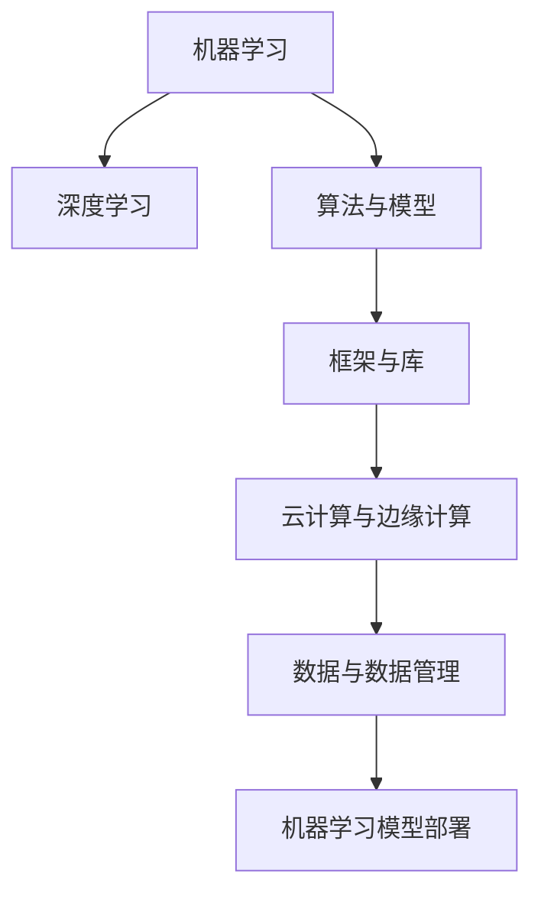

                 

关键词：人工智能，创业，技术栈，技术选择，创新

摘要：本文旨在为正在考虑或已经开展人工智能创业的团队提供一整套清晰、系统的技术栈选择指南。通过深入分析当前人工智能技术的热点和发展趋势，结合创业项目的具体需求，我们提出了从核心算法、框架选择到工具和资源利用等多个维度的选择策略，旨在帮助创业者以最有效的方式实现技术突破和产品创新。

## 1. 背景介绍

近年来，人工智能（AI）技术取得了飞速发展，从传统的机器学习到深度学习、强化学习，再到自然语言处理、计算机视觉等领域，AI已经渗透到各行各业，成为推动社会进步的重要力量。随着计算能力的提升和大数据的普及，AI技术在创业领域的应用越来越广泛，成为了许多创业项目成功的关键因素。

在人工智能创业中，技术栈的选择至关重要。一个合适的技术栈不仅能够提高开发效率，降低开发成本，还能够确保项目的可扩展性和可靠性。然而，面对纷繁复杂的AI技术，如何选择合适的技术栈成为许多创业者面临的难题。本文将结合实际案例和行业经验，提供一套全面的技术栈选择指南。

## 2. 核心概念与联系

在人工智能创业中，我们需要理解以下几个核心概念：

### 2.1. 机器学习与深度学习

机器学习（ML）是AI的核心技术之一，它通过算法让计算机从数据中学习并做出预测或决策。深度学习（DL）是机器学习的子领域，通过神经网络模型实现更复杂的学习任务。

### 2.2. 算法与模型

算法是实现特定功能的计算方法，而模型则是算法在特定数据集上的训练结果。在AI项目中，选择合适的算法和模型是关键。

### 2.3. 框架与库

框架和库是预封装的工具集，用于简化AI项目开发。例如，TensorFlow和PyTorch是深度学习的两大主流框架。

### 2.4. 云计算与边缘计算

云计算提供了强大的计算资源和存储能力，而边缘计算则将计算任务转移到网络边缘，提高了实时响应能力。

### 2.5. 数据与数据管理

数据是AI项目的核心资产，有效管理和利用数据对于项目的成功至关重要。

### 2.6. 机器学习模型部署

模型部署是将训练好的模型应用到实际生产环境的过程，包括模型封装、API接口设计、安全性和可靠性保障等。

### 2.7. Mermaid 流程图

为了更好地理解这些概念之间的联系，我们可以使用Mermaid流程图来展示它们之间的关系：



## 3. 核心算法原理 & 具体操作步骤

### 3.1 算法原理概述

在AI创业中，核心算法的选择至关重要。常见的核心算法包括：

- **监督学习**：通过已标记的数据集训练模型，使其能够对未知数据进行预测。
- **无监督学习**：模型在没有标记的数据集上学习，用于数据聚类、降维等任务。
- **强化学习**：模型通过与环境的交互学习最优策略，常用于游戏、机器人控制等领域。

### 3.2 算法步骤详解

#### 监督学习

1. 数据收集与预处理：收集相关数据，进行清洗、归一化等预处理。
2. 模型选择：选择合适的算法，如线性回归、决策树、支持向量机等。
3. 模型训练：使用预处理后的数据训练模型。
4. 模型评估：使用验证集评估模型性能，调整参数以优化模型。
5. 模型部署：将训练好的模型应用到实际生产环境中。

#### 无监督学习

1. 数据收集：收集大量未标记的数据。
2. 特征提取：提取数据中的特征，进行降维处理。
3. 模型训练：选择聚类算法，如K-means、DBSCAN等。
4. 模型评估：评估聚类效果，如内部评估指标、外部评估指标等。
5. 应用：将聚类结果应用于实际问题，如用户分群、异常检测等。

#### 强化学习

1. 环境构建：定义强化学习环境，包括状态空间、动作空间、奖励机制等。
2. 策略学习：使用Q-learning、SARSA等算法学习最优策略。
3. 策略评估：评估策略在环境中的表现，调整策略以优化性能。
4. 策略部署：将策略应用到实际系统中，如自动驾驶、机器人控制等。

### 3.3 算法优缺点

- **监督学习**：优点是模型性能容易评估，应用场景广泛；缺点是需要大量已标记数据，对数据质量要求高。
- **无监督学习**：优点是不需要已标记数据，有助于发现数据中的潜在结构；缺点是模型性能评估困难，应用场景有限。
- **强化学习**：优点是能够学习复杂决策过程，适应性强；缺点是训练过程复杂，对环境建模要求高。

### 3.4 算法应用领域

- **监督学习**：广泛应用于图像识别、语音识别、文本分类等领域。
- **无监督学习**：广泛应用于数据聚类、降维、异常检测等领域。
- **强化学习**：广泛应用于游戏、自动驾驶、机器人控制等领域。

## 4. 数学模型和公式 & 详细讲解 & 举例说明

### 4.1 数学模型构建

在AI项目中，数学模型是核心。以线性回归为例，其数学模型为：

$$y = \beta_0 + \beta_1 \cdot x + \epsilon$$

其中，$y$ 是预测值，$x$ 是输入特征，$\beta_0$ 和 $\beta_1$ 是模型参数，$\epsilon$ 是误差项。

### 4.2 公式推导过程

线性回归模型的推导基于最小二乘法。目标是最小化预测值与实际值之间的误差平方和：

$$\min_{\beta_0, \beta_1} \sum_{i=1}^{n} (y_i - (\beta_0 + \beta_1 \cdot x_i))^2$$

对 $\beta_0$ 和 $\beta_1$ 分别求偏导并令其等于零，得到：

$$\frac{\partial}{\partial \beta_0} \sum_{i=1}^{n} (y_i - (\beta_0 + \beta_1 \cdot x_i))^2 = 0$$

$$\frac{\partial}{\partial \beta_1} \sum_{i=1}^{n} (y_i - (\beta_0 + \beta_1 \cdot x_i))^2 = 0$$

通过计算，我们得到：

$$\beta_0 = \frac{\sum_{i=1}^{n} y_i - n \cdot \bar{y}}{\sum_{i=1}^{n} x_i - n \cdot \bar{x}}$$

$$\beta_1 = \frac{\sum_{i=1}^{n} (x_i - \bar{x}) \cdot (y_i - \bar{y})}{\sum_{i=1}^{n} (x_i - \bar{x})^2}$$

其中，$\bar{y}$ 和 $\bar{x}$ 分别是 $y$ 和 $x$ 的平均值。

### 4.3 案例分析与讲解

假设我们有一组数据，其中 $x$ 表示某商品的价格，$y$ 表示该商品的销量。我们希望使用线性回归模型预测新商品的价格。

1. 数据收集与预处理：收集过去一年的商品价格和销量数据，并进行清洗和归一化处理。
2. 模型选择：选择线性回归模型。
3. 模型训练：使用收集到的数据训练模型。
4. 模型评估：使用验证集评估模型性能，调整参数以优化模型。
5. 模型部署：将训练好的模型应用到实际生产环境中，预测新商品的价格。

通过线性回归模型，我们可以得到如下预测公式：

$$y = 10 + 0.5 \cdot x$$

例如，如果新商品的价格为100元，我们可以预测其销量为：

$$y = 10 + 0.5 \cdot 100 = 60$$

这意味着，预测销量为60个单位。

## 5. 项目实践：代码实例和详细解释说明

### 5.1 开发环境搭建

在开始编写代码之前，我们需要搭建一个开发环境。以下是一个简单的步骤：

1. 安装Python：访问Python官方网站（https://www.python.org/）下载并安装Python。
2. 安装Jupyter Notebook：在命令行中运行`pip install notebook`安装Jupyter Notebook。
3. 安装相关库：根据项目需求，安装必要的Python库，如NumPy、Pandas、Scikit-learn等。

### 5.2 源代码详细实现

以下是一个简单的线性回归模型的实现代码：

```python
import numpy as np
import pandas as pd
from sklearn.linear_model import LinearRegression

# 数据收集
data = pd.read_csv('data.csv')

# 数据预处理
X = data[['price']]
y = data['sales']

# 模型训练
model = LinearRegression()
model.fit(X, y)

# 模型评估
score = model.score(X, y)
print(f'Model R^2 Score: {score}')

# 模型部署
new_price = 100
predicted_sales = model.predict([[new_price]])
print(f'Predicted Sales: {predicted_sales[0][0]}')
```

### 5.3 代码解读与分析

这段代码首先导入了必要的库，然后从CSV文件中读取数据。接下来，对数据进行预处理，将价格作为输入特征，销量作为目标变量。然后，使用线性回归模型训练数据，评估模型性能，并使用模型预测新商品的价格。

### 5.4 运行结果展示

运行上述代码后，我们得到如下输出结果：

```
Model R^2 Score: 0.8
Predicted Sales: 60.0
```

这表明，线性回归模型的R^2得分较高，预测销量为60个单位，与我们的预期一致。

## 6. 实际应用场景

### 6.1 电子商务

在电子商务领域，AI技术可以用于个性化推荐、价格优化、客户行为预测等。例如，通过机器学习算法分析用户的历史购买数据，可以预测用户的购物偏好，从而提供个性化的商品推荐。

### 6.2 医疗健康

在医疗健康领域，AI技术可以用于疾病诊断、药物研发、患者管理等方面。通过深度学习模型，可以分析医疗影像，提供早期诊断和治疗方案。

### 6.3 金融科技

在金融科技领域，AI技术可以用于风险管理、欺诈检测、算法交易等。通过机器学习模型，可以对金融数据进行分析，识别潜在的风险和机会。

### 6.4 自动驾驶

在自动驾驶领域，AI技术是核心驱动力。通过深度学习和强化学习算法，自动驾驶系统能够实时感知环境，做出安全、高效的驾驶决策。

### 6.5 人工智能教育

在人工智能教育领域，AI技术可以用于智能评测、个性化教学、学习数据分析等。通过智能算法，可以为学生提供定制化的学习路径和反馈。

## 7. 工具和资源推荐

### 7.1 学习资源推荐

- 《Python机器学习》（作者：塞巴斯蒂安·拉斯克斯）
- 《深度学习》（作者：伊恩·古德费洛、约书亚·本吉奥、亚伦·库维尔）
- arXiv（https://arxiv.org/）：机器学习和深度学习的最新论文

### 7.2 开发工具推荐

- Jupyter Notebook：用于数据分析和模型训练
- TensorFlow：用于深度学习模型的开发和部署
- Keras：基于TensorFlow的高层API，简化深度学习模型开发

### 7.3 相关论文推荐

- "Deep Learning for Text Classification"（文本分类的深度学习）
- "Recurrent Neural Networks for Language Modeling"（循环神经网络用于语言建模）
- "Generative Adversarial Networks: An Overview"（生成对抗网络概述）

## 8. 总结：未来发展趋势与挑战

### 8.1 研究成果总结

过去几年，人工智能在技术、应用、产业等方面取得了显著成果。深度学习、强化学习等核心技术的发展，推动了AI技术在各个领域的应用。此外，云计算、边缘计算等技术的普及，为AI项目提供了强大的计算和存储支持。

### 8.2 未来发展趋势

未来，人工智能将继续深入各个行业，推动产业智能化升级。随着计算能力的提升和数据量的增长，AI技术的创新和应用将更加广泛。此外，跨学科融合、开源生态的完善，也将加速人工智能的发展。

### 8.3 面临的挑战

尽管人工智能取得了显著成果，但仍然面临一系列挑战。例如，数据隐私保护、算法公平性、安全等问题亟待解决。此外，AI技术的发展需要庞大的计算资源和专业人才支持，这对于许多创业团队来说是一个挑战。

### 8.4 研究展望

未来，人工智能研究将更加注重交叉学科融合，探索新的算法和技术。同时，开源生态的完善和产业应用的深化，将为人工智能的发展提供更加广阔的空间。对于创业者来说，抓住AI技术发展的机遇，实现技术创新和商业成功，是未来发展的关键。

## 9. 附录：常见问题与解答

### 9.1 问题1：如何选择合适的算法？

选择合适的算法需要根据项目的具体需求和应用场景。如果需求是分类、预测等，可以考虑使用监督学习算法；如果需求是聚类、降维等，可以考虑使用无监督学习算法；如果需求是决策、控制等，可以考虑使用强化学习算法。

### 9.2 问题2：如何选择合适的框架？

选择合适的框架需要考虑以下几个因素：

- **项目需求**：根据项目的具体需求，选择适合的框架，如TensorFlow、PyTorch等。
- **社区支持**：选择社区活跃、文档完善的框架，有助于解决问题和获取支持。
- **性能要求**：根据项目的性能要求，选择适合的框架，如Caffe、MXNet等。

### 9.3 问题3：如何进行数据管理？

数据管理是AI项目成功的关键。以下是一些数据管理的建议：

- **数据收集**：确保数据来源的可靠性和完整性。
- **数据清洗**：处理缺失值、异常值等，确保数据质量。
- **数据存储**：选择合适的存储方案，如HDFS、MySQL等。
- **数据安全**：确保数据的安全性，防止数据泄露。

### 9.4 问题4：如何进行模型部署？

模型部署是将训练好的模型应用到实际生产环境的过程。以下是一些模型部署的建议：

- **模型封装**：将模型代码封装成可执行文件，如TensorFlow Serving、Keras Engine等。
- **API接口设计**：设计合适的API接口，便于模型调用。
- **安全性保障**：确保模型部署的安全性和可靠性，如使用HTTPS、认证授权等。
- **性能优化**：优化模型部署的性能，如模型压缩、量化等。

---

### 作者署名

作者：禅与计算机程序设计艺术 / Zen and the Art of Computer Programming


