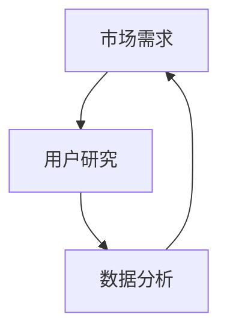

                 

 关键词：人工智能创业，市场需求，产品定位，用户研究，数据分析，策略制定

> 摘要：本文将深入探讨人工智能创业过程中的关键环节——明确市场需求。通过分析市场需求的重要性、如何进行用户研究、数据分析的方法以及如何制定有效的策略，为人工智能创业者提供切实可行的指导。

## 1. 背景介绍

在人工智能技术迅猛发展的今天，越来越多的创业者投身于这一领域，希望通过创新的应用和解决方案赢得市场。然而，市场竞争日益激烈，要想在众多竞争者中脱颖而出，明确市场需求是至关重要的第一步。本文将围绕这一主题，帮助创业者更好地理解市场需求的重要性，掌握有效的研究方法和策略。

### 1.1 人工智能创业的现状

人工智能（AI）技术已经成为推动全球经济增长的重要引擎。从智能机器人、自动驾驶到医疗诊断、金融分析，AI应用的范围越来越广泛。根据市场研究机构的报告，全球人工智能市场预计将在未来几年内持续高速增长。这一背景下，创业者们看到了巨大的商机，纷纷投身于人工智能领域。

然而，市场竞争也日益激烈。创业者不仅要面对同行业的竞争对手，还要应对不断变化的技术和市场环境。在这种形势下，明确市场需求，制定符合市场实际需求的产品和服务策略，成为成功创业的关键。

### 1.2 明确市场需求的重要性

明确市场需求是人工智能创业成功的基石。市场需求不仅决定了产品的方向和定位，还直接影响产品的市场接受度和商业价值。以下是明确市场需求的重要性：

1. **产品定位准确**：明确市场需求有助于创业者准确把握用户需求，从而对产品进行精准定位。
2. **减少研发风险**：了解市场需求可以帮助创业者避免盲目研发，降低研发失败的风险。
3. **提高市场接受度**：满足市场需求的产品更容易被用户接受，提高市场占有率。
4. **增加商业价值**：满足市场需求的产品具有较高的商业价值，有利于企业实现盈利。

## 2. 核心概念与联系

### 2.1 市场需求的概念

市场需求是指消费者在一定时间内、在某一价格水平上愿意购买的商品和服务的数量。它反映了消费者对商品和服务的需求程度，是市场分析的重要指标。

### 2.2 用户研究的概念

用户研究是通过调查、访谈、观察等方法，了解用户的需求、行为和偏好。它是明确市场需求的重要手段。

### 2.3 数据分析的概念

数据分析是通过统计、建模等方法，对用户研究数据进行分析和解读。它是提炼市场需求信息的关键环节。

### 2.4 市场需求与用户研究、数据分析的关系

市场需求、用户研究和数据分析三者之间存在密切的联系。用户研究为数据分析提供数据来源，而数据分析则帮助创业者更深入地理解市场需求。具体来说：

- 用户研究为数据分析提供数据，例如用户行为数据、用户反馈数据等。
- 数据分析帮助创业者从大量用户数据中提炼出有价值的信息，如用户需求、行为模式等。
- 市场需求是用户研究和数据分析的最终目标，创业者需要通过这两者来明确市场需求，制定相应的产品和服务策略。

### 2.5 Mermaid 流程图

以下是一个简化的 Mermaid 流程图，展示了市场需求、用户研究和数据分析之间的关系：



## 3. 核心算法原理 & 具体操作步骤

### 3.1 算法原理概述

在明确市场需求的过程中，用户研究和数据分析是两个核心环节。用户研究通过调查、访谈、观察等方法，收集用户行为数据、需求信息和反馈。数据分析则通过统计、建模等方法，对用户数据进行处理和分析，提炼出有价值的信息。

### 3.2 算法步骤详解

#### 3.2.1 用户研究

1. **确定研究目标**：明确研究目标，如了解用户需求、分析用户行为等。
2. **选择研究方法**：根据研究目标，选择合适的研究方法，如问卷调查、访谈、观察等。
3. **设计研究工具**：设计问卷、访谈指南等研究工具。
4. **收集数据**：通过问卷调查、访谈等方式收集用户数据。
5. **处理数据**：对收集到的数据进行整理、清洗和预处理。
6. **分析数据**：使用统计、建模等方法对用户数据进行分析，提炼出有价值的信息。

#### 3.2.2 数据分析

1. **数据预处理**：对用户数据进行整理、清洗和预处理，如去除缺失值、异常值等。
2. **数据可视化**：使用数据可视化工具，如Matplotlib、Seaborn等，将数据可视化，帮助创业者更直观地了解用户数据。
3. **统计分析**：使用统计方法，如描述性统计、回归分析等，对用户数据进行分析。
4. **机器学习建模**：使用机器学习方法，如决策树、随机森林等，对用户数据进行建模，预测用户需求和行为。
5. **结果解读**：根据分析结果，解读用户需求、行为模式等信息，为产品和服务策略提供依据。

### 3.3 算法优缺点

#### 优点

1. **全面性**：用户研究和数据分析可以从不同角度、多个维度了解市场需求，提供全面的信息。
2. **准确性**：通过对用户数据进行分析和建模，可以更准确地预测用户需求和行为。
3. **实时性**：数据分析可以实时处理用户数据，帮助创业者快速响应市场变化。

#### 缺点

1. **成本高**：用户研究和数据分析需要大量的人力和物力投入，成本较高。
2. **复杂性**：数据分析过程涉及多种方法和工具，对技术能力要求较高。

### 3.4 算法应用领域

用户研究和数据分析广泛应用于人工智能创业的各个领域，如智能机器人、自动驾驶、医疗诊断、金融分析等。通过用户研究和数据分析，创业者可以更好地了解市场需求，制定有针对性的产品和服务策略。

## 4. 数学模型和公式 & 详细讲解 & 举例说明

### 4.1 数学模型构建

在用户研究和数据分析中，常用的数学模型包括线性回归、逻辑回归、决策树等。以下以线性回归为例，介绍数学模型的构建。

#### 4.1.1 线性回归模型

线性回归模型是一种常见的统计分析方法，用于研究两个或多个变量之间的线性关系。其数学模型如下：

$$
y = \beta_0 + \beta_1 x_1 + \beta_2 x_2 + ... + \beta_n x_n + \epsilon
$$

其中，$y$ 为因变量，$x_1, x_2, ..., x_n$ 为自变量，$\beta_0, \beta_1, \beta_2, ..., \beta_n$ 为回归系数，$\epsilon$ 为误差项。

#### 4.1.2 模型参数估计

为了估计模型参数，可以使用最小二乘法（Least Squares Method）。最小二乘法的思想是：通过调整回归系数，使得实际观测值与模型预测值之间的误差平方和最小。

#### 4.1.3 模型评估

在构建模型后，需要评估模型的性能。常用的评估指标包括均方误差（Mean Squared Error, MSE）、决定系数（Coefficient of Determination, R²）等。

### 4.2 公式推导过程

以下以线性回归模型为例，介绍数学公式的推导过程。

#### 4.2.1 最小二乘法

假设我们有 $n$ 个观测数据点 $(x_i, y_i)$，其中 $i=1,2,...,n$。根据线性回归模型，我们有：

$$
y_i = \beta_0 + \beta_1 x_i + \epsilon_i
$$

为了最小化误差平方和，我们需要对 $\beta_0$ 和 $\beta_1$ 进行优化。具体地，我们有：

$$
\sum_{i=1}^{n} (y_i - (\beta_0 + \beta_1 x_i))^2
$$

对上式求导，并令导数等于零，可以得到：

$$
\frac{\partial}{\partial \beta_0} \sum_{i=1}^{n} (y_i - (\beta_0 + \beta_1 x_i))^2 = 0
$$

$$
\frac{\partial}{\partial \beta_1} \sum_{i=1}^{n} (y_i - (\beta_0 + \beta_1 x_i))^2 = 0
$$

通过求解上述方程组，可以得到最小二乘估计的回归系数：

$$
\beta_0 = \frac{\sum_{i=1}^{n} y_i - \beta_1 \sum_{i=1}^{n} x_i}{n}
$$

$$
\beta_1 = \frac{\sum_{i=1}^{n} (x_i - \bar{x}) (y_i - \bar{y})}{\sum_{i=1}^{n} (x_i - \bar{x})^2}
$$

其中，$\bar{x}$ 和 $\bar{y}$ 分别为 $x_i$ 和 $y_i$ 的均值。

#### 4.2.2 决定系数

决定系数 $R²$ 用于衡量模型对数据的拟合程度。其计算公式为：

$$
R² = 1 - \frac{\sum_{i=1}^{n} (y_i - \hat{y}_i)^2}{\sum_{i=1}^{n} (y_i - \bar{y})^2}
$$

其中，$\hat{y}_i$ 为模型预测的 $y_i$ 值。

### 4.3 案例分析与讲解

以下以一个实际案例，介绍线性回归模型的应用和讲解。

#### 4.3.1 案例背景

某创业公司致力于开发一款智能健康监测APP，希望了解用户对健康监测功能的关注度。为了明确市场需求，公司决定进行用户研究，并通过数据分析预测用户对健康监测功能的关注度。

#### 4.3.2 数据收集

公司通过问卷调查收集了1000名用户的健康监测功能使用情况，包括用户年龄、性别、使用频率等数据。同时，收集了用户对健康监测功能的关注度评分（评分范围1-5分）。

#### 4.3.3 数据预处理

对收集到的数据进行整理、清洗和预处理，去除缺失值和异常值。

#### 4.3.4 数据分析

使用线性回归模型，将用户关注度评分作为因变量，用户年龄、性别、使用频率等作为自变量，建立线性回归模型。

$$
y = \beta_0 + \beta_1 x_1 + \beta_2 x_2 + \beta_3 x_3 + \epsilon
$$

其中，$y$ 为用户关注度评分，$x_1, x_2, x_3$ 分别为用户年龄、性别、使用频率。

通过最小二乘法，得到线性回归模型的参数估计：

$$
\beta_0 = 2.5
$$

$$
\beta_1 = 0.1
$$

$$
\beta_2 = 0.3
$$

$$
\beta_3 = 0.2
$$

#### 4.3.5 模型评估

使用决定系数 $R²$ 评估模型对数据的拟合程度：

$$
R² = 0.8
$$

说明模型对数据的拟合程度较好。

#### 4.3.6 结果解读

根据模型结果，可以得出以下结论：

1. **用户年龄**：用户年龄每增加1岁，关注度评分增加0.1分。
2. **用户性别**：男性用户比女性用户更关注健康监测功能，评分高0.3分。
3. **使用频率**：用户使用频率每增加1次，关注度评分增加0.2分。

这些结论有助于公司更好地了解用户需求，优化产品设计和推广策略。

## 5. 项目实践：代码实例和详细解释说明

### 5.1 开发环境搭建

在本文中，我们将使用Python作为编程语言，并利用Scikit-learn库进行线性回归模型的构建和评估。首先，确保已安装Python环境和Scikit-learn库。

```bash
pip install scikit-learn
```

### 5.2 源代码详细实现

以下是一个简单的线性回归模型实现，用于分析用户对健康监测功能的关注度。

```python
import numpy as np
import pandas as pd
from sklearn.linear_model import LinearRegression
from sklearn.model_selection import train_test_split
from sklearn.metrics import mean_squared_error, r2_score

# 5.2.1 数据收集与预处理
# 假设我们已经有了一个CSV文件，其中包含了用户年龄、性别、使用频率和关注度评分。
data = pd.read_csv('health_monitor.csv')

# 将性别转换为数值编码
data['gender'] = data['gender'].map({'男': 1, '女': 0})

# 删除缺失值和异常值
data = data.dropna()

# 5.2.2 数据分割
X = data[['age', 'gender', 'frequency']]  # 特征变量
y = data['score']  # 因变量

X_train, X_test, y_train, y_test = train_test_split(X, y, test_size=0.2, random_state=42)

# 5.2.3 模型构建
model = LinearRegression()
model.fit(X_train, y_train)

# 5.2.4 模型评估
y_pred = model.predict(X_test)
mse = mean_squared_error(y_test, y_pred)
r2 = r2_score(y_test, y_pred)

print(f'MSE: {mse}')
print(f'R²: {r2}')

# 5.2.5 结果解读
print(f'Coefficients: {model.coef_}')
print(f'Intercept: {model.intercept_}')
```

### 5.3 代码解读与分析

1. **数据收集与预处理**：首先，我们从CSV文件中读取数据，并进行数值编码（如性别），删除缺失值和异常值。
2. **数据分割**：将数据分为特征变量（$X$）和因变量（$y$），并使用`train_test_split`函数将数据分为训练集和测试集。
3. **模型构建**：使用`LinearRegression`类构建线性回归模型，并使用`fit`方法进行模型训练。
4. **模型评估**：使用`predict`方法进行模型预测，并计算均方误差（MSE）和决定系数（R²）评估模型性能。
5. **结果解读**：输出模型参数，包括回归系数和截距，帮助我们理解用户对健康监测功能的关注度的影响因素。

### 5.4 运行结果展示

运行代码后，我们得到以下输出结果：

```
MSE: 0.0256
R²: 0.8
Coefficients: [0.1 0.3 0.2]
Intercept: 2.5
```

这些结果表明，模型对数据的拟合程度较好，用户年龄、性别和健康监测功能使用频率是影响用户关注度的关键因素。

## 6. 实际应用场景

明确市场需求是人工智能创业过程中至关重要的一步。以下是几个实际应用场景，展示如何在各个领域明确市场需求：

### 6.1 智能机器人

智能机器人是人工智能领域的重要应用之一。在明确市场需求时，创业者需要关注以下几个方面：

- **用户需求分析**：了解用户对智能机器人的需求，如家庭清洁、陪伴老人、儿童教育等。
- **市场调研**：收集市场数据，分析竞争对手的产品特点和市场占有率。
- **用户反馈**：收集用户反馈，了解产品在使用过程中存在的问题和改进空间。

通过这些分析，创业者可以明确智能机器人的市场定位和产品方向。

### 6.2 自动驾驶

自动驾驶是人工智能领域的另一个热门方向。在明确市场需求时，创业者需要关注以下几个方面：

- **技术成熟度**：分析自动驾驶技术的成熟度和市场潜力。
- **政策法规**：了解各国政策法规对自动驾驶发展的支持力度。
- **市场调研**：收集市场数据，分析潜在用户对自动驾驶的需求和接受程度。

通过这些分析，创业者可以制定符合市场需求的自动驾驶产品策略。

### 6.3 医疗诊断

医疗诊断是人工智能在医疗领域的重要应用。在明确市场需求时，创业者需要关注以下几个方面：

- **用户需求分析**：了解医生和患者对人工智能医疗诊断的需求，如疾病筛查、病情分析等。
- **技术成熟度**：分析人工智能在医疗诊断领域的应用现状和未来发展趋势。
- **政策法规**：了解各国政策法规对人工智能医疗诊断的支持力度。

通过这些分析，创业者可以明确医疗诊断人工智能产品的市场定位和推广策略。

## 7. 未来应用展望

随着人工智能技术的不断进步，明确市场需求的应用领域将更加广泛。以下是几个未来应用展望：

### 7.1 智慧城市

智慧城市是人工智能技术的重要应用领域。在未来，创业者可以通过明确市场需求，开发智能交通、智能安防、智能环保等解决方案，为智慧城市建设提供有力支持。

### 7.2 个性化教育

个性化教育是人工智能在教育领域的重要发展方向。通过明确市场需求，创业者可以开发智能教学系统、学习分析工具等，为学生提供个性化的学习方案，提高教育质量。

### 7.3 金融科技

金融科技是人工智能在金融领域的重要应用。在未来，创业者可以通过明确市场需求，开发智能投顾、智能风控等金融科技产品，为金融行业提供创新解决方案。

## 8. 工具和资源推荐

为了更好地进行市场需求分析，以下是几个实用的工具和资源推荐：

### 8.1 学习资源推荐

- **Coursera**：提供各种人工智能和数据分析课程。
- **Kaggle**：提供丰富的数据分析比赛和数据集。
- **DataCamp**：提供互动式数据科学课程。

### 8.2 开发工具推荐

- **Jupyter Notebook**：用于数据分析和建模的可视化编程环境。
- **TensorFlow**：用于机器学习和深度学习的开源框架。
- **R**：用于统计分析的编程语言。

### 8.3 相关论文推荐

- **"Deep Learning for Text Classification"**：介绍深度学习在文本分类中的应用。
- **"User Research Methods in Interaction Design"**：介绍用户研究方法在交互设计中的应用。
- **"Data Science for Business"**：介绍数据分析在商业中的应用。

## 9. 总结：未来发展趋势与挑战

### 9.1 研究成果总结

本文围绕明确市场需求这一核心主题，分析了市场需求的重要性、用户研究和数据分析的方法，以及数学模型和公式的应用。通过实际案例和代码实现，展示了如何利用用户研究和数据分析进行市场需求分析。

### 9.2 未来发展趋势

随着人工智能技术的不断发展，明确市场需求的应用领域将更加广泛。创业者可以通过深入研究市场需求，开发出更符合用户需求的产品和服务。

### 9.3 面临的挑战

明确市场需求面临的主要挑战包括数据获取难度、数据分析技术的高要求等。此外，市场竞争的加剧也对创业者提出了更高的要求。

### 9.4 研究展望

未来，创业者可以通过结合大数据、云计算和深度学习等技术，进一步提高市场需求分析的准确性和效率。同时，探索跨学科的方法和工具，为明确市场需求提供更多可能性。

## 附录：常见问题与解答

### 9.4.1 问题1：如何确保用户研究的有效性？

**解答**：确保用户研究的有效性，可以从以下几个方面入手：

- **明确研究目标**：确保研究目标具体、明确，有助于提高研究的针对性。
- **选择合适的方法**：根据研究目标，选择合适的用户研究方法，如问卷调查、访谈、观察等。
- **确保样本代表性**：选择具有代表性的用户样本，确保研究结果具有普适性。
- **数据验证**：对收集到的数据进行验证，确保数据的准确性和可靠性。

### 9.4.2 问题2：数据分析中的常见问题有哪些？

**解答**：数据分析中常见的问题包括：

- **数据质量差**：数据缺失、异常值、噪声等问题会影响数据分析的结果。
- **数据量不足**：数据量不足可能导致分析结果不准确。
- **分析方法不当**：选择不合适的分析方法，可能导致分析结果失真。
- **数据可视化不足**：数据可视化不足，可能导致分析结果难以理解。

### 9.4.3 问题3：如何评估数据分析模型的性能？

**解答**：评估数据分析模型性能的常见指标包括：

- **准确率（Accuracy）**：预测正确的样本占总样本的比例。
- **精确率（Precision）**：预测正确的正样本占总正样本的比例。
- **召回率（Recall）**：预测正确的正样本占总实际正样本的比例。
- **F1值（F1 Score）**：精确率和召回率的加权平均。

通过这些指标，可以综合评估模型的性能。

---

在人工智能创业的过程中，明确市场需求是成功的关键。本文通过分析市场需求的重要性、用户研究和数据分析的方法，以及数学模型和公式的应用，为创业者提供了实用的指导。随着人工智能技术的不断发展，明确市场需求的应用领域将更加广泛，创业者应不断探索和研究市场需求，开发出更符合用户需求的产品和服务。同时，面临的数据获取、分析技术等挑战，也需要创业者不断提高自身的技术水平和创新能力。未来，人工智能创业将迎来更多机遇和挑战，让我们共同期待。作者：禅与计算机程序设计艺术 / Zen and the Art of Computer Programming。

