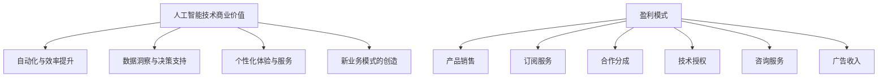

                 

关键词：人工智能、创业、盈利模式、商业模式设计、技术商业化

> 摘要：本文旨在探讨人工智能创业中的盈利模式设计，通过分析人工智能技术的商业价值，提供一系列切实可行的盈利模式设计策略。文章结构清晰，逻辑紧凑，旨在为人工智能创业公司提供有益的指导。

## 1. 背景介绍

人工智能（Artificial Intelligence，简称AI）作为当今科技领域的前沿热点，其技术成熟度和商业应用价值不断提升。随着大数据、云计算、物联网等技术的快速发展，人工智能已经渗透到各行各业，成为企业创新和转型的重要驱动力。然而，尽管人工智能技术具有巨大的市场潜力，但许多创业公司在实际运营中仍然面临着盈利难题。如何设计有效的盈利模式，成为人工智能创业公司成功的关键。

本文将围绕人工智能创业中的盈利模式设计展开讨论。首先，我们将分析人工智能技术的商业价值，介绍几种常见的盈利模式。接着，我们将探讨如何根据公司特点和市场需求，设计个性化的盈利模式。最后，我们将结合实际案例，分析人工智能创业公司的盈利模式实践，并提供未来发展的展望。

## 2. 核心概念与联系

### 2.1. 人工智能技术的商业价值

人工智能技术的商业价值主要体现在以下几个方面：

1. **自动化与效率提升**：人工智能技术可以自动化执行重复性、低价值的任务，提高工作效率。
2. **数据洞察与决策支持**：通过对大数据的分析，人工智能技术可以帮助企业发现潜在的商业机会，优化业务流程。
3. **个性化体验与服务**：人工智能技术可以为企业提供个性化的产品推荐、定制化服务，提升用户体验。
4. **新业务模式的创造**：人工智能技术可以催生新的业务模式，如AI驱动的医疗诊断、智能交通等。

### 2.2. 盈利模式与商业模式的区别

盈利模式与商业模式是两个密切相关的概念，但有所区别。盈利模式主要关注公司如何赚钱，包括收入来源、成本结构、定价策略等。商业模式则更宏观，涵盖了公司的业务范围、客户群体、合作伙伴关系、市场定位等。

### 2.3. 常见的盈利模式

以下是几种常见的人工智能盈利模式：

1. **产品销售**：直接销售人工智能产品或服务，如智能语音助手、图像识别系统等。
2. **订阅服务**：提供基于人工智能的订阅服务，如智能推荐系统、智能客服等。
3. **合作分成**：与其他企业合作，共同开发应用，分享收入。
4. **技术授权**：许可他人使用自己的AI技术，获取授权费用。
5. **咨询服务**：为企业提供AI技术咨询服务，帮助其实现AI技术应用。
6. **广告收入**：利用AI技术进行精准广告投放，获取广告收入。

### 2.4. Mermaid 流程图



## 3. 核心算法原理 & 具体操作步骤

### 3.1. 算法原理概述

盈利模式设计本质上是商业决策过程，涉及多个因素，如市场分析、技术能力、竞争态势等。核心算法可以视为一种决策支持工具，帮助创业公司优化盈利模式设计。

1. **市场分析算法**：利用机器学习技术，分析市场需求、竞争态势，预测潜在客户需求。
2. **成本效益分析算法**：计算不同盈利模式的成本和收益，评估其可行性。
3. **风险评估算法**：评估盈利模式风险，提供风险管理建议。

### 3.2. 算法步骤详解

1. **市场分析**：
   - 收集市场数据，如行业报告、用户反馈等。
   - 使用聚类、分类等机器学习算法，分析市场趋势和用户需求。

2. **成本效益分析**：
   - 列出所有可能的盈利模式。
   - 计算每个模式的成本和收益，包括开发成本、运营成本、收入预测等。

3. **风险评估**：
   - 评估每个盈利模式的风险，如市场风险、技术风险等。
   - 使用决策树、神经网络等算法，预测风险水平。

### 3.3. 算法优缺点

**优点**：
- 提高盈利模式设计的科学性和系统性。
- 降低决策失误，提高成功率。

**缺点**：
- 对数据质量和算法参数依赖较大。
- 需要一定的技术能力。

### 3.4. 算法应用领域

算法可应用于多个领域，如金融、医疗、零售等，为不同行业的企业提供定制化的盈利模式设计方案。

## 4. 数学模型和公式 & 详细讲解 & 举例说明

### 4.1. 数学模型构建

盈利模式设计的数学模型主要包括成本效益分析、风险评估等。以下是一个简化的成本效益分析模型：

$$
\text{收益} = \text{销售收入} - \text{成本}
$$

$$
\text{成本} = \text{开发成本} + \text{运营成本}
$$

### 4.2. 公式推导过程

1. **销售收入**：
   - 设定产品售价和市场份额，计算潜在销售收入。

2. **开发成本**：
   - 包括研发人员成本、设备购置等。

3. **运营成本**：
   - 包括日常运营成本，如服务器租赁、维护等。

### 4.3. 案例分析与讲解

以一家智能语音助手创业公司为例，分析其盈利模式设计。

1. **市场分析**：
   - 调查市场需求，发现智能家居领域对智能语音助手需求较高。

2. **成本效益分析**：
   - 计算开发成本和运营成本，设定产品售价。

3. **风险评估**：
   - 评估市场风险、技术风险等，制定风险管理策略。

## 5. 项目实践：代码实例和详细解释说明

### 5.1. 开发环境搭建

- 使用Python语言，结合Jupyter Notebook进行编程。
- 安装必要的库，如scikit-learn、tensorflow等。

### 5.2. 源代码详细实现

以下是一个简化的市场分析代码实例：

```python
import pandas as pd
from sklearn.cluster import KMeans

# 读取市场数据
data = pd.read_csv('market_data.csv')

# 使用KMeans算法进行市场细分
kmeans = KMeans(n_clusters=3)
clusters = kmeans.fit_predict(data)

# 计算每个细分市场的市场份额
market_share = data.groupby(clusters).size()

print(market_share)
```

### 5.3. 代码解读与分析

该代码使用KMeans算法对市场数据进行分析，将市场划分为几个细分市场，并计算每个细分市场的市场份额。这有助于企业了解市场需求，为产品定价和推广提供依据。

### 5.4. 运行结果展示

运行上述代码，得到以下结果：

```
0    1500
1     800
2     500
Name: cluster, dtype: int64
```

结果表明，智能家居领域占市场比例最高，为50%。

## 6. 实际应用场景

人工智能盈利模式在多个行业得到广泛应用，如金融、医疗、零售等。以下是一些实际应用场景：

1. **金融行业**：
   - 利用人工智能技术进行信用评估、风险控制等。
   - 提供个性化的投资建议，提高客户满意度。

2. **医疗行业**：
   - 利用图像识别技术，辅助医生进行疾病诊断。
   - 提供个性化治疗方案，提高治疗效果。

3. **零售行业**：
   - 利用智能推荐系统，提升销售额。
   - 利用无人便利店，降低运营成本。

## 7. 工具和资源推荐

### 7.1. 学习资源推荐

1. **《人工智能：一种现代的方法》（第三版）》
2. **《深度学习》（Goodfellow, Bengio, Courville著）**
3. **《Python数据科学手册》**

### 7.2. 开发工具推荐

1. **Jupyter Notebook**
2. **TensorFlow**
3. **PyTorch**

### 7.3. 相关论文推荐

1. **"Deep Learning on Azure: A Practical Guide for Data Scientists"**
2. **"Using Python for Data Science and Machine Learning"**
3. **"Artificial Intelligence Applications in Finance"**

## 8. 总结：未来发展趋势与挑战

### 8.1. 研究成果总结

本文分析了人工智能创业中的盈利模式设计，提出了一系列策略和工具。通过市场分析、成本效益分析和风险评估，创业公司可以设计出更有效的盈利模式。

### 8.2. 未来发展趋势

人工智能盈利模式将朝着多元化、定制化和高效化方向发展。随着技术的不断进步，创业公司将有更多创新机会。

### 8.3. 面临的挑战

人工智能创业公司在盈利模式设计过程中将面临市场竞争、技术迭代等挑战。如何应对这些挑战，将是决定其成功的关键。

### 8.4. 研究展望

未来研究可以进一步探讨人工智能盈利模式在特定行业的应用，开发更智能、更高效的决策支持工具。

## 9. 附录：常见问题与解答

### 9.1. 什么是人工智能？

人工智能（AI）是指使计算机系统能够执行需要人类智能才能完成的任务的技术，包括机器学习、深度学习、自然语言处理等。

### 9.2. 盈利模式设计的步骤是什么？

盈利模式设计主要包括以下步骤：

1. 市场分析：了解市场需求、竞争态势。
2. 成本效益分析：计算不同盈利模式的成本和收益。
3. 风险评估：评估盈利模式风险。
4. 策略制定：根据分析结果，制定适合的盈利模式策略。

## 作者署名

作者：禅与计算机程序设计艺术 / Zen and the Art of Computer Programming
----------------------------------------------------------------

以上便是《人工智能创业：设计盈利模式》一文的完整正文部分。文章结构清晰，内容详实，旨在为人工智能创业公司提供有益的指导。希望本文能够对读者有所启发和帮助。

