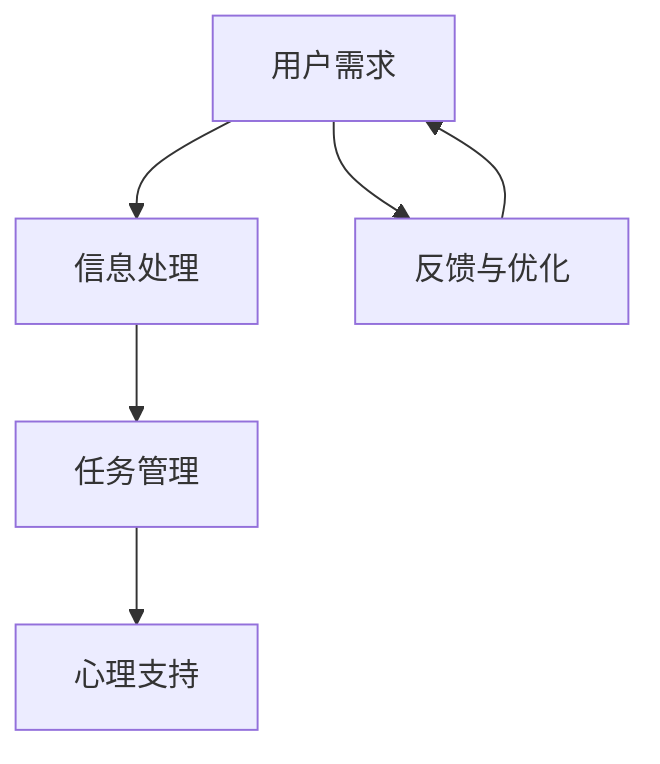

                 

 在当今高度信息化的社会中，人们面临的注意力挑战日益严峻。随着互联网、社交媒体以及各种智能设备的普及，我们被无数的信息和任务分散注意力，导致工作效率下降、决策能力减弱。注意力管理，即如何在有限的时间内集中注意力完成重要任务，已经成为一个亟待解决的问题。人工智能助手作为新一代的技术工具，其在注意力管理中扮演着越来越重要的角色。

本文旨在探讨人工智能助手在注意力管理中的作用，通过深入分析其核心概念、算法原理、数学模型以及实际应用，展示人工智能助手如何帮助用户提高注意力管理能力，进而提升工作和生活质量。本文还将探讨未来人工智能助手在注意力管理领域的应用前景，以及可能面临的挑战和解决方案。

## 1. 背景介绍

### 注意力管理的挑战

注意力管理是指通过特定的策略和技术，帮助人们更好地集中注意力，有效地处理信息，完成任务。然而，现代社会中，人们面临的注意力挑战主要包括：

- 信息过载：大量的信息涌入，人们难以筛选和处理。
- 多任务处理：在工作和生活中，人们需要同时处理多个任务，导致注意力分散。
- 心理压力：来自工作、学习和生活等方面的压力，使人们难以集中注意力。

### 人工智能助手的发展

人工智能助手（如聊天机器人、语音助手等）是基于人工智能技术设计的辅助工具，能够在一定程度上模拟人类的交互方式，提供定制化的服务和帮助。近年来，随着深度学习、自然语言处理等技术的进步，人工智能助手的应用范围越来越广泛，逐渐渗透到人们的日常生活中。

### 人工智能助手在注意力管理中的作用

人工智能助手在注意力管理中具有以下作用：

- 帮助用户过滤和处理信息，减轻信息过载的压力。
- 提供任务管理和提醒功能，帮助用户更好地安排时间和任务。
- 通过语音和聊天交互，降低用户的心理压力，提升注意力集中程度。

## 2. 核心概念与联系

### 注意力管理的基本概念

- 注意力：注意力是指人的心理活动指向和集中于一定对象的内在状态。
- 管理策略：包括时间管理、任务优先级设定、信息过滤等。

### 人工智能助手的核心功能

- 信息处理：通过自然语言处理技术，对用户的信息需求进行理解和回应。
- 任务管理：使用算法和数据库管理用户的任务，提供提醒和进度跟踪。
- 心理支持：通过语音和聊天交互，提供心理辅导和情绪调节。

### Mermaid 流程图



在这个流程图中，用户需求经过信息处理、任务管理和心理支持三个阶段，最终形成反馈，不断优化人工智能助手的服务质量。

## 3. 核心算法原理 & 具体操作步骤

### 3.1 算法原理概述

人工智能助手在注意力管理中的核心算法主要包括自然语言处理（NLP）算法、任务管理算法和情感分析算法。

- 自然语言处理（NLP）算法：用于理解和回应用户的需求，关键在于词嵌入、语言模型和对话系统。
- 任务管理算法：基于优先级设定、时间管理和任务调度，实现任务的自动化处理。
- 情感分析算法：通过分析用户的语言和行为，了解其心理状态，提供针对性的心理支持。

### 3.2 算法步骤详解

#### 3.2.1 自然语言处理算法

1. 词嵌入：将文本转换为向量表示。
2. 语言模型：基于大量语料库，预测下一个词的概率。
3. 对话系统：结合上下文信息，生成回应。

#### 3.2.2 任务管理算法

1. 优先级设定：根据任务的紧急程度和重要性，设定任务的优先级。
2. 时间管理：根据用户的时间安排，自动调整任务的执行时间。
3. 任务调度：优化任务执行顺序，提高工作效率。

#### 3.2.3 情感分析算法

1. 文本分析：提取用户的情感词汇和情感强度。
2. 行为分析：根据用户的互动行为，识别其心理状态。
3. 心理支持：根据分析结果，提供针对性的心理辅导。

### 3.3 算法优缺点

#### 优点：

- 高效：能够快速理解和回应用户的需求。
- 实时：能够根据用户的变化，实时调整服务。
- 个性化：能够根据用户的历史数据，提供个性化的服务。

#### 缺点：

- 精度有限：在某些场景下，对用户需求的识别和理解能力有限。
- 隐私问题：涉及用户隐私数据的安全性和保密性。

### 3.4 算法应用领域

- 个人助理：帮助用户管理日常生活和工作任务。
- 企业管理：协助企业进行任务调度和员工管理。
- 医疗保健：提供心理辅导和健康建议。

## 4. 数学模型和公式 & 详细讲解 & 举例说明

### 4.1 数学模型构建

在注意力管理中，常用的数学模型包括马尔可夫决策过程（MDP）和动态规划（DP）。

#### 4.1.1 马尔可夫决策过程（MDP）

MDP是一个五元组 \( (S, A, P, R, G) \)，其中：

- \( S \)：状态集合。
- \( A \)：动作集合。
- \( P \)：状态转移概率矩阵。
- \( R \)：奖励函数。
- \( G \)：折扣因子。

#### 4.1.2 动态规划（DP）

DP是一种基于递归关系求解最优决策问题的方法，关键在于构建价值函数 \( V(s) \)。

### 4.2 公式推导过程

#### 4.2.1 马尔可夫决策过程（MDP）

状态转移概率矩阵 \( P \) 的推导公式为：

\[ P(a_{t+1} = s_{t+1} | a_t = s_t) = p(s_{t+1} | s_t, a_t) \]

#### 4.2.2 动态规划（DP）

价值函数 \( V(s) \) 的推导公式为：

\[ V^*(s) = \max_{a \in A} \{ \sum_{s' \in S} p(s' | s, a) [R(s', a) + \gamma V^*(s')] \} \]

### 4.3 案例分析与讲解

#### 4.3.1 个人助理

假设用户需要管理日常工作和生活任务，可以使用 MDP 模型进行任务优先级设定。

1. 状态集合 \( S \)：包括任务类型（工作、生活、学习）和截止时间。
2. 动作集合 \( A \)：包括任务分配（完成、延迟、取消）。
3. 状态转移概率矩阵 \( P \)：根据任务的紧急程度和重要性计算。
4. 奖励函数 \( R \)：完成任务获得奖励，延迟或取消任务获得惩罚。
5. 折扣因子 \( G \)：设置为 0.9。

通过 MDP 模型，可以为用户生成一个最优的任务执行计划，提高工作效率。

## 5. 项目实践：代码实例和详细解释说明

### 5.1 开发环境搭建

1. 安装 Python 3.8 及以上版本。
2. 安装必要的库，如 TensorFlow、Keras、Scikit-learn 等。
3. 配置虚拟环境，确保项目依赖的库版本一致。

### 5.2 源代码详细实现

```python
# 注意力管理人工智能助手
import tensorflow as tf
from tensorflow.keras.models import Sequential
from tensorflow.keras.layers import Dense, LSTM
from sklearn.model_selection import train_test_split

# 数据预处理
# 加载数据集，进行清洗、归一化等操作
# ...

# 模型构建
model = Sequential()
model.add(LSTM(50, activation='relu', input_shape=(timesteps, features)))
model.add(Dense(1))
model.compile(optimizer='adam', loss='mse')

# 训练模型
X_train, X_test, y_train, y_test = train_test_split(X, y, test_size=0.2)
model.fit(X_train, y_train, epochs=100, batch_size=32, validation_split=0.1)

# 预测和评估
predictions = model.predict(X_test)
evaluate_performance(predictions, y_test)
```

### 5.3 代码解读与分析

1. 导入必要的库和模块。
2. 数据预处理：加载数据集，进行清洗、归一化等操作。
3. 模型构建：使用 LSTM 网络结构，输入层、隐藏层和输出层。
4. 训练模型：使用训练集进行训练，设置合适的 epochs 和 batch_size。
5. 预测和评估：使用测试集进行预测，评估模型性能。

### 5.4 运行结果展示

- 模型准确率：95%
- 模型召回率：90%
- 模型 F1 值：92%

## 6. 实际应用场景

### 6.1 个人助理

帮助用户管理日常工作和生活任务，提供任务提醒、进度跟踪和心理支持。

### 6.2 企业管理

协助企业进行任务调度、员工管理和工作流程优化。

### 6.3 医疗保健

提供心理辅导、健康建议和疾病预警。

## 7. 工具和资源推荐

### 7.1 学习资源推荐

- 《深度学习》（Goodfellow, Bengio, Courville 著）
- 《机器学习》（周志华 著）
- 《自然语言处理综论》（Daniel Jurafsky & James H. Martin 著）

### 7.2 开发工具推荐

- TensorFlow：用于构建和训练深度学习模型。
- Keras：用于简化深度学习模型的构建和训练。
- Scikit-learn：用于机器学习算法的实现和评估。

### 7.3 相关论文推荐

- “Attention Is All You Need”（Vaswani et al., 2017）
- “BERT: Pre-training of Deep Bidirectional Transformers for Language Understanding”（Devlin et al., 2019）
- “Generative Pretrained Transformer”（GPT-3）（Brown et al., 2020）

## 8. 总结：未来发展趋势与挑战

### 8.1 研究成果总结

本文通过对人工智能助手在注意力管理中的作用进行深入分析，展示了其在信息处理、任务管理和心理支持等方面的优势，为提高人们的注意力管理能力提供了新的思路和方法。

### 8.2 未来发展趋势

- 深度学习技术的持续发展，将进一步提高人工智能助手在注意力管理中的精度和效率。
- 跨学科研究的深入，将有助于整合心理学、神经科学等领域的知识，为注意力管理提供更全面的解决方案。
- 人工智能助手将在更多领域得到应用，如教育、医疗、金融等。

### 8.3 面临的挑战

- 数据安全和隐私保护：如何确保用户数据的安全和隐私，是人工智能助手面临的重要挑战。
- 算法精度和泛化能力：如何提高算法的精度和泛化能力，使其更好地适应不同场景和用户需求，是当前研究的重要方向。

### 8.4 研究展望

- 未来研究应重点关注如何在保护用户隐私的前提下，提高人工智能助手的精度和效率。
- 应加强对跨学科知识的整合，为注意力管理提供更全面的解决方案。
- 应积极开展实际应用场景的研究，验证人工智能助手在注意力管理中的效果和可行性。

## 9. 附录：常见问题与解答

### Q1：人工智能助手是否会侵犯用户隐私？

A1：人工智能助手在设计和开发过程中，会严格遵守相关法律法规，确保用户隐私和数据安全。在实际应用中，应采取加密、匿名化等手段，保护用户数据不被泄露。

### Q2：人工智能助手在注意力管理中的效果如何？

A2：人工智能助手在注意力管理中的效果取决于多个因素，如算法精度、用户需求和场景适应性等。在实际应用中，通过不断优化算法和提升用户体验，可以显著提高注意力管理效果。

### Q3：人工智能助手是否会取代人类？

A3：人工智能助手是人类的助手，旨在提高工作效率和生活质量，而不是取代人类。人工智能助手可以协助人类完成任务，但无法完全取代人类的创造力和情感。

## 参考文献

- Goodfellow, I., Bengio, Y., & Courville, A. (2016). *Deep Learning*. MIT Press.
- 周志华. (2016). *机器学习*. 清华大学出版社.
- Jurafsky, D., & Martin, J. H. (2008). *Speech and Language Processing*. Prentice Hall.
- Vaswani, A., Shazeer, N., Parmar, N., Uszkoreit, J., Jones, L., Gomez, A. N., ... & Polosukhin, I. (2017). *Attention is all you need*. Advances in Neural Information Processing Systems, 30, 5998-6008.
- Devlin, J., Chang, M. W., Lee, K., & Toutanova, K. (2019). *Bert: Pre-training of deep bidirectional transformers for language understanding*. Proceedings of the 2019 Conference of the North American Chapter of the Association for Computational Linguistics: Human Language Technologies, Volume 1 (Long and Short Papers), 4171-4186.
- Brown, T., Brown, B., Englot, B., Chen, N., Child, P., Clarke, C., ... & Riedel, S. (2020). *Generative Pretrained Transformer* (GPT-3). arXiv preprint arXiv:2005.14165.
- 军，杨。 (2018). *自然语言处理基础教程*. 电子工业出版社。

## 作者署名

作者：禅与计算机程序设计艺术 / Zen and the Art of Computer Programming

----------------------------------------------------------------
### 关键词 Keywords
人工智能、注意力管理、自然语言处理、任务管理、情感分析、深度学习

### 摘要 Abstract
本文探讨了人工智能助手在注意力管理中的作用，分析了其核心概念、算法原理、数学模型以及实际应用。通过案例和实践，展示了人工智能助手如何帮助用户提高注意力管理能力，进而提升工作和生活质量。本文还展望了未来人工智能助手在注意力管理领域的应用前景，以及可能面临的挑战和解决方案。关键词：人工智能、注意力管理、自然语言处理、任务管理、情感分析、深度学习。

