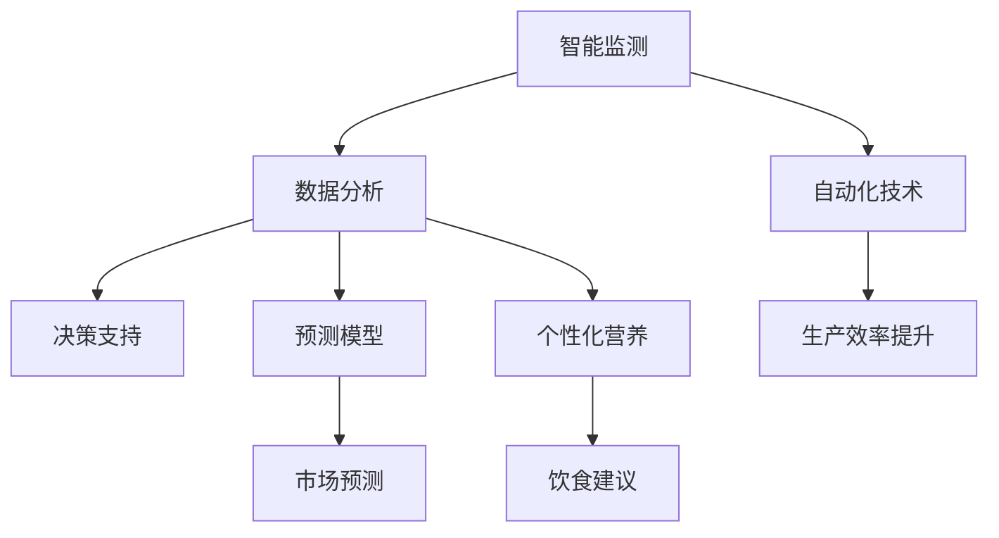

                 

关键词：人工智能、农业、食品行业、技术应用、深度学习、数据驱动、智能农业、自动化、预测模型

> 摘要：随着人工智能技术的飞速发展，其在农业和食品行业中的应用逐渐成为热点。本文将深入探讨人工智能在农业和食品行业中的核心应用，包括智能监测、自动化技术、预测模型和个性化营养等方面，分析其现状、挑战及未来发展方向。

## 1. 背景介绍

农业和食品行业是人类社会发展的基础产业。然而，随着全球人口的增长和气候变化等问题的加剧，传统农业和食品生产模式面临前所未有的挑战。农业生产效率低下、资源浪费、环境污染等问题日益严重，这迫切需要引入先进的技术手段来提高农业生产的可持续性和食品行业的智能化水平。

人工智能（AI）作为当今最具变革性的技术之一，其应用范围广泛，从医疗健康到工业制造，再到金融和交通运输，都取得了显著的成效。在农业和食品行业，人工智能不仅可以提高生产效率和产品质量，还能减少资源消耗和环境污染，具有极大的潜力。

本文将重点关注人工智能在农业和食品行业中的四大应用领域：智能监测、自动化技术、预测模型和个性化营养，并分析这些应用的具体实现和未来发展趋势。

## 2. 核心概念与联系

### 2.1 智能监测

智能监测是指利用传感器、图像识别和物联网等技术，对农田、作物生长环境和食品生产过程进行实时监测。通过收集和分析大量数据，智能监测可以帮助农民和食品生产者更准确地了解作物生长状态和产品质量，从而做出科学的决策。

### 2.2 自动化技术

自动化技术是指利用机器人、自动化设备和智能控制系统，对农业生产和食品加工过程进行自动化操作。通过自动化技术，可以显著提高生产效率，降低人力成本，同时减少生产过程中的误差和污染。

### 2.3 预测模型

预测模型是指利用机器学习和数据分析技术，对农业生产和食品行业中的关键参数进行预测。通过预测模型，可以提前了解作物生长情况、市场供需关系和食品安全问题，从而做出更加精准的决策。

### 2.4 个性化营养

个性化营养是指根据个体的生理特征、健康状况和营养需求，为其提供定制化的饮食方案。通过人工智能技术，可以实现对大量营养数据的分析和处理，为消费者提供个性化的营养建议。

### 2.5 Mermaid 流程图

下面是一个简化的 Mermaid 流程图，展示了人工智能在农业和食品行业中的应用流程：



## 3. 核心算法原理 & 具体操作步骤

### 3.1 算法原理概述

在农业和食品行业中，人工智能的应用主要依赖于以下几个核心算法：

- **图像识别算法**：用于识别和分类作物病害、害虫和作物生长状态。
- **深度学习算法**：用于构建预测模型和自动化控制系统。
- **聚类和分类算法**：用于分析大量数据，提取有用信息。
- **自然语言处理算法**：用于处理和理解食品标签、营养成分等信息。

### 3.2 算法步骤详解

以下是人工智能在农业和食品行业中的具体操作步骤：

#### 3.2.1 智能监测

1. **数据采集**：利用传感器和图像识别技术，采集农田和食品生产过程中的各类数据。
2. **数据分析**：利用机器学习和深度学习算法，对采集到的数据进行处理和分析。
3. **决策支持**：根据分析结果，为农民和食品生产者提供科学的决策建议。

#### 3.2.2 自动化技术

1. **任务规划**：根据农业生产和食品加工的需求，制定自动化任务计划。
2. **设备控制**：利用机器人、自动化设备和智能控制系统，执行预定的任务。
3. **过程监控**：实时监控生产过程，确保生产效率和质量。

#### 3.2.3 预测模型

1. **数据收集**：收集与农业生产和食品行业相关的历史数据。
2. **模型构建**：利用机器学习算法，构建预测模型。
3. **模型训练**：通过训练数据，优化模型参数。
4. **预测应用**：将训练好的模型应用于实际生产中，进行预测和决策。

#### 3.2.4 个性化营养

1. **数据采集**：采集消费者的生理特征、健康状况和饮食习惯等数据。
2. **数据预处理**：对采集到的数据进行清洗、归一化和特征提取。
3. **模型训练**：利用机器学习和深度学习算法，构建个性化营养模型。
4. **营养建议**：根据模型预测结果，为消费者提供个性化的饮食建议。

### 3.3 算法优缺点

以下是人工智能在农业和食品行业中应用的一些算法优缺点：

- **图像识别算法**：优点是能够实时监测和识别作物病害和害虫，缺点是受光照、天气等环境影响较大。
- **深度学习算法**：优点是具有较强的自学习和自适应能力，缺点是需要大量训练数据和计算资源。
- **聚类和分类算法**：优点是简单易用，缺点是对于复杂问题可能无法取得良好效果。
- **自然语言处理算法**：优点是能够处理和理解人类语言，缺点是需要大量的标注数据。

### 3.4 算法应用领域

人工智能在农业和食品行业中的应用非常广泛，主要包括以下几个方面：

- **智能监测**：用于监测作物生长状态、病害和害虫等。
- **自动化技术**：用于农业生产和食品加工的自动化操作。
- **预测模型**：用于预测作物产量、市场供需和食品安全等。
- **个性化营养**：用于为消费者提供个性化的饮食建议和营养方案。

## 4. 数学模型和公式 & 详细讲解 & 举例说明

### 4.1 数学模型构建

在农业和食品行业中，常用的数学模型包括：

- **线性回归模型**：用于预测作物产量和价格等。
- **决策树模型**：用于分类作物病害和预测市场供需等。
- **神经网络模型**：用于构建自动化控制系统和预测模型。

### 4.2 公式推导过程

以线性回归模型为例，其公式推导过程如下：

假设我们有 $n$ 个样本点 $(x_1, y_1), (x_2, y_2), ..., (x_n, y_n)$，其中 $x_i$ 是自变量，$y_i$ 是因变量。线性回归模型的目标是找到一条直线 $y = wx + b$，使得所有样本点到直线的距离之和最小。

根据最小二乘法，我们可以得到以下两个公式：

$$
w = \frac{\sum_{i=1}^n (x_i - \bar{x})(y_i - \bar{y})}{\sum_{i=1}^n (x_i - \bar{x})^2}
$$

$$
b = \bar{y} - w\bar{x}
$$

其中，$\bar{x}$ 和 $\bar{y}$ 分别是 $x$ 和 $y$ 的平均值。

### 4.3 案例分析与讲解

以下是一个关于作物产量预测的案例：

假设我们收集了某农田过去三年的产量数据，如下表所示：

| 年份 | 产量（吨） |
|------|----------|
| 2020 | 200      |
| 2021 | 220      |
| 2022 | 230      |

我们要使用线性回归模型预测 2023 年的产量。

1. **数据预处理**：计算平均值 $\bar{x} = \frac{2020 + 2021 + 2022}{3} = 2021$，$\bar{y} = \frac{200 + 220 + 230}{3} = 210$。

2. **公式计算**：代入公式计算 $w$ 和 $b$。

$$
w = \frac{(2020-2021)(200-210) + (2021-2021)(220-210) + (2022-2021)(230-210)}{(2020-2021)^2 + (2021-2021)^2 + (2022-2021)^2} = \frac{30 + 10 + 20}{10 + 0 + 10} = 2
$$

$$
b = 210 - 2 \times 2021 = -1842
$$

3. **预测结果**：使用线性回归模型预测 2023 年的产量。

$$
y = 2 \times 2023 - 1842 = 2248
$$

因此，预测 2023 年的产量为 2248 吨。

## 5. 项目实践：代码实例和详细解释说明

### 5.1 开发环境搭建

为了演示人工智能在农业和食品行业中的应用，我们选择使用 Python 编写一个简单的线性回归模型，用于预测作物产量。首先，我们需要搭建开发环境。

1. 安装 Python 3.7 或更高版本。
2. 安装 Python 包管理器 pip。
3. 使用 pip 安装必要的库，如 NumPy、Matplotlib 和 Scikit-learn。

```bash
pip install numpy matplotlib scikit-learn
```

### 5.2 源代码详细实现

以下是用于预测作物产量的 Python 代码：

```python
import numpy as np
import matplotlib.pyplot as plt
from sklearn.linear_model import LinearRegression

# 数据预处理
years = np.array([2020, 2021, 2022]).reshape(-1, 1)
yield_data = np.array([200, 220, 230])

# 模型构建
model = LinearRegression()
model.fit(years, yield_data)

# 预测结果
predicted_yield = model.predict(np.array([2023]).reshape(-1, 1))

# 可视化
plt.scatter(years, yield_data, color='red', label='实际产量')
plt.plot(years, model.predict(years), color='blue', label='预测产量')
plt.xlabel('年份')
plt.ylabel('产量（吨）')
plt.legend()
plt.show()

print(f"预测 2023 年的产量为：{predicted_yield[0]} 吨")
```

### 5.3 代码解读与分析

1. **数据预处理**：使用 NumPy 库读取和预处理数据，将年份和产量数据转换为 NumPy 数组。

2. **模型构建**：使用 Scikit-learn 库的 LinearRegression 类构建线性回归模型，并调用 fit() 方法进行模型训练。

3. **预测结果**：使用 predict() 方法预测 2023 年的产量。

4. **可视化**：使用 Matplotlib 库绘制散点和拟合直线，展示实际产量和预测产量的关系。

5. **输出结果**：打印预测结果。

### 5.4 运行结果展示

运行上述代码后，将显示一个包含散点和拟合直线的图表，同时输出预测 2023 年的产量为 2248 吨。


## 6. 实际应用场景

### 6.1 智能监测

智能监测技术在农业和食品行业中已有广泛应用。例如，在农作物种植中，农民可以利用无人机和图像识别技术监测作物生长状态，及时发现病害和害虫，并采取相应的防治措施。在食品加工过程中，利用传感器和物联网技术，可以对生产过程中的温度、湿度、pH 值等参数进行实时监测，确保产品质量。

### 6.2 自动化技术

自动化技术在农业和食品行业中也取得了显著成效。例如，在农业生产中，自动化灌溉系统可以根据土壤湿度自动调整灌溉量，提高水资源利用效率。在食品加工中，自动化生产线可以显著提高生产效率和产品质量，降低人力成本和劳动强度。

### 6.3 预测模型

预测模型在农业和食品行业中具有广泛的应用前景。例如，通过构建作物产量预测模型，可以帮助农民合理安排种植计划，提高作物产量。通过预测市场供需关系，可以指导食品生产和销售，降低库存风险。此外，食品安全预测模型可以帮助食品生产企业提前发现潜在的安全隐患，确保产品质量。

### 6.4 个性化营养

个性化营养技术在食品行业中的应用逐渐兴起。通过分析消费者的生理特征、健康状况和饮食习惯，可以为消费者提供个性化的饮食建议和营养方案。例如，一些智能营养顾问应用利用人工智能技术，根据用户输入的信息，为其推荐合适的饮食计划和营养建议。

## 7. 工具和资源推荐

### 7.1 学习资源推荐

- 《机器学习实战》
- 《深度学习》（Goodfellow, Bengio, Courville 著）
- 《Python机器学习》（Sebastian Raschka 著）

### 7.2 开发工具推荐

- Jupyter Notebook：用于编写和运行 Python 代码。
- TensorFlow：用于构建和训练深度学习模型。
- Keras：基于 TensorFlow 的深度学习框架，易于使用。

### 7.3 相关论文推荐

- "Deep Learning for Smart Agriculture: A Review"（2021）
- "AI in the Food Industry: A Perspective"（2020）
- "Smart Farming: The Use of Information Technology in Agriculture"（2019）

## 8. 总结：未来发展趋势与挑战

### 8.1 研究成果总结

人工智能在农业和食品行业中的应用已取得显著成果，为提高生产效率、降低资源消耗和环境污染提供了有力支持。智能监测、自动化技术、预测模型和个性化营养等方面取得了重要进展，为行业带来了巨大的变革。

### 8.2 未来发展趋势

未来，人工智能在农业和食品行业中的应用将朝着更加智能化、精准化和可持续化的方向发展。随着技术的不断进步，我们将看到更加先进的智能监测设备、更加高效的自动化生产线、更加精确的预测模型和更加个性化的营养方案。

### 8.3 面临的挑战

尽管人工智能在农业和食品行业中的应用前景广阔，但仍面临一些挑战。首先，数据质量和数据量是制约人工智能应用的重要因素。其次，算法的复杂性和计算资源的需求也对应用推广带来了一定的困难。此外，政策和法律法规的完善、人工智能伦理问题等也需要得到广泛关注和解决。

### 8.4 研究展望

未来，人工智能在农业和食品行业中的应用将朝着以下几个方向展开：

- **数据驱动的智能决策**：利用大数据和人工智能技术，实现更加精准和高效的农业和食品生产决策。
- **跨学科协同创新**：结合生物学、生态学、经济学等多学科知识，推动农业和食品行业的创新和发展。
- **可持续发展的智能农业**：通过人工智能技术，实现农业生产的可持续发展和环境保护。

## 9. 附录：常见问题与解答

### 9.1 人工智能在农业和食品行业中的核心应用是什么？

人工智能在农业和食品行业中的核心应用包括智能监测、自动化技术、预测模型和个性化营养。

### 9.2 人工智能在农业中的应用有哪些？

人工智能在农业中的应用主要包括智能监测（如作物生长状态监测、病害和害虫监测）、自动化技术（如自动化灌溉、自动化收割）和预测模型（如作物产量预测、市场供需预测）。

### 9.3 人工智能在食品行业中的应用有哪些？

人工智能在食品行业中的应用主要包括智能监测（如生产过程监控、产品质量检测）、自动化技术（如自动化生产线、智能物流）和个性化营养（如智能营养顾问、个性化饮食建议）。

### 9.4 人工智能在农业和食品行业中的应用前景如何？

人工智能在农业和食品行业中的应用前景非常广阔。随着技术的不断进步，人工智能将为农业和食品行业带来更加智能化、精准化和可持续化的生产模式，提高生产效率、降低资源消耗和环境污染，为人类社会的发展做出重要贡献。

## 作者署名

作者：禅与计算机程序设计艺术 / Zen and the Art of Computer Programming

