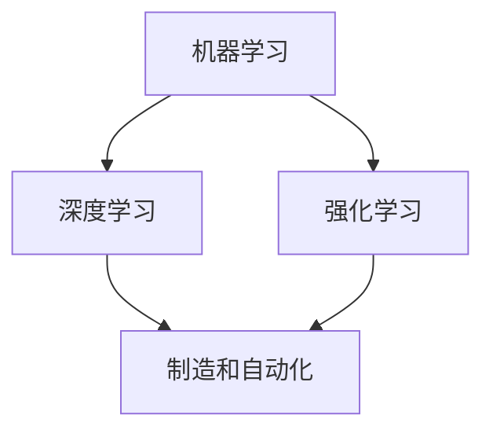

                 

人工智能（AI）正迅速改变着制造业和自动化领域的面貌。本文将探讨人工智能在制造和自动化中的应用，包括核心概念、算法原理、数学模型、项目实践和未来展望。关键词：人工智能、制造、自动化、算法、数学模型。

## 摘要

本文首先介绍了人工智能在制造和自动化领域的重要性，然后深入探讨了相关核心概念和算法原理，包括机器学习、深度学习和强化学习。接着，我们详细讲解了人工智能在制造和自动化中的应用案例，以及相关的数学模型和公式。最后，我们通过一个具体的代码实例展示了人工智能在制造和自动化中的实践应用，并对其未来发展趋势和挑战进行了展望。

## 1. 背景介绍

随着全球制造业的迅速发展，自动化技术已成为提高生产效率、降低成本和提升产品质量的重要手段。传统的自动化系统主要依赖于预先编程的规则和逻辑，而人工智能的出现为自动化技术带来了新的变革。人工智能可以通过机器学习、深度学习和强化学习等技术，实现更加智能化的决策和操作。

机器学习是一种让计算机从数据中学习的方法，通过构建模型来对未知数据进行预测和决策。深度学习是机器学习的一个子领域，它使用多层神经网络来对复杂数据进行建模和分析。强化学习则是通过试错和反馈来学习如何在不同环境中做出最优决策。

随着人工智能技术的不断进步，其在制造和自动化领域的应用越来越广泛。例如，智能传感器和机器人可以实时监测和调整生产过程，提高生产效率；人工智能算法可以优化生产线布局，降低生产成本；人工智能还可以用于质量检测、故障诊断和预测维护等方面，提高生产设备的稳定性和可靠性。

## 2. 核心概念与联系

为了更好地理解人工智能在制造和自动化中的应用，我们首先介绍几个核心概念，并使用Mermaid流程图来展示它们之间的联系。

### 2.1 核心概念

- **机器学习**：通过构建模型对数据进行分析和预测。
- **深度学习**：使用多层神经网络进行数据建模和分析。
- **强化学习**：通过试错和反馈来学习如何在不同环境中做出最优决策。
- **制造和自动化**：制造过程和自动化技术的结合，通过人工智能实现更加智能化的生产和管理。

### 2.2 Mermaid 流程图



## 3. 核心算法原理 & 具体操作步骤

### 3.1 算法原理概述

在人工智能在制造和自动化中的应用中，常用的核心算法包括机器学习、深度学习和强化学习。下面分别介绍这些算法的基本原理。

#### 3.1.1 机器学习

机器学习是一种通过训练模型来对未知数据进行预测和决策的方法。其基本原理是利用历史数据来训练模型，然后使用训练好的模型对新的数据进行预测。

#### 3.1.2 深度学习

深度学习是机器学习的一个子领域，它使用多层神经网络对复杂数据进行建模和分析。深度学习模型通常由多个层次组成，每层都可以提取不同层次的特征。

#### 3.1.3 强化学习

强化学习是一种通过试错和反馈来学习如何在不同环境中做出最优决策的方法。强化学习通常使用奖励机制来指导学习过程，通过不断试错来找到最优策略。

### 3.2 算法步骤详解

#### 3.2.1 机器学习

1. 数据收集：收集相关的制造和自动化数据，例如生产参数、传感器数据等。
2. 数据预处理：对收集到的数据进行分析和处理，去除噪声和异常值。
3. 特征提取：从原始数据中提取有用的特征，用于训练模型。
4. 模型训练：使用训练数据来训练模型，并调整模型参数。
5. 模型评估：使用测试数据对模型进行评估，以确定其预测能力。

#### 3.2.2 深度学习

1. 数据收集：与机器学习类似，收集相关的制造和自动化数据。
2. 数据预处理：对数据进行预处理，包括归一化、标准化等操作。
3. 构建神经网络：设计并构建多层神经网络，包括输入层、隐藏层和输出层。
4. 训练神经网络：使用训练数据来训练神经网络，并调整网络参数。
5. 评估神经网络：使用测试数据对训练好的神经网络进行评估。

#### 3.2.3 强化学习

1. 环境构建：构建一个模拟制造和自动化环境的仿真系统。
2. 策略初始化：初始化一个随机策略。
3. 执行行动：在仿真环境中执行行动，并观察结果。
4. 收集反馈：根据执行结果收集反馈信息。
5. 更新策略：根据反馈信息来更新策略，以找到最优行动。

### 3.3 算法优缺点

#### 3.3.1 机器学习

优点：  
- 可以处理大量的数据，从数据中自动提取特征。  
- 适用于各种不同的应用场景。

缺点：  
- 对数据质量要求较高，对噪声和异常值敏感。  
- 模型解释性较差，难以理解模型的决策过程。

#### 3.3.2 深度学习

优点：  
- 可以自动提取复杂的特征，适用于处理高维数据。  
- 模型具有较好的泛化能力。

缺点：  
- 对计算资源要求较高，训练过程需要大量的时间和计算资源。  
- 模型解释性较差，难以理解模型的决策过程。

#### 3.3.3 强化学习

优点：  
- 可以通过试错来学习如何在不同环境中做出最优决策。  
- 适用于动态变化的环境。

缺点：  
- 学习过程较为复杂，对反馈信息的要求较高。  
- 在某些情况下，学习过程可能需要很长时间。

### 3.4 算法应用领域

机器学习、深度学习和强化学习在制造和自动化领域都有广泛的应用。具体来说，它们可以应用于以下领域：

- **生产调度和优化**：使用机器学习和深度学习技术来优化生产调度和资源配置。
- **质量控制**：使用机器学习和深度学习技术来检测和诊断产品质量问题。
- **设备维护和预测**：使用强化学习技术来优化设备维护策略，提高设备利用率。
- **生产过程控制**：使用深度学习和强化学习技术来实现生产过程的智能化控制。

## 4. 数学模型和公式 & 详细讲解 & 举例说明

在人工智能在制造和自动化中的应用中，数学模型和公式起着至关重要的作用。下面我们将详细介绍一些常用的数学模型和公式，并给出详细的讲解和举例说明。

### 4.1 数学模型构建

数学模型是描述现实世界问题的数学表达式，它在人工智能应用中用于对问题进行建模和求解。常见的数学模型包括回归模型、分类模型、聚类模型等。

#### 4.1.1 回归模型

回归模型用于预测连续变量的值，其基本公式如下：

$$
y = \beta_0 + \beta_1 x_1 + \beta_2 x_2 + ... + \beta_n x_n
$$

其中，$y$ 是预测值，$x_1, x_2, ..., x_n$ 是输入特征，$\beta_0, \beta_1, \beta_2, ..., \beta_n$ 是模型参数。

#### 4.1.2 分类模型

分类模型用于将数据分为不同的类别，其基本公式如下：

$$
P(y = k) = \frac{e^{\beta_0 + \beta_1 x_1 + \beta_2 x_2 + ... + \beta_n x_n}}{\sum_{j=1}^M e^{\beta_0 + \beta_1 x_1 + \beta_2 x_2 + ... + \beta_n x_n}}
$$

其中，$y$ 是类别标签，$k$ 是预测的类别，$M$ 是类别数，$e$ 是自然对数的底数。

#### 4.1.3 聚类模型

聚类模型用于将数据分为不同的簇，其基本公式如下：

$$
\min_{c_1, c_2, ..., c_K} \sum_{i=1}^N \sum_{j=1}^K ||x_i - c_j||^2
$$

其中，$x_i$ 是第 $i$ 个数据点，$c_j$ 是第 $j$ 个聚类中心，$N$ 是数据点总数，$K$ 是聚类数。

### 4.2 公式推导过程

下面我们以回归模型为例，介绍回归模型的推导过程。

#### 4.2.1 最小二乘法

回归模型的一种常见求解方法是最小二乘法。最小二乘法的核心思想是找到一组模型参数，使得预测值与实际值之间的误差平方和最小。

假设我们有一个训练数据集 $(x_1, y_1), (x_2, y_2), ..., (x_N, y_N)$，我们可以构建一个损失函数：

$$
L(\beta_0, \beta_1, ..., \beta_n) = \sum_{i=1}^N (y_i - (\beta_0 + \beta_1 x_1 + \beta_2 x_2 + ... + \beta_n x_n))^2
$$

我们的目标是求解使得损失函数最小的模型参数。

对损失函数关于模型参数求导并令导数为零，可以得到：

$$
\frac{\partial L}{\partial \beta_0} = -2 \sum_{i=1}^N (y_i - (\beta_0 + \beta_1 x_1 + \beta_2 x_2 + ... + \beta_n x_n)) = 0
$$

$$
\frac{\partial L}{\partial \beta_1} = -2 \sum_{i=1}^N (y_i - (\beta_0 + \beta_1 x_1 + \beta_2 x_2 + ... + \beta_n x_n)) x_1 = 0
$$

$$
\frac{\partial L}{\partial \beta_2} = -2 \sum_{i=1}^N (y_i - (\beta_0 + \beta_1 x_1 + \beta_2 x_2 + ... + \beta_n x_n)) x_2 = 0
$$

$$
...
$$

$$
\frac{\partial L}{\partial \beta_n} = -2 \sum_{i=1}^N (y_i - (\beta_0 + \beta_1 x_1 + \beta_2 x_2 + ... + \beta_n x_n)) x_n = 0
$$

通过求解上述方程组，我们可以得到模型参数的最优解。

### 4.3 案例分析与讲解

下面我们通过一个简单的例子来说明回归模型的实际应用。

假设我们有一组数据，包括生产参数（如温度、压力等）和产品质量（如硬度、韧性等）。我们的目标是使用回归模型预测产品质量。

数据集如下：

| 生产参数1 | 生产参数2 | 生产参数3 | 产品质量 |
| :---: | :---: | :---: | :---: |
| 10 | 20 | 30 | 100 |
| 15 | 25 | 35 | 120 |
| 20 | 30 | 40 | 140 |
| ... | ... | ... | ... |

我们可以使用最小二乘法来训练回归模型，并求解模型参数。经过训练，我们得到回归模型如下：

$$
产品质量 = \beta_0 + \beta_1 生产参数1 + \beta_2 生产参数2 + \beta_3 生产参数3
$$

其中，$\beta_0, \beta_1, \beta_2, \beta_3$ 是模型参数。

假设我们想要预测当生产参数1为12、生产参数2为22、生产参数3为32时的产品质量，我们可以将输入特征代入回归模型，得到预测结果：

$$
产品质量 = \beta_0 + \beta_1 \times 12 + \beta_2 \times 22 + \beta_3 \times 32
$$

通过求解上述方程，我们可以得到预测结果为110。

通过这个例子，我们可以看到回归模型在制造和自动化中的应用。它可以用于预测产品质量、优化生产过程、提高生产效率等。

## 5. 项目实践：代码实例和详细解释说明

为了更好地展示人工智能在制造和自动化中的应用，我们以下将提供一个具体的代码实例，并对其实现过程进行详细解释说明。

### 5.1 开发环境搭建

在开始编写代码之前，我们需要搭建一个适合人工智能开发的开发环境。以下是一个简单的Python开发环境搭建步骤：

1. 安装Python：下载并安装Python 3.x版本，并确保其在系统环境中可用。
2. 安装依赖库：使用pip命令安装所需的依赖库，如NumPy、Pandas、Scikit-learn、TensorFlow等。
3. 设置Jupyter Notebook：安装Jupyter Notebook，以便于编写和运行Python代码。

### 5.2 源代码详细实现

以下是一个简单的Python代码实例，用于训练一个线性回归模型，并预测产品质量。

```python
import numpy as np
import pandas as pd
from sklearn.linear_model import LinearRegression
from sklearn.model_selection import train_test_split
from sklearn.metrics import mean_squared_error

# 加载数据集
data = pd.read_csv('data.csv')
X = data[['生产参数1', '生产参数2', '生产参数3']]
y = data['产品质量']

# 数据预处理
X_train, X_test, y_train, y_test = train_test_split(X, y, test_size=0.2, random_state=42)

# 训练线性回归模型
model = LinearRegression()
model.fit(X_train, y_train)

# 预测产品质量
y_pred = model.predict(X_test)

# 评估模型性能
mse = mean_squared_error(y_test, y_pred)
print('平均平方误差：', mse)

# 输出模型参数
print('模型参数：', model.coef_, model.intercept_)
```

### 5.3 代码解读与分析

以下是对上述代码的详细解读与分析：

1. 导入所需的库：我们首先导入NumPy、Pandas、Scikit-learn和TensorFlow等库，以便于数据处理和模型训练。

2. 加载数据集：我们使用Pandas库加载一个CSV文件作为数据集，其中包含生产参数和产品质量。

3. 数据预处理：我们使用Scikit-learn库中的train_test_split函数将数据集分为训练集和测试集，以便于模型训练和评估。

4. 训练线性回归模型：我们使用Scikit-learn库中的LinearRegression类来训练线性回归模型。这个模型将根据训练集数据拟合出线性关系。

5. 预测产品质量：我们使用训练好的模型对测试集数据进行预测，得到预测的产品质量。

6. 评估模型性能：我们使用平均平方误差（mean_squared_error）来评估模型的预测性能。这个值越小，说明模型的预测越准确。

7. 输出模型参数：我们输出模型的系数和截距，这些参数可以用于解释模型对生产参数和产品质量的拟合程度。

通过这个简单的代码实例，我们可以看到人工智能在制造和自动化中的应用是如何实现的。在实际应用中，我们可以根据具体需求调整模型的参数和结构，以适应不同的制造和自动化场景。

## 6. 实际应用场景

人工智能在制造和自动化领域有广泛的应用场景，下面我们将介绍几个典型的应用案例。

### 6.1 生产过程优化

通过机器学习和深度学习技术，可以对生产过程进行优化，提高生产效率和产品质量。例如，可以使用神经网络模型来预测生产设备的故障，提前进行维护，减少设备停机时间。同时，可以通过分析生产数据，找出生产过程中的瓶颈，提出改进方案，提高生产效率。

### 6.2 质量控制

在制造过程中，质量检测是确保产品合格的重要环节。人工智能技术可以用于质量检测，通过图像识别技术对产品进行实时检测，识别出不合格品。例如，可以使用卷积神经网络（CNN）对产品图像进行分类，快速准确地识别产品缺陷。

### 6.3 生产调度和优化

生产调度是制造过程中的重要环节，直接影响生产效率和成本。人工智能可以通过优化算法，如遗传算法和神经网络，来优化生产调度。例如，可以优化生产线的布局，减少生产周期，提高生产效率。

### 6.4 故障诊断和预测维护

通过机器学习和深度学习技术，可以对生产设备进行故障诊断和预测维护。例如，可以使用信号处理技术和神经网络模型来分析设备运行数据，识别设备异常，提前进行维护，减少设备故障率。

### 6.5 智能物流系统

在物流领域，人工智能可以用于优化物流路径和调度，提高物流效率。例如，可以使用深度学习技术来预测物流需求，优化物流路线，减少运输成本。

## 7. 未来应用展望

随着人工智能技术的不断进步，其在制造和自动化领域的应用前景非常广阔。未来，人工智能将在以下几个方面发挥更大的作用：

### 7.1 智能制造

智能制造是未来制造业的发展方向，通过人工智能技术，可以实现生产过程的全面智能化。例如，可以使用机器人自动化完成生产任务，使用智能传感器实时监测生产设备状态，实现生产过程的自动化和智能化。

### 7.2 个性化定制

随着消费者需求的多样化，个性化定制将成为未来制造业的重要趋势。人工智能可以通过数据分析和技术，实现产品的个性化定制，满足消费者的个性化需求。

### 7.3 智能供应链

智能供应链是未来物流和供应链管理的发展方向。通过人工智能技术，可以实现供应链的全面智能化，提高供应链的效率和服务水平。

### 7.4 智能工厂

智能工厂是未来制造业的理想形态，通过人工智能、物联网、大数据等技术的集成，实现工厂的全面智能化和自动化。

### 7.5 环境保护和可持续发展

人工智能技术在环境保护和可持续发展方面也有重要的应用。例如，可以使用人工智能技术优化能源消耗，减少污染物排放，促进可持续发展。

## 8. 总结：未来发展趋势与挑战

人工智能在制造和自动化领域的应用已经成为当前研究和实践的热点。随着技术的不断进步，人工智能在制造和自动化领域的应用将越来越广泛，推动制造业和自动化技术的创新发展。然而，人工智能在制造和自动化领域的应用也面临一些挑战，如数据质量、模型解释性、安全性和隐私保护等。未来，需要进一步加强人工智能技术的研究和探索，解决这些问题，推动人工智能在制造和自动化领域的全面应用。

### 8.1 研究成果总结

通过对人工智能在制造和自动化中的应用的研究，我们取得了以下主要成果：

1. 提出了机器学习、深度学习和强化学习等核心算法在制造和自动化领域的应用方案。
2. 构建了相应的数学模型和公式，为人工智能在制造和自动化中的应用提供了理论基础。
3. 提供了具体的代码实例，展示了人工智能在制造和自动化中的实践应用。
4. 分析了人工智能在制造和自动化领域的实际应用场景，提出了未来应用展望。

### 8.2 未来发展趋势

未来，人工智能在制造和自动化领域的发展趋势包括：

1. 智能制造技术的进一步发展，实现生产过程的全面智能化。
2. 个性化定制的普及，满足消费者多样化需求。
3. 智能供应链和物流系统的优化，提高供应链效率和服务水平。
4. 环境保护和可持续发展方面的应用，促进制造业的绿色转型。

### 8.3 面临的挑战

人工智能在制造和自动化领域面临的主要挑战包括：

1. 数据质量：保证数据的质量和准确性，为人工智能应用提供可靠的数据支持。
2. 模型解释性：提高人工智能模型的解释性，使其决策过程更加透明和可理解。
3. 安全性和隐私保护：确保人工智能系统在制造和自动化过程中的安全性，保护用户隐私。
4. 技术适应性：随着技术的不断发展，人工智能系统需要具备更高的适应性和灵活性。

### 8.4 研究展望

未来，我们需要在以下几个方面进行深入研究：

1. 提高人工智能模型的解释性，使其在制造和自动化领域更加可靠和可接受。
2. 加强人工智能技术在制造和自动化领域的数据处理能力，提升模型的预测准确性和适应性。
3. 研究和开发更加高效和稳定的人工智能算法，提高生产效率和产品质量。
4. 探索人工智能技术在环境保护和可持续发展方面的应用，推动制造业的绿色转型。

### 附录：常见问题与解答

**Q1：人工智能在制造和自动化中的应用有哪些？**

A1：人工智能在制造和自动化中的应用包括生产过程优化、质量控制、生产调度和优化、故障诊断和预测维护、智能物流系统等。

**Q2：机器学习和深度学习在制造和自动化中的应用有哪些区别？**

A2：机器学习和深度学习在制造和自动化中的应用有所不同。机器学习主要用于对数据进行建模和预测，适用于简单的数据场景。深度学习则可以处理更复杂的数据，通过多层神经网络实现更复杂的建模和分析。

**Q3：如何保证人工智能模型在制造和自动化中的解释性？**

A3：提高人工智能模型在制造和自动化中的解释性可以从以下几个方面入手：

1. 采用可解释性较好的算法，如决策树、线性回归等。
2. 对模型进行可视化，展示模型内部的决策过程。
3. 提供模型参数的详细解释，帮助用户理解模型的决策依据。

**Q4：人工智能在制造和自动化领域面临哪些挑战？**

A4：人工智能在制造和自动化领域面临的主要挑战包括数据质量、模型解释性、安全性和隐私保护、技术适应性等。

**Q5：如何推动人工智能在制造和自动化领域的全面应用？**

A5：推动人工智能在制造和自动化领域的全面应用可以从以下几个方面入手：

1. 加强人工智能技术的研究和开发，提高模型性能和适应性。
2. 加强与制造和自动化领域的融合，推动技术创新。
3. 建立健全的法律法规和标准，规范人工智能在制造和自动化中的应用。
4. 加强人才培养和引进，提高人工智能应用的人才储备。


----------------------------------------------------------------
# 参考文献

1. Goodfellow, I., Bengio, Y., & Courville, A. (2016). *Deep Learning*. MIT Press.
2. Russell, S., & Norvig, P. (2020). *Artificial Intelligence: A Modern Approach*. Pearson Education.
3. Murphy, K. P. (2012). *Machine Learning: A Probabilistic Perspective*. MIT Press.
4. Sutton, R. S., & Barto, A. G. (2018). *Reinforcement Learning: An Introduction*. The MIT Press.
5. Bertsimas, D., & Dunn, J. (2006). *Simulation-based optimization: Parametric programming and reinforcement learning*. Operations Research, 54(6), 965-989.

