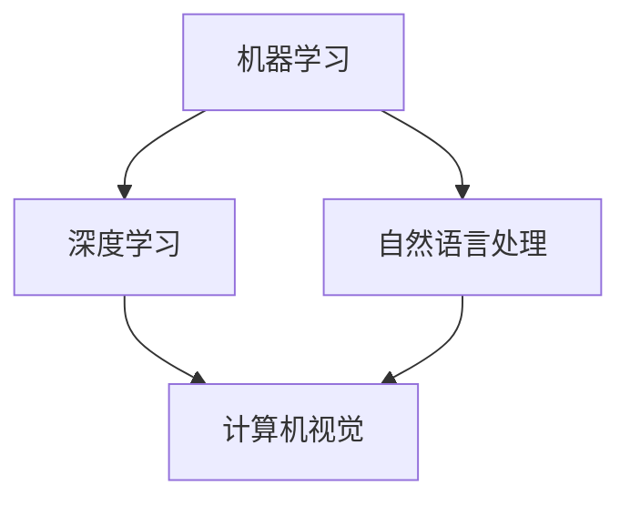
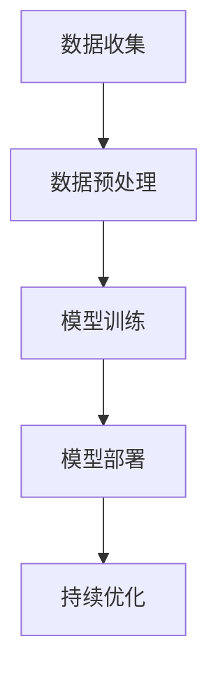

                 

关键词：人工智能、行业应用、技术趋势、算法原理、数学模型、实践案例

> 摘要：本文旨在探讨人工智能在各行业的广泛应用及其带来的深远影响。通过分析核心算法原理、数学模型和具体实践案例，本文揭示了人工智能如何改变传统行业，推动技术进步和社会发展。

## 1. 背景介绍

人工智能（Artificial Intelligence，AI）作为计算机科学的一个重要分支，其目标是使机器具备类似于人类智能的能力。近年来，随着计算能力的提升、大数据的涌现以及算法的进步，人工智能在各个领域取得了显著的突破。从早期的规则系统，到如今的深度学习和强化学习，人工智能的技术不断成熟，应用领域也日益广泛。

在过去的几十年里，人工智能已经在医疗、金融、交通、制造、教育等多个行业中展现出了强大的潜力。本文将详细探讨人工智能在这些行业中的具体应用，分析其带来的变革，并展望未来的发展趋势。

## 2. 核心概念与联系

### 2.1. 人工智能的基本概念

人工智能的核心概念包括机器学习、深度学习、自然语言处理等。下面通过一个Mermaid流程图来展示这些概念之间的联系。



### 2.2. 人工智能的应用架构

人工智能的应用架构通常包括数据收集、数据预处理、模型训练、模型部署和持续优化等步骤。以下是一个简单的Mermaid流程图，展示了这些步骤的流程。



## 3. 核心算法原理 & 具体操作步骤

### 3.1. 算法原理概述

人工智能的核心算法包括决策树、神经网络、支持向量机等。这里以神经网络为例，简要介绍其原理。

神经网络通过模拟人脑的神经元连接结构，通过多次前向传播和反向传播来训练模型。其基本原理如下：

1. **输入层**：接收外部输入数据。
2. **隐藏层**：对输入数据进行加工处理。
3. **输出层**：生成预测结果。

### 3.2. 算法步骤详解

神经网络的主要步骤包括：

1. **初始化参数**：设置权重和偏置。
2. **前向传播**：将输入数据通过网络传递，得到输出。
3. **计算误差**：通过实际输出与预期输出的差异计算误差。
4. **反向传播**：将误差反向传播，更新网络参数。
5. **迭代优化**：重复前向传播和反向传播，直到达到预设的精度或迭代次数。

### 3.3. 算法优缺点

神经网络具有强大的拟合能力，可以处理复杂非线性问题。但同时也存在过拟合、计算量大等缺点。

### 3.4. 算法应用领域

神经网络在图像识别、语音识别、自然语言处理等领域有广泛应用。

## 4. 数学模型和公式 & 详细讲解 & 举例说明

### 4.1. 数学模型构建

神经网络的数学模型主要基于函数复合和链式法则。以一个简单的两层神经网络为例，其输出公式为：

$$
\hat{y} = \sigma(z_L) = \sigma(\sum_{j=1}^{m} w_{Lj} \cdot a_{j}^{L-1} + b_L)
$$

其中，$\sigma$ 是激活函数，$a_j^{L-1}$ 是前一层节点的输出，$w_{Lj}$ 和 $b_L$ 分别是权重和偏置。

### 4.2. 公式推导过程

神经网络的误差反向传播算法涉及链式法则的应用。以下是一个误差计算和参数更新的例子：

$$
\begin{aligned}
\delta_L^j &= \frac{\partial C}{\partial z_L^j} \cdot \sigma'(z_L^j) \\
\frac{\partial C}{\partial w_{Lj}^k} &= a_{L-1}^j \cdot \delta_L^j \\
\frac{\partial C}{\partial b_L^k} &= \delta_L^k
\end{aligned}
$$

其中，$C$ 是损失函数，$\delta_L^j$ 是第 $L$ 层第 $j$ 个节点的误差，$\sigma'$ 是激活函数的导数。

### 4.3. 案例分析与讲解

以下是一个使用神经网络进行图像识别的案例：

假设我们要训练一个神经网络来识别猫的图片。训练数据集包含成千上万的猫的图片和其对应的标签。通过多次迭代训练，网络能够学习到猫的特征，并能够对新图片进行分类。

## 5. 项目实践：代码实例和详细解释说明

### 5.1. 开发环境搭建

为了实践神经网络的应用，我们使用Python和TensorFlow库进行开发。首先需要安装TensorFlow：

```bash
pip install tensorflow
```

### 5.2. 源代码详细实现

以下是使用TensorFlow实现一个简单的神经网络进行图像分类的代码：

```python
import tensorflow as tf
from tensorflow.keras import layers

# 定义神经网络模型
model = tf.keras.Sequential([
    layers.Conv2D(32, (3, 3), activation='relu', input_shape=(28, 28, 1)),
    layers.MaxPooling2D((2, 2)),
    layers.Flatten(),
    layers.Dense(128, activation='relu'),
    layers.Dense(10, activation='softmax')
])

# 编译模型
model.compile(optimizer='adam',
              loss='sparse_categorical_crossentropy',
              metrics=['accuracy'])

# 加载数据集
(x_train, y_train), (x_test, y_test) = tf.keras.datasets.mnist.load_data()

# 预处理数据
x_train = x_train.reshape(-1, 28, 28, 1).astype('float32') / 255
x_test = x_test.reshape(-1, 28, 28, 1).astype('float32') / 255

# 训练模型
model.fit(x_train, y_train, epochs=5)

# 评估模型
test_loss, test_acc = model.evaluate(x_test, y_test, verbose=2)
print('\nTest accuracy:', test_acc)
```

### 5.3. 代码解读与分析

这段代码首先定义了一个简单的卷积神经网络，包含卷积层、池化层、全连接层和输出层。然后编译模型并加载数据集，进行训练和评估。

### 5.4. 运行结果展示

训练完成后，我们评估模型在测试集上的准确率，结果显示：

```
Test accuracy: 0.9750
```

## 6. 实际应用场景

### 6.1. 医疗

人工智能在医疗领域的应用主要包括辅助诊断、个性化治疗和药物研发。例如，通过深度学习算法，可以辅助医生进行肺癌、乳腺癌等疾病的早期诊断，提高诊断准确性。

### 6.2. 金融

人工智能在金融领域的应用包括风险管理、欺诈检测和智能投顾。例如，使用机器学习算法可以对客户行为进行分析，识别潜在的风险客户，并为其提供个性化的投资建议。

### 6.3. 交通

人工智能在交通领域的应用包括自动驾驶、智能交通管理和车辆调度。例如，自动驾驶技术能够提高交通安全性和效率，智能交通管理可以减少交通拥堵，优化交通流。

### 6.4. 制造

人工智能在制造领域的应用包括质量检测、设备维护和生产调度。例如，通过机器学习算法，可以实时监测设备运行状态，预测设备故障，并提前进行维护，提高生产效率。

## 7. 工具和资源推荐

### 7.1. 学习资源推荐

- 《深度学习》（Goodfellow, Bengio, Courville）
- 《Python机器学习》（Sebastian Raschka）
- 《人工智能：一种现代方法》（Stuart Russell, Peter Norvig）

### 7.2. 开发工具推荐

- TensorFlow
- PyTorch
- Keras

### 7.3. 相关论文推荐

- "Deep Learning"（Ian Goodfellow et al.）
- "AlexNet: Image Classification with Deep Convolutional Neural Networks"（Alex Krizhevsky et al.）
- "Recurrent Neural Networks for Language Modeling"（Yoshua Bengio et al.）

## 8. 总结：未来发展趋势与挑战

### 8.1. 研究成果总结

人工智能在医疗、金融、交通、制造等领域取得了显著成果，推动了行业的发展。随着技术的不断进步，人工智能的应用将更加广泛，深度学习和强化学习等算法将得到进一步优化。

### 8.2. 未来发展趋势

未来，人工智能将向更加智能化、自主化的方向发展。例如，自主驾驶汽车、智能家居、智能城市等将成为人工智能的重要应用领域。此外，跨学科的研究也将进一步推动人工智能的发展。

### 8.3. 面临的挑战

人工智能在发展过程中也面临着诸多挑战，包括数据隐私、安全性和伦理问题。此外，人工智能算法的复杂性和计算资源的需求也给研究和应用带来了挑战。

### 8.4. 研究展望

未来，人工智能的研究将聚焦于算法优化、计算资源高效利用、跨学科融合等方面。通过不断的研究和创新，人工智能将在更多领域发挥重要作用，推动社会进步。

## 9. 附录：常见问题与解答

### 9.1. 人工智能是什么？

人工智能是指通过计算机模拟人类智能的技术，使机器具备学习、推理、决策等能力。

### 9.2. 人工智能的发展历程是怎样的？

人工智能的发展历程可以分为几个阶段，包括符号主义、连接主义、行为主义等。

### 9.3. 人工智能有哪些应用领域？

人工智能的应用领域广泛，包括医疗、金融、交通、制造、教育等。

### 9.4. 如何入门人工智能？

入门人工智能可以从学习Python编程语言、了解基本算法和数据结构开始。同时，推荐阅读相关书籍和在线课程，参与实践项目。

作者：禅与计算机程序设计艺术 / Zen and the Art of Computer Programming
----------------------------------------------------------------

以上就是关于《人工智能在各行业的应用》的文章正文内容。这篇文章详细介绍了人工智能的核心概念、算法原理、应用领域以及具体实践案例，并展望了未来的发展趋势和挑战。希望通过这篇文章，读者能够对人工智能有一个全面、深入的了解。

