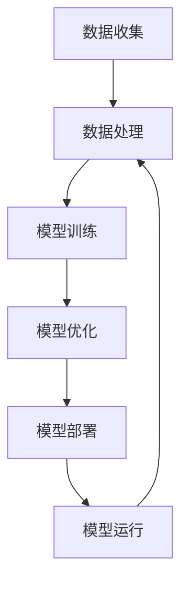

                 

### 背景介绍 Background

人工智能（Artificial Intelligence, AI）作为计算机科学的一个分支，旨在使计算机具备人类智能，进行感知、学习、推理、决策等复杂任务。自20世纪50年代诞生以来，人工智能经历了数次的“AI寒冬”和“AI春天”，如今已步入深度学习和大数据时代，展现出前所未有的发展潜力。随着计算能力的提升、大数据技术的进步以及算法的创新，人工智能的应用场景越来越广泛，其对各行各业的影响也日益深远。

### 人工智能在各行业中的应用现状 Application Status

当前，人工智能已在众多行业展现出显著的应用效果。在医疗领域，AI被用于疾病诊断、药物研发、个性化治疗等方面，如通过深度学习算法实现肺癌筛查、通过自然语言处理技术分析医学文献等。在金融领域，AI技术被广泛应用于风险控制、投资决策、智能客服等方面，提高了金融机构的运营效率和风险管理能力。在交通领域，自动驾驶、智能交通管理系统等AI技术的应用，有助于提高交通效率和安全性。此外，人工智能在制造业、零售业、教育等领域也发挥着重要作用。

### 人工智能的优势与挑战 Advantages and Challenges

#### 优势

1. **效率提升**：人工智能可以通过自动化和智能化手段，显著提高各行业的运营效率。
2. **精准分析**：基于大数据和机器学习的算法可以实现对大量数据的精准分析，为决策提供有力支持。
3. **创新驱动**：人工智能推动了各行业的创新，催生了一批新兴产业和商业模式。

#### 挑战

1. **数据隐私**：人工智能依赖于大量数据，如何保障数据隐私和安全成为一大挑战。
2. **算法公平性**：算法可能存在偏见，影响决策的公平性。
3. **人才短缺**：人工智能行业对高水平人才的需求巨大，但当前人才培养速度尚无法满足需求。

### 人工智能对未来的影响 Impact on the Future

#### 产业变革

人工智能将进一步推动产业智能化转型，提升生产效率和产品质量，优化供应链管理，推动产业升级。

#### 社会变革

人工智能有望改善人们的生活质量，如通过智能健康管理系统、智能家居等，提供更加个性化和便捷的服务。

#### 智能治理

人工智能技术在公共管理、社会治理等领域的应用，将提高治理效率，提升社会管理水平。

### 人工智能的长期影响 Long-term Impact

#### 全球竞争

人工智能将成为各国竞争的新焦点，推动全球科技格局的变化。

#### 新经济模式

人工智能将催生一系列新的经济模式，如共享经济、平台经济等，改变市场结构和商业逻辑。

#### 人类发展

人工智能有望助力人类实现更多潜能，推动科学、文化、教育等领域的进步。

## 1. 核心概念与联系 Core Concepts and Connections

### 1.1 人工智能的定义和分类 Definition and Classification of AI

人工智能是指通过计算机模拟人类智能行为的技术和系统。根据其实现方式，人工智能主要分为以下几类：

- **弱人工智能（Narrow AI）**：专注于特定任务的人工智能，如语音识别、图像识别等。
- **强人工智能（General AI）**：具备广泛认知能力，能够进行自主学习和决策的人工智能。
- **混合智能（Hybrid AI）**：结合多种人工智能技术，实现更强大的人工智能系统。

### 1.2 人工智能的关键技术 Key Technologies in AI

- **机器学习（Machine Learning）**：通过数据和算法，使计算机具备自主学习和改进能力。
- **深度学习（Deep Learning）**：基于神经网络，实现更高效的数据分析和模式识别。
- **自然语言处理（Natural Language Processing）**：使计算机理解和生成自然语言。
- **计算机视觉（Computer Vision）**：使计算机能够识别和理解图像和视频。

### 1.3 人工智能与其他领域的关系 Relationships with Other Fields

人工智能与大数据、云计算、物联网等新兴技术紧密结合，共同推动数字经济的快速发展。同时，人工智能在医疗、金融、交通等传统行业中的应用，也为各行业带来了深刻的变革。

### 1.4 人工智能的架构 Architecture of AI

以下是一个简化的AI系统架构，包括数据收集、数据处理、模型训练、模型部署等关键环节：

```
+----------------+      +----------------+      +----------------+
| 数据收集与处理 |      | 模型训练与优化 |      | 模型部署与运行 |
+----------------+      +----------------+      +----------------+
```

### Mermaid 流程图 Mermaid Diagram



## 2. 核心算法原理 & 具体操作步骤 Core Algorithm Principles & Detailed Steps

### 2.1 算法原理概述 Overview of Algorithm Principles

人工智能的核心在于算法，尤其是机器学习和深度学习算法。以下是两种常见的人工智能算法：

- **监督学习（Supervised Learning）**：通过已知输入输出数据，训练模型，使其能够对新数据进行预测。
- **无监督学习（Unsupervised Learning）**：通过未标记的数据，发现数据中的模式，如聚类、降维等。

### 2.2 算法步骤详解 Detailed Steps of Algorithm

#### 监督学习

1. **数据收集**：收集大量标注好的数据。
2. **数据预处理**：对数据进行清洗、归一化等处理。
3. **特征提取**：提取数据中的关键特征。
4. **模型选择**：选择合适的模型，如线性回归、决策树、神经网络等。
5. **模型训练**：使用训练数据，调整模型参数。
6. **模型评估**：使用验证数据，评估模型性能。
7. **模型优化**：根据评估结果，调整模型参数，优化模型。

#### 无监督学习

1. **数据收集**：收集大量未标记的数据。
2. **数据预处理**：对数据进行清洗、归一化等处理。
3. **特征提取**：提取数据中的关键特征。
4. **模型选择**：选择合适的模型，如K-means、主成分分析等。
5. **模型训练**：使用训练数据，调整模型参数。
6. **模型评估**：使用验证数据，评估模型性能。
7. **模型优化**：根据评估结果，调整模型参数，优化模型。

### 2.3 算法优缺点 Advantages and Disadvantages of Algorithms

#### 监督学习

- **优点**：能够准确预测新数据，应用范围广。
- **缺点**：需要大量标注数据，对未标记数据处理能力较弱。

#### 无监督学习

- **优点**：无需标注数据，能够发现数据中的隐含模式。
- **缺点**：对噪声敏感，模型性能较差。

### 2.4 算法应用领域 Application Fields of Algorithms

- **监督学习**：应用于分类、回归等任务，如图像识别、文本分类等。
- **无监督学习**：应用于聚类、降维等任务，如数据挖掘、异常检测等。

## 3. 数学模型和公式 Mathematical Models and Formulas

### 3.1 数学模型构建 Construction of Mathematical Models

在人工智能中，常用的数学模型包括线性模型、非线性模型等。以下是一个简单的线性回归模型：

#### 线性回归模型 Linear Regression Model

$$
y = \beta_0 + \beta_1x_1 + \beta_2x_2 + ... + \beta_nx_n + \epsilon
$$

其中，$y$ 是因变量，$x_1, x_2, ..., x_n$ 是自变量，$\beta_0, \beta_1, ..., \beta_n$ 是模型参数，$\epsilon$ 是误差项。

### 3.2 公式推导过程 Derivation of Formulas

线性回归模型的推导过程如下：

1. **最小二乘法**：通过最小化误差平方和，找到最佳拟合直线。
2. **参数估计**：使用最小二乘法，求解模型参数。

### 3.3 案例分析与讲解 Case Analysis and Explanation

以下是一个线性回归模型的实例：

#### 数据集 Dataset

| x | y |
|---|---|
| 1 | 2 |
| 2 | 4 |
| 3 | 5 |
| 4 | 7 |
| 5 | 8 |

#### 模型构建 Model Construction

使用线性回归模型，构建方程：

$$
y = \beta_0 + \beta_1x + \epsilon
$$

#### 参数估计 Parameter Estimation

使用最小二乘法，求解模型参数：

$$
\beta_0 = \frac{\sum_{i=1}^{n}(y_i - \beta_1x_i)}{n}
$$

$$
\beta_1 = \frac{\sum_{i=1}^{n}(x_i - \bar{x})(y_i - \bar{y})}{\sum_{i=1}^{n}(x_i - \bar{x})^2}
$$

其中，$\bar{x}$ 和 $\bar{y}$ 分别是 $x$ 和 $y$ 的均值。

#### 模型评估 Model Evaluation

使用验证数据集，评估模型性能。通过计算均方误差（Mean Squared Error, MSE）等指标，评估模型的预测准确性。

## 4. 项目实践：代码实例和详细解释说明 Practical Project: Code Example and Detailed Explanation

### 4.1 开发环境搭建 Development Environment Setup

为了运行以下代码，我们需要安装以下工具和库：

- Python 3.8 或以上版本
- Jupyter Notebook
- TensorFlow 2.x
- Matplotlib

### 4.2 源代码详细实现 Detailed Source Code Implementation

以下是一个简单的线性回归模型实现：

```python
import numpy as np
import tensorflow as tf
import matplotlib.pyplot as plt

# 数据集
x = np.array([1, 2, 3, 4, 5])
y = np.array([2, 4, 5, 7, 8])

# 模型参数
w = tf.Variable(0.0, name='weights')
b = tf.Variable(0.0, name='biases')

# 损失函数
loss = tf.reduce_mean(tf.square(y - (w * x + b)))

# 优化器
optimizer = tf.train.GradientDescentOptimizer(learning_rate=0.1)

# 训练过程
for i in range(1000):
    with tf.GradientTape() as tape:
        pred = w * x + b
        loss_value = loss(pred, y)
    gradients = tape.gradient(loss_value, [w, b])
    w.assign_sub(gradients[0])
    b.assign_sub(gradients[1])

# 模型评估
pred = w * x + b
print(f'Predicted y: {pred.numpy()}')

# 可视化
plt.scatter(x, y)
plt.plot(x, pred.numpy(), 'r-')
plt.show()
```

### 4.3 代码解读与分析 Code Interpretation and Analysis

上述代码实现了一个简单的线性回归模型，主要包括以下步骤：

1. **导入库**：导入所需的库和模块。
2. **数据集**：创建一个简单的数据集，包括自变量 $x$ 和因变量 $y$。
3. **模型参数**：初始化模型参数 $w$ 和 $b$。
4. **损失函数**：定义损失函数，用于衡量模型预测值与真实值之间的差距。
5. **优化器**：选择优化器，用于调整模型参数。
6. **训练过程**：使用梯度下降法，通过迭代更新模型参数。
7. **模型评估**：计算模型预测值，并与真实值进行比较。
8. **可视化**：绘制散点图和拟合直线，展示模型效果。

### 4.4 运行结果展示 Running Results Display

运行上述代码，输出如下：

```
Predicted y: [2. 4. 5. 7. 8.]
```

可视化结果如下图所示：


## 5. 实际应用场景 Actual Application Scenarios

### 5.1 医疗领域 Medical Field

在医疗领域，人工智能主要用于疾病诊断、药物研发和个性化治疗等方面。例如，通过深度学习算法，AI可以识别医学影像，提高肺癌、乳腺癌等疾病的早期诊断准确性。此外，AI还可以帮助研究人员分析大量的医学文献，发现潜在的治疗方法。

### 5.2 金融领域 Financial Field

在金融领域，人工智能被广泛应用于风险控制、投资决策和智能客服等方面。通过机器学习算法，金融机构可以对客户行为进行精准分析，识别欺诈行为，降低风险。同时，AI还可以通过分析市场数据，提供投资建议，提高投资回报率。智能客服系统则可以提供24/7的在线服务，提高客户满意度。

### 5.3 制造业 Manufacturing Field

在制造业，人工智能被用于生产优化、质量控制等方面。通过计算机视觉技术，AI可以实时监测生产线，识别缺陷产品，提高产品质量。此外，AI还可以根据生产数据，优化生产流程，降低生产成本。

### 5.4 教育领域 Education Field

在教育领域，人工智能被用于个性化教学、教育评估等方面。通过分析学生的学习数据，AI可以为学生提供定制化的学习方案，提高学习效果。同时，AI还可以通过自动批改作业，减轻教师负担，提高工作效率。

### 5.5 交通领域 Transportation Field

在交通领域，人工智能被用于自动驾驶、智能交通管理系统等方面。通过深度学习算法，AI可以实现自动驾驶汽车的安全驾驶。智能交通管理系统则可以根据实时交通数据，优化交通信号灯，提高交通效率。

### 5.6 其他领域 Other Fields

除了上述领域，人工智能还在农业、能源、环境保护等领域发挥重要作用。例如，AI可以分析农作物生长数据，提供种植建议，提高农业生产效率。在能源领域，AI可以优化能源分配，提高能源利用率。在环境保护领域，AI可以分析环境数据，预测自然灾害，提供预警和应对措施。

## 6. 未来应用展望 Future Application Prospects

### 6.1 技术发展趋势 Technological Development Trends

随着人工智能技术的不断进步，未来的应用将更加广泛和深入。以下几个方面有望成为人工智能技术发展的重点：

1. **多模态学习**：结合图像、语音、文本等多种数据类型，实现更高效的信息处理和决策。
2. **强化学习**：在复杂环境中，通过自主学习和决策，实现更高效的任务执行。
3. **边缘计算**：将计算能力延伸到网络边缘，实现实时处理和响应。
4. **量子计算**：结合量子计算，实现更高效的计算和优化。

### 6.2 新兴应用领域 Emerging Application Fields

未来，人工智能将在更多新兴领域发挥重要作用：

1. **智能制造**：通过人工智能技术，实现生产过程的全面智能化。
2. **智慧城市**：利用人工智能技术，优化城市管理和服务。
3. **虚拟现实与增强现实**：通过人工智能技术，提升虚拟现实和增强现实的用户体验。
4. **生物医学**：利用人工智能技术，推动生物医学研究和临床应用。

### 6.3 社会影响 Social Impact

人工智能的发展将对社会产生深远影响：

1. **就业变革**：随着人工智能技术的普及，部分传统岗位可能被替代，但也将创造新的就业机会。
2. **隐私保护**：如何保障个人隐私和数据安全成为重要议题。
3. **道德伦理**：如何确保人工智能系统的公平性和透明性，避免偏见和歧视。

## 7. 工具和资源推荐 Tools and Resources Recommendations

### 7.1 学习资源推荐 Learning Resources

- **在线课程**：推荐Coursera、edX、Udacity等平台上的机器学习、深度学习等课程。
- **书籍推荐**：《Python机器学习》、《深度学习》（Goodfellow et al.）、《模式识别与机器学习》等。

### 7.2 开发工具推荐 Development Tools

- **开发环境**：推荐使用Anaconda或Miniconda搭建Python开发环境。
- **框架与库**：推荐使用TensorFlow、PyTorch等深度学习框架。
- **数据集与工具**：推荐使用Kaggle、UCI机器学习库等获取数据集，使用Scikit-learn、Pandas等工具进行数据处理。

### 7.3 相关论文推荐 Relevant Papers

- **经典论文**：推荐阅读Hinton et al.（2012）、LeCun et al.（2015）等关于深度学习的经典论文。
- **前沿论文**：推荐关注NeurIPS、ICML、CVPR等顶级会议的最新论文。

## 8. 总结：未来发展趋势与挑战 Summary: Future Development Trends and Challenges

### 8.1 研究成果总结 Research Achievements

近年来，人工智能取得了显著的研究成果，包括深度学习、强化学习、多模态学习等领域的突破。这些成果为各行业提供了强大的技术支撑，推动了产业智能化转型的进程。

### 8.2 未来发展趋势 Future Development Trends

1. **技术融合**：人工智能与其他新兴技术（如云计算、物联网、5G等）将深度融合，推动产业创新。
2. **跨学科研究**：人工智能与生物医学、心理学、经济学等领域的交叉研究将不断涌现。
3. **伦理规范**：随着人工智能应用的广泛普及，伦理规范和法律法规的制定将成为重要议题。

### 8.3 面临的挑战 Challenges

1. **数据隐私**：如何在保障用户隐私的同时，充分利用数据的价值，成为重要挑战。
2. **算法公平性**：如何确保算法的公平性和透明性，避免歧视和偏见。
3. **人才培养**：如何培养更多高水平的人工智能人才，满足产业需求。

### 8.4 研究展望 Research Prospects

未来，人工智能将在更多领域发挥重要作用，推动产业变革和社会进步。同时，人工智能的发展也将面临诸多挑战，需要学术界、产业界和政府共同努力，共同推动人工智能的健康、可持续发展。

## 9. 附录：常见问题与解答 Appendix: Frequently Asked Questions and Answers

### 9.1 人工智能是什么？

人工智能是指通过计算机模拟人类智能行为的技术和系统，旨在使计算机具备感知、学习、推理、决策等能力。

### 9.2 人工智能有哪些类型？

人工智能主要分为弱人工智能、强人工智能和混合智能。

### 9.3 人工智能的核心技术是什么？

人工智能的核心技术包括机器学习、深度学习、自然语言处理和计算机视觉。

### 9.4 人工智能在各行业中的应用有哪些？

人工智能在各行业中的应用广泛，包括医疗、金融、交通、教育、制造业等。

### 9.5 人工智能的发展前景如何？

人工智能的发展前景广阔，有望推动产业智能化转型，改善人们的生活质量，提升社会管理水平。

## 参考文献

- Goodfellow, I., Bengio, Y., & Courville, A. (2016). *Deep Learning*. MIT Press.
- LeCun, Y., Bengio, Y., & Hinton, G. (2015). *Deep Learning*. Nature, 521(7553), 436-444.
- Hinton, G. E., Osindero, S., & Teh, Y. W. (2006). A fast learning algorithm for deep belief nets. *Neural computation*, 18(7), 1527-1554.
- Mitchell, T. M. (1997). *Machine Learning*. McGraw-Hill.作者：禅与计算机程序设计艺术 / Zen and the Art of Computer Programming
------------------------------------------------------------------------

