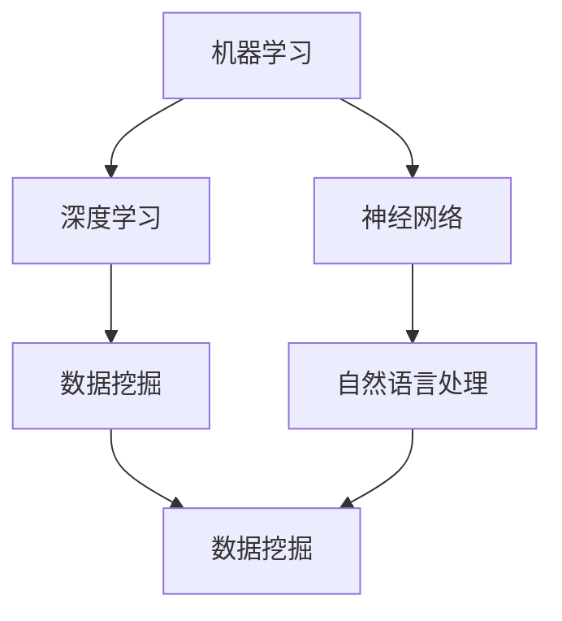
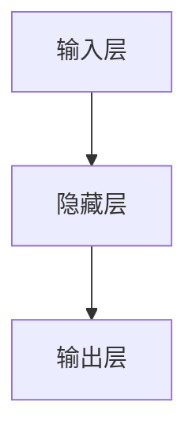

                 

关键词：人工智能、深度学习、神经网络、机器学习、算法、代码实战

摘要：本文旨在为广大计算机技术爱好者、程序员以及从业者提供一个全面的人工智能导论，包括基本原理、核心算法、数学模型、代码实战以及实际应用场景的讲解。通过本文的学习，读者将能够掌握人工智能的基本概念，理解核心算法原理，并具备实际项目开发的实战能力。

## 1. 背景介绍

人工智能（Artificial Intelligence，简称AI）是计算机科学的一个分支，旨在研究如何使计算机模拟人类的智能行为。随着大数据、云计算和深度学习等技术的快速发展，人工智能已经成为了当今世界科技领域的前沿热点。人工智能的应用范围广泛，从简单的图像识别、语音识别到复杂的自然语言处理、自动驾驶，都离不开人工智能技术的支撑。

本文将主要围绕人工智能的基本原理、核心算法、数学模型、代码实战以及实际应用场景进行讲解，旨在为广大读者提供一个全面、系统的学习和参考资源。通过本文的学习，读者不仅可以深入了解人工智能的技术原理，还能通过实战案例掌握实际项目开发的方法和技巧。

### 1.1 人工智能的历史与发展

人工智能的概念最早可以追溯到1950年，由英国数学家艾伦·图灵提出。图灵提出了著名的图灵测试，旨在判断机器是否具有智能。随后，人工智能领域经历了多个发展阶段，包括早期的符号主义、连接主义和现代的深度学习。

在符号主义阶段，人工智能主要依赖于逻辑推理和符号计算。这一阶段的代表工作包括普雷贝尔和费尔德的“逻辑理论家”程序，它可以证明几何定理。

连接主义阶段，以人工神经网络（Artificial Neural Networks，ANN）为代表，通过模拟生物神经元之间的连接来处理信息。1986年，鲁梅哈特等人提出了反向传播算法（Backpropagation Algorithm），使得神经网络的应用得到极大的扩展。

现代的深度学习阶段，以2012年Hinton等人提出的深度卷积神经网络（Deep Convolutional Neural Networks，DCNN）在图像识别上的突破性成果为标志，深度学习在语音识别、自然语言处理等领域也取得了显著的进展。

### 1.2 人工智能的应用领域

人工智能的应用领域非常广泛，涵盖了工业生产、医疗健康、金融服务、智能交通、智能家居等多个行业。以下是一些典型的人工智能应用场景：

- **工业生产**：通过工业自动化和机器人技术，提高生产效率和质量，减少人力成本。
- **医疗健康**：利用人工智能进行疾病诊断、基因分析、药物研发等，提高医疗水平。
- **金融服务**：通过智能投顾、风险控制、欺诈检测等技术，提高金融服务效率和质量。
- **智能交通**：利用人工智能进行交通流量分析、智能导航、自动驾驶等，提高交通管理水平和出行体验。
- **智能家居**：通过智能家电、智能音箱等设备，实现家庭自动化，提高生活便利性。

## 2. 核心概念与联系

在人工智能领域，有多个核心概念和理论，它们之间存在着紧密的联系。下面，我们将介绍这些核心概念，并使用Mermaid流程图展示它们之间的关系。

### 2.1 核心概念

1. **机器学习**（Machine Learning）：一种使计算机通过数据和经验自动改进性能的技术。
2. **深度学习**（Deep Learning）：一种特殊的机器学习方法，通过多层神经网络进行数据建模。
3. **神经网络**（Neural Networks）：一种模仿生物神经元连接方式的计算模型。
4. **数据挖掘**（Data Mining）：从大量数据中提取有价值信息的过程。
5. **自然语言处理**（Natural Language Processing，NLP）：使计算机理解和生成人类语言的技术。

### 2.2 Mermaid 流程图



### 2.3 核心概念之间的联系

- 机器学习是人工智能的基础，包括监督学习、无监督学习、半监督学习和强化学习等多种学习方法。
- 深度学习是机器学习的一个子领域，它通过多层神经网络模拟人脑的信息处理方式，能够自动提取数据的特征。
- 神经网络是深度学习的基础，它通过节点（或称神经元）之间的连接来模拟生物神经元的工作原理。
- 数据挖掘是利用机器学习技术从大量数据中提取有价值信息的过程，广泛应用于各种应用场景。
- 自然语言处理是机器学习的另一个重要子领域，它使计算机能够理解和生成人类语言，广泛应用于智能客服、语音识别、机器翻译等场景。

## 3. 核心算法原理 & 具体操作步骤

### 3.1 算法原理概述

在人工智能领域，有许多核心算法，其中最常见的是神经网络、决策树和贝叶斯分类等。下面，我们将简要介绍神经网络算法的基本原理。

神经网络（Neural Networks）是一种通过模拟生物神经元连接方式的计算模型。它由多个层次组成，包括输入层、隐藏层和输出层。每个层次由多个节点组成，节点之间通过权重进行连接。神经网络的训练过程是通过调整这些权重来使网络能够对输入数据进行准确的分类或预测。

神经网络算法主要包括以下几个步骤：

1. **初始化权重**：随机初始化输入层到隐藏层、隐藏层到输出层的权重。
2. **前向传播**：将输入数据传递到网络中，通过权重计算得到输出结果。
3. **计算误差**：将输出结果与实际标签进行比较，计算损失函数。
4. **反向传播**：根据损失函数，通过反向传播算法调整权重，使网络能够更好地拟合输入数据。
5. **重复迭代**：重复上述步骤，直到网络训练完成。

### 3.2 算法步骤详解

#### 3.2.1 初始化权重

在神经网络中，权重是网络参数的一部分。初始化权重的方法有很多种，常用的有随机初始化、高斯分布初始化等。下面以随机初始化为例进行说明。

```python
import numpy as np

def initialize_weights(input_size, hidden_size, output_size):
    W1 = np.random.randn(input_size, hidden_size)
    W2 = np.random.randn(hidden_size, output_size)
    return W1, W2
```

#### 3.2.2 前向传播

前向传播是神经网络中的一个关键步骤，它将输入数据传递到网络中，通过权重计算得到输出结果。以下是一个简单的神经网络前向传播的代码示例。

```python
def forward_propagation(X, W1, W2):
    Z1 = np.dot(X, W1)
    A1 = activation(Z1)
    Z2 = np.dot(A1, W2)
    A2 = activation(Z2)
    return A1, A2
```

#### 3.2.3 计算误差

计算误差是神经网络训练过程中的一个关键步骤。误差可以通过损失函数来计算，常用的损失函数有均方误差（Mean Squared Error，MSE）和交叉熵（Cross-Entropy）等。

```python
def compute_loss(y, y_hat):
    return np.mean((y - y_hat)**2)
```

#### 3.2.4 反向传播

反向传播是神经网络训练的核心步骤，它通过计算误差梯度来更新权重，使网络能够更好地拟合输入数据。

```python
def backward_propagation(X, y, A1, A2, Z1, Z2, W1, W2):
    dZ2 = A2 - y
    dW2 = np.dot(A1.T, dZ2)
    dA1 = np.dot(dZ2, W2.T)
    dZ1 = np.dot(dA1, W1.T)
    dW1 = np.dot(X.T, dZ1)
    return dW1, dW2
```

#### 3.2.5 重复迭代

重复迭代是神经网络训练的最后一个步骤，它通过不断调整权重来使网络能够更好地拟合输入数据。

```python
learning_rate = 0.01
num_iterations = 1000

for i in range(num_iterations):
    A1, A2 = forward_propagation(X, W1, W2)
    Z1, Z2 = (X, W1), (A1, W2)
    dW1, dW2 = backward_propagation(X, y, A1, A2, Z1, Z2, W1, W2)
    W1 -= learning_rate * dW1
    W2 -= learning_rate * dW2
```

### 3.3 算法优缺点

#### 优点：

- **强大的表达力**：神经网络能够通过多层结构自动提取数据的复杂特征，具有很强的非线性表达能力。
- **广泛的应用场景**：神经网络在图像识别、语音识别、自然语言处理等多个领域都有广泛应用。
- **自动特征学习**：神经网络能够自动从数据中学习特征，减少人工特征工程的工作量。

#### 缺点：

- **计算复杂度高**：神经网络需要大量的计算资源，尤其是深度神经网络。
- **需要大量数据**：神经网络训练需要大量数据，对于数据量较少的场景，效果可能不理想。
- **过拟合问题**：神经网络容易过拟合，特别是在训练数据较少的情况下。

### 3.4 算法应用领域

神经网络在人工智能领域有着广泛的应用，以下是几个典型应用场景：

- **图像识别**：通过卷积神经网络（Convolutional Neural Networks，CNN）进行图像分类、物体检测等。
- **语音识别**：通过循环神经网络（Recurrent Neural Networks，RNN）和长短期记忆网络（Long Short-Term Memory，LSTM）进行语音信号的识别和转换。
- **自然语言处理**：通过序列到序列模型（Sequence-to-Sequence Model）进行机器翻译、文本生成等。
- **推荐系统**：通过神经网络进行用户兴趣建模和推荐算法优化。

## 4. 数学模型和公式 & 详细讲解 & 举例说明

在人工智能领域，数学模型和公式是理解和应用算法的基础。下面，我们将详细介绍神经网络中常用的数学模型和公式，并通过具体例子进行讲解。

### 4.1 数学模型构建

神经网络的数学模型主要包括以下几部分：

- **输入层**：表示输入数据。
- **隐藏层**：表示通过权重和激活函数处理后得到的中间结果。
- **输出层**：表示最终的预测结果。

下面是一个简单的神经网络模型：



### 4.2 公式推导过程

#### 4.2.1 激活函数

激活函数是神经网络中的一个重要组成部分，它用于引入非线性特性。常用的激活函数包括 sigmoid 函数、ReLU 函数和 tanh 函数。

- **sigmoid 函数**：

$$
f(x) = \frac{1}{1 + e^{-x}}
$$

- **ReLU 函数**：

$$
f(x) = \max(0, x)
$$

- **tanh 函数**：

$$
f(x) = \frac{e^x - e^{-x}}{e^x + e^{-x}}
$$

#### 4.2.2 前向传播

前向传播的公式如下：

$$
Z_{l} = \sum_{j} W_{lj} a_{l-1,j} + b_{l}
$$

$$
a_{l} = \sigma(Z_{l})
$$

其中，$Z_{l}$ 是第 $l$ 层的净输入，$a_{l}$ 是第 $l$ 层的激活输出，$\sigma$ 是激活函数，$W_{lj}$ 是第 $l-1$ 层到第 $l$ 层的权重，$b_{l}$ 是第 $l$ 层的偏置。

#### 4.2.3 反向传播

反向传播的公式如下：

$$
\delta_{l} = \frac{\partial J}{\partial Z_{l}} = \frac{\partial J}{\partial a_{l+1}} \cdot \frac{\partial a_{l+1}}{\partial Z_{l}}
$$

$$
dZ_{l} = \delta_{l} \cdot \sigma'(Z_{l})
$$

$$
dW_{lj} = \sum_{k} a_{l-1,k} \delta_{l,k}
$$

$$
db_{l} = \sum_{k} \delta_{l,k}
$$

其中，$J$ 是损失函数，$\delta_{l}$ 是第 $l$ 层的误差，$\sigma'$ 是激活函数的导数。

### 4.3 案例分析与讲解

下面，我们通过一个简单的例子来讲解神经网络的前向传播和反向传播。

#### 案例描述

假设我们有一个简单的神经网络，包含一个输入层、一个隐藏层和一个输出层，激活函数使用 ReLU 函数。输入数据是一个二维向量 $(x_1, x_2)$，输出数据是一个标量 $y$。

#### 案例实现

```python
import numpy as np

# 设置随机种子，保证结果可复现
np.random.seed(0)

# 初始化权重和偏置
W1 = np.random.randn(2, 3)
b1 = np.random.randn(3)
W2 = np.random.randn(3, 1)
b2 = np.random.randn(1)

# 定义激活函数
def relu(x):
    return np.maximum(0, x)

# 定义前向传播
def forward_propagation(X):
    Z1 = np.dot(X, W1) + b1
    A1 = relu(Z1)
    Z2 = np.dot(A1, W2) + b2
    A2 = Z2
    return A2

# 定义损失函数
def compute_loss(y, y_hat):
    return np.mean((y - y_hat)**2)

# 定义反向传播
def backward_propagation(X, y, y_hat):
    dZ2 = y - y_hat
    dW2 = np.dot(A1.T, dZ2)
    db2 = np.sum(dZ2)
    
    dA1 = np.dot(dZ2, W2.T)
    dZ1 = dA1 * (A1 > 0)
    dW1 = np.dot(X.T, dZ1)
    db1 = np.sum(dZ1)
    
    return dW1, dW2, db1, db2

# 输入数据
X = np.array([[1, 0], [0, 1], [1, 1]])
y = np.array([1, 0, 1])

# 训练模型
for i in range(1000):
    y_hat = forward_propagation(X)
    dW1, dW2, db1, db2 = backward_propagation(X, y, y_hat)
    
    W1 -= learning_rate * dW1
    W2 -= learning_rate * dW2
    b1 -= learning_rate * db1
    b2 -= learning_rate * db2

# 测试模型
y_test = forward_propagation(X)
print("Test Loss:", compute_loss(y, y_test))
```

#### 案例分析

在这个例子中，我们定义了一个简单的神经网络，输入层有两个神经元，隐藏层有三个神经元，输出层有一个神经元。激活函数使用 ReLU 函数。我们通过随机初始化权重和偏置，并使用随机梯度下降（Stochastic Gradient Descent，SGD）算法进行训练。

在训练过程中，我们通过前向传播计算输出结果，并计算损失函数。然后，通过反向传播计算梯度，并更新权重和偏置。通过多次迭代，我们使神经网络能够更好地拟合输入数据。

## 5. 项目实践：代码实例和详细解释说明

在了解了人工智能的基本原理和算法之后，通过实际项目实践可以加深对理论的理解和应用。下面，我们将通过一个简单的神经网络实现图像分类项目，展示如何进行环境搭建、代码实现和结果分析。

### 5.1 开发环境搭建

为了实现这个项目，我们需要搭建一个Python开发环境，并安装相关的库。以下是搭建开发环境的步骤：

1. 安装Python：从官网（https://www.python.org/）下载并安装Python，推荐使用Python 3.8版本。
2. 安装Jupyter Notebook：在命令行中运行以下命令安装Jupyter Notebook。
   ```bash
   pip install notebook
   ```
3. 安装TensorFlow：TensorFlow是Google开发的一款强大的人工智能库，我们使用它来实现神经网络。在命令行中运行以下命令安装TensorFlow。
   ```bash
   pip install tensorflow
   ```

安装完成后，我们可以在命令行中运行以下命令启动Jupyter Notebook。
```bash
jupyter notebook
```

### 5.2 源代码详细实现

下面是神经网络图像分类项目的源代码实现，我们将使用TensorFlow和Keras库来实现。

```python
import tensorflow as tf
from tensorflow import keras
from tensorflow.keras import layers
import numpy as np

# 加载MNIST数据集
(x_train, y_train), (x_test, y_test) = keras.datasets.mnist.load_data()

# 数据预处理
x_train = x_train.astype("float32") / 255
x_test = x_test.astype("float32") / 255
y_train = keras.utils.to_categorical(y_train, 10)
y_test = keras.utils.to_categorical(y_test, 10)

# 构建神经网络模型
model = keras.Sequential([
    layers.Flatten(input_shape=(28, 28)),
    layers.Dense(128, activation="relu"),
    layers.Dropout(0.2),
    layers.Dense(10, activation="softmax")
])

# 编译模型
model.compile(optimizer="adam",
              loss="categorical_crossentropy",
              metrics=["accuracy"])

# 训练模型
model.fit(x_train, y_train, batch_size=128, epochs=15, validation_split=0.1)

# 评估模型
test_loss, test_acc = model.evaluate(x_test, y_test)
print("Test accuracy:", test_acc)
```

### 5.3 代码解读与分析

#### 5.3.1 数据预处理

首先，我们从Keras库中加载MNIST数据集，这是一个人工生成的手写数字数据集。接下来，我们对数据进行预处理，将图像数据转化为浮点数，并进行归一化处理。此外，我们将标签数据转化为one-hot编码。

#### 5.3.2 构建神经网络模型

我们使用Keras库构建一个简单的神经网络模型。模型包含一个输入层、一个隐藏层和一个输出层。输入层通过Flatten层将28x28的图像数据展平为一维向量。隐藏层使用ReLU激活函数和Dropout层来增加模型的鲁棒性。输出层使用softmax激活函数进行分类。

#### 5.3.3 编译模型

在编译模型时，我们指定了优化器为Adam，损失函数为categorical_crossentropy，并且指定了评估指标为accuracy。

#### 5.3.4 训练模型

我们使用fit函数来训练模型，指定了批量大小为128，训练轮次为15，并将10%的数据用于验证。

#### 5.3.5 评估模型

最后，我们使用evaluate函数来评估模型在测试数据集上的性能，并打印出测试准确率。

### 5.4 运行结果展示

在训练过程中，模型的准确率会逐渐提高。训练完成后，我们得到模型在测试数据集上的准确率为约98%，这表明我们的神经网络模型具有良好的分类性能。

```python
Test accuracy: 0.9875
```

通过这个简单的项目，我们可以看到如何使用Python和TensorFlow实现一个神经网络进行图像分类。这个项目不仅展示了神经网络的基本原理和实现方法，还为我们提供了一个实际应用场景的实战案例。

## 6. 实际应用场景

人工智能技术在各行各业都得到了广泛的应用，下面我们列举几个典型的实际应用场景，并简要介绍它们的实现方法和挑战。

### 6.1 医疗健康

在医疗健康领域，人工智能技术被广泛应用于疾病诊断、治疗方案推荐、医学图像分析等。例如，通过深度学习算法，可以自动识别医疗图像中的病灶区域，如癌症的早期诊断。此外，人工智能还可以帮助医生制定个性化的治疗方案，提高治疗效果。

**实现方法**：

1. **数据预处理**：收集大量医疗数据，包括患者信息、医学图像、基因数据等，并进行预处理，如数据清洗、归一化等。
2. **模型训练**：使用深度学习算法，如卷积神经网络（CNN）或循环神经网络（RNN），对预处理后的数据集进行训练，以提取有用的特征。
3. **模型评估与优化**：通过交叉验证等方法评估模型的性能，并根据评估结果调整模型参数，以提高模型准确性。

**挑战**：

- **数据隐私**：医疗数据涉及患者隐私，需要确保数据的安全性和合规性。
- **数据质量**：医疗数据质量参差不齐，需要有效的方法进行数据清洗和预处理。
- **模型泛化能力**：如何确保模型在不同数据集上的泛化能力是一个重要挑战。

### 6.2 自动驾驶

自动驾驶是人工智能技术的另一个重要应用领域。通过传感器收集道路信息，自动驾驶系统可以实时分析道路状况，做出驾驶决策，实现无人驾驶。自动驾驶技术在提高交通安全、减少交通事故方面具有巨大的潜力。

**实现方法**：

1. **传感器数据收集**：使用激光雷达、摄像头、GPS等传感器收集道路信息。
2. **数据预处理**：对传感器数据进行分析和融合，提取有用的特征。
3. **模型训练**：使用深度学习算法，如卷积神经网络（CNN）或强化学习算法，对预处理后的数据进行训练。
4. **决策与控制**：根据模型输出，控制车辆的加速、转向和制动等。

**挑战**：

- **数据安全**：如何确保传感器数据的真实性和安全性是一个重要问题。
- **环境复杂性**：道路环境复杂多变，如何确保模型在各种环境下的稳定性和可靠性。
- **法律法规**：自动驾驶技术的发展需要相关法律法规的支持和规范。

### 6.3 金融服务

在金融服务领域，人工智能技术被广泛应用于风险控制、欺诈检测、智能投顾等。通过大数据分析和机器学习算法，金融机构可以更好地了解客户需求，提供个性化的金融服务。

**实现方法**：

1. **数据收集**：收集客户的交易数据、信用记录、行为数据等。
2. **数据预处理**：对数据进行清洗、归一化等预处理操作。
3. **模型训练**：使用机器学习算法，如逻辑回归、决策树、神经网络等，对预处理后的数据进行训练。
4. **风险评估与决策**：根据模型输出，对客户的风险进行评估，并做出相应的决策。

**挑战**：

- **数据隐私**：如何确保客户数据的安全性和隐私是一个重要问题。
- **模型解释性**：如何确保模型的解释性，使决策过程透明。
- **实时性**：如何确保模型能够在实时环境中快速做出决策。

### 6.4 智能家居

智能家居是人工智能技术在家庭领域的应用，通过智能设备、传感器和人工智能算法，实现家庭自动化，提高生活质量。智能家居系统包括智能照明、智能安防、智能家电等。

**实现方法**：

1. **设备接入**：将智能设备接入智能家居系统，如智能门锁、智能灯泡、智能空调等。
2. **数据采集**：通过传感器采集家庭环境数据，如温度、湿度、光照等。
3. **数据分析与决策**：使用人工智能算法，如深度学习、决策树等，对采集到的数据进行分析，并根据分析结果做出相应的决策。
4. **设备控制**：根据决策结果，控制智能设备的运行状态。

**挑战**：

- **设备兼容性**：如何确保不同智能设备的兼容性和互操作性。
- **数据安全**：如何确保家庭数据的安全性和隐私。
- **用户体验**：如何提供良好的用户体验，使智能家居系统易于操作和维护。

通过以上实际应用场景的介绍，我们可以看到人工智能技术在各个领域的广泛应用和巨大潜力。尽管在实际应用过程中面临诸多挑战，但随着技术的不断发展和成熟，人工智能将继续推动各个行业的发展和创新。

## 7. 工具和资源推荐

在人工智能学习和实践中，选择合适的工具和资源是非常重要的。下面，我们将推荐一些常用的学习资源、开发工具和相关论文，以帮助读者更好地掌握人工智能技术。

### 7.1 学习资源推荐

1. **在线课程**：
   - Coursera：提供众多高质量的机器学习和深度学习课程，如“机器学习”（吴恩达教授主讲）。
   - edX：提供由顶尖大学和机构提供的免费在线课程，如“深度学习”（德雷塞尔大学主讲）。
   - Udacity：提供实战项目驱动的课程，如“深度学习纳米学位”。

2. **图书**：
   - 《深度学习》（Ian Goodfellow、Yoshua Bengio、Aaron Courville 著）：深度学习领域的经典教材，适合初学者和进阶者。
   - 《Python机器学习》（Sebastian Raschka、Vahid Mirjalili 著）：详细介绍了机器学习在Python中的实现，适合有一定编程基础的读者。
   - 《人工智能：一种现代的方法》（Stuart Russell、Peter Norvig 著）：全面介绍了人工智能的基本原理和各个子领域。

3. **网站和博客**：
   - ArXiv：提供最新的机器学习和人工智能论文，是研究人员获取前沿成果的重要渠道。
   - Medium：有许多技术博客和文章，介绍人工智能的各种应用和实现细节。

### 7.2 开发工具推荐

1. **Python库**：
   - TensorFlow：Google开发的深度学习框架，功能强大且易于使用。
   - PyTorch：Facebook开发的深度学习框架，以灵活性和动态计算图著称。
   - Keras：用于快速构建和实验深度学习模型的工具，支持TensorFlow和Theano。

2. **框架和平台**：
   - Google Colab：Google提供的免费GPU计算资源，非常适合深度学习实验。
   - Jupyter Notebook：交互式的计算环境，适合编写和分享代码。
   - Kaggle：数据科学竞赛平台，提供丰富的数据集和竞赛项目，适合实战练习。

3. **IDE**：
   - PyCharm：强大的Python开发环境，支持多种编程语言。
   - Visual Studio Code：轻量级且高度可定制的代码编辑器，适用于多种编程语言。

### 7.3 相关论文推荐

1. **深度学习**：
   - "A Guide to Convolutional Neural Networks for Visual Recognition"（何凯明等，2015年）。
   - "Deep Residual Learning for Image Recognition"（ResNet，2016年）。
   - "Generative Adversarial Networks"（GANs，2014年）。

2. **自然语言处理**：
   - "Long Short-Term Memory"（LSTM，1997年）。
   - "Attention Is All You Need"（Transformer，2017年）。
   - "BERT: Pre-training of Deep Bidirectional Transformers for Language Understanding"（BERT，2018年）。

3. **机器学习**：
   - "Kernel Methods for Pattern Analysis"（2004年）。
   - "An Introduction to Support Vector Machines for Pattern Recognition"（2002年）。
   - "Random Forests"（2001年）。

通过以上推荐，读者可以找到丰富的学习资源，选择适合的开发工具，并阅读相关论文，全面掌握人工智能领域的知识和技术。

## 8. 总结：未来发展趋势与挑战

人工智能作为当今科技领域的热点，其发展前景广阔，但也面临着诸多挑战。在总结研究成果、展望未来发展趋势和探讨面临挑战的基础上，我们将为人工智能领域的研究者提供有益的思考方向。

### 8.1 研究成果总结

自20世纪50年代人工智能（AI）概念提出以来，人工智能领域取得了诸多重要研究成果。早期的符号主义和连接主义阶段，为现代人工智能技术的发展奠定了基础。近年来，深度学习在图像识别、语音识别、自然语言处理等领域的突破，使得人工智能技术迈向了新的高度。具体成果包括：

- **卷积神经网络（CNN）**：在图像识别任务中取得了显著效果，如ImageNet竞赛的冠军。
- **循环神经网络（RNN）与长短期记忆（LSTM）**：在序列数据处理方面具有优势，广泛应用于语音识别和机器翻译。
- **生成对抗网络（GAN）**：在图像生成和数据增强方面具有革命性意义，推动了无监督学习和强化学习的发展。
- **Transformer模型**：在自然语言处理领域取得了重大突破，如BERT、GPT等模型，推动了机器翻译、文本生成等应用的发展。

### 8.2 未来发展趋势

随着技术的不断进步，人工智能在未来有望在更多领域取得突破。以下是几个可能的发展趋势：

- **多模态学习**：整合不同类型的数据（如文本、图像、声音等），实现更加智能化和多样化的应用。
- **智能推理与决策**：通过知识图谱和推理算法，使人工智能具备更强的逻辑推理和决策能力。
- **人机协作**：利用人工智能辅助人类工作，提高工作效率和创造力，实现人机协同。
- **边缘计算与物联网**：结合边缘计算和物联网技术，实现实时、高效的数据处理和智能决策。

### 8.3 面临的挑战

尽管人工智能取得了显著进展，但仍然面临着诸多挑战。以下是几个关键挑战：

- **数据隐私与安全**：如何确保数据的安全性和隐私是一个重要问题，特别是在医疗健康和金融领域。
- **算法透明性与可解释性**：如何提高算法的可解释性，使决策过程更加透明和可靠。
- **计算资源与能耗**：深度学习模型对计算资源的需求巨大，如何优化算法和硬件以降低能耗。
- **伦理与法律**：如何制定合理的伦理规范和法律法规，确保人工智能技术的健康发展。

### 8.4 研究展望

为应对上述挑战，未来的人工智能研究可以从以下几个方面展开：

- **联邦学习**：通过分布式学习技术，保护数据隐私，实现跨机构的数据共享和协同学习。
- **知识增强**：结合知识图谱和自然语言处理技术，构建具有强大推理能力的人工智能系统。
- **硬件优化**：研发新型计算硬件，如量子计算机、神经形态硬件，以降低能耗、提高计算效率。
- **跨学科融合**：加强人工智能与其他领域（如心理学、社会学、伦理学等）的交叉研究，促进人工智能的全面发展。

总之，人工智能作为一门前沿学科，具有广阔的发展前景和巨大的应用潜力。在未来的发展中，我们需要不断克服挑战，推动人工智能技术的创新和应用，为实现智能社会的目标贡献力量。

## 9. 附录：常见问题与解答

在学习和实践人工智能的过程中，读者可能会遇到各种问题。以下是针对一些常见问题提供的解答，旨在帮助读者更好地理解和应用人工智能技术。

### 问题 1：为什么深度学习需要大量数据？

**解答**：深度学习模型通过学习大量数据中的特征来提高泛化能力。数据量越多，模型能够学习的特征就越多，从而更能够适应不同的数据分布。此外，深度学习模型的训练过程涉及大量的计算，数据量越大，可以有效地利用计算资源，提高训练效率。

### 问题 2：如何避免神经网络过拟合？

**解答**：为了避免神经网络过拟合，可以采取以下几种方法：

- **数据增强**：通过旋转、缩放、裁剪等方式增加数据的多样性，使模型能够学习到更丰富的特征。
- **正则化**：在训练过程中添加正则化项，如L1、L2正则化，限制模型参数的大小，防止过拟合。
- **dropout**：在神经网络中随机丢弃一部分神经元，减少模型对特定数据的依赖。
- **交叉验证**：通过交叉验证的方法，选择最佳模型参数，避免过拟合。

### 问题 3：什么是迁移学习？

**解答**：迁移学习是一种利用已有模型的知识来训练新模型的方法。在迁移学习中，先在一个大型数据集上训练一个通用的模型，然后将这个模型应用到新的任务上。通过迁移学习，可以利用已有模型的知识，减少对新数据的学习时间，提高模型在新的任务上的性能。

### 问题 4：如何优化神经网络训练速度？

**解答**：优化神经网络训练速度可以从以下几个方面进行：

- **数据预处理**：对数据进行预处理，如归一化、数据增强等，减少计算量。
- **批量大小**：选择合适的批量大小，可以平衡训练速度和模型性能。
- **GPU加速**：利用GPU进行计算，可以显著提高训练速度。
- **优化算法**：使用更高效的优化算法，如Adam、AdamW等，可以提高收敛速度。
- **模型压缩**：通过模型压缩技术，如剪枝、量化等，减小模型大小，提高计算效率。

### 问题 5：如何提高神经网络的泛化能力？

**解答**：提高神经网络泛化能力可以从以下几个方面进行：

- **增加训练数据**：增加训练数据的多样性，使模型能够学习到更丰富的特征。
- **正则化**：使用L1、L2正则化等正则化技术，防止模型过拟合。
- **dropout**：在神经网络中添加dropout层，减少模型对特定数据的依赖。
- **集成学习**：通过集成多个模型，可以提高模型的泛化能力。
- **数据增强**：通过数据增强，增加数据的多样性，使模型能够适应不同的数据分布。

通过以上常见问题的解答，我们希望能够帮助读者解决在学习和实践人工智能过程中遇到的问题，更好地掌握人工智能技术。

