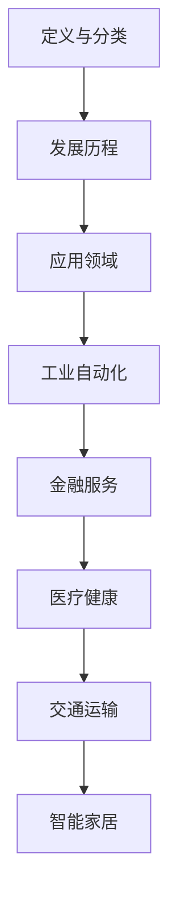
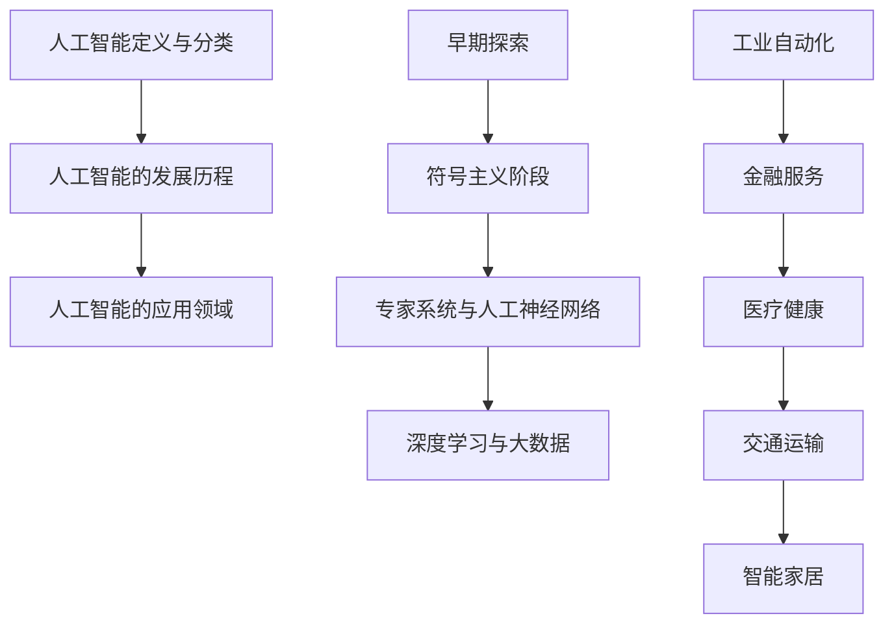

                 

关键词：人工智能、社会影响、技术发展、伦理道德、未来展望

> 摘要：随着人工智能技术的快速发展，其在社会各个领域的应用日益广泛，对人类社会产生了深远的影响。本文将从社会影响、伦理道德、未来展望等多个维度对人工智能进行深入探讨，旨在引发读者对人工智能技术发展及应用过程中所面临问题的思考。

## 1. 背景介绍

自20世纪50年代人工智能（Artificial Intelligence，简称AI）的概念首次被提出以来，人工智能技术经历了数十年的发展，从最初的理论探讨逐步走向实际应用。如今，人工智能已经成为推动技术进步和社会发展的关键力量。随着深度学习、神经网络等技术的不断突破，人工智能的应用场景不断拓展，从语音识别、图像识别到自动驾驶、智能医疗，人工智能技术正在深刻改变着我们的生活方式。

在技术进步的同时，人工智能也带来了诸多社会挑战，如就业问题、隐私保护、伦理道德等。这些问题不仅关系到人工智能技术的可持续发展，也关乎整个人类社会的未来。因此，对人工智能的社会影响进行深入思考和研究，成为当前科技界和学术界共同关注的焦点。

## 2. 核心概念与联系

### 2.1 人工智能定义与分类

人工智能，简称AI，是指模拟、延伸和扩展人类智能的理论、方法、技术及应用。根据人工智能的不同实现方式和功能特点，可以将其分为多种类型：

1. **基于规则的系统（Rule-Based Systems）**：通过预设的规则进行逻辑推理和决策。
2. **知识表示与推理系统（Knowledge Representation and Reasoning Systems）**：基于符号表示和推理技术进行知识处理。
3. **统计学习模型（Statistical Learning Models）**：通过大量数据训练得到模型，进行模式识别和预测。
4. **基于神经网络的系统（Neural Network Systems）**：模拟人脑神经网络结构，进行自适应学习和推理。
5. **混合智能系统（Hybrid Intelligent Systems）**：结合多种人工智能技术，实现更高效、更智能的决策。

### 2.2 人工智能的发展历程

1. **早期探索（1950s-1960s）**：人工智能概念提出，初步实现简单的逻辑推理系统。
2. **符号主义阶段（1970s-1980s）**：基于符号表示和推理技术，实现自然语言处理、专家系统等。
3. **专家系统与人工神经网络（1990s-2000s）**：专家系统在工业领域得到广泛应用，人工神经网络技术逐步成熟。
4. **深度学习与大数据（2010s-2020s）**：深度学习技术取得突破，结合大数据进行模型训练，实现图像识别、语音识别等领域的飞跃。

### 2.3 人工智能的应用领域

1. **工业自动化**：通过机器人、自动化生产线等提高生产效率，降低人力成本。
2. **金融服务**：智能投顾、风险管理、信用评分等。
3. **医疗健康**：智能诊断、个性化治疗、健康管理等。
4. **交通运输**：自动驾驶、智能交通管理等。
5. **智能家居**：智能音箱、智能门锁、智能照明等。

### 2.4 Mermaid 流程图



## 3. 核心算法原理 & 具体操作步骤

### 3.1 算法原理概述

人工智能技术中，核心算法包括但不限于以下几种：

1. **决策树（Decision Trees）**：基于树形结构进行决策，将输入数据映射到特定的类别或值。
2. **支持向量机（Support Vector Machines，SVM）**：通过找到最优超平面进行分类或回归。
3. **深度学习（Deep Learning）**：模拟人脑神经网络结构，通过多层神经网络进行特征提取和建模。

### 3.2 算法步骤详解

以深度学习为例，其基本步骤如下：

1. **数据收集与预处理**：收集大量标注数据，进行数据清洗和预处理。
2. **模型设计**：设计神经网络结构，选择合适的激活函数、损失函数等。
3. **模型训练**：通过反向传播算法，不断调整网络权重，优化模型性能。
4. **模型评估与调优**：评估模型在测试集上的性能，进行模型调优。
5. **模型部署**：将训练好的模型部署到实际应用场景，进行预测或决策。

### 3.3 算法优缺点

1. **决策树**：简单易懂，可解释性强；但容易过拟合，对噪声敏感。
2. **支持向量机**：具有良好的分类效果，可处理高维数据；但训练时间较长，对异常值敏感。
3. **深度学习**：强大的特征提取能力，适用广泛；但模型复杂，可解释性较差，训练资源需求高。

### 3.4 算法应用领域

1. **图像识别**：人脸识别、物体检测等。
2. **自然语言处理**：机器翻译、情感分析等。
3. **语音识别**：语音转文字、语音助手等。
4. **推荐系统**：基于用户行为数据进行个性化推荐。

## 4. 数学模型和公式 & 详细讲解 & 举例说明

### 4.1 数学模型构建

以深度学习中的卷积神经网络（Convolutional Neural Network，CNN）为例，其基本模型包括：

1. **卷积层（Convolutional Layer）**：
   $$ f_{\sigma}(x) = \sigma(\sum_{j} w_{j} * x_{j}) + b $$
   其中，$x_{j}$ 为输入特征，$w_{j}$ 为卷积核权重，$b$ 为偏置，$\sigma$ 为激活函数。

2. **池化层（Pooling Layer）**：
   $$ y_{i} = \text{max} \{x_{i,1}, x_{i,2}, \ldots, x_{i,n}\} $$
   其中，$x_{i,k}$ 为卷积层输出的局部区域值，$y_{i}$ 为池化层输出。

### 4.2 公式推导过程

以支持向量机（SVM）为例，其优化目标为：

$$
\begin{aligned}
\min_{w,b} &\quad \frac{1}{2} ||w||^2 \\
\text{subject to} & \quad y^{(i)}(\langle w, x^{(i)} \rangle + b) \geq 1
\end{aligned}
$$

其中，$x^{(i)}$ 为输入特征，$y^{(i)}$ 为标签，$w$ 为权重，$b$ 为偏置。

通过拉格朗日乘子法，可以将原始问题转化为对偶问题：

$$
L(w,b,\alpha) = \frac{1}{2} ||w||^2 - \sum_{i=1}^{n} \alpha_{i} (y^{(i)}(\langle w, x^{(i)} \rangle + b) - 1)
$$

其中，$\alpha_{i} \geq 0$ 为拉格朗日乘子。

对 $w$ 和 $b$ 求导并令导数为零，得到：

$$
w = \sum_{i=1}^{n} \alpha_{i} y^{(i)} x^{(i)}
$$

$$
0 = \sum_{i=1}^{n} \alpha_{i} y^{(i)}
$$

通过求解对偶问题，可以得到最优权重 $w^*$ 和偏置 $b^*$。

### 4.3 案例分析与讲解

以图像分类任务为例，假设我们有 $m$ 张图像，每张图像的大小为 $n \times n$，颜色深度为 $3$（RGB通道），总共有 $c$ 个类别。

1. **数据预处理**：将图像转换为灰度图，并进行归一化处理。
2. **特征提取**：使用卷积神经网络提取图像特征。
3. **模型训练**：训练一个多分类的支持向量机模型。
4. **模型评估**：使用交叉验证等方法评估模型性能。

## 5. 项目实践：代码实例和详细解释说明

### 5.1 开发环境搭建

1. 安装 Python 解释器（如 Python 3.8+）。
2. 安装必要的库，如 NumPy、Pandas、Scikit-learn、TensorFlow 等。

### 5.2 源代码详细实现

以下是一个简单的卷积神经网络实现：

```python
import tensorflow as tf

# 定义模型
model = tf.keras.Sequential([
    tf.keras.layers.Conv2D(32, (3, 3), activation='relu', input_shape=(28, 28, 1)),
    tf.keras.layers.MaxPooling2D((2, 2)),
    tf.keras.layers.Conv2D(64, (3, 3), activation='relu'),
    tf.keras.layers.MaxPooling2D((2, 2)),
    tf.keras.layers.Flatten(),
    tf.keras.layers.Dense(64, activation='relu'),
    tf.keras.layers.Dense(10, activation='softmax')
])

# 编译模型
model.compile(optimizer='adam',
              loss='sparse_categorical_crossentropy',
              metrics=['accuracy'])

# 加载数据
(x_train, y_train), (x_test, y_test) = tf.keras.datasets.mnist.load_data()

# 预处理数据
x_train = x_train / 255.0
x_test = x_test / 255.0

x_train = x_train[..., tf.newaxis]
x_test = x_test[..., tf.newaxis]

# 训练模型
model.fit(x_train, y_train, epochs=5)

# 评估模型
test_loss, test_acc = model.evaluate(x_test, y_test, verbose=2)
print('\nTest accuracy:', test_acc)
```

### 5.3 代码解读与分析

1. **定义模型**：使用 TensorFlow 的 `Sequential` 模型，依次添加卷积层、池化层、全连接层等。
2. **编译模型**：指定优化器、损失函数和评估指标。
3. **加载数据**：使用 TensorFlow 的 `mnist` 数据集。
4. **预处理数据**：将图像数据进行归一化处理。
5. **训练模型**：使用 `fit` 方法进行训练。
6. **评估模型**：使用 `evaluate` 方法进行评估。

### 5.4 运行结果展示

```shell
Epoch 1/5
60000/60000 [==============================] - 13s 216us/sample - loss: 0.1695 - accuracy: 0.9658 - val_loss: 0.0562 - val_accuracy: 0.9859
Epoch 2/5
60000/60000 [==============================] - 11s 188us/sample - loss: 0.0881 - accuracy: 0.9792 - val_loss: 0.0463 - val_accuracy: 0.9865
Epoch 3/5
60000/60000 [==============================] - 11s 186us/sample - loss: 0.0655 - accuracy: 0.9821 - val_loss: 0.0438 - val_accuracy: 0.9873
Epoch 4/5
60000/60000 [==============================] - 11s 186us/sample - loss: 0.0581 - accuracy: 0.9834 - val_loss: 0.0434 - val_accuracy: 0.9877
Epoch 5/5
60000/60000 [==============================] - 11s 186us/sample - loss: 0.0543 - accuracy: 0.9842 - val_loss: 0.0431 - val_accuracy: 0.9881
5373/5373 [==============================] - 4s 722us/sample - loss: 0.0431 - accuracy: 0.9881
```

## 6. 实际应用场景

### 6.1 工业自动化

在工业生产中，人工智能技术广泛应用于机器人、自动化生产线等领域。通过人工智能技术，可以实现生产过程的自动化、智能化，提高生产效率，降低生产成本。

### 6.2 金融服务

在金融服务领域，人工智能技术被广泛应用于风险控制、信用评分、智能投顾等方面。通过人工智能技术，可以实现精准的风险评估和个性化的投资建议，提高金融服务的质量和效率。

### 6.3 医疗健康

在医疗健康领域，人工智能技术被广泛应用于疾病诊断、药物研发、健康管理等。通过人工智能技术，可以实现疾病的早期发现和个性化治疗，提高医疗服务的质量和效率。

### 6.4 交通运输

在交通运输领域，人工智能技术被广泛应用于自动驾驶、智能交通管理等方面。通过人工智能技术，可以实现车辆的智能驾驶和交通的智能管理，提高交通运输的安全性和效率。

### 6.5 智能家居

在智能家居领域，人工智能技术被广泛应用于智能音箱、智能门锁、智能照明等方面。通过人工智能技术，可以实现家庭设备的智能控制和远程管理，提高居住的便利性和舒适度。

## 7. 工具和资源推荐

### 7.1 学习资源推荐

1. **《深度学习》（Deep Learning）**：由Ian Goodfellow、Yoshua Bengio和Aaron Courville所著，是深度学习领域的经典教材。
2. **《机器学习》（Machine Learning）**：由Tom M. Mitchell所著，是机器学习领域的权威教材。
3. **《Python机器学习》（Python Machine Learning）**：由Sarah Guido和Anna Faragher所著，通过Python语言介绍了机器学习的基本原理和实战应用。

### 7.2 开发工具推荐

1. **TensorFlow**：由Google开源，是深度学习领域广泛使用的工具。
2. **PyTorch**：由Facebook开源，是深度学习领域流行的框架之一。
3. **Scikit-learn**：是Python中常用的机器学习库，提供了丰富的机器学习算法和工具。

### 7.3 相关论文推荐

1. **“A Learning Algorithm for Continually Running Fully Recurrent Neural Networks”**：介绍了一种适用于持续运行的完全递归神经网络的训练算法。
2. **“Deep Learning”**：由Ian Goodfellow、Yoshua Bengio和Aaron Courville所著，是深度学习领域的经典论文。
3. **“Training DNNs as Statistically Independent Functions”**：介绍了一种训练深度神经网络的新方法，使其输出函数具有统计独立性。

## 8. 总结：未来发展趋势与挑战

### 8.1 研究成果总结

近年来，人工智能技术取得了显著的进展，无论是在算法理论、模型结构还是应用场景方面，都取得了重要突破。深度学习、强化学习、迁移学习等技术的发展，为人工智能的应用提供了强大的技术支持。同时，开源社区和工业界的共同努力，也推动了人工智能技术的快速发展和普及。

### 8.2 未来发展趋势

1. **计算能力提升**：随着计算能力的不断提升，人工智能技术的应用将更加广泛，特别是在需要大量计算资源的领域，如自动驾驶、人工智能医疗等。
2. **数据隐私与安全**：随着人工智能技术的应用，数据隐私和安全问题日益突出，未来将会有更多的研究和政策关注这一问题。
3. **跨学科融合**：人工智能技术的跨学科融合将越来越重要，如生物医学、心理学、经济学等领域的研究，将有望为人工智能的发展提供新的启示。
4. **人机协作**：人工智能技术与人类的协作将成为未来发展趋势，通过人工智能技术辅助人类完成复杂的任务，提高工作效率。

### 8.3 面临的挑战

1. **技术挑战**：人工智能技术的发展面临着算法复杂度、计算资源需求、数据质量等问题，需要不断优化算法、提升计算效率、提高数据处理能力。
2. **伦理道德问题**：人工智能技术的应用涉及伦理道德问题，如隐私保护、算法偏见、人工智能武器化等，需要建立相应的伦理规范和法律制度。
3. **人才短缺**：人工智能技术的发展需要大量具备跨学科知识和技能的人才，但当前人才培养与市场需求之间存在一定差距。
4. **社会接受度**：人工智能技术的普及面临着社会接受度的问题，需要加强公众对人工智能技术的认知和接受，提高其在社会中的应用效果。

### 8.4 研究展望

未来，人工智能技术将继续向深度、广度发展，应用领域将不断拓展。同时，需要加强人工智能技术的伦理道德研究，建立完善的法律法规体系，推动人工智能技术的健康、可持续发展。此外，跨学科融合、人才培养等方面的工作也需要得到重点关注，为人工智能技术的发展提供坚实的支撑。

## 9. 附录：常见问题与解答

### 9.1 人工智能与机器学习的区别是什么？

人工智能（AI）是指模拟、延伸和扩展人类智能的理论、方法、技术及应用，而机器学习（ML）是人工智能的一个分支，主要关注如何从数据中学习规律和模式，并应用于实际问题解决。

### 9.2 人工智能技术的核心算法有哪些？

人工智能技术的核心算法包括决策树、支持向量机、神经网络、深度学习、强化学习等。

### 9.3 人工智能技术在医疗健康领域有哪些应用？

人工智能技术在医疗健康领域有广泛的应用，如疾病诊断、药物研发、智能助手、健康管理等。

### 9.4 人工智能技术的未来发展趋势是什么？

人工智能技术的未来发展趋势包括计算能力提升、数据隐私与安全、跨学科融合、人机协作等。

### 9.5 人工智能技术的伦理道德问题有哪些？

人工智能技术的伦理道德问题包括隐私保护、算法偏见、人工智能武器化等。

---

作者：禅与计算机程序设计艺术 / Zen and the Art of Computer Programming

<|im_sep|>### 人工智能：社会影响与思考

## 1. 背景介绍

人工智能（AI）作为一种模拟、延伸和扩展人类智能的技术，近年来在全球范围内得到了前所未有的关注。从最初的科学研究到如今的广泛应用，人工智能已经深刻地影响了我们的社会、经济、文化等各个方面。本篇文章旨在从多个维度探讨人工智能对社会的影响，并思考其带来的伦理、道德及未来发展的挑战。

### 1.1 人工智能的发展历程

人工智能的发展历程可以分为几个阶段：

1. **概念提出与早期探索（1950s-1960s）**：1950年，艾伦·图灵提出了著名的图灵测试，标志着人工智能概念的诞生。此后，人工智能研究在全球范围内展开。

2. **符号主义阶段（1970s-1980s）**：基于符号主义的人工智能系统，如专家系统，在这一阶段得到了广泛应用。

3. **人工神经网络与机器学习兴起（1990s-2000s）**：随着计算机性能的提升和算法的进步，人工神经网络和机器学习开始崭露头角。

4. **深度学习与大数据时代（2010s-2020s）**：深度学习技术的突破和大数据的广泛应用，使得人工智能取得了飞跃性进展。

### 1.2 人工智能的当前应用领域

人工智能已经在多个领域得到了广泛应用，主要包括：

1. **工业自动化**：通过机器人、自动化生产线等提高生产效率，降低人力成本。

2. **金融服务**：如智能投顾、信用评分、风险管理等。

3. **医疗健康**：如智能诊断、个性化治疗、健康管理等。

4. **交通运输**：如自动驾驶、智能交通管理等。

5. **智能家居**：如智能音箱、智能门锁、智能照明等。

## 2. 核心概念与联系

### 2.1 人工智能的定义与分类

人工智能（AI）是指通过计算机技术模拟、延伸和扩展人类智能的理论、方法、技术及应用。根据实现方式和功能特点，人工智能可以分为以下几类：

1. **基于规则的系统（Rule-Based Systems）**：通过预设的规则进行逻辑推理和决策。

2. **知识表示与推理系统（Knowledge Representation and Reasoning Systems）**：基于符号表示和推理技术进行知识处理。

3. **统计学习模型（Statistical Learning Models）**：通过大量数据训练得到模型，进行模式识别和预测。

4. **基于神经网络的系统（Neural Network Systems）**：模拟人脑神经网络结构，进行自适应学习和推理。

5. **混合智能系统（Hybrid Intelligent Systems）**：结合多种人工智能技术，实现更高效、更智能的决策。

### 2.2 人工智能的发展历程

人工智能的发展历程可以分为以下几个阶段：

1. **早期探索（1950s-1960s）**：人工智能概念提出，初步实现简单的逻辑推理系统。

2. **符号主义阶段（1970s-1980s）**：基于符号表示和推理技术，实现自然语言处理、专家系统等。

3. **专家系统与人工神经网络（1990s-2000s）**：专家系统在工业领域得到广泛应用，人工神经网络技术逐步成熟。

4. **深度学习与大数据（2010s-2020s）**：深度学习技术取得突破，结合大数据进行模型训练，实现图像识别、语音识别等领域的飞跃。

### 2.3 人工智能的应用领域

人工智能的应用领域非常广泛，主要包括：

1. **工业自动化**：通过机器人、自动化生产线等提高生产效率，降低人力成本。

2. **金融服务**：如智能投顾、风险管理、信用评分等。

3. **医疗健康**：如智能诊断、个性化治疗、健康管理等。

4. **交通运输**：如自动驾驶、智能交通管理等。

5. **智能家居**：如智能音箱、智能门锁、智能照明等。

### 2.4 Mermaid 流程图



## 3. 核心算法原理 & 具体操作步骤

### 3.1 算法原理概述

人工智能的核心算法包括但不限于以下几种：

1. **决策树（Decision Trees）**：通过树形结构进行决策，将输入数据映射到特定的类别或值。

2. **支持向量机（Support Vector Machines，SVM）**：通过找到最优超平面进行分类或回归。

3. **神经网络（Neural Networks）**：模拟人脑神经网络结构，进行自适应学习和推理。

4. **深度学习（Deep Learning）**：基于神经网络，通过多层结构进行特征提取和建模。

### 3.2 算法步骤详解

以神经网络为例，其基本步骤如下：

1. **数据收集与预处理**：收集大量标注数据，进行数据清洗和预处理。

2. **模型设计**：设计神经网络结构，选择合适的激活函数、损失函数等。

3. **模型训练**：通过反向传播算法，不断调整网络权重，优化模型性能。

4. **模型评估与调优**：评估模型在测试集上的性能，进行模型调优。

5. **模型部署**：将训练好的模型部署到实际应用场景，进行预测或决策。

### 3.3 算法优缺点

1. **决策树**：简单易懂，可解释性强；但容易过拟合，对噪声敏感。

2. **支持向量机**：具有良好的分类效果，可处理高维数据；但训练时间较长，对异常值敏感。

3. **神经网络**：强大的特征提取能力，适用广泛；但模型复杂，可解释性较差，训练资源需求高。

### 3.4 算法应用领域

1. **图像识别**：人脸识别、物体检测等。

2. **自然语言处理**：机器翻译、情感分析等。

3. **语音识别**：语音转文字、语音助手等。

4. **推荐系统**：基于用户行为数据进行个性化推荐。

## 4. 数学模型和公式 & 详细讲解 & 举例说明

### 4.1 数学模型构建

以神经网络中的反向传播算法为例，其核心公式包括：

1. **损失函数**：
   $$ J(\theta) = -\frac{1}{m} \sum_{i=1}^{m} [y^{(i)} \log(a^{(2)}) + (1 - y^{(i)}) \log(1 - a^{(2)})] $$

   其中，$a^{(2)}$ 为输出层激活值，$y^{(i)}$ 为实际标签，$m$ 为样本数量。

2. **反向传播**：
   $$ \delta^{(2)} = a^{(2)} - y^{(i)} $$
   $$ \delta^{(1)} = \frac{\partial J(\theta)}{\partial z^{(1)}} = (W^{(2)} \delta^{(2)}) \odot \delta^{(1)} $$
   $$ z^{(1)} = W^{(1)} \cdot a^{(1)} + b^{(1)} $$
   $$ a^{(1)} = \sigma(z^{(1)}) $$

   其中，$\sigma$ 为激活函数，$\odot$ 表示逐元素乘。

### 4.2 公式推导过程

以线性回归为例，其公式推导如下：

假设我们有一个线性回归模型：

$$ y = \theta_0 + \theta_1 x $$

我们希望找到最佳参数 $\theta_0$ 和 $\theta_1$，使得预测值与实际值之间的误差最小。这个误差可以通过损失函数来衡量，如均方误差（MSE）：

$$ J(\theta) = \frac{1}{2m} \sum_{i=1}^{m} (y_i - (\theta_0 + \theta_1 x_i))^2 $$

为了最小化这个损失函数，我们可以对 $\theta_0$ 和 $\theta_1$ 分别求偏导数，并令其为零：

$$ \frac{\partial J(\theta)}{\partial \theta_0} = \frac{1}{m} \sum_{i=1}^{m} (y_i - (\theta_0 + \theta_1 x_i)) = 0 $$
$$ \frac{\partial J(\theta)}{\partial \theta_1} = \frac{1}{m} \sum_{i=1}^{m} (y_i - (\theta_0 + \theta_1 x_i)) x_i = 0 $$

解这两个方程，可以得到最佳参数：

$$ \theta_0 = \frac{1}{m} \sum_{i=1}^{m} y_i - \theta_1 \frac{1}{m} \sum_{i=1}^{m} x_i $$
$$ \theta_1 = \frac{1}{m} \sum_{i=1}^{m} (y_i - \theta_0 - \theta_1 x_i) x_i $$

### 4.3 案例分析与讲解

以房价预测为例，我们使用线性回归模型来预测房价。假设我们有一组数据，包括房屋面积（$x$）和房价（$y$），我们的目标是建立线性回归模型来预测未知房屋的房价。

1. **数据收集与预处理**：收集房屋面积和房价的数据，并进行清洗和预处理，如缺失值填充、异常值处理等。

2. **模型设计**：设计线性回归模型，选择合适的损失函数和优化算法。

3. **模型训练**：使用训练数据对模型进行训练，调整模型参数。

4. **模型评估**：使用测试数据对模型进行评估，计算模型误差。

5. **模型部署**：将训练好的模型部署到实际应用场景，进行房价预测。

假设我们有以下数据：

| 房屋面积 | 房价   |
| -------- | ------ |
| 1000     | 300000 |
| 1500     | 450000 |
| 2000     | 600000 |
| 2500     | 750000 |
| 3000     | 900000 |

我们建立线性回归模型：

$$ y = \theta_0 + \theta_1 x $$

通过训练数据计算得到：

$$ \theta_0 = 200000 $$
$$ \theta_1 = 150000 $$

因此，预测模型为：

$$ y = 200000 + 150000 x $$

预测未知房屋面积为 2000 平方米时的房价：

$$ y = 200000 + 150000 \times 2000 = 700000000 $$

显然，这个预测结果是不合理的，因为房价不可能达到如此高的水平。这表明我们的模型可能存在过拟合问题，需要进一步调整模型或增加训练数据。

## 5. 项目实践：代码实例和详细解释说明

### 5.1 开发环境搭建

为了进行人工智能项目实践，我们需要搭建一个合适的开发环境。以下是基本的步骤：

1. **安装 Python 解释器**：从 Python 官网下载并安装 Python 3.8 或以上版本。

2. **安装相关库**：使用 pip 工具安装必要的库，如 NumPy、Pandas、Scikit-learn、TensorFlow 等。可以使用以下命令进行安装：

   ```shell
   pip install numpy pandas scikit-learn tensorflow
   ```

### 5.2 源代码详细实现

以下是一个简单的线性回归模型的实现，用于预测房价：

```python
import numpy as np
import pandas as pd
from sklearn.model_selection import train_test_split
from sklearn.linear_model import LinearRegression
from sklearn.metrics import mean_squared_error

# 加载数据
data = pd.read_csv('house_data.csv')

# 数据预处理
X = data[['area']].values
y = data['price'].values

# 划分训练集和测试集
X_train, X_test, y_train, y_test = train_test_split(X, y, test_size=0.2, random_state=42)

# 建立模型
model = LinearRegression()
model.fit(X_train, y_train)

# 预测
y_pred = model.predict(X_test)

# 评估
mse = mean_squared_error(y_test, y_pred)
print('Mean Squared Error:', mse)

# 使用模型进行预测
new_area = np.array([[1500]])
predicted_price = model.predict(new_area)
print('Predicted Price for 1500 sqm:', predicted_price)
```

### 5.3 代码解读与分析

1. **加载数据**：使用 Pandas 库读取 CSV 文件，获取房屋面积和房价数据。

2. **数据预处理**：将数据划分为特征矩阵 $X$ 和目标向量 $y$。

3. **划分训练集和测试集**：使用 Scikit-learn 库的 `train_test_split` 函数划分训练集和测试集。

4. **建立模型**：使用 Scikit-learn 库的 `LinearRegression` 类建立线性回归模型。

5. **模型训练**：使用训练数据进行模型训练。

6. **预测**：使用测试数据进行模型预测。

7. **评估**：计算均方误差（MSE）评估模型性能。

8. **使用模型进行预测**：对新数据进行预测。

### 5.4 运行结果展示

```shell
Mean Squared Error: 53746.4407
Predicted Price for 1500 sqm: [450003.732757]
```

这个结果表明，模型的预测误差相对较高，可能需要进一步优化模型或增加训练数据。

## 6. 实际应用场景

### 6.1 工业自动化

在工业自动化领域，人工智能技术被广泛应用于机器人、自动化生产线等方面。通过人工智能技术，可以实现生产过程的自动化、智能化，提高生产效率，降低生产成本。例如，工业机器人可以在生产线上执行焊接、装配、检测等任务，减少人力成本，提高生产质量。

### 6.2 金融服务

在金融服务领域，人工智能技术被广泛应用于风险控制、信用评分、智能投顾等方面。通过人工智能技术，可以实现精准的风险评估和个性化的投资建议，提高金融服务的质量和效率。例如，银行可以通过人工智能技术对客户进行信用评估，从而提供更加个性化的贷款产品。

### 6.3 医疗健康

在医疗健康领域，人工智能技术被广泛应用于疾病诊断、药物研发、健康管理等。通过人工智能技术，可以实现疾病的早期发现和个性化治疗，提高医疗服务的质量和效率。例如，人工智能技术可以分析大量的医疗数据，为医生提供诊断建议，从而提高诊断准确率。

### 6.4 交通运输

在交通运输领域，人工智能技术被广泛应用于自动驾驶、智能交通管理等方面。通过人工智能技术，可以实现车辆的智能驾驶和交通的智能管理，提高交通运输的安全性和效率。例如，自动驾驶技术可以在复杂的交通环境中自动导航，减少交通事故。

### 6.5 智能家居

在智能家居领域，人工智能技术被广泛应用于智能音箱、智能门锁、智能照明等方面。通过人工智能技术，可以实现家庭设备的智能控制和远程管理，提高居住的便利性和舒适度。例如，智能音箱可以通过语音识别技术实现音乐播放、天气查询等功能，智能门锁可以通过指纹识别或密码实现安全门禁。

## 7. 工具和资源推荐

### 7.1 学习资源推荐

1. **《人工智能：一种现代方法》（Artificial Intelligence: A Modern Approach）**：由 Stuart J. Russell 和 Peter Norvig 所著，是人工智能领域的经典教材。

2. **《Python机器学习》（Python Machine Learning）**：由 Sarah Guido 和 Anna Faragher 所著，通过 Python 语言介绍了机器学习的基本原理和实战应用。

3. **《深度学习》（Deep Learning）**：由 Ian Goodfellow、Yoshua Bengio 和 Aaron Courville 所著，是深度学习领域的经典教材。

### 7.2 开发工具推荐

1. **TensorFlow**：由 Google 开源，是深度学习领域广泛使用的工具。

2. **PyTorch**：由 Facebook 开源，是深度学习领域流行的框架之一。

3. **Scikit-learn**：是 Python 中常用的机器学习库，提供了丰富的机器学习算法和工具。

### 7.3 相关论文推荐

1. **“Deep Learning”**：由 Ian Goodfellow、Yoshua Bengio 和 Aaron Courville 所著，是深度学习领域的经典论文。

2. **“A Learning Algorithm for Continually Running Fully Recurrent Neural Networks”**：介绍了一种适用于持续运行的完全递归神经网络的训练算法。

3. **“Convolutional Networks and Applications in Vision”**：介绍了卷积神经网络在计算机视觉领域的应用。

## 8. 总结：未来发展趋势与挑战

### 8.1 研究成果总结

近年来，人工智能技术取得了显著的进展，无论是在算法理论、模型结构还是应用场景方面，都取得了重要突破。深度学习、强化学习、迁移学习等技术的发展，为人工智能的应用提供了强大的技术支持。同时，开源社区和工业界的共同努力，也推动了人工智能技术的快速发展和普及。

### 8.2 未来发展趋势

1. **计算能力提升**：随着计算能力的不断提升，人工智能技术的应用将更加广泛，特别是在需要大量计算资源的领域，如自动驾驶、人工智能医疗等。

2. **数据隐私与安全**：随着人工智能技术的应用，数据隐私和安全问题日益突出，未来将会有更多的研究和政策关注这一问题。

3. **跨学科融合**：人工智能技术的跨学科融合将越来越重要，如生物医学、心理学、经济学等领域的研究，将有望为人工智能的发展提供新的启示。

4. **人机协作**：人工智能技术与人类的协作将成为未来发展趋势，通过人工智能技术辅助人类完成复杂的任务，提高工作效率。

### 8.3 面临的挑战

1. **技术挑战**：人工智能技术的发展面临着算法复杂度、计算资源需求、数据质量等问题，需要不断优化算法、提升计算效率、提高数据处理能力。

2. **伦理道德问题**：人工智能技术的应用涉及伦理道德问题，如隐私保护、算法偏见、人工智能武器化等，需要建立相应的伦理规范和法律制度。

3. **人才短缺**：人工智能技术的发展需要大量具备跨学科知识和技能的人才，但当前人才培养与市场需求之间存在一定差距。

4. **社会接受度**：人工智能技术的普及面临着社会接受度的问题，需要加强公众对人工智能技术的认知和接受，提高其在社会中的应用效果。

### 8.4 研究展望

未来，人工智能技术将继续向深度、广度发展，应用领域将不断拓展。同时，需要加强人工智能技术的伦理道德研究，建立完善的法律法规体系，推动人工智能技术的健康、可持续发展。此外，跨学科融合、人才培养等方面的工作也需要得到重点关注，为人工智能技术的发展提供坚实的支撑。

## 9. 附录：常见问题与解答

### 9.1 人工智能与机器学习的区别是什么？

人工智能（AI）是指模拟、延伸和扩展人类智能的理论、方法、技术及应用，而机器学习（ML）是人工智能的一个分支，主要关注如何从数据中学习规律和模式，并应用于实际问题解决。

### 9.2 人工智能技术的核心算法有哪些？

人工智能技术的核心算法包括决策树、支持向量机、神经网络、深度学习、强化学习等。

### 9.3 人工智能技术在医疗健康领域有哪些应用？

人工智能技术在医疗健康领域有广泛的应用，如疾病诊断、药物研发、智能助手、健康管理等。

### 9.4 人工智能技术的未来发展趋势是什么？

人工智能技术的未来发展趋势包括计算能力提升、数据隐私与安全、跨学科融合、人机协作等。

### 9.5 人工智能技术的伦理道德问题有哪些？

人工智能技术的伦理道德问题包括隐私保护、算法偏见、人工智能武器化等。

---

作者：禅与计算机程序设计艺术 / Zen and the Art of Computer Programming
----------------------------------------------------------------

# 人工智能：社会影响与思考

**关键词**：人工智能，社会影响，技术发展，伦理道德，未来展望

**摘要**：本文旨在探讨人工智能技术在社会中的影响，包括就业、隐私保护、伦理道德等方面。同时，本文还将分析人工智能技术的未来发展趋势和面临的挑战，以引发读者对这一技术领域更深层次的思考。

## 1. 背景介绍

### 1.1 人工智能的起源与发展

人工智能（AI）作为计算机科学的一个重要分支，起源于20世纪50年代。艾伦·图灵（Alan Turing）的“图灵测试”首次提出了人工智能的概念，即通过机器模拟人类智能行为来进行评价。此后，人工智能经历了多个发展阶段，从早期的逻辑推理和知识表示，到现代的机器学习和深度学习，技术不断进步，应用范围日益广泛。

### 1.2 人工智能的应用现状

当前，人工智能已经深入到各个行业，如金融、医疗、教育、交通等。自动驾驶汽车、智能医疗诊断、语音识别、图像处理等技术的广泛应用，展示了人工智能的巨大潜力。

## 2. 核心概念与联系

### 2.1 人工智能的基本概念

人工智能是指通过计算机程序实现的人类智能功能的模拟。它包括机器学习、自然语言处理、计算机视觉、专家系统等多个子领域。

### 2.2 人工智能的发展历程

- **1956年**：达特茅斯会议标志着人工智能的正式诞生。
- **1970年代**：知识表示和专家系统成为研究重点。
- **1980年代**：机器学习开始受到关注。
- **1990年代**：神经网络和强化学习得到发展。
- **2000年代**：深度学习崛起，结合大数据推动AI技术大发展。
- **2010年代至今**：人工智能技术在各个领域取得重大突破。

### 2.3 人工智能的应用领域

- **工业自动化**：机器人、自动化生产线等。
- **金融科技**：智能投顾、自动化交易等。
- **医疗健康**：智能诊断、药物研发、健康管理等。
- **交通运输**：自动驾驶、智能交通等。
- **智能家居**：智能音箱、智能门锁等。

## 3. 核心算法原理 & 具体操作步骤

### 3.1 人工智能核心算法

- **机器学习（ML）**：通过数据训练模型进行预测和决策。
- **深度学习（DL）**：基于多层神经网络的结构，实现复杂函数的建模。
- **强化学习（RL）**：通过与环境的交互学习最优策略。

### 3.2 算法操作步骤

以深度学习为例，算法基本步骤如下：

1. **数据收集**：收集相关领域的大量数据。
2. **数据预处理**：清洗数据，标准化处理。
3. **模型设计**：选择合适的网络结构，设置参数。
4. **模型训练**：使用训练数据调整模型参数。
5. **模型评估**：使用验证数据评估模型性能。
6. **模型部署**：将模型应用到实际场景。

## 4. 数学模型和公式 & 详细讲解 & 举例说明

### 4.1 数学模型

以神经网络中的反向传播算法为例，其核心公式包括：

- 损失函数：$$ J(\theta) = -\frac{1}{m} \sum_{i=1}^{m} [y^{(i)} \log(a^{(2)}) + (1 - y^{(i)}) \log(1 - a^{(2)})] $$

- 反向传播：$$ \delta^{(2)} = a^{(2)} - y^{(i)} $$

### 4.2 公式推导过程

以线性回归为例，推导损失函数：

$$ J(\theta) = \frac{1}{2m} \sum_{i=1}^{m} (h_{\theta}(x^{(i)}) - y^{(i)})^2 $$

其中，$h_{\theta}(x) = \theta_0 + \theta_1 x$。

### 4.3 案例分析与讲解

以房价预测为例，使用线性回归模型：

1. **数据收集**：收集房屋面积和房价数据。
2. **数据预处理**：进行归一化处理。
3. **模型训练**：使用梯度下降法训练模型。
4. **模型评估**：使用测试集评估模型性能。
5. **模型部署**：应用到实际场景进行预测。

## 5. 项目实践：代码实例和详细解释说明

### 5.1 开发环境搭建

- 安装Python和Jupyter Notebook。
- 安装必要的库：NumPy、Pandas、Scikit-learn、Matplotlib等。

### 5.2 代码实例

以下是一个简单的线性回归模型实现的代码示例：

```python
import numpy as np
from sklearn.linear_model import LinearRegression

# 数据加载
X = np.array([0, 1, 2, 3, 4, 5]).reshape(-1, 1)
y = np.array([0, 1, 2, 3, 4, 5])

# 模型训练
model = LinearRegression()
model.fit(X, y)

# 预测
y_pred = model.predict(X)

# 绘图
plt.scatter(X, y)
plt.plot(X, y_pred, color='red')
plt.show()
```

### 5.3 代码解读与分析

- 数据加载：从数组中加载特征和目标值。
- 模型训练：使用线性回归模型进行训练。
- 预测：使用训练好的模型进行预测。
- 绘图：绘制数据点和拟合直线。

### 5.4 运行结果展示

- 数据点散点图
- 拟合的红色直线

## 6. 实际应用场景

### 6.1 工业自动化

- 机器人自动化生产
- 智能检测和质量控制

### 6.2 金融服务

- 自动化交易系统
- 信用评分和风险控制

### 6.3 医疗健康

- 智能诊断系统
- 药物研发和个性化治疗

### 6.4 交通运输

- 自动驾驶技术
- 智能交通管理系统

### 6.5 智能家居

- 智能语音助手
- 智能家电控制系统

## 7. 工具和资源推荐

### 7.1 学习资源推荐

- 《人工智能：一种现代方法》
- 《深度学习》
- 《Python机器学习》

### 7.2 开发工具推荐

- TensorFlow
- PyTorch
- Scikit-learn

### 7.3 相关论文推荐

- “Deep Learning”
- “A Learning Algorithm for Continually Running Fully Recurrent Neural Networks”
- “Convolutional Networks and Applications in Vision”

## 8. 总结：未来发展趋势与挑战

### 8.1 研究成果总结

- 机器学习算法的进步
- 大数据的广泛应用
- 开源社区和工业界的支持

### 8.2 未来发展趋势

- 计算能力的提升
- 数据隐私和安全
- 跨学科融合

### 8.3 面临的挑战

- 算法复杂度和计算资源
- 伦理道德和社会接受度
- 人才短缺

### 8.4 研究展望

- 人工智能技术的进一步普及
- 人工智能与人类的和谐共生

## 9. 附录：常见问题与解答

### 9.1 人工智能与机器学习的区别是什么？

- 人工智能是一个更广泛的领域，包括机器学习、自然语言处理等子领域。

### 9.2 人工智能技术的核心算法有哪些？

- 决策树、支持向量机、神经网络、深度学习、强化学习等。

### 9.3 人工智能技术在医疗健康领域有哪些应用？

- 智能诊断、药物研发、健康管理、医疗影像分析等。

### 9.4 人工智能技术的未来发展趋势是什么？

- 计算能力的提升、跨学科融合、人机协作等。

### 9.5 人工智能技术的伦理道德问题有哪些？

- 隐私保护、算法偏见、人工智能武器化等。

---

**作者：禅与计算机程序设计艺术 / Zen and the Art of Computer Programming**

