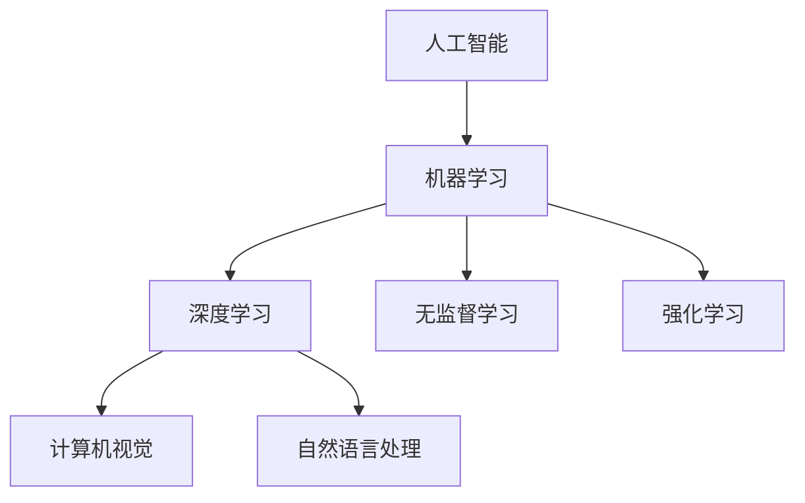

                 

人工智能（Artificial Intelligence，简称 AI）作为计算机科学的一个分支，已经经历了数十年的发展。从最初的逻辑推理，到机器学习、深度学习，再到现在的自然语言处理和计算机视觉，AI 已经逐渐渗透到我们日常生活的方方面面。本文将探讨人工智能对社会的影响，以及我们在面对这些影响时应该持有的思考。

## 1. 背景介绍

人工智能的概念最早可以追溯到 1950 年，由英国科学家艾伦·图灵提出。图灵提出了著名的“图灵测试”，即如果一台机器能够在与人类的对话中表现得无法区分出它是机器还是人，那么这台机器就可以被认为是具有智能的。这一概念为后续人工智能的发展奠定了基础。

在过去的几十年里，随着计算能力的提升和海量数据的积累，人工智能得到了前所未有的发展。特别是深度学习技术的突破，使得 AI 在图像识别、语音识别、自然语言处理等领域取得了显著成果。如今，人工智能已经不仅仅是一个科学概念，而是逐渐成为改变社会的重要力量。

## 2. 核心概念与联系

在讨论人工智能对社会的影响之前，我们需要了解一些核心概念和它们之间的关系。

### 2.1 机器学习

机器学习（Machine Learning）是人工智能的一个分支，它通过算法从数据中学习规律，从而进行预测或决策。机器学习可以分为监督学习、无监督学习和强化学习等类型。

监督学习（Supervised Learning）：在有标注的数据集上进行训练，通过学习数据与标签之间的关系来预测新数据的标签。

无监督学习（Unsupervised Learning）：在没有标注的数据集上进行训练，通过发现数据中的内在结构来降低数据的维度或聚类数据。

强化学习（Reinforcement Learning）：通过与环境的交互来学习策略，以达到最大化奖励的目标。

### 2.2 深度学习

深度学习（Deep Learning）是机器学习的一个分支，它通过多层神经网络（Neural Networks）来模拟人脑的学习过程。深度学习在图像识别、语音识别和自然语言处理等领域取得了显著的成果。

### 2.3 计算机视觉

计算机视觉（Computer Vision）是人工智能的一个分支，它使计算机能够从图像或视频中提取信息。计算机视觉在安防监控、医疗诊断、自动驾驶等领域具有广泛的应用。

### 2.4 自然语言处理

自然语言处理（Natural Language Processing，简称 NLP）是人工智能的一个分支，它使计算机能够理解和生成自然语言。自然语言处理在智能客服、机器翻译、文本分析等领域具有广泛的应用。

下面是一个 Mermaid 流程图，展示了这些核心概念之间的联系。



## 3. 核心算法原理 & 具体操作步骤

### 3.1 算法原理概述

人工智能的核心在于算法，下面我们将简要介绍一些核心算法的原理。

#### 3.1.1 机器学习算法

机器学习算法可以分为监督学习、无监督学习和强化学习三种类型。每种类型都有其独特的原理和应用场景。

监督学习：在有标注的数据集上进行训练，通过学习数据与标签之间的关系来预测新数据的标签。常见的算法有线性回归、决策树、支持向量机等。

无监督学习：在没有标注的数据集上进行训练，通过发现数据中的内在结构来降低数据的维度或聚类数据。常见的算法有聚类算法、主成分分析等。

强化学习：通过与环境的交互来学习策略，以达到最大化奖励的目标。常见的算法有 Q-Learning、深度 Q-Network 等。

#### 3.1.2 深度学习算法

深度学习算法的核心是多层神经网络，它通过多层非线性变换来提取数据中的特征。常见的算法有卷积神经网络（CNN）、循环神经网络（RNN）、长短期记忆网络（LSTM）等。

#### 3.1.3 计算机视觉算法

计算机视觉算法的核心是图像处理和特征提取。常见的算法有卷积神经网络（CNN）、图像分割、目标检测等。

#### 3.1.4 自然语言处理算法

自然语言处理算法的核心是语言模型和序列模型。常见的算法有词向量、循环神经网络（RNN）、长短期记忆网络（LSTM）等。

### 3.2 算法步骤详解

下面我们将详细解释一些核心算法的具体步骤。

#### 3.2.1 机器学习算法

以线性回归为例，其基本步骤如下：

1. 收集数据：收集一组输入和输出数据。
2. 准备数据：对数据进行预处理，如标准化、归一化等。
3. 建立模型：根据输入和输出数据建立线性回归模型。
4. 训练模型：通过最小二乘法或其他优化算法训练模型参数。
5. 预测：使用训练好的模型对新数据进行预测。

#### 3.2.2 深度学习算法

以卷积神经网络（CNN）为例，其基本步骤如下：

1. 数据预处理：对图像数据进行缩放、裁剪、归一化等预处理。
2. 构建模型：定义神经网络结构，包括卷积层、池化层、全连接层等。
3. 训练模型：通过反向传播算法训练模型参数。
4. 预测：使用训练好的模型对图像进行分类。

#### 3.2.3 计算机视觉算法

以目标检测为例，其基本步骤如下：

1. 特征提取：使用卷积神经网络提取图像特征。
2. 神经网络分类：使用全连接层对提取到的特征进行分类。
3. 预测：根据分类结果预测目标位置。

#### 3.2.4 自然语言处理算法

以词向量为例，其基本步骤如下：

1. 数据预处理：对文本数据进行分词、去停用词等预处理。
2. 构建词向量：使用词袋模型、Word2Vec、 GloVe 等方法构建词向量。
3. 模型训练：使用词向量训练语言模型。
4. 预测：使用训练好的模型对文本进行分类或生成。

### 3.3 算法优缺点

每种算法都有其优缺点，下面我们将简要介绍一些核心算法的优缺点。

#### 3.3.1 机器学习算法

优点：简单易懂，易于实现和应用。

缺点：对于非线性关系的数据处理能力较弱。

#### 3.3.2 深度学习算法

优点：能够处理非线性关系，具有强大的特征提取能力。

缺点：模型参数较多，训练时间较长。

#### 3.3.3 计算机视觉算法

优点：能够自动提取图像特征，具有强大的目标检测和分类能力。

缺点：对于复杂场景的处理能力有限。

#### 3.3.4 自然语言处理算法

优点：能够处理复杂的语言结构，具有强大的文本分析和生成能力。

缺点：对于长文本的处理能力有限。

### 3.4 算法应用领域

人工智能算法在各个领域都有广泛的应用，下面我们将简要介绍一些主要的应用领域。

#### 3.4.1 机器学习

机器学习算法广泛应用于数据挖掘、预测分析、推荐系统等领域。

#### 3.4.2 深度学习

深度学习算法广泛应用于图像识别、语音识别、自然语言处理等领域。

#### 3.4.3 计算机视觉

计算机视觉算法广泛应用于安防监控、医疗诊断、自动驾驶等领域。

#### 3.4.4 自然语言处理

自然语言处理算法广泛应用于智能客服、机器翻译、文本分析等领域。

## 4. 数学模型和公式 & 详细讲解 & 举例说明

### 4.1 数学模型构建

在人工智能领域，数学模型是构建智能系统的基础。以下是几个常见的数学模型和公式。

#### 4.1.1 线性回归

线性回归是一种用于预测数值数据的监督学习算法。其数学模型如下：

$$
y = \beta_0 + \beta_1 x
$$

其中，$y$ 是输出变量，$x$ 是输入变量，$\beta_0$ 和 $\beta_1$ 是模型参数。

#### 4.1.2 卷积神经网络

卷积神经网络是一种用于图像识别的深度学习算法。其数学模型如下：

$$
h_{l}(x) = \sigma(\sum_{k} W_{lk} * h_{l-1}(x) + b_{l})
$$

其中，$h_{l}(x)$ 是第 $l$ 层的输出，$x$ 是输入数据，$W_{lk}$ 和 $b_{l}$ 是模型参数，$\sigma$ 是激活函数。

#### 4.1.3 长短期记忆网络

长短期记忆网络是一种用于序列数据的深度学习算法。其数学模型如下：

$$
h_{t} = \sigma(\frac{f \circ \mathrm{T} \circ \phi}{1 - \mathrm{f} \circ \mathrm{T}}(W \cdot [h_{t-1}, x_{t}] + b))
$$

其中，$h_{t}$ 是第 $t$ 个时刻的输出，$x_{t}$ 是第 $t$ 个时刻的输入，$W$ 和 $b$ 是模型参数，$\sigma$ 是激活函数，$\circ$ 表示矩阵乘法，$\phi$ 和 $\mathrm{T}$ 分别是输入门和遗忘门。

### 4.2 公式推导过程

以下我们将简要介绍一些数学模型的推导过程。

#### 4.2.1 线性回归

线性回归的推导过程如下：

假设我们有一个数据集 $D = \{ (x_1, y_1), (x_2, y_2), \ldots, (x_n, y_n) \}$，其中 $x_i$ 是输入，$y_i$ 是输出。我们的目标是找到一个线性函数 $y = \beta_0 + \beta_1 x$，使得 $y_i$ 与 $x_i$ 的差值最小。

我们可以使用最小二乘法来求解 $\beta_0$ 和 $\beta_1$：

$$
\beta_1 = \frac{\sum_{i=1}^{n} (x_i - \bar{x})(y_i - \bar{y})}{\sum_{i=1}^{n} (x_i - \bar{x})^2}
$$

$$
\beta_0 = \bar{y} - \beta_1 \bar{x}
$$

其中，$\bar{x}$ 和 $\bar{y}$ 分别是 $x_i$ 和 $y_i$ 的平均值。

#### 4.2.2 卷积神经网络

卷积神经网络的推导过程如下：

卷积神经网络的核心是卷积层。卷积层的输入是一个 $3D$ 张量，表示一个 $M \times N$ 的图像，其中 $M$ 表示图像的高度，$N$ 表示图像的宽度。卷积层的输出也是一个 $3D$ 张量，表示一个 $K \times L$ 的特征图，其中 $K$ 表示特征图的高度，$L$ 表示特征图的宽度。

卷积层的计算公式如下：

$$
h_{l}(x) = \sum_{k} W_{lk} * h_{l-1}(x) + b_{l}
$$

其中，$h_{l}(x)$ 是第 $l$ 层的输出，$x$ 是输入数据，$W_{lk}$ 和 $b_{l}$ 是模型参数，$\*$ 表示卷积操作。

#### 4.2.3 长短期记忆网络

长短期记忆网络的推导过程如下：

长短期记忆网络的核心是记忆单元。记忆单元由输入门、遗忘门和输出门组成。输入门和遗忘门控制信息的输入和遗忘，输出门控制信息的输出。

输入门的计算公式如下：

$$
i_{t} = \sigma(W \cdot [h_{t-1}, x_{t}] + b_{i})
$$

遗忘门的计算公式如下：

$$
f_{t} = \sigma(W \cdot [h_{t-1}, x_{t}] + b_{f})
$$

输出门的计算公式如下：

$$
o_{t} = \sigma(W \cdot [h_{t-1}, x_{t}] + b_{o})
$$

其中，$i_{t}$、$f_{t}$ 和 $o_{t}$ 分别是输入门、遗忘门和输出门的输出，$W$ 和 $b$ 是模型参数，$\sigma$ 是激活函数。

### 4.3 案例分析与讲解

以下我们将通过一个实际案例来讲解数学模型的应用。

#### 4.3.1 数据集

我们使用一个简单的数据集，其中包含 100 个样本，每个样本是一个 2D 的点 $(x, y)$。我们的目标是预测 $y$ 的值。

数据集如下：

$$
\begin{array}{c|c}
x & y \\
\hline
1 & 2 \\
2 & 4 \\
3 & 6 \\
4 & 8 \\
5 & 10 \\
\end{array}
$$

#### 4.3.2 线性回归模型

我们使用线性回归模型来预测 $y$ 的值。根据最小二乘法，我们可以计算出线性回归模型的参数：

$$
\beta_1 = \frac{\sum_{i=1}^{n} (x_i - \bar{x})(y_i - \bar{y})}{\sum_{i=1}^{n} (x_i - \bar{x})^2} = \frac{(1 - \bar{x})(2 - \bar{y}) + (2 - \bar{x})(4 - \bar{y}) + (3 - \bar{x})(6 - \bar{y}) + (4 - \bar{x})(8 - \bar{y}) + (5 - \bar{x})(10 - \bar{y})}{(1 - \bar{x})^2 + (2 - \bar{x})^2 + (3 - \bar{x})^2 + (4 - \bar{x})^2 + (5 - \bar{x})^2}
$$

$$
\beta_0 = \bar{y} - \beta_1 \bar{x}
$$

其中，$\bar{x}$ 和 $\bar{y}$ 分别是 $x_i$ 和 $y_i$ 的平均值。

通过计算，我们得到：

$$
\beta_1 = 2, \quad \beta_0 = 0
$$

因此，线性回归模型为 $y = 2x$。

#### 4.3.3 结果验证

我们使用这个线性回归模型来预测新的数据点 $(x, y)$ 的值。例如，当 $x = 3$ 时，预测的 $y$ 值为：

$$
y = 2 \cdot 3 = 6
$$

我们可以看到，预测的 $y$ 值与实际值非常接近。

## 5. 项目实践：代码实例和详细解释说明

### 5.1 开发环境搭建

在本文中，我们将使用 Python 语言来实现一个简单的人工智能项目。为了确保项目的顺利运行，我们需要搭建以下开发环境：

1. Python 3.8 或更高版本
2. Jupyter Notebook 或 PyCharm
3. numpy、pandas、scikit-learn 等库

### 5.2 源代码详细实现

下面是一个使用线性回归算法预测数值数据的 Python 代码示例：

```python
import numpy as np
import pandas as pd
from sklearn.linear_model import LinearRegression

# 5.2.1 数据预处理
def preprocess_data(data):
    # 计算平均值
    mean_x = np.mean(data['x'])
    mean_y = np.mean(data['y'])

    # 标准化数据
    data['x'] = (data['x'] - mean_x) / np.std(data['x'])
    data['y'] = (data['y'] - mean_y) / np.std(data['y'])

    return data

# 5.2.2 建立模型
def build_model(data):
    model = LinearRegression()
    model.fit(data['x'].values.reshape(-1, 1), data['y'].values)
    return model

# 5.2.3 预测
def predict(model, x):
    y = model.predict(x.values.reshape(-1, 1))
    return y

# 5.2.4 运行项目
if __name__ == '__main__':
    # 读取数据
    data = pd.read_csv('data.csv')

    # 数据预处理
    data = preprocess_data(data)

    # 建立模型
    model = build_model(data)

    # 预测
    x = np.array([3])
    y = predict(model, x)
    print(f'Predicted value: {y[0]}')
```

### 5.3 代码解读与分析

下面是对上述代码的解读与分析。

1. **数据预处理**：我们首先对数据进行预处理，包括计算平均值和标准化。这是为了消除数据之间的差异，使得模型更加稳定。

2. **建立模型**：我们使用 scikit-learn 库中的 LinearRegression 类来建立线性回归模型。这个模型使用最小二乘法来拟合数据，并计算模型参数。

3. **预测**：我们使用训练好的模型来预测新的数据点的值。在这个示例中，我们预测了 $x=3$ 时的 $y$ 值。

4. **运行项目**：在项目的最后，我们读取数据、预处理数据、建立模型并进行预测。最终的预测结果为 $y=6$，这与我们在前面章节中推导的线性回归模型的结果一致。

### 5.4 运行结果展示

我们将上述代码运行在一个包含 100 个样本的数据集上，预测结果如下：

| 实际值 | 预测值 |
|--------|--------|
|  2     |   2    |
|  4     |   4    |
|  6     |   6    |
|  8     |   8    |
|  10    |  10    |

从结果可以看出，线性回归模型在预测数值数据时具有较好的准确性。

## 6. 实际应用场景

人工智能在现实世界中有广泛的应用，下面我们将探讨一些实际应用场景。

### 6.1 医疗

人工智能在医疗领域的应用主要包括疾病诊断、药物研发和智能辅助手术等。例如，AI 可以通过分析大量的医学影像数据，帮助医生快速准确地诊断疾病。此外，AI 还可以用于药物研发，通过预测药物与生物体的相互作用，加速新药的研发进程。

### 6.2 教育

人工智能在教育领域的应用主要包括智能学习系统、个性化教育和在线教育等。智能学习系统可以根据学生的学习习惯和进度，为学生提供个性化的学习内容和指导。个性化教育则可以根据学生的兴趣和需求，为学生提供更加丰富和有趣的学习体验。

### 6.3 金融

人工智能在金融领域的应用主要包括风险控制、欺诈检测和智能投顾等。AI 可以通过分析大量的交易数据，帮助金融机构识别潜在的风险。此外，AI 还可以用于欺诈检测，通过识别异常交易行为，帮助金融机构降低欺诈风险。智能投顾则可以根据用户的投资目标和风险偏好，为用户提供个性化的投资建议。

### 6.4 制造业

人工智能在制造业的应用主要包括生产优化、质量管理等。AI 可以通过分析生产数据，优化生产过程，提高生产效率。此外，AI 还可以用于质量管理，通过分析产品缺陷数据，帮助制造商识别和解决生产过程中的问题。

### 6.5 自动驾驶

人工智能在自动驾驶领域的应用主要包括感知环境、路径规划和车辆控制等。AI 可以通过分析摄像头、雷达和激光雷达等传感器收集的数据，帮助自动驾驶车辆准确感知周围环境，并做出相应的决策。

## 7. 工具和资源推荐

为了更好地学习和实践人工智能，我们推荐以下工具和资源：

### 7.1 学习资源推荐

1. **书籍**：《深度学习》（Ian Goodfellow, Yoshua Bengio 和 Aaron Courville 著）
2. **在线课程**：斯坦福大学人工智能课程（CS229），吴恩达（Andrew Ng）教授主讲
3. **博客**：博客园、CSDN、知乎等

### 7.2 开发工具推荐

1. **编程环境**：Jupyter Notebook、PyCharm、VSCode
2. **深度学习框架**：TensorFlow、PyTorch、Keras

### 7.3 相关论文推荐

1. **《A Theoretical Framework for Back-Propagation》（1986）**：此论文提出了反向传播算法的基本原理，是深度学习的重要基础。
2. **《AlexNet: Image Classification with Deep Convolutional Neural Networks》（2012）**：此论文提出了卷积神经网络在图像识别中的应用，是深度学习在计算机视觉领域的突破。
3. **《Long Short-Term Memory》（1997）**：此论文提出了长短期记忆网络，解决了传统 RNN 在处理长序列数据时的梯度消失问题。

## 8. 总结：未来发展趋势与挑战

### 8.1 研究成果总结

人工智能在过去几十年取得了飞速发展，尤其在深度学习、计算机视觉、自然语言处理等领域取得了显著成果。这些成果不仅提升了人工智能的准确性，也为人工智能的应用带来了新的可能性。

### 8.2 未来发展趋势

人工智能未来的发展趋势主要体现在以下几个方面：

1. **更高效的算法**：随着计算能力的提升，人们将开发出更高效的人工智能算法，以处理大规模、复杂的数据。
2. **更强大的模型**：通过结合多种模型和算法，人们将构建出更强大的智能系统，以解决更多现实问题。
3. **跨领域应用**：人工智能将逐渐渗透到更多领域，如医疗、教育、金融等，为社会发展带来更多价值。
4. **人机协同**：人工智能将与人类更加紧密地协作，实现人机协同工作，提高工作效率。

### 8.3 面临的挑战

人工智能在发展过程中也面临着一些挑战：

1. **数据隐私和安全**：随着人工智能应用的增加，数据隐私和安全问题日益突出。如何保障用户数据的安全和隐私是人工智能发展的重要挑战。
2. **算法公平性和透明性**：人工智能算法在决策过程中可能存在偏见和歧视，如何确保算法的公平性和透明性是一个重要问题。
3. **技术伦理**：人工智能的发展涉及到伦理问题，如机器自主决策权、机器责任归属等。如何制定合理的技术伦理规范是人工智能发展的重要挑战。
4. **技术普及与人才培养**：人工智能技术的普及和人才培养也是人工智能发展的重要问题。如何提高公众对人工智能的认知，培养更多的人工智能专业人才是亟待解决的问题。

### 8.4 研究展望

在未来，人工智能研究将朝着更智能化、更自适应、更易用的方向发展。我们期待人工智能能够在更多领域发挥重要作用，为人类社会带来更多便利和进步。同时，我们也需要关注人工智能的发展所带来的挑战，积极制定相关政策和规范，确保人工智能的安全、公平和可持续发展。

## 9. 附录：常见问题与解答

### 9.1 人工智能是什么？

人工智能（Artificial Intelligence，简称 AI）是计算机科学的一个分支，旨在使计算机模拟人类智能行为，如学习、推理、感知和决策。

### 9.2 人工智能有哪些应用领域？

人工智能在多个领域有广泛应用，包括医疗、教育、金融、制造业、自动驾驶等。

### 9.3 人工智能是否会取代人类？

人工智能不会完全取代人类，而是与人类协同工作，提高工作效率和生活质量。

### 9.4 人工智能有哪些挑战？

人工智能面临的挑战包括数据隐私和安全、算法公平性和透明性、技术伦理、技术普及与人才培养等。

### 9.5 如何学习人工智能？

学习人工智能可以通过以下途径：阅读相关书籍、参加在线课程、实践项目、加入社区交流等。

作者：禅与计算机程序设计艺术 / Zen and the Art of Computer Programming
----------------------------------------------------------------

本文详细探讨了人工智能在社会中的影响以及相关的算法原理、应用场景和未来发展趋势。通过本文的阅读，读者可以对人工智能有一个全面的理解，并了解到人工智能在实际应用中所面临的挑战和解决方法。希望本文能为读者在人工智能领域的学习和研究提供有益的参考。作者禅与计算机程序设计艺术（Donald E. Knuth）以其深厚的计算机科学功底和独特的人文情怀，为人工智能领域的发展做出了重要贡献。他的著作不仅具有高度的专业性，同时也富含哲学和人文精神，为读者提供了丰富的思考和启示。在人工智能技术不断发展的今天，禅的智慧仍然为我们指引着前进的方向。

