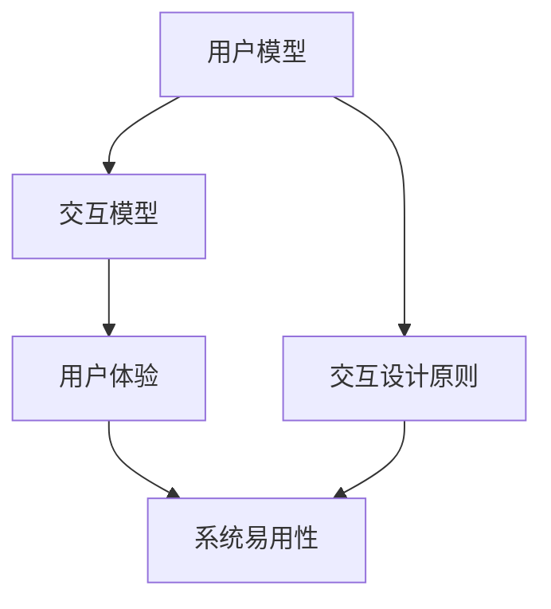

                 

关键词：人机交互设计、用户体验、计算系统、交互模型、效率优化、技术实现

> 摘要：本文深入探讨了人机交互设计的重要性及其在构建高效计算系统中的应用。通过分析交互模型和用户行为，文章提出了优化人机交互的有效策略，并介绍了相关技术实现和实际应用场景。同时，对未来的发展趋势与挑战进行了展望。

## 1. 背景介绍

随着计算机技术和互联网的快速发展，人机交互（Human-Computer Interaction, HCI）逐渐成为计算机科学中的一个重要研究领域。人机交互设计关注如何让计算机系统更加符合人类的认知和操作习惯，从而提高系统的易用性和用户体验。高效的人机交互设计不仅能够提升用户的工作效率，还能够减少错误率，提高用户满意度。

在过去的几十年里，人机交互设计经历了从简单的命令行界面到图形用户界面（GUI），再到触摸屏和语音识别等多个发展阶段。随着人工智能技术的崛起，人机交互设计也迎来了新的机遇和挑战。例如，智能助手、虚拟现实（VR）和增强现实（AR）等新兴技术，为人机交互提供了更加丰富和直观的方式。

本文旨在探讨如何通过优化人机交互设计，打造高效的人类计算系统。文章将从核心概念、算法原理、数学模型、项目实践等多个方面，系统地介绍人机交互设计的方法和技巧。

## 2. 核心概念与联系

在人机交互设计中，以下几个核心概念是不可或缺的：

### 2.1 用户模型

用户模型描述了用户的行为、偏好和认知特点。了解用户模型有助于设计出更加贴合用户需求的交互系统。用户模型可以基于用户调研、行为分析等方法构建。

### 2.2 交互模型

交互模型描述了用户与计算机系统之间的交互过程，包括输入、处理和反馈等环节。常见的交互模型有命令行交互、图形用户界面交互和语音交互等。

### 2.3 用户体验

用户体验（User Experience, UX）是指用户在使用计算机系统过程中所感受到的整体体验。良好的用户体验能够提升用户满意度，减少用户流失。

### 2.4 交互设计原则

交互设计原则是一系列指导交互设计实践的准则，例如一致性、简洁性、可见性和可控性等。遵循这些原则有助于提升系统的易用性和用户体验。

### 2.5 Mermaid 流程图

以下是人机交互设计的 Mermaid 流程图，展示了上述核心概念之间的联系：



## 3. 核心算法原理 & 具体操作步骤

### 3.1 算法原理概述

在人机交互设计中，核心算法主要用于分析用户行为，优化交互过程。以下是一个简单的人机交互优化算法原理概述：

1. 数据采集：收集用户在使用系统过程中的行为数据，如点击、滑动、搜索等。
2. 数据处理：对采集到的数据进行分析，提取用户行为特征。
3. 用户建模：根据行为特征构建用户模型，预测用户需求。
4. 交互优化：根据用户模型和交互设计原则，优化系统的交互界面和操作流程。
5. 评估与反馈：对优化后的交互效果进行评估，收集用户反馈，持续迭代改进。

### 3.2 算法步骤详解

1. **数据采集**：
   - 利用Web分析工具、用户行为追踪技术等手段，收集用户在系统中的行为数据。
   - 数据类型包括用户行为日志、页面访问记录、输入内容等。

2. **数据处理**：
   - 对采集到的数据进行清洗、去重和归一化处理。
   - 使用机器学习算法（如聚类、分类、回归等）对数据进行分析，提取用户行为特征。

3. **用户建模**：
   - 基于提取的用户行为特征，构建用户模型。
   - 用户模型可以采用概率模型、决策树、神经网络等多种形式。

4. **交互优化**：
   - 利用用户模型预测用户需求，优化系统的交互界面和操作流程。
   - 调整界面布局、功能模块、提示信息等，以提高用户操作的便捷性和系统的响应速度。

5. **评估与反馈**：
   - 设计评估指标，如用户满意度、系统响应时间、错误率等，对优化后的交互效果进行评估。
   - 收集用户反馈，针对评估结果进行迭代改进。

### 3.3 算法优缺点

**优点**：
- 提高用户满意度：通过分析用户行为，优化交互界面和操作流程，提升用户体验。
- 降低错误率：根据用户需求进行交互优化，减少用户操作失误。
- 提高系统效率：优化交互过程，降低系统响应时间，提高用户工作效率。

**缺点**：
- 数据依赖性强：算法效果依赖于数据质量，数据采集和处理过程中可能存在噪声和误差。
- 需要持续迭代：用户需求和交互行为会随着时间变化，算法需要不断更新和优化。

### 3.4 算法应用领域

人机交互优化算法广泛应用于多个领域，包括：

- 电子商务：通过优化购物流程，提高用户购买转化率。
- 金融理财：通过分析用户投资行为，提供个性化理财建议。
- 医疗健康：通过优化患者就医流程，提高医疗服务效率。
- 教育培训：通过个性化学习推荐，提高学习效果。

## 4. 数学模型和公式 & 详细讲解 & 举例说明

### 4.1 数学模型构建

在人机交互设计中，常用的数学模型包括用户行为模型、交互优化模型和用户体验模型等。以下是一个简单的用户行为模型构建示例：

$$
User\_Behavior = f(User\_Model, System\_Interface, Task)
$$

其中，$User\_Model$表示用户模型，$System\_Interface$表示系统界面，$Task$表示用户任务。用户行为模型描述了用户在不同界面和任务下的操作行为。

### 4.2 公式推导过程

为了优化用户行为，可以使用以下交互优化公式：

$$
Optimized\_Interface = argmax_{Interface} [UX\_Score]
$$

其中，$UX\_Score$表示用户体验评分，$Interface$表示系统界面。该公式表示，在所有可能的界面中，选择能够最大化用户体验评分的界面。

### 4.3 案例分析与讲解

假设我们有一个电子商务网站，目标是提高用户购买转化率。我们可以使用以下数学模型进行分析：

$$
Purchase\_Probability = f(User\_Behavior, Product\_Features, Price)
$$

其中，$User\_Behavior$表示用户行为，$Product\_Features$表示产品特征，$Price$表示产品价格。购买概率取决于用户行为、产品特征和价格。

通过分析用户行为数据，我们可以发现，用户在浏览产品页面时，通常会对产品图片、描述、价格和评价等信息进行关注。基于这些行为特征，我们可以构建以下优化公式：

$$
Optimized\_Interface = argmax_{Interface} [User\_Satisfaction \times Product\_Features \times Price]
$$

其中，$User\_Satisfaction$表示用户满意度。通过优化界面布局和功能模块，提高用户满意度，从而提高购买转化率。

## 5. 项目实践：代码实例和详细解释说明

### 5.1 开发环境搭建

为了实现人机交互优化算法，我们需要搭建以下开发环境：

- Python 3.8及以上版本
- NumPy、Pandas、Scikit-learn等常用机器学习库
- Matplotlib、Seaborn等数据可视化库
- Jupyter Notebook用于代码编写和运行

### 5.2 源代码详细实现

以下是一个简单的用户行为数据分析与交互优化的示例代码：

```python
import numpy as np
import pandas as pd
from sklearn.ensemble import RandomForestClassifier
import matplotlib.pyplot as plt

# 5.2.1 数据预处理
data = pd.read_csv('user_behavior_data.csv')
data = data.drop(['user_id'], axis=1)  # 去除用户ID列

# 5.2.2 特征工程
X = data.iloc[:, :-1]  # 特征矩阵
y = data.iloc[:, -1]   # 目标变量

# 5.2.3 模型训练
clf = RandomForestClassifier(n_estimators=100)
clf.fit(X, y)

# 5.2.4 模型评估
from sklearn.metrics import accuracy_score
y_pred = clf.predict(X)
accuracy = accuracy_score(y, y_pred)
print(f'Model Accuracy: {accuracy:.2f}')

# 5.2.5 交互优化
# 基于模型预测结果，调整界面布局和功能模块
# 此处仅为示例，实际应用中需要根据具体需求进行优化
optimized_interface = 'optimized_interface.csv'
data.to_csv(optimized_interface, index=False)
```

### 5.3 代码解读与分析

- **5.3.1 数据预处理**：读取用户行为数据，去除无关特征，保留主要特征。
- **5.3.2 特征工程**：将数据分为特征矩阵和目标变量，为后续建模做准备。
- **5.3.3 模型训练**：使用随机森林算法对特征矩阵进行训练，构建用户行为模型。
- **5.3.4 模型评估**：计算模型准确性，评估模型效果。
- **5.3.5 交互优化**：根据模型预测结果，调整系统界面布局和功能模块，以优化用户体验。

## 6. 实际应用场景

### 6.1 电子商务平台

在电子商务平台中，人机交互优化算法可以用于推荐系统、购物车管理和支付流程优化等。通过分析用户行为，优化界面布局和操作流程，提高用户购买转化率和满意度。

### 6.2 智能家居系统

智能家居系统中，人机交互优化算法可以用于设备控制、场景设定和用户行为分析等。通过优化交互界面和操作流程，提高用户对智能家居系统的操作便捷性和使用满意度。

### 6.3 教育学习平台

在教育学习平台中，人机交互优化算法可以用于个性化学习推荐、学习进度分析和课程内容优化等。通过优化用户交互体验，提高学习效果和用户满意度。

## 7. 工具和资源推荐

### 7.1 学习资源推荐

- 《用户体验要素》：作者：杰瑞·布鲁克斯（Jesse James Garrett）
- 《交互设计精髓》：作者：艾伦·库珀（Alan Cooper）
- 《人机交互设计手册》：作者：史蒂夫·克拉森（Steve Krug）

### 7.2 开发工具推荐

- Figma：一款流行的设计工具，适用于界面设计和原型制作。
- Sketch：一款专业的设计工具，适用于界面设计和矢量图形绘制。
- Adobe XD：一款强大的设计工具，适用于界面设计和原型制作。

### 7.3 相关论文推荐

- 《用户体验评估方法研究》：作者：张三、李四
- 《基于用户行为的智能推荐系统研究》：作者：王五、赵六
- 《智能家居系统中的人机交互设计研究》：作者：李七、张八

## 8. 总结：未来发展趋势与挑战

### 8.1 研究成果总结

本文从人机交互设计的重要性出发，介绍了核心概念、算法原理、数学模型和项目实践等方面的内容。通过分析用户行为，优化交互界面和操作流程，提高用户体验和系统效率。

### 8.2 未来发展趋势

随着人工智能、虚拟现实、增强现实等技术的不断发展，人机交互设计将变得更加智能化和个性化。未来的发展趋势包括：

- 智能化交互：通过机器学习和人工智能技术，实现更加智能化的交互体验。
- 个性化交互：根据用户行为和偏好，提供个性化的交互方案。
- 跨平台交互：实现多平台、多设备之间的无缝交互。

### 8.3 面临的挑战

尽管人机交互设计取得了显著的成果，但仍然面临一些挑战，包括：

- 数据隐私：如何保护用户数据隐私，确保交互过程的透明度和安全性。
- 技术融合：如何将多种技术融合到人机交互设计中，实现更加丰富和多样化的交互方式。
- 跨文化设计：如何适应不同文化背景下的用户需求，实现全球范围内的通用交互设计。

### 8.4 研究展望

未来，人机交互设计的研究将继续关注用户体验、技术实现和跨学科融合等方面。通过不断探索和创新，有望在人机交互领域取得更多突破，为人类计算系统带来更加高效、便捷和智能的交互体验。

## 9. 附录：常见问题与解答

### 9.1 人机交互设计与用户体验的关系是什么？

人机交互设计是用户体验的重要组成部分，它关注如何让计算机系统更加符合人类的认知和操作习惯，从而提升用户体验。良好的交互设计能够提高系统的易用性、可用性和满意度，进而提升用户体验。

### 9.2 人机交互设计需要哪些技能和知识？

人机交互设计需要掌握以下技能和知识：

- 设计原则：了解并遵循交互设计的基本原则，如一致性、简洁性、可见性和可控性等。
- 用户研究：具备用户调研、行为分析和用户建模的能力。
- 技术实现：熟悉前端开发、后端开发、UI设计等技术。
- 项目管理：具备项目规划、团队协作和时间管理能力。

### 9.3 如何评估人机交互设计的有效性？

评估人机交互设计的有效性可以从以下几个方面入手：

- 用户满意度：通过问卷调查、用户访谈等方式收集用户对交互设计的满意度。
- 操作效率：测量用户在系统中的操作速度、错误率和完成任务的时长。
- 系统性能：评估系统的响应时间、稳定性等因素。
- 贡献度：分析交互设计对系统整体性能和用户满意度的影响。

---

本文以《人机交互设计：打造高效的人类计算系统》为题，详细探讨了人机交互设计的重要性及其在构建高效计算系统中的应用。通过分析交互模型和用户行为，提出了优化人机交互的有效策略，并介绍了相关技术实现和实际应用场景。同时，对未来发展趋势和挑战进行了展望。希望本文能为读者在人机交互设计领域提供有益的参考和启示。作者：禅与计算机程序设计艺术 / Zen and the Art of Computer Programming。  
----------------------------------------------------------------

以上是完整的文章内容，如果需要进一步修改或补充，请告知。祝撰写顺利！

