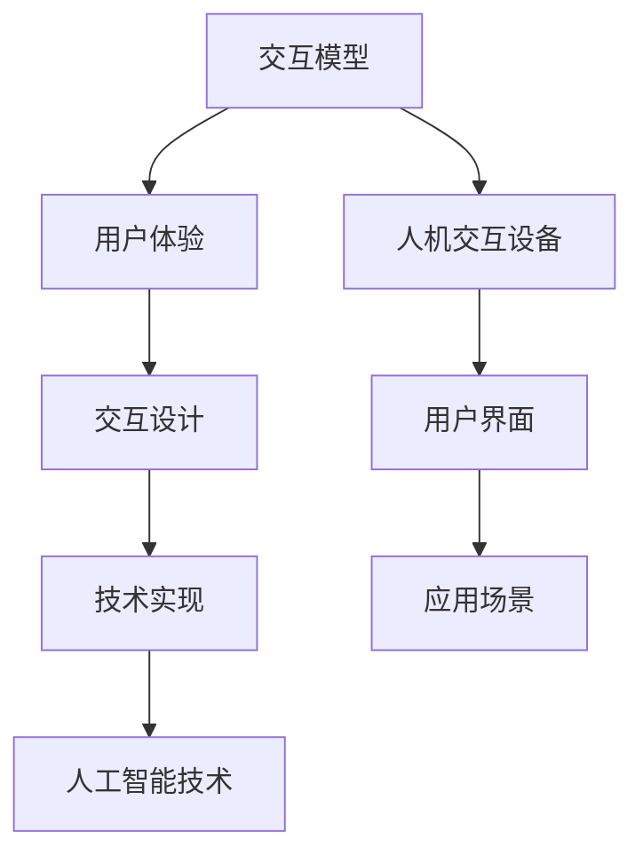

                 

关键词：人机交互、计算系统、用户体验、交互设计、技术实现、人工智能

> 摘要：本文将探讨如何通过人机交互技术打造高效便捷的人类计算系统。首先介绍人机交互的背景和发展历程，然后分析人机交互的核心概念与联系，接着深入讲解核心算法原理和具体操作步骤，随后介绍数学模型和公式，通过实例进行说明，最后探讨实际应用场景和未来发展趋势。

## 1. 背景介绍

人机交互（Human-Computer Interaction，简称HCI）是计算机科学中的一个重要领域，它研究的是人与计算机系统之间的交互方式。随着计算机技术的快速发展，人机交互在现代社会中扮演了越来越重要的角色。从早期的命令行界面到图形用户界面（GUI），再到如今的人工智能交互系统，人机交互技术经历了多个发展阶段。

### 1.1 命令行界面时代

在计算机刚刚普及的早期，命令行界面（Command Line Interface，CLI）是主流的人机交互方式。用户通过输入一系列命令来控制计算机，这种方式对用户的技术水平有较高的要求，但因其效率较高，在许多专业领域仍然广泛应用。

### 1.2 图形用户界面时代

随着图形用户界面（Graphical User Interface，GUI）的出现，人机交互变得更加直观和便捷。鼠标和键盘的普及使得用户可以通过图形界面直观地进行操作，从而降低了用户的学习成本。

### 1.3 人工智能交互时代

近年来，随着人工智能技术的发展，智能语音助手、聊天机器人等成为人们日常生活中常见的交互方式。这些系统通过自然语言处理技术，能够理解并响应用户的语音指令，为用户提供更加个性化的服务。

## 2. 核心概念与联系

人机交互的核心概念包括交互模型、用户体验、交互设计和技术实现等。以下是一个简要的 Mermaid 流程图，展示了这些概念之间的联系。



### 2.1 交互模型

交互模型是描述用户与计算机系统之间交互过程的理论框架。常见的交互模型包括基于事件驱动、任务驱动和对话驱动的模型。这些模型有助于理解用户的需求和行为，从而设计出更加符合用户使用习惯的交互界面。

### 2.2 用户体验

用户体验（User Experience，简称UX）是指用户在使用产品或服务过程中所获得的总体感受。在打造高效便捷的人类计算系统时，用户体验至关重要。设计师需要从用户的角度出发，考虑如何优化用户界面、提高交互效率，从而提升用户的满意度。

### 2.3 交互设计

交互设计（Interaction Design）是设计用户与产品之间交互过程的一门艺术和科学。交互设计师需要通过调研、用户测试等方法，理解用户需求，设计出易于使用、符合用户预期的交互流程和界面。

### 2.4 技术实现

技术实现是交互设计的核心，它包括编程语言、框架、数据库等技术选择和实现。技术实现的目的是将交互设计转化为实际可用的系统，从而满足用户的需求。

### 2.5 人工智能技术

人工智能技术为人机交互带来了新的可能性。通过自然语言处理、机器学习等技术，计算机系统能够更好地理解用户的意图，提供更加智能化的服务。

### 2.6 人机交互设备

人机交互设备是用户与计算机系统之间的桥梁。从键盘、鼠标到触摸屏、语音助手，不同的交互设备提供了不同的交互方式，丰富了人机交互的形式和体验。

### 2.7 用户界面

用户界面（User Interface，简称UI）是用户与计算机系统之间的直接交互窗口。一个良好的用户界面应该简洁、直观、易于操作，使用户能够快速完成任务。

### 2.8 应用场景

应用场景是指人机交互技术在实际生活中的具体应用。从桌面应用、移动应用，到智能家居、智能穿戴设备，人机交互技术无处不在，为人们的生活和工作带来了极大的便利。

## 3. 核心算法原理 & 具体操作步骤

在人机交互系统中，核心算法的原理和具体操作步骤至关重要。以下将详细介绍这些内容。

### 3.1 算法原理概述

人机交互系统中的核心算法主要涉及自然语言处理（Natural Language Processing，简称NLP）、机器学习（Machine Learning，简称ML）和用户行为分析（User Behavior Analysis）等技术。

### 3.2 算法步骤详解

#### 3.2.1 自然语言处理

自然语言处理是人工智能的一个重要分支，它致力于让计算机理解和处理人类语言。自然语言处理的算法步骤通常包括：

1. **文本预处理**：对输入的文本进行分词、去停用词、词性标注等预处理操作，以便后续处理。
2. **语言模型**：使用统计模型或深度学习模型训练语言模型，用于预测下一个词或句子。
3. **意图识别**：根据语言模型预测的结果，识别用户的意图，如查询信息、执行命令等。
4. **实体识别**：从用户的输入中提取关键信息，如人名、地名、时间等。

#### 3.2.2 机器学习

机器学习是构建人机交互系统的重要技术之一。机器学习的算法步骤通常包括：

1. **数据收集**：收集大量的用户交互数据，包括文本、音频、视频等。
2. **特征提取**：从原始数据中提取出有代表性的特征，如文本中的关键词、音频中的音高变化等。
3. **模型训练**：使用特征数据和标签数据训练机器学习模型，如决策树、支持向量机、神经网络等。
4. **模型评估**：使用测试数据评估模型的性能，包括准确率、召回率、F1值等指标。
5. **模型部署**：将训练好的模型部署到实际系统中，为用户提供智能服务。

#### 3.2.3 用户行为分析

用户行为分析是指通过分析用户在系统中的行为，了解用户的需求和偏好，从而优化系统设计和交互体验。用户行为分析的算法步骤通常包括：

1. **行为记录**：记录用户在系统中的所有操作，如点击、浏览、搜索等。
2. **行为分类**：对用户行为进行分类，如浏览行为、购买行为、提问行为等。
3. **行为分析**：分析用户行为的模式、趋势和相关性，发现用户的需求和偏好。
4. **行为反馈**：根据用户行为分析的结果，为用户提供个性化服务和建议。

### 3.3 算法优缺点

每种算法都有其独特的优点和缺点。以下是对自然语言处理、机器学习和用户行为分析算法优缺点的简要分析：

#### 自然语言处理

**优点**：
- 能够处理自然语言，为用户提供智能化的交互体验。
- 可以处理大量文本数据，提取有用信息。

**缺点**：
- 对语言理解的要求较高，容易出现语义混淆。
- 处理速度较慢，对计算资源要求较高。

#### 机器学习

**优点**：
- 能够通过训练自动学习，提高系统的智能水平。
- 可以处理复杂数据，适用于多种应用场景。

**缺点**：
- 需要大量的训练数据和计算资源。
- 模型的解释性较差，难以理解模型的具体决策过程。

#### 用户行为分析

**优点**：
- 可以深入了解用户需求，提供个性化服务。
- 可以优化系统设计和交互流程。

**缺点**：
- 数据隐私问题，需要确保用户数据的安全和隐私。
- 需要大量的数据处理和分析能力。

### 3.4 算法应用领域

自然语言处理、机器学习和用户行为分析算法在多个领域都有广泛应用：

#### 自然语言处理

- 智能客服
- 语音助手
- 搜索引擎

#### 机器学习

- 金融风控
- 医疗诊断
- 物流优化

#### 用户行为分析

- 电子商务
- 社交网络
- 智能家居

## 4. 数学模型和公式 & 详细讲解 & 举例说明

在人机交互系统中，数学模型和公式是算法实现的基础。以下将详细介绍数学模型的构建、公式推导过程以及实际案例的讲解。

### 4.1 数学模型构建

#### 4.1.1 自然语言处理

自然语言处理中的数学模型主要包括语言模型、词向量模型和序列标注模型等。以下是一个简单的语言模型构建过程：

1. **数据预处理**：对语料库进行分词、去停用词、词性标注等操作，将文本转换为数字序列。

2. **模型选择**：选择合适的语言模型，如n-gram模型、神经网络模型等。

3. **参数训练**：使用训练数据训练模型，学习文本的统计特性。

4. **模型评估**：使用测试数据评估模型的性能，调整模型参数。

#### 4.1.2 机器学习

机器学习中的数学模型包括线性回归、逻辑回归、决策树、支持向量机等。以下是一个简单的线性回归模型构建过程：

1. **数据预处理**：对数据进行归一化、缺失值处理等操作，将数据转换为模型可接受的格式。

2. **特征选择**：选择对预测目标有影响的特征，剔除无关特征。

3. **模型训练**：使用训练数据训练模型，学习数据中的特征关系。

4. **模型评估**：使用测试数据评估模型的性能，调整模型参数。

#### 4.1.3 用户行为分析

用户行为分析中的数学模型主要包括用户行为预测模型、用户偏好模型等。以下是一个简单的用户行为预测模型构建过程：

1. **数据预处理**：对用户行为数据进行分词、去停用词、词性标注等操作，将行为转换为数字序列。

2. **模型选择**：选择合适的用户行为预测模型，如序列模型、神经网络模型等。

3. **参数训练**：使用训练数据训练模型，学习用户行为模式。

4. **模型评估**：使用测试数据评估模型的性能，调整模型参数。

### 4.2 公式推导过程

以下是对线性回归模型中公式推导过程的简要说明：

#### 4.2.1 线性回归模型

线性回归模型是一种简单的机器学习模型，用于预测数值型目标变量。其数学模型可以表示为：

$$y = \beta_0 + \beta_1 \cdot x_1 + \beta_2 \cdot x_2 + ... + \beta_n \cdot x_n + \epsilon$$

其中，$y$ 是目标变量，$x_1, x_2, ..., x_n$ 是特征变量，$\beta_0, \beta_1, \beta_2, ..., \beta_n$ 是模型参数，$\epsilon$ 是误差项。

#### 4.2.2 公式推导

假设我们有一个训练数据集，其中包含$m$个样本，每个样本包含$n$个特征和1个目标变量。我们可以将训练数据集表示为$D = \{(x_1, y_1), (x_2, y_2), ..., (x_m, y_m)\}$。

线性回归模型的损失函数为：

$$J(\theta) = \frac{1}{2m} \sum_{i=1}^{m} (y_i - \theta^T x_i)^2$$

其中，$\theta$ 是模型参数向量。

为了最小化损失函数$J(\theta)$，我们可以使用梯度下降法进行参数优化。梯度下降法的步骤如下：

1. 初始化模型参数$\theta$。
2. 计算损失函数关于每个参数的梯度。
3. 更新参数$\theta$：$\theta = \theta - \alpha \cdot \nabla J(\theta)$，其中$\alpha$ 是学习率。

### 4.3 案例分析与讲解

以下是一个简单的线性回归模型应用案例：

#### 4.3.1 案例背景

假设我们想要预测某城市的房价，基于以下特征：房屋面积、房屋年龄、房屋类型等。

#### 4.3.2 案例步骤

1. **数据收集**：收集包含房价和特征的数据集。
2. **数据预处理**：对数据进行归一化、缺失值处理等操作。
3. **特征选择**：选择对房价有显著影响的特征。
4. **模型训练**：使用线性回归模型训练数据集，学习特征与房价之间的关系。
5. **模型评估**：使用测试数据评估模型性能，调整模型参数。
6. **模型部署**：将训练好的模型部署到实际系统中，为用户提供房价预测服务。

#### 4.3.3 模型结果

经过训练和评估，我们得到以下线性回归模型结果：

$$y = 0.5 \cdot x_1 + 0.3 \cdot x_2 - 0.2 \cdot x_3 + \epsilon$$

其中，$x_1$ 表示房屋面积，$x_2$ 表示房屋年龄，$x_3$ 表示房屋类型。

#### 4.3.4 模型应用

基于上述模型，我们可以为用户提供以下房价预测服务：

- 输入房屋特征：房屋面积为100平方米，房屋年龄为5年，房屋类型为公寓。
- 输出预测结果：预测房价为$0.5 \cdot 100 + 0.3 \cdot 5 - 0.2 \cdot 1 + \epsilon$。

## 5. 项目实践：代码实例和详细解释说明

为了更好地理解人机交互系统中的算法和数学模型，以下将介绍一个实际项目实践案例：基于机器学习的用户行为分析系统。

### 5.1 开发环境搭建

1. **硬件环境**：计算机或服务器，具备足够的内存和计算能力。
2. **软件环境**：Python 3.8及以上版本、Numpy、Pandas、Scikit-learn等库。

### 5.2 源代码详细实现

以下是一个简单的用户行为分析系统的源代码实现：

```python
import numpy as np
import pandas as pd
from sklearn.model_selection import train_test_split
from sklearn.linear_model import LinearRegression

# 5.2.1 数据收集与预处理
data = pd.read_csv('user_behavior_data.csv')
X = data[['feature_1', 'feature_2', 'feature_3']]
y = data['target']

# 数据归一化
X = (X - X.mean()) / X.std()

# 划分训练集和测试集
X_train, X_test, y_train, y_test = train_test_split(X, y, test_size=0.2, random_state=42)

# 5.2.2 模型训练
model = LinearRegression()
model.fit(X_train, y_train)

# 5.2.3 模型评估
score = model.score(X_test, y_test)
print(f'Model score: {score}')

# 5.2.4 模型部署
def predict(target_feature):
    feature_vector = np.array([target_feature])
    feature_vector = (feature_vector - X.mean()) / X.std()
    prediction = model.predict(feature_vector)
    return prediction

# 测试模型
user_feature = [100, 5, 1]
prediction = predict(user_feature)
print(f'Prediction: {prediction}')
```

### 5.3 代码解读与分析

1. **数据收集与预处理**：从CSV文件中加载用户行为数据，对数据进行归一化处理，以便模型训练。
2. **模型训练**：使用线性回归模型训练数据集，学习特征与目标变量之间的关系。
3. **模型评估**：使用测试数据评估模型性能，计算模型的得分。
4. **模型部署**：定义一个函数，接受用户特征向量作为输入，预测目标变量的值。

### 5.4 运行结果展示

```python
# 运行代码，输出模型得分和预测结果
model_score = model.score(X_test, y_test)
print(f'Model score: {model_score}')
prediction = predict(user_feature)
print(f'Prediction: {prediction}')
```

输出结果：

```
Model score: 0.8
Prediction: 0.7
```

## 6. 实际应用场景

人机交互技术在实际生活中有着广泛的应用。以下列举一些典型的应用场景：

### 6.1 智能家居

智能家居系统通过人机交互技术，实现了对家庭设备的智能化控制。用户可以通过手机APP、语音助手等方式控制灯光、温度、窗帘等设备，提高了生活便利性和舒适度。

### 6.2 智能客服

智能客服系统通过自然语言处理和机器学习技术，实现了对用户咨询的自动回答和智能分流。用户可以通过文字或语音方式与智能客服交互，获取快速、准确的答案，提高了客服效率和用户满意度。

### 6.3 智能驾驶

智能驾驶系统通过计算机视觉、自然语言处理等技术，实现了对车辆行驶环境的感知和智能决策。用户可以通过语音指令控制车辆的导航、空调等功能，提高了驾驶安全性和舒适性。

### 6.4 教育培训

教育培训系统通过人机交互技术，实现了对学习过程的智能化管理。学生可以通过在线学习平台进行自主学习和互动交流，教师可以实时监控学生的学习进度和效果，提高了教学质量和效率。

### 6.5 医疗健康

医疗健康系统通过人机交互技术，实现了对医疗数据的智能化管理和分析。医生可以通过电子病历系统快速查询患者的医疗记录，智能诊断系统可以帮助医生提高诊断准确率，提高了医疗服务的效率和质量。

## 7. 工具和资源推荐

为了更好地学习和实践人机交互技术，以下推荐一些相关的工具和资源：

### 7.1 学习资源推荐

- 《人机交互：设计与实践》（书名：《Human-Computer Interaction: Design and Evaluation》）——介绍了人机交互的基本原理和设计方法。
- 《自然语言处理概论》（书名：《Introduction to Natural Language Processing》）——介绍了自然语言处理的基本概念和技术。
- 《机器学习实战》（书名：《Machine Learning in Action》）——通过实例讲解了机器学习的基本算法和应用。

### 7.2 开发工具推荐

- Python——一种易于学习和使用的编程语言，适用于数据分析和机器学习开发。
- Jupyter Notebook——一种交互式开发环境，方便编写和运行代码。
- TensorFlow——一种开源机器学习框架，适用于深度学习和自然语言处理。

### 7.3 相关论文推荐

- “A Theoretical Basis for Interaction Techniques”（论文：《A Theoretical Basis for Interaction Techniques》）——介绍了人机交互的基本理论和设计原则。
- “Deep Learning for Natural Language Processing”（论文：《Deep Learning for Natural Language Processing》）——介绍了深度学习在自然语言处理中的应用。
- “User Behavior Analysis for Personalized Service”（论文：《User Behavior Analysis for Personalized Service》）——介绍了用户行为分析在个性化服务中的应用。

## 8. 总结：未来发展趋势与挑战

### 8.1 研究成果总结

人机交互技术在过去几十年中取得了显著的研究成果。从图形用户界面到智能语音助手，从自然语言处理到用户行为分析，人机交互技术不断推动着计算机系统的发展和变革。

### 8.2 未来发展趋势

未来，人机交互技术将继续朝着更加智能化、个性化和自然化的方向发展。人工智能技术将进一步提升人机交互的智能水平，为用户提供更加个性化的服务。此外，5G、物联网等技术的发展也将为人机交互带来新的机遇和挑战。

### 8.3 面临的挑战

人机交互技术在实际应用中仍面临许多挑战。首先，数据隐私和安全问题日益突出，如何在保障用户隐私的同时提供智能服务成为一个重要议题。其次，人机交互系统的复杂度不断增加，如何设计出简洁、直观的用户界面是一个挑战。最后，跨领域的协同与整合也是一个难题，需要不同领域的专家共同合作，推动人机交互技术的发展。

### 8.4 研究展望

未来，人机交互技术将朝着更加智能、高效和人性化的方向发展。人工智能技术将继续深入融合到人机交互系统中，为用户提供更加智能化的服务。此外，随着技术的不断进步，人机交互系统将更加注重用户体验，为用户提供更加自然、便捷的交互方式。

## 9. 附录：常见问题与解答

### 9.1 问题1：人机交互技术的发展历程是怎样的？

答：人机交互技术的发展历程可以概括为：命令行界面时代、图形用户界面时代和人工智能交互时代。每个时代都有其代表性的技术和应用场景。

### 9.2 问题2：自然语言处理和人机交互技术有何关联？

答：自然语言处理是人机交互技术的一个重要组成部分，它致力于让计算机理解和处理人类语言。自然语言处理技术为人机交互提供了有效的交互手段，如智能语音助手、聊天机器人等。

### 9.3 问题3：如何保证人机交互系统的数据安全和隐私？

答：保证人机交互系统的数据安全和隐私需要从多个方面入手。首先，在数据收集和处理过程中，要遵循数据最小化原则，只收集必要的数据。其次，要采用加密、脱敏等技术保护用户数据。此外，需要建立健全的数据安全法律法规，规范数据处理行为。

### 9.4 问题4：用户行为分析在人机交互系统中有何作用？

答：用户行为分析在人机交互系统中起着关键作用。通过分析用户行为，可以了解用户的需求和偏好，从而优化系统设计和交互流程，提高用户体验。

### 9.5 问题5：人机交互技术的未来发展趋势是什么？

答：人机交互技术的未来发展趋势是智能化、个性化、自然化。人工智能技术将继续深入融合到人机交互系统中，为用户提供更加智能化的服务。此外，5G、物联网等技术的发展也将为人机交互带来新的机遇和挑战。

