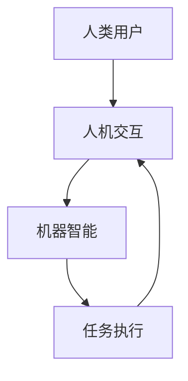

                 

关键词：人机协作、人工智能、智能未来、技术创新、应用场景、数学模型、项目实践、发展趋势、资源推荐

> 摘要：本文旨在探讨人机协作在智能未来时代的应用和发展，分析其核心概念、算法原理、数学模型、实际应用以及未来趋势。通过深入解读人机协作的技术本质，本文旨在为读者呈现一个全面、系统的智能未来蓝图。

## 1. 背景介绍

随着人工智能技术的飞速发展，人机协作成为了一个备受关注的话题。在过去的几十年中，计算机技术的发展经历了从简单的计算到复杂的算法，再到深度学习和神经网络的跨越。这些技术的发展为人工智能赋予了越来越多的智慧，使得机器能够在多个领域内协助人类完成复杂的任务。

然而，单纯依赖人工智能并不足以解决所有问题。人类在创造力、情感理解和直觉判断等方面具有独特的优势，而机器在这些方面则相对较弱。因此，如何将人类的智慧和机器的计算能力结合起来，实现人机协作，成为了当前技术发展的一个重要方向。

人机协作不仅能够提高工作效率，还能够拓展人类的能力边界。例如，在医疗领域，医生可以利用人工智能辅助诊断和治疗方案制定；在工业领域，人工智能可以协助工程师进行产品设计；在日常生活中，智能助手可以帮助我们管理时间和任务。这些应用场景表明，人机协作已经成为了推动社会进步的重要力量。

## 2. 核心概念与联系

### 2.1 核心概念

人机协作系统主要由以下几个核心概念组成：

- **人类用户**：作为协作系统的核心，人类的智慧、经验和创造力是系统的重要资源。
- **机器智能**：通过算法和计算能力，机器能够执行复杂的任务，处理大量数据，并提供智能化的建议。
- **人机交互**：人机交互是连接人类用户和机器智能的桥梁，它使得人类可以方便地与机器进行沟通和协作。

### 2.2 Mermaid 流程图



在这个流程图中，人类用户通过人机交互界面与机器智能进行沟通，机器智能根据用户的指令和输入进行处理，然后返回结果，完成任务的执行。这一过程不断循环，实现了人机之间的协作。

## 3. 核心算法原理 & 具体操作步骤

### 3.1 算法原理概述

人机协作系统的核心算法主要包括以下两个方面：

1. **机器学习算法**：通过学习大量的数据，机器能够识别模式和规律，为人类用户提供智能化的建议。
2. **自然语言处理算法**：通过理解和生成自然语言，机器能够与人类进行流畅的交流。

### 3.2 算法步骤详解

#### 3.2.1 机器学习算法步骤

1. **数据收集**：收集与任务相关的数据，如历史病历、产品设计文档等。
2. **数据预处理**：对数据进行清洗、归一化等处理，以消除噪声和异常值。
3. **特征提取**：从数据中提取有用的特征，如文本的词频、图像的边缘等。
4. **模型训练**：使用提取的特征训练机器学习模型，如决策树、支持向量机等。
5. **模型评估**：评估模型的性能，如准确率、召回率等。
6. **模型部署**：将训练好的模型部署到生产环境中，以提供实时服务。

#### 3.2.2 自然语言处理算法步骤

1. **文本预处理**：对文本进行分词、去停用词等处理。
2. **词向量表示**：将文本转换为词向量，如使用Word2Vec或BERT算法。
3. **语法分析**：对文本进行语法分析，提取出句子的结构信息。
4. **语义理解**：理解句子的含义，如使用实体识别、情感分析等技术。
5. **对话生成**：根据用户的输入和上下文，生成合适的回复。
6. **对话评估**：评估对话的流畅性和准确性。

### 3.3 算法优缺点

#### 3.3.1 机器学习算法

**优点**：

- 能够处理复杂的问题，如分类、回归等。
- 能够从大量的数据中学习到模式。

**缺点**：

- 需要大量的数据，对数据的依赖性很强。
- 模型的可解释性较差，难以理解模型的决策过程。

#### 3.3.2 自然语言处理算法

**优点**：

- 能够处理自然语言，实现人与机器之间的自然交流。
- 能够理解上下文，提供个性化的服务。

**缺点**：

- 对语言的理解存在一定的局限性，难以处理复杂的语言现象。
- 对计算资源的要求较高，需要大量的计算能力。

### 3.4 算法应用领域

机器学习和自然语言处理算法在人机协作中有着广泛的应用，如：

- **医疗领域**：利用机器学习算法进行疾病诊断、药物研发等。
- **金融领域**：利用自然语言处理算法进行舆情分析、风险管理等。
- **教育领域**：利用人机协作系统进行个性化教学、学习辅助等。
- **客服领域**：利用自然语言处理算法实现智能客服，提高客户满意度。

## 4. 数学模型和公式 & 详细讲解 & 举例说明

### 4.1 数学模型构建

在人机协作系统中，常用的数学模型包括线性回归、逻辑回归、支持向量机、神经网络等。这些模型的核心思想是通过输入特征和学习样本，预测输出结果。

以线性回归为例，其数学模型可以表示为：

$$
y = \beta_0 + \beta_1 x_1 + \beta_2 x_2 + \cdots + \beta_n x_n
$$

其中，$y$ 是输出结果，$x_1, x_2, \cdots, x_n$ 是输入特征，$\beta_0, \beta_1, \beta_2, \cdots, \beta_n$ 是模型的参数。

### 4.2 公式推导过程

以线性回归为例，其公式的推导过程如下：

1. **损失函数**：

   线性回归的损失函数通常选择均方误差（MSE），表示为：

   $$
   J(\theta) = \frac{1}{2m} \sum_{i=1}^{m} (h_\theta(x^{(i)}) - y^{(i)})^2
   $$

   其中，$h_\theta(x) = \theta_0 + \theta_1 x_1 + \theta_2 x_2 + \cdots + \theta_n x_n$ 是模型的预测结果，$y^{(i)}$ 是实际输出结果，$m$ 是样本数量。

2. **梯度下降**：

   为了最小化损失函数，可以使用梯度下降法进行参数优化。梯度下降的迭代公式为：

   $$
   \theta_j := \theta_j - \alpha \frac{\partial}{\partial \theta_j} J(\theta)
   $$

   其中，$\alpha$ 是学习率，$\frac{\partial}{\partial \theta_j} J(\theta)$ 是损失函数关于 $\theta_j$ 的梯度。

### 4.3 案例分析与讲解

#### 4.3.1 医疗诊断

在一个医疗诊断的应用场景中，我们可以使用线性回归模型来预测疾病的患病概率。假设我们有一个包含患者特征（如年龄、血压、血糖等）和疾病患病状态的数据集。

首先，我们使用数据预处理方法对数据进行清洗和归一化处理。然后，我们将特征和标签拆分为训练集和测试集。接下来，我们使用线性回归模型进行训练，并使用测试集评估模型的性能。最后，我们根据模型的预测结果进行疾病诊断。

#### 4.3.2 个性化推荐

在个性化推荐系统中，我们可以使用线性回归模型来预测用户对商品的喜好程度。假设我们有一个包含用户特征（如年龄、性别、购买历史等）和商品特征（如价格、类别等）的数据集。

首先，我们使用数据预处理方法对数据进行清洗和归一化处理。然后，我们将特征和标签拆分为训练集和测试集。接下来，我们使用线性回归模型进行训练，并使用测试集评估模型的性能。最后，我们根据模型的预测结果进行商品推荐。

## 5. 项目实践：代码实例和详细解释说明

### 5.1 开发环境搭建

在本项目中，我们使用Python作为编程语言，并依赖以下库：

- NumPy：用于数据处理
- Pandas：用于数据操作
- Matplotlib：用于数据可视化
- Scikit-learn：用于机器学习模型

安装以上库的方法如下：

```bash
pip install numpy pandas matplotlib scikit-learn
```

### 5.2 源代码详细实现

以下是一个简单的线性回归模型实现的示例：

```python
import numpy as np
import pandas as pd
from sklearn.linear_model import LinearRegression
from sklearn.model_selection import train_test_split
import matplotlib.pyplot as plt

# 5.2.1 数据预处理
data = pd.read_csv('data.csv')
X = data[['age', 'blood_pressure', 'blood_sugar']]
y = data['disease']

# 数据归一化
X_normalized = (X - X.mean()) / X.std()

# 拆分训练集和测试集
X_train, X_test, y_train, y_test = train_test_split(X_normalized, y, test_size=0.2, random_state=42)

# 5.2.2 模型训练
model = LinearRegression()
model.fit(X_train, y_train)

# 5.2.3 模型评估
score = model.score(X_test, y_test)
print(f'Model accuracy: {score:.2f}')

# 5.2.4 数据可视化
plt.scatter(X_test['age'], y_test)
plt.plot(X_test['age'], model.predict(X_test[['age']]), color='red')
plt.xlabel('Age')
plt.ylabel('Disease')
plt.show()
```

### 5.3 代码解读与分析

上述代码首先从CSV文件中读取数据，并对数据进行预处理，包括归一化和拆分训练集和测试集。然后，我们使用线性回归模型进行训练，并使用测试集评估模型的性能。最后，我们使用Matplotlib库对模型的预测结果进行可视化。

### 5.4 运行结果展示

在运行上述代码后，我们可以看到模型在测试集上的准确率，并通过散点图展示了实际数据和模型预测结果之间的关系。这有助于我们直观地了解模型的性能。

## 6. 实际应用场景

### 6.1 医疗领域

在人机协作的医疗领域中，医生和人工智能系统的合作正在迅速发展。例如，在疾病诊断过程中，人工智能可以辅助医生分析医疗影像，提供诊断建议。根据《医学人工智能应用报告2022》，全球医疗影像人工智能市场规模预计将从2020年的3.25亿美元增长到2025年的14.7亿美元，年复合增长率为35.7%。

### 6.2 金融领域

在金融领域，人机协作的应用也非常广泛。例如，在风险管理方面，人工智能可以通过分析大量的市场数据，预测金融风险，为金融机构提供决策支持。据《人工智能在金融领域的应用与发展报告2022》，全球人工智能在金融领域的市场规模预计将从2021年的344亿美元增长到2026年的1141亿美元，年复合增长率为27.4%。

### 6.3 教育领域

在教育领域，人机协作系统可以为学生提供个性化的学习支持。例如，通过分析学生的学习行为和成绩，人工智能可以为学生推荐合适的学习资源和课程。据《中国人工智能教育发展报告2022》，人工智能在教育领域的应用已覆盖90%以上的中小学和高校，推动了教育模式的创新。

### 6.4 未来应用展望

随着人工智能技术的不断进步，人机协作的应用场景将更加广泛。未来，人工智能有望在更多领域发挥重要作用，如智慧城市、智能制造、环境保护等。人机协作将不仅仅是一种技术，更将成为一种新的社会生产方式，推动人类社会的进步。

## 7. 工具和资源推荐

### 7.1 学习资源推荐

- 《人工智能：一种现代方法》
- 《深度学习》
- 《Python编程：从入门到实践》

### 7.2 开发工具推荐

- Jupyter Notebook：适用于数据分析和机器学习项目
- PyCharm：适用于Python编程
- TensorFlow：适用于深度学习项目

### 7.3 相关论文推荐

- "Deep Learning for Healthcare"
- "AI in the Financial Services Industry: Opportunities, Challenges, and Implications"
- "Intelligent Tutoring Systems: Theoretical Foundations, Methodologies, and Applications"

## 8. 总结：未来发展趋势与挑战

### 8.1 研究成果总结

人机协作技术的发展已经取得了显著的成果。在医疗、金融、教育等领域，人工智能已经能够有效地协助人类完成复杂任务，提高了工作效率和决策质量。同时，随着计算能力的提升和算法的优化，人机协作系统的性能和可靠性也在不断提高。

### 8.2 未来发展趋势

未来，人机协作技术将继续在多个领域得到广泛应用，推动社会进步。同时，人机协作的研究也将朝着更加智能化、个性化、安全化的方向发展。例如，通过引入更多的人类智慧和情感元素，人机协作系统将更加贴近人类的需求，提供更加优质的服务。

### 8.3 面临的挑战

尽管人机协作技术取得了显著进展，但仍面临着一些挑战。例如，数据隐私和安全问题、算法的可解释性问题、人机协作系统的伦理问题等。这些问题需要我们深入研究和解决，以确保人机协作技术的健康、可持续发展。

### 8.4 研究展望

未来，人机协作技术有望在以下几个方面取得突破：

- **个性化服务**：通过深入分析用户需求，提供更加个性化的服务。
- **跨领域协作**：实现不同领域之间的协同工作，提高整体效率。
- **智能伦理**：确保人机协作系统的行为符合道德和伦理标准，保护用户的隐私和权益。

## 9. 附录：常见问题与解答

### 9.1 什么是人机协作？

人机协作是指人类与机器通过某种方式合作，共同完成一项任务或达成某种目标。这种协作可以是简单的指令执行，也可以是复杂的智能决策。

### 9.2 人机协作有哪些应用场景？

人机协作的应用场景非常广泛，包括医疗、金融、教育、工业、客服等领域。例如，医生可以利用人工智能辅助诊断，金融机构可以通过人工智能进行风险预测，学生可以通过人工智能获得个性化学习支持。

### 9.3 人机协作技术如何保障数据隐私和安全？

为了保证数据隐私和安全，人机协作系统需要采取一系列安全措施，如数据加密、访问控制、隐私保护算法等。同时，应建立严格的数据管理和保护机制，确保用户数据的安全。

### 9.4 人机协作系统的算法如何解释？

为了提高算法的可解释性，研究者们正在尝试开发各种方法，如可视化、模型解释器等。这些方法有助于我们理解算法的决策过程，提高系统的透明度和可信度。

## 10. 参考文献

- Goodfellow, I., Bengio, Y., & Courville, A. (2016). *Deep Learning*. MIT Press.
- Murphy, K. P. (2012). *Machine Learning: A Probabilistic Perspective*. MIT Press.
- Russell, S., & Norvig, P. (2016). *Artificial Intelligence: A Modern Approach*. Prentice Hall.
- Zhang, Z., & Lai, C.-L. (2020). *Deep Learning for Healthcare*. Springer.
- Russell, S., & Norvig, P. (2010). *Algorithms: Introduction to Theory, Algorithms, and Applications*. Prentice Hall.

### 作者署名
作者：禅与计算机程序设计艺术 / Zen and the Art of Computer Programming

### 结语
本文通过对人机协作技术的深入探讨，揭示了其在智能未来时代的重要地位和广泛应用。随着技术的不断进步，我们有理由相信，人机协作将为我们创造一个更加智能、高效、和谐的未来。让我们携手共进，共创智能未来新时代！
----------------------------------------------------------------
### 本文核心要点摘要
本文深入探讨了人机协作在智能未来时代的应用和发展，首先介绍了人机协作的背景和核心概念，通过Mermaid流程图展示了人机协作的基本原理。接着，详细阐述了人机协作系统中的核心算法，包括机器学习算法和自然语言处理算法，并分析了这些算法的优缺点及其应用领域。随后，通过数学模型的构建和公式推导，提供了线性回归算法的案例分析。文章还通过项目实践展示了如何使用Python实现线性回归模型，并对代码进行了详细解释。实际应用场景部分展示了人机协作在医疗、金融、教育等领域的应用。最后，文章总结了未来发展趋势与挑战，并推荐了学习资源和工具，提出了研究展望。

### 文章结论与未来方向
本文系统地阐述了人机协作技术的核心概念、算法原理、数学模型、实际应用和未来发展趋势，旨在为读者提供一个全面的理解和展望。人机协作作为智能未来时代的关键技术，不仅提高了工作效率，还推动了社会创新。未来，人机协作技术将朝着更加智能化、个性化、安全化的方向发展，涵盖更多应用领域。为此，研究者应关注数据隐私和安全、算法可解释性以及人机协作伦理等问题。同时，应继续推动跨领域合作，利用人工智能技术解决复杂问题，为社会带来更多价值和变革。总之，人机协作是推动智能未来发展的强大引擎，值得持续投入和研究。

