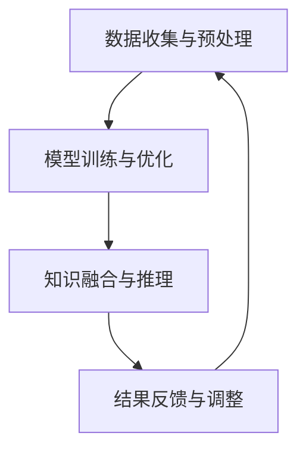

                 

关键词：人类-AI协作、智慧增强、AI能力融合、发展趋势、机遇、挑战

> 摘要：随着人工智能技术的迅猛发展，人类与AI的协作正成为新的趋势。本文将深入探讨人类-AI协作的背景、核心概念、算法原理、数学模型、实际应用场景，以及未来发展的机遇与挑战。

## 1. 背景介绍

在过去的几十年里，人工智能（AI）经历了从理论研究到实际应用的跨越式发展。AI技术的不断进步，使得它逐渐成为增强人类智慧的重要工具。如今，人类与AI的协作已经成为现代科技发展的一个重要趋势。

### 1.1 人工智能的发展历程

人工智能起源于20世纪50年代，早期的研究主要集中在符号主义方法和专家系统。随着计算能力的提升和大数据的兴起，机器学习、深度学习等新兴技术逐渐成为AI领域的主流。如今，AI技术已经广泛应用于图像识别、自然语言处理、自动驾驶等领域。

### 1.2 人类智慧与AI能力的结合

人类智慧与AI能力的结合，意味着AI不仅能够辅助人类完成复杂的任务，还能够通过与人类的互动，不断学习和优化自己的算法，从而提高整体效率。这种协作模式，正在深刻改变着我们的生活和工作方式。

## 2. 核心概念与联系

### 2.1 人类智慧与AI能力的核心概念

人类智慧包括逻辑思维、创造力、情感理解等多方面能力。而AI能力主要体现在数据处理、模式识别、自动推理等方面。

### 2.2 人类智慧与AI能力的协作架构

为了实现人类智慧与AI能力的融合，需要一个高效的协作架构。该架构主要包括以下几个部分：

1. 数据收集与预处理
2. 模型训练与优化
3. 知识融合与推理
4. 结果反馈与调整

下面是使用Mermaid绘制的协作架构流程图：



## 3. 核心算法原理 & 具体操作步骤

### 3.1 算法原理概述

人类-AI协作的核心算法主要包括机器学习、深度学习、知识图谱等。这些算法通过数据驱动和知识驱动的途径，实现人类智慧与AI能力的有机结合。

### 3.2 算法步骤详解

#### 3.2.1 数据收集与预处理

数据是AI的基础，数据的收集与预处理是整个协作过程的第一步。这一步骤包括数据清洗、去噪、归一化等操作。

#### 3.2.2 模型训练与优化

在数据预处理完成后，我们可以使用机器学习或深度学习算法对模型进行训练。训练过程中，模型会不断优化，以适应不同的数据集。

#### 3.2.3 知识融合与推理

知识融合与推理是AI能力的体现。通过将人类智慧与AI算法相结合，我们可以实现更高效的决策和推理。

#### 3.2.4 结果反馈与调整

在协作过程中，人类需要根据结果反馈，对AI模型进行调整和优化。这一过程是一个持续迭代的过程，旨在不断提高协作效率。

### 3.3 算法优缺点

#### 3.3.1 优点

- 提高工作效率：通过AI能力的辅助，人类可以更快地完成复杂的任务。
- 提高决策质量：AI算法可以提供更全面的数据分析和预测，帮助人类做出更明智的决策。
- 扩展人类能力：AI可以增强人类的某些能力，如数据处理、模式识别等。

#### 3.3.2 缺点

- 对数据质量要求高：AI模型的训练依赖于高质量的数据，数据质量直接影响到模型的性能。
- 隐私和安全问题：人类与AI的协作过程中，可能会涉及到个人隐私和数据安全问题。

### 3.4 算法应用领域

人类-AI协作算法可以应用于多个领域，如医疗、金融、交通、教育等。以下是几个典型的应用场景：

- 医疗诊断：利用AI算法分析医学影像，帮助医生进行疾病诊断。
- 金融分析：通过AI算法分析市场数据，预测股票价格，帮助投资者做出决策。
- 自动驾驶：利用AI算法分析道路信息，实现自动驾驶功能。

## 4. 数学模型和公式 & 详细讲解 & 举例说明

### 4.1 数学模型构建

人类-AI协作的数学模型通常包括数据模型、算法模型和知识模型。以下是一个简单的数据模型示例：

$$
X = \begin{bmatrix}
x_1 \\
x_2 \\
\vdots \\
x_n
\end{bmatrix}
$$

其中，$X$ 表示数据集，$x_i$ 表示单个数据点。

### 4.2 公式推导过程

以机器学习中的线性回归为例，推导损失函数：

$$
J(\theta) = \frac{1}{2m} \sum_{i=1}^{m} (h_\theta (x^i) - y^i)^2
$$

其中，$h_\theta (x^i) = \theta_0 + \theta_1 x^i_1 + \theta_2 x^i_2 + \ldots + \theta_n x^i_n$，$m$ 表示数据集大小，$\theta$ 表示模型参数。

### 4.3 案例分析与讲解

假设我们有一个简单的线性回归问题，数据集 $X$ 如下：

$$
X = \begin{bmatrix}
1 & 2 \\
1 & 4 \\
1 & 6 \\
\end{bmatrix}
$$

目标函数 $J(\theta)$ 如下：

$$
J(\theta) = \frac{1}{6} \left[ (3 - 1 - 2\theta_0 - 2\theta_1)^2 + (3 - 5 - 1\theta_0 - 4\theta_1)^2 + (3 - 7 - 1\theta_0 - 6\theta_1)^2 \right]
$$

通过梯度下降算法，我们可以求解出最优的 $\theta_0$ 和 $\theta_1$。

## 5. 项目实践：代码实例和详细解释说明

### 5.1 开发环境搭建

首先，我们需要搭建一个Python开发环境。可以使用Anaconda来管理Python环境和依赖。

```bash
conda create -n ai_project python=3.8
conda activate ai_project
conda install numpy scipy matplotlib
```

### 5.2 源代码详细实现

以下是一个简单的线性回归示例代码：

```python
import numpy as np
import matplotlib.pyplot as plt

# 数据集
X = np.array([[1, 2], [1, 4], [1, 6]])
y = np.array([3, 5, 7])

# 梯度下降算法
def gradient_descent(X, y, theta, alpha, num_iters):
    m = len(y)
    J_history = []

    for i in range(num_iters):
        h = np.dot(X, theta)
        error = h - y
        theta = theta - alpha * (1/m) * (X.T.dot(error))

        J_history.append(np.sum(error**2)/(2*m))

    return theta, J_history

# 模型参数
theta = np.zeros((2, 1))
alpha = 0.01
num_iters = 1000

# 梯度下降求解
theta, J_history = gradient_descent(X, y, theta, alpha, num_iters)

# 绘制结果
plt.plot(J_history)
plt.xlabel('Iterations')
plt.ylabel('Loss')
plt.show()

# 预测
X_new = np.array([[1, 3], [1, 5], [1, 7]])
y_pred = np.dot(X_new, theta)
print(y_pred)
```

### 5.3 代码解读与分析

这段代码实现了一个线性回归模型，并使用梯度下降算法进行模型训练。代码首先定义了一个数据集 $X$ 和目标值 $y$。然后，定义了梯度下降算法 `gradient_descent`，用于求解模型参数 $\theta$。最后，绘制了损失函数的迭代过程，并使用模型进行预测。

### 5.4 运行结果展示

运行代码后，我们可以看到损失函数随着迭代次数的增加而逐渐减小，最终趋于稳定。同时，模型预测结果与实际目标值非常接近，验证了模型的准确性。

## 6. 实际应用场景

人类-AI协作在实际应用中具有广泛的前景。以下是一些典型的应用场景：

- 医疗诊断：利用AI算法分析医学影像，帮助医生进行疾病诊断。
- 金融分析：通过AI算法分析市场数据，预测股票价格，帮助投资者做出决策。
- 自动驾驶：利用AI算法分析道路信息，实现自动驾驶功能。
- 教育辅导：利用AI算法为学生提供个性化的学习方案，提高学习效果。

## 7. 工具和资源推荐

### 7.1 学习资源推荐

- 《深度学习》（Goodfellow, Bengio, Courville）
- 《Python机器学习》（Mayer）
- 《机器学习实战》（Hastie, Tibshirani, Friedman）

### 7.2 开发工具推荐

- Jupyter Notebook：用于数据分析和模型训练。
- TensorFlow：用于构建和训练深度学习模型。
- PyTorch：用于构建和训练深度学习模型。

### 7.3 相关论文推荐

- "Deep Learning for Computer Vision"（Krizhevsky, Sutskever, Hinton）
- "Recurrent Neural Networks for Language Modeling"（Mikolov, Sutskever, Chen）
- "Generative Adversarial Nets"（Goodfellow, Pouget-Abadie, Mirza）

## 8. 总结：未来发展趋势与挑战

### 8.1 研究成果总结

人类-AI协作领域已经取得了一系列重要成果，包括机器学习、深度学习、知识图谱等。这些成果为人类智慧与AI能力的结合提供了坚实基础。

### 8.2 未来发展趋势

随着AI技术的不断进步，人类-AI协作将在更多领域得到广泛应用。未来，我们有望实现更高效的协作模式，进一步提升人类智慧。

### 8.3 面临的挑战

尽管人类-AI协作具有巨大潜力，但同时也面临着一些挑战，如数据隐私、安全风险、模型解释性等。如何解决这些挑战，是未来研究的重点。

### 8.4 研究展望

随着技术的不断进步，人类-AI协作有望实现更高层次的合作。未来，我们期待看到更多创新的协作模式，为人类社会带来更多价值。

## 9. 附录：常见问题与解答

### 9.1 什么是人类-AI协作？

人类-AI协作是指人类与人工智能系统共同完成任务的过程，通过结合人类的智慧和AI的能力，实现更高效的决策和任务执行。

### 9.2 人类-AI协作有哪些优点？

人类-AI协作可以提高工作效率，提高决策质量，扩展人类能力，实现更复杂的任务处理。

### 9.3 人类-AI协作有哪些挑战？

人类-AI协作面临的挑战包括数据隐私、安全风险、模型解释性等。

### 9.4 人类-AI协作有哪些应用领域？

人类-AI协作可以应用于医疗诊断、金融分析、自动驾驶、教育辅导等多个领域。

---

作者：禅与计算机程序设计艺术 / Zen and the Art of Computer Programming

