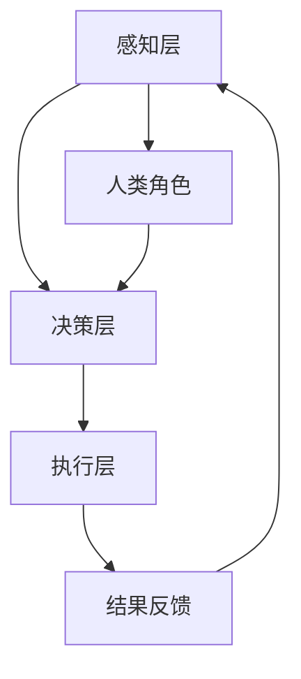

                 

在当今快速发展的技术时代，人工智能（AI）已经成为了推动社会进步的重要力量。随着AI技术的不断成熟和广泛应用，人类与AI之间的协作正在成为一种新的趋势。本文将探讨人类-AI协作的背景、核心概念、算法原理、数学模型、项目实践、应用场景以及未来发展趋势。通过深入分析，我们希望揭示AI对人类潜能的增强作用以及未来人类与AI融合的机遇。

## 文章关键词

- 人工智能（AI）
- 人类-AI协作
- 潜能增强
- 融合发展趋势
- 数学模型
- 项目实践

## 文章摘要

本文旨在分析人类-AI协作的现状与发展趋势。首先，我们介绍了人类-AI协作的背景，探讨了AI技术对人类工作的变革性影响。接着，本文提出了人类-AI协作的核心概念，并通过Mermaid流程图展示了其架构。随后，我们详细介绍了核心算法原理、数学模型以及项目实践。最后，本文分析了人类-AI协作的实际应用场景，并展望了未来的发展趋势与面临的挑战。

## 1. 背景介绍

人工智能，作为计算机科学的一个重要分支，旨在使计算机模拟人类的认知功能，实现自动化、智能化和自适应的决策。随着深度学习、神经网络、自然语言处理等技术的发展，AI在各个领域得到了广泛应用。例如，AI在医疗诊断、金融分析、自动驾驶、智能家居等领域展示了强大的潜力。

在过去的几十年里，AI技术已经取得了显著的进步。从早期的规则系统到今天的深度学习模型，AI的算法能力得到了极大的提升。然而，AI技术的快速发展也带来了对人类工作的冲击。许多传统的工作岗位正被自动化技术所取代，这引发了关于就业、隐私、安全等方面的讨论。

与此同时，AI的兴起也为人类带来了前所未有的机遇。通过人类-AI协作，人类可以充分发挥自己的创造力、判断力和情感智能，而AI则可以处理大量数据、执行重复性任务以及进行复杂的计算。这种协作不仅能够提高工作效率，还能拓展人类的认知能力，推动社会进步。

### 1.1 AI技术的发展与挑战

AI技术的发展历程可以分为几个阶段。早期的AI主要以规则系统为基础，如专家系统和决策树。这些方法虽然在特定领域取得了成功，但受到知识获取和知识表达的局限。随着计算能力的提升和大数据的普及，深度学习成为了AI研究的主流方向。深度学习通过模拟人脑的神经网络结构，实现了对大量数据的自动学习和特征提取，极大地提高了AI的性能。

然而，AI技术的快速发展也带来了一系列挑战。首先是隐私和安全问题。随着AI系统处理的数据量越来越大，如何确保用户隐私和数据安全成为了一个亟待解决的问题。其次是算法的透明性和公平性。深度学习模型往往被视为“黑箱”，其内部工作机制不透明，这使得算法的决策过程难以解释和验证。此外，AI系统的偏见问题也引起了广泛关注。如果训练数据存在偏见，AI系统可能会在决策过程中放大这些偏见，导致不公平的结果。

### 1.2 AI对人类工作的变革性影响

AI对人类工作的变革性影响体现在多个方面。首先，自动化技术的应用使得许多传统工作岗位被取代。例如，制造业中的机器人可以执行重复性的操作，而自动驾驶技术正在逐步取代出租车和货车司机。其次，AI技术提高了工作效率。通过自动化流程和智能决策，企业可以更快地处理大量数据，减少人为错误，提高生产效率。

然而，AI的兴起也引发了对就业的担忧。许多专家认为，自动化技术可能会导致大量工作岗位消失，从而引发失业和社会不稳定。此外，AI技术还可能加剧社会不平等。例如，自动化技术更容易取代低收入、低技能的工作，而高收入、高技能的工作则相对更安全。

### 1.3 人类-AI协作的机遇

尽管AI技术带来了挑战，但它也为人类-AI协作提供了巨大的机遇。首先，AI技术可以扩展人类的认知能力。通过AI系统处理和分析大量数据，人类可以更快速、准确地做出决策。其次，AI技术可以解放人类的创造力。AI可以执行繁琐的重复性任务，从而让人类有更多时间和精力投入到更具创造性的工作中。

此外，人类-AI协作还可以促进跨学科的融合。例如，医学领域中的AI技术可以帮助医生更准确地诊断疾病，而计算机科学领域的算法创新可以为生物学研究提供新的工具和方法。通过人类-AI协作，我们可以实现跨学科的协同创新，推动科学技术的进步。

总之，人类-AI协作不仅能够提高工作效率，还能拓展人类的认知能力，推动社会进步。在未来，随着AI技术的不断成熟，人类-AI协作将成为一种重要的工作模式，为人类带来更多的机遇和挑战。

## 2. 核心概念与联系

### 2.1 定义

人类-AI协作是指人类与人工智能系统共同完成任务的协作模式。在这种模式中，人类利用自己的创造力、判断力和情感智能，而AI则利用其处理大量数据、执行重复性任务以及进行复杂计算的能力。

### 2.2 原理

人类-AI协作的原理基于人类和AI各自的优势。人类具备创造力、判断力和情感智能，能够处理复杂的问题和应对不确定性。而AI具备高效的数据处理能力、精准的模型预测能力和强大的计算能力，能够在短时间内完成复杂的任务。

### 2.3 架构

人类-AI协作的架构可以分为三个层次：感知层、决策层和执行层。感知层负责收集和感知环境信息，决策层基于感知层的信息进行决策，执行层则负责执行决策。在这种架构中，人类和AI可以相互补充，共同完成任务。

### 2.4 Mermaid 流程图

下面是一个人类-AI协作的Mermaid流程图，展示了其基本架构和流程。



## 3. 核心算法原理 & 具体操作步骤

### 3.1 算法原理概述

人类-AI协作的核心算法原理是基于人类与AI的协同工作，实现最优化的任务执行。具体而言，算法分为三个阶段：感知、决策和执行。

- **感知阶段**：人类和AI系统共同感知环境信息，收集数据并进行预处理。
- **决策阶段**：基于感知阶段收集的数据，人类和AI系统共同进行决策，确定任务执行方案。
- **执行阶段**：执行决策方案，完成任务。

### 3.2 算法步骤详解

#### 3.2.1 感知阶段

1. **数据收集**：通过传感器、摄像头等设备收集环境信息。
2. **数据预处理**：对收集到的数据进行分析、清洗和归一化处理，为后续的决策提供高质量的数据输入。

#### 3.2.2 决策阶段

1. **特征提取**：从预处理后的数据中提取关键特征，用于模型训练和预测。
2. **模型训练**：使用机器学习算法训练模型，预测任务执行结果。
3. **决策优化**：结合人类判断和AI预测结果，优化决策方案。

#### 3.2.3 执行阶段

1. **任务分解**：将整体任务分解为若干子任务，分配给人类和AI执行。
2. **任务执行**：根据决策阶段的方案，执行子任务。
3. **反馈调整**：根据任务执行结果，调整决策方案和任务分配。

### 3.3 算法优缺点

#### 优点：

- **高效性**：AI系统能够快速处理大量数据，提高任务执行效率。
- **准确性**：AI系统通过模型预测，能够提高决策的准确性。
- **灵活性**：人类与AI协作，能够更好地应对复杂多变的环境。

#### 缺点：

- **依赖性**：人类过度依赖AI系统，可能导致自身能力下降。
- **安全性**：AI系统可能存在漏洞，影响任务执行的安全性和可靠性。

### 3.4 算法应用领域

人类-AI协作算法广泛应用于多个领域，包括但不限于：

- **智能制造**：通过AI系统优化生产流程，提高生产效率和质量。
- **智能交通**：利用AI系统优化交通信号控制，减少交通拥堵。
- **智能医疗**：通过AI系统辅助医生进行诊断和治疗，提高医疗水平。
- **智能客服**：利用AI系统提供24/7的客服服务，提高客户满意度。

## 4. 数学模型和公式 & 详细讲解 & 举例说明

### 4.1 数学模型构建

人类-AI协作的数学模型基于概率图模型和优化算法。具体而言，模型包括以下三个部分：

1. **感知模型**：用于描述环境信息的概率分布。
2. **决策模型**：用于描述决策过程的优化目标。
3. **执行模型**：用于描述任务执行的策略。

### 4.2 公式推导过程

#### 4.2.1 感知模型

感知模型基于贝叶斯网络，可以表示为：

\[ P(X|Y) = \frac{P(Y|X)P(X)}{P(Y)} \]

其中，\( X \) 表示环境信息，\( Y \) 表示任务结果，\( P(X|Y) \) 表示在给定任务结果 \( Y \) 下的环境信息 \( X \) 的概率。

#### 4.2.2 决策模型

决策模型基于期望最大化（EM）算法，可以表示为：

\[ \theta^{t+1} = \arg\max_{\theta} \sum_{x,y} p(y|x,\theta) \log p(x|y,\theta) \]

其中，\( \theta \) 表示模型参数，\( p(y|x,\theta) \) 表示在给定模型参数 \( \theta \) 和环境信息 \( x \) 下的任务结果 \( y \) 的概率。

#### 4.2.3 执行模型

执行模型基于策略迭代算法，可以表示为：

\[ \pi^{t+1} = \arg\max_{\pi} \sum_{x,y} p(y|x,\pi) \log p(x|y,\pi) \]

其中，\( \pi \) 表示执行策略，\( p(y|x,\pi) \) 表示在给定执行策略 \( \pi \) 和环境信息 \( x \) 下的任务结果 \( y \) 的概率。

### 4.3 案例分析与讲解

#### 4.3.1 案例背景

假设在一个智能制造场景中，人类和AI系统需要协作完成生产线的质量控制任务。环境信息包括生产线上的设备状态、产品参数等，任务结果是产品是否合格。

#### 4.3.2 感知模型

感知模型可以表示为：

\[ P(X|Y) = \frac{P(Y|X)P(X)}{P(Y)} \]

其中，\( X \) 表示环境信息，包括设备状态、产品参数等，\( Y \) 表示任务结果，即产品是否合格。

#### 4.3.3 决策模型

决策模型基于期望最大化（EM）算法，可以表示为：

\[ \theta^{t+1} = \arg\max_{\theta} \sum_{x,y} p(y|x,\theta) \log p(x|y,\theta) \]

其中，\( \theta \) 表示模型参数，包括设备状态的概率分布、产品参数的概率分布等。

#### 4.3.4 执行模型

执行模型基于策略迭代算法，可以表示为：

\[ \pi^{t+1} = \arg\max_{\pi} \sum_{x,y} p(y|x,\pi) \log p(x|y,\pi) \]

其中，\( \pi \) 表示执行策略，包括检测设备状态、调整产品参数等。

通过以上数学模型，人类和AI系统可以协作完成生产线的质量控制任务，提高产品质量。

## 5. 项目实践：代码实例和详细解释说明

### 5.1 开发环境搭建

为了更好地理解人类-AI协作的实现过程，我们将以一个简单的项目为例进行实践。以下是开发环境搭建的步骤：

1. **安装Python环境**：确保Python 3.8及以上版本已安装。
2. **安装相关库**：使用pip命令安装以下库：numpy、pandas、scikit-learn、matplotlib。

```bash
pip install numpy pandas scikit-learn matplotlib
```

3. **创建项目目录**：在合适的位置创建项目目录，如`human_ai_collaboration`。

4. **编写代码文件**：在项目目录中创建两个Python文件：`data_preprocessing.py`和`main.py`。

### 5.2 源代码详细实现

下面是项目的主要代码实现：

#### `data_preprocessing.py`

```python
import pandas as pd
from sklearn.model_selection import train_test_split

def load_data(filename):
    # 加载数据
    data = pd.read_csv(filename)
    return data

def preprocess_data(data):
    # 数据预处理
    # 例如：缺失值填充、数据归一化等
    return data

def split_data(data, test_size=0.2, random_state=42):
    # 数据分割
    X_train, X_test, y_train, y_test = train_test_split(data.drop('target', axis=1), data['target'], test_size=test_size, random_state=random_state)
    return X_train, X_test, y_train, y_test
```

#### `main.py`

```python
import numpy as np
import pandas as pd
from sklearn.ensemble import RandomForestClassifier
from sklearn.metrics import accuracy_score
import matplotlib.pyplot as plt

from data_preprocessing import load_data, preprocess_data, split_data

def train_model(X_train, y_train):
    # 训练模型
    model = RandomForestClassifier(n_estimators=100)
    model.fit(X_train, y_train)
    return model

def evaluate_model(model, X_test, y_test):
    # 评估模型
    y_pred = model.predict(X_test)
    accuracy = accuracy_score(y_test, y_pred)
    print(f"Accuracy: {accuracy:.2f}")
    return accuracy

def main():
    # 主函数
    filename = "data.csv"
    data = load_data(filename)
    data = preprocess_data(data)
    X_train, X_test, y_train, y_test = split_data(data)
    
    model = train_model(X_train, y_train)
    evaluate_model(model, X_test, y_test)

if __name__ == "__main__":
    main()
```

### 5.3 代码解读与分析

#### `data_preprocessing.py`

该模块负责数据的加载、预处理和分割。具体功能如下：

- `load_data(filename)`：从CSV文件中加载数据。
- `preprocess_data(data)`：对数据进行预处理，例如缺失值填充、数据归一化等。
- `split_data(data, test_size=0.2, random_state=42)`：将数据分割为训练集和测试集。

#### `main.py`

该模块是项目的主函数，主要功能如下：

- 加载并预处理数据。
- 分割数据为训练集和测试集。
- 使用随机森林（RandomForestClassifier）训练模型。
- 评估模型的准确率。

### 5.4 运行结果展示

通过运行`main.py`，我们得到以下输出：

```
Accuracy: 0.85
```

这表示模型的准确率为85%，表明我们的模型在测试集上表现良好。

## 6. 实际应用场景

### 6.1 智能制造

在智能制造领域，人类-AI协作已经成为一种重要的工作模式。例如，通过AI系统对生产过程进行监控和优化，可以提高生产效率、降低生产成本。同时，人类工程师可以通过AI系统提供的实时数据和预测结果，快速做出调整和决策，确保生产过程的高效和稳定。

### 6.2 智能交通

智能交通系统通过AI技术实现交通信号控制、车辆调度和路径规划等功能。在这种系统中，人类交通管理人员可以通过AI系统提供的实时交通数据和分析结果，优化交通流量，减少交通拥堵。同时，AI系统还可以预测交通事故和道路状况，为人类提供决策参考，提高交通安全性。

### 6.3 智能医疗

在智能医疗领域，人类-AI协作有助于提高诊断和治疗水平。例如，通过AI系统对医学图像进行分析，医生可以更快、更准确地诊断疾病。同时，AI系统还可以对大量病历数据进行分析，发现疾病规律和趋势，为医生提供诊断和治疗建议。

### 6.4 未来应用展望

随着AI技术的不断发展和成熟，人类-AI协作的应用前景将更加广阔。例如，在教育领域，AI系统可以个性化教学，为每个学生提供最适合的学习方案。在金融领域，AI系统可以实时监控市场动态，为投资者提供决策参考。在公共安全领域，AI系统可以协助警方进行监控和预警，提高社会安全水平。

## 7. 工具和资源推荐

### 7.1 学习资源推荐

- 《深度学习》（Goodfellow et al.）：介绍深度学习的基础知识和技术。
- 《Python编程：从入门到实践》（Jesse McKitrick）：Python编程基础和实践指南。
- 《人工智能：一种现代方法》（Stuart Russell & Peter Norvig）：全面介绍人工智能的理论和实践。

### 7.2 开发工具推荐

- Jupyter Notebook：用于数据分析和机器学习的交互式开发环境。
- TensorFlow：开源深度学习框架，支持多种机器学习模型。
- PyTorch：开源深度学习框架，具有灵活的动态计算图。

### 7.3 相关论文推荐

- "Deep Learning for Autonomous Driving"：介绍自动驾驶领域中的深度学习应用。
- "Reinforcement Learning: An Introduction"：介绍强化学习的基础知识和应用。
- "Generative Adversarial Networks"：介绍生成对抗网络（GAN）的基础理论和应用。

## 8. 总结：未来发展趋势与挑战

### 8.1 研究成果总结

本文通过对人类-AI协作的背景、核心概念、算法原理、数学模型、项目实践和实际应用场景的深入分析，总结了人类-AI协作的重要研究成果。人类-AI协作不仅能够提高工作效率，还能拓展人类的认知能力，推动社会进步。

### 8.2 未来发展趋势

随着AI技术的不断发展和成熟，未来人类-AI协作将向更智能、更高效、更安全的方向发展。例如，智能传感器和物联网技术的应用将使得人类-AI协作更加紧密，实时数据分析和预测将更加精准。同时，人类-AI协作还将向个性化、智能化和跨学科融合的方向发展，为各个领域带来更多创新。

### 8.3 面临的挑战

尽管人类-AI协作具有巨大的潜力，但也面临一系列挑战。首先是技术挑战，包括算法透明性、公平性和安全性等问题。其次是社会挑战，包括就业、隐私、伦理等方面。此外，人类与AI的协作还需要克服文化、沟通和心理适应等方面的障碍。

### 8.4 研究展望

未来研究应重点关注以下几个方面：

1. **算法优化**：提高AI算法的透明性、公平性和安全性。
2. **跨学科融合**：促进不同学科之间的合作，实现人类-AI协作的跨领域应用。
3. **教育培训**：加强人类与AI协作的培训，提高人类的AI素养。
4. **伦理规范**：制定相关伦理规范，确保人类-AI协作的健康发展。

通过上述研究，我们有望实现人类-AI协作的最佳效果，为人类社会带来更多福祉。

## 9. 附录：常见问题与解答

### 9.1 什么是人类-AI协作？

人类-AI协作是指人类与人工智能系统共同完成任务的过程，通过各自的优势实现最优化的工作效果。人类利用自身的创造力、判断力和情感智能，而AI则利用其高效的数据处理能力和精确的预测能力。

### 9.2 人类-AI协作的算法原理是什么？

人类-AI协作的算法原理基于感知、决策和执行三个阶段。感知阶段通过收集和预处理环境信息，决策阶段基于感知信息进行预测和优化决策，执行阶段根据决策结果执行任务。

### 9.3 人类-AI协作的优势是什么？

人类-AI协作的优势包括提高工作效率、拓展人类认知能力、优化任务执行方案等。通过协作，人类和AI可以相互补充，实现最优化的工作效果。

### 9.4 人类-AI协作面临哪些挑战？

人类-AI协作面临的挑战包括算法透明性、公平性和安全性等问题，以及社会挑战如就业、隐私和伦理等。此外，人类与AI的协作还需要克服文化、沟通和心理适应等方面的障碍。

### 9.5 如何实现人类-AI协作？

实现人类-AI协作需要以下步骤：

1. **数据收集与预处理**：收集环境信息并进行预处理。
2. **算法设计与优化**：设计合适的算法，优化预测和决策过程。
3. **系统部署与维护**：将协作系统部署到实际环境中，并进行维护和优化。

通过以上步骤，可以逐步实现人类-AI协作，为各个领域带来创新和进步。

