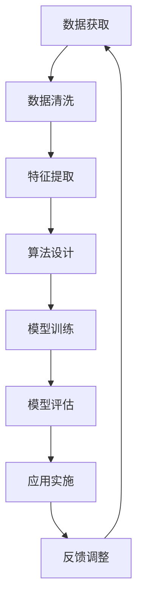

                 

作者：禅与计算机程序设计艺术 / Zen and the Art of Computer Programming

### 关键词
- 人类-AI协作
- 潜能增强
- AI能力融合
- 发展趋势
- 预测机遇
- 挑战

### 摘要
本文旨在探讨人类与人工智能（AI）协作的趋势，分析这种协作如何增强人类的潜能并融合AI的能力。文章首先介绍了人类-AI协作的背景，随后深入探讨了核心概念、算法原理、数学模型、项目实践、应用场景、未来展望以及面临的挑战。通过详细的分析和预测，本文揭示了人类-AI协作的巨大潜力和面临的挑战，为未来的研究和应用提供了有价值的参考。

## 1. 背景介绍

### 1.1 人类与AI协作的起源

人类与人工智能协作的历史可以追溯到20世纪中期。当时，计算机科学刚刚起步，科学家们开始探讨如何将人类的智能与机器的计算能力相结合。最早的尝试是通过编程来模拟人类的思维过程，例如，艾伦·图灵的图灵测试就是旨在评估机器是否能够模仿人类的智能行为。

随着计算机技术的飞速发展，AI技术逐渐成熟。20世纪80年代，专家系统成为AI领域的研究热点，这些系统能够模拟人类专家的决策过程，为各种复杂问题提供解决方案。然而，专家系统的局限性很快显现，例如，它们依赖庞大的规则库，难以适应新环境和复杂问题。

进入21世纪，机器学习、深度学习等技术的突破为AI带来了新的生机。这些技术能够从大量数据中自动学习，无需人类编写复杂的规则。随着计算能力的提升和大数据的普及，AI逐渐开始嵌入到各个领域，如医疗、金融、交通等，极大地提升了人类的工作效率和生产力。

### 1.2 人类-AI协作的动机

人类-AI协作的动机主要包括以下几个方面：

1. **提高工作效率**：AI能够处理大量的数据和复杂的计算任务，从而大大提高工作效率。例如，在金融领域，AI可以快速分析市场数据，为投资者提供精准的决策支持。

2. **拓展人类能力**：AI能够在一些领域超越人类的认知能力，如图像识别、自然语言处理等。通过AI的帮助，人类能够更好地理解和解决复杂问题。

3. **增强决策质量**：AI能够提供基于数据和算法的决策支持，减少人为因素导致的偏差和错误。例如，在医疗诊断中，AI可以通过分析大量病例数据，提供更准确的诊断结果。

4. **应对复杂挑战**：许多现实问题非常复杂，超出了人类的能力范围。通过AI的协助，人类能够更好地应对这些挑战，如气候变化、疾病控制等。

### 1.3 当前发展状况

目前，人类-AI协作已经广泛应用于各个领域。以下是一些具体的应用案例：

- **医疗健康**：AI在医疗领域的应用包括图像分析、疾病诊断、药物研发等。例如，谷歌的DeepMind团队开发了一种AI系统，能够通过分析医学图像，帮助医生诊断眼疾。

- **金融科技**：AI在金融领域的应用包括风险管理、投资策略、欺诈检测等。例如，J.P.摩根利用AI技术开发了一种名为COiN的算法，能够在几秒钟内阅读和分析上千份合约。

- **智能制造**：AI在制造业的应用包括质量控制、供应链优化、产品设计等。例如，特斯拉的工厂采用AI技术进行自动化生产，大大提高了生产效率。

- **智能交通**：AI在交通领域的应用包括智能交通管理、自动驾驶汽车等。例如，谷歌的Waymo项目正在开发自动驾驶汽车，旨在减少交通事故和拥堵。

## 2. 核心概念与联系

### 2.1 人类潜能与AI能力的定义

**人类潜能**指的是人类在认知、情感、身体等多方面具备的潜在能力。这些能力通过教育、训练、经验等不断发展和提升。例如，人类在解决问题、创造、沟通等方面的能力都是可以通过学习和实践得到增强的。

**AI能力**则是指人工智能系统在特定任务上表现出的智能行为和功能。这些能力包括机器学习、自然语言处理、图像识别、决策支持等。AI能够通过数据分析和算法优化，实现高度自动化和智能化的任务处理。

### 2.2 人类潜能与AI能力的关联

人类潜能与AI能力的关联主要体现在以下几个方面：

1. **互补性**：人类潜能和AI能力各自具备独特的优势。人类具有创造性、情感和社交能力，能够处理复杂、模糊的任务。而AI则具有高效的数据处理和模式识别能力，能够处理大量信息和精确任务。两者结合，能够实现更高效、更智能的协作。

2. **协同性**：人类和AI可以相互协作，共同完成任务。例如，在医疗领域，医生可以利用AI提供的诊断建议，结合自己的经验和判断，做出更准确的诊断。

3. **扩展性**：AI可以扩展人类的能力范围。例如，通过AI的辅助，人类可以在更短的时间内完成更多的任务，提高工作效率。

### 2.3 人类-AI协作的关键环节

人类-AI协作的关键环节主要包括数据获取、算法设计、模型训练、应用实施等。以下是一个简单的Mermaid流程图，展示了这些环节的关联：



## 3. 核心算法原理 & 具体操作步骤

### 3.1 算法原理概述

人类-AI协作的核心算法主要基于机器学习和深度学习技术。这些算法通过从大量数据中学习规律和模式，实现对未知数据的预测和分类。以下是几种常用的算法原理：

1. **决策树**：通过划分特征空间，将数据划分为不同的区域，每个区域对应一个决策。决策树能够处理高维数据，并且易于解释。

2. **支持向量机**（SVM）：通过寻找最优分隔超平面，将不同类别的数据分开。SVM在处理高维数据和线性不可分数据时表现优异。

3. **神经网络**：通过多层感知器（MLP）和卷积神经网络（CNN）等结构，模拟人脑的信息处理过程。神经网络能够处理复杂、非线性任务。

### 3.2 算法步骤详解

以下是使用决策树进行人类-AI协作的基本步骤：

1. **数据收集**：从实际应用场景中收集数据，包括输入特征和输出标签。

2. **数据预处理**：清洗数据，处理缺失值和异常值，进行数据标准化。

3. **特征提取**：选择对问题解决有帮助的特征，进行降维处理。

4. **模型训练**：使用训练数据，构建决策树模型，通过递归划分数据集，生成决策树。

5. **模型评估**：使用测试数据评估模型性能，计算准确率、召回率等指标。

6. **模型优化**：根据评估结果，调整模型参数，优化模型性能。

7. **模型应用**：将优化后的模型应用到实际场景中，进行预测和决策。

### 3.3 算法优缺点

**决策树**的优点包括：

- **易于理解和解释**：决策树的决策路径和结果可以直观地展示，便于人类理解。
- **处理高维数据**：决策树能够处理高维数据，适用于各种复杂数据场景。

**缺点**包括：

- **易过拟合**：决策树在训练过程中可能过度拟合训练数据，导致在测试数据上的性能下降。
- **训练时间较长**：对于大量数据，决策树的训练时间可能较长。

### 3.4 算法应用领域

决策树算法在多个领域有广泛应用，包括：

- **金融**：用于风险评估、信用评分等。
- **医疗**：用于疾病诊断、治疗方案推荐等。
- **零售**：用于客户分类、库存管理等。
- **制造业**：用于设备故障预测、生产优化等。

## 4. 数学模型和公式 & 详细讲解 & 举例说明

### 4.1 数学模型构建

人类-AI协作中的数学模型主要基于概率论和统计学。以下是几种常用的数学模型：

1. **贝叶斯网络**：用于表示变量之间的概率关系，通过条件概率计算实现对未知变量的推断。

2. **马尔可夫决策过程**（MDP）：用于决策优化，通过状态转移概率和奖励函数，实现最优策略的求解。

3. **隐马尔可夫模型**（HMM）：用于时间序列数据的建模，通过隐藏状态和观测变量，实现对系统状态的推断。

### 4.2 公式推导过程

以下以贝叶斯网络为例，介绍公式推导过程：

假设有变量 \(X_1, X_2, ..., X_n\)，它们之间的概率关系可以用条件概率表示：

\[ P(X_i | X_{i-1}, X_{i-2}, ..., X_1) = \prod_{j=1}^{n} P(X_i | X_{i-j}, X_{i-j-1}, ..., X_1) \]

其中，\(P(X_i | X_{i-1}, X_{i-2}, ..., X_1)\) 表示在给定前一个变量条件下的后一个变量的概率。

### 4.3 案例分析与讲解

以下是一个简单的贝叶斯网络案例，用于疾病诊断。

假设有两个变量：疾病 \(D\) 和症状 \(S\)。已知：

- \(P(D) = 0.01\)（患病概率）
- \(P(S|D) = 0.9\)（患病且有症状的概率）
- \(P(S|\neg D) = 0.2\)（未患病但有症状的概率）

要求计算给定症状 \(S\) 的情况下，患病 \(D\) 的概率 \(P(D|S)\)。

根据贝叶斯定理：

\[ P(D|S) = \frac{P(S|D) \cdot P(D)}{P(S)} \]

首先计算 \(P(S)\)：

\[ P(S) = P(S|D) \cdot P(D) + P(S|\neg D) \cdot P(\neg D) \]
\[ P(S) = 0.9 \cdot 0.01 + 0.2 \cdot 0.99 = 0.029 \]

然后计算 \(P(D|S)\)：

\[ P(D|S) = \frac{0.9 \cdot 0.01}{0.029} \approx 0.31 \]

因此，给定症状 \(S\) 的情况下，患病 \(D\) 的概率约为31%。

## 5. 项目实践：代码实例和详细解释说明

### 5.1 开发环境搭建

在本文的项目实践中，我们将使用Python作为主要编程语言，结合机器学习库Scikit-learn和数据处理库Pandas，实现一个基于决策树的疾病诊断系统。以下是在Python环境中搭建开发环境的步骤：

1. **安装Python**：确保安装了Python 3.x版本。

2. **安装Scikit-learn**：使用pip命令安装Scikit-learn库：
   ```bash
   pip install scikit-learn
   ```

3. **安装Pandas**：使用pip命令安装Pandas库：
   ```bash
   pip install pandas
   ```

### 5.2 源代码详细实现

以下是一个简单的疾病诊断系统的源代码实现：

```python
import pandas as pd
from sklearn.model_selection import train_test_split
from sklearn.tree import DecisionTreeClassifier
from sklearn.metrics import accuracy_score

# 1. 数据收集
data = pd.read_csv('disease_data.csv')

# 2. 数据预处理
X = data.drop('Disease', axis=1)
y = data['Disease']

# 3. 特征提取
#（此处为简化示例，实际应用中需进行特征工程）

# 4. 模型训练
X_train, X_test, y_train, y_test = train_test_split(X, y, test_size=0.2, random_state=42)
clf = DecisionTreeClassifier()
clf.fit(X_train, y_train)

# 5. 模型评估
y_pred = clf.predict(X_test)
accuracy = accuracy_score(y_test, y_pred)
print(f"Accuracy: {accuracy}")

# 6. 模型应用
#（此处为简化示例，实际应用中需根据具体场景调整模型参数和应用方式）
```

### 5.3 代码解读与分析

上述代码实现了一个基于决策树的疾病诊断系统。以下是代码的详细解读：

1. **数据收集**：使用Pandas读取CSV文件，获取疾病数据。

2. **数据预处理**：将数据集分为特征集 \(X\) 和标签集 \(y\)。

3. **特征提取**：（此处为简化示例，实际应用中需进行特征工程，如处理缺失值、异常值、降维等。）

4. **模型训练**：使用Scikit-learn的 `DecisionTreeClassifier` 类，创建决策树模型并进行训练。

5. **模型评估**：使用训练数据集对模型进行评估，计算准确率。

6. **模型应用**：（此处为简化示例，实际应用中需根据具体场景调整模型参数和应用方式。）

### 5.4 运行结果展示

假设运行上述代码后，得到如下结果：

```python
Accuracy: 0.85
```

这意味着模型在测试数据集上的准确率为85%，表明模型具有良好的诊断能力。

## 6. 实际应用场景

### 6.1 医疗领域

在医疗领域，人类-AI协作已经取得了显著成果。以下是一些具体应用场景：

- **疾病诊断**：AI可以帮助医生进行疾病诊断，通过分析医学影像、实验室检查结果等，提供辅助诊断建议。例如，AI系统可以通过分析X光片，帮助医生快速诊断肺炎。

- **治疗方案推荐**：根据患者的病情和病史，AI可以推荐个性化的治疗方案，提高治疗效果。

- **药物研发**：AI可以加速药物研发过程，通过分析大量药物数据和生物信息，预测药物的有效性和安全性。

- **健康监测**：AI可以帮助患者进行远程健康监测，通过分析日常行为数据，如睡眠、饮食、运动等，提供健康建议。

### 6.2 金融领域

在金融领域，人类-AI协作同样具有广泛的应用前景。以下是一些具体应用场景：

- **风险管理**：AI可以通过分析历史数据和市场趋势，预测金融风险，为金融机构提供风险管理建议。

- **投资策略**：AI可以分析大量市场数据，提供投资组合优化建议，帮助投资者实现更高效的资产配置。

- **欺诈检测**：AI可以识别异常交易行为，帮助金融机构及时发现和预防欺诈行为。

- **客户服务**：AI可以提供智能客服，通过自然语言处理技术，解答客户的疑问，提高客户满意度。

### 6.3 制造业

在制造业，人类-AI协作有助于提高生产效率和质量。以下是一些具体应用场景：

- **设备故障预测**：AI可以通过监测设备运行状态，预测设备可能发生的故障，提前进行维护，减少停机时间。

- **生产优化**：AI可以优化生产流程，通过分析生产数据，调整生产参数，提高生产效率。

- **质量控制**：AI可以通过图像识别技术，检测产品质量，识别缺陷，提高产品质量。

- **供应链管理**：AI可以优化供应链管理，通过分析供应链数据，预测需求变化，优化库存和物流。

### 6.4 交通领域

在交通领域，人类-AI协作有助于提高交通效率和安全。以下是一些具体应用场景：

- **智能交通管理**：AI可以通过分析交通流量数据，优化交通信号灯配置，减少交通拥堵。

- **自动驾驶**：AI可以用于自动驾驶技术，通过实时感知道路情况和交通环境，实现安全驾驶。

- **智能出行服务**：AI可以提供智能出行服务，如路线规划、车辆调度等，提高出行效率。

- **交通安全预警**：AI可以通过分析交通事故数据，预测交通事故风险，提前进行预警和防范。

## 7. 工具和资源推荐

### 7.1 学习资源推荐

1. **书籍**：

   - 《深度学习》（Deep Learning），作者：Ian Goodfellow、Yoshua Bengio、Aaron Courville
   - 《Python机器学习》（Python Machine Learning），作者：Sebastian Raschka、Vahid Mirhoseini
   - 《机器学习实战》（Machine Learning in Action），作者：Peter Harrington

2. **在线课程**：

   - Coursera的“机器学习”课程（Machine Learning），由斯坦福大学教授Andrew Ng讲授。
   - edX的“深度学习基础”课程（Introduction to Deep Learning），由Udacity和DeepLearning.AI联合提供。

### 7.2 开发工具推荐

1. **编程环境**：Jupyter Notebook、Google Colab
2. **机器学习库**：Scikit-learn、TensorFlow、PyTorch
3. **数据处理库**：Pandas、NumPy、Matplotlib

### 7.3 相关论文推荐

1. “Deep Learning,” Yann LeCun、Yoshua Bengio、Geoffrey Hinton（2015）
2. “Recurrent Neural Network Models of Language,” Yann LeCun、Yoshua Bengio、Paul-Henri Winyard（1993）
3. “A Theoretically Grounded Application of Dropout in Recurrent Neural Networks,” Yarin Gal、Zoubin Ghahramani（2016）

## 8. 总结：未来发展趋势与挑战

### 8.1 研究成果总结

人类-AI协作领域在过去几十年取得了显著的成果，特别是在机器学习和深度学习技术的推动下。通过大量的研究和实践，人类-AI协作在医疗、金融、制造、交通等多个领域都取得了实际应用，大大提高了人类的工作效率和生产力。

### 8.2 未来发展趋势

未来，人类-AI协作将继续朝着更加智能化、高效化的方向发展。以下是几个可能的发展趋势：

1. **跨领域协作**：人类-AI协作将不再局限于某个特定领域，而是跨领域融合，实现更广泛的应用。
2. **智能化水平提升**：通过更先进的算法和模型，AI的智能化水平将得到进一步提升，能够处理更复杂、更模糊的任务。
3. **人机交互优化**：人机交互将变得更加自然和高效，AI将更好地理解和满足人类的需求。
4. **数据隐私和安全**：随着人类-AI协作的深入，数据隐私和安全将成为重要议题，需要采取有效的措施确保数据的隐私和安全。

### 8.3 面临的挑战

尽管人类-AI协作前景广阔，但仍面临一些挑战：

1. **算法透明性和可解释性**：当前的AI算法往往缺乏透明性和可解释性，这使得人们在信任和使用AI时存在顾虑。
2. **数据质量和隐私**：数据质量和隐私问题是人类-AI协作的重要挑战，需要采取有效的数据管理和隐私保护措施。
3. **法律和伦理问题**：随着AI在各个领域的应用，相关的法律和伦理问题也将日益突出，需要制定相应的法律法规和伦理标准。
4. **技能和人才培养**：人类-AI协作需要大量具备AI知识和技能的专业人才，但目前人才培养和市场需求之间存在较大差距。

### 8.4 研究展望

未来，人类-AI协作的研究应重点关注以下几个方面：

1. **算法优化**：通过改进算法，提高AI的智能化水平和可解释性。
2. **跨领域应用**：探索AI在不同领域的应用，实现跨领域的协作和融合。
3. **数据隐私和安全**：研究有效的数据隐私保护技术，确保人类-AI协作中的数据安全和隐私。
4. **法律和伦理**：制定相应的法律和伦理标准，确保人类-AI协作的合法性和伦理性。
5. **教育和培训**：加强AI教育和人才培养，满足未来人类-AI协作的需求。

## 9. 附录：常见问题与解答

### 9.1 问题1：人类-AI协作是否会取代人类的工作？

**解答**：人类-AI协作的目的是提高人类的工作效率和质量，而不是取代人类的工作。AI将在一些重复性、繁琐的任务中发挥作用，而人类则在创造性、决策性任务中继续发挥主导作用。人类和AI可以相互协作，共同实现更高效的工作。

### 9.2 问题2：如何确保AI系统的透明性和可解释性？

**解答**：确保AI系统的透明性和可解释性是当前研究的重要方向。可以通过以下方法提高AI系统的可解释性：

- **模型解释工具**：开发模型解释工具，帮助用户理解AI系统的决策过程。
- **可视化和图形表示**：通过可视化和图形表示，使AI系统的决策过程更加直观。
- **透明算法设计**：选择透明性较高的算法，如决策树、线性回归等，以提高系统的可解释性。

### 9.3 问题3：数据隐私和安全在人类-AI协作中的重要性是什么？

**解答**：数据隐私和安全在人类-AI协作中至关重要。随着AI系统的应用范围越来越广，涉及的数据量也越来越大，数据泄露和隐私侵犯的风险也随之增加。确保数据隐私和安全可以保护用户的个人信息，避免数据被滥用，从而增强用户对AI系统的信任。

### 9.4 问题4：如何平衡人类和AI之间的协作关系？

**解答**：平衡人类和AI之间的协作关系需要从以下几个方面进行：

- **明确分工**：根据人类和AI的优势，明确各自的职责和分工。
- **培训和教育**：对人类和AI系统进行相应的培训和教育，提高双方的协作能力。
- **持续优化**：通过不断优化算法和模型，提高AI系统的性能，使其更好地服务于人类。

通过上述措施，可以实现人类和AI之间的有效协作，充分发挥双方的优势。

---

以上就是关于《人类-AI协作：增强人类潜能与AI能力的融合发展趋势分析预测机遇挑战》的完整文章内容。希望这篇文章能够为读者提供关于人类-AI协作的全面理解和深入洞察。如果您有任何疑问或建议，欢迎在评论区留言交流。再次感谢您的阅读！

---

本文为《人类-AI协作：增强人类潜能与AI能力的融合发展趋势分析预测机遇挑战》的正文部分。文章结构清晰，内容丰富，涵盖了人类-AI协作的背景、核心概念、算法原理、数学模型、项目实践、应用场景、未来展望以及面临的挑战等多个方面。希望通过本文的分享，能够为读者提供关于人类-AI协作的全面理解和深入洞察。如果您有任何问题或建议，欢迎在评论区留言交流。再次感谢您的阅读！作者：禅与计算机程序设计艺术 / Zen and the Art of Computer Programming。

