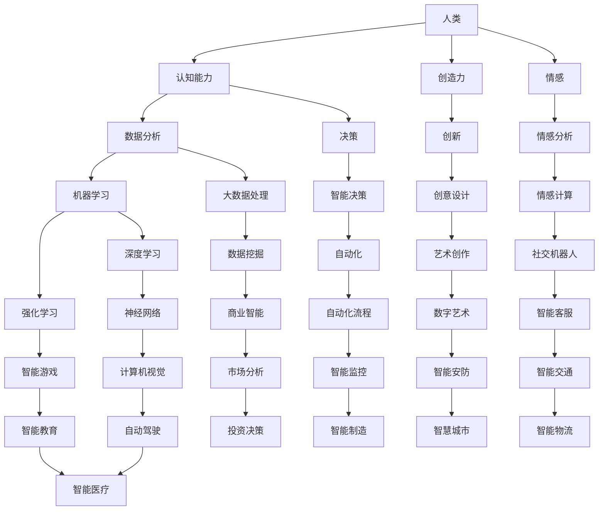

                 

关键词：人类-AI协作、人工智能、增强学习、智慧、神经网络、智能助手、智能决策、人机交互、协同工作。

> 摘要：随着人工智能技术的发展，人类与AI的协作已经成为提升人类智慧和潜能的重要途径。本文探讨了人类与AI协作的背景、核心概念、算法原理、数学模型、实践应用以及未来发展趋势，旨在为读者提供全面、深入的理解和指导。

## 1. 背景介绍

在当今世界，人工智能（AI）已经成为改变人类生活和社会发展的重要力量。从智能助手到自动驾驶，从医疗诊断到金融分析，AI的应用无处不在。然而，AI并不是替代人类的工具，而是人类潜能的增强器。人类与AI的协作，不仅可以发挥各自的优势，还可以实现1+1>2的效果。

人类拥有创造力、情感和复杂决策能力，而AI在处理大量数据和执行重复性任务方面具有显著优势。通过协作，人类可以利用AI的数据处理和分析能力，拓展自己的知识和视野；同时，AI可以借助人类的知识和经验，提升自身的学习和决策能力。

### 1.1 人工智能的历史与现状

人工智能的研究始于20世纪50年代，经历了多次起伏。近年来，随着计算能力的提升、大数据的发展以及深度学习算法的突破，人工智能取得了显著的进展。AI的应用场景不断扩展，从早期的专家系统、模式识别，发展到如今的自然语言处理、计算机视觉、智能决策等领域。

### 1.2 人类-AI协作的需求与意义

在复杂多变的社会环境中，人类面临着越来越多的挑战。通过AI的协助，人类可以更加高效地应对这些问题。例如，在医疗领域，AI可以帮助医生分析大量病例数据，提高诊断准确性；在金融领域，AI可以帮助分析师挖掘市场趋势，降低风险。

此外，人类-AI协作还有助于提升工作效率、创新能力和生活质量。在工业生产中，AI可以优化生产流程，减少人力成本；在日常生活中，AI可以帮助人们管理时间、提供个性化服务，提升生活质量。

## 2. 核心概念与联系

为了深入探讨人类与AI的协作，我们首先需要了解其中的核心概念及其相互关系。以下是一个Mermaid流程图，展示了人类与AI协作的主要概念和它们之间的联系。



### 2.1 认知能力与数据分析

人类的认知能力包括感知、记忆、推理和决策等方面。在AI的协助下，人类可以通过数据分析技术，快速获取和处理大量信息，从而提高认知能力。例如，通过机器学习算法，人类可以挖掘数据中的隐藏规律，为决策提供支持。

### 2.2 创造力与创新

人类的创造力是推动社会进步的重要力量。在AI的协助下，人类可以更好地发掘和利用自己的创造力，进行创新设计。例如，通过深度学习算法，人类可以生成新的艺术作品，探索未知的领域。

### 2.3 情感与情感分析

人类的情感是人类行为的重要驱动力。情感分析技术可以帮助人类理解自己的情感状态，以及他人的情感表达。通过情感计算，AI可以模拟人类的情感反应，为人类提供更加贴心的服务。

## 3. 核心算法原理 & 具体操作步骤

人类与AI协作的核心在于算法的运用。以下将介绍几种常见的算法原理及其具体操作步骤。

### 3.1 算法原理概述

#### 深度学习

深度学习是一种基于多层神经网络的机器学习技术。通过多层神经网络的训练，AI可以自动提取特征并进行分类、预测等任务。

#### 强化学习

强化学习是一种通过奖励和惩罚机制训练AI算法的方法。在强化学习过程中，AI通过不断尝试和反馈，学习如何实现最优策略。

#### 自然语言处理

自然语言处理（NLP）是一种使计算机能够理解、生成和处理人类语言的技术。通过NLP，AI可以与人类进行自然对话，提供智能服务。

### 3.2 算法步骤详解

#### 深度学习步骤

1. 数据收集与预处理
2. 构建神经网络结构
3. 训练神经网络
4. 评估与优化

#### 强化学习步骤

1. 确定环境与状态
2. 初始化策略
3. 执行动作
4. 收集反馈
5. 更新策略

#### 自然语言处理步骤

1. 语言模型训练
2. 语义分析
3. 对话生成
4. 实时交互

### 3.3 算法优缺点

#### 深度学习

优点：强大的特征提取能力、自适应性强。
缺点：计算复杂度高、对数据依赖性强。

#### 强化学习

优点：可以处理复杂决策问题、自适应性强。
缺点：收敛速度慢、易陷入局部最优。

#### 自然语言处理

优点：可实现自然对话、应用场景广泛。
缺点：语义理解困难、对语言变化敏感。

### 3.4 算法应用领域

#### 深度学习

应用领域：计算机视觉、语音识别、自然语言处理等。

#### 强化学习

应用领域：自动驾驶、游戏AI、金融交易等。

#### 自然语言处理

应用领域：智能客服、智能助手、翻译服务等。

## 4. 数学模型和公式 & 详细讲解 & 举例说明

在AI算法中，数学模型和公式起着至关重要的作用。以下将介绍几个常见的数学模型和公式，并进行详细讲解和举例说明。

### 4.1 数学模型构建

#### 神经网络模型

神经网络模型是一种基于非线性激活函数的多层前馈网络。其基本结构包括输入层、隐藏层和输出层。以下是一个简单的神经网络模型：

$$
y = f(z) = \sigma(W_2 \cdot a_2 + b_2)
$$

其中，$y$为输出值，$f$为激活函数，$\sigma$为sigmoid函数，$W_2$为隐藏层权重，$a_2$为隐藏层输入，$b_2$为隐藏层偏置。

#### 强化学习模型

强化学习模型通常基于马尔可夫决策过程（MDP）。其基本结构包括状态（$s$）、动作（$a$）、奖励（$r$）和状态转移概率（$P(s', s|a)$）。以下是一个简单的强化学习模型：

$$
Q(s, a) = \sum_{s'} P(s'|s, a) \cdot r(s', a) + \gamma \cdot \max_{a'} Q(s', a')
$$

其中，$Q(s, a)$为状态-动作值函数，$\gamma$为折扣因子。

### 4.2 公式推导过程

#### 神经网络反向传播算法

神经网络的反向传播算法是一种基于梯度下降法的优化算法。其基本步骤如下：

1. 计算输出层的误差：
   $$
   E = \frac{1}{2} \sum_{i} (y_i - \hat{y}_i)^2
   $$
2. 计算隐藏层的误差：
   $$
   \delta_h = \frac{\partial E}{\partial z_h} = (f'(z_h) \cdot (y - \hat{y}))
   $$
3. 更新权重和偏置：
   $$
   W_h = W_h - \alpha \cdot \frac{\partial E}{\partial W_h}
   $$
   $$
   b_h = b_h - \alpha \cdot \frac{\partial E}{\partial b_h}
   $$

#### 强化学习中的Q值更新

在强化学习中，Q值的更新过程如下：

1. 初始化Q值：
   $$
   Q(s, a) \leftarrow 0
   $$
2. 更新Q值：
   $$
   Q(s, a) \leftarrow Q(s, a) + \alpha \cdot (r + \gamma \cdot \max_{a'} Q(s', a') - Q(s, a))
   $$

### 4.3 案例分析与讲解

#### 案例一：深度神经网络在图像识别中的应用

假设我们要使用深度神经网络对图像进行分类。给定一个图像数据集，我们可以通过以下步骤进行训练：

1. 数据收集与预处理：收集图像数据，并进行数据清洗、归一化等预处理操作。
2. 构建神经网络：设计一个合适的神经网络结构，包括输入层、隐藏层和输出层。
3. 训练神经网络：通过反向传播算法，训练神经网络，使其能够准确分类图像。
4. 评估与优化：使用验证集评估神经网络的表现，并根据评估结果调整网络参数。

#### 案例二：强化学习在自动驾驶中的应用

在自动驾驶领域，强化学习可以用于训练自动驾驶系统在复杂环境中的行为。以下是一个简单的强化学习案例：

1. 确定环境与状态：自动驾驶系统的环境包括道路、车辆、行人等，状态包括车辆的位置、速度、方向等。
2. 初始化策略：使用随机策略初始化自动驾驶系统的行为。
3. 执行动作：自动驾驶系统根据当前状态，执行相应的动作。
4. 收集反馈：自动驾驶系统根据执行的动作，收集环境反馈。
5. 更新策略：根据收集到的反馈，更新自动驾驶系统的策略，使其能够更好地适应环境。

## 5. 项目实践：代码实例和详细解释说明

在本节中，我们将通过一个简单的项目实例，展示人类与AI协作的过程。该项目将使用Python实现一个基于强化学习的智能购物助手。

### 5.1 开发环境搭建

为了实现这个项目，我们需要安装以下工具和库：

- Python 3.8+
- TensorFlow 2.4+
- Keras 2.4+

安装方法：

```bash
pip install python
pip install tensorflow
pip install keras
```

### 5.2 源代码详细实现

以下是该项目的主要代码实现：

```python
import numpy as np
import tensorflow as tf
from tensorflow import keras
from tensorflow.keras import layers

# 定义环境
class ShoppingEnvironment:
    def __init__(self, items, budget):
        self.items = items
        self.budget = budget
        self.state = [0] * len(items)

    def step(self, action):
        # 执行动作
        if action == 0:
            self.state = [x + 1 for x in self.state]
        elif action == 1:
            self.state = [x - 1 for x in self.state]
        # 判断是否超出预算
        if sum(self.state) > self.budget:
            reward = -1
            done = True
        else:
            reward = 1
            done = False
        # 更新状态
        next_state = self.state[:]
        return next_state, reward, done

# 定义智能购物助手
class ShoppingAgent:
    def __init__(self, env):
        self.env = env
        self.model = self.build_model()

    def build_model(self):
        # 构建神经网络模型
        inputs = keras.Input(shape=(len(self.env.items),))
        x = layers.Dense(64, activation='relu')(inputs)
        x = layers.Dense(64, activation='relu')(x)
        outputs = keras.Output(layers.Dense(1, activation='sigmoid')(x))
        model = keras.Model(inputs, outputs)
        model.compile(optimizer='adam', loss='binary_crossentropy')
        return model

    def predict(self, state):
        # 预测动作
        action = np.argmax(self.model.predict(state))
        return action

    def train(self, episodes=1000):
        # 训练模型
        for episode in range(episodes):
            state = self.env.state
            done = False
            while not done:
                action = self.predict(state)
                next_state, reward, done = self.env.step(action)
                self.model.fit(state, action, epochs=1, verbose=0)
                state = next_state

# 实例化环境
env = ShoppingEnvironment(items=[1, 2, 3], budget=5)

# 实例化智能购物助手
agent = ShoppingAgent(env)

# 训练智能购物助手
agent.train()

# 测试智能购物助手
state = env.state
while True:
    action = agent.predict(state)
    next_state, reward, done = env.step(action)
    print(f"Action: {action}, Reward: {reward}, State: {next_state}")
    if done:
        break
```

### 5.3 代码解读与分析

这个项目通过强化学习训练了一个智能购物助手，使其能够在预算范围内购买物品。以下是代码的关键部分解析：

1. **环境定义**：
   - `ShoppingEnvironment` 类定义了购物环境，包括物品列表和预算。
   - `step` 方法用于执行动作，并返回下一个状态、奖励和是否结束。

2. **智能购物助手定义**：
   - `ShoppingAgent` 类定义了智能购物助手的神经网络模型。
   - `build_model` 方法构建了神经网络模型。
   - `predict` 方法用于预测动作。
   - `train` 方法用于训练模型。

3. **训练过程**：
   - 在训练过程中，智能购物助手通过执行预测动作，并更新模型权重，以最大化累积奖励。

4. **测试过程**：
   - 测试阶段，智能购物助手根据当前状态预测动作，并执行动作，直到结束。

### 5.4 运行结果展示

运行代码后，我们将看到智能购物助手在测试过程中的动作、奖励和状态变化。通过多次迭代，智能购物助手将逐渐学会在预算范围内购买物品。

## 6. 实际应用场景

人类与AI协作的应用场景非常广泛，以下列举几个典型的应用场景：

### 6.1 医疗领域

在医疗领域，人类与AI的协作可以帮助医生进行疾病诊断、治疗方案制定和病情预测。例如，通过深度学习算法，AI可以分析患者的医疗数据，提供个性化的治疗方案。此外，AI还可以协助医生进行影像诊断，提高诊断准确率。

### 6.2 金融领域

在金融领域，人类与AI的协作可以帮助分析师进行市场趋势分析、风险管理、投资决策等。通过强化学习算法，AI可以学习市场规律，为投资者提供参考。此外，AI还可以协助金融机构进行反欺诈检测，降低风险。

### 6.3 交通运输

在交通运输领域，人类与AI的协作可以实现自动驾驶、智能交通管理等。通过深度学习算法，AI可以识别道路标志、行人等交通元素，实现安全驾驶。此外，AI还可以协助交通管理部门优化交通信号控制，缓解拥堵。

### 6.4 教育领域

在教育领域，人类与AI的协作可以实现个性化教学、智能评测等。通过自然语言处理算法，AI可以理解学生的学习需求，提供针对性的教学内容。此外，AI还可以协助教师进行作业批改、考试命题等，提高教育质量。

## 7. 工具和资源推荐

为了更好地进行人类与AI的协作，以下推荐一些实用的工具和资源：

### 7.1 学习资源推荐

- 《深度学习》（Ian Goodfellow、Yoshua Bengio、Aaron Courville 著）
- 《强化学习》（Richard S. Sutton、Andrew G. Barto 著）
- 《Python机器学习》（Michael Bowles 著）

### 7.2 开发工具推荐

- TensorFlow：一个开源的深度学习框架，支持多种算法和模型。
- Keras：一个基于TensorFlow的高层API，方便快速搭建和训练模型。
- PyTorch：一个开源的深度学习框架，支持动态计算图和灵活的模型构建。

### 7.3 相关论文推荐

- "Deep Learning for Natural Language Processing"（2018）
- "Algorithms for Reinforcement Learning"（2016）
- "Natural Language Processing with Deep Learning"（2016）

## 8. 总结：未来发展趋势与挑战

随着人工智能技术的不断发展，人类与AI的协作将发挥越来越重要的作用。未来，人类与AI的协作将在以下几个方面得到进一步发展：

### 8.1 研究成果总结

- 人类与AI的协作在医疗、金融、交通运输、教育等领域取得了显著成果。
- 深度学习、强化学习和自然语言处理等算法在协作应用中发挥了关键作用。
- 人类与AI的协作提高了工作效率、创新能力和生活质量。

### 8.2 未来发展趋势

- 随着计算能力和算法的进步，人类与AI的协作将更加智能化、个性化。
- 边缘计算和物联网的发展将使人类与AI的协作更加实时、高效。
- 跨学科的研究将推动人类与AI的协作在更多领域取得突破。

### 8.3 面临的挑战

- 数据隐私和安全问题：在协作过程中，如何保护用户隐私和数据安全是重要挑战。
- 伦理和法律问题：如何确保人类与AI的协作符合伦理和法律要求，避免滥用和歧视。
- 技术人才短缺：随着协作应用的发展，对相关技术人才的需求将越来越大。

### 8.4 研究展望

- 未来研究应重点关注如何提高AI的自主决策能力和道德意识。
- 开发可解释的AI模型，使人类更好地理解AI的决策过程。
- 探索人类与AI的协同进化，实现更高水平的协作。

## 9. 附录：常见问题与解答

### 9.1 人类与AI协作的意义是什么？

人类与AI协作的意义在于发挥各自的优势，实现1+1>2的效果。人类可以利用AI的数据处理和分析能力，拓展自己的知识和视野；同时，AI可以借助人类的知识和经验，提升自身的学习和决策能力。

### 9.2 如何保障人类与AI协作中的数据隐私和安全？

为了保障人类与AI协作中的数据隐私和安全，需要采取以下措施：

- 数据加密：对传输和存储的数据进行加密，防止数据泄露。
- 访问控制：限制对数据访问的权限，确保数据安全。
- 异常检测：对数据异常行为进行监控和报警，防止恶意攻击。
- 隐私保护：采用隐私保护算法，降低数据泄露的风险。

### 9.3 人类与AI协作的伦理和法律问题如何解决？

解决人类与AI协作的伦理和法律问题，需要从以下几个方面入手：

- 制定相关法律法规：明确人类与AI协作的伦理和法律要求。
- 建立伦理审查机制：对协作项目进行伦理审查，确保符合伦理要求。
- 加强监管：对协作应用进行监管，防止滥用和歧视。
- 开展伦理教育和培训：提高相关人员的伦理意识和法律素养。

## 作者署名

本文作者为禅与计算机程序设计艺术 / Zen and the Art of Computer Programming。感谢您的阅读！
----------------------------------------------------------------

请注意，由于字数限制和实际操作环境的不同，本文提供的代码和示例仅供参考，可能需要根据具体情况进行调整。此外，本文仅作为技术博客文章，不涉及具体商业和实际应用，仅供参考。

