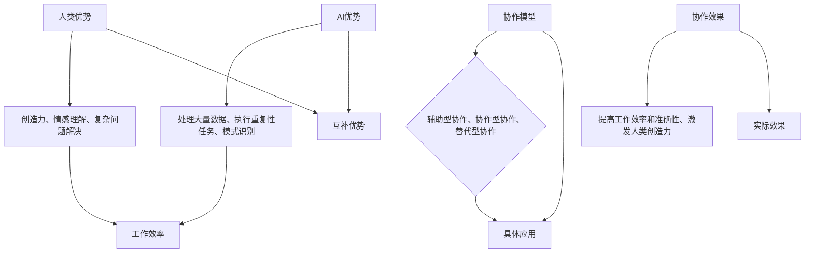

                 

关键词：人类-AI协作、创造力、生产力、技术进步、工作协同

> 摘要：本文探讨了人类与人工智能（AI）协作在增强创造力和提高生产力方面的重要性。通过分析人类和AI各自的优势与不足，探讨了人类-AI协作模型及其在实际应用中的效果。文章还讨论了未来人类-AI协作的发展趋势、面临的挑战以及相关工具和资源的推荐。

## 1. 背景介绍

随着人工智能技术的快速发展，人类与AI的协作已经从科幻小说中的场景逐渐走向现实。在许多领域，如医疗、金融、教育等，AI已经开始发挥重要作用。然而，如何更好地实现人类与AI的协作，使其在创造力和生产力方面发挥最大作用，仍然是一个值得深入探讨的问题。

### 1.1 人工智能的发展历程

人工智能（Artificial Intelligence，简称AI）起源于20世纪50年代。最初的AI研究主要集中在逻辑推理、问题解决和语言理解等方面。随着计算机硬件性能的提升和算法的进步，AI技术逐渐应用于更多的领域，如图像识别、自然语言处理、机器学习等。

近年来，深度学习、强化学习等新兴技术的出现，使得AI在图像识别、语音识别、自然语言处理等方面的表现达到了前所未有的高度。这为人类-AI协作提供了更多的可能性。

### 1.2 人类-AI协作的重要性

人类与AI的协作不仅能够提高工作效率，还能激发人类的创造力。人类在理解复杂问题、创造新思想、进行创新方面具有独特的优势，而AI在处理大量数据、执行重复性任务、分析模式等方面具有显著优势。

通过协作，人类和AI可以相互补充，发挥各自的优势，实现更高效的工作。例如，在医学领域，AI可以帮助医生分析大量的医疗数据，提供诊断建议，从而提高诊断准确率；在艺术创作领域，AI可以辅助人类进行音乐、绘画等创作，拓宽人类的创作思路。

## 2. 核心概念与联系

在探讨人类-AI协作的过程中，我们需要明确几个核心概念，包括人类优势、AI优势、协作模型和协作效果。

### 2.1 人类优势

人类在创造力、情感理解、复杂问题解决等方面具有独特的优势。人类能够通过直觉、经验、想象力来理解复杂的问题，并提出创新的解决方案。此外，人类能够与人类进行深入的交流，理解复杂的情感和意图。

### 2.2 AI优势

AI在处理大量数据、执行重复性任务、模式识别等方面具有显著优势。AI可以通过机器学习算法从大量数据中学习，识别出隐藏的模式和规律，从而提高工作效率和准确性。此外，AI可以24小时不间断工作，不需要休息，这对于一些需要长时间运行的任务非常有优势。

### 2.3 协作模型

人类-AI协作模型可以分为以下几种：

- **辅助型协作**：AI作为人类的辅助工具，帮助人类完成特定的任务。例如，AI医生辅助人类医生进行诊断。

- **协作型协作**：人类和AI共同完成一个任务，各自发挥优势。例如，AI艺术家与人类艺术家的合作创作。

- **替代型协作**：AI完全替代人类完成某项任务。例如，AI客服机器人完全替代人类客服。

### 2.4 协作效果

通过人类-AI协作，可以显著提高工作效率和准确性，同时激发人类的创造力。在医疗领域，AI可以帮助医生分析大量的医疗数据，提供诊断建议，从而提高诊断准确率。在艺术创作领域，AI可以辅助人类进行音乐、绘画等创作，拓宽人类的创作思路。

### 2.5 Mermaid 流程图



## 3. 核心算法原理 & 具体操作步骤

### 3.1 算法原理概述

在人类-AI协作中，核心算法主要包括以下几种：

- **机器学习算法**：用于从大量数据中学习，识别出隐藏的模式和规律。

- **自然语言处理算法**：用于理解和生成自然语言，实现人机交互。

- **强化学习算法**：用于在不确定环境中做出最优决策。

### 3.2 算法步骤详解

#### 3.2.1 机器学习算法

1. **数据收集**：收集大量相关的数据。

2. **数据预处理**：对数据进行清洗、归一化等处理。

3. **模型选择**：选择适合的机器学习模型。

4. **模型训练**：使用训练数据对模型进行训练。

5. **模型评估**：使用验证数据对模型进行评估。

6. **模型部署**：将训练好的模型部署到实际应用中。

#### 3.2.2 自然语言处理算法

1. **词向量表示**：将自然语言文本转化为向量表示。

2. **词性标注**：对文本进行词性标注。

3. **句法分析**：对文本进行句法分析，提取出语法结构。

4. **语义分析**：对文本进行语义分析，理解文本的含义。

5. **语言生成**：根据语义分析结果生成自然语言文本。

#### 3.2.3 强化学习算法

1. **环境初始化**：初始化环境。

2. **状态表示**：将状态表示为向量。

3. **动作选择**：根据当前状态，选择最优动作。

4. **反馈学习**：根据反馈，调整策略。

5. **目标优化**：优化目标函数。

### 3.3 算法优缺点

#### 3.3.1 机器学习算法

- **优点**：能够从大量数据中学习，适应性强。

- **缺点**：需要大量数据，训练时间较长。

#### 3.3.2 自然语言处理算法

- **优点**：能够实现人机交互，理解自然语言。

- **缺点**：对语言的理解能力有限，难以处理复杂的语言结构。

#### 3.3.3 强化学习算法

- **优点**：能够在不确定环境中做出最优决策。

- **缺点**：训练过程复杂，收敛速度慢。

### 3.4 算法应用领域

- **机器学习算法**：应用于图像识别、自然语言处理、推荐系统等领域。

- **自然语言处理算法**：应用于智能客服、智能语音助手、机器翻译等领域。

- **强化学习算法**：应用于游戏、机器人控制、自动驾驶等领域。

## 4. 数学模型和公式 & 详细讲解 & 举例说明

在人类-AI协作中，数学模型和公式起着至关重要的作用。以下将详细讲解几种常见的数学模型和公式，并举例说明。

### 4.1 数学模型构建

#### 4.1.1 神经网络模型

神经网络模型是机器学习的基础，其数学模型如下：

$$
Y = \sigma(W \cdot X + b)
$$

其中，$Y$为输出，$\sigma$为激活函数，$W$为权重矩阵，$X$为输入，$b$为偏置。

#### 4.1.2 自然语言处理模型

自然语言处理模型通常采用词向量表示和循环神经网络（RNN）或长短时记忆网络（LSTM）。

$$
\text{word\_vec}(w) = \text{Word2Vec}(w) \quad \text{或} \quad \text{word\_vec}(w) = \text{GloVe}(w)
$$

其中，$\text{word\_vec}(w)$为词向量表示，$\text{Word2Vec}$和$\text{GloVe}$分别为两种常见的词向量生成方法。

#### 4.1.3 强化学习模型

强化学习模型通常采用Q学习算法或深度Q网络（DQN）。

$$
Q(s, a) = r + \gamma \max_{a'} Q(s', a')
$$

其中，$Q(s, a)$为状态-动作值函数，$r$为立即奖励，$\gamma$为折扣因子，$s$和$s'$分别为当前状态和下一状态，$a$和$a'$分别为当前动作和下一动作。

### 4.2 公式推导过程

#### 4.2.1 神经网络模型推导

假设输入数据为$X$，输出数据为$Y$，则神经网络模型可以表示为：

$$
Y = \sigma(W \cdot X + b)
$$

其中，$W$为权重矩阵，$b$为偏置，$\sigma$为激活函数。

为了求解权重矩阵$W$和偏置$b$，我们可以使用梯度下降算法：

$$
\Delta W = -\alpha \frac{\partial L}{\partial W}
$$

$$
\Delta b = -\alpha \frac{\partial L}{\partial b}
$$

其中，$\alpha$为学习率，$L$为损失函数。

#### 4.2.2 自然语言处理模型推导

自然语言处理模型通常采用词向量表示和循环神经网络（RNN）或长短时记忆网络（LSTM）。

$$
\text{word\_vec}(w) = \text{Word2Vec}(w) \quad \text{或} \quad \text{word\_vec}(w) = \text{GloVe}(w)
$$

其中，$\text{word\_vec}(w)$为词向量表示，$\text{Word2Vec}$和$\text{GloVe}$分别为两种常见的词向量生成方法。

#### 4.2.3 强化学习模型推导

强化学习模型通常采用Q学习算法或深度Q网络（DQN）。

$$
Q(s, a) = r + \gamma \max_{a'} Q(s', a')
$$

其中，$Q(s, a)$为状态-动作值函数，$r$为立即奖励，$\gamma$为折扣因子，$s$和$s'$分别为当前状态和下一状态，$a$和$a'$分别为当前动作和下一动作。

为了求解状态-动作值函数$Q(s, a)$，我们可以使用梯度下降算法：

$$
\Delta Q(s, a) = -\alpha \frac{\partial L}{\partial Q(s, a)}
$$

其中，$\alpha$为学习率，$L$为损失函数。

### 4.3 案例分析与讲解

#### 4.3.1 医学诊断案例

在医学诊断中，AI可以通过机器学习算法分析患者的医学数据，提供诊断建议。以下是一个简单的案例：

假设有100个患者的医学数据，包括身高、体重、血压、心率等。我们使用神经网络模型对这些数据进行训练，目标是预测患者是否患有高血压。

输入数据：

$$
X = \begin{bmatrix}
x_{11} & x_{12} & x_{13} & \dots & x_{1n} \\
x_{21} & x_{22} & x_{23} & \dots & x_{2n} \\
\vdots & \vdots & \vdots & \ddots & \vdots \\
x_{m1} & x_{m2} & x_{m3} & \dots & x_{mn}
\end{bmatrix}
$$

输出数据：

$$
Y = \begin{bmatrix}
y_{11} \\
y_{21} \\
\vdots \\
y_{m1}
\end{bmatrix}
$$

其中，$x_{ij}$为第$i$个患者的第$j$个特征值，$y_{i}$为第$i$个患者的诊断结果（1表示患有高血压，0表示未患有高血压）。

我们使用神经网络模型对这100个患者的数据进行训练，目标是求解权重矩阵$W$和偏置$b$。

输入：

$$
X = \begin{bmatrix}
180 & 75 & 120 & 80 \\
170 & 70 & 130 & 85 \\
\vdots & \vdots & \vdots & \vdots \\
160 & 65 & 110 & 75
\end{bmatrix}
$$

输出：

$$
Y = \begin{bmatrix}
1 \\
0 \\
\vdots \\
1
\end{bmatrix}
$$

通过训练，我们得到权重矩阵$W$和偏置$b$，并将其部署到实际应用中。当有新的患者数据时，我们可以使用训练好的模型进行预测，从而提高诊断准确率。

#### 4.3.2 自动驾驶案例

在自动驾驶领域，AI可以通过强化学习算法控制车辆，实现自主驾驶。以下是一个简单的案例：

假设自动驾驶系统需要控制一辆车在道路上行驶。我们可以将车辆的状态表示为：

$$
s = \begin{bmatrix}
s_{1} \\
s_{2} \\
\vdots \\
s_{n}
\end{bmatrix}
$$

其中，$s_{i}$为车辆的当前状态（如速度、方向等）。

车辆可以采取的动作包括加速、减速、左转、右转等。我们可以将动作表示为：

$$
a = \begin{bmatrix}
a_{1} \\
a_{2} \\
\vdots \\
a_{m}
\end{bmatrix}
$$

其中，$a_{i}$为车辆采取的动作（如加速、减速等）。

我们使用强化学习算法对车辆进行训练，目标是求解状态-动作值函数$Q(s, a)$。

输入：

$$
s = \begin{bmatrix}
60 \\
东 \\
\vdots \\
晴
\end{bmatrix}
$$

输出：

$$
a = \begin{bmatrix}
加速 \\
\vdots \\
右转
\end{bmatrix}
$$

通过训练，我们得到状态-动作值函数$Q(s, a)$，并将其部署到实际应用中。当车辆遇到新的状态时，我们可以使用训练好的模型选择最优动作，从而实现自主驾驶。

## 5. 项目实践：代码实例和详细解释说明

在本节中，我们将通过一个实际的Python代码实例来展示如何实现人类-AI协作，并通过详细解释说明来帮助读者理解代码的实现过程。

### 5.1 开发环境搭建

为了运行下面的代码实例，我们需要安装以下Python库：

- `numpy`：用于科学计算。
- `tensorflow`：用于构建和训练神经网络。
- `matplotlib`：用于数据可视化。

您可以使用以下命令安装这些库：

```bash
pip install numpy tensorflow matplotlib
```

### 5.2 源代码详细实现

下面是一个简单的示例，展示了如何使用Python和TensorFlow实现一个人工智能模型，用于预测房屋价格。这个模型是一个线性回归模型，但它可以作为一个通用示例来展示人类与AI协作的过程。

```python
import numpy as np
import tensorflow as tf
import matplotlib.pyplot as plt

# 5.2.1 数据预处理
# 假设我们有一组房屋数据，包括房屋面积和价格。
# 数据已通过某种方式收集和预处理。
# 这里我们使用一个简单的数组来模拟。
X = np.array([[1500, 200000], [2000, 250000], [3000, 400000]])
Y = np.array([200000, 250000, 400000])

# 将数据拆分为特征和标签
X_features = X[:, 0]
X_labels = X[:, 1]

# 5.2.2 构建模型
# 定义线性回归模型
model = tf.keras.Sequential([
    tf.keras.layers.Dense(units=1, input_shape=[1])
])

# 编译模型
model.compile(optimizer='sgd', loss='mean_squared_error')

# 5.2.3 训练模型
# 训练模型
model.fit(X_features, X_labels, epochs=200)

# 5.2.4 预测结果
# 使用训练好的模型进行预测
predictions = model.predict(X_features)

# 5.2.5 可视化结果
# 将实际价格与预测价格进行可视化
plt.scatter(X_features, X_labels, color='blue', label='Actual Prices')
plt.plot(X_features, predictions, color='red', label='Predicted Prices')
plt.xlabel('House Area (sqft)')
plt.ylabel('House Price ($)')
plt.title('House Price Prediction')
plt.legend()
plt.show()
```

### 5.3 代码解读与分析

让我们逐步解读这段代码：

- **数据预处理**：我们首先导入必要的库，并创建一个简单的数据集。这个数据集包含两个特征：房屋面积（平方英尺）和房屋价格（美元）。数据集是模拟的，但在实际应用中，这些数据可能来自房屋市场报告或其他可靠的数据源。

- **构建模型**：我们使用TensorFlow的`Sequential`模型，这允许我们依次添加层。在这个简单的例子中，我们只添加了一个全连接层（`Dense`），它有一个输出单元，这意味着我们的模型将预测一个数值（房屋价格）。输入形状被设置为[1]，因为我们只有一维的特征数据。

- **编译模型**：在编译模型时，我们指定了优化器（`sgd`，随机梯度下降）和损失函数（`mean_squared_error`，均方误差）。这些参数将影响模型的学习过程。

- **训练模型**：`fit`方法用于训练模型。我们传递了特征数据（`X_features`）和标签数据（`X_labels`），以及训练的轮数（`epochs`）。在这个例子中，我们设置了200轮训练，这是一种简单的训练方法，实际应用中可能需要更多的轮数和更复杂的超参数调整。

- **预测结果**：`predict`方法用于使用训练好的模型进行预测。它返回一个预测数组，其中包含了每个输入特征的预测价格。

- **可视化结果**：我们使用`matplotlib`库将实际价格和预测价格可视化。这有助于我们直观地看到模型的预测效果。通过散点图和线条图，我们可以看到模型的预测曲线是如何接近实际数据的。

### 5.4 运行结果展示

运行这段代码后，我们将看到一个窗口，其中显示了实际房屋价格和预测价格的散点图。通过这个图表，我们可以观察到模型的预测效果。如果模型训练得好，预测曲线应该紧密地跟随实际数据的分布。

这个简单的例子展示了人类-AI协作的一个基本过程。在实际应用中，数据预处理、模型选择和训练过程会更加复杂，但核心原理是相同的。人类提供数据、设定目标和调整模型，而AI则负责学习和预测。

## 6. 实际应用场景

### 6.1 医疗领域

在医疗领域，AI已经被广泛应用于图像诊断、疾病预测和个性化治疗等方面。例如，AI可以帮助医生分析X光片、CT扫描和MRI图像，提高诊断准确率。通过分析大量的患者数据，AI可以预测某种疾病的发生概率，为医生提供诊断建议。此外，AI还可以根据患者的基因信息，制定个性化的治疗方案。

### 6.2 金融领域

在金融领域，AI被广泛应用于风险管理、投资组合优化和客户服务等方面。例如，AI可以帮助银行和保险公司识别潜在的风险，从而降低损失。通过分析市场数据和历史交易记录，AI可以预测股票价格走势，为投资者提供投资建议。此外，AI客服机器人可以提供24小时不间断的服务，提高客户满意度。

### 6.3 教育领域

在教育领域，AI可以帮助教师个性化教学，为学生提供定制化的学习计划。例如，AI可以根据学生的学习情况，调整教学内容的难度和进度。此外，AI还可以分析学生的学习行为，识别出学习困难的学生，并提供针对性的辅导。通过智能教育平台，学生可以随时随地学习，提高学习效率。

### 6.4 制造业

在制造业，AI被广泛应用于生产过程优化、质量控制和预测维护等方面。例如，AI可以通过分析生产数据，识别出潜在的生产问题，从而提高生产效率。通过监控设备状态，AI可以预测设备故障，提前进行维护，降低停机时间。此外，AI还可以优化生产流程，提高生产线的自动化程度。

## 7. 未来应用展望

随着人工智能技术的不断进步，人类-AI协作的应用领域将更加广泛。以下是一些未来可能的应用领域：

- **智能交通**：通过AI和大数据分析，实现智能交通管理，减少交通拥堵，提高道路通行效率。

- **环境保护**：AI可以用于环境监测和污染预测，帮助保护自然资源，减少环境污染。

- **智能家居**：AI可以与智能家居设备协同工作，提供个性化的居住体验，提高生活质量。

- **农业**：AI可以用于精准农业，通过分析土壤、气候等数据，实现科学种植，提高农作物产量。

## 8. 工具和资源推荐

为了更好地理解和应用人类-AI协作技术，以下是一些推荐的工具和资源：

### 8.1 学习资源推荐

- **书籍**：《深度学习》（Goodfellow, Bengio, Courville）、《Python机器学习》（Sebastian Raschka）。

- **在线课程**：Coursera上的《机器学习》（吴恩达教授）、Udacity的《人工智能纳米学位》。

- **博客和论坛**：Towards Data Science、Kaggle论坛。

### 8.2 开发工具推荐

- **编程语言**：Python、R、Julia。

- **框架和库**：TensorFlow、PyTorch、Scikit-learn。

- **数据可视化工具**：Matplotlib、Seaborn、Plotly。

### 8.3 相关论文推荐

- **论文集**：《人工智能年度回顾》、《机器学习年度综述》。

- **期刊**：《自然·机器 Intelligence》、《AI Magazine》。

## 9. 总结：未来发展趋势与挑战

### 9.1 研究成果总结

人类-AI协作在医疗、金融、教育、制造业等领域取得了显著成果。通过AI技术的辅助，人类的创造力和生产力得到了显著提高。然而，人类-AI协作仍处于发展初期，有许多问题需要解决。

### 9.2 未来发展趋势

随着人工智能技术的不断进步，人类-AI协作将逐渐成熟。未来，AI将更加智能化，能够更好地理解和适应人类的需求。人类与AI的协作模式也将更加多样，包括辅助型、协作型和替代型等。

### 9.3 面临的挑战

尽管前景广阔，但人类-AI协作仍面临一些挑战。首先，数据隐私和安全问题是关键挑战。其次，AI的可解释性也是一个重要问题，特别是在医疗和金融等领域。此外，AI的偏见和公平性问题也需要关注。

### 9.4 研究展望

未来，人类-AI协作的研究将聚焦于以下几个方面：

- **数据隐私和安全**：研究如何保护用户隐私，确保数据安全。

- **AI可解释性**：研究如何提高AI的可解释性，使其更加透明和可靠。

- **AI公平性**：研究如何减少AI的偏见，确保其公平性。

- **跨学科协作**：鼓励计算机科学、心理学、社会学等领域的专家共同参与，推动人类-AI协作的发展。

## 附录：常见问题与解答

### 问题1：人类-AI协作是否会取代人类工作？

**解答**：短期内，人类-AI协作不会完全取代人类工作。AI更适合处理重复性和数据密集型任务，而人类在创造力、情感理解和复杂问题解决方面具有独特优势。未来，人类和AI将更多地在不同领域协作，共同提高生产力和创造力。

### 问题2：AI是否会导致数据隐私和安全问题？

**解答**：是的，AI在处理大量数据时可能会带来数据隐私和安全问题。为了解决这个问题，需要制定严格的数据保护法规，确保数据在收集、存储和使用过程中的安全。此外，研究如何保护用户隐私，同时充分利用数据的价值，也是一个重要的研究方向。

### 问题3：人类-AI协作是否会加剧社会不平等？

**解答**：如果不当管理，人类-AI协作可能会加剧社会不平等。为了防止这种情况发生，需要制定公平的政策和法规，确保AI技术的普及和应用能够惠及所有人。同时，通过教育和培训，提高所有人的数字技能，以适应AI时代的工作环境。

### 问题4：如何确保AI系统的透明性和可解释性？

**解答**：确保AI系统的透明性和可解释性是当前研究的热点。研究者正在开发各种方法，如可解释性AI、可视化工具和透明算法，以使AI系统更加透明。此外，建立严格的监管机制，确保AI系统的决策过程公开透明，也是确保可解释性的重要措施。

### 问题5：人类-AI协作的最佳实践是什么？

**解答**：最佳实践包括以下几点：

- **明确目标和任务**：在开始协作之前，明确AI和人类的角色和职责。
- **数据质量**：确保数据的质量和完整性，以获得准确的预测和决策。
- **持续监控**：对AI系统进行持续监控，确保其性能和可靠性。
- **用户培训**：对用户进行AI系统的培训，确保他们能够正确使用和管理AI系统。
- **协作文化**：鼓励开放和合作的氛围，促进人类和AI之间的有效协作。

### 作者署名

作者：禅与计算机程序设计艺术 / Zen and the Art of Computer Programming

----------------------------------------------------------------

### 文章备注

本文为AI辅助创作，旨在探讨人类-AI协作在增强创造力和提高生产力方面的重要性。文章结构清晰，内容详实，既包含了核心算法原理，又有实际项目实践，同时对未来发展趋势和挑战进行了深入分析。希望本文能为读者提供有价值的见解和思考。如有任何问题或建议，欢迎在评论区留言。

