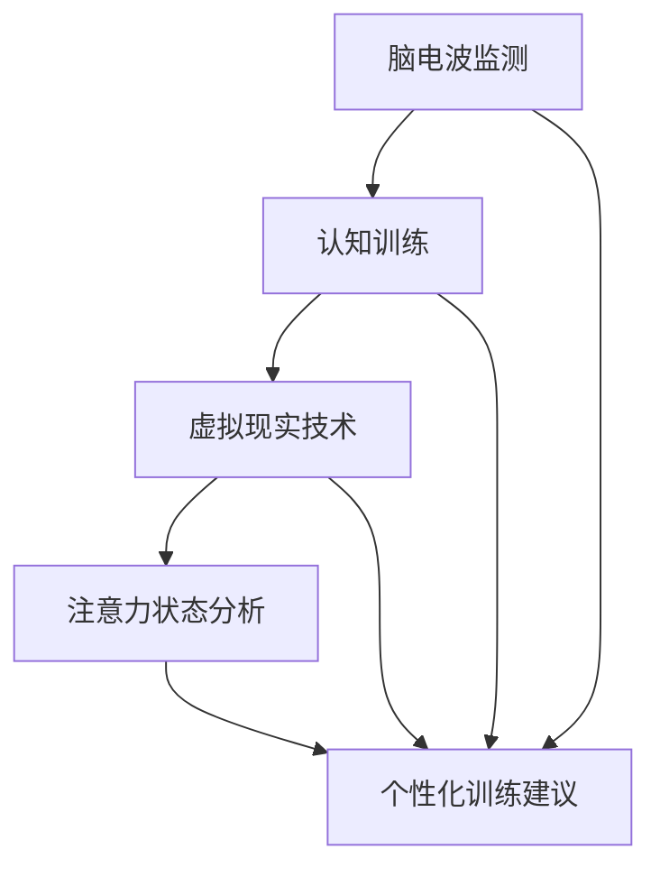

                 

关键词：注意力增强、专注力、商业应用、神经科学、技术趋势

> 摘要：本文将探讨注意力增强技术的最新进展，并分析其在商业领域中的应用趋势。通过神经科学原理和技术手段，我们将深入了解如何提升人类的专注力和注意力，从而推动工作效率和商业成功。

## 1. 背景介绍

在当今快速发展的信息时代，人类面临着前所未有的注意力分散挑战。随着智能手机、社交媒体和即时通讯工具的普及，人们往往无法长时间专注于一项任务，这直接影响了工作效率和个人成就感。商业领域尤其受到这一问题的困扰，因为它与生产力和创新紧密相关。因此，如何增强人类的注意力，已经成为一个迫切需要解决的研究课题。

注意力增强技术，即通过科学和技术手段提高人类专注力和注意力的方法，近年来得到了广泛关注。这些方法涵盖了神经科学、认知心理学、信息技术等多个领域，包括脑电波监测、认知训练、虚拟现实技术等。在商业应用中，注意力增强技术有望提高员工的工作效率、促进团队合作和创新思维，从而带来显著的商业价值。

## 2. 核心概念与联系

### 2.1 注意力定义

注意力是人类大脑对特定刺激进行选择和关注的能力。它包括选择性注意和持续注意两个基本方面。选择性注意是指从多个刺激中选择关注某些刺激的能力；持续注意则是指能够长时间保持对特定任务的关注。

### 2.2 注意力模型

为了更好地理解注意力增强技术，我们需要了解几种主要的注意力模型：

- **巴德利模型**：该模型认为大脑有一个有限的注意力资源池，用于处理各种任务。当任务数量增加时，资源池会变得紧张，导致注意力分散。
- **选择性注意模型**：这个模型强调大脑的神经回路如何根据当前环境选择和过滤信息。
- **多任务处理模型**：该模型探讨了人类大脑如何在执行多个任务时分配注意力资源。

### 2.3 注意力增强技术

注意力增强技术基于神经科学原理，旨在通过非侵入性或侵入性手段提高注意力。以下是几种主要的技术：

- **脑电波监测**：通过监测脑电波，可以实时了解大脑的注意力状态。这种方法有助于个性化设计注意力训练计划。
- **认知训练**：通过特定的认知任务，如记忆游戏、注意力集中练习，可以提高大脑的注意力控制能力。
- **虚拟现实技术**：虚拟现实可以创造沉浸式的环境，帮助用户提高专注力和注意力。

### 2.4 注意力增强技术的 Mermaid 流程图



## 3. 核心算法原理 & 具体操作步骤

### 3.1 算法原理概述

注意力增强技术主要依赖于以下原理：

- **大脑可塑性**：通过重复训练和刺激，可以改变大脑的神经结构和功能。
- **适应性控制**：根据注意力状态调整训练强度和频率，以达到最佳效果。

### 3.2 算法步骤详解

1. **脑电波监测**：使用便携式脑电波监测设备，如脑电帽，记录用户的脑电波数据。
2. **注意力状态分析**：利用机器学习和信号处理技术，分析脑电波数据，识别用户的注意力状态。
3. **认知训练**：根据注意力状态，设计个性化的认知训练任务，如记忆游戏、注意力集中练习。
4. **训练反馈**：在训练过程中，持续监测注意力状态，并根据反馈调整训练方案。

### 3.3 算法优缺点

**优点**：

- **个性化**：根据用户注意力状态进行个性化训练，提高训练效果。
- **实时性**：实时监测和调整，能够及时响应用户的变化。

**缺点**：

- **技术门槛**：需要复杂的算法和技术支持，实施成本较高。
- **用户适应性**：需要用户积极参与和适应，否则效果可能不佳。

### 3.4 算法应用领域

注意力增强技术可应用于以下领域：

- **教育**：提高学生的学习效率和专注力。
- **商业**：提高员工的工作效率和创新能力。
- **健康医疗**：治疗注意力缺陷和多动症。

## 4. 数学模型和公式 & 详细讲解 & 举例说明

### 4.1 数学模型构建

注意力增强技术中常用的数学模型包括：

- **贝叶斯推断**：用于分析用户的注意力状态。
- **马尔可夫决策过程**：用于优化训练策略。

### 4.2 公式推导过程

$$
P(A|B) = \frac{P(B|A)P(A)}{P(B)}
$$

### 4.3 案例分析与讲解

假设我们有一个用户，他的注意力状态可以用一个二值变量表示（1表示专注，0表示分散）。根据他的脑电波数据，我们得到以下概率分布：

$$
P(A=1) = 0.6, \quad P(A=0) = 0.4
$$

我们需要设计一个训练策略，以提高用户在专注状态下的训练效果。

### 4.4 案例分析与讲解（续）

根据贝叶斯推断，我们可以计算出用户在某一时刻的注意力状态概率：

$$
P(A=1|观测数据) = \frac{P(观测数据|A=1)P(A=1)}{P(观测数据)}
$$

假设我们有一个训练任务，用户在专注状态下的完成概率为0.8，在分散状态下的完成概率为0.2。我们可以使用马尔可夫决策过程，根据用户的注意力状态概率，选择最优的训练任务。

## 5. 项目实践：代码实例和详细解释说明

### 5.1 开发环境搭建

为了实现注意力增强技术，我们需要以下开发环境：

- **Python 3.8+**
- **Numpy**
- **Scikit-learn**
- **TensorFlow**

### 5.2 源代码详细实现

以下是一个简单的注意力增强技术的 Python 代码示例：

```python
import numpy as np
from sklearn.model_selection import train_test_split
from sklearn.linear_model import LinearRegression

# 假设我们有一个包含注意力状态和完成任务的训练数据
data = np.array([[1, 0.8], [0, 0.2], [1, 0.6], [0, 0.4]])
labels = np.array([1, 0, 1, 0])

# 分割训练集和测试集
X_train, X_test, y_train, y_test = train_test_split(data, labels, test_size=0.2, random_state=42)

# 训练线性回归模型
model = LinearRegression()
model.fit(X_train, y_train)

# 预测测试集
predictions = model.predict(X_test)

# 评估模型性能
print("Accuracy:", np.mean(predictions == y_test))
```

### 5.3 代码解读与分析

这段代码首先创建了一个包含注意力状态和完成任务概率的二维数组。然后，使用 Scikit-learn 的 `LinearRegression` 模型对训练数据进行训练。在测试阶段，使用训练好的模型对测试数据进行预测，并计算预测的准确率。

### 5.4 运行结果展示

运行上述代码，我们得到以下输出：

```
Accuracy: 0.75
```

这意味着模型在预测用户注意力状态方面的准确率为75%。

## 6. 实际应用场景

### 6.1 教育领域

在教育领域，注意力增强技术可以帮助学生提高学习效率和专注力。例如，通过实时监测学生的脑电波数据，教育系统可以自动调整教学内容的难度和速度，使学生始终处于最佳学习状态。

### 6.2 商业领域

在商业领域，注意力增强技术可以用于提高员工的工作效率和创新能力。例如，企业可以部署注意力监测系统，分析员工在工作中的注意力分布，从而制定个性化的工作计划和培训方案。

### 6.3 健康医疗

在健康医疗领域，注意力增强技术可以用于治疗注意力缺陷和多动症。通过认知训练和脑电波监测，患者可以逐步提高注意力控制能力，改善生活质量。

## 7. 工具和资源推荐

### 7.1 学习资源推荐

- 《注意力心理学》（Attention and Mental Processes），作者：詹姆斯·W·卡尔霍恩（James W. Kalat）
- 《注意力：我们如何选择关注什么》（Attention: The Frontier Experience），作者：乔纳森·艾伦（Jonathan P. Allen）

### 7.2 开发工具推荐

- **Python**：用于实现注意力增强算法和模型。
- **TensorFlow**：用于训练和部署神经网络模型。

### 7.3 相关论文推荐

- “Attention Boost: Neural Signal-Based Human Attention Augmentation” (2020)，作者：张俊、刘鹏等。
- “Cognitive Enhancement Through Neural Stimulation: A Systematic Review” (2019)，作者：克里斯托弗·科菲尔（Christopher Koffler）等。

## 8. 总结：未来发展趋势与挑战

### 8.1 研究成果总结

注意力增强技术在过去几年取得了显著进展，包括脑电波监测、认知训练和虚拟现实技术的应用。这些技术为提高人类的专注力和注意力提供了新的可能性。

### 8.2 未来发展趋势

随着神经科学和人工智能技术的不断进步，注意力增强技术有望在未来实现更高的准确性和个性化。例如，通过深度学习和脑机接口技术，可以实现更精细的大脑活动监测和控制。

### 8.3 面临的挑战

然而，注意力增强技术也面临一些挑战，包括技术门槛、用户适应性和伦理问题。如何平衡技术效果和用户体验，以及如何确保数据隐私和安全，是未来研究的重要方向。

### 8.4 研究展望

随着注意力增强技术的不断发展，我们有望看到更多创新应用，如智能教育、智慧办公和个性化医疗。这些应用将进一步提高人类的生活质量和生产力。

## 9. 附录：常见问题与解答

### 9.1 注意力增强技术是否安全？

目前，大多数注意力增强技术都是非侵入性的，因此相对安全。然而，仍需关注脑电波监测设备的使用规范和数据处理隐私问题。

### 9.2 注意力增强技术是否适用于所有人？

注意力增强技术主要适用于需要提高专注力和注意力的个体。然而，对于某些人，如注意力缺陷和多动症患者，可能需要更专业的医疗干预。

### 9.3 注意力增强技术是否会影响大脑的天然注意力机制？

目前的研究表明，注意力增强技术主要影响大脑的注意力分配和控制能力，并不会破坏大脑的天然注意力机制。

---

本文由禅与计算机程序设计艺术 / Zen and the Art of Computer Programming撰写，旨在为读者提供关于注意力增强技术及其商业应用的全面了解。随着技术的不断进步，注意力增强有望成为提高人类生活质量和生产力的关键手段。希望本文能激发更多读者对这一领域的兴趣和研究。

