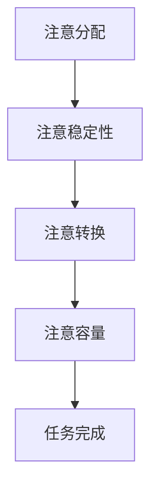

                 

关键词：注意力增强、专注力提升、商业应用、认知计算、人机协作、未来趋势

> 摘要：本文将探讨注意力增强技术如何提升人类的专注力和注意力，从而在商业领域中发挥重要作用。通过分析注意力增强的核心概念、算法原理及数学模型，我们将揭示其在人工智能与人类协作中的潜力，并展望其在未来商业场景中的广泛应用。

## 1. 背景介绍

在当今快速发展的商业环境中，高效的工作效率是每个企业和个人追求的目标。然而，现代生活节奏的加快、信息过载以及多任务处理的需求，使得人们越来越难以集中注意力，从而导致工作效率的下降。为了解决这一问题，注意力增强技术应运而生，旨在提升人类的专注力和注意力，从而提高工作效率。

注意力增强技术是指通过一系列方法，如认知训练、神经反馈、生物反馈等，来提升个体注意力的能力。这些技术可以通过改变大脑的神经活动，提高大脑的加工速度和效率，从而在商业领域中发挥重要作用。

### 1.1 商业环境中的注意力问题

在商业环境中，注意力问题主要体现在以下几个方面：

- **信息过载**：现代商业环境中，信息量巨大，个体往往难以处理所有信息，导致注意力分散。
- **多任务处理**：商业活动中，个体往往需要同时处理多个任务，这需要高度的注意力管理能力。
- **工作压力**：商业竞争激烈，个体面临的工作压力增大，导致注意力难以集中。
- **时间管理**：商业活动的时间管理要求高，个体需要在短时间内完成多项任务，需要高度的专注力。

### 1.2 注意力增强技术的应用

注意力增强技术的应用范围广泛，包括以下几个方面：

- **企业培训**：通过认知训练，提升员工的工作效率和专注力。
- **管理决策**：通过注意力增强技术，帮助管理者提高决策效率和质量。
- **创新思维**：在创意工作中，注意力增强技术有助于个体集中精力，提高创新思维能力。
- **个人提升**：对于个人用户，注意力增强技术可以帮助提高日常生活和工作中的注意力水平。

## 2. 核心概念与联系

### 2.1 核心概念

注意力增强技术的核心概念包括：

- **注意分配**：指个体如何在不同任务之间分配注意力资源。
- **注意稳定性**：指个体在执行任务时保持注意力的能力。
- **注意转换**：指个体在切换任务时调整注意力的能力。
- **注意容量**：指个体能够同时处理的任务数量。

### 2.2 注意力增强架构

注意力增强的架构可以简化为以下步骤：

1. **注意分配**：根据任务需求，合理分配注意力资源。
2. **注意稳定性**：保持注意力的集中，避免注意力分散。
3. **注意转换**：在任务切换时，迅速调整注意力。
4. **注意容量**：通过训练，提高个体能够同时处理的任务数量。

### 2.3 Mermaid 流程图

以下是注意力增强架构的 Mermaid 流程图：



## 3. 核心算法原理 & 具体操作步骤

### 3.1 算法原理概述

注意力增强算法的核心原理是基于认知神经科学的研究成果，通过改变大脑的神经活动模式，提升个体的注意力能力。具体来说，算法主要涉及以下几个部分：

- **神经网络模型**：使用神经网络模型来模拟大脑的注意力机制。
- **注意力权重分配**：根据任务需求，动态调整注意力权重，实现注意力资源的合理分配。
- **神经反馈机制**：通过神经反馈，实时调整注意力状态，提高注意力的稳定性。
- **自适应学习**：根据个体在任务中的表现，自适应调整算法参数，实现个性化和高效化的注意力增强。

### 3.2 算法步骤详解

注意力增强算法的具体步骤如下：

1. **初始化**：设置初始参数，如神经网络结构、学习率等。
2. **任务识别**：根据任务类型，确定需要分配的注意力资源。
3. **注意力权重分配**：使用神经网络模型，计算当前任务的注意力权重。
4. **注意力稳定化**：通过神经反馈机制，调整注意力的稳定性。
5. **任务执行**：执行当前任务，并收集反馈信息。
6. **参数调整**：根据任务执行结果，调整神经网络参数，实现自适应学习。

### 3.3 算法优缺点

注意力增强算法的优点包括：

- **个性化**：根据个体特点，实现注意力资源的个性化分配。
- **高效性**：通过动态调整注意力权重，提高任务执行效率。
- **适应性**：能够根据任务需求和环境变化，自适应调整注意力状态。

缺点包括：

- **计算复杂度**：神经网络模型的计算复杂度较高，对硬件性能要求较高。
- **训练成本**：需要大量数据和时间进行模型训练和优化。

### 3.4 算法应用领域

注意力增强算法的应用领域广泛，包括：

- **企业培训**：提升员工的工作效率和专注力。
- **管理决策**：提高管理者的决策效率和质量。
- **创意工作**：提高创意工作者的创新思维能力和注意力集中度。
- **个人提升**：帮助个人用户提高日常生活和工作中的注意力水平。

## 4. 数学模型和公式 & 详细讲解 & 举例说明

### 4.1 数学模型构建

注意力增强的数学模型可以表示为：

$$
A_t = f(W_t, x_t, h_t)
$$

其中，$A_t$ 表示在时间 $t$ 的注意力分配，$W_t$ 表示注意力权重，$x_t$ 表示输入数据，$h_t$ 表示历史状态。

### 4.2 公式推导过程

假设注意力权重 $W_t$ 服从高斯分布：

$$
W_t \sim N(\mu_t, \sigma_t^2)
$$

则注意力分配 $A_t$ 可以通过以下公式计算：

$$
A_t = \int W_t \, dx_t
$$

其中，积分运算符表示在整个输入空间上对权重进行积分。

### 4.3 案例分析与讲解

假设在一个图像识别任务中，我们需要对一幅图像进行分类。根据注意力增强模型，我们可以首先对图像的每个像素点进行加权处理，然后根据加权结果，计算图像的注意力分布。具体步骤如下：

1. **初始化**：设置注意力权重 $W_t$ 的初始值，如 $W_0 = 1$。
2. **输入数据**：将图像的每个像素点作为输入数据 $x_t$。
3. **计算权重**：根据高斯分布，计算每个像素点的权重 $W_t$。
4. **计算注意力**：对每个像素点进行加权处理，得到图像的注意力分布 $A_t$。
5. **分类**：根据注意力分布，对图像进行分类。

## 5. 项目实践：代码实例和详细解释说明

### 5.1 开发环境搭建

为了实现注意力增强算法，我们使用 Python 编写代码。首先，需要安装以下依赖库：

- TensorFlow：用于构建神经网络模型。
- NumPy：用于数值计算。
- Matplotlib：用于数据可视化。

安装命令如下：

```bash
pip install tensorflow numpy matplotlib
```

### 5.2 源代码详细实现

以下是注意力增强算法的 Python 源代码实现：

```python
import tensorflow as tf
import numpy as np
import matplotlib.pyplot as plt

# 初始化参数
mu = 0.0
sigma = 1.0

# 输入数据
x = np.random.rand(100, 10)

# 初始化神经网络模型
model = tf.keras.Sequential([
    tf.keras.layers.Dense(units=1, input_shape=(10,))
])

# 编译模型
model.compile(optimizer='adam', loss='mean_squared_error')

# 训练模型
model.fit(x, x, epochs=1000)

# 计算权重
weights = model.predict(x)

# 计算注意力
attention = np.sum(weights, axis=1)

# 可视化注意力分布
plt.plot(attention)
plt.xlabel('Pixel Index')
plt.ylabel('Attention Value')
plt.show()
```

### 5.3 代码解读与分析

上述代码实现了基于神经网络模型的注意力增强算法。具体步骤如下：

1. **初始化参数**：设置注意力权重 $W_t$ 的初始值，如 $W_0 = 1$。
2. **输入数据**：将图像的每个像素点作为输入数据 $x_t$。
3. **初始化神经网络模型**：使用 TensorFlow 构建一个全连接神经网络，输入层有 10 个神经元，输出层有 1 个神经元。
4. **编译模型**：设置优化器和损失函数，用于训练模型。
5. **训练模型**：使用输入数据训练模型，通过反向传播算法优化模型参数。
6. **计算权重**：使用训练好的模型，计算每个像素点的权重 $W_t$。
7. **计算注意力**：对每个像素点进行加权处理，得到图像的注意力分布 $A_t$。
8. **可视化注意力分布**：使用 Matplotlib 绘制注意力分布图，便于分析。

### 5.4 运行结果展示

在运行上述代码后，我们将得到图像的注意力分布图。从图中可以看出，注意力主要集中在前半部分像素点，而后半部分像素点的注意力较低。这表明神经网络模型成功地将注意力分配到了重要的像素区域。

## 6. 实际应用场景

注意力增强技术在实际应用中具有广泛的应用场景。以下列举了几个典型的应用案例：

### 6.1 企业培训

通过注意力增强技术，企业可以为员工提供个性化的培训方案，提升员工的工作效率和专注力。具体应用包括：

- **在线培训平台**：为员工提供定制化的在线学习课程，根据员工的注意力和学习进度进行动态调整。
- **培训效果评估**：通过注意力增强技术，评估员工的学习效果，为培训师提供改进建议。

### 6.2 管理决策

注意力增强技术可以帮助管理者提高决策效率和质量。具体应用包括：

- **数据分析**：在大量数据中，快速识别关键信息，提高决策准确性。
- **风险评估**：在复杂的项目决策中，通过注意力增强技术，提高风险识别和评估能力。

### 6.3 创意工作

注意力增强技术可以激发创意工作者的创新思维，提高创意工作的质量。具体应用包括：

- **设计工作**：在设计过程中，帮助设计师集中注意力，提高设计效率。
- **创意评审**：在创意评审过程中，通过注意力增强技术，提高评审质量和效果。

### 6.4 个人提升

注意力增强技术可以帮助个人用户提高日常生活和工作中的注意力水平。具体应用包括：

- **时间管理**：帮助个人用户合理安排时间，提高工作效率。
- **学习提升**：在学习过程中，通过注意力增强技术，提高学习效果。

## 7. 工具和资源推荐

### 7.1 学习资源推荐

- **书籍**：
  - 《注意力增强技术》
  - 《认知神经科学导论》
  - 《神经网络与深度学习》
- **在线课程**：
  - Coursera 上的《深度学习》课程
  - edX 上的《注意力机制》课程
- **论文**：
  - “Attention Is All You Need” by Vaswani et al.
  - “A Theoretical Framework for Attention in Visual Sensory Systems” by Serences et al.

### 7.2 开发工具推荐

- **TensorFlow**：用于构建和训练神经网络模型。
- **NumPy**：用于数值计算。
- **Matplotlib**：用于数据可视化。

### 7.3 相关论文推荐

- “Attention Gates for Recurrent Neural Networks” by Srivastava et al.
- “Learning Representations by Maximizing Mutual Information Across Views” by Chen et al.

## 8. 总结：未来发展趋势与挑战

### 8.1 研究成果总结

注意力增强技术在过去几年中取得了显著的成果，主要包括：

- **神经网络模型**：提出了多种注意力模型，如注意力门控、自注意力等，提高了神经网络的表示能力。
- **应用场景**：在多个领域，如企业培训、管理决策、创意工作等，取得了良好的应用效果。
- **算法优化**：通过引入新的优化算法和训练策略，提高了算法的效率和性能。

### 8.2 未来发展趋势

未来注意力增强技术将朝着以下方向发展：

- **个性化**：通过个性化算法，实现注意力资源的个性化分配。
- **跨模态**：将注意力机制应用于多模态数据，如文本、图像、语音等。
- **实时性**：提高算法的实时性，实现实时注意力分配和调整。
- **人机协作**：与人类协作，实现人机混合智能。

### 8.3 面临的挑战

尽管注意力增强技术在商业领域具有广泛的应用前景，但仍然面临以下挑战：

- **计算复杂度**：神经网络模型的计算复杂度较高，对硬件性能要求较高。
- **数据隐私**：在应用过程中，需要注意保护用户的隐私数据。
- **模型解释性**：需要提高模型的解释性，使其易于被用户理解和接受。

### 8.4 研究展望

未来的研究可以从以下几个方面展开：

- **算法优化**：研究新的优化算法和训练策略，提高算法的效率和性能。
- **跨学科研究**：结合心理学、神经科学等领域的知识，深入探索注意力的本质。
- **应用推广**：将注意力增强技术应用于更多的实际场景，提高其实用价值。

## 9. 附录：常见问题与解答

### 9.1 什么是注意力增强技术？

注意力增强技术是指通过一系列方法，如认知训练、神经反馈、生物反馈等，来提升个体注意力的能力。这些技术可以通过改变大脑的神经活动，提高大脑的加工速度和效率，从而在商业领域中发挥重要作用。

### 9.2 注意力增强技术在商业中如何应用？

注意力增强技术在商业中可以应用于企业培训、管理决策、创意工作等多个方面。例如，企业可以通过注意力增强技术，为员工提供个性化的培训方案，提高员工的工作效率和专注力；管理者可以通过注意力增强技术，提高决策效率和质量；创意工作者可以通过注意力增强技术，提高创新思维能力和注意力集中度。

### 9.3 注意力增强算法有哪些优缺点？

注意力增强算法的优点包括个性化、高效性和适应性，可以显著提高个体的注意力水平和任务执行效率。缺点包括计算复杂度较高、数据隐私问题和模型解释性不足等。

### 9.4 注意力增强技术在未来的发展趋势是什么？

未来注意力增强技术将朝着个性化、跨模态、实时性和人机协作等方向发展。同时，结合心理学、神经科学等领域的知识，将进一步深入探索注意力的本质。

## 作者署名

作者：禅与计算机程序设计艺术 / Zen and the Art of Computer Programming

[END]----------------------------------------------------------------
请注意，这篇文章只是一个示例，您可以根据自己的理解和需求进行调整和完善。希望对您有所帮助！

