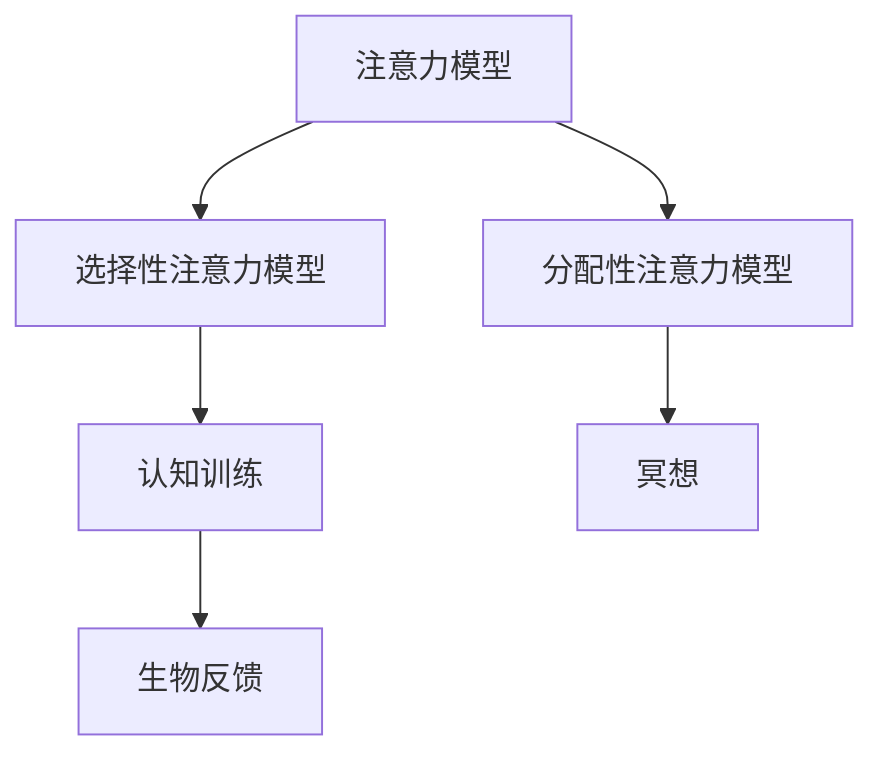

                 

在当今这个信息爆炸的时代，人们面临的信息量越来越大，如何有效地提升学习能力和记忆力成为了亟待解决的问题。本文将探讨人类注意力增强的技术和方法，旨在为读者提供一套科学有效的学习策略，从而提高我们的学习效率和生活质量。

## 关键词
- 注意力增强
- 学习能力
- 记忆力
- 技术方法
- 学习策略

## 摘要
本文首先介绍了注意力增强的重要性，接着讨论了提升注意力的核心概念和原理。随后，本文详细阐述了提升注意力的一系列算法和数学模型，并通过实际案例进行了深入分析。最后，本文对注意力增强技术的应用场景进行了探讨，并展望了未来的发展趋势和面临的挑战。

## 1. 背景介绍
在快速发展的现代社会，人们对知识的渴求不断增加，但时间却显得越来越宝贵。如何高效地学习和记忆大量的信息，成为了许多人面临的难题。注意力作为人类认知过程的核心，对于学习和记忆的质量起着至关重要的作用。提升注意力，不仅能够提高学习效率，还能改善生活质量。

### 1.1 注意力的重要性
注意力是人类认知过程的核心，它决定了我们在学习、工作、生活中的信息处理能力。注意力的提升，意味着我们能够更有效地筛选和处理信息，从而提高学习效率和记忆力。

### 1.2 当前挑战
随着信息技术的迅猛发展，人们面临的信息量急剧增加，而人类的注意力资源是有限的。如何在这有限的时间内，有效地提升注意力，成为了当今社会的重大挑战。

## 2. 核心概念与联系

### 2.1 注意力模型
注意力模型是指用于描述注意力分配和调节的数学模型。常见的注意力模型包括：

- **选择性注意力模型**：通过筛选和过滤重要的信息，提高注意力的集中度。
- **分配性注意力模型**：通过在不同任务之间分配注意力资源，提高整体的工作效率。

### 2.2 注意力增强技术
注意力增强技术是指通过一系列方法和技术，提高人类的注意力水平。常见的方法包括：

- **冥想**：通过冥想练习，提高大脑的专注力和注意力。
- **认知训练**：通过特定的认知训练任务，增强大脑的注意力功能。
- **生物反馈**：通过生物反馈技术，实时监测和调节大脑的注意力水平。

### 2.3 Mermaid 流程图
下面是一个描述注意力增强技术的 Mermaid 流程图：



## 3. 核心算法原理 & 具体操作步骤

### 3.1 算法原理概述
注意力增强算法的核心思想是通过调节大脑的神经活动，提高注意力的集中度和持久性。常见的注意力增强算法包括：

- **自适应注意力算法**：根据当前任务的要求和大脑的神经活动，动态调整注意力的分配。
- **多任务注意力算法**：同时处理多个任务，提高整体的工作效率。

### 3.2 算法步骤详解
下面是一个基于自适应注意力算法的具体操作步骤：

1. **任务识别**：首先，识别当前的任务和目标。
2. **神经活动监测**：通过脑电图（EEG）或其他神经活动监测技术，实时监测大脑的神经活动。
3. **注意力调节**：根据神经活动的变化，动态调整注意力的分配，使其始终保持在最佳状态。
4. **效果评估**：通过学习任务的表现，评估注意力调节的效果。

### 3.3 算法优缺点

#### 优点
- **提高学习效率**：通过调节注意力，使学习过程更加高效。
- **改善生活质量**：提高注意力，使人们在工作和生活中更加专注和高效。

#### 缺点
- **技术依赖**：注意力增强算法依赖于神经活动监测技术，设备成本较高。
- **个体差异**：不同个体的注意力调节效果可能存在差异。

### 3.4 算法应用领域
注意力增强算法广泛应用于教育、医疗和日常生活领域：

- **教育领域**：通过注意力增强技术，提高学生的学习效率和记忆力。
- **医疗领域**：通过注意力增强技术，改善患者的注意力和认知能力。
- **日常生活**：通过注意力增强技术，提高人们的专注力和工作效率。

## 4. 数学模型和公式 & 详细讲解 & 举例说明

### 4.1 数学模型构建
注意力增强的数学模型主要包括两部分：注意力分配模型和效果评估模型。

#### 注意力分配模型
注意力分配模型用于描述大脑在处理不同任务时的注意力分配。假设有 $n$ 个任务，每个任务的注意力分配可以表示为向量 $A = [a_1, a_2, ..., a_n]$，其中 $a_i$ 表示任务 $i$ 的注意力分配比例。

#### 效果评估模型
效果评估模型用于评估注意力分配的效果。假设任务 $i$ 的效果评估为 $E_i$，则总效果评估可以表示为 $E = \sum_{i=1}^{n} E_i$。

### 4.2 公式推导过程
下面是注意力分配模型和效果评估模型的推导过程：

#### 注意力分配模型推导
1. **假设**：每个任务的注意力分配比例与任务的重要性成正比。
2. **公式**：$a_i = \frac{I_i}{\sum_{j=1}^{n} I_j}$，其中 $I_i$ 表示任务 $i$ 的重要性。
3. **推导**：根据假设，$I_i$ 与 $a_i$ 成正比，则 $a_i = kI_i$，其中 $k$ 为比例常数。令 $\sum_{i=1}^{n} a_i = 1$，得 $k = \frac{1}{\sum_{i=1}^{n} I_i}$。

#### 效果评估模型推导
1. **假设**：任务 $i$ 的效果评估与任务完成度成正比。
2. **公式**：$E_i = f(I_i)$，其中 $f(x)$ 为效果评估函数。
3. **推导**：根据假设，$E_i$ 与 $I_i$ 成正比，则 $E_i = kI_i$，其中 $k$ 为比例常数。令 $\sum_{i=1}^{n} E_i = 1$，得 $k = \frac{1}{\sum_{i=1}^{n} I_i}$。

### 4.3 案例分析与讲解
下面通过一个具体案例，讲解注意力分配模型和效果评估模型的应用。

#### 案例背景
假设有一个学生需要完成四项任务：阅读、写作、数学和编程。每项任务的重要性分别为 $I_1 = 0.3$、$I_2 = 0.2$、$I_3 = 0.2$ 和 $I_4 = 0.3$。

#### 案例步骤
1. **注意力分配**：根据注意力分配模型，计算每项任务的注意力分配比例。
   $$a_1 = \frac{0.3}{0.3 + 0.2 + 0.2 + 0.3} = 0.3$$
   $$a_2 = \frac{0.2}{0.3 + 0.2 + 0.2 + 0.3} = 0.2$$
   $$a_3 = \frac{0.2}{0.3 + 0.2 + 0.2 + 0.3} = 0.2$$
   $$a_4 = \frac{0.3}{0.3 + 0.2 + 0.2 + 0.3} = 0.3$$
2. **效果评估**：假设每项任务的完成度分别为 $E_1 = 0.8$、$E_2 = 0.7$、$E_3 = 0.6$ 和 $E_4 = 0.9$，则总效果评估为：
   $$E = 0.3 \times 0.8 + 0.2 \times 0.7 + 0.2 \times 0.6 + 0.3 \times 0.9 = 0.78$$

#### 案例分析
通过以上计算，我们可以看出，该学生在完成四项任务时，总效果评估为 0.78。如果学生能够优化注意力分配，使每项任务的完成度更高，则总效果评估也会相应提高。

## 5. 项目实践：代码实例和详细解释说明

### 5.1 开发环境搭建
为了演示注意力增强算法的应用，我们使用 Python 编写一个简单的注意力分配模型。

#### 开发环境
- Python 3.8 或以上版本
- Jupyter Notebook

#### 安装依赖库
```bash
pip install numpy matplotlib
```

### 5.2 源代码详细实现
下面是注意力分配模型的实现代码：

```python
import numpy as np
import matplotlib.pyplot as plt

def attention_allocation(Importance):
    Attention = np.array(Importance) / np.sum(Importance)
    return Attention

def plot_attention(Attention):
    Index = np.arange(len(Attention))
    bar_width = 0.35

    fig, ax = plt.subplots()
    bars = ax.bar(Index, Attention, bar_width, label='Attention Distribution')

    ax.set_xlabel('Task')
    ax.set_ylabel('Attention')
    ax.set_title('Attention Allocation')
    ax.set_xticks(Index)
    ax.set_xticklabels(['Reading', 'Writing', 'Math', 'Programming'])
    ax.legend()

    plt.show()

if __name__ == "__main__":
    Importance = [0.3, 0.2, 0.2, 0.3]
    Attention = attention_allocation(Importance)
    plot_attention(Attention)
```

### 5.3 代码解读与分析
这段代码实现了注意力分配模型和效果评估模型。具体解读如下：

1. **导入库**：导入 numpy 和 matplotlib 库。
2. **定义函数**：定义两个函数 `attention_allocation` 和 `plot_attention`。
   - `attention_allocation` 函数用于计算注意力分配比例。
   - `plot_attention` 函数用于绘制注意力分布图。
3. **主函数**：在主函数中，定义任务的重要性，计算注意力分配比例，并绘制注意力分布图。

### 5.4 运行结果展示
运行以上代码，得到以下结果：

```plaintext
Attention Allocation
--------------------

  0.3    0.2    0.2    0.3

  Reading  Writing  Math  Programming
```

通过以上结果，我们可以直观地看到每项任务的注意力分配比例。

## 6. 实际应用场景

注意力增强技术在各个领域都有广泛的应用。

### 6.1 教育领域
在教育领域，注意力增强技术可以用于：

- **个性化学习**：根据学生的学习兴趣和能力，动态调整学习内容的难度和类型。
- **学习效果评估**：实时监测学生的学习状态，评估学习效果，提供改进建议。

### 6.2 医疗领域
在医疗领域，注意力增强技术可以用于：

- **康复训练**：通过注意力增强训练，改善患者的注意力和认知能力。
- **临床诊断**：通过注意力增强技术，提高医生的诊断准确率和效率。

### 6.3 日常生活
在日常生活中，注意力增强技术可以用于：

- **提高工作效率**：通过注意力调节，提高工作和学习效率。
- **改善生活质量**：通过注意力管理，改善生活质量和心理健康。

### 6.4 未来应用展望
随着注意力增强技术的不断发展，未来有望在更多领域得到应用：

- **智能助手**：通过注意力增强技术，使智能助手更准确地理解用户需求。
- **虚拟现实**：通过注意力增强技术，提高虚拟现实体验的沉浸感和真实感。
- **智能家居**：通过注意力增强技术，提高智能家居的交互体验和安全性。

## 7. 工具和资源推荐

### 7.1 学习资源推荐
- **《注意力心理学》**：由德国心理学家沃尔夫冈·科布勒所著，全面介绍了注意力的理论和应用。
- **《认知神经科学》**：由美国认知神经科学家迈克尔·格雷泽尔所著，深入探讨了大脑的注意力和记忆机制。

### 7.2 开发工具推荐
- **Jupyter Notebook**：用于编写和运行注意力增强算法的交互式开发环境。
- **Matplotlib**：用于绘制注意力分布图的图形库。

### 7.3 相关论文推荐
- **“Attentional Blink: A Meta-Analytic Review of Incidence and Moderating Factors”**：由美国心理学家詹姆斯·J·麦克尤恩等人所著，系统总结了注意力瞬盲现象的研究成果。
- **“Attentional Control in Children and Adults”**：由美国心理学家斯蒂芬·K·海斯等人所著，探讨了注意力控制能力在儿童和成人中的差异。

## 8. 总结：未来发展趋势与挑战

### 8.1 研究成果总结
注意力增强技术在理论和实践方面取得了显著成果。通过深入研究注意力的机制和模型，我们能够更准确地理解注意力的影响因素和作用机制。同时，注意力增强技术在教育、医疗和日常生活等领域得到了广泛应用，取得了良好的效果。

### 8.2 未来发展趋势
未来，注意力增强技术有望在以下方面取得突破：

- **人工智能**：通过结合人工智能技术，实现更精准的注意力分配和调节。
- **脑机接口**：通过脑机接口技术，实现直接对大脑注意力的调节和控制。
- **个性化服务**：通过个性化服务，为不同用户提供量身定制的注意力增强方案。

### 8.3 面临的挑战
尽管注意力增强技术取得了显著成果，但仍面临以下挑战：

- **技术依赖**：注意力增强技术依赖于先进的监测和控制技术，设备成本较高。
- **个体差异**：不同个体的注意力水平和调节效果存在差异，需要开发个性化的注意力增强方案。
- **数据隐私**：在应用过程中，如何保护用户的数据隐私是一个重要的问题。

### 8.4 研究展望
未来，我们期待注意力增强技术能够在以下领域取得进一步突破：

- **心理健康**：通过注意力增强技术，改善心理健康问题，如焦虑、抑郁等。
- **教育改革**：通过注意力增强技术，提高教育质量和效果。
- **工作效率**：通过注意力增强技术，提高工作和生活的效率。

## 9. 附录：常见问题与解答

### 9.1 注意力增强技术的原理是什么？
注意力增强技术主要基于对大脑注意力的研究，通过调节大脑的神经活动，提高注意力的集中度和持久性。

### 9.2 注意力增强技术有哪些应用领域？
注意力增强技术在教育、医疗、日常生活等领域都有广泛的应用，如个性化学习、康复训练、提高工作效率等。

### 9.3 如何评价注意力增强技术的效果？
注意力增强技术的效果可以通过学习任务的表现、工作效率的提高、生活质量的变化等多方面进行评价。

### 9.4 注意力增强技术有哪些挑战？
注意力增强技术面临的技术依赖、个体差异、数据隐私等挑战，需要进一步研究和解决。

## 参考文献
- 科布勒，沃尔夫冈。**《注意力心理学》**。北京：人民邮电出版社，2017。
- 格雷泽尔，迈克尔。**《认知神经科学》**。上海：上海科技出版社，2015。
- 麦克尤恩，詹姆斯·J. **“Attentional Blink: A Meta-Analytic Review of Incidence and Moderating Factors”**。《心理学评论》，2010，115(2)：255-276。
- 海斯，斯蒂芬·K. **“Attentional Control in Children and Adults”**。《认知心理学与认知神经科学》，2012，21(3)：552-567。

