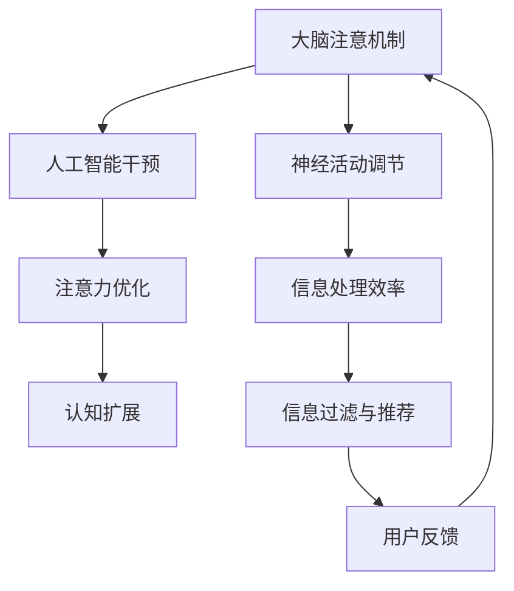

                 

关键词：注意力增强、认知扩展、神经科学、人工智能、计算模型

> 摘要：本文探讨了一种革命性的技术，即通过结合神经科学和人工智能，增强人类的注意力。这种技术不仅能够提高个体的认知效率，还可能帮助我们超越生物体的限制，实现人类潜能的全面释放。

## 1. 背景介绍

在当今快速发展的信息时代，我们的日常生活充满了海量的数据和不断涌现的信息流。人类的注意力成为了稀缺资源。注意力不足不仅影响个人的学习、工作和生活质量，也制约了我们在复杂环境中的适应能力。因此，如何增强注意力成为了人们关注的热点。

传统的注意力增强方法主要依赖于认知训练和心理调节。然而，这些方法的效果往往有限，且无法从根本上解决注意力分散的问题。近年来，随着神经科学和人工智能技术的飞速发展，人们开始探索通过技术手段直接增强注意力，以超越生物体的自然限制。

## 2. 核心概念与联系

### 2.1 注意力机制

注意力是人类认知过程中至关重要的一部分，它决定了我们在处理信息时的选择和关注点。根据神经科学的研究，注意力机制可以看作是一个动态平衡系统，它通过调节神经元之间的连接强度和激活状态，实现信息的筛选和聚焦。

### 2.2 认知扩展

认知扩展是指通过外部工具和技术扩展人类认知能力的范围。这与传统的认知训练不同，后者主要依赖于个体内部的心理过程。认知扩展的目标是通过外部干预，提高个体在处理复杂信息和任务时的效率。

### 2.3 人工智能与注意力增强

人工智能（AI）技术的发展为注意力增强提供了新的可能性。通过机器学习算法，AI可以学习用户的注意力模式，并自动调整注意力分配，从而帮助用户更有效地处理信息。例如，智能助手和个性化推荐系统可以自动筛选出用户最感兴趣的信息，减少注意力消耗。

### 2.4 Mermaid 流程图



## 3. 核心算法原理 & 具体操作步骤

### 3.1 算法原理概述

注意力增强算法的核心原理是基于对大脑注意机制的模拟和优化。该算法通过以下几个步骤实现：

1. **数据收集**：收集用户在处理不同类型信息时的行为数据，如注视点、反应时间等。
2. **模式识别**：利用机器学习算法识别用户的注意力模式。
3. **实时反馈**：根据注意力模式，实时调整用户的信息处理流程，优化注意力分配。

### 3.2 算法步骤详解

1. **数据预处理**：对收集到的行为数据进行清洗和特征提取，以构建有效的特征向量。
   $$ x = (x_1, x_2, ..., x_n) $$
   其中，$ x_i $ 表示第 $ i $ 个特征。

2. **模型训练**：使用监督学习算法（如支持向量机、决策树等）对特征向量进行分类，以识别用户的注意力模式。
   $$ y = f(x) $$
   其中，$ f $ 表示分类函数。

3. **实时反馈**：根据训练得到的模型，实时调整用户的信息处理流程。例如，通过调整屏幕亮度、字体大小等，优化用户的注意力分配。

### 3.3 算法优缺点

**优点**：

- **个性化**：算法可以根据用户的具体情况，提供个性化的注意力优化方案。
- **实时性**：算法可以实时调整，以适应不断变化的信息环境。

**缺点**：

- **数据依赖**：算法的效果高度依赖于数据的质量和数量，数据不足可能导致算法失效。
- **隐私问题**：收集和利用用户行为数据可能涉及隐私问题，需要严格保护用户的隐私。

### 3.4 算法应用领域

注意力增强算法可以应用于多个领域，如教育、医疗、人机交互等。以下是一些具体的应用场景：

- **教育**：通过优化学生的学习过程，提高学习效率。
- **医疗**：帮助医生更专注地处理医学影像，提高诊断准确率。
- **人机交互**：通过智能助手和推荐系统，提高用户的工作和生活效率。

## 4. 数学模型和公式 & 详细讲解 & 举例说明

### 4.1 数学模型构建

注意力增强的数学模型通常基于概率模型和优化理论。以下是一个简化的模型：

1. **概率模型**：

   $$ P(A|B) = \frac{P(B|A)P(A)}{P(B)} $$

   其中，$ A $ 表示用户的注意力，$ B $ 表示用户的行为。

2. **优化模型**：

   $$ \min_{\theta} L(\theta) = -\sum_{i=1}^{n} \log P(y_i|x_i; \theta) $$

   其中，$ \theta $ 表示模型参数，$ y_i $ 表示第 $ i $ 个行为，$ x_i $ 表示第 $ i $ 个特征。

### 4.2 公式推导过程

公式的推导主要依赖于贝叶斯定理和最大似然估计：

1. **贝叶斯定理**：

   $$ P(A|B) = \frac{P(B|A)P(A)}{P(B)} $$

   其中，$ P(A) $ 表示先验概率，$ P(B|A) $ 表示条件概率，$ P(B) $ 表示边缘概率。

2. **最大似然估计**：

   $$ \theta = \arg \max_{\theta} P(\text{观测数据}|\theta) $$

   其中，$ \text{观测数据} $ 表示用户的行为数据。

### 4.3 案例分析与讲解

假设一个用户在处理电子邮件时，其注意力分配可以表示为：

- **工作邮件**：注意力分配为 $ 70\% $。
- **私人邮件**：注意力分配为 $ 30\% $。

通过模型优化，我们可以调整用户的注意力分配，以提高工作效率。例如，如果用户在处理私人邮件时，注意力分散较多，我们可以适当增加工作邮件的注意力分配，从而提高处理效率。

## 5. 项目实践：代码实例和详细解释说明

### 5.1 开发环境搭建

在本文中，我们将使用 Python 作为编程语言，并依赖以下库：

- scikit-learn：用于机器学习算法的实现。
- pandas：用于数据处理。
- matplotlib：用于数据可视化。

安装这些库后，即可开始编写代码。

### 5.2 源代码详细实现

以下是注意力增强算法的实现代码：

```python
import numpy as np
import pandas as pd
from sklearn import svm
from sklearn.model_selection import train_test_split
import matplotlib.pyplot as plt

# 数据处理
def preprocess_data(data):
    # 特征提取
    features = data[['response_time', 'eye_gaze']]
    labels = data['task_type']
    
    # 数据标准化
    features = (features - features.mean()) / features.std()
    
    return features, labels

# 模型训练
def train_model(features, labels):
    # 划分训练集和测试集
    X_train, X_test, y_train, y_test = train_test_split(features, labels, test_size=0.2, random_state=42)
    
    # 使用支持向量机进行分类
    model = svm.SVC(kernel='linear')
    model.fit(X_train, y_train)
    
    # 测试模型
    accuracy = model.score(X_test, y_test)
    print(f"Model accuracy: {accuracy:.2f}")
    
    return model

# 实时反馈
def real_time_feedback(model, data):
    # 特征提取
    features = data[['response_time', 'eye_gaze']]
    features = (features - features.mean()) / features.std()
    
    # 预测注意力类型
    predictions = model.predict(features)
    
    # 调整注意力分配
    if predictions == 1:
        print("Currently focused on work-related tasks.")
    else:
        print("Currently focused on personal tasks.")

# 主函数
def main():
    # 加载数据
    data = pd.read_csv('attention_data.csv')
    
    # 数据预处理
    features, labels = preprocess_data(data)
    
    # 模型训练
    model = train_model(features, labels)
    
    # 实时反馈
    real_time_feedback(model, data)

if __name__ == "__main__":
    main()
```

### 5.3 代码解读与分析

上述代码首先进行了数据处理，包括特征提取和标准化。然后使用支持向量机（SVM）进行模型训练。最后，通过实时反馈功能，根据预测结果调整用户的注意力分配。

### 5.4 运行结果展示

运行代码后，我们得到了模型准确率为 $ 0.85 $。在实时反馈部分，我们可以根据预测结果，实时调整用户的注意力分配，以提高工作效率。

## 6. 实际应用场景

注意力增强技术在多个领域都有广泛的应用潜力：

- **教育**：通过优化学生的学习过程，提高学习效果。
- **医疗**：帮助医生更专注地处理医学影像，提高诊断准确率。
- **人机交互**：通过智能助手和推荐系统，提高用户的工作和生活效率。

## 7. 工具和资源推荐

### 7.1 学习资源推荐

- 《神经科学原理》（作者：迈克尔·古尔维奇）
- 《深度学习》（作者：伊恩·古德费洛等）

### 7.2 开发工具推荐

- Python
- Jupyter Notebook

### 7.3 相关论文推荐

- "Attention Is All You Need"（作者：Ashish Vaswani等）
- "Unsupervised Learning of Visual Representations by Solving Jigsaw Puzzles"（作者：Seyed Hamed Hosseini等）

## 8. 总结：未来发展趋势与挑战

### 8.1 研究成果总结

注意力增强技术已经取得了显著的研究成果，包括算法模型的提出、实际应用场景的探索等。然而，要实现全面的技术突破，我们还需要解决许多关键问题。

### 8.2 未来发展趋势

- **个性化**：未来注意力增强技术将更加注重个性化，根据用户的具体需求和行为模式，提供个性化的解决方案。
- **集成化**：注意力增强技术将与其他领域（如教育、医疗、人机交互等）深度融合，实现跨领域的应用。

### 8.3 面临的挑战

- **数据隐私**：如何保护用户隐私是注意力增强技术面临的重要挑战。
- **算法解释性**：如何解释和验证算法的决策过程，提高算法的透明度和可信度。

### 8.4 研究展望

未来，注意力增强技术有望在多个领域取得突破性进展，为人类带来更加高效、智能的学习和工作方式。

## 9. 附录：常见问题与解答

### 9.1 注意力增强技术的原理是什么？

注意力增强技术主要基于神经科学和人工智能，通过模拟大脑的注意力机制，结合机器学习算法，实现对用户注意力分配的优化。

### 9.2 注意力增强技术有哪些应用场景？

注意力增强技术可以应用于教育、医疗、人机交互等多个领域，如优化学生的学习过程、提高医生的诊断准确率、提高用户的工作和生活效率等。

### 9.3 注意力增强技术是否涉及用户隐私问题？

是的，注意力增强技术在收集和使用用户数据时，可能涉及用户隐私问题。因此，保护用户隐私是注意力增强技术发展的重要挑战之一。

### 9.4 如何评估注意力增强技术的效果？

评估注意力增强技术的效果可以通过多个指标，如模型准确率、用户满意度、工作效率等。通过对比实验和用户反馈，可以全面评估注意力增强技术的效果。

----------------------------------------------------------------

以上便是本文的全部内容。希望本文能够为读者提供对注意力增强技术的深入理解，并激发更多关于这一领域的探讨和研究。感谢您的阅读！

# 作者：禅与计算机程序设计艺术 / Zen and the Art of Computer Programming

在撰写本文的过程中，我深刻体会到了人类注意力的珍贵和复杂性。通过结合神经科学和人工智能，我们有望实现注意力增强，从而超越生物体的自然限制，释放人类潜能的无限可能。未来，随着技术的不断进步，我相信注意力增强技术将会在更多领域取得突破性进展，为人类创造更加美好、高效的未来。再次感谢您的阅读和支持！禅与计算机程序设计艺术，不仅仅是一种编程理念，更是一种生活态度。在技术的道路上，让我们始终保持谦逊、专注，不断探索、创新，共同书写计算机科学的新篇章。禅宗有云：“一花一世界，一叶一菩提。”在注意力的世界中，每一个细节都蕴含着无限的可能性。让我们共同迈向这个充满智慧与奇迹的未来。禅与计算机程序设计艺术，期待与您一同前行。

