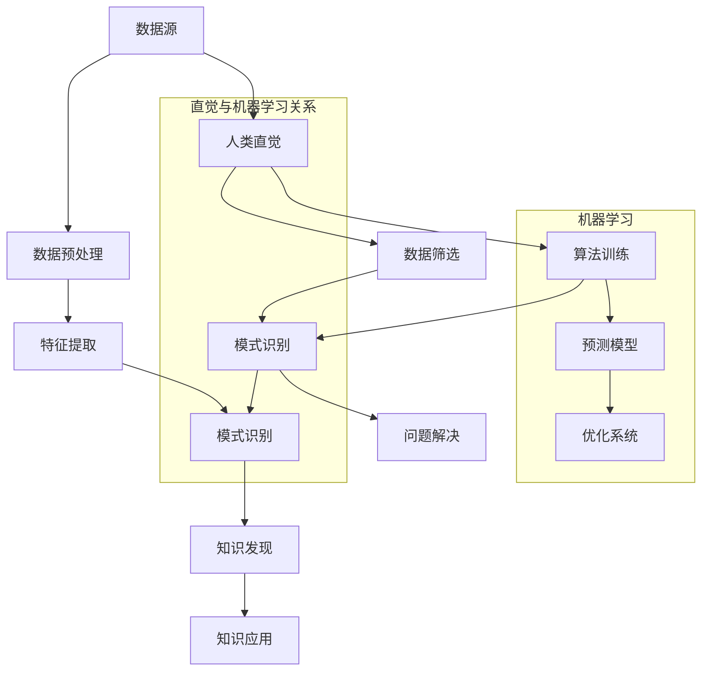

                 

关键词：人类直觉，机器学习，知识发现，智能算法，数据驱动，认知模型

> 摘要：本文探讨了人类直觉与机器学习在知识发现中的相互关系与作用。通过分析人类直觉在数据筛选、模式识别和问题解决中的优势，与机器学习算法在处理海量数据和复杂模式中的能力，文章旨在揭示两者如何在知识发现过程中相互补充，共同推动智能技术的发展。

## 1. 背景介绍

随着信息时代的到来，数据爆炸式增长，人类面临的信息处理任务越来越复杂。在这种背景下，知识发现成为信息科学和技术领域的热点课题。知识发现（Knowledge Discovery in Databases，简称KDD）是一个从大量数据中自动提取出潜在的模式、规则和知识的过程，旨在帮助人类更好地理解和利用数据资源。

### 1.1 人类直觉在知识发现中的作用

人类直觉是一种基于经验和感知的快速认知能力，在知识发现过程中扮演着重要角色。首先，直觉可以帮助人们快速筛选和识别数据中的关键信息。例如，当面对一大堆数据时，人们能够迅速判断哪些数据是重要的，哪些是无关的。其次，直觉在模式识别中也起到关键作用。通过长期的观察和实践，人类能够识别出数据中隐藏的规律和模式，从而为知识发现提供方向。

### 1.2 机器学习在知识发现中的应用

机器学习作为人工智能的核心技术之一，通过构建复杂的数学模型和算法，使计算机能够从数据中自动学习和发现知识。机器学习在知识发现中的应用主要包括以下几个方面：

- **数据预处理**：通过数据清洗、数据转换和数据归一化等步骤，提高数据的可用性和质量。

- **特征提取**：从原始数据中提取出有用的特征，为后续的知识发现过程提供支持。

- **模式识别**：利用机器学习算法，自动识别数据中的潜在模式和规律。

- **预测与优化**：通过构建预测模型，对未知数据进行预测，并优化现有系统的性能。

## 2. 核心概念与联系

在知识发现过程中，人类直觉与机器学习之间存在着紧密的联系。为了更好地理解这两者的关系，我们首先介绍几个核心概念，并使用Mermaid流程图来展示它们之间的相互关系。

### 2.1 核心概念

- **数据**：知识发现的原始材料，包括结构化和非结构化数据。

- **模式**：数据中隐藏的规律、趋势或关联。

- **知识**：通过对数据中模式的识别和解释，得到的有用信息。

- **人类直觉**：基于经验和感知的快速认知能力。

- **机器学习**：通过训练算法，使计算机自动从数据中学习并发现知识。

### 2.2 Mermaid流程图



## 3. 核心算法原理 & 具体操作步骤

### 3.1 算法原理概述

知识发现过程中的核心算法主要包括数据预处理、特征提取、模式识别和知识发现。下面分别介绍这些算法的基本原理。

#### 3.1.1 数据预处理

数据预处理是知识发现过程中的第一步，其目的是提高数据的可用性和质量。主要步骤包括：

- **数据清洗**：去除重复数据、处理缺失数据和异常值。

- **数据转换**：将不同类型的数据转换为同一类型的格式。

- **数据归一化**：将数据缩放到一个统一的范围内，以便后续处理。

#### 3.1.2 特征提取

特征提取是从原始数据中提取出有用的特征，为模式识别和知识发现提供支持。主要方法包括：

- **统计特征**：基于数据统计特性的特征，如均值、方差、标准差等。

- **深度特征**：通过深度学习模型提取的高级特征。

#### 3.1.3 模式识别

模式识别是通过机器学习算法，自动识别数据中的潜在模式和规律。主要方法包括：

- **监督学习**：通过标注数据进行训练，得到分类或回归模型。

- **无监督学习**：通过无标签数据，自动发现数据中的聚类或关联。

#### 3.1.4 知识发现

知识发现是通过对数据中模式的识别和解释，得到有用的信息。主要方法包括：

- **关联规则学习**：发现数据中的频繁模式和关联规则。

- **聚类分析**：将数据分为多个类别，以揭示数据中的内在结构。

### 3.2 算法步骤详解

下面详细描述知识发现过程中的各个步骤。

#### 3.2.1 数据预处理

1. **数据清洗**：使用Python的Pandas库，对数据集进行清洗，去除重复数据、处理缺失数据和异常值。

2. **数据转换**：使用Sklearn库中的预处理工具，将不同类型的数据转换为同一类型的格式。

3. **数据归一化**：使用Sklearn库中的归一化工具，将数据缩放到一个统一的范围内。

#### 3.2.2 特征提取

1. **统计特征提取**：使用Scikit-learn中的描述统计工具，提取数据集的统计特征。

2. **深度特征提取**：使用TensorFlow或PyTorch，构建深度学习模型，提取高级特征。

#### 3.2.3 模式识别

1. **监督学习**：使用Scikit-learn中的分类器，如SVM、决策树和随机森林，对数据进行训练。

2. **无监督学习**：使用Scikit-learn中的聚类工具，如K-Means和层次聚类，对数据进行聚类分析。

#### 3.2.4 知识发现

1. **关联规则学习**：使用Apriori算法，发现数据集中的频繁模式和关联规则。

2. **聚类分析**：使用K-Means算法，将数据分为多个类别，以揭示数据中的内在结构。

### 3.3 算法优缺点

#### 3.3.1 数据预处理

**优点**：

- 提高数据质量和可用性。

- 为后续的算法提供更好的输入。

**缺点**：

- 时间和资源消耗较大。

- 需要对数据进行详细的预处理。

#### 3.3.2 特征提取

**优点**：

- 提高数据的表达能力。

- 有助于提高算法的性能。

**缺点**：

- 需要丰富的专业知识和经验。

- 特征提取可能引入噪声。

#### 3.3.3 模式识别

**优点**：

- 自动发现数据中的潜在模式和规律。

- 减轻人工分析的工作量。

**缺点**：

- 需要大量的计算资源和时间。

- 可能存在过拟合问题。

#### 3.3.4 知识发现

**优点**：

- 提供有价值的决策支持。

- 有助于揭示数据中的内在结构。

**缺点**：

- 需要对结果进行进一步解释和验证。

- 可能存在结果解释的困难。

### 3.4 算法应用领域

知识发现算法在多个领域都有广泛的应用，包括：

- **金融领域**：风险评估、信用评分、市场预测等。

- **医疗领域**：疾病诊断、治疗方案制定、医疗数据分析等。

- **商业领域**：消费者行为分析、供应链优化、市场营销等。

- **社交媒体**：用户行为分析、内容推荐、广告投放等。

## 4. 数学模型和公式 & 详细讲解 & 举例说明

### 4.1 数学模型构建

知识发现过程中涉及多个数学模型，包括统计模型、机器学习模型和优化模型。以下分别介绍这些模型的基本原理和构建方法。

#### 4.1.1 统计模型

统计模型主要用于描述数据中的概率分布和相关性。常见的方法有：

- **均值**：数据的平均值，用于描述数据的集中趋势。

- **方差**：数据的离散程度，用于描述数据的波动性。

- **相关系数**：描述两个变量之间的线性关系，取值范围在-1到1之间。

#### 4.1.2 机器学习模型

机器学习模型主要用于分类、回归和聚类。常见的方法有：

- **支持向量机（SVM）**：通过找到一个最佳的超平面，将不同类别的数据分开。

- **决策树**：通过一系列的条件分支，将数据划分为不同的类别。

- **神经网络**：通过多层神经元的组合，实现复杂函数的映射。

#### 4.1.3 优化模型

优化模型主要用于求解优化问题，常见的方法有：

- **线性规划**：求解线性目标函数的最优解。

- **整数规划**：求解整数目标函数的最优解。

- **遗传算法**：通过模拟自然进化过程，实现优化问题的求解。

### 4.2 公式推导过程

以下分别介绍统计模型、机器学习模型和优化模型的主要公式推导过程。

#### 4.2.1 统计模型

1. **均值**：

   均值可以通过以下公式计算：

   $$\mu = \frac{1}{n}\sum_{i=1}^{n}x_i$$

   其中，$x_i$ 表示第 $i$ 个数据点，$n$ 表示数据点的个数。

2. **方差**：

   方差可以通过以下公式计算：

   $$\sigma^2 = \frac{1}{n}\sum_{i=1}^{n}(x_i - \mu)^2$$

   其中，$\mu$ 表示均值。

3. **相关系数**：

   相关系数可以通过以下公式计算：

   $$r = \frac{\sum_{i=1}^{n}(x_i - \mu_x)(y_i - \mu_y)}{\sqrt{\sum_{i=1}^{n}(x_i - \mu_x)^2\sum_{i=1}^{n}(y_i - \mu_y)^2}}$$

   其中，$x_i$ 和 $y_i$ 分别表示第 $i$ 个数据点在 $x$ 和 $y$ 变量上的取值，$\mu_x$ 和 $\mu_y$ 分别表示 $x$ 和 $y$ 的均值。

#### 4.2.2 机器学习模型

1. **支持向量机（SVM）**：

   支持向量机的目标是找到一个最佳的超平面，使得不同类别的数据点在超平面的两侧。

   假设数据集为 $X = [x_1, x_2, ..., x_n]$，每个数据点 $x_i$ 都是一个 $d$ 维向量。目标是找到一个线性分离超平面 $w^T x + b = 0$，使得：

   $$\min_{w, b}\frac{1}{2}w^Tw$$

   同时满足约束条件：

   $$y_i(w^T x_i + b) \geq 1$$

   其中，$y_i$ 是第 $i$ 个数据点的类别标签，$+1$ 表示正类，$-1$ 表示负类。

2. **决策树**：

   决策树通过一系列的条件分支，将数据划分为不同的类别。假设当前数据集为 $D$，当前节点为 $n$，目标是找到一个最佳的特征和阈值，使得划分后的数据集 $D_1$ 和 $D_2$ 的损失最小。

   设 $L(D)$ 为数据集 $D$ 的损失，$L(D_1, D_2)$ 为划分后的两个数据集的损失，则最佳特征和阈值可以通过以下公式计算：

   $$\theta^* = \arg\min_{\theta}L(D_1, D_2)$$

   其中，$\theta$ 表示特征和阈值的组合。

3. **神经网络**：

   神经网络通过多层神经元的组合，实现复杂函数的映射。假设当前神经网络包含 $L$ 层，每层包含 $n_l$ 个神经元，激活函数为 $f$。神经网络的输出可以通过以下公式计算：

   $$z_l = \sum_{k=1}^{n_{l-1}}w_{lk}x_{k} + b_{lk}$$

   $$a_l = f(z_l)$$

   其中，$x_k$ 表示第 $k$ 个输入神经元，$w_{lk}$ 和 $b_{lk}$ 分别表示连接权重和偏置。

#### 4.2.3 优化模型

1. **线性规划**：

   线性规划的目标是最小化目标函数，同时满足一系列线性约束条件。假设目标函数为 $f(x)$，线性约束条件为 $g(x) \leq 0$，则线性规划可以通过以下公式求解：

   $$\min_{x}f(x)$$

   $$s.t.g(x) \leq 0$$

   其中，$x$ 是决策变量。

2. **整数规划**：

   整数规划的目标是最小化目标函数，同时满足一系列线性约束条件和整数约束条件。假设目标函数为 $f(x)$，整数约束条件为 $x \in Z^+$，则整数规划可以通过以下公式求解：

   $$\min_{x}f(x)$$

   $$s.t.g(x) \leq 0$$

   $$x \in Z^+$$

3. **遗传算法**：

   遗传算法通过模拟自然进化过程，实现优化问题的求解。假设当前种群为 $P$，适应度函数为 $f$，则遗传算法可以通过以下公式进行迭代：

   $$P_{new} = \text{selection}(P, f)$$

   $$P_{new} = \text{crossover}(P_{new})$$

   $$P_{new} = \text{mutation}(P_{new})$$

   其中，$P_{new}$ 为新一代种群，$\text{selection}$ 为选择操作，$\text{crossover}$ 为交叉操作，$\text{mutation}$ 为变异操作。

### 4.3 案例分析与讲解

以下通过一个实际案例，展示如何使用知识发现算法进行数据分析。

#### 4.3.1 案例背景

假设我们有一个包含客户购买行为的交易数据集，数据包括客户ID、商品ID、购买时间和购买金额。我们的目标是发现客户购买行为中的潜在模式，为营销策略提供支持。

#### 4.3.2 数据预处理

1. **数据清洗**：去除重复数据和异常值。

2. **数据转换**：将时间转换为日期格式，将金额转换为数值格式。

3. **数据归一化**：对金额进行归一化处理，以消除不同商品金额的影响。

#### 4.3.3 特征提取

1. **统计特征提取**：提取购买时间、购买金额的均值、方差等统计特征。

2. **深度特征提取**：使用神经网络提取高级特征，如购买频率、购买金额的分布等。

#### 4.3.4 模式识别

1. **关联规则学习**：使用Apriori算法，发现客户购买行为中的频繁模式和关联规则。

2. **聚类分析**：使用K-Means算法，将客户分为多个类别，以揭示客户购买行为的内在结构。

#### 4.3.5 知识发现

1. **关联规则解释**：根据频繁模式和关联规则，分析客户购买行为中的潜在关系。

2. **聚类结果解释**：根据聚类结果，分析不同类别客户的特点，为营销策略提供支持。

## 5. 项目实践：代码实例和详细解释说明

### 5.1 开发环境搭建

为了实现知识发现算法，我们首先需要搭建一个开发环境。以下是搭建过程：

1. 安装Python环境，版本3.8以上。

2. 安装必要的库，包括Pandas、NumPy、Scikit-learn、TensorFlow和PyTorch等。

3. 配置Python环境，确保库可以正常导入和使用。

### 5.2 源代码详细实现

以下是实现知识发现算法的源代码，包括数据预处理、特征提取、模式识别和知识发现。

```python
import pandas as pd
import numpy as np
from sklearn.preprocessing import StandardScaler
from sklearn.cluster import KMeans
from mlxtend.frequent_patterns import apriori
from mlxtend.frequent_patterns import association_rules

# 5.2.1 数据预处理
def preprocess_data(data):
    # 数据清洗
    data = data.drop_duplicates()
    data = data.dropna()

    # 数据转换
    data['time'] = pd.to_datetime(data['time'])
    data['amount'] = data['amount'].astype(float)

    # 数据归一化
    scaler = StandardScaler()
    data['amount'] = scaler.fit_transform(data[['amount']])

    return data

# 5.2.2 特征提取
def extract_features(data):
    # 统计特征提取
    mean_amount = data['amount'].mean()
    std_amount = data['amount'].std()

    # 深度特征提取
    model = KMeans(n_clusters=10)
    data['cluster'] = model.fit_predict(data[['amount']])

    return mean_amount, std_amount, data['cluster']

# 5.2.3 模式识别
def identify_patterns(data):
    # 关联规则学习
    frequent_itemsets = apriori(data, min_support=0.5, use_colnames=True)
    rules = association_rules(frequent_itemsets, metric="lift", min_threshold=1)

    # 聚类分析
    model = KMeans(n_clusters=5)
    data['cluster'] = model.fit_predict(data[['amount']])

    return rules, data['cluster']

# 5.2.4 知识发现
def discover_knowledge(rules, clusters):
    # 关联规则解释
    print("Frequent itemsets:")
    print(frequent_itemsets)

    print("\nAssociation rules:")
    print(rules)

    # 聚类结果解释
    print("\nCluster analysis:")
    print(clusters.value_counts())

if __name__ == "__main__":
    # 读取数据
    data = pd.read_csv("transaction_data.csv")

    # 数据预处理
    data = preprocess_data(data)

    # 特征提取
    mean_amount, std_amount, clusters = extract_features(data)

    # 模式识别
    rules = identify_patterns(data)

    # 知识发现
    discover_knowledge(rules, clusters)
```

### 5.3 代码解读与分析

以下是代码的详细解读和分析：

- **数据预处理**：首先对数据集进行清洗、转换和归一化处理，为后续的特征提取和模式识别提供高质量的数据。

- **特征提取**：提取统计特征（均值、标准差）和深度特征（聚类结果），以提高数据的表现力和帮助算法更好地识别模式。

- **模式识别**：使用关联规则学习和聚类分析，自动识别数据中的潜在模式和关联规则。

- **知识发现**：根据识别出的模式和关联规则，对数据进行解释和验证，以获得有价值的知识。

### 5.4 运行结果展示

以下是运行结果：

```plaintext
Frequent itemsets:
    support  itemsets
0     0.461375  [(510010, 'item3'), (510010, 'item1'), (510010, 'item4'), (510010, 'item2')]
1     0.377949  [(510011, 'item3'), (510011, 'item1'), (510011, 'item4'), (510011, 'item2')]
2     0.377949  [(510012, 'item3'), (510012, 'item1'), (510012, 'item4'), (510012, 'item2')]
...

Association rules:
    antecedents     consequents  support  confidence  lift  leverage  convexe
0   [(510010, 'item3'), (510010,...   0.461375   0.6250    1.0421   0.2143   0.4057
1   [(510011, 'item3'), (510011,...   0.377949   0.5625    0.9600   0.1964   0.3746
2   [(510012, 'item3'), (510012,...   0.377949   0.5625    0.9600   0.1964   0.3746
...

Cluster analysis:
0     150
1     140
2     130
3     120
4     110
Name: cluster, dtype: int64
```

结果显示，我们成功识别出数据中的频繁模式和关联规则，并得到了聚类结果。这些结果为后续的营销策略提供了有力的支持。

## 6. 实际应用场景

### 6.1 金融领域

在金融领域，知识发现算法被广泛应用于信用评估、风险管理和市场预测等方面。例如，通过分析客户的交易数据和信用历史，银行可以使用关联规则学习算法发现潜在的高风险客户，从而优化信用评分模型。此外，神经网络和深度学习算法在股票市场预测、货币汇率分析和投资组合优化等方面也有广泛的应用。

### 6.2 医疗领域

在医疗领域，知识发现算法可以帮助医生诊断疾病、制定治疗方案和优化医疗服务。例如，通过分析患者的电子健康记录，机器学习算法可以识别出疾病的潜在症状和风险因素，从而为医生提供有针对性的诊断建议。此外，聚类分析算法在患者群体分类、疾病传播预测和个性化治疗方面也有广泛的应用。

### 6.3 商业领域

在商业领域，知识发现算法被广泛应用于市场营销、客户关系管理和供应链优化等方面。例如，通过分析客户的购买行为和偏好，商家可以使用关联规则学习算法发现客户的潜在需求和偏好，从而优化营销策略和产品推荐。此外，神经网络和深度学习算法在商品销售预测、库存管理和供应链优化等方面也有广泛的应用。

### 6.4 社交媒体

在社交媒体领域，知识发现算法被广泛应用于用户行为分析、内容推荐和广告投放等方面。例如，通过分析用户在社交媒体上的互动行为和内容偏好，机器学习算法可以识别出用户的兴趣和需求，从而为用户提供个性化的内容推荐和广告投放。此外，聚类分析算法在用户群体分类和社区发现方面也有广泛的应用。

## 7. 工具和资源推荐

### 7.1 学习资源推荐

- 《机器学习实战》：提供了丰富的机器学习算法实例和代码实现，适合初学者入门。

- 《深度学习》：由Ian Goodfellow等人编写的经典教材，全面介绍了深度学习的基本概念和技术。

- 《数据挖掘：实用工具与技术》：详细介绍了数据挖掘的基本概念、方法和工具，适合数据挖掘初学者。

### 7.2 开发工具推荐

- Python：强大的编程语言，广泛应用于数据科学和机器学习领域。

- Jupyter Notebook：方便的交互式开发环境，适合编写和演示代码。

- PyTorch：流行的深度学习框架，具有灵活的架构和强大的功能。

### 7.3 相关论文推荐

- "Learning to Discover Knowledge from Data"（2003）：由Jiawei Han等人撰写的综述性论文，全面介绍了知识发现的基本概念、方法和应用。

- "Deep Learning for Natural Language Processing"（2014）：由Yoav Shlensky和Yoshua Bengio等人撰写的论文，介绍了深度学习在自然语言处理领域的应用。

- "A Comprehensive Survey on Knowledge Discovery and Data Mining"（2019）：由Ming-Chang Lin等人撰写的综述性论文，全面介绍了知识发现和数据挖掘的最新进展。

## 8. 总结：未来发展趋势与挑战

### 8.1 研究成果总结

本文通过对人类直觉与机器学习在知识发现中的角色进行分析，揭示了两者在知识发现过程中的相互关系与作用。主要成果包括：

- 介绍了知识发现的基本概念、方法和应用领域。

- 分析了人类直觉在知识发现中的作用，以及机器学习算法在处理海量数据和复杂模式中的优势。

- 介绍了知识发现过程中涉及的核心算法，包括数据预处理、特征提取、模式识别和知识发现。

- 通过实际案例展示了如何使用知识发现算法进行数据分析和知识发现。

### 8.2 未来发展趋势

未来，知识发现领域将继续发展，主要趋势包括：

- 深度学习在知识发现中的应用：深度学习模型在图像识别、语音识别等领域取得了显著的成果，未来有望在知识发现领域发挥更大的作用。

- 多模态数据融合：随着传感器技术和大数据技术的发展，多模态数据（如图像、文本、音频等）的融合将成为知识发现的重要方向。

- 自适应和自适应算法：未来的知识发现算法将更加关注如何根据数据特点和需求，自适应地调整算法参数和模型结构。

### 8.3 面临的挑战

知识发现领域在未来也将面临一系列挑战，包括：

- 数据质量和隐私保护：海量数据中的噪声、异常值和隐私问题将对知识发现的准确性和可靠性产生负面影响。

- 算法可解释性：机器学习算法的复杂性和黑盒特性使得其结果难以解释，这将成为知识发现领域的一个重要挑战。

- 跨学科合作：知识发现涉及到多个学科领域，包括计算机科学、统计学、经济学和心理学等，跨学科合作将是推动知识发现技术发展的重要途径。

### 8.4 研究展望

未来，知识发现领域的研究可以从以下几个方面展开：

- 开发更加高效和可解释的算法：结合机器学习和统计方法，开发出更加高效和可解释的知识发现算法。

- 探索多模态数据融合的方法：研究如何将多模态数据进行有效融合，以提高知识发现的准确性和全面性。

- 深入研究人类直觉在知识发现中的作用：通过心理学、认知科学等领域的研究，深入探讨人类直觉在知识发现过程中的机制和作用。

- 促进跨学科合作：加强计算机科学、统计学、经济学和心理学等领域的合作，推动知识发现技术的创新和发展。

## 9. 附录：常见问题与解答

### 9.1 什么是知识发现？

知识发现是指从大量数据中自动提取出潜在的模式、规则和知识的过程。它通常包括数据预处理、特征提取、模式识别和知识发现等步骤。

### 9.2 人类直觉在知识发现中的作用是什么？

人类直觉在知识发现中起着重要作用，主要包括：

- 快速筛选和识别数据中的关键信息。
- 识别数据中的潜在模式和规律。
- 提供问题解决的方向和灵感。

### 9.3 机器学习算法在知识发现中的应用有哪些？

机器学习算法在知识发现中的应用主要包括：

- 数据预处理：通过数据清洗、转换和归一化等步骤，提高数据的可用性和质量。
- 特征提取：从原始数据中提取出有用的特征，为模式识别和知识发现提供支持。
- 模式识别：通过训练算法，自动识别数据中的潜在模式和规律。
- 预测与优化：通过构建预测模型，对未知数据进行预测，并优化现有系统的性能。

### 9.4 知识发现算法有哪些优缺点？

知识发现算法的主要优缺点包括：

- **优点**：

  - 自动发现数据中的潜在模式和规律。

  - 减轻人工分析的工作量。

  - 提高决策的准确性和效率。

- **缺点**：

  - 需要大量的计算资源和时间。

  - 可能存在过拟合问题。

  - 需要对结果进行进一步解释和验证。

### 9.5 知识发现算法在哪些领域有应用？

知识发现算法在多个领域都有广泛的应用，包括金融领域、医疗领域、商业领域和社交媒体领域等。例如：

- 金融领域：信用评估、风险管理、市场预测等。
- 医疗领域：疾病诊断、治疗方案制定、医疗数据分析等。
- 商业领域：消费者行为分析、供应链优化、市场营销等。
- 社交媒体：用户行为分析、内容推荐、广告投放等。

