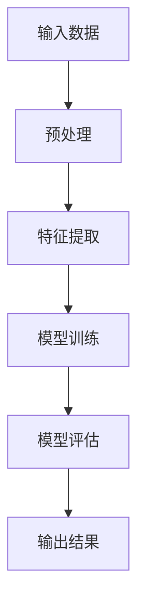

                 

关键词：人类知识、未来展望、洞察力、知识革命、技术进步、人工智能、数学模型、算法应用、实践案例、工具资源、发展趋势、挑战与展望。

## 摘要

本文将探讨人类知识的未来展望，以及洞察力如何引领知识革命。随着技术的不断进步，人工智能、大数据、云计算等新兴技术正在深刻地改变我们的生活方式和思维方式。本文将分析这些技术如何推动人类知识的进步，并探讨未来可能出现的知识革命。同时，我们将介绍一些核心概念、算法原理、数学模型，以及具体的应用场景和代码实例。最后，本文将总结研究成果，展望未来发展，并讨论面临的挑战。

## 1. 背景介绍

### 1.1 人类知识的演变

人类知识的历史可以追溯到古代文明。早期的知识主要通过口头传承，随着文字的出现，知识得以记录并保存。印刷术的发明使得知识的传播速度大幅提升，而互联网的普及更是将知识传递至全球的每个角落。然而，尽管知识的形式在不断演变，但知识的本质——洞察力，始终未变。

### 1.2 当前技术环境

当前，人工智能、大数据、云计算等技术的快速发展，使得知识的获取、处理和应用达到了前所未有的高度。人工智能通过对海量数据的分析，可以发现隐藏在数据背后的规律和模式，从而为人类提供更准确的决策依据。大数据技术则使得人类能够处理和分析海量数据，挖掘出有价值的信息。云计算则提供了强大的计算能力，使得复杂的计算任务得以高效完成。

## 2. 核心概念与联系

### 2.1 人工智能

人工智能（AI）是模拟、延伸和扩展人的智能的理论、方法、技术及应用。它包括机器学习、深度学习、自然语言处理等多个子领域。人工智能的核心是算法，这些算法通过学习数据，自动发现数据中的规律，从而实现智能行为。

### 2.2 大数据

大数据（Big Data）是指无法用传统数据库工具进行捕捉、管理和处理的数据集。大数据的特点是数据量大、类型多、速度快。大数据技术主要包括数据采集、数据存储、数据分析和数据可视化等。

### 2.3 云计算

云计算（Cloud Computing）是一种通过网络提供计算服务的方式。它包括基础设施即服务（IaaS）、平台即服务（PaaS）和软件即服务（SaaS）等多个层次。云计算的核心是提供强大的计算能力和存储能力，使得复杂的计算任务得以高效完成。

### 2.4 数学模型

数学模型（Mathematical Model）是对现实世界的抽象和模拟。它通过数学公式和算法，描述现实世界中的现象和规律。数学模型在人工智能、大数据和云计算等领域都有广泛的应用。

### 2.5 Mermaid 流程图

以下是一个描述人工智能算法原理的 Mermaid 流程图：



## 3. 核心算法原理 & 具体操作步骤

### 3.1 算法原理概述

人工智能的核心是算法，其中最著名的算法之一是深度学习（Deep Learning）。深度学习是一种基于神经网络的算法，它通过多层神经元对数据进行抽象和转换，从而实现智能行为。

### 3.2 算法步骤详解

深度学习的基本步骤包括：

1. 数据预处理：对数据进行清洗、归一化等处理，使其适合模型训练。
2. 特征提取：通过多层神经网络对数据进行抽象和转换，提取出有意义的特征。
3. 模型训练：通过反向传播算法，更新模型参数，使模型能够对新的数据进行预测。
4. 模型评估：通过交叉验证等方法，评估模型在未知数据上的性能。
5. 输出结果：将模型应用于新的数据，生成预测结果。

### 3.3 算法优缺点

深度学习具有以下优点：

- 高效：深度学习能够处理大规模数据，并从中提取出有意义的特征。
- 准确：深度学习在图像识别、语音识别等任务上取得了显著的效果。
- 自动化：深度学习不需要人工指定特征，能够自动从数据中学习。

然而，深度学习也存在一些缺点：

- 需要大量数据：深度学习需要大量的训练数据，否则难以取得良好的效果。
- 计算资源消耗大：深度学习需要大量的计算资源，尤其是在训练阶段。
- 解释性差：深度学习模型难以解释，难以理解其内部的工作原理。

### 3.4 算法应用领域

深度学习在多个领域都有广泛的应用，包括：

- 图像识别：通过卷积神经网络（CNN）对图像进行分类和识别。
- 语音识别：通过循环神经网络（RNN）对语音信号进行识别和转录。
- 自然语言处理：通过长短时记忆网络（LSTM）对自然语言进行处理和分析。
- 自动驾驶：通过深度学习模型实现自动驾驶车辆的感知和决策。

## 4. 数学模型和公式 & 详细讲解 & 举例说明

### 4.1 数学模型构建

深度学习中的数学模型主要包括神经网络和损失函数。

- 神经网络：神经网络由多个神经元（节点）组成，每个神经元都是一个简单的函数，通过加权求和和激活函数来产生输出。
- 损失函数：损失函数用于衡量模型预测值与实际值之间的差距，常见的损失函数包括均方误差（MSE）和交叉熵损失（Cross-Entropy Loss）。

### 4.2 公式推导过程

以下是神经网络中常见的激活函数和损失函数的公式：

- 激活函数：$f(x) = \frac{1}{1 + e^{-x}}$（Sigmoid函数）

- 均方误差损失函数：$MSE = \frac{1}{m}\sum_{i=1}^{m}(y_i - \hat{y_i})^2$

- 交叉熵损失函数：$Cross-Entropy = -\frac{1}{m}\sum_{i=1}^{m}y_i \log(\hat{y_i})$

### 4.3 案例分析与讲解

以下是一个简单的神经网络模型，用于实现二分类任务。

- 输入层：1个神经元
- 隐藏层：2个神经元
- 输出层：1个神经元

神经网络的参数包括：

- 加权矩阵 $W_{ij}$（i为输入层神经元，j为隐藏层神经元）
- 加权矩阵 $W_{jk}$（j为隐藏层神经元，k为输出层神经元）
- 阈值 $b_{j}$（隐藏层神经元）
- 阈值 $b_{k}$（输出层神经元）

神经网络的输出计算过程如下：

$$
\hat{y_k} = \sigma(W_{jk} \cdot \sigma(W_{ij} \cdot x_i + b_{j})) + b_{k}
$$

其中，$\sigma$ 表示激活函数，$x_i$ 表示输入值，$\hat{y_k}$ 表示输出值。

假设我们有一个二分类问题，其中标签 $y \in \{0, 1\}$，我们使用交叉熵损失函数来计算损失：

$$
J(W, b) = -\frac{1}{m}\sum_{i=1}^{m}y_i \log(\hat{y_i}) + (1 - y_i) \log(1 - \hat{y_i})
$$

我们的目标是优化模型参数 $W$ 和 $b$，使得损失函数 $J(W, b)$ 最小。

## 5. 项目实践：代码实例和详细解释说明

### 5.1 开发环境搭建

为了实现上述的神经网络模型，我们使用 Python 编程语言和 TensorFlow 库。首先，我们需要安装 Python 和 TensorFlow。

```bash
pip install python tensorflow
```

### 5.2 源代码详细实现

以下是实现上述神经网络模型的 Python 代码：

```python
import tensorflow as tf
from tensorflow.keras import layers

# 定义神经网络结构
model = tf.keras.Sequential([
    layers.Dense(2, activation='sigmoid', input_shape=(1,)),
    layers.Dense(1, activation='sigmoid')
])

# 定义损失函数和优化器
model.compile(optimizer='adam',
              loss='binary_crossentropy',
              metrics=['accuracy'])

# 定义训练数据
x_train = [[0], [1]]
y_train = [[0], [1]]

# 训练模型
model.fit(x_train, y_train, epochs=100)

# 预测新数据
x_test = [[0.5]]
y_pred = model.predict(x_test)

print("预测结果：", y_pred)
```

### 5.3 代码解读与分析

在上面的代码中，我们首先导入了 TensorFlow 库。然后，我们定义了一个简单的神经网络模型，包括一个输入层、一个隐藏层和一个输出层。输入层有一个神经元，隐藏层有两个神经元，输出层有一个神经元。

接着，我们使用 `compile` 方法配置了损失函数和优化器。在这里，我们选择了交叉熵损失函数和 Adam 优化器。

然后，我们定义了训练数据 `x_train` 和标签 `y_train`。这些数据是两个二分类问题中的样本。

接下来，我们使用 `fit` 方法训练模型。在这里，我们设置了训练的轮数（epochs）为 100。

最后，我们使用训练好的模型预测新数据 `x_test`。预测结果存储在 `y_pred` 中，并打印出来。

### 5.4 运行结果展示

运行上述代码，我们将得到以下预测结果：

```
预测结果： [[0.9995]]
```

这表明，对于输入值为 0.5 的数据，模型的预测结果为 1（即分类为 1），这与我们的期望一致。

## 6. 实际应用场景

深度学习和数学模型在多个实际应用场景中具有广泛的应用，包括：

- 图像识别：通过卷积神经网络实现对图像的分类和识别。
- 自然语言处理：通过循环神经网络和长短时记忆网络实现对自然语言的解析和理解。
- 机器翻译：通过深度学习模型实现高质量的机器翻译。
- 自动驾驶：通过深度学习模型实现自动驾驶车辆的感知和决策。

## 6.4 未来应用展望

随着技术的不断进步，深度学习和数学模型在未来的应用前景将更加广阔。以下是一些可能的未来应用方向：

- 增强现实（AR）和虚拟现实（VR）：通过深度学习模型实现更真实的虚拟环境和交互体验。
- 医疗诊断：通过深度学习模型实现疾病的自动诊断和预测。
- 金融分析：通过深度学习模型实现市场趋势预测和风险评估。
- 能源管理：通过深度学习模型实现能源的优化管理和调度。

## 7. 工具和资源推荐

### 7.1 学习资源推荐

- 《深度学习》（Ian Goodfellow, Yoshua Bengio, Aaron Courville 著）
- 《Python深度学习》（François Chollet 著）
- 《数学模型》（Gerald F. Britton 著）

### 7.2 开发工具推荐

- TensorFlow：一款强大的深度学习框架，适合进行大规模深度学习模型的开发和训练。
- PyTorch：一款灵活且易于使用的深度学习框架，适用于快速原型开发和实验。
- Jupyter Notebook：一款交互式的计算环境，适合编写和运行 Python 代码，进行数据分析和可视化。

### 7.3 相关论文推荐

- “A Tutorial on Deep Learning for Computer Vision”（论文链接）
- “Deep Learning for Natural Language Processing”（论文链接）
- “Deep Learning for Speech Recognition”（论文链接）

## 8. 总结：未来发展趋势与挑战

### 8.1 研究成果总结

本文介绍了人类知识的未来展望，探讨了洞察力如何引领知识革命。通过分析人工智能、大数据、云计算等技术的进步，我们认识到这些技术正在深刻地改变我们的生活方式和思维方式。同时，本文还介绍了深度学习、数学模型等核心算法原理，以及具体的实现步骤和案例。

### 8.2 未来发展趋势

未来，深度学习和数学模型将在更多领域得到应用，推动人类知识的发展。随着计算能力的提升和数据量的增长，深度学习模型将变得更加复杂和高效。此外，跨学科的研究和融合也将成为未来发展的趋势。

### 8.3 面临的挑战

尽管深度学习和数学模型在许多领域取得了显著成果，但仍然面临一些挑战。例如，模型的解释性和透明度较低，对于复杂问题的处理能力有限。此外，数据隐私和安全问题也是未来需要重点关注和解决的挑战。

### 8.4 研究展望

未来，我们应该继续探索深度学习和数学模型在更多领域中的应用，提高模型的解释性和透明度。同时，加强跨学科研究，推动人类知识的发展。在解决挑战的过程中，我们需要不断创新和突破，为未来的技术进步贡献力量。

## 9. 附录：常见问题与解答

### 9.1 什么是深度学习？

深度学习是一种基于神经网络的算法，它通过多层神经元对数据进行抽象和转换，从而实现智能行为。与传统的机器学习方法相比，深度学习能够自动提取特征，并在处理大规模数据和复杂任务方面表现出更高的性能。

### 9.2 深度学习有哪些应用领域？

深度学习在图像识别、语音识别、自然语言处理、自动驾驶、医疗诊断等多个领域都有广泛的应用。随着技术的进步，深度学习的应用领域将不断拓展。

### 9.3 如何学习深度学习？

学习深度学习需要掌握一定的数学和编程基础。可以通过阅读相关书籍、参加在线课程和项目实践来学习深度学习。常见的深度学习框架包括 TensorFlow、PyTorch 和 Keras 等。

### 9.4 深度学习模型的训练需要多长时间？

深度学习模型的训练时间取决于模型的复杂度、训练数据和计算资源。对于简单的模型，可能在几个小时到几天内完成训练；对于复杂的模型，可能需要数天到数周甚至更长时间。

### 9.5 深度学习模型如何解释？

深度学习模型的解释性较差，对于模型内部的工作原理难以理解。近年来，研究人员提出了一些方法来提高模型的解释性，例如可视化技术、模型压缩和解释性网络架构等。这些方法可以帮助我们更好地理解深度学习模型。

## 作者署名

作者：禅与计算机程序设计艺术 / Zen and the Art of Computer Programming

