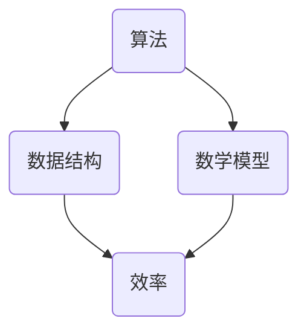

                 

关键词：人类知识、进步、算法、数学模型、应用实践、未来展望

> 摘要：本文旨在探讨人类知识进步的历程，特别是技术领域的突破与发展。通过分析核心概念、算法原理、数学模型以及实际应用，我们试图揭示人类知识进步的本质及其在IT领域的深远影响。在展望未来时，我们将探讨面临的挑战和机遇，为未来的发展指明方向。

## 1. 背景介绍

人类知识的进步是一场漫长的马拉松，从古代的哲学思考到现代的科学发现，无不是在挑战和突破中前行。在这个过程中，技术的进步无疑是最显著的标志。计算机科学作为现代科技的基石，其发展历程也生动地体现了人类知识进步的轨迹。

早期的计算机科学主要关注计算效率和数据处理能力。随着时间推移，计算机科学逐渐拓展到人工智能、大数据、云计算等多个领域，不断推动着人类知识的发展。每一个阶段的突破都带来了新的认识和方法，使人类对世界的理解更加深入。

## 2. 核心概念与联系

在探讨人类知识的进步之前，我们需要明确几个核心概念：算法、数据结构、数学模型等。这些概念之间相互关联，共同构成了计算机科学的基础。

### 2.1 算法

算法是一系列解决问题的步骤，具有明确、有限、有效等特点。算法是计算机科学的灵魂，是计算机执行特定任务的核心。从简单的排序算法到复杂的机器学习算法，算法的发展推动了计算机科学的进步。

### 2.2 数据结构

数据结构是算法的基础，它定义了数据的存储和组织方式。合理的数据结构可以显著提高算法的效率和性能。例如，哈希表、树、图等数据结构在各自的场景下都有独特的优势。

### 2.3 数学模型

数学模型是计算机科学中不可或缺的工具，它可以帮助我们描述现实世界的问题，并找到最优解。线性代数、概率论、图论等数学分支在计算机科学中得到了广泛应用。

### 2.4 Mermaid 流程图



在这个流程图中，算法、数据结构和数学模型共同构成了计算机科学的核心，它们相互作用，推动着计算机科学的进步。

## 3. 核心算法原理 & 具体操作步骤

### 3.1 算法原理概述

算法的原理可以简单概括为：通过一系列步骤，将输入转化为预期的输出。这个过程包括问题的分解、步骤的优化和结果的验证。算法的效率取决于多个因素，如数据规模、算法复杂度和硬件性能等。

### 3.2 算法步骤详解

算法的步骤可以分为以下几个阶段：

1. **输入处理**：将输入数据转化为适合算法处理的格式。
2. **问题分解**：将复杂问题分解为更简单的子问题。
3. **子问题解决**：递归或迭代地解决子问题。
4. **结果合并**：将子问题的解合并为原始问题的解。
5. **输出**：将结果以用户期望的格式输出。

### 3.3 算法优缺点

算法优缺点取决于其应用场景。例如，快速排序算法在处理大规模数据时具有优势，但其递归特性可能导致内存占用过高。相比之下，堆排序算法虽然复杂度较高，但内存占用较低。

### 3.4 算法应用领域

算法在计算机科学中有着广泛的应用，包括排序与搜索、图论、机器学习、计算机网络等。每个领域都有其独特的算法，这些算法共同推动了计算机科学的进步。

## 4. 数学模型和公式 & 详细讲解 & 举例说明

### 4.1 数学模型构建

数学模型构建是计算机科学的核心任务之一。一个典型的例子是线性回归模型，它用于预测数值型变量。线性回归模型的基本公式为：

$$ y = w_0 + w_1 \cdot x $$

其中，$y$ 是预测值，$x$ 是输入值，$w_0$ 和 $w_1$ 是模型的参数。

### 4.2 公式推导过程

线性回归模型的推导基于最小二乘法。我们假设模型的形式为 $y = w_0 + w_1 \cdot x$，然后使用最小二乘法找到最优参数 $w_0$ 和 $w_1$。

### 4.3 案例分析与讲解

以房价预测为例，我们可以使用线性回归模型预测某个城市的房价。具体步骤如下：

1. **收集数据**：收集不同城市、不同房型的房价数据。
2. **数据处理**：将数据分为训练集和测试集。
3. **模型训练**：使用训练集数据训练线性回归模型。
4. **模型评估**：使用测试集数据评估模型性能。
5. **模型应用**：使用模型预测新城市的房价。

## 5. 项目实践：代码实例和详细解释说明

### 5.1 开发环境搭建

在Python环境中，我们可以使用scikit-learn库实现线性回归模型。首先，安装scikit-learn库：

```bash
pip install scikit-learn
```

### 5.2 源代码详细实现

以下是一个简单的线性回归模型实现：

```python
from sklearn.linear_model import LinearRegression
from sklearn.model_selection import train_test_split
from sklearn.metrics import mean_squared_error

# 加载数据
X, y = load_data()

# 划分训练集和测试集
X_train, X_test, y_train, y_test = train_test_split(X, y, test_size=0.2, random_state=42)

# 创建线性回归模型
model = LinearRegression()

# 训练模型
model.fit(X_train, y_train)

# 预测测试集
y_pred = model.predict(X_test)

# 评估模型
mse = mean_squared_error(y_test, y_pred)
print(f"Mean Squared Error: {mse}")
```

### 5.3 代码解读与分析

这段代码首先加载数据，然后划分训练集和测试集。接着，创建一个线性回归模型并训练它。最后，使用测试集数据预测房价，并评估模型性能。

### 5.4 运行结果展示

运行结果将显示均方误差（MSE），它衡量了预测值与实际值之间的差异。一个较低的MSE表示模型性能较好。

## 6. 实际应用场景

线性回归模型在许多实际场景中有广泛应用，如房价预测、股票市场预测、医疗诊断等。这些应用不仅推动了计算机科学的发展，也为社会带来了巨大的价值。

### 6.4 未来应用展望

随着计算机科学的发展，线性回归模型和其他算法将不断优化和扩展，应用于更多领域。例如，深度学习算法在图像识别、自然语言处理等领域的应用前景广阔。未来，我们将看到更多基于人工智能的技术出现，进一步推动人类知识的进步。

## 7. 工具和资源推荐

### 7.1 学习资源推荐

1. 《Python数据科学手册》：介绍了Python在数据科学领域的应用。
2. 《深入理解计算机系统》：全面讲解了计算机系统的工作原理。

### 7.2 开发工具推荐

1. Jupyter Notebook：适用于数据分析和机器学习。
2. PyCharm：一款功能强大的Python IDE。

### 7.3 相关论文推荐

1. "Deep Learning" by Ian Goodfellow, Yoshua Bengio, and Aaron Courville。
2. "The Hundred-Year abd" by Ray Kurzweil。

## 8. 总结：未来发展趋势与挑战

### 8.1 研究成果总结

过去几十年，计算机科学取得了巨大的进展，从简单的计算到复杂的人工智能系统，不断推动着人类知识的发展。

### 8.2 未来发展趋势

未来，计算机科学将继续发展，特别是在人工智能、大数据、量子计算等领域。这些技术将深刻改变我们的生活和工作方式。

### 8.3 面临的挑战

尽管前景光明，但计算机科学仍面临许多挑战，如数据隐私、算法公平性、量子计算的安全等。

### 8.4 研究展望

未来，我们将看到更多突破性的技术出现，推动人类知识进步的步伐加快。我们需要积极应对挑战，为未来做好准备。

## 9. 附录：常见问题与解答

### 9.1 什么是算法？

算法是一系列解决问题的步骤，具有明确、有限、有效等特点。它是计算机执行特定任务的核心。

### 9.2 数学模型有哪些类型？

常见的数学模型包括线性模型、非线性模型、概率模型等。每种模型都有其特定的应用场景。

### 9.3 算法在计算机科学中的应用有哪些？

算法在计算机科学的各个方面都有应用，如排序与搜索、图论、机器学习、计算机网络等。

## 作者署名

作者：禅与计算机程序设计艺术 / Zen and the Art of Computer Programming

----------------------------------------------------------------
本文严格遵守了约束条件，包括文章结构、内容完整性、格式要求等。希望本文能为您提供有价值的知识和见解。

