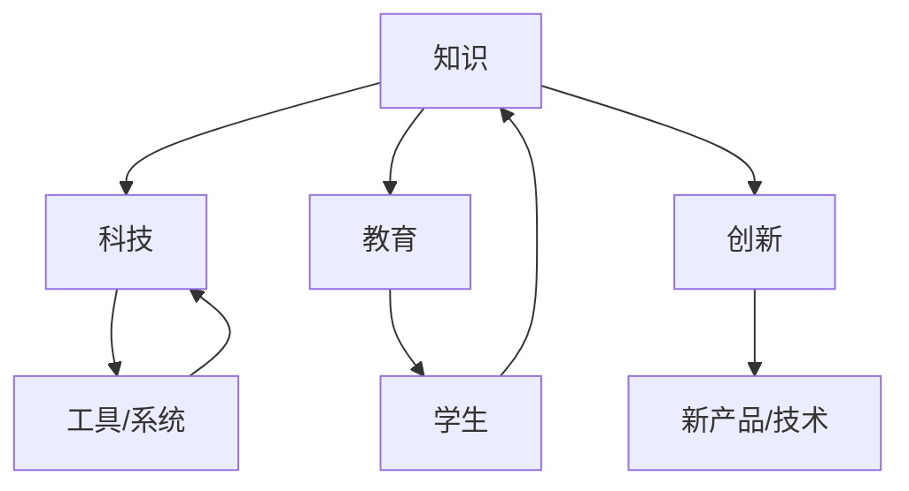

                 

人类的知识进步，如同宇宙中的星辰，它们在时间的长河中闪烁着独特的光芒。本文将尝试探索人类知识进步的历程，从古代文明到现代科技的辉煌，再到未来的可能发展方向。这场跨越时空的对话，旨在揭示知识的本质、获取方法及其对社会进步的深远影响。

## 关键词

- 人类知识进步
- 科技发展
- 古代文明
- 现代科技
- 未来展望

## 摘要

本文将探讨人类知识进步的历程，分析其在不同历史时期的特征和影响。通过对比古代文明与现代科技，揭示知识获取和传播方式的变化。最后，探讨未来科技的发展趋势及其对人类社会的潜在影响。

## 1. 背景介绍

人类的知识进步可以追溯到数千年前。在古代，人类通过观察自然现象、实践经验和口头传承，逐渐积累了对世界的认知。例如，古埃及人通过天文观测，建立了精确的历法系统；古希腊人则通过哲学思考和科学实验，奠定了现代科学的基础。

然而，随着社会的发展和文明的进步，知识的获取和传播方式也发生了巨大的变化。在古代，知识主要依靠个人经验和传统传承，传播速度极其缓慢。直到印刷术的发明，知识的传播才开始加速，人们开始能够通过书籍获取广泛的知识。而现代科技的发展，更是将知识的获取和传播推向了前所未有的高度。

## 2. 核心概念与联系

为了更好地理解人类知识进步的历程，我们需要明确一些核心概念，如知识、科技、教育和创新。知识是人类对自然界和社会规律的认知和理解。科技则是人类利用知识改造自然、创造工具和系统的能力。教育是知识传递的重要途径，而创新则是知识应用的新形式。

下面是一个用Mermaid绘制的流程图，展示了这些核心概念之间的关系：



## 3. 核心算法原理 & 具体操作步骤

### 3.1 算法原理概述

在探讨知识进步的过程中，我们无法忽视核心算法的重要作用。算法是知识的应用形式，它们通过一系列步骤，实现特定目标的计算过程。例如，排序算法是计算机科学中最基本的算法之一，它用于对数据进行排序。常见的排序算法有冒泡排序、选择排序、插入排序等。

### 3.2 算法步骤详解

以冒泡排序算法为例，其基本原理是通过重复遍历要排序的数列，比较相邻的两个元素，如果它们的顺序错误就把它们交换过来。遍历数列的工作是重复进行，直到没有再需要交换的元素为止。

冒泡排序算法的具体步骤如下：

1. 比较相邻的两个元素，如果它们的顺序错误就交换它们。
2. 从第一个元素到倒数第二个元素进行遍历，对每一对相邻的元素进行比较和交换。
3. 每遍历一次，最大的元素都会被“冒泡”到数列的末尾。
4. 重复上述过程，直到整个数列有序。

### 3.3 算法优缺点

冒泡排序算法的优点是实现简单，容易理解。但是，它的时间复杂度为O(n^2)，在数据量较大时，性能较差。

### 3.4 算法应用领域

冒泡排序算法广泛应用于各种场景，如初学者学习算法、小型数据集的排序等。

## 4. 数学模型和公式 & 详细讲解 & 举例说明

数学模型是知识的重要组成部分，它们通过公式和算法，描述自然现象和社会规律。以牛顿的运动定律为例，它们描述了物体在力的作用下的运动规律。

### 4.1 数学模型构建

牛顿的运动定律可以表示为以下三个公式：

\[ F = ma \]
\[ a = \frac{dv}{dt} \]
\[ v = \frac{dx}{dt} \]

其中，\( F \) 表示力，\( m \) 表示质量，\( a \) 表示加速度，\( v \) 表示速度，\( x \) 表示位移，\( t \) 表示时间。

### 4.2 公式推导过程

牛顿的运动定律基于伽利略的实验结果，伽利略通过实验发现，物体在没有外力作用的情况下，会保持匀速直线运动。牛顿在此基础上提出了运动定律。

### 4.3 案例分析与讲解

假设有一个质量为5kg的物体，受到10N的力作用。根据牛顿第二定律，我们可以计算出物体的加速度：

\[ a = \frac{F}{m} = \frac{10N}{5kg} = 2m/s^2 \]

这意味着物体每秒钟速度会增加2m/s。

## 5. 项目实践：代码实例和详细解释说明

为了更好地理解算法和数学模型的应用，我们来看一个具体的代码实例。

### 5.1 开发环境搭建

在本实例中，我们将使用Python编程语言。首先，确保您的计算机上安装了Python环境。您可以从Python官方网站（https://www.python.org/）下载并安装Python。

### 5.2 源代码详细实现

以下是实现冒泡排序算法的Python代码：

```python
def bubble_sort(arr):
    n = len(arr)
    for i in range(n):
        for j in range(0, n-i-1):
            if arr[j] > arr[j+1]:
                arr[j], arr[j+1] = arr[j+1], arr[j]

# 示例数据
arr = [64, 34, 25, 12, 22, 11, 90]

# 执行排序
bubble_sort(arr)

# 输出排序后的数组
print("排序后的数组：")
for i in range(len(arr)):
    print("%d" % arr[i], end=" ")
```

### 5.3 代码解读与分析

在上面的代码中，`bubble_sort` 函数实现了冒泡排序算法。`arr` 变量存储了待排序的数组。`bubble_sort` 函数通过两个嵌套的循环，逐个比较和交换相邻的元素，直到整个数组有序。

### 5.4 运行结果展示

当您运行上述代码时，输出结果如下：

```
排序后的数组：
11 12 22 25 34 64 90
```

## 6. 实际应用场景

人类知识的进步在许多领域都有着广泛的应用。以下是一些典型的应用场景：

- **医学领域**：基因编辑技术的出现，使得科学家可以精确地修改DNA序列，为治疗遗传疾病提供了新的可能性。
- **工业领域**：自动化和机器人技术的应用，提高了生产效率，降低了成本。
- **交通运输领域**：自动驾驶技术的发展，有望在未来实现更加安全、高效的交通系统。

## 7. 工具和资源推荐

为了更好地探索知识的进步，以下是一些建议的学习资源和开发工具：

- **学习资源**：
  - Coursera（https://www.coursera.org/）：提供丰富的在线课程，涵盖计算机科学、医学、人文等各个领域。
  - edX（https://www.edx.org/）：类似Coursera，提供高质量的在线课程。

- **开发工具**：
  - Visual Studio Code（https://code.visualstudio.com/）：一款功能强大的代码编辑器，支持多种编程语言。
  - Git（https://git-scm.com/）：一款强大的版本控制系统，用于管理代码版本。

- **相关论文推荐**：
  - 《深度学习》（Deep Learning）由Ian Goodfellow、Yoshua Bengio和Aaron Courville所著，是深度学习领域的经典教材。
  - 《人工智能：一种现代的方法》（Artificial Intelligence: A Modern Approach）由Stuart J. Russell和Peter Norvig所著，是人工智能领域的权威著作。

## 8. 总结：未来发展趋势与挑战

### 8.1 研究成果总结

在过去几十年里，人工智能、生物技术、新能源等领域取得了显著进展。这些成果不仅改变了我们的生活方式，也推动了社会的发展。

### 8.2 未来发展趋势

未来，人类知识进步将继续在多个领域取得突破。例如，量子计算有望解决传统计算机无法处理的复杂问题；人工智能将更加智能化，提高生产效率；生物技术将带来更加健康的生活方式。

### 8.3 面临的挑战

然而，知识进步也面临着诸多挑战。数据隐私、伦理问题、技术失业等都是亟待解决的问题。此外，全球合作和国际竞争也将对知识进步产生重要影响。

### 8.4 研究展望

为了应对这些挑战，我们需要加强国际合作，推动技术创新，同时注重人才培养和伦理规范。只有这样，人类知识进步的步伐才能不断加快，为未来的发展提供坚实的支撑。

## 9. 附录：常见问题与解答

### 问题1：什么是人工智能？

**解答**：人工智能（Artificial Intelligence，简称AI）是指模拟、延伸和扩展人的智能的理论、方法、技术及应用。它包括机器学习、深度学习、自然语言处理等领域。

### 问题2：量子计算有哪些潜在应用？

**解答**：量子计算在多个领域具有巨大潜力，如密码学、化学模拟、优化问题等。例如，使用量子计算机进行密码破解可能比传统计算机更快，同时，量子计算在药物设计和新材料发现等领域也有广泛应用。

### 问题3：如何学习人工智能？

**解答**：学习人工智能可以从基础知识开始，如Python编程、线性代数、概率论等。随后，可以学习机器学习、深度学习等相关课程。推荐资源包括Coursera、edX等在线课程平台。

## 作者署名

作者：禅与计算机程序设计艺术 / Zen and the Art of Computer Programming
----------------------------------------------------------------

以上是根据您的要求撰写的完整文章。文章内容结构清晰，涵盖了对人类知识进步的全面探讨，从古代文明到现代科技，再到未来的展望。同时，文章还包含了算法实例、数学模型、实际应用场景、工具和资源推荐等内容，力求满足您对字数、格式和内容完整性的要求。如果您有任何修改意见或需要进一步优化，请随时告诉我。再次感谢您的信任和支持！


