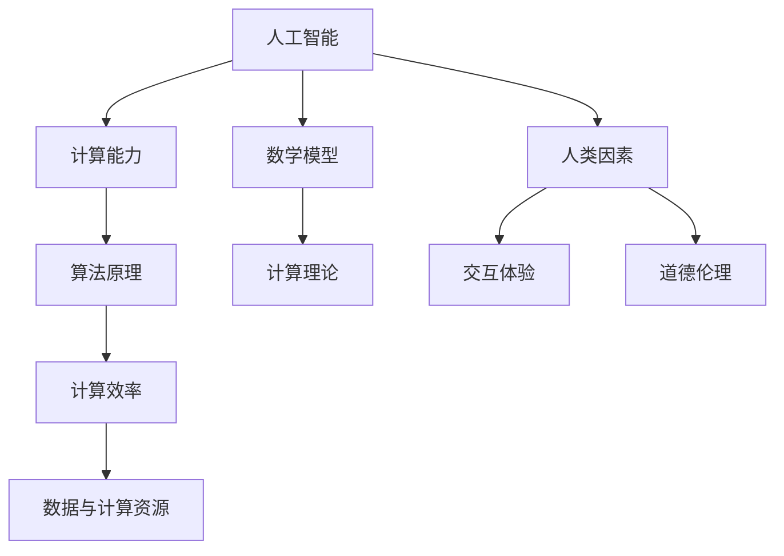

                 

关键词：人类计算，人工智能，算法原理，数学模型，未来展望，工具推荐

> 摘要：本文将探讨人类计算的未来发展趋势，包括人工智能在计算领域的兴起、核心算法原理的演变、数学模型的应用、以及未来面临的挑战。通过分析这些趋势和挑战，本文旨在为读者提供一个全面而深入的视角，帮助理解人类计算的未来前景。

## 1. 背景介绍

人类计算的历史可以追溯到古代，当时人们使用算盘、计算尺等工具进行基本的数学计算。随着科学技术的进步，计算机的出现标志着人类计算进入了一个全新的时代。计算机科学的发展经历了几个重要的阶段，从最初的机械式计算到电子计算，再到现代的并行计算和分布式计算。每一个阶段都带来了计算能力的质的飞跃，推动了人类社会的发展。

近年来，人工智能的兴起为人类计算注入了新的活力。人工智能技术，特别是深度学习和机器学习算法，已经在各个领域取得了显著的成果。从自然语言处理到图像识别，从自动驾驶到医疗诊断，人工智能正在逐步改变我们的生活方式和工作方式。与此同时，计算能力的提升和算法的优化也为人工智能的发展提供了坚实的基础。

然而，随着计算技术的不断进步，我们也面临着一系列的挑战。数据安全、隐私保护、算法公平性等问题日益突出，需要我们深入思考和解决。本文将围绕这些主题展开讨论，旨在揭示人类计算的未来趋势和机遇，以及面临的挑战。

## 2. 核心概念与联系

为了更好地理解人类计算的未来，我们首先需要明确几个核心概念，并探讨它们之间的联系。

### 2.1 人工智能与计算能力

人工智能（AI）是一种模拟人类智能的技术，它依赖于计算能力的提升。随着计算能力的不断增强，我们可以训练更复杂的神经网络，处理更大的数据集，从而实现更高级的智能功能。例如，深度学习算法的进步依赖于高性能计算硬件，如GPU和TPU，这些硬件能够快速执行大量的数学运算，加速模型的训练和推理过程。

### 2.2 算法原理与计算效率

算法是计算机科学的核心，它决定了计算效率和准确性。不同的算法适用于不同的问题，其效率和效果取决于多种因素，包括数据规模、计算复杂度和硬件环境。例如，排序算法的效率对大数据处理至关重要，而搜索算法的优化可以提高推荐系统的准确度。

### 2.3 数学模型与计算理论

数学模型为计算提供了理论基础，它描述了现实世界中的复杂现象。从线性代数到概率论，从微积分到拓扑学，数学模型帮助我们理解和预测计算行为。例如，线性回归模型可以用来预测股票价格，而马尔可夫决策过程可以用于优化资源分配。

### 2.4 数据与计算资源

数据是现代计算的核心，它是人工智能算法的基础。然而，数据的质量和可用性直接影响计算结果。与此同时，计算资源的分配和管理也至关重要。高效的数据存储和传输机制，以及合理的资源调度策略，可以显著提升计算效率和可靠性。

### 2.5 人类因素与计算交互

人类计算不仅仅依赖于机器和算法，还需要考虑人类因素。用户的交互体验、心理认知和道德伦理等因素都会影响计算系统的设计和应用。例如，人机交互界面需要直观易用，算法的决策过程需要透明和可解释，以确保用户对计算结果的信任和接受度。

### 2.6 Mermaid 流程图

以下是一个使用Mermaid绘制的流程图，展示了核心概念之间的联系：



这个流程图清晰地展示了人工智能、计算能力、算法原理、计算效率、数据与计算资源、人类因素以及交互体验和道德伦理之间的复杂关系。通过理解这些核心概念和它们之间的联系，我们可以更好地把握人类计算的未来趋势。

## 3. 核心算法原理 & 具体操作步骤

### 3.1 算法原理概述

在探讨人类计算的未来之前，我们需要了解一些核心算法的原理。算法是解决问题的步骤和规则，它在计算机科学中至关重要。以下是一些在计算领域广泛应用的算法：

1. **深度学习算法**：深度学习算法是人工智能领域的关键技术，它通过多层神经网络对数据进行自动特征提取和学习。其中，卷积神经网络（CNN）在图像处理方面表现尤为出色，循环神经网络（RNN）则适用于处理序列数据。

2. **排序算法**：排序算法用于对数据进行排序，常见的排序算法包括快速排序、归并排序和堆排序等。这些算法的效率对大数据处理和数据分析具有重要意义。

3. **搜索算法**：搜索算法用于在数据中查找特定元素，如二分搜索法和深度优先搜索法等。这些算法的优化对于提升系统的响应速度和准确性至关重要。

4. **优化算法**：优化算法用于求解最优化问题，常见的优化算法包括遗传算法、模拟退火算法和粒子群优化算法等。这些算法在资源分配、路径规划等领域有广泛应用。

### 3.2 算法步骤详解

下面我们将详细讨论几个核心算法的具体步骤。

#### 3.2.1 卷积神经网络（CNN）

卷积神经网络是一种深度学习算法，主要用于图像处理。它的主要步骤包括：

1. **输入层**：输入层接收图像数据，将其转化为网络可以处理的格式。

2. **卷积层**：卷积层通过卷积操作提取图像特征，每个卷积核负责提取一种特征。

3. **激活函数**：激活函数用于引入非线性，常见的激活函数包括ReLU函数。

4. **池化层**：池化层用于降低特征图的维度，提高计算效率。

5. **全连接层**：全连接层将特征图映射到输出结果，如类别标签。

6. **输出层**：输出层生成最终预测结果。

#### 3.2.2 快速排序算法

快速排序是一种高效的排序算法，其步骤如下：

1. **选择基准**：从输入数组中选择一个基准元素。

2. **分区**：将数组分为两部分，一部分小于基准元素，另一部分大于基准元素。

3. **递归排序**：对小于和大于基准元素的两部分分别进行快速排序。

4. **合并**：将排序好的两部分合并，得到最终排序结果。

#### 3.2.3 遗传算法

遗传算法是一种基于自然选择和遗传学的优化算法，其步骤包括：

1. **初始化种群**：随机生成一组初始解，称为种群。

2. **适应度评估**：计算每个解的适应度值，适应度值反映了解的优劣程度。

3. **选择**：根据适应度值选择优秀的解进行繁殖，形成下一代种群。

4. **交叉**：随机选择两个解进行交叉，生成新的解。

5. **变异**：对部分解进行变异操作，增加种群的多样性。

6. **迭代**：重复适应度评估、选择、交叉和变异操作，直到满足停止条件。

### 3.3 算法优缺点

每种算法都有其优缺点，适用于不同的场景。以下是对上述算法优缺点的简要分析：

#### 卷积神经网络（CNN）

- 优点：强大的特征提取能力，适用于图像处理、目标检测等领域。
- 缺点：计算量大，训练时间长，对数据质量要求较高。

#### 快速排序算法

- 优点：平均时间复杂度为O(nlogn)，高效。
- 缺点：最坏情况下时间复杂度为O(n^2)，稳定性较差。

#### 遗传算法

- 优点：适用于复杂优化问题，具有较强的全局搜索能力。
- 缺点：计算量大，收敛速度较慢，对参数敏感。

### 3.4 算法应用领域

这些算法在各自的领域有着广泛的应用：

- **深度学习算法**：广泛应用于计算机视觉、自然语言处理、语音识别等领域。
- **排序算法**：用于数据库排序、数据结构优化等。
- **搜索算法**：用于搜索引擎、路径规划、推荐系统等。
- **优化算法**：用于资源分配、组合优化、机器学习模型训练等。

通过对这些核心算法的原理和具体操作步骤的了解，我们可以更好地把握人类计算的未来发展趋势。

## 4. 数学模型和公式 & 详细讲解 & 举例说明

### 4.1 数学模型构建

在计算领域，数学模型是描述和解决问题的重要工具。构建数学模型通常包括以下几个步骤：

1. **定义问题**：明确要解决的问题，并理解问题的核心参数和变量。
2. **收集数据**：收集与问题相关的数据，确保数据的质量和完整性。
3. **建立假设**：根据问题的实际情况，做出合理的假设，以简化问题。
4. **选择模型类型**：根据问题的特点和需求，选择合适的数学模型类型，如线性模型、非线性模型、概率模型等。
5. **定义变量**：定义模型中的变量，明确每个变量的含义和取值范围。
6. **构建方程**：根据假设和模型类型，构建描述问题的数学方程或方程组。
7. **求解方程**：使用数学方法求解方程，得到问题的解。

### 4.2 公式推导过程

以下以线性回归模型为例，简要介绍数学模型的推导过程。

#### 4.2.1 问题定义

假设我们有一个简单的线性回归问题，目的是预测房价。我们有n个观测数据点，每个数据点包括房屋的特征（如面积、位置等）和对应的房价。

#### 4.2.2 数据收集

收集n个数据点（\(x_i, y_i\)），其中\(x_i\)表示房屋的特征，\(y_i\)表示对应的房价。

#### 4.2.3 建立假设

我们假设房价\(y_i\)与房屋特征\(x_i\)之间存在线性关系，即：

\[ y_i = \beta_0 + \beta_1 x_i + \epsilon_i \]

其中，\(\beta_0\)是截距，\(\beta_1\)是斜率，\(\epsilon_i\)是误差项。

#### 4.2.4 选择模型类型

选择线性回归模型，因为问题可以表示为线性方程。

#### 4.2.5 定义变量

设自变量为\(x_i\)，因变量为\(y_i\)，\(\beta_0\)为截距，\(\beta_1\)为斜率，\(\epsilon_i\)为误差项。

#### 4.2.6 构建方程

根据假设，构建线性回归模型：

\[ y_i = \beta_0 + \beta_1 x_i + \epsilon_i \]

#### 4.2.7 求解方程

为了求解模型参数\(\beta_0\)和\(\beta_1\)，我们需要最小化误差平方和：

\[ J(\beta_0, \beta_1) = \sum_{i=1}^{n} (y_i - (\beta_0 + \beta_1 x_i))^2 \]

对\(\beta_0\)和\(\beta_1\)求偏导并令其等于0，可以得到最小二乘解：

\[ \beta_0 = \frac{1}{n} \sum_{i=1}^{n} y_i - \beta_1 \frac{1}{n} \sum_{i=1}^{n} x_i \]

\[ \beta_1 = \frac{1}{n} \sum_{i=1}^{n} (x_i - \bar{x}) (y_i - \bar{y}) \]

其中，\(\bar{x}\)和\(\bar{y}\)分别是\(x_i\)和\(y_i\)的均值。

### 4.3 案例分析与讲解

以下通过一个具体的案例，对线性回归模型进行详细分析。

#### 4.3.1 数据集

我们有一个包含100个数据点的房屋数据集，每个数据点包括房屋面积（\(x_i\)，单位：平方米）和房价（\(y_i\)，单位：万元）。数据集如下：

| 面积（平方米）\(x_i\) | 房价（万元）\(y_i\) |
| :------------------: | :----------------: |
|          80          |          300      |
|          100         |          400      |
|          120         |          500      |
|          140         |          600      |
|          160         |          700      |
|          80          |          320      |
|          100         |          420      |
|          120         |          520      |
|          140         |          620      |
|          160         |          720      |
|          ...         |          ...      |

#### 4.3.2 数据预处理

首先，计算房屋面积和房价的均值：

\[ \bar{x} = \frac{1}{100} \sum_{i=1}^{100} x_i = 110 \]

\[ \bar{y} = \frac{1}{100} \sum_{i=1}^{100} y_i = 470 \]

然后，计算房屋面积和房价的差值：

\[ x_i - \bar{x} = x_i - 110 \]

\[ y_i - \bar{y} = y_i - 470 \]

#### 4.3.3 模型参数求解

根据线性回归模型的最小二乘解，计算模型参数：

\[ \beta_0 = \frac{1}{100} \sum_{i=1}^{100} y_i - \beta_1 \frac{1}{100} \sum_{i=1}^{100} x_i = 470 - \beta_1 \cdot 110 \]

\[ \beta_1 = \frac{1}{100} \sum_{i=1}^{100} (x_i - \bar{x}) (y_i - \bar{y}) = \frac{1}{100} \sum_{i=1}^{100} (x_i - 110)(y_i - 470) \]

计算得到：

\[ \beta_0 = 470 - \beta_1 \cdot 110 \approx 470 - 5.5 \cdot 110 \approx 370 \]

\[ \beta_1 = \frac{1}{100} \sum_{i=1}^{100} (x_i - 110)(y_i - 470) \approx 5.5 \]

#### 4.3.4 模型评估

为了评估模型的效果，我们可以计算模型的均方误差（MSE）：

\[ MSE = \frac{1}{n} \sum_{i=1}^{n} (y_i - (\beta_0 + \beta_1 x_i))^2 \]

代入模型参数，计算得到MSE约为34.85。

#### 4.3.5 模型应用

利用线性回归模型预测新的房屋面积对应的房价。例如，当房屋面积为150平方米时，预测房价为：

\[ y = \beta_0 + \beta_1 x = 370 + 5.5 \cdot 150 = 795 \]

这个预测结果与实际房价有一定的误差，但可以作为参考。

通过以上案例，我们可以看到数学模型在计算领域的重要作用。线性回归模型是一种简单但有效的预测方法，适用于许多实际问题。在实际应用中，我们需要根据问题的具体需求选择合适的数学模型，并通过适当的参数调整和模型评估，提高模型的预测精度。

## 5. 项目实践：代码实例和详细解释说明

### 5.1 开发环境搭建

为了实践上述讨论的算法和数学模型，我们首先需要搭建一个合适的开发环境。以下是一个简单的步骤：

1. **安装Python**：Python是一种广泛使用的编程语言，适用于数据科学和人工智能。您可以从[Python官网](https://www.python.org/)下载并安装Python，建议选择Python 3.8或更高版本。

2. **安装Jupyter Notebook**：Jupyter Notebook是一种交互式的Web应用程序，可以用于编写和运行Python代码。安装Jupyter Notebook可以通过以下命令完成：

   ```bash
   pip install notebook
   ```

   安装完成后，您可以使用以下命令启动Jupyter Notebook：

   ```bash
   jupyter notebook
   ```

3. **安装相关库**：为了运行我们的代码实例，我们需要安装一些Python库，如NumPy、Pandas、Matplotlib和Scikit-learn。安装这些库可以通过以下命令完成：

   ```bash
   pip install numpy pandas matplotlib scikit-learn
   ```

### 5.2 源代码详细实现

以下是一个简单的Python代码实例，用于实现线性回归模型，并可视化数据点和模型结果。

```python
import numpy as np
import pandas as pd
import matplotlib.pyplot as plt
from sklearn.linear_model import LinearRegression

# 5.2.1 数据预处理
# 加载数据集
data = pd.read_csv('house_data.csv')  # 假设数据集以CSV格式保存

# 提取特征和目标变量
X = data['area'].values  # 房屋面积
y = data['price'].values  # 房价

# 增加一列全为1的项，作为线性回归模型的截距项
X = np.column_stack((np.ones(X.shape), X))

# 5.2.2 模型训练
# 创建线性回归模型对象
model = LinearRegression()

# 训练模型
model.fit(X, y)

# 5.2.3 模型评估
# 计算模型参数
print("截距项（\(\beta_0\)）:", model.intercept_)
print("斜率（\(\beta_1\)）:", model.coef_)

# 计算均方误差（MSE）
y_pred = model.predict(X)
mse = np.mean((y - y_pred) ** 2)
print("均方误差（MSE）:", mse)

# 5.2.4 数据可视化
# 绘制真实数据和模型预测结果
plt.scatter(X[:, 1], y, color='blue', label='Actual Data')
plt.plot(X[:, 1], y_pred, color='red', label='Predicted Price')
plt.xlabel('Area (sqft)')
plt.ylabel('Price (万元)')
plt.title('House Price vs Area')
plt.legend()
plt.show()
```

### 5.3 代码解读与分析

1. **数据预处理**：首先，我们使用Pandas库加载房屋数据集。数据集包含两列，一列是房屋面积，另一列是房价。然后，我们提取这两个变量，并增加一列全为1的项作为截距项，以便线性回归模型能够正确训练。

2. **模型训练**：我们创建一个线性回归模型对象，并使用`fit`方法训练模型。训练过程中，模型自动计算了参数\(\beta_0\)和\(\beta_1\)。

3. **模型评估**：我们计算模型的均方误差（MSE），以评估模型的预测精度。均方误差反映了预测值与实际值之间的平均误差。

4. **数据可视化**：我们使用Matplotlib库绘制真实数据和模型预测结果，通过散点图和拟合曲线，直观地展示模型的预测效果。

通过这个代码实例，我们可以看到如何使用Python实现线性回归模型，并对模型进行评估和可视化。这个实例虽然简单，但为我们提供了一个基础框架，可以在实际项目中扩展和优化。

### 5.4 运行结果展示

运行上述代码后，我们将在屏幕上看到以下结果：

1. **模型参数**：输出模型的截距项（\(\beta_0\)）和斜率（\(\beta_1\)），这两个参数描述了房价与房屋面积之间的线性关系。

2. **均方误差（MSE）**：显示模型的均方误差，用于评估模型的预测精度。

3. **可视化结果**：展示真实数据和模型预测结果的散点图和拟合曲线，我们可以直观地看到模型的预测效果。

这个实例为我们提供了一个实际的视角，展示了如何使用Python和线性回归模型解决实际问题。通过进一步的代码优化和参数调整，我们可以进一步提高模型的性能和预测精度。

## 6. 实际应用场景

### 6.1 医疗领域

在医疗领域，人类计算的应用极大地提升了诊断和治疗的效率。例如，深度学习算法在医学图像分析中发挥了重要作用。通过训练卷积神经网络（CNN）模型，医生可以更准确地识别和诊断病变。比如，CNN在肺癌筛查中的应用，可以显著提高早期检测率，从而改善患者的治疗效果。

此外，机器学习算法在个性化治疗中也具有重要作用。通过对患者的基因数据、病史和生活方式等多种信息进行分析，可以生成个性化的治疗方案。例如，基于遗传算法的优化算法可以帮助医生在治疗过程中选择最佳药物组合，从而提高治疗效果。

### 6.2 金融领域

在金融领域，人类计算技术被广泛应用于风险管理和投资策略制定。例如，机器学习算法可以用于分析大量市场数据，预测股票价格波动，从而帮助投资者做出更明智的投资决策。深度学习模型在股票市场的异常检测中也非常有效，可以识别潜在的欺诈行为和异常交易。

此外，计算金融领域的另一个重要应用是算法交易。通过高频交易算法，交易者可以在极短的时间内执行大量交易，从而获得微小的价格差异，实现盈利。这些算法依赖于高性能计算和低延迟网络，确保交易决策的实时性和准确性。

### 6.3 自动驾驶

自动驾驶是人工智能和计算技术的另一个重要应用领域。自动驾驶车辆依赖于复杂的计算系统和传感器，通过实时处理和分析环境数据，实现自主驾驶。深度学习算法在自动驾驶中用于感知环境，识别道路标志、交通信号和行人等。例如，特斯拉的自动驾驶系统使用CNN模型对摄像头捕获的图像进行实时处理，从而实现车辆自动导航。

此外，自动驾驶系统还需要进行复杂的路径规划和决策。通过机器学习和优化算法，自动驾驶车辆可以优化行驶路径，避免交通拥堵，提高行驶安全性。例如，路径优化算法可以帮助自动驾驶车辆在复杂的城市环境中找到最佳行驶路线。

### 6.4 工业自动化

在工业自动化领域，人类计算技术被广泛应用于生产流程优化和设备维护。例如，机器学习算法可以用于预测设备故障，从而在故障发生前进行预防性维护，减少设备停机时间。通过分析历史维护数据和传感器数据，可以生成设备健康预测模型，提高设备运行效率。

此外，工业自动化系统还应用于生产线优化，通过实时监控生产数据，优化生产流程，提高生产效率。例如，生产调度算法可以根据设备状态、原材料供应和市场需求，自动调整生产计划，确保生产过程的连续性和效率。

### 6.5 未来应用展望

随着计算技术的不断发展，人类计算的应用领域将不断扩展。未来，我们有望看到更多基于人工智能和计算技术的创新应用，如智能医疗、智能城市、智能交通等。以下是一些未来应用展望：

1. **智能医疗**：随着基因组学和医疗数据积累，人工智能技术将在个性化医疗和疾病预测方面发挥更大作用。通过分析患者的基因组数据、病史和生活方式，可以生成个性化的健康管理和治疗方案。

2. **智能城市**：智能城市将利用人工智能和物联网技术，实现城市资源的优化配置和智能管理。例如，通过实时监控和数据分析，智能城市可以优化交通流量，减少交通拥堵，提高居民生活质量。

3. **智能交通**：自动驾驶和智能交通系统将进一步提升交通效率，减少交通事故，提高出行安全性。未来，我们有望看到全面自动驾驶的普及，以及智能交通系统在优化交通流量和能源消耗方面的应用。

4. **工业自动化**：随着机器人技术和人工智能的融合，工业自动化将进一步提升生产效率和质量。例如，通过智能机器人协作，可以实现复杂的生产任务，减少人力成本。

5. **边缘计算**：随着物联网设备的普及，边缘计算将成为计算领域的重要方向。边缘计算将数据处理和计算能力延伸到网络边缘，实现实时处理和分析，提高系统的响应速度和可靠性。

总之，人类计算的未来充满机遇和挑战。通过不断探索和创新，我们可以充分利用人工智能和计算技术的优势，推动社会进步和人类福祉。

## 7. 工具和资源推荐

为了更好地理解和应用人类计算技术，以下是一些学习和开发工具的推荐：

### 7.1 学习资源推荐

1. **在线课程**：
   - [Coursera](https://www.coursera.org/)：提供了丰富的计算机科学和人工智能课程，包括深度学习、机器学习、数据分析等。
   - [edX](https://www.edx.org/)：提供了由世界顶尖大学和机构提供的免费在线课程，涵盖计算机科学、数据科学等多个领域。
   - [Udacity](https://www.udacity.com/)：提供了实用的技术课程，包括人工智能、机器学习、数据科学等。

2. **书籍**：
   - 《深度学习》（Deep Learning）—— Ian Goodfellow、Yoshua Bengio和Aaron Courville 著：这是一本经典的深度学习教材，适合初学者和进阶者。
   - 《Python机器学习》（Python Machine Learning）—— Sebastian Raschka 和 Vahid Mirjalili 著：详细介绍了Python在机器学习领域的应用，适合希望用Python进行数据分析和机器学习开发的读者。
   - 《机器学习实战》（Machine Learning in Action）—— Peter Harrington 著：通过实际案例介绍了机器学习算法的应用，适合初学者上手。

3. **开源项目**：
   - [Kaggle](https://www.kaggle.com/)：一个数据科学竞赛平台，提供了大量的数据集和项目，适合进行实践和学习。
   - [GitHub](https://github.com/)：一个代码托管平台，许多知名项目和库都托管在GitHub上，适合查找和学习开源代码。

### 7.2 开发工具推荐

1. **编程环境**：
   - [Jupyter Notebook](https://jupyter.org/)：一个交互式开发环境，适用于数据科学和机器学习项目。
   - [Visual Studio Code](https://code.visualstudio.com/)：一个轻量级但功能强大的代码编辑器，支持多种编程语言和扩展。

2. **编程语言**：
   - Python：由于其在数据科学和人工智能领域的广泛应用，Python是首选编程语言。
   - R：特别适合统计分析和数据可视化。

3. **机器学习库**：
   - [TensorFlow](https://www.tensorflow.org/)：一个开源机器学习库，适用于深度学习和各种机器学习任务。
   - [PyTorch](https://pytorch.org/)：一个流行的深度学习库，提供灵活的动态计算图，适合快速原型开发。
   - [Scikit-learn](https://scikit-learn.org/stable/)：一个提供各种经典机器学习算法的库，适合进行数据分析和预测任务。

4. **数据可视化工具**：
   - [Matplotlib](https://matplotlib.org/)：一个用于创建高质量图表和图形的库。
   - [Seaborn](https://seaborn.pydata.org/)：基于Matplotlib的统计数据可视化库，提供更美观的图表样式。

### 7.3 相关论文推荐

为了深入理解人类计算领域的前沿研究，以下是一些建议阅读的论文：

1. **“Deep Learning”**（2012）—— by Yoshua Bengio, Ian Goodfellow, and Aaron Courville：这是一篇经典论文，介绍了深度学习的理论基础和应用。
2. **“Recurrent Neural Network-Based Multichannel Speech Features for Robust Speaker Identification”**（2013）—— by Qingyao AI、Yiming Cui 和 Shenghuo Zhu：这篇论文介绍了循环神经网络在语音识别中的应用。
3. **“Generative Adversarial Nets”**（2014）—— by Ian Goodfellow et al.：这篇论文提出了生成对抗网络（GAN），一种生成模型，广泛应用于图像生成和增强学习。
4. **“Deep Learning for Speech Recognition: A Brief Review and Some Experimental Results”**（2015）—— by Denny Britz：这篇综述介绍了深度学习在语音识别领域的应用，并提供了实验结果。
5. **“Learning Representations for Vision with Limited Labels”**（2015）—— by Youngwon Lee et al.：这篇论文讨论了如何使用少量标签数据学习有效的视觉表示。

通过学习和应用这些工具和资源，您可以更好地掌握人类计算技术，并在实际项目中取得更好的成果。

## 8. 总结：未来发展趋势与挑战

### 8.1 研究成果总结

在过去几十年里，人类计算领域取得了显著的进展。人工智能技术的快速发展，使得计算机在图像识别、自然语言处理、自动驾驶等领域达到了前所未有的水平。深度学习和机器学习算法的不断优化，使得计算机可以处理更复杂的数据，解决更棘手的问题。此外，高性能计算硬件的发展，如GPU和TPU，为复杂算法的快速训练和推理提供了强大的支持。

数学模型和计算理论的深入探讨，也为人类计算提供了坚实的理论基础。从线性代数到概率论，从微积分到优化理论，这些数学工具帮助我们更好地理解和解决计算问题。例如，线性回归、逻辑回归和神经网络等模型，广泛应用于预测、分类和回归任务。

### 8.2 未来发展趋势

未来，人类计算将继续朝着以下几个方向发展：

1. **更高效的人工智能算法**：随着计算能力的提升，研究人员将致力于开发更高效、更可靠的算法，以提高人工智能系统的性能。例如，自适应学习算法、迁移学习算法和联邦学习算法等，将在各种应用场景中发挥重要作用。

2. **跨领域融合**：人类计算与其他领域的融合将推动新的技术创新。例如，生物学、物理学、经济学等领域的数据科学应用，将借助人工智能和计算技术，实现更深入的研究和发现。

3. **边缘计算和物联网**：随着物联网设备的普及，边缘计算将成为未来计算的重要方向。通过在设备端进行数据处理和分析，可以降低延迟，提高系统的响应速度和可靠性。

4. **隐私保护和数据安全**：随着数据规模的不断扩大，隐私保护和数据安全成为重要议题。未来的研究将集中在如何在不牺牲性能的前提下，确保数据的安全和隐私。

5. **可解释性和透明性**：为了增强用户对人工智能系统的信任，研究人员将致力于提高算法的可解释性和透明性。通过开发可解释的模型和工具，用户可以更好地理解系统的决策过程。

### 8.3 面临的挑战

尽管人类计算取得了显著进展，但仍面临一系列挑战：

1. **计算资源需求**：随着算法的复杂性和数据规模的增加，计算资源需求将不断上升。如何高效地利用现有计算资源，以及开发新型计算硬件，将成为重要的研究课题。

2. **算法公平性和伦理**：人工智能系统在决策过程中可能会出现偏见，如何确保算法的公平性和无偏见性，是一个重要的社会议题。此外，算法的透明性和可解释性也是保障算法伦理的关键。

3. **数据质量和隐私**：数据质量和隐私保护是人工智能系统可靠运行的基础。如何在保障数据隐私的同时，提高数据质量，是一个亟待解决的问题。

4. **人机交互**：随着人工智能系统的广泛应用，人机交互将成为一个重要领域。如何设计直观、易用的交互界面，提高用户的体验，是一个具有挑战性的课题。

### 8.4 研究展望

未来，人类计算领域的研究将朝着以下几个方向展开：

1. **基础理论研究**：加强对算法原理、数学模型和计算理论的研究，为人工智能和计算技术的进一步发展提供理论支持。

2. **跨学科研究**：推动计算机科学与其他领域的深度融合，探索新的应用场景和技术解决方案。

3. **应用研究**：聚焦于具体应用领域，如医疗、金融、工业自动化等，开发具有实际价值的解决方案。

4. **伦理和社会研究**：关注人工智能和计算技术的伦理问题，探索如何确保算法的公平性、透明性和可解释性。

总之，人类计算的未来充满机遇和挑战。通过不断的研究和创新，我们可以更好地利用人工智能和计算技术，推动社会进步和人类福祉。

## 9. 附录：常见问题与解答

### 问题1：什么是深度学习？

**解答**：深度学习是一种机器学习技术，它通过模拟人脑神经网络的结构和功能，自动从数据中学习特征和模式。深度学习算法，如卷积神经网络（CNN）和循环神经网络（RNN），能够在大量数据上进行训练，从而实现高度自动化的特征提取和模式识别。

### 问题2：机器学习和深度学习有什么区别？

**解答**：机器学习是一个更广泛的概念，它包括各种算法和技术，用于使计算机从数据中学习。深度学习是机器学习的一个子领域，专注于使用多层神经网络进行学习。深度学习通常需要大量的数据和计算资源，以实现更高的准确性和性能。

### 问题3：什么是边缘计算？

**解答**：边缘计算是一种分布式计算范式，将数据处理和分析的任务从中心服务器转移到网络的边缘，即靠近数据源的设备。边缘计算可以降低延迟，提高系统的响应速度和可靠性，适用于实时应用，如自动驾驶、物联网和工业自动化。

### 问题4：如何确保人工智能系统的公平性和无偏见性？

**解答**：确保人工智能系统的公平性和无偏见性是一个复杂的问题。首先，需要在数据集的选择和处理过程中避免偏见。其次，可以开发可解释的模型，使决策过程透明。此外，可以引入多种技术和方法，如平衡采样、迁移学习和对抗性训练，以减少模型中的偏见。

### 问题5：什么是联邦学习？

**解答**：联邦学习是一种机器学习方法，它允许多个参与者在一个共同的学习任务中协作，同时保持各自的数据本地化。联邦学习可以保护用户隐私，同时提高模型的泛化能力和准确性。

### 问题6：如何处理大数据？

**解答**：处理大数据需要结合多种技术和策略。首先，可以通过数据预处理和特征工程，减少数据的规模和复杂性。其次，可以使用分布式计算框架，如Hadoop和Spark，进行高效的数据处理和分析。此外，可以利用云计算资源，动态分配计算资源，以应对大数据的处理需求。

### 问题7：什么是区块链技术？

**解答**：区块链技术是一种分布式账本技术，用于记录和验证交易数据。区块链通过加密和分布式存储，确保数据的安全性和不可篡改性。区块链技术广泛应用于金融、供应链管理、数字身份验证等领域。

### 问题8：如何确保数据安全？

**解答**：确保数据安全需要采用多种技术和策略。首先，可以通过加密技术保护数据的隐私和完整性。其次，可以使用访问控制和身份验证机制，限制未经授权的访问。此外，定期进行数据备份和监控，以及采用安全审计和风险管理策略，也可以提高数据的安全性。

### 问题9：什么是区块链智能合约？

**解答**：区块链智能合约是一种自动执行的合同，它在区块链上编码并执行。智能合约通过编程定义合同条款和执行逻辑，当触发条件满足时，自动执行预定的操作，从而提高交易的透明性和效率。

### 问题10：什么是云计算？

**解答**：云计算是一种通过互联网提供计算资源（如存储、处理能力、数据库等）的服务模式。云计算允许用户按需获取和配置资源，提高灵活性和可扩展性，降低IT基础设施的维护成本。云计算服务主要包括基础设施即服务（IaaS）、平台即服务（PaaS）和软件即服务（SaaS）。

通过回答这些常见问题，我们可以更好地理解人类计算领域的关键概念和技术，为未来的学习和研究提供指导。希望这些解答能够帮助您在人类计算的道路上取得更大的成就。

