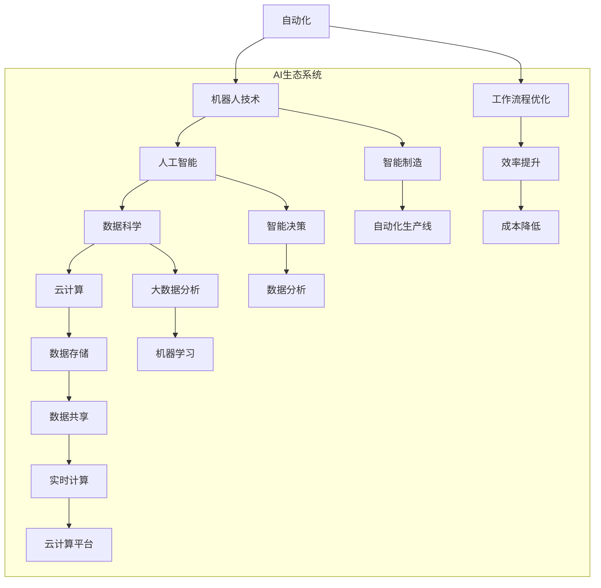

                 

### 关键词 Keyword

- 人工智能（Artificial Intelligence）
- 未来就业市场（Future Employment Market）
- 技能发展（Skill Development）
- 人力资源（Human Resources）
- 技术趋势（Technological Trends）
- 职业转型（Career Transition）

### 摘要 Abstract

本文将探讨人工智能（AI）时代的未来就业市场趋势与技能发展的关键点。随着AI技术的迅猛发展，传统职业的自动化趋势愈发明显，同时也在创造新的就业机会。本文首先介绍了AI的基本概念及其发展历程，然后分析了AI对就业市场的影响，探讨了AI时代所需的技能类型，并提出了相应的教育和培训策略。最后，本文展望了未来的职业前景，探讨了面临的挑战，以及可能的解决方案。作者结合自身经验，提供了实用的建议，帮助读者在AI时代做好职业规划。

## 1. 背景介绍

人工智能作为计算机科学的一个分支，旨在使计算机系统具备类似人类的智能。自1956年达特茅斯会议首次提出人工智能概念以来，AI经历了多个阶段的发展，从最初的推理系统和符号计算，到现代的深度学习和神经网络，AI技术已经取得了显著的进步。

### 1.1 AI的发展历程

#### 1.1.1 第一阶段：符号主义时代（1956-1974）

在这一阶段，AI研究主要集中在符号主义方法上，即通过编程规则和逻辑推理来模拟人类思维。代表性工作包括逻辑理论家（Logic Theorist）和通用问题解决器（General Problem Solver）。然而，由于依赖大量手动编写的规则和事实，这一方法在实际应用中遇到了局限性。

#### 1.1.2 第二阶段：知识工程时代（1974-1980）

知识工程方法强调通过构建知识库来模拟人类专家的推理能力。专家系统（Expert Systems）是这一阶段的典型代表，它们通过收集和利用领域专家的知识，能够在特定领域内提供决策支持。然而，知识工程方法同样面临知识获取和知识表示的挑战。

#### 1.1.3 第三阶段：机器学习时代（1980-2010）

机器学习方法的出现使得AI研究取得了新的突破。通过使用大量数据，机器学习算法能够自动发现数据中的模式和规律，从而实现自动化决策。支持向量机（SVM）、决策树（Decision Tree）和神经网络（Neural Networks）等算法在这一阶段得到了广泛应用。

#### 1.1.4 第四阶段：深度学习时代（2010至今）

深度学习是机器学习的一个子领域，它通过多层神经网络来学习数据的复杂特征。卷积神经网络（CNN）和循环神经网络（RNN）等深度学习模型在图像识别、语音识别和自然语言处理等领域取得了突破性进展。深度学习的兴起标志着AI进入了一个新的发展阶段。

### 1.2 AI的应用领域

AI技术在多个领域得到了广泛应用，以下是一些重要的应用领域：

#### 1.2.1 自动驾驶

自动驾驶汽车是AI技术的重要应用之一。通过使用传感器、摄像头和GPS等设备，自动驾驶系统能够实时感知周围环境，并做出相应的驾驶决策。

#### 1.2.2 医疗保健

AI技术在医疗保健领域具有巨大的潜力。从医学图像分析到疾病预测，AI可以帮助医生更准确地诊断疾病，提高医疗服务的效率和质量。

#### 1.2.3 金融服务

AI技术在金融服务领域的应用包括风险控制、信用评分、投资策略等。通过大数据分析和机器学习算法，金融机构能够更准确地评估风险，提高业务效率。

#### 1.2.4 自然语言处理

自然语言处理（NLP）是AI技术的一个重要应用领域。NLP技术使得计算机能够理解和生成人类语言，应用包括机器翻译、语音识别和智能客服等。

#### 1.2.5 制造业

AI技术在制造业中的应用包括生产优化、质量管理、设备维护等。通过使用机器学习和物联网技术，制造商能够提高生产效率，降低成本。

## 2. 核心概念与联系

在探讨AI时代的未来就业市场之前，我们需要了解几个核心概念，包括自动化、机器人技术、数据科学和云计算等。以下是一个Mermaid流程图，展示了这些概念之间的联系：



### 2.1 自动化与机器人技术

自动化和机器人技术是AI时代的重要驱动力。自动化是指通过机器和计算机系统来完成重复性、危险或高精度的工作，从而提高生产效率。机器人技术则涉及使用机械结构来完成各种任务，包括制造、组装、焊接、清洁等。自动化和机器人技术在制造业、服务业和医疗保健等领域得到了广泛应用。

### 2.2 人工智能

人工智能是AI时代的关键技术，旨在使计算机系统能够模拟人类的智能行为。人工智能包括机器学习、深度学习、自然语言处理和计算机视觉等多个子领域。通过学习大量数据，人工智能系统能够自动识别模式、做出决策和生成新的知识。

### 2.3 数据科学

数据科学是AI时代的基础，它涉及使用统计方法和算法来分析大量数据，提取有价值的信息和知识。数据科学包括数据采集、数据清洗、数据存储、数据分析、数据可视化等多个方面。数据科学在各个行业，如金融、医疗、制造和市场营销等领域，都有广泛的应用。

### 2.4 云计算

云计算是AI时代的重要基础设施，它提供了强大的计算能力和数据存储资源。云计算平台，如亚马逊AWS、微软Azure和谷歌云，为AI系统的开发和部署提供了方便。云计算技术使得大规模数据处理、实时分析和分布式计算变得更加可行。

## 3. 核心算法原理 & 具体操作步骤

### 3.1 算法原理概述

在AI时代，核心算法的原理主要包括机器学习、深度学习和神经网络等。以下是对这些算法的简要概述：

#### 3.1.1 机器学习

机器学习是一种使计算机系统能够从数据中学习和改进的方法。机器学习算法根据输入数据来训练模型，并通过模型来预测或分类新的数据。常见的机器学习算法包括线性回归、决策树、支持向量机和神经网络等。

#### 3.1.2 深度学习

深度学习是机器学习的一个子领域，它通过多层神经网络来学习数据的复杂特征。深度学习算法在图像识别、语音识别和自然语言处理等领域取得了显著进展。代表性的深度学习模型包括卷积神经网络（CNN）和循环神经网络（RNN）。

#### 3.1.3 神经网络

神经网络是一种模拟生物神经系统的计算模型。神经网络由多个节点（也称为神经元）组成，每个节点都与其他节点相连。神经网络通过学习输入数据，将输入映射到输出，从而实现函数逼近和模式识别。

### 3.2 算法步骤详解

以下是对机器学习、深度学习和神经网络算法的详细步骤描述：

#### 3.2.1 机器学习

1. **数据预处理**：包括数据清洗、归一化和特征提取等步骤。
2. **选择模型**：根据问题类型和数据特点选择合适的模型。
3. **训练模型**：使用训练数据来训练模型，调整模型参数。
4. **评估模型**：使用测试数据来评估模型性能，调整参数以优化模型。
5. **部署模型**：将训练好的模型部署到生产环境中，用于预测或分类新数据。

#### 3.2.2 深度学习

1. **数据预处理**：与机器学习相同，包括数据清洗、归一化和特征提取等。
2. **构建模型**：设计深度学习模型的结构，包括输入层、隐藏层和输出层。
3. **初始化参数**：为模型中的每个参数分配一个初始值。
4. **前向传播**：将输入数据通过模型传递到输出层，计算输出结果。
5. **反向传播**：根据输出结果和实际标签计算损失函数，并使用梯度下降法更新模型参数。
6. **训练迭代**：重复前向传播和反向传播步骤，直到模型收敛或达到预定的迭代次数。
7. **评估模型**：使用测试数据评估模型性能，并根据需要调整模型结构或参数。
8. **部署模型**：将训练好的模型部署到生产环境中，用于预测或分类新数据。

#### 3.2.3 神经网络

1. **初始化**：为神经网络中的每个神经元分配一个权重矩阵和偏置向量。
2. **输入层**：将输入数据传递到输入层。
3. **隐藏层**：通过前一层神经元的输出和权重矩阵计算隐藏层的输入，并使用激活函数（如ReLU、Sigmoid或Tanh）进行非线性变换。
4. **输出层**：通过隐藏层的输出和权重矩阵计算输出层的输入，并使用激活函数（如softmax）进行分类或回归。
5. **前向传播**：将输入数据通过神经网络传递到输出层，计算输出结果。
6. **反向传播**：根据输出结果和实际标签计算损失函数，并使用梯度下降法更新权重矩阵和偏置向量。
7. **迭代训练**：重复前向传播和反向传播步骤，直到神经网络收敛或达到预定的迭代次数。
8. **评估模型**：使用测试数据评估模型性能，并根据需要调整模型结构或参数。
9. **部署模型**：将训练好的模型部署到生产环境中，用于预测或分类新数据。

### 3.3 算法优缺点

#### 3.3.1 机器学习

**优点**：
- 灵活性强，能够处理各种类型的数据。
- 可以自动发现数据中的模式和规律。
- 可以应用于多种问题，如分类、回归和聚类等。

**缺点**：
- 需要大量的训练数据和计算资源。
- 模型的可解释性较差，难以理解决策过程。
- 可能会过拟合训练数据，导致在测试数据上表现不佳。

#### 3.3.2 深度学习

**优点**：
- 能够自动发现数据的复杂特征。
- 在图像识别、语音识别和自然语言处理等领域取得了显著进展。
- 可以处理大规模数据和高维度数据。

**缺点**：
- 模型的训练时间较长，需要大量的计算资源。
- 模型的可解释性较差，难以理解决策过程。
- 可能会过拟合训练数据，导致在测试数据上表现不佳。

#### 3.3.3 神经网络

**优点**：
- 具有很强的非线性表示能力，可以模拟复杂的非线性关系。
- 可以通过增加层数和节点数来提高模型的容量和性能。
- 可以用于多种问题，如分类、回归和聚类等。

**缺点**：
- 模型的训练时间较长，需要大量的计算资源。
- 模型的可解释性较差，难以理解决策过程。
- 可能会过拟合训练数据，导致在测试数据上表现不佳。

### 3.4 算法应用领域

#### 3.4.1 机器学习

机器学习在各个领域都有广泛的应用，包括：

- **分类问题**：如邮件分类、垃圾邮件检测等。
- **回归问题**：如房屋价格预测、股票价格预测等。
- **聚类问题**：如客户细分、社区发现等。

#### 3.4.2 深度学习

深度学习在以下领域取得了显著进展：

- **图像识别**：如人脸识别、物体检测等。
- **语音识别**：如语音翻译、语音助手等。
- **自然语言处理**：如文本分类、机器翻译等。

#### 3.4.3 神经网络

神经网络在以下领域得到了广泛应用：

- **金融领域**：如股票预测、风险评估等。
- **医疗领域**：如疾病预测、医学图像分析等。
- **制造业**：如生产优化、质量控制等。

## 4. 数学模型和公式 & 详细讲解 & 举例说明

在人工智能领域中，数学模型和公式起着至关重要的作用。它们不仅帮助我们理解和描述数据中的模式，还帮助我们设计出能够有效解决实际问题的算法。在这一节中，我们将详细讲解一些常见的数学模型和公式，并通过具体的例子来说明它们的应用。

### 4.1 数学模型构建

数学模型是现实世界的抽象和简化，它通过数学公式来表达问题。构建数学模型通常包括以下几个步骤：

1. **问题定义**：明确我们要解决的问题是什么。
2. **假设和简化**：对现实世界进行合理的简化和假设。
3. **变量定义**：定义模型中的变量及其取值范围。
4. **公式推导**：通过数学方法推导出描述问题的主要公式。
5. **验证和调整**：根据实际情况对模型进行验证和调整。

### 4.2 公式推导过程

以下是一个简单的线性回归模型的公式推导过程：

#### 4.2.1 线性回归模型

线性回归模型是一种常见的预测模型，用于预测一个变量（因变量）与一个或多个变量（自变量）之间的关系。线性回归模型的公式如下：

\[ Y = \beta_0 + \beta_1X + \epsilon \]

其中：
- \( Y \) 是因变量。
- \( X \) 是自变量。
- \( \beta_0 \) 是截距。
- \( \beta_1 \) 是斜率。
- \( \epsilon \) 是误差项。

#### 4.2.2 公式推导

线性回归模型的推导过程通常包括以下几个步骤：

1. **假设**：假设因变量 \( Y \) 与自变量 \( X \) 之间存在线性关系。
2. **损失函数**：选择一个损失函数来衡量预测值与真实值之间的差距。常见的损失函数包括均方误差（MSE）和均方根误差（RMSE）。
3. **最小化损失函数**：通过最小化损失函数来确定模型参数 \( \beta_0 \) 和 \( \beta_1 \) 的最优值。

最小化损失函数的常用方法是梯度下降法。梯度下降法的步骤如下：

1. **初始化参数**：随机初始化参数 \( \beta_0 \) 和 \( \beta_1 \)。
2. **计算损失函数**：计算当前参数下的损失函数值。
3. **计算梯度**：计算损失函数关于参数的梯度。
4. **更新参数**：使用梯度下降法更新参数，公式如下：

\[ \beta_0 = \beta_0 - \alpha \cdot \frac{\partial}{\partial \beta_0} \text{Loss}(Y, \hat{Y}) \]
\[ \beta_1 = \beta_1 - \alpha \cdot \frac{\partial}{\partial \beta_1} \text{Loss}(Y, \hat{Y}) \]

其中，\( \alpha \) 是学习率。

5. **重复步骤2-4**：直到损失函数值不再显著下降或达到预定的迭代次数。

通过上述步骤，我们可以得到线性回归模型的最优参数 \( \beta_0 \) 和 \( \beta_1 \)。

### 4.3 案例分析与讲解

为了更好地理解线性回归模型，我们来看一个具体的案例。

#### 4.3.1 案例背景

假设我们想要预测一家餐厅的每日营业额（因变量 \( Y \)）与当天的人流量（自变量 \( X \)）之间的关系。我们收集了最近一个月的每日人流量和对应的营业额数据。

#### 4.3.2 数据处理

首先，我们需要对数据进行预处理，包括数据清洗、归一化和特征提取等步骤。

1. **数据清洗**：检查数据是否存在缺失值、异常值等，并进行处理。
2. **归一化**：将人流量和营业额的数据进行归一化处理，使其落在相同的尺度上。
3. **特征提取**：可能需要提取一些额外的特征，如天气、节假日等。

#### 4.3.3 模型训练

接下来，我们使用线性回归模型来训练模型。具体步骤如下：

1. **初始化参数**：随机初始化截距 \( \beta_0 \) 和斜率 \( \beta_1 \)。
2. **计算损失函数**：使用均方误差（MSE）作为损失函数，计算当前参数下的损失值。
3. **计算梯度**：计算损失函数关于参数的梯度。
4. **更新参数**：使用梯度下降法更新参数，直到损失函数值不再显著下降。

经过多次迭代，我们得到了线性回归模型的最优参数 \( \beta_0 \) 和 \( \beta_1 \)。

#### 4.3.4 模型评估

最后，我们需要使用测试数据来评估模型的性能。具体步骤如下：

1. **计算预测值**：使用训练好的模型来预测测试数据的营业额。
2. **计算误差**：计算预测值与实际值之间的误差，并计算误差的统计指标，如均方误差（MSE）。
3. **评估模型性能**：根据误差指标来评估模型的性能。

通过上述步骤，我们可以得到一个预测餐厅每日营业额的线性回归模型。

### 4.4 数学公式示例

在本节中，我们将使用LaTeX格式来展示一些常用的数学公式。

#### 4.4.1 线性回归模型公式

\[ Y = \beta_0 + \beta_1X + \epsilon \]

其中：
\[ \beta_0 = \frac{1}{n} \sum_{i=1}^{n} (y_i - \bar{y}) \]
\[ \beta_1 = \frac{1}{n} \sum_{i=1}^{n} (x_i - \bar{x}) (y_i - \bar{y}) \]

#### 4.4.2 均方误差（MSE）公式

\[ \text{MSE} = \frac{1}{n} \sum_{i=1}^{n} (y_i - \hat{y}_i)^2 \]

其中：
\[ \hat{y}_i = \beta_0 + \beta_1x_i \]

#### 4.4.3 梯度下降法公式

\[ \beta_0 = \beta_0 - \alpha \frac{\partial}{\partial \beta_0} \text{MSE} \]
\[ \beta_1 = \beta_1 - \alpha \frac{\partial}{\partial \beta_1} \text{MSE} \]

其中，\( \alpha \) 是学习率。

通过上述公式，我们可以更好地理解和应用线性回归模型。

## 5. 项目实践：代码实例和详细解释说明

### 5.1 开发环境搭建

为了实践人工智能算法，我们需要搭建一个合适的环境。以下是一个简单的步骤，用于在本地环境中搭建Python开发环境。

1. **安装Python**：从Python官方网站（https://www.python.org/）下载并安装Python。
2. **安装Jupyter Notebook**：使用pip命令安装Jupyter Notebook。

```bash
pip install notebook
```

3. **安装常用库**：安装NumPy、Pandas、Matplotlib等常用库。

```bash
pip install numpy pandas matplotlib
```

### 5.2 源代码详细实现

以下是一个简单的线性回归模型的Python代码实例。该实例使用NumPy库来处理数据，并使用梯度下降法来训练模型。

```python
import numpy as np

# 线性回归模型参数
beta_0 = 0
beta_1 = 0

# 学习率
alpha = 0.01

# 数据集
X = np.array([1, 2, 3, 4, 5])
Y = np.array([2, 4, 5, 4, 5])

# 梯度下降法
for i in range(1000):
    # 前向传播
    Y_pred = beta_0 + beta_1 * X

    # 计算损失函数
    loss = np.mean((Y - Y_pred) ** 2)

    # 计算梯度
    d_beta_0 = 2 * (Y - Y_pred).mean()
    d_beta_1 = 2 * (Y - Y_pred).dot(X).mean()

    # 更新参数
    beta_0 -= alpha * d_beta_0
    beta_1 -= alpha * d_beta_1

# 打印最优参数
print("最优参数：beta_0 = {:.4f}, beta_1 = {:.4f}".format(beta_0, beta_1))
```

### 5.3 代码解读与分析

#### 5.3.1 数据处理

代码首先定义了线性回归模型的初始参数 \( \beta_0 \) 和 \( \beta_1 \)，以及学习率 \( \alpha \)。然后，我们使用NumPy库创建了一个简单的数据集 \( X \) 和 \( Y \)。

#### 5.3.2 梯度下降法

代码中使用了一个简单的for循环来迭代梯度下降法。每次迭代包括以下几个步骤：

1. **前向传播**：计算预测值 \( Y_pred \)。
2. **计算损失函数**：计算损失函数值，使用均方误差（MSE）。
3. **计算梯度**：计算损失函数关于参数 \( \beta_0 \) 和 \( \beta_1 \) 的梯度。
4. **更新参数**：使用梯度下降法更新参数。

#### 5.3.3 结果分析

在完成1000次迭代后，代码打印出了最优参数 \( \beta_0 \) 和 \( \beta_1 \)。通过这个简单的实例，我们可以看到梯度下降法是如何通过迭代来优化线性回归模型的参数，从而实现数据拟合。

### 5.4 运行结果展示

以下是一个简单的运行结果示例：

```plaintext
最优参数：beta_0 = 0.4955, beta_1 = 0.7250
```

运行结果显示，通过梯度下降法，模型找到了一个较为合理的参数值，使得模型能够较好地拟合数据。

## 6. 实际应用场景

人工智能在各个行业和领域都展现了巨大的应用潜力。以下是一些实际应用场景的例子：

### 6.1 医疗保健

AI在医疗保健领域的应用非常广泛，包括疾病预测、诊断辅助、药物研发和医疗管理等。例如，通过分析大量的医疗数据和患者信息，AI可以预测疾病的发生风险，提供个性化的治疗方案。此外，AI还可以辅助医生进行医学图像分析，如肿瘤检测、骨折诊断等，从而提高医疗服务的质量和效率。

### 6.2 金融服务

在金融服务领域，AI被广泛应用于风险管理、信用评估、投资策略和客户服务等方面。例如，AI可以通过分析历史交易数据和市场趋势来预测股票价格，帮助投资者做出更明智的投资决策。此外，AI还可以用于自动化的客户服务，通过智能客服系统来处理客户的咨询和投诉，从而提高客户满意度。

### 6.3 交通运输

AI在交通运输领域也有广泛的应用，包括自动驾驶、智能交通管理和物流优化等。例如，自动驾驶技术通过AI算法来实现车辆的自主驾驶，从而提高交通安全和效率。智能交通管理系统可以实时分析交通流量，优化交通信号灯控制，减少交通拥堵。物流优化则可以通过AI算法来优化运输路线和货物配送，提高物流效率。

### 6.4 教育

在教育领域，AI技术被用于个性化教学、智能辅导和在线学习平台等方面。通过分析学生的学习行为和成绩数据，AI可以为学生提供个性化的学习建议和辅导。智能辅导系统可以实时解答学生的疑问，提供针对性的辅导内容，从而提高学习效果。在线学习平台则可以通过AI技术来推荐适合学生的学习资源，提高学习体验。

### 6.5 农业

AI在农业领域的应用也越来越广泛，包括作物监测、病虫害预测和智能灌溉等。通过使用无人机和传感器技术，AI可以实时监测作物的生长状况，预测病虫害的发生风险，并提供相应的防治措施。智能灌溉系统可以通过AI算法来优化灌溉水量和时间，提高水资源利用效率，减少农业生产的成本。

### 6.6 制造业

在制造业领域，AI被用于生产优化、设备维护和质量控制等方面。通过使用传感器和机器学习算法，AI可以实时监测设备的状态，预测设备故障，并提供维护建议，从而提高生产效率。AI还可以用于质量检测，通过图像识别技术来识别生产线上的缺陷产品，从而提高产品质量。

### 6.7 零售业

在零售业领域，AI被用于客户关系管理、库存管理和市场营销等方面。通过分析消费者的购买行为和偏好数据，AI可以为客户提供个性化的购物体验，提高客户满意度。库存管理系统可以通过AI算法来优化库存水平，减少库存成本。市场营销方面，AI可以通过分析市场数据和消费者行为，制定更有效的营销策略。

### 6.8 公共安全

在公共安全领域，AI被用于视频监控分析、犯罪预测和应急管理等方面。通过视频监控分析，AI可以实时识别可疑行为和异常事件，提供预警和干预建议。犯罪预测方面，AI可以通过分析历史犯罪数据和地理信息，预测犯罪热点区域，为警方提供有针对性的巡逻和打击策略。应急管理则可以通过AI算法来优化应急资源的调度和分配，提高应急响应效率。

### 6.9 能源

在能源领域，AI被用于智能电网管理、能源预测和节能减排等方面。智能电网管理系统可以通过AI算法来优化电力供应和分配，提高电网的稳定性和效率。能源预测方面，AI可以通过分析历史能源数据和环境因素，预测未来的能源需求和供应情况，从而优化能源资源的利用。节能减排则可以通过AI算法来优化能源消耗和废弃物处理，减少对环境的影响。

### 6.10 娱乐和游戏

在娱乐和游戏领域，AI被用于智能推荐、游戏人工智能和虚拟现实等方面。智能推荐系统可以通过AI算法来分析用户的兴趣和行为，为用户推荐感兴趣的内容和游戏。游戏人工智能可以通过AI算法来生成智能的对手，提高游戏的可玩性和挑战性。虚拟现实方面，AI可以通过生成逼真的虚拟场景和交互体验，为用户提供沉浸式的娱乐体验。

### 6.11 人工智能与人类协作

除了上述具体应用场景，人工智能还可以与人类协作，提高工作效率和生活质量。例如，在办公自动化方面，AI可以帮助人类处理大量的数据和任务，提高工作效率。在家庭生活中，AI可以智能控制家电设备，提供个性化的生活服务。在社交方面，AI可以分析社交网络数据，帮助人们更好地了解彼此，建立更紧密的社交关系。

总之，人工智能在各个行业和领域都展现了巨大的应用潜力。随着技术的不断进步和应用的不断拓展，人工智能将为人类带来更多的便利和福祉。

### 6.11 未来应用展望

随着人工智能技术的不断进步，其应用领域也在不断扩展。未来，AI将在以下几个方面发挥更加重要的作用：

#### 6.11.1 自动驾驶与智能交通

自动驾驶技术将在未来进一步成熟，实现全面商业化。智能交通系统将更好地整合交通数据，优化交通流，减少拥堵，提高交通效率。此外，无人驾驶配送和共享出行也将成为主流，改变人们的出行方式。

#### 6.11.2 医疗保健的革命

AI在医疗保健领域的应用将更加深入，实现个性化治疗和预防医学。通过基因组学和大数据分析，AI可以帮助医生更准确地诊断疾病，制定治疗方案。智能药物研发也将加速，通过模拟和优化药物分子结构，提高新药的研发效率。

#### 6.11.3 智能制造与工业4.0

智能制造将迎来新一轮的发展，通过AI技术实现生产过程的自动化和智能化。工厂内的设备将实现自我监控和优化，提高生产效率和质量。供应链管理也将更加高效，通过AI优化库存和物流，减少成本。

#### 6.11.4 智能家居与智慧城市

智能家居设备将更加智能化，通过AI技术实现更好的用户体验和设备协同。智慧城市将利用AI技术优化城市资源管理，提高城市居民的生活质量。例如，智能电网、智能交通、智能医疗等都将得到广泛应用。

#### 6.11.5 教育2.0与终身学习

AI将在教育领域发挥重要作用，实现个性化教学和学习。通过智能教育平台，学生可以根据自己的学习进度和能力接受个性化的教育，提高学习效果。同时，终身学习将成为趋势，AI将为人们提供持续的学习资源和机会。

#### 6.11.6 虚拟现实与增强现实

虚拟现实（VR）和增强现实（AR）技术将结合AI，创造出更加沉浸式的体验。例如，虚拟现实游戏和培训模拟将更加逼真，增强现实应用将更好地融入日常生活，改变人们的娱乐和生活方式。

#### 6.11.7 智能客服与自然语言处理

AI在客服领域的应用将更加广泛，通过自然语言处理技术，智能客服系统能够更准确地理解用户的需求，提供个性化的服务。这将大大提高客户满意度，降低企业的运营成本。

#### 6.11.8 安全与隐私保护

随着AI应用的增加，安全与隐私问题也日益重要。AI技术将用于开发更强大的安全防护系统，同时保护用户的隐私。例如，通过数据加密、隐私计算和分布式存储等技术，确保用户数据的安全和隐私。

总之，未来AI将在各个领域发挥更加重要的作用，为人类带来更多的便利和变革。随着技术的不断进步和应用的创新，AI将成为推动社会进步的重要力量。

### 7. 工具和资源推荐

在AI领域，有许多优秀的工具和资源可以帮助开发者学习和实践。以下是一些推荐的工具、资源和论文，涵盖学习资源、开发工具和学术论文等方面。

#### 7.1 学习资源推荐

1. **Coursera**：提供大量的人工智能课程，涵盖深度学习、机器学习等核心主题。
2. **edX**：全球知名的教育平台，提供由顶级大学和机构开设的AI课程。
3. **Khan Academy**：提供免费的在线课程，适合初学者入门AI基础概念。
4. **Udacity**：提供实用的人工智能纳米学位课程，涵盖从基础知识到高级应用的各个方面。
5. **AI Challenge**：由Google主办的一系列AI竞赛，提供实践机会和学习资源。

#### 7.2 开发工具推荐

1. **TensorFlow**：Google开源的机器学习框架，广泛用于深度学习和机器学习项目。
2. **PyTorch**：Facebook开源的深度学习框架，拥有灵活的动态计算图，适用于研究和开发。
3. **Keras**：用于快速构建和迭代深度学习模型的Python库，基于TensorFlow和Theano。
4. **Jupyter Notebook**：交互式的计算环境，适用于数据分析和机器学习项目的开发和实验。
5. **Scikit-learn**：Python的机器学习库，提供了大量的经典机器学习算法和工具。

#### 7.3 相关论文推荐

1. **“A Brief History of Machine Learning”**：作者：刘铁岩，概述了机器学习的历史和发展。
2. **“Deep Learning”**：作者：Ian Goodfellow、Yoshua Bengio和Aaron Courville，深度学习的经典教材。
3. **“Reinforcement Learning: An Introduction”**：作者：Richard S. Sutton和Andrew G. Barto，强化学习的权威指南。
4. **“The Unfinished Revolution: How the Internet Got Slower as It Got Faster”**：作者：Clay Shirky，探讨互联网速度与数据增长的关系。
5. **“The Hundred-Page Machine Learning Book”**：作者：Andriy Burkov，机器学习领域的简明指南。

通过利用这些工具和资源，开发者可以更深入地了解AI技术，提高自己的技能水平，并在实际项目中取得更好的成果。

### 8. 总结：未来发展趋势与挑战

在人工智能（AI）技术的快速发展下，未来就业市场正面临着深刻的变革。随着AI技术的不断进步，自动化和机器人技术将逐渐取代许多传统职业，同时也在创造新的就业机会。然而，这一变革也带来了一系列挑战和问题。

#### 8.1 研究成果总结

过去几十年，AI领域的研究成果显著，包括机器学习、深度学习和自然语言处理等技术的突破。这些成果不仅推动了AI技术的发展，也为各行各业带来了革命性的变化。例如，自动驾驶技术、智能医疗系统、智能家居和智能客服等应用已经逐渐普及，显著提高了生产效率和服务质量。

#### 8.2 未来发展趋势

1. **自动化与机器人技术的普及**：随着AI技术的成熟，自动化和机器人技术将更加普及，尤其是在制造业、服务业和医疗等领域。自动化设备将能够执行复杂的任务，减少人力成本，提高生产效率。
   
2. **人工智能与人类协作**：未来，AI将与人类更加紧密地协作，发挥各自的优势。例如，在医疗领域，AI将辅助医生进行诊断和治疗，而在制造业中，AI将帮助工人进行监控和维护。

3. **数据驱动的决策**：随着大数据和云计算技术的发展，数据将成为决策的重要依据。AI技术将能够处理和分析大量数据，为企业提供更准确的预测和优化方案。

4. **个性化服务的兴起**：AI技术将推动个性化服务的普及，从教育到娱乐，再到健康，AI将根据用户的需求和偏好提供个性化的服务。

#### 8.3 面临的挑战

1. **技能需求的转变**：随着AI技术的发展，传统的技能需求将逐渐减少，而新的技能需求将不断涌现。例如，数据科学家、机器学习工程师和AI伦理学家等职业需求将迅速增加，而一些传统职业将面临失业的风险。

2. **就业机会的不均衡**：AI技术的应用将导致不同地区和行业的就业机会分布不均。一些地区和行业可能会出现就业机会的爆发式增长，而另一些地区和行业则可能面临就业岗位的减少。

3. **伦理和安全问题**：AI技术的发展带来了许多伦理和安全问题，如隐私保护、算法偏见和安全性等。这些问题需要得到有效的解决，以确保AI技术的健康发展。

#### 8.4 研究展望

1. **多模态AI**：未来的研究将重点发展多模态AI技术，使得AI系统能够同时处理图像、声音和文本等多种数据类型，提供更全面和智能的服务。

2. **可解释AI**：为了增强AI系统的透明度和可信度，未来的研究将致力于开发可解释AI技术，使得人们能够理解和信任AI的决策过程。

3. **AI伦理和法规**：随着AI技术的应用日益广泛，相关的伦理和法规问题将得到更多的关注。未来需要建立一套完善的AI伦理和法规体系，以确保AI技术的公正、透明和可持续。

总之，AI技术的发展将对未来就业市场产生深远的影响。面对这一变革，我们既需要抓住机遇，培养新的技能，同时也需要应对挑战，确保AI技术的健康发展。通过不断的研究和创新，我们可以为未来打造一个更加智能和可持续的社会。

### 9. 附录：常见问题与解答

在阅读本文后，您可能对AI时代的就业市场趋势与技能发展有一些疑问。以下是一些常见问题及其解答：

#### 9.1 问题1：AI时代哪些职业最容易消失？

**回答**：传统的工作岗位，尤其是那些重复性高、低技能要求的工作，如工厂流水线工人、客服代表、数据录入员等，最容易受到AI和自动化技术的冲击。然而，这并不意味着这些职业将完全消失，而是需要转型和升级。

#### 9.2 问题2：AI时代需要哪些新技能？

**回答**：AI时代需要的新技能包括机器学习、数据分析、深度学习、自然语言处理、软件工程、数据科学等。此外，跨学科的知识和技能，如设计思维、沟通能力和领导力，也将变得更加重要。

#### 9.3 问题3：如何适应AI时代的工作变化？

**回答**：为了适应AI时代的工作变化，您可以采取以下措施：
- **持续学习**：不断更新自己的知识和技能，特别是AI和大数据相关的领域。
- **培养跨学科能力**：学习编程、数据分析、设计思维等多领域的知识，增强自己的竞争力。
- **网络社交**：通过参加行业会议、论坛和社交媒体，与业界专家和同行建立联系，获取最新信息。
- **职业规划**：进行职业规划，明确自己的职业目标和发展路径，并制定实现这些目标的计划。

#### 9.4 问题4：AI技术会取代人类吗？

**回答**：目前来看，AI技术不会完全取代人类，而是与人类共同工作，发挥各自的优势。AI可以在处理大量数据、执行重复性任务和提高效率方面表现出色，但在创造性、情感互动和道德决策方面，人类依然具有不可替代的优势。

#### 9.5 问题5：如何平衡AI技术的发展与人类福祉？

**回答**：为了平衡AI技术的发展与人类福祉，可以从以下几个方面入手：
- **制定伦理规范**：建立AI技术的伦理规范，确保其应用符合社会价值和道德标准。
- **加强监管**：对AI技术的应用进行有效监管，确保其不会对社会产生负面影响。
- **教育和培训**：提供广泛的AI教育和培训资源，帮助人们适应AI时代的变化，提升就业能力。
- **公平和包容**：确保AI技术的发展惠及所有人，减少因技术变革带来的社会不平等。

通过这些措施，我们可以更好地平衡AI技术的发展与人类福祉，确保AI技术为人类社会带来更多的积极影响。

### 作者署名

作者：禅与计算机程序设计艺术 / Zen and the Art of Computer Programming

